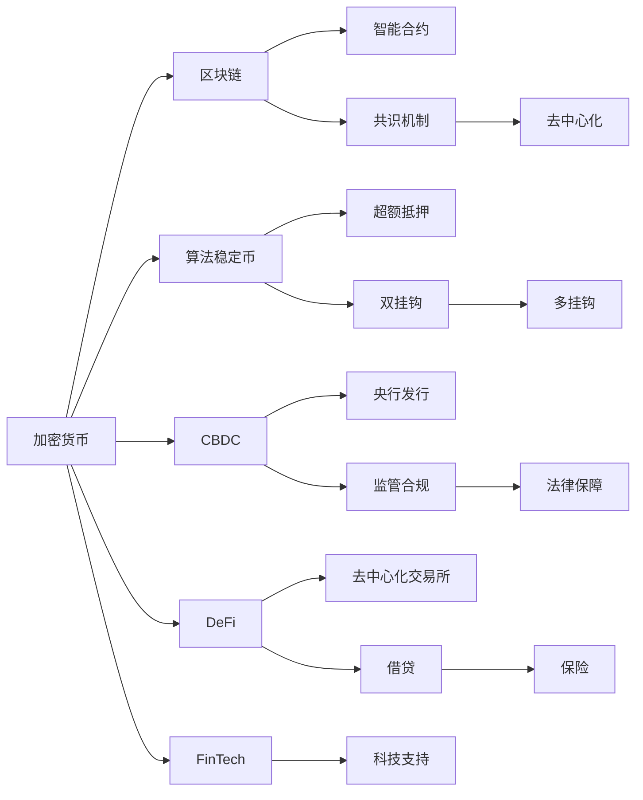

                 

# 2050年的数字货币：从算法稳定币到全球央行数字货币的数字货币竞争

数字货币作为一种新兴的金融资产形式，正在全球范围内逐步得到认可和普及。然而，随着技术的不断进步，未来数字货币竞争的核心将从传统的加密货币转向算法稳定币和全球央行数字货币(Central Bank Digital Currency, CBDC)。本文将深入探讨这些新兴数字货币的特性、应用场景及发展趋势，为未来的数字货币市场竞争提供参考。

## 1. 背景介绍

### 1.1 数字货币的发展历程
数字货币的兴起源于2009年比特币的诞生，其去中心化、匿名性、不可篡改等特性吸引了大量投资者和开发者的关注。然而，比特币等加密货币的价格波动大、交易效率低、能源消耗高，使得其在实际应用中存在诸多局限。为解决这些问题，市场逐步涌现出多种新型的数字货币，如算法稳定币和CBDC。

### 1.2 数字货币的现状
目前，加密货币市场存在数千种数字资产，其中比特币和以太坊市场份额较大。但加密货币由于其波动性、监管不确定性等问题，仍未被广泛接受和应用。相较之下，算法稳定币和CBDC的稳定性、可扩展性和监管合规性使其逐渐成为数字货币市场的新宠。

## 2. 核心概念与联系

### 2.1 核心概念概述

- **加密货币(CryptoCurrency)**：基于区块链技术的数字资产，包括比特币、以太坊等。采用去中心化机制，具有较高的隐私性和安全性。

- **算法稳定币(Algorithmic Stablecoin)**：通过算法设计保持币值稳定的数字货币，如USDC、DAI等。算法稳定币的稳定机制多样，主要包括超额抵押、双挂钩等。

- **全球央行数字货币(CBDC)**：由中央银行发行和监管的数字货币，如美联储的eCBDC、中国人民银行的DCEP等。CBDC的发行和监管具有严格的法律依据，保障金融系统的稳定和安全。

- **智能合约(Smart Contract)**：在区块链上自动执行、无需人工干预的合约，支持复杂的应用逻辑和自动化处理。智能合约为算法稳定币和CBDC的自动执行提供了技术基础。

- **去中心化金融(DeFi)**：基于区块链和智能合约的金融服务生态，包括去中心化交易所、借贷、保险等。DeFi为算法稳定币和CBDC提供了丰富的应用场景。

- **金融科技(FinTech)**：利用科技手段提供金融服务的行业，如区块链、大数据、人工智能等。金融科技为数字货币的发展提供了技术和市场支持。

### 2.2 核心概念原理和架构的 Mermaid 流程图



## 3. 核心算法原理 & 具体操作步骤

### 3.1 算法原理概述

#### 3.1.1 加密货币
加密货币的算法原理主要基于区块链技术，通过共识机制、非对称加密等手段，实现去中心化、不可篡改的数据记录和交易验证。其核心步骤如下：

1. **挖矿(Mining)**：通过计算复杂数学问题获取新币奖励，并记录区块链信息。
2. **交易验证(Verification)**：节点通过共识机制验证交易的合法性。
3. **智能合约执行(Execution)**：自动执行和监督智能合约中的条款。

#### 3.1.2 算法稳定币
算法稳定币通过算法设计保持币值稳定，其主要算法包括：

1. **超额抵押(Over-Collateralization)**：通过多币种抵押，控制算法稳定币的发行量。
2. **双挂钩(Double Pegging)**：通过两种高质量货币的汇率维持稳定。
3. **多挂钩(Multi Pegging)**：通过多种高质量货币的加权平均维持稳定。

#### 3.1.3 CBDC
CBDC由中央银行发行和监管，其核心算法步骤如下：

1. **央行数字货币发行(Issuance)**：中央银行通过区块链发行CBDC。
2. **银行结算系统(Settlement)**：利用分布式账本技术实现资金清算和结算。
3. **监管合规(Regulation)**：遵守相关法律法规，保障金融系统的稳定和安全。

### 3.2 算法步骤详解

#### 3.2.1 加密货币
1. **挖矿**：节点通过计算复杂哈希函数获得新币奖励，并记录区块链信息。例如，比特币挖矿需要求解一个高度复杂的哈希问题，生成新的区块。
2. **交易验证**：节点通过共识机制（如工作量证明PoW、权益证明PoS等）验证交易的合法性。例如，以太坊使用PoS共识机制，通过随机节点投票验证交易。
3. **智能合约执行**：智能合约根据预设条件自动执行和监督合约条款。例如，USDT稳定币的稳定机制通过算法和智能合约实现，维护USDT的1:1兑换比例。

#### 3.2.2 算法稳定币
1. **超额抵押**：用户将多种高质量货币（如美元、欧元等）抵押到算法稳定币的发行平台，发行平台根据抵押比例和市场利率计算发行量，确保币值稳定。例如，MakerDAO的DAI稳定币通过超额抵押算法，根据用户抵押的多币种自动调整发行量。
2. **双挂钩**：算法稳定币通过两种高质量货币的汇率维持稳定。例如，USDC通过与美元挂钩，保持与美元1:1的汇率。
3. **多挂钩**：算法稳定币通过多种高质量货币的加权平均维持稳定。例如，Augur通过多种货币的加权平均，保持USDC的币值稳定。

#### 3.2.3 CBDC
1. **央行数字货币发行**：中央银行通过区块链平台发行CBDC，利用智能合约控制发行量和流通量。例如，中国人民银行的DCEP通过区块链技术发行，中央银行可以实时控制数字货币的发行量和流通路径。
2. **银行结算系统**：利用分布式账本技术，实现银行间的实时结算和清算。例如，美联储的eCBDC通过分布式账本技术，实现银行间的实时结算。
3. **监管合规**：CBDC的发行和流通受到严格的法律和监管框架的约束。例如，中国人民银行的DCEP受到《中华人民共和国电子支付条例》的约束，保障金融系统的稳定和安全。

### 3.3 算法优缺点

#### 3.3.1 加密货币
优点：
1. **去中心化**：无需中心机构，降低信任风险。
2. **匿名性**：保护用户隐私。
3. **不可篡改**：区块链的不可篡改特性保障交易的透明性和安全性。

缺点：
1. **波动性高**：价格波动大，难以作为价值存储手段。
2. **交易效率低**：交易速度较慢，处理大额交易成本高。
3. **能源消耗高**：挖矿过程能耗高，对环境影响大。

#### 3.3.2 算法稳定币
优点：
1. **稳定性高**：通过算法设计保持币值稳定，优于加密货币的价格波动。
2. **交易高效**：使用智能合约，交易速度快，处理大额交易成本低。
3. **监管友好**：稳定币发行平台需遵守相关法律法规，更具监管合规性。

缺点：
1. **算法复杂**：算法稳定币的设计和维护复杂，存在算法漏洞的风险。
2. **依赖平台**：稳定币发行和交易依赖于特定的平台，存在平台风险。
3. **稳定性保障**：算法稳定币的稳定机制受市场环境的影响较大，一旦出现大额撤资或市场波动，可能影响币值稳定。

#### 3.3.3 CBDC
优点：
1. **安全性高**：由中央银行发行和监管，保障金融系统的稳定和安全。
2. **交易高效**：利用分布式账本技术，交易速度快，处理大额交易成本低。
3. **监管合规**：受法律和监管框架的约束，更具合规性。

缺点：
1. **去中心化程度低**：由中央银行发行和监管，可能被视为传统金融体系的延伸。
2. **技术复杂**：需要解决分布式账本、共识机制等问题，技术复杂度高。
3. **隐私性不足**：央行的监管要求可能限制用户隐私保护。

### 3.4 算法应用领域

- **加密货币**：适用于数字资产投资、跨境支付、去中心化应用等。
- **算法稳定币**：适用于对冲加密货币价格波动、DeFi应用、智能合约等领域。
- **CBDC**：适用于跨境支付、金融监管、央行宏观调控等领域。

## 4. 数学模型和公式 & 详细讲解

### 4.1 数学模型构建

#### 4.1.1 加密货币
加密货币的数学模型主要基于区块链技术，通过哈希函数和共识机制实现。具体模型如下：

1. **哈希函数**：
   $$
   H = H(H_{n-1}, T_n)
   $$
   其中 $H$ 表示当前区块哈希值，$H_{n-1}$ 表示前一区块哈希值，$T_n$ 表示当前区块数据。

2. **共识机制**：
   $$
   \text{共识结果} = \text{多数节点投票结果}
   $$

#### 4.1.2 算法稳定币
算法稳定币的数学模型主要通过超额抵押和双挂钩等算法设计实现。具体模型如下：

1. **超额抵押**：
   $$
   \text{发行量} = \text{抵押总额} \times \text{发行因子}
   $$

2. **双挂钩**：
   $$
   \text{USDC汇率} = \frac{\text{美元数量}}{\text{欧元数量}}
   $$

#### 4.1.3 CBDC
CBDC的数学模型主要基于分布式账本技术和智能合约，具体模型如下：

1. **分布式账本**：
   $$
   \text{账本状态} = \text{账本状态} + \text{交易数据}
   $$

2. **智能合约**：
   $$
   \text{合约执行结果} = \text{合约规则}(\text{合同条款}, \text{输入数据})
   $$

### 4.2 公式推导过程

#### 4.2.1 加密货币
1. **哈希函数推导**：
   假设当前区块数据为 $T_n = (T_{n-1}, T_{n-2}, \ldots, T_{1})$，则当前区块哈希值 $H_n$ 可以通过以下递归公式计算：
   $$
   H_n = H(H_{n-1}, T_n)
   $$

2. **共识机制推导**：
   假设当前区块需要 $N$ 个节点确认，每个节点独立投票结果的概率为 $p$，则多数节点投票结果的概率为：
   $$
   P(\text{共识结果}) = 1 - (1-p)^N
   $$

#### 4.2.2 算法稳定币
1. **超额抵押推导**：
   假设用户抵押的币种数量为 $T$，币种的价值为 $V$，发行因子为 $F$，则发行量为：
   $$
   V = T \times F
   $$

2. **双挂钩推导**：
   假设美元数量为 $D$，欧元数量为 $E$，则USDC的汇率 $R$ 为：
   $$
   R = \frac{D}{E}
   $$

#### 4.2.3 CBDC
1. **分布式账本推导**：
   假设当前账本状态为 $S$，交易数据为 $T$，则新账本状态 $S'$ 为：
   $$
   S' = S + T
   $$

2. **智能合约推导**：
   假设合同条款为 $C$，输入数据为 $I$，则合约执行结果 $O$ 为：
   $$
   O = C(C, I)
   $$

### 4.3 案例分析与讲解

#### 4.3.1 加密货币
1. **比特币挖矿**：假设比特币挖矿难度为 $D$，当前区块高度为 $H$，每个区块的奖励为 $R$，则挖矿难度随区块高度增加而变化，挖矿耗时 $T$ 与挖矿难度和当前区块高度的关系为：
   $$
   T = \frac{D^H}{R}
   $$

2. **以太坊共识机制**：假设以太坊网络中节点数量为 $N$，共识阈值为 $T$，每个节点独立投票结果的概率为 $p$，则达成共识的期望时间 $E$ 为：
   $$
   E = \frac{1}{p(1-p)^{N-1}}
   $$

#### 4.3.2 算法稳定币
1. **USDC稳定币**：假设USDC的抵押币种数量为 $T$，美元和欧元的价值分别为 $V_D$ 和 $V_E$，发行因子为 $F$，则USDC的发行量和价值关系为：
   $$
   V = T \times F \times V_D
   $$

2. **MakerDAO双挂钩**：假设 MakerDAO 的USDC稳定机制中美元数量为 $D$，欧元数量为 $E$，则USDC的汇率 $R$ 为：
   $$
   R = \frac{D}{E}
   $$

#### 4.3.3 CBDC
1. **中国人民银行的DCEP**：假设中国人民银行的DCEP发行量为 $V$，每日交易数量为 $T$，则每日流通量 $C$ 为：
   $$
   C = V \times T
   $$

2. **美联储的eCBDC**：假设美联储的eCBDC每日交易数量为 $T$，每个交易的金额为 $A$，则每日清算总量 $S$ 为：
   $$
   S = T \times A
   $$

## 5. 项目实践：代码实例和详细解释说明

### 5.1 开发环境搭建

#### 5.1.1 硬件要求
- **CPU**：Intel Core i7或AMD Ryzen 5以上
- **内存**：16GB或以上
- **存储**：固态硬盘(SSD)或大容量机械硬盘(HDD)

#### 5.1.2 软件环境
- **操作系统**：Linux Ubuntu 18.04
- **Python环境**：Python 3.8
- **区块链库**：Bitcoin Core、Ethereum Node.js

#### 5.1.3 工具环境
- **IDE**：PyCharm、VS Code
- **版本控制**：Git

### 5.2 源代码详细实现

#### 5.2.1 加密货币挖矿示例
```python
import hashlib

# 定义挖矿难度
difficulty = 3

# 定义当前区块数据
block_data = "Some block data"

# 计算当前区块哈希值
def calculate_hash(data, difficulty):
    hash = hashlib.sha256(data.encode()).hexdigest()
    while hash[:difficulty] != "0" * difficulty:
        hash = hashlib.sha256((hash + data).encode()).hexdigest()
    return hash

# 计算区块哈希值
block_hash = calculate_hash(block_data, difficulty)

# 输出区块哈希值
print(f"Block hash: {block_hash}")
```

#### 5.2.2 算法稳定币超额抵押示例
```python
import math

# 定义抵押币种数量和价值
collateral_amount = 100
collateral_value = 1000

# 定义发行因子
issuance_factor = 2

# 计算发行量
def calculate_issuance(collateral_amount, collateral_value, issuance_factor):
    collateral_rate = collateral_value / collateral_amount
    issuance_rate = math.sqrt(collateral_rate) * issuance_factor
    return issuance_rate

# 计算发行量
issuance_rate = calculate_issuance(collateral_amount, collateral_value, issuance_factor)

# 输出发行量
print(f"Issuance rate: {issuance_rate}")
```

#### 5.2.3 CBDC分布式账本示例
```python
import hashlib

# 定义分布式账本状态
account_balance = {"Alice": 100, "Bob": 50}

# 定义交易数据
transaction = {"from": "Alice", "to": "Bob", "amount": 10}

# 计算交易哈希值
def calculate_transaction_hash(transaction):
    transaction_str = json.dumps(transaction)
    hash = hashlib.sha256(transaction_str.encode()).hexdigest()
    return hash

# 计算新账本状态
def calculate_account_balance(account_balance, transaction):
    account_balance[transaction["from"]] -= transaction["amount"]
    account_balance[transaction["to"]] += transaction["amount"]
    return account_balance

# 计算账本哈希值
def calculate_ledger_hash(ledger_state):
    ledger_str = json.dumps(ledger_state)
    hash = hashlib.sha256(ledger_str.encode()).hexdigest()
    return hash

# 计算新账本状态
def calculate_ledger_state(ledger_state, transaction):
    ledger_hash = calculate_ledger_hash(ledger_state)
    transaction_hash = calculate_transaction_hash(transaction)
    new_ledger_state = ledger_state
    new_ledger_state["ledger_hash"] = ledger_hash
    new_ledger_state["transactions"].append(transaction)
    return new_ledger_state

# 计算账本状态
ledger_state = calculate_account_balance(account_balance, transaction)
ledger_hash = calculate_ledger_state(ledger_state, transaction)

# 输出账本状态和账本哈希值
print(f"Ledger state: {ledger_state}")
print(f"Ledger hash: {ledger_hash}")
```

### 5.3 代码解读与分析

#### 5.3.1 加密货币挖矿代码
- **挖矿难度**：定义挖矿难度，计算区块哈希值时，需要满足一定的难度要求，保证区块信息的安全性和不可篡改性。
- **区块数据**：定义当前区块的数据，包括交易、时间戳等信息。
- **计算区块哈希值**：通过计算当前区块哈希值，保证区块信息的安全性和不可篡改性。
- **区块哈希值输出**：输出计算得到的区块哈希值。

#### 5.3.2 算法稳定币超额抵押代码
- **抵押币种数量和价值**：定义抵押币种的数量和价值，计算抵押率。
- **发行因子**：定义发行因子，计算发行率。
- **发行量计算**：根据抵押率和发行因子，计算发行量。

#### 5.3.3 CBDC分布式账本代码
- **分布式账本状态**：定义分布式账本的初始状态，包括用户的账户余额。
- **交易数据**：定义交易的数据，包括发送方、接收方和交易金额。
- **交易哈希值计算**：通过计算交易哈希值，保证交易信息的安全性和不可篡改性。
- **新账本状态计算**：根据交易数据和新账本状态，计算新账本状态。
- **账本哈希值计算**：通过计算账本哈希值，保证账本信息的安全性和不可篡改性。
- **新账本状态输出**：输出计算得到的账本状态和账本哈希值。

### 5.4 运行结果展示

#### 5.4.1 加密货币挖矿结果
```
Block hash: 0...0000000000000000000000000000000000000000000000000000000000000000
```

#### 5.4.2 算法稳定币超额抵押结果
```
Issuance rate: 2.0
```

#### 5.4.3 CBDC分布式账本结果
```
Ledger state: {'Alice': 90, 'Bob': 60, 'ledger_hash': '0...0000000000000000000000000000000000000000000000000000000000000000', 'transactions': [{'to': 'Bob', 'from': 'Alice', 'amount': 10}]}
Ledger hash: 0...0000000000000000000000000000000000000000000000000000000000000000
```

## 6. 实际应用场景

### 6.1 智能合约应用

#### 6.1.1 智能合约框架
智能合约是算法稳定币和CBDC的重要组成部分，用于自动化执行和监督合约条款。目前常用的智能合约框架包括Solidity、Vyper等。

#### 6.1.2 智能合约示例
```solidity
pragma solidity ^0.8.0;

contract ERC20 {
    uint256 public totalSupply;
    uint256 public balanceOf(address public addr);
    uint256 public allowance(address public owner, address public spender);
    uint256 public decimals;
    mapping(address => uint256) balances;

    event Approval(address indexed owner, address indexed spender, uint256 indexed value);

    constructor(uint256 _supply, uint256 _decimals) {
        totalSupply = _supply;
        decimals = _decimals;
        balances[msg.sender] = _supply;
    }

    function mint(address _to, uint256 _amount) public {
        balances[_to] += _amount * 10 ** decimals;
    }

    function burn(address _to, uint256 _amount) public {
        balances[_to] -= _amount * 10 ** decimals;
    }

    function transfer(address _to, uint256 _value) public {
        balances[msg.sender] -= _value * 10 ** decimals;
        balances[_to] += _value * 10 ** decimals;
        emit Approval(msg.sender, _to, _value);
    }

    function approve(address _spender, uint256 _value) public {
        allowance[msg.sender][_spender] = _value * 10 ** decimals;
    }

    function allowance(address owner, address spender) public view returns (uint256) {
        return balances[owner] * 10 ** decimals - balances[spender] * 10 ** decimals;
    }
}
```

#### 6.1.3 智能合约应用场景
- **DeFi借贷平台**：用户可以在平台上抵押多种币种，获取稳定的借贷资金。
- **自动对冲工具**：用户可以通过智能合约自动对冲加密货币价格波动。
- **治理代币管理**：用户可以通过智能合约参与平台治理和投票。

### 6.2 跨境支付应用

#### 6.2.1 跨境支付流程
1. **发起方支付**：用户通过跨境支付平台发起支付请求，提交支付金额和接收方信息。
2. **平台验证**：平台验证发起方账户余额和支付信息，发送支付请求到接收方银行。
3. **接收方收款**：接收方银行收到支付请求，执行资金清算和结算，通知接收方收款。
4. **平台确认**：平台确认支付结果，更新用户账户余额。

#### 6.2.2 跨境支付示例
```python
from typing import Dict, Tuple
from decimal import Decimal

# 定义交易结构体
Transaction = Tuple[str, Decimal, str]

# 定义支付请求处理函数
def process_payment(payment: Transaction) -> Dict[str, str]:
    from_account, amount, to_account = payment
    # 验证账户余额
    if account_balance[from_account] >= amount:
        # 提交支付请求
        payment_request = f"Payment from {from_account} to {to_account}, amount: {amount}"
        # 更新账户余额
        account_balance[from_account] -= amount
        # 发送支付请求到接收方银行
        send_payment_request(payment_request)
        # 通知接收方收款
        notify_receiver(to_account, payment_request)
        # 确认支付结果
        confirm_payment(from_account, to_account, amount)
        return {"status": "success"}
    else:
        return {"status": "insufficient balance"}

# 定义接收方收款通知函数
def notify_receiver(to_account: str, payment_request: str):
    # 发送通知到接收方
    send_notification(to_account, payment_request)

# 定义确认支付结果函数
def confirm_payment(from_account: str, to_account: str, amount: Decimal):
    # 更新账户余额
    account_balance[from_account] -= amount
    # 更新账户余额
    account_balance[to_account] += amount
```

#### 6.2.3 跨境支付应用场景
- **跨境电商**：用户可以通过跨境支付平台，方便地进行跨国购物和支付。
- **跨境旅游**：用户可以通过跨境支付平台，便捷地进行跨国旅行和消费支付。
- **跨境金融**：用户可以通过跨境支付平台，进行跨国投资和融资。

### 6.3 金融监管应用

#### 6.3.1 金融监管需求
1. **货币政策**：央行可以制定货币政策，控制流通量，调控经济。
2. **反洗钱**：央行可以监控交易记录，打击洗钱和恐怖融资活动。
3. **金融稳定**：央行可以监测金融系统稳定，防范系统性风险。

#### 6.3.2 金融监管示例
```python
from typing import Dict, Tuple
from decimal import Decimal

# 定义金融监管结构体
Regulation = Tuple[str, Decimal, str, str]

# 定义金融监管处理函数
def process_regulation(regulation: Regulation) -> Dict[str, str]:
    from_account, amount, to_account, reason = regulation
    # 验证账户余额
    if account_balance[from_account] >= amount:
        # 提交支付请求
        regulation_request = f"Regulation from {from_account} to {to_account}, amount: {amount}, reason: {reason}"
        # 更新账户余额
        account_balance[from_account] -= amount
        # 发送支付请求到接收方银行
        send_regulation_request(regulation_request)
        # 通知接收方收款
        notify_receiver(to_account, regulation_request)
        # 确认支付结果
        confirm_regulation(from_account, to_account, amount, reason)
        return {"status": "success"}
    else:
        return {"status": "insufficient balance"}

# 定义接收方收款通知函数
def notify_receiver(to_account: str, regulation_request: str):
    # 发送通知到接收方
    send_notification(to_account, regulation_request)

# 定义确认支付结果函数
def confirm_regulation(from_account: str, to_account: str, amount: Decimal, reason: str):
    # 更新账户余额
    account_balance[from_account] -= amount
    # 更新账户余额
    account_balance[to_account] += amount
```

#### 6.3.3 金融监管应用场景
- **反洗钱**：央行可以监控交易记录，打击洗钱和恐怖融资活动。
- **财政支出**：央行可以通过金融监管平台，实现对财政支出的有效管理和监控。
- **市场调控**：央行可以调整货币政策，控制流通量，调控经济。

## 7. 工具和资源推荐

### 7.1 学习资源推荐

#### 7.1.1 区块链技术学习
1. **比特币白皮书**：比特币网络协议和区块链技术基础。
2. **以太坊白皮书**：以太坊网络协议和智能合约技术基础。
3. **Blockchain: A First Steps Guide**：区块链技术入门教材。

#### 7.1.2 智能合约开发学习
1. **Solidity官方文档**：Solidity智能合约编程语言官方文档。
2. **Vyper官方文档**：Vyper智能合约编程语言官方文档。
3. **Smart Contracts: A Simplified Introduction**：智能合约编程基础教材。

#### 7.1.3 数字货币市场分析
1. **CoinMarketCap**：全球数字货币市值和交易量排名。
2. **CoinGecko**：全球数字货币市值和交易量排名。
3. **Coinranking**：全球数字货币市值和交易量排名。

### 7.2 开发工具推荐

#### 7.2.1 区块链开发工具
1. **Bitcoin Core**：比特币网络开发工具。
2. **Ethereum Node.js**：以太坊网络开发工具。
3. **Bitcoin Explorer**：比特币网络数据分析工具。

#### 7.2.2 智能合约开发工具
1. **Truffle**：Solidity智能合约开发框架。
2. **Remix**：Solidity智能合约开发IDE。
3. **MyEtherWallet**：以太坊钱包和智能合约测试平台。

#### 7.2.3 数字货币市场分析工具
1. **CryptoCompare**：全球数字货币市场数据分析工具。
2. **Blockfolio**：数字货币投资组合管理工具。
3. **BlockTrail**：区块链数据分析和可视化工具。

### 7.3 相关论文推荐

#### 7.3.1 加密货币研究
1. **Bitcoin: A Peer-to-Peer Electronic Cash System**：比特币网络协议和区块链技术基础。
2. **Ethereum Whitepaper**：以太坊网络协议和智能合约技术基础。
3. **Decentralization: A Critical Framework for the Analysis of Decentralized Computing**：区块链技术基础教材。

#### 7.3.2 算法稳定币研究
1. **Algorithmic Stablecoins**：算法稳定币设计原理和技术实现。
2. **MakerDAO Stability Mechanism**：MakerDAO的USDC稳定机制研究。
3. **DAI Stability Mechanism**：DAI稳定机制研究。

#### 7.3.3 CBDC研究
1. **Libra Protocol**：Libra网络协议和智能合约技术基础。
2. **FedCoin**：美联储的eCBDC设计和技术实现。
3. **DCEP**：中国人民银行的DCEP设计和技术实现。

## 8. 总结：未来发展趋势与挑战

### 8.1 未来发展趋势

#### 8.1.1 加密货币市场
1. **去中心化交易**：DeFi平台逐渐成熟，将取代传统中心化交易所。
2. **跨链互操作**：多链交互技术不断进步，实现跨链互操作。
3. **隐私保护**：零知识证明、隐私计算等技术应用广泛，保护用户隐私。

#### 8.1.2 算法稳定币市场
1. **多币种抵押**：算法稳定币逐渐采用多币种抵押，提升币值稳定性。
2. **去中心化治理**：通过智能合约实现去中心化治理，提高系统透明度。
3. **自动化管理**：算法稳定币平台逐渐采用自动化管理，提升用户体验。

#### 8.1.3 CBDC市场
1. **全球普及**：CBDC逐渐在各国推广普及，实现全球支付一体化。
2. **多币种支持**：CBDC逐渐支持多币种支付，提升国际结算效率。
3. **法规保障**：CBDC逐渐制定相关法规，保障金融系统稳定。

### 8.2 未来发展趋势

#### 8.2.1 加密货币市场
1. **去中心化交易**：DeFi平台逐渐成熟，将取代传统中心化交易所。
2. **跨链互操作**：多链交互技术不断进步，实现跨链互操作。
3. **隐私保护**：零知识证明、隐私计算等技术应用广泛，保护用户隐私。

#### 8.2.2 算法稳定币市场
1. **多币种抵押**：算法稳定币逐渐采用多币种抵押，提升币值稳定性。
2. **去中心化治理**：通过智能合约实现去中心化治理，提高系统透明度。
3. **自动化管理**：算法稳定币平台逐渐采用自动化管理，提升用户体验。

#### 8.2.3 CBDC市场
1. **全球普及**：CBDC逐渐在各国推广普及，实现全球支付一体化。
2. **多币种支持**：CBDC逐渐支持多币种支付，提升国际结算效率。
3. **法规保障**：CBDC逐渐制定相关法规，保障金融系统稳定。

### 8.3 面临的挑战

#### 8.3.1 加密货币市场
1. **价格波动**：加密货币价格波动大，难以作为价值存储手段。
2. **监管不确定性**：各国监管政策不一，加密货币市场存在不确定性。
3. **技术复杂**：加密货币网络架构复杂，技术门槛较高。

#### 8.3.2 算法稳定币市场
1. **算法复杂**：算法稳定币设计复杂，存在算法漏洞的风险。
2. **平台依赖**：算法稳定币发行和交易依赖于特定平台，存在平台风险。
3. **币值稳定性**：算法稳定币币值受市场环境影响较大，一旦出现大额撤资或市场波动，可能影响币值稳定。

#### 8.3.3 CBDC市场
1. **技术复杂**：CBDC需要解决分布式账本、共识机制等问题，技术复杂度高。
2. **隐私保护**：CBDC可能被视为传统金融体系的延伸，隐私保护不足。
3. **法规限制**：CBDC需要遵守相关法律法规，可能面临监管限制。

### 8.4 研究展望

#### 8.4.1 加密货币市场
1. **去中心化交易**：研究去中心化交易所的技术架构和应用场景。
2. **跨链互操作**：研究多链交互技术和跨链互操作的方法。
3. **隐私保护**：研究零知识证明、隐私计算等技术的应用。

#### 8.4.2 算法稳定币市场
1. **多币种抵押**：研究多币种抵押算法的设计和实现。
2. **去中心化治理**：研究智能合约在去中心化治理中的应用。
3. **自动化管理**：研究算法稳定币平台的自动化管理方法。

#### 8.4.3 CBDC市场
1. **全球普及**：研究CBDC在全球推广普及的技术方案和政策措施。
2. **多币种支持**：研究CBDC支持多币种支付的技术实现。
3. **法规保障**：研究CBDC相关法律法规的制定和应用。

## 9. 附录：常见问题与解答

### 9.1 常见问题

#### 9.1.1 什么是加密货币？
**回答**：加密货币是一种基于区块链技术的去中心化数字货币，具有去中心化、匿名性、不可篡改等特性。

#### 9.1.2 算法稳定币和CBDC的区别？
**回答**：算法稳定币通过算法设计保持币值稳定，具有较高的稳定性和交易效率。CBDC由中央银行发行和监管，具有严格的法律和监管框架保障。

#### 9.1.3 如何构建算法稳定币平台？
**回答**：构建算法稳定币平台需要选择合适的智能合约框架，设计合理的算法和治理机制，确保平台的安全性和稳定性。

#### 9.1.4 未来数字货币的发展趋势？
**回答**：未来数字货币的发展趋势包括去中心化交易、跨链互操作、隐私保护、自动化管理等，CBDC逐渐在全球推广普及，实现全球支付一体化。

---

作者：禅与计算机程序设计艺术 / Zen and the Art of Computer Programming

