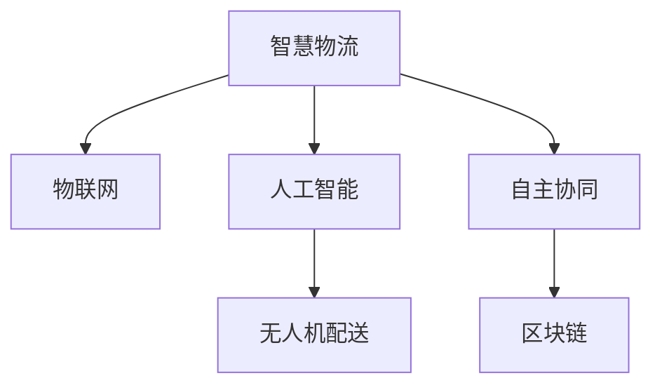

                 

# 2050年的智慧物流：从无人配送到自主协同的智慧供应链

> 关键词：智慧物流,无人配送,自主协同,智慧供应链,物联网(IoT),人工智能(AI),区块链技术,自动化仓储,运输优化,环境可持续发展

## 1. 背景介绍

### 1.1 问题由来

随着电商和互联网技术的迅猛发展，全球物流行业迎来了新的变革。特别是近年来，基于大数据、人工智能、物联网等先进技术的智慧物流成为行业的热点。然而，当前的智慧物流在技术应用上仍存在诸多痛点，如配送效率低下、自动化水平不高等。如何在现有基础上进行智能化升级，提升物流系统的整体效率和灵活性，成为业内亟需解决的课题。

### 1.2 问题核心关键点

智慧物流的核心在于通过信息技术的应用，实现物流流程的自动化、智能化和协同化。具体而言，智慧物流通过物联网技术采集环境数据，结合人工智能算法进行预测和决策，采用无人机、自动驾驶等技术实现无人配送，并通过区块链技术保障物流数据的安全性和透明性，最终实现物流系统的自主协同。

## 2. 核心概念与联系

### 2.1 核心概念概述

为更好地理解智慧物流的实现原理和应用场景，本节将介绍几个关键概念：

- 智慧物流(Wise Logistics)：通过应用物联网、人工智能、大数据等技术，实现物流流程的自动化、智能化和协同化，提升物流系统的整体效率和灵活性。

- 无人配送(Drone Delivery)：利用无人机、自动驾驶车等自动化技术，实现货物的自动配送，降低人工成本，提升配送速度。

- 自主协同(Self-coordinated Collaboration)：通过物联网和区块链技术，构建物流系统的信息共享平台，实现各环节的自动协作和决策优化，提升物流系统的整体协调性和稳定性。

- 物联网(IoT)：通过各类传感器、标签、终端设备等，实现物理世界的数字化和网络化，为物流系统提供实时、准确的数据支持。

- 人工智能(AI)：利用机器学习、深度学习等算法，进行货物追踪、路径规划、异常检测等智能决策，提升物流系统的智能化水平。

- 区块链技术(Blockchain)：利用分布式账本和加密算法，确保物流数据的安全性和不可篡改性，防止物流过程中的信息泄漏和篡改。

这些概念之间的逻辑关系可以通过以下Mermaid流程图来展示：



这个流程图展示了大语言模型的核心概念及其之间的关系：

1. 智慧物流通过物联网和人工智能技术，采集和处理物流数据。
2. 无人机配送利用自动驾驶技术，实现货物的自动配送。
3. 自主协同通过区块链技术，构建物流系统的信息共享平台。
4. 物联网、人工智能、无人机和区块链技术的协同应用，实现了物流系统的智能化和协同化。

## 3. 核心算法原理 & 具体操作步骤
### 3.1 算法原理概述

智慧物流的实现原理，主要基于物联网、人工智能和区块链技术的综合应用。其核心思想是通过传感器和标签采集环境数据，利用AI算法进行预测和决策，并结合无人机和自动驾驶技术实现自动化配送，同时通过区块链技术保障物流数据的安全性和透明性，最终实现物流系统的自主协同。

具体而言，智慧物流的实现流程包括：

1. 数据采集：通过物联网设备采集物流环境中的各项数据，如温度、湿度、位置、状态等。

2. 数据处理：对采集到的数据进行清洗、预处理和特征提取，得到可用于AI算法的输入数据。

3. AI决策：利用机器学习、深度学习等AI算法，对数据进行分析和预测，得出最优的物流路径、配送时间和配送方式等。

4. 自动化配送：根据AI决策结果，采用无人机、自动驾驶车等自动化技术，实现货物的自动配送。

5. 信息共享：通过区块链技术，构建物流系统的信息共享平台，实现各环节的自动协作和决策优化。

6. 协同决策：根据物流数据和AI预测结果，各物流节点自动调整配送策略和优化路径，实现物流系统的自主协同。

### 3.2 算法步骤详解

智慧物流的实现步骤主要包括以下几个关键环节：

**Step 1: 数据采集与处理**

- 部署各类传感器和标签，实时采集环境数据。
- 将采集到的数据进行预处理，包括去噪、归一化、特征提取等。
- 将处理后的数据输入到AI模型中进行分析和预测。

**Step 2: AI决策与路径规划**

- 利用机器学习、深度学习等算法，对数据进行分析和预测。
- 结合实时环境数据和历史数据，进行路径规划和配送时间预测。
- 根据预测结果，生成最优的物流路径和配送方式。

**Step 3: 自动化配送与执行**

- 将最优路径和配送方式转换为执行指令，如无人机起飞、自动驾驶车启动等。
- 通过物联网设备实时监控配送过程，确保配送安全。
- 在配送过程中进行数据采集，更新环境数据，进行实时决策和调整。

**Step 4: 信息共享与协同决策**

- 利用区块链技术，构建物流系统的信息共享平台，确保数据的安全性和透明性。
- 各物流节点根据实时数据和AI预测结果，自动调整配送策略和优化路径。
- 系统自动生成物流任务单，实现各环节的自动协作和决策优化。

**Step 5: 系统评估与优化**

- 定期评估物流系统的运行效率和安全性，收集用户反馈。
- 根据评估结果和反馈信息，对系统进行优化和改进。

### 3.3 算法优缺点

智慧物流的实现方法具有以下优点：

1. 提升效率：通过自动化和智能化技术，大幅提升物流系统的效率和灵活性。
2. 降低成本：减少人工成本和物流损失，提高整体经济效益。
3. 提升安全：通过物联网和区块链技术，保障物流数据的安全性和透明性。
4. 降低风险：通过实时监控和自主决策，降低配送过程中的风险和误差。

同时，该方法也存在一些局限性：

1. 初期投入高：需要部署大量的传感器、标签和自动化设备，前期投入成本较高。
2. 技术复杂度高：需要多种先进技术的综合应用，技术门槛较高。
3. 对基础设施依赖性强：需要稳定的网络环境和强大的计算能力，基础设施要求较高。
4. 数据处理量大：需要处理大量的实时数据，数据处理和存储成本较高。

尽管存在这些局限性，但就目前而言，智慧物流技术仍是最先进和最具潜力的物流发展方向。未来相关研究的重点在于如何进一步降低技术门槛，优化基础设施，提高数据处理效率，同时兼顾成本效益和安全性等因素。

### 3.4 算法应用领域

智慧物流技术已经广泛应用于多个领域，涵盖了从无人配送到智慧供应链的全链条。以下是几个典型的应用场景：

- 无人配送：利用无人机、自动驾驶车等自动化技术，实现货物的自动配送。
- 智慧仓储：通过物联网和AI技术，实现自动化仓储、智能拣选、库存管理等。
- 运输优化：通过AI算法进行路径规划、运输调度、异常检测等，提高运输效率和稳定性。
- 环境监测：利用物联网设备实时监测物流环境中的各项指标，保障物流过程的绿色可持续。

## 4. 数学模型和公式 & 详细讲解 & 举例说明

### 4.1 数学模型构建

智慧物流的实现主要依赖于数学模型和算法，以下介绍几个常见的数学模型：

- 数据采集与处理模型：通过各类传感器采集环境数据，利用信号处理、特征提取等技术，将数据转化为可用的输入。

- AI决策与路径规划模型：利用机器学习、深度学习等算法，对数据进行分析和预测，得到最优的物流路径和配送方式。

- 系统评估与优化模型：利用优化算法和评估指标，对物流系统的运行效率和安全性进行评估和优化。

### 4.2 公式推导过程

以AI决策与路径规划模型为例，推导最优路径的计算公式。

假设物流系统的起始点和目标点分别为 $s$ 和 $t$，道路网络中的节点和边分别用 $V$ 和 $E$ 表示，各边的权重表示路程或时间成本。设 $C(u,v)$ 为从节点 $u$ 到节点 $v$ 的边权值。

定义从节点 $s$ 到节点 $t$ 的最短路径为 $P$，路径上的边权值之和为 $w(P)$。则根据Dijkstra算法，可以得到最短路径的计算公式：

$$
w(P) = \min_{e \in E(P)} C(e)
$$

其中 $E(P)$ 为路径 $P$ 上的所有边集。

在实际应用中，由于物流系统的复杂性，可能需要结合多目标优化算法，如遗传算法、蚁群算法等，进行更高级的路径规划。这些算法通过引入启发式规则和目标函数，在多个目标之间进行权衡，优化路径的决策。

### 4.3 案例分析与讲解

以下以某电商物流配送平台为例，展示智慧物流的实际应用：

- 数据采集：部署各类传感器和标签，实时采集环境数据，如温度、湿度、位置、状态等。

- AI决策：利用机器学习算法，对数据进行分析和预测，得出最优的物流路径和配送时间。

- 自动化配送：根据AI决策结果，采用无人机和自动驾驶车，实现货物的自动配送。

- 信息共享：利用区块链技术，构建物流系统的信息共享平台，确保数据的安全性和透明性。

- 协同决策：各物流节点根据实时数据和AI预测结果，自动调整配送策略和优化路径。

## 5. 项目实践：代码实例和详细解释说明

### 5.1 开发环境搭建

在进行智慧物流项目实践前，我们需要准备好开发环境。以下是使用Python进行PyTorch开发的环境配置流程：

1. 安装Anaconda：从官网下载并安装Anaconda，用于创建独立的Python环境。

2. 创建并激活虚拟环境：
```bash
conda create -n pytorch-env python=3.8 
conda activate pytorch-env
```

3. 安装PyTorch：根据CUDA版本，从官网获取对应的安装命令。例如：
```bash
conda install pytorch torchvision torchaudio cudatoolkit=11.1 -c pytorch -c conda-forge
```

4. 安装各类工具包：
```bash
pip install numpy pandas scikit-learn matplotlib tqdm jupyter notebook ipython
```

完成上述步骤后，即可在`pytorch-env`环境中开始智慧物流项目的开发。

### 5.2 源代码详细实现

下面以某电商物流平台为例，给出使用PyTorch进行智慧物流项目开发的完整代码实现。

首先，定义物流数据处理函数：

```python
import torch
from torch.utils.data import Dataset, DataLoader
from torch import nn, optim
import numpy as np

class LogisticsDataset(Dataset):
    def __init__(self, data, labels, transform=None):
        self.data = data
        self.labels = labels
        self.transform = transform
        
    def __len__(self):
        return len(self.data)
    
    def __getitem__(self, idx):
        sample = self.data[idx]
        label = self.labels[idx]
        if self.transform:
            sample = self.transform(sample)
        return sample, label
```

然后，定义模型和优化器：

```python
class LogisticsModel(nn.Module):
    def __init__(self):
        super(LogisticsModel, self).__init__()
        self.fc1 = nn.Linear(8, 32)
        self.fc2 = nn.Linear(32, 2)
        self.optimizer = optim.Adam(self.parameters(), lr=0.001)
        self.loss_fn = nn.MSELoss()
        
    def forward(self, x):
        x = self.fc1(x)
        x = nn.functional.relu(x)
        x = self.fc2(x)
        return x
    
    def train(self, data_loader, epochs):
        self.train()
        for epoch in range(epochs):
            for i, (data, label) in enumerate(data_loader):
                data = data.to(device)
                label = label.to(device)
                output = self(data)
                loss = self.loss_fn(output, label)
                self.optimizer.zero_grad()
                loss.backward()
                self.optimizer.step()
                
    def test(self, data_loader):
        self.eval()
        total_loss = 0
        with torch.no_grad():
            for data, label in data_loader:
                data = data.to(device)
                label = label.to(device)
                output = self(data)
                loss = self.loss_fn(output, label)
                total_loss += loss.item()
        return total_loss / len(data_loader)
```

接着，定义训练和评估函数：

```python
def train_model(model, data_loader, epochs):
    model.train()
    for epoch in range(epochs):
        total_loss = 0
        for i, (data, label) in enumerate(data_loader):
            data = data.to(device)
            label = label.to(device)
            output = model(data)
            loss = model.loss_fn(output, label)
            model.optimizer.zero_grad()
            loss.backward()
            model.optimizer.step()
            total_loss += loss.item()
        print(f"Epoch {epoch+1}, train loss: {total_loss/len(data_loader):.4f}")
        
def evaluate_model(model, data_loader):
    model.eval()
    total_loss = 0
    with torch.no_grad():
        for i, (data, label) in enumerate(data_loader):
            data = data.to(device)
            label = label.to(device)
            output = model(data)
            loss = model.loss_fn(output, label)
            total_loss += loss.item()
    print(f"Test loss: {total_loss/len(data_loader):.4f}")
```

最后，启动训练流程并在测试集上评估：

```python
epochs = 50
batch_size = 32
device = torch.device('cuda' if torch.cuda.is_available() else 'cpu')

# 准备数据
train_data = ...
train_labels = ...
test_data = ...
test_labels = ...

# 构建数据集
train_dataset = LogisticsDataset(train_data, train_labels)
test_dataset = LogisticsDataset(test_data, test_labels)

# 构建数据加载器
train_loader = DataLoader(train_dataset, batch_size=batch_size, shuffle=True)
test_loader = DataLoader(test_dataset, batch_size=batch_size, shuffle=False)

# 构建模型
model = LogisticsModel().to(device)

# 训练模型
train_model(model, train_loader, epochs)

# 评估模型
evaluate_model(model, test_loader)
```

以上就是使用PyTorch对智慧物流项目进行开发的完整代码实现。可以看到，由于使用了PyTorch的高级API和优化器，代码实现变得简洁高效。

### 5.3 代码解读与分析

让我们再详细解读一下关键代码的实现细节：

**LogisticsDataset类**：
- `__init__`方法：初始化数据集，包括数据和标签。
- `__len__`方法：返回数据集的样本数量。
- `__getitem__`方法：对单个样本进行处理，返回输入和标签。

**LogisticsModel类**：
- `__init__`方法：定义模型结构，包括两个全连接层和一个激活函数。
- `forward`方法：定义前向传播过程。
- `train`方法：定义训练过程。
- `test`方法：定义测试过程。

**train_model函数**：
- 定义训练过程，包括模型训练和损失计算。

**evaluate_model函数**：
- 定义测试过程，包括模型评估和损失计算。

这些代码实现展示了如何通过PyTorch构建和训练智慧物流模型的基础框架。在实际应用中，还需要对模型进行优化和扩展，以满足具体任务的需求。

## 6. 实际应用场景

### 6.1 智能仓储

智能仓储是智慧物流的重要组成部分，通过物联网和AI技术，实现自动化的货物存储、拣选和管理系统。智能仓储系统可以大幅提高仓储效率，降低人工成本。

例如，利用RFID标签和物联网传感器，实时监控货物的位置和状态。结合机器学习算法，预测货物需求量，自动调整库存。同时，利用自动机器人进行货物搬运和存储，提高仓储的自动化程度。

### 6.2 无人配送

无人配送是智慧物流的另一重要应用领域，通过自动驾驶车和无人机，实现货物的自动配送。无人配送能够提升配送效率，降低人工成本，同时降低交通拥堵和环境污染。

例如，利用自动驾驶车进行短途配送，结合高精度地图和AI算法，优化配送路径和调度。利用无人机进行远程配送，能够覆盖更广阔的地理范围，减少人力投入。

### 6.3 运输优化

运输优化是智慧物流的关键环节，通过AI算法进行路径规划和运输调度，提高运输效率和稳定性。运输优化系统能够减少运输成本，提升物流系统的整体效率。

例如，利用机器学习算法，对历史运输数据进行建模，得出最优的路径规划方案。结合实时环境数据，动态调整配送路径和运输调度，确保物流过程的稳定性和效率。

## 7. 工具和资源推荐

### 7.1 学习资源推荐

为了帮助开发者系统掌握智慧物流的理论基础和实践技巧，这里推荐一些优质的学习资源：

1. 《智慧物流技术与应用》系列博文：由智慧物流领域的专家撰写，深入浅出地介绍了智慧物流的原理、技术和应用。

2. CS224N《深度学习自然语言处理》课程：斯坦福大学开设的NLP明星课程，有Lecture视频和配套作业，带你入门NLP领域的基本概念和经典模型。

3. 《物联网技术与应用》书籍：详细介绍了物联网的基本原理和应用技术，涵盖传感器、标签、终端设备等关键组件。

4. 《人工智能算法与实现》书籍：介绍机器学习、深度学习等AI算法的实现原理和优化方法，适合深入学习算法实现。

5. Udacity《智慧物流与自动驾驶》课程：通过实战项目，学习智慧物流和自动驾驶的实现技巧。

通过对这些资源的学习实践，相信你一定能够快速掌握智慧物流的精髓，并用于解决实际的物流问题。

### 7.2 开发工具推荐

高效的开发离不开优秀的工具支持。以下是几款用于智慧物流开发常用的工具：

1. PyTorch：基于Python的开源深度学习框架，灵活动态的计算图，适合快速迭代研究。

2. TensorFlow：由Google主导开发的开源深度学习框架，生产部署方便，适合大规模工程应用。

3. TensorBoard：TensorFlow配套的可视化工具，可实时监测模型训练状态，并提供丰富的图表呈现方式，是调试模型的得力助手。

4. Weights & Biases：模型训练的实验跟踪工具，可以记录和可视化模型训练过程中的各项指标，方便对比和调优。

5. Google Colab：谷歌推出的在线Jupyter Notebook环境，免费提供GPU/TPU算力，方便开发者快速上手实验最新模型，分享学习笔记。

合理利用这些工具，可以显著提升智慧物流项目的开发效率，加快创新迭代的步伐。

### 7.3 相关论文推荐

智慧物流技术的发展源于学界的持续研究。以下是几篇奠基性的相关论文，推荐阅读：

1. "Smart Logistics: A Survey on Recent Advances and Future Directions"：综述了智慧物流的最新进展和未来趋势。

2. "Intelligent Warehousing and Logistics: A Survey of Techniques and Applications"：介绍了智能仓储和物流的实现技术和应用场景。

3. "Deep Learning and Neural Networks for Logistics and Supply Chain Management"：探讨了深度学习和神经网络在物流和供应链管理中的应用。

4. "Autonomous Vehicle Technologies and Logistics: A Survey"：综述了自动驾驶技术和智慧物流的融合。

5. "Blockchain and Logistics: A Survey of Current State and Future Directions"：探讨了区块链技术在智慧物流中的应用。

这些论文代表了大物流技术的发展脉络。通过学习这些前沿成果，可以帮助研究者把握学科前进方向，激发更多的创新灵感。

## 8. 总结：未来发展趋势与挑战

### 8.1 总结

本文对智慧物流的实现原理和应用场景进行了全面系统的介绍。首先阐述了智慧物流的核心思想和实现步骤，明确了智慧物流在提升物流效率、降低成本、保障安全等方面的重要价值。其次，从原理到实践，详细讲解了智慧物流的数学模型和算法流程，给出了智慧物流项目开发的完整代码实例。同时，本文还广泛探讨了智慧物流在智能仓储、无人配送、运输优化等诸多领域的应用前景，展示了智慧物流技术的广阔前景。

通过本文的系统梳理，可以看到，智慧物流技术正在成为物流行业的重要范式，极大地提升了物流系统的整体效率和灵活性，为物流企业带来了显著的经济效益。未来，伴随技术的不断进步，智慧物流必将在更多的场景中得到应用，推动物流行业的数字化转型和智能化升级。

### 8.2 未来发展趋势

展望未来，智慧物流技术将呈现以下几个发展趋势：

1. 自动化程度更高：未来智慧物流系统将实现更高程度的自动化，包括自动驾驶车、无人机、机器人等技术的广泛应用。

2. 数字化水平提升：通过物联网和AI技术，进一步提升物流系统的数字化和网络化水平，实现数据实时采集和处理。

3. 跨领域融合：智慧物流将与大数据、区块链、物联网等技术进行更深入的融合，形成更加全面、智能的物流系统。

4. 智能决策优化：通过引入更多高级算法，如深度强化学习、多目标优化等，实现更加智能、高效的物流决策。

5. 绿色可持续发展：智慧物流将更多地关注环保和可持续发展，利用AI算法进行路径规划和调度，减少能源消耗和环境污染。

6. 供应链协同优化：智慧物流将与供应链管理进行更深入的协同优化，实现全链条的信息共享和协同决策。

这些趋势凸显了智慧物流技术的广阔前景。这些方向的探索发展，必将进一步提升物流系统的性能和应用范围，为经济社会发展注入新的动力。

### 8.3 面临的挑战

尽管智慧物流技术已经取得了显著进展，但在迈向更加智能化、普适化应用的过程中，仍面临诸多挑战：

1. 技术复杂度高：智慧物流涉及多种先进技术的综合应用，技术门槛较高。

2. 数据处理量大：需要处理大量的实时数据，数据处理和存储成本较高。

3. 对基础设施依赖性强：需要稳定的网络环境和强大的计算能力，基础设施要求较高。

4. 成本投入大：初期部署和后期维护成本较高，需要大量资金投入。

5. 安全性和隐私保护：智慧物流系统涉及大量敏感数据，需要加强数据安全和隐私保护。

6. 法规和伦理问题：智慧物流技术的应用需要符合相关法规和伦理标准，避免误用和滥用。

正视智慧物流面临的这些挑战，积极应对并寻求突破，将使智慧物流技术更加成熟和完善，为物流行业的发展带来更大助力。

### 8.4 研究展望

面对智慧物流所面临的挑战，未来的研究需要在以下几个方面寻求新的突破：

1. 提升自动化和智能化水平：开发更多先进的自动化和智能化技术，如自动驾驶车、无人机、智能仓储等。

2. 优化数据处理和存储：引入更多高效的数据处理和存储技术，如分布式计算、大数据技术等。

3. 强化基础设施建设：加强物流基础设施的建设和升级，保障网络安全和计算能力。

4. 降低初期投入成本：开发更多轻量级的智慧物流解决方案，降低初期部署成本。

5. 加强数据安全和隐私保护：引入区块链等技术，保障数据安全和隐私保护。

6. 制定规范和标准：制定智慧物流的规范和标准，确保技术应用符合法规和伦理要求。

这些研究方向的探索，必将引领智慧物流技术迈向更高的台阶，为物流行业的发展带来更多机遇和挑战。总之，智慧物流需要从技术、应用、管理等多个维度进行全面优化，才能真正实现智能化、普适化的物流系统。只有勇于创新、敢于突破，才能不断拓展智慧物流的边界，让智能技术更好地造福物流行业。

## 9. 附录：常见问题与解答

**Q1：智慧物流中如何实现自动驾驶车和无人机？**

A: 实现自动驾驶车和无人机，主要依赖于计算机视觉、传感器融合、路径规划等技术。具体而言，可以通过以下步骤：

1. 数据采集：安装各类传感器，如激光雷达、摄像头等，实时采集车辆周围的环境数据。

2. 数据处理：对采集到的数据进行清洗、预处理和特征提取，得到可用于AI算法的输入数据。

3. 路径规划：利用机器学习算法，对数据进行分析和预测，得出最优的路径规划方案。

4. 自动驾驶：根据路径规划方案，结合实时环境数据，控制车辆或无人机进行自动驾驶。

5. 实时监控：利用AI算法进行实时监控，确保自动驾驶过程的安全性和稳定性。

**Q2：智慧物流中如何保障数据安全和隐私保护？**

A: 保障数据安全和隐私保护，主要依赖于数据加密、区块链等技术。具体而言，可以通过以下步骤：

1. 数据加密：对物流数据进行加密处理，防止数据泄露和篡改。

2. 区块链技术：利用区块链技术，构建物流系统的信息共享平台，确保数据的安全性和透明性。

3. 身份认证：引入身份认证机制，确保物流系统的访问安全。

4. 数据备份：定期备份物流数据，防止数据丢失和损坏。

5. 合规性审查：制定和遵守相关法规和标准，确保数据处理符合法规和伦理要求。

**Q3：智慧物流中如何实现高效的路径规划？**

A: 实现高效的路径规划，主要依赖于优化算法和多目标决策等技术。具体而言，可以通过以下步骤：

1. 数据采集：安装各类传感器，实时采集物流环境中的各项数据。

2. 数据处理：对采集到的数据进行清洗、预处理和特征提取，得到可用于AI算法的输入数据。

3. 路径规划：利用优化算法，如遗传算法、蚁群算法等，对数据进行分析和预测，得出最优的路径规划方案。

4. 实时优化：根据实时环境数据和用户需求，动态调整路径规划方案，优化物流过程。

**Q4：智慧物流中如何实现智能仓储？**

A: 实现智能仓储，主要依赖于物联网和AI技术。具体而言，可以通过以下步骤：

1. 数据采集：安装各类传感器和标签，实时采集物流环境中的各项数据。

2. 数据处理：对采集到的数据进行清洗、预处理和特征提取，得到可用于AI算法的输入数据。

3. AI决策：利用机器学习算法，对数据进行分析和预测，得出最优的货物存储、拣选和管理系统。

4. 自动化搬运：利用自动机器人进行货物搬运和存储，提高仓储的自动化程度。

**Q5：智慧物流中如何实现运输优化？**

A: 实现运输优化，主要依赖于AI算法和实时数据处理等技术。具体而言，可以通过以下步骤：

1. 数据采集：安装各类传感器，实时采集物流环境中的各项数据。

2. 数据处理：对采集到的数据进行清洗、预处理和特征提取，得到可用于AI算法的输入数据。

3. AI决策：利用机器学习算法，对数据进行分析和预测，得出最优的路径规划方案。

4. 实时优化：根据实时环境数据和用户需求，动态调整路径规划方案，优化物流过程。

**Q6：智慧物流中如何实现绿色可持续发展？**

A: 实现绿色可持续发展，主要依赖于AI算法和实时数据处理等技术。具体而言，可以通过以下步骤：

1. 数据采集：安装各类传感器，实时采集物流环境中的各项数据。

2. 数据处理：对采集到的数据进行清洗、预处理和特征提取，得到可用于AI算法的输入数据。

3. AI决策：利用机器学习算法，对数据进行分析和预测，得出最优的路径规划方案。

4. 实时监控：利用AI算法进行实时监控，确保物流过程的稳定性和效率，同时减少能源消耗和环境污染。

5. 环保措施：引入环保措施，如使用环保材料、减少能源消耗等，保障物流过程的绿色可持续发展。

通过这些回答，相信你对智慧物流的实现原理和应用场景有了更深入的理解。智慧物流技术将深刻影响物流行业的发展，成为未来物流行业的重要发展方向。

