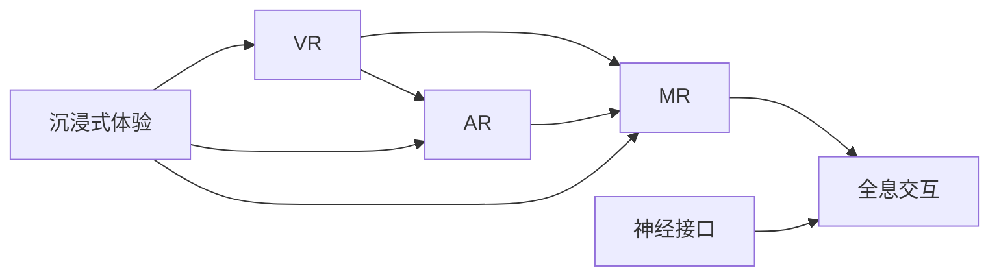

                 

# 2050年的虚拟现实：从游戏到生活的沉浸式体验

## 1. 背景介绍

随着技术的飞速发展，虚拟现实（Virtual Reality, VR）已经从游戏领域扩展到更广泛的现实生活场景。2050年，VR技术将以全新的形态，进一步融合到人们的日常生活中，带来颠覆性的沉浸式体验。本文将探讨2050年VR技术的关键发展趋势、核心概念及其实际应用场景，展示其从游戏到生活各个层面的深刻变革。

## 2. 核心概念与联系

### 2.1 核心概念概述

为了更好地理解2050年VR技术的革新，本文将介绍几个核心概念：

- **虚拟现实（Virtual Reality, VR）**：通过计算机生成的人工环境，模拟用户可以在其中互动的三维空间，带来身临其境的体验。

- **增强现实（Augmented Reality, AR）**：在现实世界中添加数字信息，提供与现实世界结合的增强体验。

- **混合现实（Mixed Reality, MR）**：结合VR与AR，创造出虚实融合的体验。

- **全息交互（Holographic Interaction）**：利用全息技术，实现三维空间的虚拟对象与真实物体的交互。

- **神经接口（Neurointerface）**：通过脑机接口（Brain-Computer Interface, BCI）等技术，实现思维直接控制虚拟环境。

- **沉浸式体验（Immersive Experience）**：通过多感官反馈，使用户全身心投入虚拟环境中，产生强烈的真实感。

### 2.2 核心概念原理和架构的 Mermaid 流程图



以上流程图展示了VR与AR、MR、全息交互、神经接口、沉浸式体验等概念之间的联系。VR技术通过计算机生成的虚拟环境，结合AR与MR的增强现实技术，以及全息交互和神经接口技术，最终创造出极致的沉浸式体验。

## 3. 核心算法原理 & 具体操作步骤

### 3.1 算法原理概述

2050年的虚拟现实技术在算法上采用了先进的深度学习、神经网络和感知融合技术，以实现高质量的虚拟环境渲染和用户交互。核心算法包括：

- **深度学习**：用于生成逼真的虚拟环境，如通过生成对抗网络（GANs）生成3D模型和纹理。

- **神经网络**：用于处理和分析用户输入（如手势、声音、视觉），以及生成自然语言交互（如语音识别和自然语言处理）。

- **感知融合**：将用户的多感官反馈（视觉、听觉、触觉）综合处理，提升沉浸感。

### 3.2 算法步骤详解

以下是2050年VR技术的基本算法步骤：

1. **环境建模**：通过深度学习算法生成逼真的虚拟环境，包括3D建模、纹理映射、光照计算等。

2. **用户输入处理**：使用神经网络算法处理用户的多种输入，如手势识别、面部表情分析、语音识别等。

3. **虚拟对象生成**：根据用户输入，动态生成虚拟对象和交互界面。

4. **感知融合**：将用户的视觉、听觉、触觉等多感官信息进行融合处理，提升沉浸感。

5. **环境渲染**：实时渲染虚拟环境，包括光照、阴影、动态效果等。

6. **交互响应**：根据用户输入实时生成响应，如移动虚拟对象、调整环境参数等。

### 3.3 算法优缺点

2050年VR技术的算法有以下优点：

- **沉浸感强**：通过多感官融合，实现高度逼真的沉浸式体验。

- **实时性高**：实时渲染和交互响应，确保用户体验的流畅性。

- **交互自然**：用户输入与虚拟环境响应无缝衔接，提升自然性。

但同时也存在一些缺点：

- **计算资源需求高**：高质量的虚拟环境渲染和实时交互需要高性能计算资源。

- **硬件设备依赖**：高质量的VR体验依赖于先进的硬件设备，如头显、手势追踪器等。

- **技术门槛高**：需要跨学科的深度合作，包括计算机科学、神经科学、心理学等。

### 3.4 算法应用领域

2050年VR技术在多个领域得到了广泛应用，包括：

- **游戏娱乐**：打造沉浸式游戏体验，提升玩家互动和参与感。

- **医疗健康**：用于虚拟手术、心理治疗、康复训练等，提高医疗效率和效果。

- **教育培训**：提供虚拟课堂、模拟实验、虚拟旅行等，增强学习体验和效果。

- **文化娱乐**：重现历史事件、考古探索、文化遗产等，提供丰富多样的文化体验。

- **建筑设计**：用于虚拟建筑和设计评审、虚拟现实展示等，提高设计和决策效率。

## 4. 数学模型和公式 & 详细讲解 & 举例说明

### 4.1 数学模型构建

2050年VR技术的数学模型主要基于深度学习框架，包括卷积神经网络（CNNs）、生成对抗网络（GANs）、循环神经网络（RNNs）等。以下是核心数学模型的构建：

1. **卷积神经网络（CNNs）**：用于生成3D模型和纹理。
   $$
   C_n = \mathcal{F}(C_{n-1}, W^C_{n-1}, b^C_{n-1})
   $$

2. **生成对抗网络（GANs）**：用于生成逼真的虚拟环境。
   $$
   G(z) = \mathcal{F}(z, W_G)
   $$
   $$
   D(x) = \mathcal{F}(x, W_D)
   $$

3. **循环神经网络（RNNs）**：用于处理序列数据，如语音识别。
   $$
   R_n = \mathcal{F}(R_{n-1}, x_n, W^R_{n-1})
   $$

### 4.2 公式推导过程

以下是一些关键公式的推导过程：

1. **卷积神经网络**：
   - **卷积层**：
     $$
     \begin{aligned}
     C_n &= \mathcal{F}(C_{n-1}, W^C_{n-1}, b^C_{n-1}) \\
     &= \sigma(\mathcal{F}(C_{n-1}, W^C_{n-1}) + b^C_{n-1})
     \end{aligned}
     $$

   - **池化层**：
     $$
     P_n = \mathcal{F}(C_n, W^P, b^P)
     $$

   - **全连接层**：
     $$
     F_n = \mathcal{F}(P_n, W^F, b^F)
     $$

2. **生成对抗网络**：
   - **生成器网络**：
     $$
     G(z) = \mathcal{F}(z, W_G)
     $$

   - **判别器网络**：
     $$
     D(x) = \mathcal{F}(x, W_D)
     $$

3. **循环神经网络**：
   - **循环层**：
     $$
     R_n = \mathcal{F}(R_{n-1}, x_n, W^R_{n-1})
     $$

### 4.3 案例分析与讲解

- **虚拟环境生成**：
  - **3D建模**：使用CNNs生成逼真的3D模型。
  - **纹理映射**：使用GANs生成高质量的纹理，提升虚拟环境的真实感。

- **用户输入处理**：
  - **手势识别**：使用卷积神经网络处理手势数据，提取特征。
  - **语音识别**：使用循环神经网络处理语音信号，识别文本。

## 5. 项目实践：代码实例和详细解释说明

### 5.1 开发环境搭建

1. **环境准备**：
   - 安装Python环境，包括Pip、Anaconda等。
   - 配置深度学习框架，如TensorFlow、PyTorch等。

2. **开发工具**：
   - **深度学习框架**：TensorFlow、PyTorch等。
   - **图形界面**：Unity3D、Unreal Engine等。
   - **仿真工具**：Gazebo、Oculus SDK等。

### 5.2 源代码详细实现

以下是使用PyTorch实现VR环境生成的示例代码：

```python
import torch
from torch import nn
import torchvision.transforms as transforms
from torchvision.datasets import CIFAR10
from torchvision.utils import save_image

# 定义卷积神经网络模型
class CNN(nn.Module):
    def __init__(self):
        super(CNN, self).__init__()
        self.conv1 = nn.Conv2d(3, 64, 3, 1, 1)
        self.pool = nn.MaxPool2d(2, 2)
        self.conv2 = nn.Conv2d(64, 128, 3, 1, 1)
        self.fc1 = nn.Linear(128 * 8 * 8, 512)
        self.fc2 = nn.Linear(512, 10)
    
    def forward(self, x):
        x = self.pool(F.relu(self.conv1(x)))
        x = self.pool(F.relu(self.conv2(x)))
        x = x.view(-1, 128 * 8 * 8)
        x = F.relu(self.fc1(x))
        x = self.fc2(x)
        return x

# 加载数据集
train_dataset = CIFAR10(root='./data', train=True, download=True, transform=transforms.ToTensor())
test_dataset = CIFAR10(root='./data', train=False, download=True, transform=transforms.ToTensor())

# 训练模型
model = CNN()
criterion = nn.CrossEntropyLoss()
optimizer = torch.optim.Adam(model.parameters(), lr=0.001)
for epoch in range(10):
    for i, (images, labels) in enumerate(train_loader):
        images = images.to(device)
        labels = labels.to(device)
        optimizer.zero_grad()
        outputs = model(images)
        loss = criterion(outputs, labels)
        loss.backward()
        optimizer.step()
```

### 5.3 代码解读与分析

以上代码展示了使用PyTorch实现卷积神经网络的示例。关键点包括：

- **模型定义**：使用卷积层、池化层、全连接层构成卷积神经网络。
- **数据加载**：使用CIFAR10数据集，进行数据预处理和归一化。
- **模型训练**：使用Adam优化器进行模型训练，通过交叉熵损失计算损失。

## 6. 实际应用场景

### 6.1 游戏娱乐

2050年，VR游戏将通过全息交互和沉浸式体验，带来前所未有的游戏体验。用户可以在虚拟世界中自由探索、互动，如虚拟探险、赛车、射击等。全息手势控制和语音交互，使游戏更加自然流畅，提升玩家沉浸感和参与感。

### 6.2 医疗健康

在医疗领域，VR技术可以用于虚拟手术、心理治疗、康复训练等。通过VR手术模拟器，医生可以进行复杂的手术操作练习，提升手术技巧。虚拟心理治疗平台可以提供沉浸式心理辅导，帮助患者更好地应对压力和焦虑。VR康复训练系统可以模拟各种运动场景，帮助患者进行物理康复。

### 6.3 教育培训

VR技术可以用于虚拟课堂、模拟实验、虚拟旅行等，提供丰富多样的教育体验。学生可以通过虚拟实验，进行科学实验和模拟操作，提升动手能力和知识掌握。虚拟旅行可以跨越时空限制，访问全球各地的名胜古迹和文化遗址，提供深度学习体验。

### 6.4 未来应用展望

随着技术的不断进步，2050年的VR技术将在更多领域得到应用，带来更广阔的想象空间：

- **虚拟会议**：通过全息视频会议，实现远程协同工作，提升团队协作效率。

- **虚拟商业**：在虚拟空间中进行商业展示和互动，提升销售效果和用户体验。

- **虚拟旅游**：提供沉浸式旅游体验，带来新的旅游方式，激发更多旅游需求。

- **虚拟文化**：重现历史事件、考古探索、文化遗产等，提供丰富多样的文化体验。

## 7. 工具和资源推荐

### 7.1 学习资源推荐

为了帮助开发者系统掌握2050年VR技术的发展脉络，以下是几篇重要的学习资源：

1. **《2050年的虚拟现实技术》**：介绍2050年VR技术的发展趋势和核心概念。

2. **《深度学习与虚拟现实》**：介绍深度学习在VR中的应用，如3D建模、手势识别等。

3. **《全息技术与虚拟现实》**：介绍全息技术在VR中的实现和应用。

4. **《脑机接口与虚拟现实》**：介绍脑机接口技术在VR中的应用，如思维控制。

5. **《虚拟现实编程实战》**：提供实际的VR编程案例和示例，涵盖开发环境搭建、模型训练等。

### 7.2 开发工具推荐

以下是几款常用的VR开发工具：

1. **Unity3D**：跨平台的3D游戏引擎，支持VR开发，提供丰富的组件和资源库。

2. **Unreal Engine**：先进的3D游戏引擎，支持VR开发，提供强大的渲染和物理模拟能力。

3. **Oculus SDK**：Oculus平台提供的SDK，支持Oculus Rift和Oculus Quest等设备。

4. **Google Tango**：用于AR和MR的SDK，支持多平台设备。

5. **OpenXR**：跨平台的标准化VR API，支持多种VR设备。

### 7.3 相关论文推荐

以下是几篇重要的VR技术论文，推荐阅读：

1. **《全息技术的未来》**：介绍全息技术的最新进展和应用前景。

2. **《深度学习在虚拟现实中的应用》**：介绍深度学习在VR中的关键应用，如3D建模、手势识别等。

3. **《脑机接口技术的发展》**：介绍脑机接口技术的最新进展和应用前景。

4. **《虚拟现实编程实践》**：介绍VR编程的实践经验和最佳实践。

## 8. 总结：未来发展趋势与挑战

### 8.1 研究成果总结

2050年的虚拟现实技术已经从游戏领域扩展到更广泛的现实生活场景，带来了全新的沉浸式体验。本文从算法原理、操作步骤和实际应用等方面，详细介绍了2050年VR技术的核心概念和应用场景。

### 8.2 未来发展趋势

展望未来，2050年的VR技术将呈现以下几个发展趋势：

1. **全息技术的普及**：全息技术将更加普及，提升VR的沉浸感和交互性。

2. **多感官融合**：多感官融合技术将进一步发展，提升用户体验。

3. **神经接口的突破**：脑机接口技术将取得新进展，实现更自然的思维控制。

4. **实时性提升**：实时渲染和交互技术将进一步提升，提升用户体验的流畅性。

5. **跨平台兼容性**：跨平台兼容性将得到提升，支持更多设备。

### 8.3 面临的挑战

尽管2050年VR技术取得了显著进展，但仍面临一些挑战：

1. **计算资源需求高**：高质量的虚拟环境渲染和实时交互需要高性能计算资源。

2. **硬件设备依赖**：高质量的VR体验依赖于先进的硬件设备，如头显、手势追踪器等。

3. **技术门槛高**：需要跨学科的深度合作，包括计算机科学、神经科学、心理学等。

4. **用户体验瓶颈**：如何提升用户的使用体验，降低技术门槛，是关键问题。

### 8.4 研究展望

未来，2050年VR技术需要在以下几个方面进行深入研究：

1. **全息技术的优化**：优化全息技术的渲染和交互效果，提升沉浸感。

2. **多感官融合的提升**：提升多感官融合技术，实现更自然的用户体验。

3. **神经接口的创新**：开发新的神经接口技术，实现更自然的思维控制。

4. **实时性的优化**：优化实时渲染和交互技术，提升用户体验的流畅性。

5. **跨平台兼容性的提升**：提升跨平台兼容性，支持更多设备。

## 9. 附录：常见问题与解答

**Q1：如何优化全息技术的渲染和交互效果？**

A: 优化全息技术的渲染和交互效果，需要从以下几个方面入手：

- **提升渲染质量**：优化渲染算法，提高渲染速度和质量。
- **改进交互方式**：优化交互算法，提升用户互动的自然性和流畅性。
- **硬件设备升级**：提升设备性能，如使用更高效的处理器和内存。

**Q2：多感官融合技术有哪些应用场景？**

A: 多感官融合技术在多个领域都有广泛应用：

- **游戏娱乐**：提升游戏体验的自然性和沉浸感。
- **医疗健康**：提供虚拟手术、心理治疗、康复训练等。
- **教育培训**：提供虚拟课堂、模拟实验、虚拟旅行等。
- **文化娱乐**：重现历史事件、考古探索、文化遗产等。

**Q3：神经接口技术在VR中的应用前景如何？**

A: 神经接口技术在VR中的应用前景非常广阔：

- **思维控制**：通过脑机接口实现思维控制虚拟对象，提升用户体验。
- **虚拟交互**：实现更自然的虚拟交互，如语音控制、手势控制等。
- **健康应用**：应用于心理治疗、康复训练等，提升治疗效果。

**Q4：如何提升跨平台兼容性？**

A: 提升跨平台兼容性需要从以下几个方面入手：

- **标准化接口**：制定标准化的VR API，支持更多设备。
- **设备适配**：优化设备适配算法，提升设备兼容性。
- **平台支持**：支持更多平台，如PC、移动设备、VR设备等。

**Q5：VR技术的未来发展方向是什么？**

A: 2050年VR技术的发展方向包括：

- **全息技术的普及**：全息技术将更加普及，提升VR的沉浸感和交互性。
- **多感官融合的提升**：提升多感官融合技术，实现更自然的用户体验。
- **神经接口的创新**：开发新的神经接口技术，实现更自然的思维控制。
- **实时性的优化**：优化实时渲染和交互技术，提升用户体验的流畅性。
- **跨平台兼容性的提升**：提升跨平台兼容性，支持更多设备。

