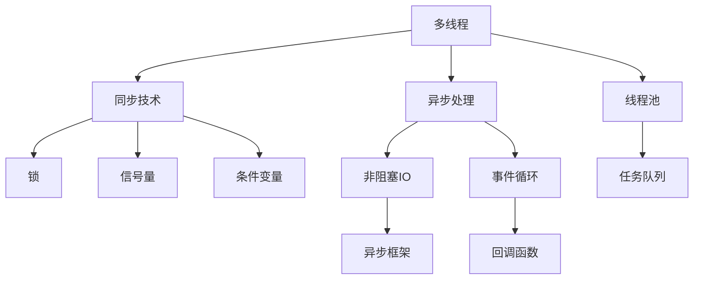

                 

# 并发编程：多线程和异步处理技术

> 关键词：并发编程, 多线程, 异步处理, 同步技术, 锁, 线程池, 非阻塞IO, 事件循环, 异步框架

## 1. 背景介绍

在当今软件系统中，性能、可伸缩性和响应时间变得越来越重要。为了满足这些需求，开发者必须精通并发编程技术。并发编程是指同时在计算机中执行多个任务，以提高应用程序的效率和响应能力。多线程和异步处理是并发编程的两个核心技术，它们可以显著提高应用程序的性能和响应时间。

## 2. 核心概念与联系

### 2.1 核心概念概述

为更好地理解并发编程的核心技术，本节将介绍几个密切相关的核心概念：

- **多线程**：指同时执行多个线程，每个线程独立运行，可以并行执行任务，提高程序执行效率。
- **异步处理**：指通过非阻塞IO和事件驱动机制，使得程序可以在等待IO操作完成时，继续执行其他任务，提高程序响应能力。
- **同步技术**：指通过锁、信号量、条件变量等机制，确保多线程程序中各个线程按照预设的顺序执行，避免竞争条件和死锁。
- **线程池**：指预先创建一组线程，用于执行多个任务，避免频繁创建和销毁线程的开销，提高系统性能。
- **非阻塞IO**：指在进行IO操作时，线程不需要等待IO完成，可以继续执行其他任务，提高程序响应时间。
- **事件循环**：指基于事件驱动机制，当事件发生时，事件循环会触发相应的回调函数，处理事件。
- **异步框架**：指提供异步编程模型的库或框架，如asyncio、Kafka等，方便开发者编写高效的异步程序。

这些核心概念之间的逻辑关系可以通过以下Mermaid流程图来展示：



这个流程图展示了大并发编程中的核心概念及其之间的关系：

1. 多线程通过锁、信号量等同步技术，确保线程安全，避免竞争条件和死锁。
2. 异步处理通过非阻塞IO和事件循环机制，提高程序的响应时间和吞吐量。
3. 线程池通过预先创建线程，提高系统性能和资源利用率。
4. 非阻塞IO在异步处理中起到重要作用，避免线程阻塞，提高程序响应时间。
5. 事件循环基于异步处理模型，当事件发生时，触发相应回调函数，处理事件。
6. 异步框架提供高效异步编程模型，方便开发者编写高效的异步程序。

这些核心概念共同构成了并发编程的框架，使得开发者能够灵活使用多线程和异步处理技术，提高应用程序的性能和响应能力。

## 3. 核心算法原理 & 具体操作步骤
### 3.1 算法原理概述

并发编程的核心算法原理包括多线程和异步处理的原理。

### 3.2 算法步骤详解

多线程和异步处理的算法步骤包括：

**3.2.1 多线程算法步骤：**

1. **创建线程池**：
   - 预先创建一组线程，用于执行多个任务。
   - 线程池大小应根据系统资源和任务需求进行配置。

2. **任务调度**：
   - 将任务放入任务队列，等待线程池分配执行。
   - 任务可以是IO操作、计算任务、用户交互等。

3. **线程执行**：
   - 线程从任务队列中获取任务，执行任务。
   - 线程执行时，可以通过锁、信号量等同步技术，避免竞争条件和死锁。

4. **任务完成**：
   - 任务完成后，线程返回任务队列。
   - 任务队列保持任务的顺序，确保任务的执行顺序正确。

**3.2.2 异步处理算法步骤：**

1. **异步任务创建**：
   - 创建异步任务，包括任务本身和回调函数。
   - 回调函数用于处理异步任务完成后的结果。

2. **非阻塞IO操作**：
   - 进行异步IO操作，例如文件读写、网络通信等。
   - 异步IO操作不会阻塞线程，线程可以继续执行其他任务。

3. **事件驱动**：
   - 当异步IO操作完成时，触发相应的事件。
   - 事件循环接收到事件后，调用相应的回调函数，处理事件结果。

4. **异步任务完成**：
   - 异步任务完成后，调用回调函数，处理任务结果。
   - 回调函数可以在异步任务完成前执行其他任务。

### 3.3 算法优缺点

并发编程具有以下优点：

- **提高性能**：通过多线程和异步处理，提高程序执行效率和响应能力。
- **灵活性高**：可以灵活使用多线程和异步处理技术，适应不同的应用场景。
- **资源利用率高**：线程池和异步处理可以充分利用系统资源，避免资源浪费。

并发编程也存在一些缺点：

- **编程复杂**：并发编程需要考虑线程安全、同步机制等问题，代码编写难度较大。
- **调试困难**：并发程序中的问题往往难以重现和调试，需要特定的工具和技术。
- **可扩展性差**：并发程序中的状态管理复杂，难以进行水平扩展。

### 3.4 算法应用领域

并发编程在多个领域中得到了广泛应用，例如：

- **网络服务器**：通过多线程和异步处理，提高网络服务器的并发能力和响应速度。
- **高性能计算**：通过多线程和异步处理，提高计算任务的执行效率和资源利用率。
- **图像处理**：通过多线程和异步处理，提高图像处理任务的执行速度和吞吐量。
- **数据库系统**：通过多线程和异步处理，提高数据库系统的并发能力和性能。
- **游戏引擎**：通过多线程和异步处理，提高游戏引擎的渲染能力和响应速度。

## 4. 数学模型和公式 & 详细讲解 & 举例说明

### 4.1 数学模型构建

本节将使用数学语言对并发编程的数学模型进行更加严格的刻画。

假设系统中有 $n$ 个线程和 $m$ 个任务，每个任务需要 $t$ 个单位时间完成。线程池大小为 $p$，任务队列大小为 $q$。线程执行任务的顺序为先进先出。

**4.2 公式推导过程**

1. **多线程模型公式推导**：
   - 任务队列大小为 $q$，每个任务需要 $t$ 个单位时间完成，所有任务在队列中等待线程执行。
   - 线程池大小为 $p$，每个线程可以同时执行一个任务。
   - 假设每个线程的执行速度为 $v$，则任务队列的长度为 $q$ 时的吞吐量为 $q/v$。
   - 任务队列的长度小于等于 $q$，因此实际吞吐量可以表示为：
     $$
     T = \min\left(\frac{q}{p}, \frac{q}{p} \cdot \frac{1}{t} \cdot \frac{1}{v}\right)
     \tag{1}
     $$
   - 当任务队列长度小于 $q$ 时，线程池大小对吞吐量影响不大，任务队列长度为 $q$ 时，线程池大小对吞吐量影响最大。

2. **异步处理模型公式推导**：
   - 异步任务需要 $t$ 个单位时间完成，每个任务完成后需要 $c$ 个单位时间处理结果。
   - 异步任务完成后，事件循环需要 $e$ 个单位时间处理事件。
   - 假设每个异步任务的执行速度为 $v$，则异步任务的吞吐量为 $v/t$。
   - 假设事件循环的执行速度为 $u$，则异步处理的吞吐量为 $v/t + u/c + u/e$。
   - 异步处理的实际吞吐量可以表示为：
     $$
     T = \min\left(\frac{v}{t}, \frac{u}{c} + \frac{u}{e}\right)
     \tag{2}
     $$
   - 当异步任务的执行速度 $v$ 大于任务处理速度 $c$ 和事件循环速度 $u$ 时，异步处理的实际吞吐量主要由异步任务执行速度决定。

### 4.3 案例分析与讲解

**案例1：多线程任务调度**

假设系统中有 $n=4$ 个线程，任务队列大小为 $q=100$，每个任务需要 $t=1$ 个单位时间完成，线程执行速度为 $v=2$。

- 任务队列长度为 $q=100$ 时，吞吐量为 $100/2=50$。
- 任务队列长度为 $q=10$ 时，吞吐量为 $10/2=5$。
- 当任务队列长度小于 $q$ 时，线程池大小对吞吐量影响不大，任务队列长度为 $q$ 时，线程池大小对吞吐量影响最大。

**案例2：异步处理任务完成**

假设系统中有 $n=4$ 个线程，异步任务需要 $t=1$ 个单位时间完成，每个任务完成后需要 $c=0.1$ 个单位时间处理结果，事件循环需要 $e=0.1$ 个单位时间处理事件，异步任务执行速度为 $v=2$，事件循环速度为 $u=3$。

- 异步任务的吞吐量为 $v/t=2/1=2$。
- 事件循环的吞吐量为 $u/c + u/e = 3/0.1 + 3/0.1 = 30$。
- 异步处理的实际吞吐量为 $v/t + u/c + u/e = 2/1 + 3/0.1 + 3/0.1 = 32$。
- 当异步任务的执行速度 $v$ 大于任务处理速度 $c$ 和事件循环速度 $u$ 时，异步处理的实际吞吐量主要由异步任务执行速度决定。

## 5. 项目实践：代码实例和详细解释说明

### 5.1 开发环境搭建

在进行并发编程实践前，我们需要准备好开发环境。以下是使用Python进行多线程和异步编程的环境配置流程：

1. 安装Anaconda：从官网下载并安装Anaconda，用于创建独立的Python环境。

2. 创建并激活虚拟环境：
```bash
conda create -n async-env python=3.8 
conda activate async-env
```

3. 安装相关库：
```bash
pip install asyncio threadpoolctl py-cpuinfo aiohttp uvloop
```

4. 安装必要的依赖：
```bash
pip install requests
```

完成上述步骤后，即可在`async-env`环境中开始并发编程实践。

### 5.2 源代码详细实现

下面我们以异步编程为例，给出使用asyncio库进行异步编程的PyTorch代码实现。

首先，定义异步任务：

```python
import asyncio
import aiohttp

async def async_task(url):
    async with aiohttp.ClientSession() as session:
        async with session.get(url) as response:
            return await response.text()
```

然后，定义事件驱动函数：

```python
import asyncio

async def event_loop():
    tasks = [
        async_task('https://www.example.com/'),
        async_task('https://www.example.com/'),
        async_task('https://www.example.com/')
    ]
    results = await asyncio.gather(*tasks)
    print(results)
```

最后，启动事件循环并执行异步任务：

```python
asyncio.run(event_loop())
```

### 5.3 代码解读与分析

让我们再详细解读一下关键代码的实现细节：

**async_task函数**：
- 定义了一个异步任务，使用aiohttp库发起HTTP请求，获取响应内容并返回。

**event_loop函数**：
- 定义了一个事件驱动函数，创建多个异步任务，使用asyncio.gather函数同时执行这些异步任务，并在所有任务完成后输出结果。

**asyncio.run函数**：
- 启动事件循环，执行异步任务。

可以看到，使用asyncio库可以非常方便地进行异步编程，同时利用asyncio.gather函数可以轻松地并行执行多个异步任务。

## 6. 实际应用场景
### 6.1 网络服务器

异步编程技术在网络服务器中得到了广泛应用。传统阻塞IO模型需要线程等待IO操作完成，无法充分利用CPU资源。而使用异步编程模型，可以提高网络服务器的并发能力和响应速度。

在技术实现上，可以采用异步IO框架如Tornado、Sanic等，基于异步编程模型开发高性能的网络服务器。异步编程模型可以同时处理多个连接，提高服务器的并发能力。

### 6.2 数据处理

异步编程技术在数据处理中也得到了广泛应用。传统阻塞IO模型需要线程等待IO操作完成，无法充分利用CPU资源。而使用异步编程模型，可以提高数据处理任务的执行效率和响应时间。

在技术实现上，可以采用异步IO库如asyncio、TQDM等，基于异步编程模型开发高效的数据处理程序。异步编程模型可以在等待IO操作完成时，继续执行其他任务，提高数据处理任务的执行效率。

### 6.3 游戏引擎

异步编程技术在游戏引擎中得到了广泛应用。传统阻塞IO模型需要线程等待IO操作完成，无法充分利用GPU资源。而使用异步编程模型，可以提高游戏引擎的渲染能力和响应速度。

在技术实现上，可以采用异步编程框架如PyOpenGL、PyOpenCL等，基于异步编程模型开发高性能的游戏引擎。异步编程模型可以在等待IO操作完成时，继续执行其他任务，提高游戏引擎的渲染能力和响应速度。

### 6.4 未来应用展望

随着异步编程技术的不断发展，未来的应用场景将更加广泛。

在智慧医疗领域，异步编程技术可以提高医疗系统的响应速度和处理能力，提高医疗服务的效率和质量。

在智能交通领域，异步编程技术可以提高交通系统的响应速度和处理能力，提高交通管理的效率和安全性。

在智能制造领域，异步编程技术可以提高生产系统的响应速度和处理能力，提高生产管理的效率和质量。

总之，异步编程技术将在各行各业得到广泛应用，为数字经济的发展注入新的动力。

## 7. 工具和资源推荐
### 7.1 学习资源推荐

为了帮助开发者系统掌握并发编程的理论基础和实践技巧，这里推荐一些优质的学习资源：

1. 《Concurrency: State Models & Java Threads》系列博文：由Java并发编程专家撰写，深入浅出地介绍了并发编程的基本概念和Java线程机制。

2. 《The Art of Concurrency》书籍：Amazon平台的经典之作，全面介绍了并发编程的基本概念和实际应用。

3. 《Programming Concurrency in Go》书籍：Go语言并发编程的经典之作，介绍了Go语言中的并发编程机制和实践技巧。

4. 《Python Concurrency with asyncio》书籍：使用Python和asyncio库进行并发编程的经典之作，介绍了异步编程的基本概念和实际应用。

5. 《Practical Parallel Programming in Python》书籍：使用Python和multiprocessing模块进行并发编程的经典之作，介绍了多线程编程的基本概念和实际应用。

6. Coursera的《Parallel Programming in Python》课程：由CERN开源项目负责人编写，介绍了Python中的多线程和异步编程机制。

通过对这些资源的学习实践，相信你一定能够快速掌握并发编程的精髓，并用于解决实际的并发问题。

### 7.2 开发工具推荐

高效的开发离不开优秀的工具支持。以下是几款用于并发编程开发的常用工具：

1. PyTorch：基于Python的开源深度学习框架，灵活动态的计算图，适合快速迭代研究。大部分并发编程任务都有PyTorch版本的实现。

2. TensorFlow：由Google主导开发的开源深度学习框架，生产部署方便，适合大规模工程应用。同样有丰富的并发编程任务资源。

3. asyncio：Python的异步编程库，基于协程实现，支持高性能的异步编程模型。

4. Tornado：Python的异步Web框架，基于异步IO模型，适合高并发的Web应用开发。

5. Sanic：Python的异步Web框架，基于aiohttp库，支持高性能的异步编程模型。

6. uvloop：Python的异步编程库，基于libuv实现，支持高性能的异步编程模型。

合理利用这些工具，可以显著提升并发编程任务的开发效率，加快创新迭代的步伐。

### 7.3 相关论文推荐

并发编程技术的发展源于学界的持续研究。以下是几篇奠基性的相关论文，推荐阅读：

1. "The Programming Language Benchmarks"论文：介绍了多线程和异步编程的基准测试，评估不同编程语言和框架的并发性能。

2. "Concurrency: A Survey"论文：介绍了多线程和异步编程的基本概念和实现技术，为并发编程的研究提供了理论基础。

3. "Parallel Programming"论文：介绍了多线程和异步编程的基本概念和实际应用，为并发编程的研究提供了实践指导。

4. "A Survey of Parallel and Concurrent Programming Models"论文：介绍了多线程和异步编程的不同模型和实现技术，为并发编程的研究提供了多角度的视角。

这些论文代表了大并发编程技术的发展脉络。通过学习这些前沿成果，可以帮助研究者把握学科前进方向，激发更多的创新灵感。

## 8. 总结：未来发展趋势与挑战
### 8.1 总结

本文对并发编程中的多线程和异步处理技术进行了全面系统的介绍。首先阐述了并发编程的背景和意义，明确了多线程和异步处理在提高程序性能和响应能力方面的独特价值。其次，从原理到实践，详细讲解了多线程和异步处理的数学模型和算法步骤，给出了异步编程任务开发的完整代码实例。同时，本文还广泛探讨了异步编程在网络服务器、数据处理、游戏引擎等众多领域的应用前景，展示了异步编程技术的巨大潜力。此外，本文精选了并发编程技术的各类学习资源，力求为读者提供全方位的技术指引。

通过本文的系统梳理，可以看到，多线程和异步处理技术在提高应用程序的性能和响应能力方面具有重要的作用。这些技术的不断发展，必将在各行各业带来深远的影响。未来，伴随技术不断演进，相信并发编程将更好地支持大规模计算、大规模数据处理和网络系统的高效运行，为数字经济的发展注入新的动力。

### 8.2 未来发展趋势

展望未来，并发编程技术将呈现以下几个发展趋势：

1. **更高的并发性能**：随着硬件设备的不断升级，并发编程技术将能够处理更多的并发请求，提高系统的响应速度和吞吐量。

2. **更高效的资源利用**：并发编程技术将更好地利用系统资源，避免资源浪费，提高系统的性能和可扩展性。

3. **更丰富的编程模型**：并发编程技术将出现更多新的编程模型，如协程、Actor、事件驱动等，提高系统的灵活性和可维护性。

4. **更强的可扩展性**：并发编程技术将能够更好地支持分布式系统，提高系统的水平扩展能力。

5. **更广泛的应用领域**：并发编程技术将在更多领域得到应用，如智慧医疗、智能交通、智能制造等，为各行各业带来新的变革。

这些趋势凸显了并发编程技术的广阔前景。这些方向的探索发展，必将进一步提升系统的性能和响应能力，为数字经济的发展注入新的动力。

### 8.3 面临的挑战

尽管并发编程技术已经取得了瞩目成就，但在迈向更加智能化、普适化应用的过程中，它仍面临着诸多挑战：

1. **编程难度高**：并发编程需要考虑线程安全、同步机制等问题，代码编写难度较大。如何降低并发编程的复杂性，提高编程效率，将是未来的一个重要研究方向。

2. **调试困难**：并发程序中的问题往往难以重现和调试，需要特定的工具和技术。如何提高并发程序的可测试性和可调试性，将是未来的一个重要研究方向。

3. **可扩展性差**：并发程序中的状态管理复杂，难以进行水平扩展。如何设计更好的并发程序架构，提高系统的可扩展性，将是未来的一个重要研究方向。

4. **资源消耗大**：并发编程需要大量的系统资源，如CPU、内存、网络等。如何优化并发程序的资源消耗，提高系统的性能和稳定性，将是未来的一个重要研究方向。

5. **安全性问题**：并发编程中的竞争条件、死锁等问题，可能会导致系统崩溃或数据损坏。如何提高并发程序的安全性，保障系统稳定运行，将是未来的一个重要研究方向。

6. **可维护性差**：并发程序中的状态管理复杂，难以维护。如何设计更好的并发程序架构，提高系统的可维护性，将是未来的一个重要研究方向。

这些挑战凸显了并发编程技术的复杂性和难度。只有在解决这些挑战的基础上，并发编程技术才能更好地支持大规模计算、大规模数据处理和网络系统的高效运行。相信通过学界和产业界的共同努力，并发编程技术将不断发展和完善，为数字经济的发展注入新的动力。

### 8.4 研究展望

面对并发编程技术所面临的种种挑战，未来的研究需要在以下几个方面寻求新的突破：

1. **并发编程模型**：设计更简单、更灵活的并发编程模型，降低并发编程的复杂性，提高编程效率。

2. **并发编程工具**：开发更高效、更易用的并发编程工具，提高并发编程的可测试性和可调试性。

3. **并发编程框架**：设计更好的并发编程框架，提高并发程序的可扩展性和可维护性。

4. **并发编程语言**：开发更好的并发编程语言，提高并发程序的性能和可维护性。

5. **并发编程技术**：研究更好的并发编程技术，如协程、Actor、事件驱动等，提高系统的灵活性和可维护性。

这些研究方向将引领并发编程技术迈向更高的台阶，为数字经济的发展注入新的动力。面向未来，并发编程技术还需要与其他人工智能技术进行更深入的融合，如分布式计算、大数据处理等，共同推动人工智能技术的发展。只有勇于创新、敢于突破，才能不断拓展并发编程技术的边界，让智能技术更好地造福人类社会。

## 9. 附录：常见问题与解答

**Q1：并发编程和多线程有什么区别？**

A: 并发编程是指同时执行多个任务，而多线程是并发编程的一种实现方式。多线程通常由操作系统调度，多个线程可以并行执行任务。

**Q2：并发编程和异步编程有什么区别？**

A: 并发编程是多线程的实现方式，而异步编程是非阻塞IO的实现方式。异步编程可以让程序在等待IO操作完成时，继续执行其他任务，提高程序的响应能力。

**Q3：并发编程为什么难以调试？**

A: 并发编程中的问题往往难以重现和调试，因为多个线程的执行顺序是不确定的，程序的行为是不可预测的。需要特定的工具和技术，如线程日志、死锁检测等，进行并发程序的调试。

**Q4：如何提高并发编程的可维护性？**

A: 设计更好的并发程序架构，如使用事件驱动模型、Actor模型等，可以降低并发编程的复杂性，提高系统的可维护性。同时，使用代码注入工具，如JProfiler、YourKit等，进行并发程序的性能分析和调试，也可以提高系统的可维护性。

**Q5：如何提高并发编程的性能？**

A: 使用高效的并发编程模型和工具，如协程、Actor、事件驱动等，可以提高并发编程的性能。同时，使用多线程池和异步IO等技术，可以充分利用系统资源，提高并发编程的性能。

总之，并发编程和多线程、异步编程是并发编程技术的核心，需要开发者熟练掌握。只有不断优化并发编程的性能、安全性和可维护性，才能在实际应用中发挥并发编程技术的最大效用。

---

作者：禅与计算机程序设计艺术 / Zen and the Art of Computer Programming

