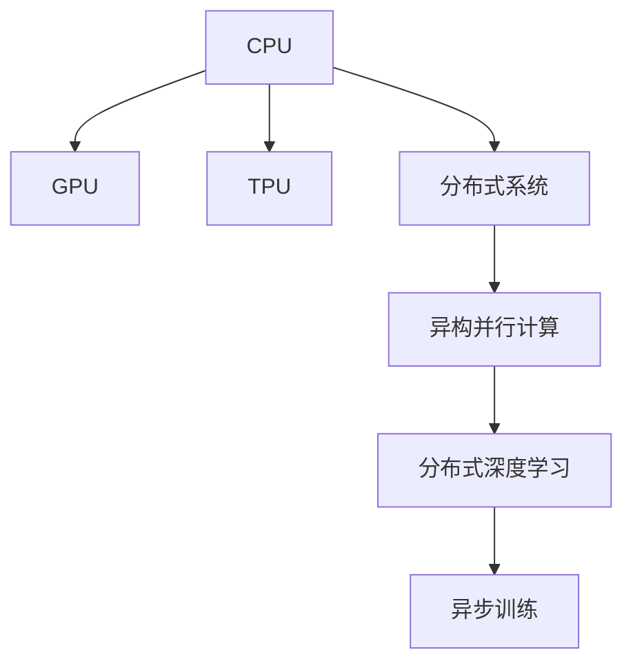

                 

# 并行计算在AI中的应用：从CPU到GPU

## 1. 背景介绍

在人工智能(AI)领域，并行计算正变得越来越重要。随着深度学习、计算机视觉、自然语言处理等AI技术的快速发展，对计算资源的需求日益增加。从CPU到GPU，再到更先进的加速器，并行计算正在推动AI应用的突破。

并行计算的核心思想是利用多核处理器、分布式系统等硬件设施，将大规模计算任务分解成多个小任务并行处理，以提高计算效率。在AI中，并行计算尤为重要，因为许多AI任务需要处理大量数据，进行复杂的模型训练和推理。

## 2. 核心概念与联系

### 2.1 核心概念概述

为更好地理解并行计算在AI中的应用，本节将介绍几个关键概念：

- **CPU (中央处理器)**：传统计算的核心，拥有较高的串行计算能力。

- **GPU (图形处理器)**：最初用于图形渲染，后来被证明在并行计算中极为高效，成为深度学习的主流加速器。

- **TPU (张量处理单元)**：Google开发的针对AI计算优化的专用硬件，提供了更高的并行度和能效。

- **DNN (深度神经网络)**：AI中应用最广泛的网络结构，由多个层次的神经元组成，需要大量并行计算。

- **分布式系统**：通过多个计算节点协同工作，实现更强大的计算能力，适用于大规模数据集和复杂模型。

- **异构并行计算**：结合不同类型计算资源，如CPU、GPU、TPU等，实现更高效的多任务并行处理。

- **分布式深度学习**：在大规模数据集上训练深度神经网络，分布式计算是必不可少的。

- **异步训练**：在分布式系统中，不同节点并行训练，异步更新参数。

这些概念之间的逻辑关系可以通过以下Mermaid流程图来展示：



这个流程图展示了几类并行计算在AI中的核心概念及其之间的关系：

1. CPU是基础计算单元，但性能有限。
2. GPU能高效处理大规模矩阵计算，成为深度学习的主流加速器。
3. TPU进一步优化了深度学习加速性能。
4. 分布式系统通过多节点协作提升计算能力。
5. 异构并行计算结合不同计算资源，提升效率。
6. 分布式深度学习通过多节点协同训练，加速模型训练。
7. 异步训练允许不同节点异步更新参数，提高计算效率。

这些概念共同构成了并行计算在AI中的应用框架，使得AI系统能够在各种场景下高效地运行。

## 3. 核心算法原理 & 具体操作步骤

### 3.1 算法原理概述

并行计算在AI中的应用，主要体现在模型训练和推理两个阶段。在模型训练阶段，通过多节点并行计算，加速大规模数据集上的模型训练。在推理阶段，通过并行化计算，提高模型推理速度。

以深度神经网络为例，其训练过程通常分为前向传播和反向传播两个步骤。在前向传播中，计算输入数据的输出，涉及大量矩阵乘法和激活函数计算。在反向传播中，计算梯度并更新模型参数，同样涉及大量矩阵乘法和求导计算。这些计算任务都是密集型计算，适合并行处理。

### 3.2 算法步骤详解

以下是并行计算在AI中应用的详细操作步骤：

**Step 1: 数据并行化**

将大规模数据集划分成多个小数据集，每个小数据集在独立的计算节点上进行并行处理。这样，不同节点可以同时处理不同的样本，提高计算效率。

**Step 2: 模型并行化**

将深度神经网络的不同层次或不同参数组分别部署在多个计算节点上。这样可以同时计算多个层次或参数组，提高模型训练速度。

**Step 3: 任务分配**

在分布式系统中，需要合理分配计算任务，避免某些节点负载过重，造成计算瓶颈。可以使用各种负载均衡算法，如循环轮询、静态划分、动态调整等。

**Step 4: 参数同步**

在分布式系统中，不同节点同时更新模型参数时，需要进行同步操作，以确保参数的一致性。可以使用异步更新或定期同步的方式，确保参数更新正确。

**Step 5: 结果聚合**

不同节点计算结果后，需要将结果汇总。可以使用reduce操作，将所有节点的计算结果汇总到一个节点上。

### 3.3 算法优缺点

并行计算在AI中的应用具有以下优点：

1. **提高计算效率**：通过多节点并行计算，大幅度提升计算速度，加速模型训练和推理。
2. **适应大规模数据**：并行计算能够处理大规模数据集，解决单节点内存不足的问题。
3. **提升系统可扩展性**：通过增加计算节点，可以轻松扩展系统计算能力。

但并行计算也存在一些缺点：

1. **通信开销**：节点间数据传输和通信会增加系统开销，影响计算效率。
2. **同步问题**：不同节点之间的同步操作复杂，可能影响计算性能。
3. **成本高**：高性能计算硬件如GPU、TPU等成本较高，维护复杂。
4. **编程复杂**：并行计算需要复杂的编程模型和工具，开发难度大。

尽管存在这些缺点，但并行计算在AI中的广泛应用，使得其在处理大规模数据和复杂模型时具有不可替代的优势。

### 3.4 算法应用领域

并行计算在AI中的应用非常广泛，涵盖了从模型训练到推理的全过程。以下是几个典型的应用领域：

- **深度学习模型训练**：在大规模数据集上训练深度神经网络，如ImageNet、BERT等。
- **图像处理**：如图像分类、目标检测、图像分割等，需要使用并行计算加速处理。
- **自然语言处理**：如机器翻译、文本生成、情感分析等，需要通过并行计算加速模型训练和推理。
- **强化学习**：如AlphaGo等，需要使用并行计算模拟环境并处理大量数据。
- **推荐系统**：如协同过滤、矩阵分解等，需要使用并行计算处理大规模数据。

## 4. 数学模型和公式 & 详细讲解 & 举例说明

### 4.1 数学模型构建

并行计算在AI中的应用，可以通过数学模型进行形式化描述。这里以深度神经网络为例，构建并行计算的数学模型。

记深度神经网络为 $f(x;\theta)$，其中 $x$ 为输入，$\theta$ 为模型参数。假设将数据集 $D=\{(x_i, y_i)\}_{i=1}^N$ 划分为 $K$ 个数据子集 $D_k$，每个子集在独立的计算节点上并行训练。

记 $f_k(x_k;\theta_k)$ 为在节点 $k$ 上训练的模型。则并行训练的目标为最小化损失函数：

$$
\mathcal{L}(\theta) = \frac{1}{N}\sum_{i=1}^N \ell(f(x_i;\theta),y_i)
$$

其中 $\ell$ 为损失函数，$\theta$ 为全模型参数。

在并行训练中，每个节点 $k$ 的损失函数为：

$$
\mathcal{L}_k(\theta_k) = \frac{1}{|D_k|}\sum_{x_k\in D_k} \ell(f_k(x_k;\theta_k),y_k)
$$

并行训练的目标为最小化所有节点的损失函数之和：

$$
\mathcal{L}_{\text{parallel}}(\theta) = \frac{1}{N}\sum_{k=1}^K \sum_{x_k\in D_k} \ell(f_k(x_k;\theta_k),y_k)
$$

### 4.2 公式推导过程

以上公式展示了并行训练的基本框架。下面我们通过具体的推导，理解并行训练的过程。

以 ImageNet 数据集为例，假设使用 $K=4$ 个节点进行并行训练。每个节点 $k$ 训练数据集 $D_k$，其中 $D_k$ 的大小为 $|D_k|=N/K$。

每个节点的损失函数为：

$$
\mathcal{L}_k(\theta_k) = \frac{1}{|D_k|}\sum_{x_k\in D_k} \ell(f_k(x_k;\theta_k),y_k)
$$

并行训练的目标函数为：

$$
\mathcal{L}_{\text{parallel}}(\theta) = \frac{1}{N}\sum_{k=1}^K \sum_{x_k\in D_k} \ell(f_k(x_k;\theta_k),y_k)
$$

将每个节点的损失函数代入并行训练目标函数，得：

$$
\mathcal{L}_{\text{parallel}}(\theta) = \frac{1}{N}\sum_{k=1}^K \sum_{i\in [1,K]}\frac{1}{|D_k|}\sum_{x_k\in D_k} \ell(f_k(x_k;\theta_k),y_k)
$$

通过优化算法（如SGD、Adam等）更新参数，最小化并行训练目标函数。

### 4.3 案例分析与讲解

以下是一个具体的并行计算案例，分析其效果和优化策略：

假设在 ImageNet 数据集上训练一个深度神经网络，使用 $K=4$ 个节点进行并行训练。每个节点训练 $|D_k|=50000$ 个样本。

1. **数据并行化**

将数据集 $D$ 划分为 $D_1, D_2, D_3, D_4$，每个节点训练 $|D_k|=50000$ 个样本。

2. **模型并行化**

将深度神经网络 $f(x;\theta)$ 的不同层次分别部署在 $K=4$ 个节点上，每个节点训练 $L=20$ 层。

3. **任务分配**

使用静态划分的方式，每个节点训练 $|D_k|=50000$ 个样本中的 $L/4=5$ 层。

4. **参数同步**

使用异步更新方式，每个节点独立更新参数，并定期进行参数同步。

5. **结果聚合**

使用 reduce 操作，将每个节点的输出结果汇总到主节点，进行最终评估。

## 5. 项目实践：代码实例和详细解释说明

### 5.1 开发环境搭建

在进行并行计算实践前，我们需要准备好开发环境。以下是使用Python进行PyTorch开发的环境配置流程：

1. 安装Anaconda：从官网下载并安装Anaconda，用于创建独立的Python环境。

2. 创建并激活虚拟环境：
```bash
conda create -n pytorch-env python=3.8 
conda activate pytorch-env
```

3. 安装PyTorch：根据CUDA版本，从官网获取对应的安装命令。例如：
```bash
conda install pytorch torchvision torchaudio cudatoolkit=11.1 -c pytorch -c conda-forge
```

4. 安装Transformers库：
```bash
pip install transformers
```

5. 安装各类工具包：
```bash
pip install numpy pandas scikit-learn matplotlib tqdm jupyter notebook ipython
```

完成上述步骤后，即可在`pytorch-env`环境中开始并行计算实践。

### 5.2 源代码详细实现

下面我们以ImageNet数据集为例，给出使用PyTorch进行并行计算的PyTorch代码实现。

首先，定义并行计算的基本流程函数：

```python
import torch
import torch.nn as nn
import torch.distributed as dist
import torch.multiprocessing as mp

def train_parallel(model, dataloader, optimizer, device):
    dist.init_process_group('nccl')
    model = nn.parallel.DistributedDataParallel(model)
    criterion = nn.CrossEntropyLoss()
    
    for epoch in range(num_epochs):
        for i, (inputs, targets) in enumerate(dataloader):
            inputs, targets = inputs.to(device), targets.to(device)
            
            outputs = model(inputs)
            loss = criterion(outputs, targets)
            
            optimizer.zero_grad()
            loss.backward()
            optimizer.step()
            
            if i % 100 == 0:
                print(f'Epoch {epoch+1}, Step {i+1}, Loss: {loss.item():.4f}')
```

然后，定义数据集和优化器：

```python
import torch
import torchvision
import torchvision.transforms as transforms
from torch.utils.data import DataLoader

# 数据预处理
transform = transforms.Compose([
    transforms.Resize(224),
    transforms.ToTensor(),
    transforms.Normalize(mean=[0.485, 0.456, 0.406],
                         std=[0.229, 0.224, 0.225])
])

train_dataset = torchvision.datasets.ImageNet(root='data', train=True,
                                            download=True, transform=transform)
test_dataset = torchvision.datasets.ImageNet(root='data', train=False,
                                           download=True, transform=transform)

train_loader = DataLoader(train_dataset, batch_size=64, shuffle=True,
                         num_workers=4, pin_memory=True)
test_loader = DataLoader(test_dataset, batch_size=64, shuffle=False,
                        num_workers=4, pin_memory=True)

model = torchvision.models.resnet18().to(device)
optimizer = torch.optim.SGD(model.parameters(), lr=0.01, momentum=0.9)
```

最后，启动并行训练流程：

```python
num_epochs = 5
num_workers = 4

# 多进程并行训练
mp.spawn(train_parallel, nprocs=num_workers, args=(model, train_loader, optimizer, device))
```

以上就是使用PyTorch对ImageNet数据集进行并行计算的完整代码实现。可以看到，通过并行计算，能够在多个节点上同时训练模型，加速模型训练过程。

### 5.3 代码解读与分析

让我们再详细解读一下关键代码的实现细节：

**并行计算函数**：
- `train_parallel`函数定义了并行训练的基本流程。
- `dist.init_process_group('nccl')`初始化分布式通信，使用NCCL通信协议。
- `model = nn.parallel.DistributedDataParallel(model)`将模型进行分布式并行化，每个节点独立更新模型参数。
- `criterion = nn.CrossEntropyLoss()`定义交叉熵损失函数，用于评估模型性能。
- `optimizer.zero_grad()`清除梯度。
- `loss.backward()`反向传播计算梯度。
- `optimizer.step()`更新模型参数。

**数据集和优化器**：
- 使用`torchvision`库定义ImageNet数据集，并进行预处理。
- 定义训练集和测试集的DataLoader，设置批大小和工人数等参数。
- 定义ResNet模型和优化器。

**并行训练启动**：
- `num_epochs`定义训练轮数。
- `num_workers`定义进程数量，即参与并行训练的节点数量。
- `mp.spawn(train_parallel, nprocs=num_workers, args=(model, train_loader, optimizer, device))`启动多个进程进行并行训练。

以上代码展示了并行计算的基本实现方式，通过多个节点并行处理，大幅提升了模型训练的速度。

## 6. 实际应用场景

### 6.1 智能推荐系统

智能推荐系统是并行计算在AI中的一个典型应用场景。在推荐系统中，需要处理大量用户数据和物品数据，进行模型训练和推理。通过并行计算，可以有效提升推荐系统的性能和用户体验。

推荐系统通常使用协同过滤、矩阵分解等算法进行推荐。这些算法需要处理大规模稀疏矩阵，计算量大，适合并行计算。在实际部署中，可以使用多节点并行计算，加速推荐模型的训练和推理。

### 6.2 自然语言处理

自然语言处理（NLP）是并行计算的另一个重要应用领域。NLP任务如机器翻译、文本分类、情感分析等，通常涉及大规模文本数据和复杂模型，需要高效的并行计算支持。

以机器翻译为例，传统的基于规则的翻译方法效率低，难以处理大规模文本。深度学习模型（如Seq2Seq、Transformer）通过并行计算，可以高效处理大规模数据，提升翻译性能。在实际部署中，可以使用多节点并行训练和推理，加速模型训练和推理过程。

### 6.3 计算机视觉

计算机视觉是另一个受益于并行计算的应用领域。计算机视觉任务如图像分类、目标检测、图像分割等，通常需要处理大量图像数据，进行模型训练和推理。通过并行计算，可以加速模型训练和推理，提升系统性能。

以目标检测为例，常用的模型如Faster R-CNN、YOLO等，需要处理大量图像数据，计算量大，适合并行计算。在实际部署中，可以使用多节点并行计算，加速模型训练和推理，提高系统性能。

### 6.4 未来应用展望

随着并行计算技术的不断进步，未来的AI应用场景将更加广泛和高效。以下是几个未来应用展望：

1. **边缘计算**：在物联网设备上，可以使用并行计算进行本地推理，减少数据传输，提升响应速度。
2. **云计算**：在云平台上，可以使用并行计算进行大规模模型训练和推理，提升系统性能。
3. **异构计算**：结合不同类型计算资源（如CPU、GPU、TPU），提升并行计算效率，适用于更复杂的计算任务。
4. **混合并行计算**：结合CPU和GPU的优点，提升并行计算性能，适用于混合任务处理。
5. **分布式深度学习**：在大规模数据集上训练深度神经网络，分布式计算是必不可少的。

## 7. 工具和资源推荐

### 7.1 学习资源推荐

为了帮助开发者系统掌握并行计算在AI中的应用，这里推荐一些优质的学习资源：

1. **《深入理解并行计算》**：该书系统介绍了并行计算的基本原理和应用，适合初学者入门。
2. **《分布式深度学习》**：该书深入探讨了分布式深度学习的实现和优化，适合进阶学习。
3. **《Python并行编程》**：该书介绍了Python中的并行计算框架，适合开发者实践。
4. **Coursera《Parallel Programming in Python》**：斯坦福大学开设的并行计算课程，涵盖多种并行编程技术。
5. **Coursera《Distributed Systems》**：斯坦福大学开设的分布式系统课程，涵盖分布式计算的多种技术和案例。

通过对这些资源的学习实践，相信你一定能够掌握并行计算在AI中的应用，并用于解决实际的AI问题。

### 7.2 开发工具推荐

高效的开发离不开优秀的工具支持。以下是几款用于并行计算开发的常用工具：

1. **PyTorch**：基于Python的开源深度学习框架，灵活动态的计算图，适合快速迭代研究。大部分深度学习模型都有PyTorch版本的实现。
2. **TensorFlow**：由Google主导开发的开源深度学习框架，生产部署方便，适合大规模工程应用。同样有丰富的深度学习模型资源。
3. **Horovod**：专为分布式深度学习设计的开源框架，支持多种深度学习框架，如TensorFlow、Keras、PyTorch等。
4. **Dask**：Python中的分布式计算框架，适用于大规模数据集和复杂模型的并行计算。
5. **Ray**：分布式计算框架，支持多种编程语言，适用于大规模分布式系统的开发。

合理利用这些工具，可以显著提升并行计算任务的开发效率，加快创新迭代的步伐。

### 7.3 相关论文推荐

并行计算在AI中的应用源于学界的持续研究。以下是几篇奠基性的相关论文，推荐阅读：

1. **《ImageNet Classification with Deep Convolutional Neural Networks》**：AlexNet论文，首次展示了深度学习在图像分类任务上的成功。
2. **《Distributed Deep Learning》**：斯坦福大学的研究成果，介绍了分布式深度学习的实现和优化。
3. **《Hardware-Software Co-design for Scalable Deep Learning》**：腾讯的研究成果，介绍了硬件-软件协同设计的深度学习系统。
4. **《Deep Learning with GPUs》**：NVIDIA的研究成果，介绍了GPU加速深度学习的应用。
5. **《TensorFlow: A System for Large-Scale Machine Learning》**：TensorFlow论文，介绍了TensorFlow的架构和应用。

这些论文代表了大规模并行计算在AI中的发展脉络。通过学习这些前沿成果，可以帮助研究者把握学科前进方向，激发更多的创新灵感。

## 8. 总结：未来发展趋势与挑战

### 8.1 总结

本文对并行计算在AI中的应用进行了全面系统的介绍。首先阐述了并行计算在AI中的重要性，并系统介绍了CPU、GPU、TPU等关键概念及其之间的关系。其次，从原理到实践，详细讲解了并行计算的基本算法和操作步骤，给出了并行计算任务开发的完整代码实例。同时，本文还广泛探讨了并行计算在推荐系统、NLP、计算机视觉等领域的实际应用，展示了并行计算的广泛应用前景。此外，本文精选了并行计算学习的各类资源，力求为读者提供全方位的技术指引。

通过本文的系统梳理，可以看到，并行计算在AI中发挥了重要作用，提升了模型的训练和推理效率，使得AI系统能够在各种场景下高效运行。随着并行计算技术的不断发展，未来的AI应用场景将更加广泛和高效。

### 8.2 未来发展趋势

展望未来，并行计算在AI中的应用将呈现以下几个发展趋势：

1. **边缘计算普及**：随着物联网设备的普及，边缘计算将成为并行计算的重要应用场景。在边缘设备上进行本地推理，可以减少数据传输，提升响应速度。
2. **云计算扩展**：云平台的大规模并行计算能力将进一步提升，支持更复杂、更大规模的AI应用。
3. **异构计算融合**：结合CPU、GPU、TPU等不同计算资源，提升并行计算效率，适用于更复杂的计算任务。
4. **分布式深度学习优化**：通过优化分布式训练算法，提升模型的收敛速度和精度。
5. **混合并行计算兴起**：结合CPU和GPU的优点，提升并行计算性能，适用于混合任务处理。
6. **分布式训练加速**：通过硬件优化和算法优化，加速分布式深度学习的训练过程。

这些趋势凸显了并行计算在AI中的广阔前景。这些方向的探索发展，必将进一步提升AI系统的性能和应用范围，为人类认知智能的进化带来深远影响。

### 8.3 面临的挑战

尽管并行计算在AI中的应用已经取得了显著进展，但在迈向更加智能化、普适化应用的过程中，它仍面临诸多挑战：

1. **通信开销**：节点间数据传输和通信会增加系统开销，影响计算效率。
2. **同步问题**：不同节点之间的同步操作复杂，可能影响计算性能。
3. **硬件成本**：高性能计算硬件如GPU、TPU等成本较高，维护复杂。
4. **编程复杂**：并行计算需要复杂的编程模型和工具，开发难度大。
5. **可扩展性**：分布式系统需要良好的扩展性，才能适应更多节点。
6. **系统稳定性**：并行计算系统需要稳定可靠，才能保证服务质量。

这些挑战凸显了并行计算在实际应用中需要考虑的问题。尽管如此，并行计算在AI中的应用前景仍然广阔，未来的研究将继续寻找更好的解决方案。

### 8.4 研究展望

面对并行计算面临的种种挑战，未来的研究需要在以下几个方面寻求新的突破：

1. **优化通信算法**：通过优化数据传输和通信算法，降低通信开销，提升并行计算效率。
2. **改进同步机制**：设计更好的同步机制，简化并行计算系统的开发和维护。
3. **降低硬件成本**：通过硬件优化和软硬件协同设计，降低高性能计算硬件的成本。
4. **简化编程模型**：开发更易用的编程模型和工具，降低并行计算的开发难度。
5. **提高系统扩展性**：设计可扩展的并行计算系统，适应更多节点和更大规模的应用。
6. **增强系统稳定性**：通过算法优化和硬件改进，提升并行计算系统的稳定性。

这些研究方向的探索，必将引领并行计算在AI中的进一步发展，为构建高效、稳定、可扩展的AI系统铺平道路。

## 9. 附录：常见问题与解答

**Q1：并行计算是否适用于所有AI任务？**

A: 并行计算适用于大部分AI任务，特别是那些需要处理大规模数据和复杂模型的任务。但对于一些简单的任务，并行计算的优势不明显。例如，对于小规模数据集和简单模型的训练，并行计算可能会增加复杂性和开销。

**Q2：并行计算会降低系统的可扩展性吗？**

A: 并行计算不仅不会降低系统的可扩展性，反而能够通过增加计算节点来提升系统性能。在并行计算中，每个节点独立处理部分任务，相互之间通过通信协调，可以很好地适应更多节点的扩展。

**Q3：并行计算是否会导致系统稳定性问题？**

A: 并行计算需要良好的同步和通信机制，才能确保系统稳定性。在实际应用中，需要仔细设计并行计算流程，避免不同节点之间的同步和通信问题。同时，需要采用硬件优化和算法优化，提升并行计算系统的稳定性。

**Q4：并行计算是否需要高性能计算硬件？**

A: 并行计算需要高性能计算硬件，如GPU、TPU等，才能提升计算效率。然而，随着硬件技术的进步，许多AI任务已经可以在普通的CPU上进行并行计算，提升了计算效率。

**Q5：并行计算是否会增加编程难度？**

A: 并行计算的确会增加编程难度，但可以通过使用高效的并行计算框架和工具来降低难度。例如，PyTorch、TensorFlow等深度学习框架已经提供了丰富的并行计算功能，大大降低了开发难度。

以上问题与解答，希望能够帮助你更好地理解并行计算在AI中的应用，并能够在实际开发中灵活应用。并行计算是未来AI发展的重要驱动力，相信随着技术进步和应用场景的拓展，并行计算将发挥更大的作用。

---

作者：禅与计算机程序设计艺术 / Zen and the Art of Computer Programming

