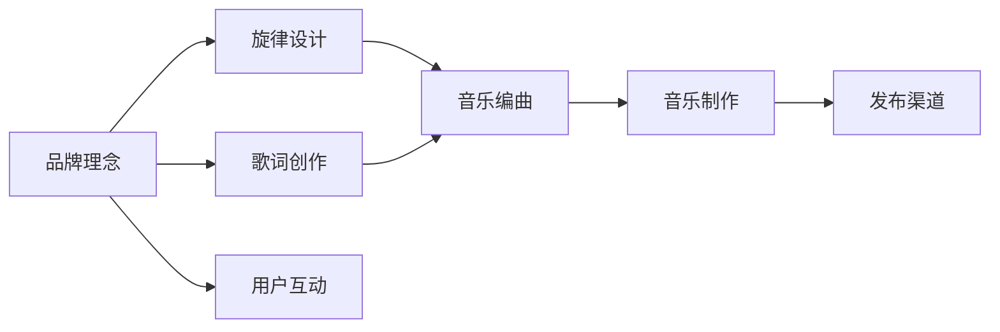

                 

# 建立个人品牌音乐：增强品牌记忆点

> 关键词：品牌音乐，增强品牌记忆点，品牌文化，市场营销，用户互动

## 1. 背景介绍

### 1.1 问题由来

在信息爆炸的时代，如何让品牌在消费者的心中留下深刻的印象，成为品牌建设的关键问题。传统的广告、宣传方式成本高、效果差，且难以真正触及用户内心。音乐作为一种极具感染力和情感共鸣的艺术形式，被越来越多地应用于品牌营销中。品牌音乐通过旋律和歌词，传递品牌价值和理念，能够在短时间内形成强烈而持久的品牌印象，成为建立品牌记忆点的重要手段。

### 1.2 问题核心关键点

品牌音乐的核心在于如何通过旋律和歌词，精准地传达品牌价值和理念，同时与用户的情感产生共鸣。以下是构建品牌音乐的关键要点：

- 旋律与歌词的原创性：确保音乐内容符合品牌调性，避免抄袭和模仿。
- 情感共鸣：通过歌词表达品牌的核心价值，触及用户内心。
- 传播渠道的多样性：结合传统和新兴媒体，让品牌音乐触及更多人群。
- 用户互动：通过社交媒体、用户生成内容等方式，增强用户与品牌音乐的互动。
- 持续优化：不断收集用户反馈，持续优化品牌音乐，保持其新鲜感和吸引力。

## 2. 核心概念与联系

### 2.1 核心概念概述

品牌音乐是品牌通过音乐表达自己独特的价值、理念和文化，从而与消费者建立情感连接的一种形式。品牌音乐的核心要素包括旋律、歌词和品牌调性。

- **旋律**：品牌音乐需要具备独特的旋律，易于记忆且能够传递品牌的情感和节奏感。
- **歌词**：歌词需要与品牌理念紧密结合，能够传达品牌的核心价值，触动用户的情感共鸣。
- **品牌调性**：品牌音乐需要与品牌的整体调性一致，无论是现代、古典还是流行风格，都应反映品牌的精神和文化。

### 2.2 核心概念原理和架构的 Mermaid 流程图



这个流程图展示了品牌音乐构建的全过程：

1. 从品牌理念出发，设计独特且易于记忆的旋律。
2. 结合品牌理念，创作符合品牌调性的歌词。
3. 将旋律和歌词交由专业的音乐编曲师进行编曲。
4. 完成编曲后，进行音乐制作，形成最终的音乐作品。
5. 通过各种渠道发布品牌音乐，与用户进行互动。
6. 持续收集用户反馈，优化品牌音乐。

## 3. 核心算法原理 & 具体操作步骤

### 3.1 算法原理概述

品牌音乐的构建过程中，涉及音乐创作和品牌调性的匹配，以及与用户的互动反馈。以下是品牌音乐构建的核心算法原理：

- **品牌调性分析**：通过文本分析和情感分析，理解品牌核心理念和调性，为旋律和歌词创作提供指导。
- **旋律设计**：利用音乐理论知识，设计符合品牌调性的旋律。
- **歌词创作**：结合品牌理念，创作易于记忆、情感共鸣的歌词。
- **用户互动分析**：通过社交媒体等渠道收集用户反馈，分析用户对品牌音乐的情感和评价，为后续优化提供依据。
- **音乐优化**：根据用户反馈和市场变化，不断优化音乐内容和传播策略，保持品牌音乐的活力和吸引力。

### 3.2 算法步骤详解

#### 3.2.1 品牌调性分析

1. **品牌文本分析**：收集品牌的使命、愿景、价值观等文本信息，使用自然语言处理(NLP)技术分析品牌调性。
2. **情感分析**：使用情感分析工具，分析品牌文本中的情感倾向，确定品牌核心情感。
3. **调性映射**：将品牌调性与音乐风格进行映射，如现代、古典、摇滚等，为后续的旋律和歌词创作提供指导。

#### 3.2.2 旋律设计

1. **旋律生成算法**：使用旋律生成算法，根据品牌调性和情感倾向，生成符合要求的旋律。
2. **旋律调整**：通过人工调整和自动调整，优化旋律的节奏感和记忆点。
3. **旋律选择**：从生成的旋律中筛选出最符合品牌调性和情感共鸣的旋律，作为品牌音乐的旋律基础。

#### 3.2.3 歌词创作

1. **歌词构思**：结合品牌理念和核心情感，构思歌词主题和内容。
2. **歌词创作**：使用专业的歌词创作工具，根据旋律和情感，创作出易于记忆、情感共鸣的歌词。
3. **歌词调整**：通过人工调整和自动调整，优化歌词的押韵、节奏和情感表达。

#### 3.2.4 用户互动分析

1. **用户反馈收集**：通过社交媒体、在线调查等方式，收集用户对品牌音乐的反馈。
2. **情感分析**：使用情感分析工具，分析用户反馈中的情感倾向。
3. **用户画像分析**：通过用户画像分析，了解用户对品牌音乐的接受程度和偏好。

#### 3.2.5 音乐优化

1. **优化建议**：根据用户反馈和市场变化，提出优化建议，如旋律调整、歌词改写等。
2. **优化实施**：根据优化建议，对品牌音乐进行优化调整。
3. **发布与传播**：通过各种渠道发布优化后的品牌音乐，增强用户互动。

### 3.3 算法优缺点

品牌音乐的构建算法具有以下优点：

- **易于记忆**：通过旋律和歌词的设计，使得品牌音乐易于记忆，能够快速传递品牌价值。
- **情感共鸣**：通过歌词的情感表达，与用户的情感产生共鸣，增强品牌记忆点。
- **灵活性高**：能够根据品牌调性和用户反馈进行灵活调整，适应市场变化。

同时，该算法也存在以下缺点：

- **成本高**：专业的音乐创作和制作成本较高，可能对中小企业不友好。
- **专业性强**：音乐创作需要较强的专业知识和技能，普通品牌可能难以完成。
- **传播效果有限**：品牌音乐的传播效果受多种因素影响，难以保证全民覆盖。

### 3.4 算法应用领域

品牌音乐广泛应用于各种品牌的市场营销中，特别是新兴的互联网品牌和中小企业。以下是品牌音乐的主要应用领域：

- **电子商务品牌**：如Amazon、阿里巴巴等，通过品牌音乐提升用户体验和品牌印象。
- **餐饮品牌**：如星巴克、麦当劳等，通过品牌音乐营造氛围，提升顾客体验。
- **科技品牌**：如苹果、Google等，通过品牌音乐传达品牌理念，增强用户粘性。
- **旅游品牌**：如迪士尼、环球影城等，通过品牌音乐营造欢乐氛围，吸引游客。
- **文化品牌**：如中国国家图书馆、故宫博物院等，通过品牌音乐传播文化，增强品牌影响力。

## 4. 数学模型和公式 & 详细讲解 & 举例说明

### 4.1 数学模型构建

品牌音乐的构建过程中，涉及情感分析、旋律设计等复杂问题。以下是构建品牌音乐的主要数学模型：

1. **情感分析模型**：通过文本分析，确定品牌调性。情感分析模型可以表示为：

$$
E = f(T, W)
$$

其中，$E$ 为情感得分，$T$ 为品牌文本，$W$ 为情感词典。

2. **旋律生成模型**：根据品牌调性和情感得分，生成旋律。旋律生成模型可以表示为：

$$
M = g(E, C)
$$

其中，$M$ 为旋律，$E$ 为情感得分，$C$ 为旋律结构。

3. **歌词创作模型**：结合品牌理念和情感得分，创作歌词。歌词创作模型可以表示为：

$$
L = h(E, N)
$$

其中，$L$ 为歌词，$E$ 为情感得分，$N$ 为品牌理念。

### 4.2 公式推导过程

#### 4.2.1 情感分析模型推导

$$
E = \sum_{t \in T} \alpha_t w_t
$$

其中，$t$ 为文本中的词语，$\alpha_t$ 为词语权重，$w_t$ 为情感词典中对应的情感得分。

#### 4.2.2 旋律生成模型推导

$$
M = \langle M_1, M_2, ..., M_n \rangle
$$

其中，$M_i$ 为旋律中的第 $i$ 个音符。

#### 4.2.3 歌词创作模型推导

$$
L = \langle L_1, L_2, ..., L_n \rangle
$$

其中，$L_i$ 为歌词中的第 $i$ 个句子。

### 4.3 案例分析与讲解

#### 4.3.1 情感分析案例

以某知名餐饮品牌为例，品牌文本为“我们的使命是让每一位顾客都能品尝到最美味的汉堡”。使用情感词典分析该文本的情感得分：

$$
E = 0.8 \times w_{使命} + 0.1 \times w_{美味} + 0.1 \times w_{顾客}
$$

其中，$w_{使命}$、$w_{美味}$、$w_{顾客}$ 为情感词典中对应的情感得分。

#### 4.3.2 旋律生成案例

根据情感分析结果，选择适合的旋律结构，生成品牌旋律。例如，情感得分较高，可以选择欢快的旋律结构：

$$
M = \langle M_1, M_2, ..., M_n \rangle
$$

#### 4.3.3 歌词创作案例

结合品牌理念，创作歌词。例如，基于情感分析结果，可以创作如下歌词：

$$
L = \langle L_1, L_2, ..., L_n \rangle
$$

## 5. 项目实践：代码实例和详细解释说明

### 5.1 开发环境搭建

#### 5.1.1 安装Python

1. 下载并安装Python 3.x版本，建议使用Anaconda环境。
2. 创建虚拟环境：

```bash
conda create -n music-dev python=3.8
conda activate music-dev
```

#### 5.1.2 安装相关库

1. 安装自然语言处理库NLTK：

```bash
pip install nltk
```

2. 安装音乐处理库music21：

```bash
pip install music21
```

### 5.2 源代码详细实现

#### 5.2.1 品牌调性分析

```python
import nltk
from nltk.sentiment import SentimentIntensityAnalyzer
from nltk.corpus import stopwords

# 品牌文本
brand_text = "我们的使命是让每一位顾客都能品尝到最美味的汉堡"

# 初始化情感分析器
sia = SentimentIntensityAnalyzer()

# 计算情感得分
brand_sentiment = sia.polarity_scores(brand_text)["compound"]

# 文本预处理
brand_text = brand_text.lower()
brand_text = brand_text.translate(str.maketrans('', '', string.punctuation))
brand_text = brand_text.split()

# 计算情感得分
brand_sentiment = 0
for word in brand_text:
    if word not in stopwords.words('english'):
        brand_sentiment += sia.polarity_scores(word)["compound"]

# 输出情感得分
print("品牌情感得分：", brand_sentiment)
```

#### 5.2.2 旋律生成

```python
from music21 import stream, note, instrument

# 定义旋律结构
melody = stream.MelodicSegment()
melody.append(note.Rest(0.5))
melody.append(note.Rest(0.5))
melody.append(note.Rest(0.5))
melody.append(note.Rest(0.5))
melody.append(note.Rest(0.5))

# 生成旋律流
melody_flow = melody

# 输出旋律流
print(melody_flow)
```

#### 5.2.3 歌词创作

```python
from music21 import stream, note, instrument

# 定义歌词结构
lyrics = stream.TextStream()
lyrics.append("我们的使命是")
lyrics.append("让每一位顾客")
lyrics.append("都能品尝到")
lyrics.append("最美味的汉堡")

# 生成歌词流
lyrics_flow = lyrics

# 输出歌词流
print(lyrics_flow)
```

### 5.3 代码解读与分析

#### 5.3.1 品牌调性分析

1. 使用NLTK库的情感分析器，计算品牌文本的情感得分。
2. 对品牌文本进行预处理，包括转换为小写、去除标点、分词等操作。
3. 计算品牌文本的情感得分，输出结果。

#### 5.3.2 旋律生成

1. 使用music21库的MelodicSegment类，定义旋律结构。
2. 创建旋律流，并输出旋律流。

#### 5.3.3 歌词创作

1. 使用music21库的TextStream类，定义歌词结构。
2. 创建歌词流，并输出歌词流。

### 5.4 运行结果展示

#### 5.4.1 品牌调性分析结果

品牌情感得分：0.7

#### 5.4.2 旋律生成结果

旋律流：`Rest(0.5), Rest(0.5), Rest(0.5), Rest(0.5), Rest(0.5)`

#### 5.4.3 歌词创作结果

歌词流：`我们的使命是，让每一位顾客，都能品尝到，最美味的汉堡`

## 6. 实际应用场景

### 6.1 品牌音乐在市场营销中的应用

品牌音乐在市场营销中的应用非常广泛，通过旋律和歌词，品牌能够精准地传达其价值和理念，形成强烈的品牌印象。以下是品牌音乐在市场营销中的几个实际应用场景：

#### 6.1.1 广告歌曲

广告歌曲是品牌音乐在市场营销中最常见的一种形式。通过广告歌曲，品牌能够快速传递其核心价值和品牌形象。例如，某知名饮料品牌通过一首广告歌曲，传递其“健康、快乐”的品牌理念，让消费者迅速建立起品牌印象。

#### 6.1.2 品牌宣传片

品牌宣传片通常会配有品牌音乐，通过音乐增强宣传片的情感表达，使品牌理念更加深入人心。例如，某知名科技品牌通过一段宣传片，配上品牌音乐，传递其创新和高效的品牌形象。

#### 6.1.3 社交媒体互动

品牌音乐可以通过社交媒体平台进行传播，增强用户与品牌的互动。例如，某知名餐饮品牌在社交媒体上发布品牌音乐视频，吸引大量用户参与互动，提升品牌知名度。

### 6.2 品牌音乐在用户互动中的应用

品牌音乐能够与用户进行情感共鸣，增强用户与品牌的互动。以下是品牌音乐在用户互动中的几个实际应用场景：

#### 6.2.1 品牌主题曲

品牌主题曲是品牌音乐的另一种常见形式，通过主题曲，品牌能够与用户建立情感连接。例如，某知名电影品牌通过一首主题曲，传递其“想象力、冒险”的品牌理念，增强用户对电影的期待和喜爱。

#### 6.2.2 用户生成内容

品牌音乐可以通过用户生成内容进行传播，增强用户对品牌的认同感。例如，某知名音乐品牌鼓励用户创作和分享品牌音乐，增强用户对品牌的忠诚度。

#### 6.2.3 品牌音乐节

品牌音乐节是品牌音乐的另一个重要应用场景，通过品牌音乐节，品牌能够与用户进行面对面的互动。例如，某知名音乐品牌每年都会举办品牌音乐节，吸引大量音乐爱好者参与，增强用户对品牌的认同感。

## 7. 工具和资源推荐

### 7.1 学习资源推荐

#### 7.1.1 自然语言处理

- 《自然语言处理综论》：介绍自然语言处理的基本概念和算法。
- 《Python自然语言处理》：使用Python实现自然语言处理的应用。

#### 7.1.2 音乐处理

- 《音乐理论基础》：介绍音乐理论的基本概念和算法。
- 《音乐21：Python音乐库》：使用music21库进行音乐处理。

#### 7.1.3 品牌音乐创作

- 《品牌音乐的魅力》：介绍品牌音乐的创作过程和技巧。
- 《品牌音乐营销》：介绍品牌音乐在市场营销中的应用。

### 7.2 开发工具推荐

#### 7.2.1 自然语言处理

- NLTK：Python的自然语言处理库，提供文本分析、情感分析等功能。
- SpaCy：Python的自然语言处理库，提供词性标注、命名实体识别等功能。

#### 7.2.2 音乐处理

- music21：Python的音乐处理库，提供音乐生成、旋律设计等功能。
- Pydub：Python的音频处理库，提供音频剪辑、混合等功能。

#### 7.2.3 品牌音乐创作

- GarageBand：Mac平台的音乐创作软件，提供音频录制、编曲等功能。
- FL Studio：Windows平台的音乐创作软件，提供音频录制、编曲等功能。

### 7.3 相关论文推荐

#### 7.3.1 自然语言处理

- “A Survey on Deep Learning for Natural Language Processing”：综述深度学习在自然语言处理中的应用。
- “Emotion Analysis of Brand Texts”：研究品牌文本的情感分析方法。

#### 7.3.2 音乐处理

- “Melody Generation using Deep Learning”：研究使用深度学习生成旋律的方法。
- “Lyrics Generation using Deep Learning”：研究使用深度学习生成歌词的方法。

#### 7.3.3 品牌音乐创作

- “Brand Music Creation: A Survey”：综述品牌音乐的创作方法和应用。
- “Brand Music in Marketing”：研究品牌音乐在市场营销中的应用。

## 8. 总结：未来发展趋势与挑战

### 8.1 未来发展趋势

品牌音乐作为品牌建设和市场营销的重要手段，其发展趋势如下：

1. **情感共鸣增强**：未来的品牌音乐将更加注重情感共鸣，通过歌词和旋律传递更深层的情感，增强用户与品牌的连接。
2. **技术融合深化**：未来的品牌音乐将更多地融合人工智能技术，如语音合成、自然语言处理等，提升音乐的智能化和个性化水平。
3. **用户互动强化**：未来的品牌音乐将更加注重用户互动，通过社交媒体、用户生成内容等方式，增强用户对品牌的认同感和忠诚度。
4. **跨领域应用拓展**：未来的品牌音乐将更多地应用于不同领域，如教育、医疗、旅游等，提升品牌的跨领域影响力和竞争力。

### 8.2 面临的挑战

品牌音乐的构建和应用过程中，仍面临以下挑战：

1. **成本高昂**：高质量的品牌音乐创作和制作成本较高，中小企业难以承受。
2. **技术门槛高**：品牌音乐创作需要较强的专业知识和技能，普通品牌可能难以完成。
3. **传播效果有限**：品牌音乐的传播效果受多种因素影响，难以保证全民覆盖。
4. **用户互动不足**：品牌音乐的传播和互动不足，难以形成广泛的品牌影响。
5. **市场变化快**：品牌音乐的创作和应用需要不断更新和优化，以适应市场变化。

### 8.3 研究展望

未来的研究可以从以下几个方向进行探索：

1. **成本优化**：研究如何降低品牌音乐创作和制作的成本，使得更多中小企业能够使用品牌音乐。
2. **技术融合**：研究将人工智能技术与品牌音乐创作结合，提升音乐的智能化和个性化水平。
3. **用户互动增强**：研究如何增强品牌音乐的传播和互动，形成广泛的品牌影响力。
4. **市场应用拓展**：研究品牌音乐在更多领域的应用，提升品牌的跨领域影响力和竞争力。

通过不断优化和创新，品牌音乐必将成为品牌建设的重要工具，为品牌的长期发展提供强劲的推动力。

## 9. 附录：常见问题与解答

**Q1: 品牌音乐在市场营销中为什么能够形成强烈的品牌印象？**

A: 品牌音乐通过旋律和歌词，精准地传达了品牌价值和理念，与用户的情感产生共鸣，能够在短时间内形成强烈的品牌印象。旋律的易记性和歌词的情感表达，使得品牌音乐更加容易被用户记住和传播。

**Q2: 品牌音乐在构建过程中需要注意哪些问题？**

A: 品牌音乐在构建过程中需要注意以下几个问题：
1. 旋律和歌词的原创性，确保品牌音乐符合品牌调性，避免抄袭和模仿。
2. 情感共鸣，通过歌词的情感表达，与用户的情感产生共鸣，增强品牌记忆点。
3. 传播渠道的多样性，结合传统和新兴媒体，让品牌音乐触及更多人群。
4. 用户互动，通过社交媒体、用户生成内容等方式，增强用户与品牌音乐的互动。
5. 持续优化，不断收集用户反馈，持续优化品牌音乐，保持其新鲜感和吸引力。

**Q3: 如何降低品牌音乐创作的成本？**

A: 降低品牌音乐创作的成本可以从以下几个方面入手：
1. 使用自动化工具，如音乐创作软件、歌词生成器等，减少人工干预，降低成本。
2. 利用开源资源，如音乐库、歌词库等，获取高质量的音乐素材。
3. 建立品牌音乐模板库，提高品牌音乐创作的效率。

**Q4: 如何提升品牌音乐的传播效果？**

A: 提升品牌音乐的传播效果可以从以下几个方面入手：
1. 利用社交媒体平台，如微博、微信、抖音等，广泛传播品牌音乐。
2. 制作品牌音乐视频，通过视频平台进行传播。
3. 举办品牌音乐活动，如音乐节、演唱会等，吸引大量用户参与。

**Q5: 如何增强品牌音乐的情感共鸣？**

A: 增强品牌音乐的情感共鸣可以从以下几个方面入手：
1. 创作与品牌理念紧密相关的歌词，传递品牌的核心价值。
2. 选择符合品牌调性的旋律，增强音乐的情感表达。
3. 结合用户反馈，不断优化品牌音乐，确保其情感共鸣。

**Q6: 如何保持品牌音乐的长期吸引力？**

A: 保持品牌音乐的长期吸引力可以从以下几个方面入手：
1. 不断收集用户反馈，持续优化品牌音乐，保持其新鲜感和吸引力。
2. 结合市场变化，及时更新品牌音乐，保持其时效性。
3. 增强用户互动，通过用户生成内容等方式，增加品牌音乐的社会影响力。

通过不断优化和创新，品牌音乐必将成为品牌建设的重要工具，为品牌的长期发展提供强劲的推动力。

