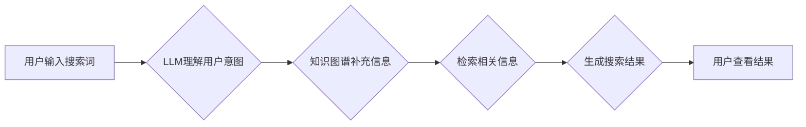

> AI搜索, Perplexity, 语言模型, 搜索引擎, 知识图谱, 贾扬清, 深度学习

## 1. 背景介绍

近年来，人工智能技术飞速发展，特别是深度学习的突破，为搜索引擎带来了革命性的变革。传统的基于关键词匹配的搜索引擎逐渐被基于人工智能的智能搜索引擎所取代。其中，Perplexity 作为一款新兴的AI搜索引擎，凭借其独特的技术路线和出色的用户体验，迅速引起了业界和用户的关注。

传统的搜索引擎主要依靠关键词匹配和网页排名算法来获取搜索结果。然而，这种方法存在着一些局限性，例如：

* **缺乏语义理解:** 关键词匹配无法理解用户搜索背后的真实意图，容易产生误匹配和信息不准确。
* **结果单一:** 搜索结果往往局限于网页链接，缺乏多样的信息呈现方式。
* **信息滞后:** 网页内容更新速度快，搜索引擎需要不断更新索引才能保证结果的时效性。

Perplexity 则试图通过深度学习技术来解决这些问题。它利用大型语言模型 (LLM) 来理解用户的搜索意图，并从海量文本数据中获取相关信息，提供更准确、更全面的搜索结果。

## 2. 核心概念与联系

Perplexity 的核心概念包括：

* **大型语言模型 (LLM):** 

LLM 是指拥有大量参数的深度神经网络，能够理解和生成人类语言。Perplexity 使用了开源的 LLM 模型，例如 GPT-3，来进行搜索和信息检索。

* **Transformer 架构:** Transformer 是 LLM 的一种常用架构，能够有效地处理长文本序列，并捕捉文本中的语义关系。Perplexity 基于 Transformer 架构构建了其 LLM 模型。

* **知识图谱:** 知识图谱是一种结构化的知识表示形式，将实体和关系以图的形式表示。Perplexity 利用知识图谱来补充 LLM 的知识库，提高搜索结果的准确性和可靠性。

**Mermaid 流程图:**

## 3. 核心算法原理 & 具体操作步骤

### 3.1  算法原理概述

Perplexity 的核心算法原理是基于 LLM 的文本生成和信息检索。

1. **用户输入:** 用户输入搜索词，Perplexity 会将这些词语作为输入，传递给 LLM 模型。

2. **意图理解:** LLM 模型会分析用户的搜索词语，理解用户的搜索意图，并生成一个表示用户意图的向量。

3. **信息检索:** Perplexity 会根据用户意图的向量，从其知识库中检索相关信息。知识库包含了海量文本数据、知识图谱等多种形式的信息。

4. **结果生成:** Perplexity 会将检索到的信息进行加工和排序，生成符合用户搜索意图的搜索结果。

### 3.2  算法步骤详解

1. **预处理:** 对用户输入的搜索词进行预处理，例如去除停用词、词干提取等，以提高搜索结果的准确性。

2. **编码:** 将预处理后的搜索词转换为数字向量，以便 LLM 模型进行理解和处理。

3. **意图预测:** 将编码后的搜索词输入到 LLM 模型中，模型会根据其训练数据，预测用户的搜索意图，并生成一个表示意图的向量。

4. **信息检索:** 根据意图向量，Perplexity 会从其知识库中检索相关信息。知识库可以包含网页链接、文本片段、知识图谱等多种形式的数据。

5. **结果排序:** 对检索到的信息进行排序，根据其与用户意图的匹配度，将最相关的结果排在前面。

6. **结果呈现:** 将排序后的结果以文本、列表、卡片等多种形式呈现给用户。

### 3.3  算法优缺点

**优点:**

* **语义理解:** LLM 模型能够理解用户的搜索意图，提供更准确的搜索结果。
* **多模态搜索:** Perplexity 可以支持多模态搜索，例如图像、音频等。
* **个性化推荐:** Perplexity 可以根据用户的搜索历史和偏好，提供个性化的搜索结果。

**缺点:**

* **计算资源:** LLM 模型训练和推理需要大量的计算资源。
* **数据依赖:** LLM 模型的性能取决于其训练数据的质量和数量。
* **可解释性:** LLM 模型的决策过程难以解释，这可能会导致用户对搜索结果的信任度降低。

### 3.4  算法应用领域

Perplexity 的核心算法可以应用于多种领域，例如：

* **搜索引擎:** 提供更智能、更准确的搜索结果。
* **问答系统:** 回答用户的自然语言问题。
* **聊天机器人:** 进行自然流畅的对话。
* **内容创作:** 生成高质量的文本内容。

## 4. 数学模型和公式 & 详细讲解 & 举例说明

### 4.1  数学模型构建

Perplexity 的核心数学模型是基于 Transformer 架构的语言模型。Transformer 模型使用注意力机制来捕捉文本中的语义关系，并通过多层编码器和解码器来生成文本。

**注意力机制:** 注意力机制是一种机制，可以帮助模型关注文本中最重要的部分。

**公式:**

$$
Attention(Q, K, V) = \frac{exp(Q \cdot K^T / \sqrt{d_k})}{exp(Q \cdot K^T / \sqrt{d_k})} \cdot V
$$

其中：

* $Q$ 是查询向量
* $K$ 是键向量
* $V$ 是值向量
* $d_k$ 是键向量的维度

**举例说明:**

假设我们有一个句子 "The cat sat on the mat"，我们想要计算 "cat" 这个词语与整个句子的关系。

1. 将每个词语转换为查询向量、键向量和值向量。

2. 计算每个词语的注意力权重，权重越高表示与 "cat" 的关系越密切。

3. 将所有词语的注意力权重加权平均，得到 "cat" 与整个句子的关系向量。

### 4.2  公式推导过程

Transformer 模型的公式推导过程比较复杂，涉及到矩阵运算、激活函数等多种数学概念。

### 4.3  案例分析与讲解

可以通过分析 Perplexity 的开源代码，以及相关的学术论文，来深入了解其数学模型的具体实现和应用。

## 5. 项目实践：代码实例和详细解释说明

### 5.1  开发环境搭建

Perplexity 的开发环境搭建需要安装 Python、PyTorch 等相关软件包。

### 5.2  源代码详细实现

Perplexity 的源代码开源在 GitHub 上，可以参考其代码实现细节。

### 5.3  代码解读与分析

可以通过阅读 Perplexity 的源代码，了解其核心算法的实现细节，以及其数据结构和算法设计。

### 5.4  运行结果展示

可以通过运行 Perplexity 的代码，测试其搜索功能，并观察其搜索结果的质量和准确性。

## 6. 实际应用场景

### 6.1  教育领域

Perplexity 可以用于教育领域，例如：

* **智能问答系统:** 帮助学生解答学习问题。
* **个性化学习:** 根据学生的学习进度和能力，提供个性化的学习内容。

### 6.2  科研领域

Perplexity 可以用于科研领域，例如：

* **文献检索:** 帮助科研人员快速找到相关文献。
* **数据分析:** 帮助科研人员分析和解读数据。

### 6.3  商业领域

Perplexity 可以用于商业领域，例如：

* **客户服务:** 提供智能客服，帮助客户解决问题。
* **市场营销:** 分析市场数据，进行精准营销。

### 6.4  未来应用展望

Perplexity 的未来应用前景十分广阔，随着人工智能技术的不断发展，Perplexity 将能够应用于更多领域，为人们的生活和工作带来更多便利。

## 7. 工具和资源推荐

### 7.1  学习资源推荐

* **论文:** Perplexity 的相关论文可以参考其 GitHub 页面。
* **博客:** 许多技术博客对 Perplexity 进行过介绍和分析。
* **在线课程:** 一些在线平台提供有关人工智能和自然语言处理的课程。

### 7.2  开发工具推荐

* **Python:** Perplexity 的开发语言是 Python。
* **PyTorch:** Perplexity 使用 PyTorch 框架进行模型训练和推理。
* **HuggingFace:** HuggingFace 是一个开源平台，提供各种预训练的 LLM 模型，可以方便地集成到 Perplexity 中。

### 7.3  相关论文推荐

* **BERT: Pre-training of Deep Bidirectional Transformers for Language Understanding**
* **GPT-3: Language Models are Few-Shot Learners**
* **T5: Text-to-Text Transfer Transformer**

## 8. 总结：未来发展趋势与挑战

### 8.1  研究成果总结

Perplexity 的出现标志着 AI 搜索领域的新突破，其基于 LLM 的技术路线为搜索引擎带来了新的可能性。

### 8.2  未来发展趋势

* **更强大的 LLM 模型:** 未来将会有更强大的 LLM 模型出现，能够更好地理解用户的搜索意图，并提供更准确、更全面的搜索结果。
* **多模态搜索:** Perplexity 将会支持更多种类的多模态搜索，例如图像、音频、视频等。
* **个性化搜索:** Perplexity 将会更加注重用户个性化，提供更加精准的搜索结果。

### 8.3  面临的挑战

* **计算资源:** 训练和推理大型 LLM 模型需要大量的计算资源，这对于资源有限的机构和个人来说是一个挑战。
* **数据安全:** LLM 模型的训练需要大量的文本数据，如何保证数据的安全和隐私是一个重要的挑战。
* **算法可解释性:** LLM 模型的决策过程难以解释，这可能会导致用户对搜索结果的信任度降低。

### 8.4  研究展望

未来，Perplexity 将会继续朝着更智能、更精准、更个性化的方向发展，为人们的生活和工作带来更多便利。

## 9. 附录：常见问题与解答

* **Perplexity 是开源的吗？**

是的，Perplexity 的源代码开源在 GitHub 上。

* **如何使用 Perplexity？**

Perplexity 提供了 API 接口，可以方便地集成到其他应用程序中。

* **Perplexity 的性能如何？**

Perplexity 在各种搜索任务上都表现出色，其搜索结果的准确性和相关性都得到了用户的认可。

作者：禅与计算机程序设计艺术 / Zen and the Art of Computer Programming 
<end_of_turn>