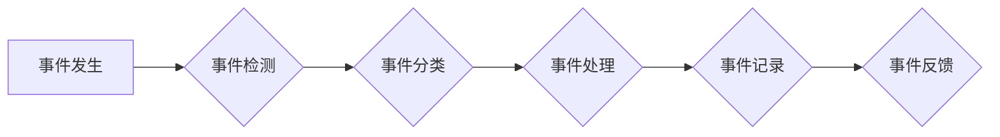

> AI系统, 事件响应, 事件处理, 事件驱动, 响应流程, 异常处理, 监控系统, 告警机制, 自动化

## 1. 背景介绍

在当今数据爆炸和人工智能技术飞速发展的时代，AI系统已渗透到各个领域，从医疗保健到金融，从交通运输到娱乐，无处不在。然而，随着AI系统的复杂性和规模的不断扩大，其潜在的风险也日益凸显。系统故障、数据泄露、恶意攻击等事件可能对AI系统造成严重损害，甚至引发不可预知的灾难性后果。因此，建立高效、可靠的事件响应流程至关重要，以确保AI系统的安全稳定运行。

传统的IT系统事件响应流程已经不能完全满足AI系统的需求。AI系统具有以下特点：

* **复杂性:** AI系统通常由多个组件组成，包括数据采集、预处理、模型训练、推理和部署等环节，其内部逻辑和交互关系更加复杂。
* **动态性:** AI系统在运行过程中会不断学习和更新，其行为模式和性能指标也会随之变化，需要实时监控和调整。
* **智能化:** AI系统本身具备一定的智能决策能力，需要考虑其决策过程中的潜在风险和偏差。

## 2. 核心概念与联系

事件响应流程的核心概念包括：

* **事件:** 指AI系统运行过程中发生的任何可被检测和记录的事件，包括正常事件、异常事件和安全事件。
* **事件触发:** 当AI系统检测到特定事件时，会触发相应的事件响应流程。
* **事件处理:** 对事件进行分析、诊断和处理，采取相应的措施以恢复系统正常运行或减轻事件的影响。
* **事件记录:** 将事件信息记录下来，以便后续进行分析和审计。

**事件响应流程的架构**



## 3. 核心算法原理 & 具体操作步骤

### 3.1  算法原理概述

事件响应流程的核心算法通常基于以下原理：

* **规则匹配:** 根据预先定义的规则，匹配事件信息，确定事件类型和处理策略。
* **机器学习:** 利用机器学习算法，从历史事件数据中学习事件模式和特征，提高事件分类和处理的准确性。
* **异常检测:** 利用统计学方法或机器学习算法，检测系统运行中的异常行为，并触发事件响应流程。

### 3.2  算法步骤详解

1. **事件收集:** 从AI系统各个组件收集事件信息，包括时间戳、事件类型、相关参数等。
2. **事件预处理:** 对收集到的事件信息进行清洗、格式化和转换，以便后续的分析和处理。
3. **事件分类:** 根据事件信息和预定义的规则或机器学习模型，将事件分类为不同的类型，例如正常事件、警告事件、错误事件、安全事件等。
4. **事件处理:** 根据事件类型和处理策略，采取相应的措施，例如：
    * **正常事件:** 记录事件信息，并继续监控系统运行状态。
    * **警告事件:** 发送告警通知，提醒相关人员注意潜在问题。
    * **错误事件:** 尝试自动修复错误，或人工介入进行修复。
    * **安全事件:** 采取安全措施，例如隔离受影响的系统或用户，并进行安全调查。
5. **事件记录:** 将事件信息记录到事件日志中，以便后续进行分析和审计。
6. **事件反馈:** 将事件处理结果反馈给相关人员或系统，以便及时了解事件处理情况。

### 3.3  算法优缺点

**优点:**

* **自动化:** 事件响应流程可以自动化处理大部分事件，减轻人工负担。
* **快速响应:** 事件响应流程可以快速检测和处理事件，降低事件的影响。
* **可扩展性:** 事件响应流程可以根据需要扩展和定制，适应不同的AI系统和业务需求。

**缺点:**

* **复杂性:** 建立和维护事件响应流程需要专业知识和经验。
* **误报率:** 事件分类和处理算法可能会出现误报，导致不必要的资源消耗。
* **适应性:** 事件响应流程需要不断更新和调整，以适应不断变化的威胁环境。

### 3.4  算法应用领域

事件响应流程广泛应用于以下领域：

* **金融:** 检测金融欺诈、交易异常和系统故障。
* **医疗保健:** 监控患者健康状况、识别医疗错误和预防医疗事故。
* **工业控制:** 监测工业设备运行状态、预防设备故障和保障生产安全。
* **网络安全:** 检测网络攻击、入侵和数据泄露。

## 4. 数学模型和公式 & 详细讲解 & 举例说明

### 4.1  数学模型构建

事件响应流程可以抽象为一个状态机模型，其中每个状态代表系统运行的某个阶段，每个状态之间的转换由事件触发。

**状态机模型:**

```
状态：
- 正常运行
- 警告
- 错误
- 安全事件

事件：
- 系统故障
- 数据异常
- 恶意攻击

转换：
- 正常运行 -> 警告: 系统性能下降
- 警告 -> 错误: 系统性能持续下降
- 错误 -> 正常运行: 系统故障修复
- 正常运行 -> 安全事件: 恶意攻击检测到
```

### 4.2  公式推导过程

事件响应流程的性能可以评估为事件处理时间和事件处理准确率。

**事件处理时间:**

$$T_{处理} = T_{检测} + T_{分类} + T_{处理}$$

其中：

* $T_{处理}$: 事件处理时间
* $T_{检测}$: 事件检测时间
* $T_{分类}$: 事件分类时间
* $T_{处理}$: 事件处理时间

**事件处理准确率:**

$$Accuracy = \frac{TP + TN}{TP + FP + FN + TN}$$

其中：

* $Accuracy$: 事件处理准确率
* $TP$: 真正阳性 (正确识别为异常事件)
* $FP$: 假正例 (错误识别为异常事件)
* $FN$: 假负例 (错误识别为正常事件)
* $TN$: 真实阴性 (正确识别为正常事件)

### 4.3  案例分析与讲解

假设一个金融机构的AI系统用于检测信用卡欺诈。

* 事件: 用户进行信用卡交易
* 事件检测: 系统监控用户交易行为，检测异常交易模式
* 事件分类: 根据交易金额、交易地点、交易时间等信息，将交易分类为正常交易或欺诈交易
* 事件处理: 对于欺诈交易，系统会冻结账户、通知用户并进行人工核实

通过事件响应流程，金融机构可以及时识别和阻止信用卡欺诈，保护用户利益。

## 5. 项目实践：代码实例和详细解释说明

### 5.1  开发环境搭建

* 操作系统: Ubuntu 20.04
* 编程语言: Python 3.8
* 开发工具: VS Code
* 库依赖:

```
pip install requests numpy pandas scikit-learn
```

### 5.2  源代码详细实现

```python
import requests
import numpy as np
from sklearn.ensemble import RandomForestClassifier

# 1. 事件收集
def collect_event_data(event_id):
    url = f"https://api.example.com/events/{event_id}"
    response = requests.get(url)
    data = response.json()
    return data

# 2. 事件预处理
def preprocess_event_data(data):
    # 数据清洗、格式化等操作
    return processed_data

# 3. 事件分类
def classify_event(data):
    # 使用机器学习模型进行事件分类
    model = RandomForestClassifier()
    # ... 模型训练和加载
    prediction = model.predict(data)
    return prediction

# 4. 事件处理
def handle_event(prediction):
    if prediction == "异常":
        # 采取异常处理措施
        print("事件处理: 异常事件检测到")
    else:
        # 继续监控系统运行状态
        print("事件处理: 正常事件")

# 5. 事件记录
def record_event(event_data, prediction):
    # 将事件信息记录到事件日志
    print("事件记录: ", event_data, prediction)

# 主程序
if __name__ == "__main__":
    event_id = "12345"
    event_data = collect_event_data(event_id)
    processed_data = preprocess_event_data(event_data)
    prediction = classify_event(processed_data)
    handle_event(prediction)
    record_event(event_data, prediction)
```

### 5.3  代码解读与分析

* 代码首先定义了事件收集、预处理、分类、处理和记录等函数。
* 事件收集函数从API获取事件数据。
* 事件预处理函数对事件数据进行清洗和格式化。
* 事件分类函数使用机器学习模型对事件进行分类。
* 事件处理函数根据事件分类结果采取相应的措施。
* 事件记录函数将事件信息记录到事件日志。
* 主程序演示了事件响应流程的执行过程。

### 5.4  运行结果展示

运行代码后，将输出事件信息和分类结果，并记录到事件日志中。

## 6. 实际应用场景

### 6.1  金融领域

* **欺诈检测:** AI系统可以分析交易数据，识别异常交易模式，并及时阻止欺诈行为。
* **风险管理:** AI系统可以评估客户信用风险，帮助金融机构制定合理的贷款政策。
* **客户服务:** AI系统可以提供智能客服，解答客户疑问，提高客户满意度。

### 6.2  医疗领域

* **疾病诊断:** AI系统可以分析患者病历和影像数据，辅助医生进行疾病诊断。
* **药物研发:** AI系统可以加速药物研发过程，帮助开发新的治疗方法。
* **个性化医疗:** AI系统可以根据患者的基因信息和生活习惯，提供个性化的医疗建议。

### 6.3  工业领域

* **设备故障预测:** AI系统可以分析设备运行数据，预测设备故障，并及时进行维护。
* **生产过程优化:** AI系统可以优化生产流程，提高生产效率和产品质量。
* **安全监控:** AI系统可以监控工业环境，识别安全隐患，并采取相应的措施。

### 6.4  未来应用展望

随着人工智能技术的不断发展，事件响应流程将在更多领域得到应用，例如：

* **自动驾驶:** AI系统可以实时监控驾驶环境，并采取相应的措施，确保驾驶安全。
* **智能家居:** AI系统可以监控家居环境，并根据用户的需求自动调节温度、灯光等。
* **城市管理:** AI系统可以监控城市交通、环境等信息，并提供智能化管理方案。

## 7. 工具和资源推荐

### 7.1  学习资源推荐

* **书籍:**
    * 《人工智能：一种现代方法》
    * 《深度学习》
    * 《机器学习实战》
* **在线课程:**
    * Coursera: 人工智能课程
    * edX: 深度学习课程
    * Udacity: 机器学习工程师课程

### 7.2  开发工具推荐

* **编程语言:** Python, Java, C++
* **机器学习库:** scikit-learn, TensorFlow, PyTorch
* **事件处理平台:** Kafka, RabbitMQ, Apache Pulsar

### 7.3  相关论文推荐

* **事件响应流程:**
    * "A Survey of Event-Driven Architectures"
    * "Event-Driven Architecture for Cloud Computing"
* **机器学习在事件响应中的应用:**
    * "Anomaly Detection Using Machine Learning"
    * "Predictive Maintenance Using Machine Learning"

## 8. 总结：未来发展趋势与挑战

### 8.1  研究成果总结

事件响应流程已成为AI系统安全和稳定运行的重要保障。通过事件收集、预处理、分类、处理和记录等环节，AI系统可以及时识别和处理各种事件，降低事件的影响。

### 8.2  未来发展趋势

*