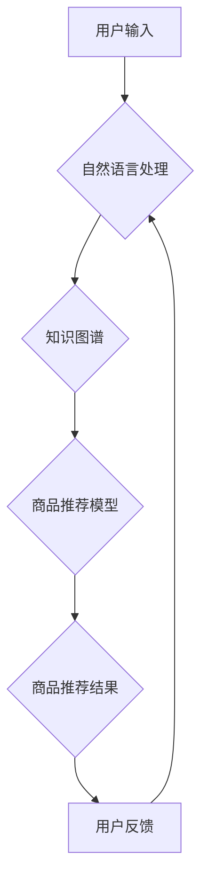

> AI虚拟导购助手、自然语言处理、深度学习、推荐系统、用户体验、电商平台

## 1. 背景介绍

随着电子商务的蓬勃发展，消费者对购物体验的需求日益提高。传统的购物方式，例如线下实体店或网站浏览，往往存在着信息获取不全面、选择困难、购物体验单调等问题。为了解决这些问题，AI虚拟导购助手应运而生，它利用人工智能技术，为消费者提供个性化、智能化的购物体验。

AI虚拟导购助手是一种基于人工智能的智能客服系统，能够通过自然语言处理（NLP）技术理解用户的需求，并提供相应的商品推荐、咨询服务和购物指导。它可以模拟真人导购员的互动方式，与用户进行自然流畅的对话，帮助用户快速找到心仪的商品，并提供专业的购物建议。

## 2. 核心概念与联系

**2.1 核心概念**

* **自然语言处理（NLP）：** 
NLP是人工智能领域的一个重要分支，旨在使计算机能够理解、处理和生成人类语言。在AI虚拟导购助手中，NLP技术用于理解用户的自然语言输入，例如文本或语音，并将其转换为计算机可理解的格式。

* **深度学习（Deep Learning）：** 
深度学习是一种机器学习的子领域，它利用多层神经网络来学习数据中的复杂模式。在AI虚拟导购助手中，深度学习技术用于训练商品推荐模型、用户画像模型等，提高推荐的准确性和个性化程度。

* **推荐系统（Recommendation System）：** 
推荐系统是AI虚拟导购助手的核心功能之一，它根据用户的历史购买记录、浏览记录、兴趣偏好等信息，推荐用户可能感兴趣的商品。

* **用户体验（User Experience）：** 
用户体验是指用户使用产品或服务时的感受和体验。AI虚拟导购助手的设计目标是提升用户购物体验，使其更加便捷、高效、愉悦。

**2.2 架构图**



## 3. 核心算法原理 & 具体操作步骤

**3.1 算法原理概述**

AI虚拟导购助手的核心算法原理主要包括：

* **自然语言理解（NLU）：** 
利用NLP技术，将用户的自然语言输入转换为机器可理解的结构化数据，例如实体识别、意图识别、关系抽取等。

* **知识图谱构建：** 
构建商品、品牌、属性等相关知识图谱，为AI虚拟导购助手提供商品信息和知识背景。

* **推荐算法：** 
利用深度学习算法，例如协同过滤、内容过滤、混合推荐等，根据用户的历史行为和偏好，推荐用户可能感兴趣的商品。

* **对话管理：** 
设计对话流程和策略，引导用户完成购物任务，并提供个性化的购物建议。

**3.2 算法步骤详解**

1. **用户输入：** 用户通过文本或语音输入购物需求。
2. **自然语言理解：** NLU模型识别用户输入中的实体、意图和关系。
3. **知识图谱查询：** 根据NLU结果，从知识图谱中查询相关商品信息。
4. **推荐算法：** 推荐算法根据用户历史行为和偏好，从商品库中推荐相关商品。
5. **结果展示：** 将推荐结果以文本或图像形式展示给用户。
6. **用户反馈：** 用户对推荐结果进行反馈，例如点击、购买、评价等。
7. **模型更新：** 根据用户反馈，更新推荐算法模型，提高推荐准确率。

**3.3 算法优缺点**

**优点：**

* **个性化推荐：** 根据用户的历史行为和偏好，提供个性化的商品推荐。
* **智能化服务：** 可以模拟真人导购员的互动方式，提供智能化的购物咨询和指导。
* **提升购物体验：** 使购物过程更加便捷、高效、愉悦。

**缺点：**

* **数据依赖：** 推荐算法需要大量用户数据进行训练，否则推荐效果会下降。
* **算法复杂度：** 训练和部署推荐算法模型需要一定的技术难度。
* **隐私安全：** 需要妥善处理用户数据，保障用户隐私安全。

**3.4 算法应用领域**

AI虚拟导购助手可以应用于各种电商平台，例如：

* **服装电商：** 推荐服装、鞋帽、配饰等商品。
* **电子产品电商：** 推荐手机、电脑、家电等商品。
* **食品电商：** 推荐食品、饮料、日用品等商品。
* **旅游电商：** 推荐旅游线路、酒店、机票等服务。

## 4. 数学模型和公式 & 详细讲解 & 举例说明

**4.1 数学模型构建**

在AI虚拟导购助手中，常用的数学模型包括：

* **协同过滤模型：** 
协同过滤模型基于用户的历史行为和商品的相似度进行推荐。

* **内容过滤模型：** 
内容过滤模型基于商品的属性和用户的兴趣偏好进行推荐。

* **混合推荐模型：** 
混合推荐模型结合协同过滤和内容过滤模型，提高推荐的准确性和个性化程度。

**4.2 公式推导过程**

**协同过滤模型的公式推导过程：**

假设用户u对商品i的评分为r<sub>ui</sub>，则协同过滤模型的目标是预测用户u对商品j的评分r<sub>uj</sub>。

协同过滤模型常用的公式包括：

* **基于用户的协同过滤：**

$$
r_{uj} = \bar{r}_u + \frac{\sum_{i \in N(u)} (r_{ui} - \bar{r}_u) \cdot s_{ij}}{\sum_{i \in N(u)} s_{ij}^2}
$$

其中：

* r<sub>uj</sub>：用户u对商品j的评分
* r<sub>ui</sub>：用户u对商品i的评分
*  $\bar{r}_u$：用户u的平均评分
* N(u)：用户u评分过的商品集合
* s<sub>ij</sub>：商品i和商品j的相似度

* **基于物品的协同过滤：**

$$
r_{uj} = \bar{r}_j + \frac{\sum_{i \in N(j)} (r_{ui} - \bar{r}_i) \cdot s_{ij}}{\sum_{i \in N(j)} s_{ij}^2}
$$

其中：

* r<sub>uj</sub>：用户u对商品j的评分
* r<sub>ui</sub>：用户u对商品i的评分
*  $\bar{r}_j$：商品j的平均评分
* N(j)：商品j被评分过的用户集合
* s<sub>ij</sub>：商品i和商品j的相似度

**4.3 案例分析与讲解**

假设有一个电商平台，用户A购买了商品1和商品2，用户B购买了商品2和商品3。

根据协同过滤模型，我们可以计算商品1和商品3的相似度，并预测用户A对商品3的评分。

## 5. 项目实践：代码实例和详细解释说明

**5.1 开发环境搭建**

* 操作系统：Windows/macOS/Linux
* Python版本：3.6+
* 必要的库：TensorFlow/PyTorch、NLTK、spaCy、Scikit-learn等

**5.2 源代码详细实现**

```python
# 导入必要的库
import tensorflow as tf
from sklearn.metrics.pairwise import cosine_similarity

# 定义协同过滤模型
class CollaborativeFiltering:
    def __init__(self, ratings_matrix):
        self.ratings_matrix = ratings_matrix

    def train(self):
        # 使用矩阵分解算法训练模型
        # ...

    def predict(self, user_id, item_id):
        # 使用训练好的模型预测用户对商品的评分
        # ...

# 加载用户评分数据
ratings_matrix = load_ratings_data()

# 创建协同过滤模型
model = CollaborativeFiltering(ratings_matrix)

# 训练模型
model.train()

# 预测用户对商品的评分
predicted_rating = model.predict(user_id, item_id)

# 打印预测结果
print(f"用户 {user_id} 对商品 {item_id} 的预测评分为：{predicted_rating}")
```

**5.3 代码解读与分析**

* 该代码示例展示了如何使用协同过滤模型进行商品推荐。
* 首先，需要加载用户评分数据，并将其存储在ratings_matrix中。
* 然后，创建CollaborativeFiltering类，并传入ratings_matrix作为参数。
* 在train()方法中，使用矩阵分解算法训练模型。
* 在predict()方法中，使用训练好的模型预测用户对商品的评分。

**5.4 运行结果展示**

运行该代码后，将输出用户对特定商品的预测评分。

## 6. 实际应用场景

**6.1 电商平台**

AI虚拟导购助手可以应用于各种电商平台，例如淘宝、京东、亚马逊等，为用户提供个性化的商品推荐、购物咨询和指导。

**6.2 社交媒体平台**

AI虚拟导购助手可以应用于社交媒体平台，例如微信、微博、抖音等，为用户推荐商品、提供购物链接，并引导用户进行购买。

**6.3 企业官网**

企业官网可以利用AI虚拟导购助手，为用户提供产品信息、技术支持和售后服务，提升用户体验。

**6.4 未来应用展望**

随着人工智能技术的不断发展，AI虚拟导购助手将拥有更强大的功能和更智能化的体验，例如：

* **多模态交互：** 支持文本、语音、图像等多模态交互，提供更丰富的用户体验。
* **个性化定制：** 根据用户的个性化需求，提供定制化的商品推荐和购物方案。
* **场景化服务：** 根据用户的购物场景，提供相应的个性化服务，例如节日促销、生日礼物推荐等。

## 7. 工具和资源推荐

**7.1 学习资源推荐**

* **书籍：**
    * 《深度学习》
    * 《自然语言处理》
    * 《推荐系统》
* **在线课程：**
    * Coursera
    * edX
    * Udacity

**7.2 开发工具推荐**

* **Python：** 
Python是AI开发的常用语言，拥有丰富的库和框架，例如TensorFlow、PyTorch、NLTK等。
* **Jupyter Notebook：** 
Jupyter Notebook是一种交互式编程环境，方便进行代码编写、调试和可视化。

**7.3 相关论文推荐**

* **协同过滤：**
    * "Collaborative Filtering for Implicit Feedback Datasets"
    * "Matrix Factorization Techniques for Recommender Systems"
* **深度学习推荐：**
    * "Deep Learning for Recommender Systems"
    * "Neural Collaborative Filtering"

## 8. 总结：未来发展趋势与挑战

**8.1 研究成果总结**

AI虚拟导购助手已经取得了显著的成果，能够为用户提供个性化、智能化的购物体验。

**8.2 未来发展趋势**

未来，AI虚拟导购助手将朝着以下方向发展：

* **更智能化：** 利用更先进的人工智能算法，例如强化学习、迁移学习等，提高推荐的准确性和个性化程度。
* **更个性化：** 更加深入地理解用户的需求和偏好，提供更加个性化的购物建议和服务。
* **更场景化：** 根据用户的购物场景，提供相应的个性化服务，例如节日促销、生日礼物推荐等。

**8.3 面临的挑战**

AI虚拟导购助手的发展也面临着一些挑战：

* **数据隐私：** 需要妥善处理用户数据，保障用户隐私安全。
* **算法公平性：** 算法需要公平公正，避免出现歧视或偏见。
* **用户信任：** 需要建立用户的信任，使其愿意接受AI虚拟导购助手的服务。

**8.4 研究