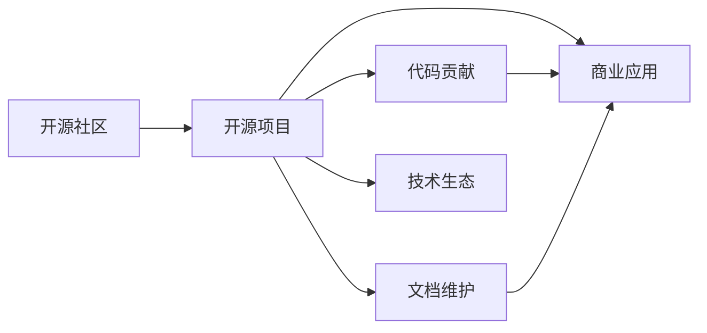

                 

# 开源创业：协作创新的新模式

在当今快速发展的科技环境中，创新已经成为了推动企业发展、实现技术突破的关键驱动力。然而，创新并非孤立事件，而是需要大量的资源、团队合作和技术积累。开源作为一种协作创新的模式，为创业公司提供了一个新的方向。本文将探讨开源创业的概念、核心价值、实施策略及其未来的发展趋势，期望能为您提供深入的理解和有益的实践参考。

## 1. 背景介绍

### 1.1 问题的提出

随着互联网技术的飞速发展和普及，越来越多的创业公司选择以开源的方式推进技术创新。开源创业不仅改变了传统的商业模式和技术发展路径，还对企业的文化、组织结构和竞争优势产生了深远影响。因此，理解开源创业的核心概念和价值，对有意入局的企业来说至关重要。

### 1.2 问题核心关键点

开源创业的核心理念是利用社区的力量，通过合作和共享来实现技术创新和商业成功。核心关键点包括：
- **合作共赢**：开源社区的成员共同努力，分享知识和资源，实现共同的目标。
- **代码透明**：开源项目的所有代码都是公开可见的，所有人都可以访问、使用和修改。
- **快速迭代**：通过社区的广泛参与和贡献，项目可以快速迭代，快速适应市场需求。
- **开放生态**：开源项目往往形成了一个广泛的生态系统，拥有大量相关的工具和组件。
- **商业机会**：基于开源项目的上层应用和商业化服务，形成新的商业模式。

这些核心关键点构成了开源创业的基石，为创业公司提供了一个快速、灵活且具有高度适应性的技术发展平台。

## 2. 核心概念与联系

### 2.1 核心概念概述

开源创业是一个通过开源技术推动企业创新和商业发展的过程。其核心概念包括：
- **开源社区**：一群志同道合的人，围绕一个共同的项目或目标，通过代码贡献、讨论和协作来推进技术创新。
- **开源项目**：由开源社区开发和维护的软件项目，所有代码都是公开可见的，可以自由使用和修改。
- **代码贡献**：社区成员向项目提交代码和文档，参与项目的开发和改进。
- **商业应用**：基于开源项目的上层应用或服务，形成商业模式和收入来源。
- **生态系统**：围绕开源项目形成的工具、插件、服务等，形成了一个完整的技术生态。

### 2.2 核心概念原理和架构的 Mermaid 流程图



这个流程图展示了开源创业的核心流程和关键组件：开源社区通过项目维护和贡献代码、文档，形成了开源项目。而商业应用则基于开源项目的上层服务或应用，形成新的商业机会。此外，技术生态的构建也为商业应用提供了丰富的资源和支持。

## 3. 核心算法原理 & 具体操作步骤

### 3.1 算法原理概述

开源创业的核心算法原理是通过社区的广泛参与和协作，实现技术的快速迭代和创新。其核心思想包括：
- **众包开发**：将项目的开发任务分配给社区成员，实现快速的代码贡献和迭代。
- **开放合作**：通过开放的代码和文档，吸引更多社区成员和外部贡献者，形成更大的合作网络。
- **反馈循环**：通过社区的讨论和反馈，及时调整和优化项目，保持技术的先进性和适用性。
- **商业化策略**：基于开源项目的上层应用和服务，形成新的商业模式和收入来源。

### 3.2 算法步骤详解

开源创业的实施步骤可以分为以下几个阶段：

#### 阶段一：项目启动

1. **定义目标**：明确项目的开发目标和方向，确保社区成员和贡献者有共同的目标。
2. **创建项目**：在开源平台上创建项目，如GitHub、Apache等。
3. **社区建设**：通过宣传、活动等方式吸引潜在成员加入，建立活跃的社区氛围。

#### 阶段二：社区协作

1. **任务分配**：将项目的开发任务分解为小的、可管理的部分，分配给社区成员。
2. **代码贡献**：鼓励社区成员提交代码、修复bug、增加功能，推动项目的迭代和优化。
3. **文档维护**：保持项目的文档和说明清晰准确，方便新成员理解和参与。

#### 阶段三：商业应用

1. **探索商业化路径**：基于开源项目的上层应用和服务，探索新的商业模式，如SaaS、PaaS、订阅服务等。
2. **市场推广**：通过市场营销和推广，将商业应用推向市场，吸引客户和用户。
3. **反馈循环**：收集用户反馈，持续优化商业应用和开源项目，实现产品和技术的不断进化。

#### 阶段四：生态构建

1. **工具和组件开发**：围绕开源项目，开发相关的工具、插件和服务，形成完整的生态系统。
2. **生态维护**：维护生态系统的稳定性和活跃度，确保各个组件和服务的兼容性。
3. **商业合作**：与其他企业或机构合作，共同开发和推广生态系统中的产品和服务。

### 3.3 算法优缺点

开源创业的优点包括：
- **快速迭代**：通过社区的广泛参与，可以实现快速的代码贡献和项目迭代。
- **灵活性高**：基于开源项目的上层应用和商业化服务，可以迅速适应市场变化和用户需求。
- **成本低**：利用社区的力量，可以降低开发成本和技术门槛。
- **生态丰富**：开源项目往往形成一个完整的技术生态，拥有丰富的工具和组件。

同时，开源创业也存在一些局限：
- **依赖社区**：项目的发展高度依赖社区的活跃度和贡献度，容易受到社区动荡的影响。
- **知识产权风险**：开源项目的代码和文档公开可见，可能导致知识产权风险。
- **市场竞争激烈**：开源项目容易吸引大量外部贡献者，增加了市场竞争的压力。
- **质量控制难度**：开源项目由社区成员共同维护，质量控制难度较大。

### 3.4 算法应用领域

开源创业模式已经在多个领域得到了广泛应用，包括但不限于以下几个方面：

#### 1. **云计算和基础设施**

- **OpenStack**：一个开源的云计算基础设施项目，由多个社区共同维护。
- **Kubernetes**：一个开源的容器编排系统，被广泛应用于云原生应用。

#### 2. **大数据和分析**

- **Apache Hadoop**：一个开源的大数据处理框架，支持分布式存储和计算。
- **Apache Spark**：一个开源的大数据处理引擎，支持批处理和流处理。

#### 3. **移动开发**

- **Apache Cordova**：一个开源的移动应用开发框架，支持多种移动平台。
- **React Native**：一个开源的跨平台移动应用框架，支持iOS和Android。

#### 4. **开源社区和开发工具**

- **GitHub**：一个开源的代码托管平台，支持多种版本控制和协作工具。
- **Apache Maven**：一个开源的项目构建和依赖管理工具，支持Java项目。

## 4. 数学模型和公式 & 详细讲解 & 举例说明

### 4.1 数学模型构建

开源创业的数学模型主要关注项目的参与度和贡献度。我们可以使用以下模型来描述开源项目的发展过程：

- **贡献度模型**：$C(t) = k \times \text{社区规模} \times \text{开发效率}$

  其中，$C(t)$ 表示在第$t$时间点的贡献度，$k$ 是一个常数，社区规模和开发效率是影响贡献度的关键因素。

- **活跃度模型**：$A(t) = C(t) \times \text{反馈速度}$

  其中，$A(t)$ 表示在第$t$时间点的活跃度，$C(t)$ 表示贡献度，反馈速度是决定项目活跃度的另一个关键因素。

### 4.2 公式推导过程

#### 贡献度模型推导

假设社区规模为$S(t)$，开发效率为$E(t)$，贡献度的函数为：

$$
C(t) = k \times S(t) \times E(t)
$$

其中，$S(t)$ 是社区在第$t$时间点的成员数量，$E(t)$ 是开发效率，通常表示为单位时间内的代码提交次数或功能点实现数量。

#### 活跃度模型推导

假设反馈速度为$F(t)$，则活跃度的函数为：

$$
A(t) = C(t) \times F(t)
$$

其中，$A(t)$ 表示项目在第$t$时间点的活跃度，$C(t)$ 表示贡献度，$F(t)$ 表示反馈速度，通常表示为社区成员的讨论频率或修复bug的速度。

### 4.3 案例分析与讲解

以**Kubernetes**为例，分析其开源创业的成功因素：

1. **定义清晰的目标**：Kubernetes的初始目标是为Google的容器编排提供替代方案。
2. **强大的社区支持**：吸引了全球各地的开发者和用户，形成了活跃的社区氛围。
3. **高效的贡献机制**：通过PR（Pull Request）和代码评审机制，实现了快速的代码贡献和迭代。
4. **市场应用广泛**：基于Kubernetes的云原生应用和容器编排服务，形成了一个庞大的生态系统。

Kubernetes的成功离不开社区的力量，通过开源创业的模式，实现了技术的快速迭代和市场应用的广泛推广。

## 5. 项目实践：代码实例和详细解释说明

### 5.1 开发环境搭建

要实现开源创业项目，首先需要搭建一个开发环境。这里以**GitHub**为例，展示如何创建一个开源项目：

1. 在GitHub上创建账户并登录。
2. 点击“New repository”按钮，输入项目名称、描述、初始化Readme文件等信息。
3. 创建完成后，克隆项目到本地，并进行代码贡献和社区维护。

### 5.2 源代码详细实现

以一个简单的开源项目为例，展示如何实现开源创业项目的代码贡献和迭代：

1. **创建项目仓库**：在GitHub上创建一个项目仓库，命名为“my_open_source_project”。
2. **提交代码贡献**：在本地编辑器中编写代码，并将代码提交到项目仓库，编写提交信息。
3. **代码评审和合并**：提交后，项目管理员或社区成员对代码进行评审，确认无误后合并到主分支。
4. **持续迭代**：继续提交新代码，进行功能完善和优化，推动项目不断迭代。

### 5.3 代码解读与分析

开源创业项目的代码贡献和迭代是一个持续的过程，以下是关键代码的解读：

#### Git提交代码

```bash
git add .
git commit -m "Add new feature"
git push origin master
```

上述代码将本地修改提交到GitHub仓库，并记录提交信息。

#### PR和代码评审

1. 在GitHub上提交Pull Request。
2. 项目管理员或社区成员进行代码评审。
3. 确认无误后，点击“Merge pull request”按钮合并代码。

### 5.4 运行结果展示

开源创业项目的运行结果可以通过代码提交、社区反馈和市场应用等方式展示。以下是一些展示方式：

- **代码提交记录**：GitHub提供的代码提交记录，展示了项目的发展历程和贡献者信息。
- **社区讨论**：社区成员在Issue和PR中的讨论，展示了项目的发展方向和用户反馈。
- **市场应用**：基于开源项目的上层应用和服务，展示了项目的技术成熟度和市场影响力。

## 6. 实际应用场景

### 6.1 智能制造

在智能制造领域，开源创业可以推动工业4.0的发展。通过开源平台，企业可以共享数据、工具和知识，实现协作创新。

具体应用场景包括：
- **数据采集和分析**：企业可以共享数据采集和分析工具，实现实时监测和决策支持。
- **设备管理和维护**：企业可以共享设备和维护知识，实现设备故障预测和预防性维护。
- **工艺优化和改进**：企业可以共享工艺流程和改进经验，实现工艺优化和生产效率提升。

### 6.2 医疗健康

在医疗健康领域，开源创业可以推动健康管理和医疗服务的创新。通过开源平台，医疗机构可以共享数据和知识，实现协作创新。

具体应用场景包括：
- **电子病历共享**：医疗机构可以共享电子病历和健康数据，实现精准医疗和个性化治疗。
- **健康数据分析**：医疗机构可以共享数据分析工具和算法，实现健康风险预测和干预。
- **远程医疗服务**：医疗机构可以共享远程医疗服务，实现异地医疗和应急响应。

### 6.3 环境保护

在环境保护领域，开源创业可以推动绿色科技的发展。通过开源平台，企业可以共享技术和知识，实现协作创新。

具体应用场景包括：
- **环境监测和预警**：企业可以共享环境监测数据和预警系统，实现环境变化的实时监测和预警。
- **可再生能源开发**：企业可以共享可再生能源技术和应用案例，实现可再生能源的广泛推广和应用。
- **资源循环利用**：企业可以共享资源循环利用技术和经验，实现资源的有效利用和环境保护。

## 7. 工具和资源推荐

### 7.1 学习资源推荐

为了深入理解开源创业的理念和实践，以下是一些推荐的资源：

1. **《开源之路》**：介绍开源社区、开源项目和开源创业的基本概念和最佳实践。
2. **《Open Source for Business》**：由Open Source Initiative编写的开源指导手册，涵盖开源的原则、实践和管理。
3. **《开源社区的崛起》**：探讨开源社区的兴起和影响，分析开源创业的成功案例。
4. **《开源项目管理和维护》**：详细介绍开源项目的管理和维护技术，包括版本控制、代码评审和社区协作。

### 7.2 开发工具推荐

以下是一些常用的开源创业开发工具：

1. **GitHub**：全球最大的代码托管平台，支持版本控制和社区协作。
2. **Apache JIRA**：开源项目管理工具，支持任务分配、代码评审和项目跟踪。
3. **GitLab**：另一个代码托管和项目管理平台，支持持续集成和部署。
4. **Slack**：开源社区常用的即时通讯工具，支持实时讨论和协作。
5. **Trello**：开源项目管理工具，支持任务管理、进度跟踪和协作。

### 7.3 相关论文推荐

以下是一些关于开源创业的重要论文，供深入学习和参考：

1. **《Open Source Software: The Open Source Movement's Evolving Business Models》**：探讨开源软件和开源创业的商业模型。
2. **《The Economics of Open Source Software》**：分析开源社区的经济模型和激励机制。
3. **《Open Source Innovation: Scaling the Open Source Revolution》**：探讨开源创业的创新模式和挑战。
4. **《The Rise of the Digital Economy》**：分析数字经济和开源创业的趋势和前景。

## 8. 总结：未来发展趋势与挑战

### 8.1 研究成果总结

开源创业作为协作创新的新模式，已经取得了显著的成果，并在多个领域得到广泛应用。其核心优势在于利用社区的力量，实现技术的快速迭代和创新。通过开源创业，企业可以降低开发成本，提高技术成熟度和市场竞争力。

### 8.2 未来发展趋势

展望未来，开源创业将呈现以下几个发展趋势：

1. **社区生态多样化**：开源社区将更加多样化，涵盖更多行业和领域，形成更广泛的技术生态。
2. **技术创新加速**：开源创业将推动更多创新技术的涌现，加速科技发展和产业升级。
3. **商业应用深化**：开源创业将推动更多商业应用的深入应用，实现技术与市场的深度融合。
4. **全球化合作加强**：开源创业将加强全球范围内的合作，形成更广泛的国际合作网络。
5. **开源安全保障**：开源创业将更加注重安全性，建立完备的开源安全保障机制。

### 8.3 面临的挑战

尽管开源创业有着广阔的前景，但仍面临一些挑战：

1. **社区管理复杂**：开源项目的社区管理和维护需要大量的资源和精力。
2. **知识产权风险**：开源项目的代码和文档公开可见，可能存在知识产权风险。
3. **商业化难度**：开源项目需要通过商业化才能实现可持续的发展，但商业化过程面临诸多挑战。
4. **市场竞争激烈**：开源项目容易吸引大量外部贡献者，增加了市场竞争的压力。
5. **质量控制难度**：开源项目由社区成员共同维护，质量控制难度较大。

### 8.4 研究展望

未来的研究需要重点关注以下几个方面：

1. **开源社区治理**：建立有效的开源社区治理机制，确保社区的稳定和健康发展。
2. **开源知识产权**：制定明确的开源知识产权保护策略，确保社区成员的权益。
3. **开源商业化路径**：探索和优化开源项目的商业化路径，实现商业应用的可持续发展。
4. **开源安全保障**：建立完备的开源安全保障机制，确保项目的安全性和稳定性。
5. **开源生态构建**：构建和维护一个完整的开源生态，提供丰富的工具和组件。

## 9. 附录：常见问题与解答

**Q1：开源创业和开源社区有什么区别？**

A: 开源创业是一种基于开源社区的技术创新和商业应用模式，强调社区成员的广泛参与和协作。开源社区则是围绕一个共同的开放项目，由成员共同维护和贡献。开源创业是在开源社区的基础上，通过商业化应用实现技术创新和商业成功。

**Q2：开源创业的商业化路径有哪些？**

A: 开源创业的商业化路径包括但不限于以下几种：
- **SaaS模式**：提供基于开源项目的云服务，如Kubernetes、OpenStack等。
- **PaaS模式**：提供平台即服务，如Apache Hadoop、Apache Spark等。
- **订阅服务**：提供订阅型的商业服务，如Maven、Nginx等。
- **开源组件销售**：销售开源组件和工具，如GitHub、JIRA等。

**Q3：如何应对开源创业的挑战？**

A: 开源创业面临的挑战需要通过以下几个方面应对：
- **社区管理**：建立有效的社区治理机制，确保社区的稳定和健康发展。
- **知识产权**：制定明确的开源知识产权保护策略，确保社区成员的权益。
- **商业化**：探索和优化开源项目的商业化路径，实现商业应用的可持续发展。
- **质量控制**：建立完备的质量保障机制，确保项目的稳定性和可靠性。
- **安全保障**：建立完备的开源安全保障机制，确保项目的安全性和稳定性。

**Q4：开源创业的优势和劣势有哪些？**

A: 开源创业的优势包括：
- **快速迭代**：社区成员的广泛参与，可以实现快速的代码贡献和项目迭代。
- **成本低**：利用社区的力量，可以降低开发成本和技术门槛。
- **生态丰富**：开源项目往往形成一个完整的技术生态，拥有丰富的工具和组件。

劣势包括：
- **依赖社区**：项目的发展高度依赖社区的活跃度和贡献度。
- **知识产权风险**：开源项目的代码和文档公开可见，可能导致知识产权风险。
- **市场竞争激烈**：开源项目容易吸引大量外部贡献者，增加了市场竞争的压力。
- **质量控制难度**：开源项目由社区成员共同维护，质量控制难度较大。

通过深入理解开源创业的理念和实践，掌握关键技术和策略，企业可以充分利用开源社区的力量，推动技术创新和商业成功，实现可持续发展。

