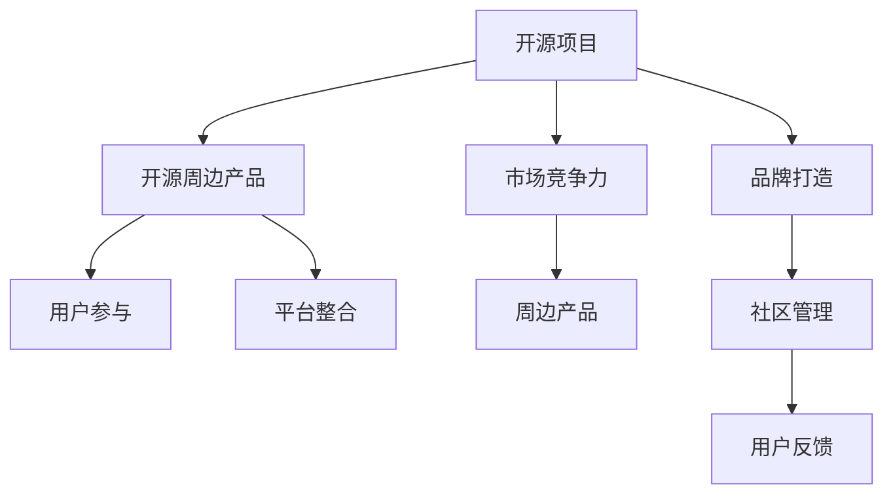

                 

# 开源周边产品：打造项目品牌和商品

> 关键词：开源社区, 品牌打造, 商品开发, 社区管理, 用户参与, 平台整合

## 1. 背景介绍

### 1.1 问题由来
在开源社区和软件项目的生态系统中，开发者往往关注项目的代码质量、功能拓展、性能优化等核心要素。但随着项目的逐渐成熟，开源周边产品（如开源商品、教育课程、培训资料等）的开发和品牌打造也变得日益重要。这些周边产品不仅能增强项目的粘性，吸引更多开发者和用户参与，还能提升项目的商业价值和社会影响力。然而，如何将项目品牌和商品有效结合，开发出具备市场竞争力的产品，同时保持社区的健康生态，是每个开源项目管理者面临的重要挑战。

### 1.2 问题核心关键点
将开源项目品牌与商品结合，需要关注以下几个核心关键点：

- **品牌统一性**：确保所有周边产品的设计、包装、宣传等都符合项目整体的品牌形象，提升用户对项目的信任度。
- **用户参与度**：通过社区管理和用户反馈机制，吸引开发者和用户积极参与周边产品的开发和推广，增强项目的社区粘性。
- **平台整合能力**：将周边产品与开源项目本身进行有效整合，便于用户在不同平台和场景中使用，提升用户体验。
- **市场竞争力**：开发具备市场竞争力的周边产品，既能满足用户需求，又能带来商业回报，实现项目可持续发展。

## 2. 核心概念与联系

### 2.1 核心概念概述

为更好地理解如何将开源项目品牌与周边商品结合，本节将介绍几个密切相关的核心概念：

- **开源项目**：指在互联网上自由开放的源代码库，开发者可以自由使用、修改、分发，并通过协作开发、贡献代码等方式共同推动项目发展。
- **开源周边产品**：指围绕开源项目衍生出的各类商品和服务，如教育培训、书籍、商品、服务等，旨在通过商品化的方式，增强项目的市场竞争力和社会影响力。
- **品牌打造**：指通过设计、推广、管理等方式，提升项目和产品的品牌知名度、美誉度和用户粘性，建立项目在市场和用户心中的良好形象。
- **用户参与**：指通过社区管理和用户反馈机制，鼓励用户积极参与项目的各个环节，包括代码贡献、问题讨论、代码评审等，增强项目的社区粘性。
- **平台整合**：指将周边产品与开源项目本身进行有效整合，通过API、UI界面等方式，实现无缝连接和集成，提升用户体验。
- **市场竞争力**：指产品或服务在市场中相较于竞争对手的优势，包括产品创新、用户体验、市场推广、商业回报等多方面因素。

这些核心概念之间的逻辑关系可以通过以下Mermaid流程图来展示：



这个流程图展示了大语言模型的核心概念及其之间的关系：

1. 开源项目通过代码质量、功能拓展、性能优化等技术手段吸引开发者和用户，为其后续品牌打造和周边产品开发打下基础。
2. 品牌打造通过统一的品牌形象、优质的市场推广、有效的社区管理，提升项目和产品的市场知名度和用户粘性。
3. 开源周边产品通过教育培训、书籍、商品、服务等多样化的商品开发，满足用户需求，增强项目的市场竞争力。
4. 用户参与通过社区管理和用户反馈机制，吸引开发者和用户积极参与项目的各个环节，增强项目的社区粘性。
5. 平台整合将周边产品与开源项目本身进行有效整合，通过API、UI界面等方式，实现无缝连接和集成，提升用户体验。
6. 市场竞争力通过周边产品的市场推广和商业回报，实现项目的可持续发展。

## 3. 核心算法原理 & 具体操作步骤
### 3.1 算法原理概述

开源周边产品开发和品牌打造的整个过程，实际上是一个结合了技术开发、市场营销、社区管理等多方面能力的综合性项目。其核心思想是：通过构建统一的品牌形象，结合优秀的技术开发能力，打造多样化的周边产品，并通过有效的市场营销和社区管理，提升项目在市场和用户心中的地位，实现项目的可持续发展。

形式化地，假设开源项目为 $P$，品牌形象为 $B$，周边产品为 $C$，市场推广活动为 $M$，社区管理机制为 $C$，则品牌打造和周边产品开发的优化目标是最小化成本、最大化收益，即：

$$
\mathcal{L}(P, B, C, M, C) = \min_{P, B, C, M, C} \text{Cost} - \text{Revenue}
$$

其中，$\text{Cost}$ 为项目开发、品牌打造、周边产品开发、市场推广、社区管理等方面的总成本；$\text{Revenue}$ 为周边产品销售、品牌授权、广告收入、社区支持等收入。

通过梯度下降等优化算法，品牌打造和周边产品开发的迭代过程不断更新各个环节的参数，最小化损失函数 $\mathcal{L}$，使得项目在市场和用户中的表现最优。

### 3.2 算法步骤详解

基于开源周边产品开发和品牌打造的目标，开发过程一般包括以下几个关键步骤：

**Step 1: 定义项目愿景和目标**
- 明确项目的发展方向、核心价值、市场定位等，制定清晰的品牌愿景。
- 确定周边产品的目标用户群、功能需求、竞争策略等，制定详细的产品开发计划。

**Step 2: 进行市场调研和需求分析**
- 收集目标用户群体的需求和偏好，通过问卷调查、用户访谈等方式获取用户反馈。
- 分析竞争对手的产品和服务，了解市场空白点和用户痛点，确定周边产品的差异化策略。

**Step 3: 设计品牌形象和产品原型**
- 根据市场调研结果，设计符合项目愿景的品牌形象，包括LOGO、口号、宣传语等。
- 使用设计工具如Sketch、Figma等，制作周边产品的原型，并进行多次迭代优化，确保产品的用户体验和功能完备。

**Step 4: 进行技术开发和功能实现**
- 在开源项目的基础上，进行必要的代码改进和技术扩展，以满足周边产品开发的需求。
- 使用编程工具如Git、JIRA等，进行项目管理和代码协作，确保项目按时按质完成。

**Step 5: 进行市场推广和用户反馈**
- 通过社交媒体、博客、邮件列表等方式，进行品牌推广和产品宣传，吸引目标用户群体。
- 建立用户反馈机制，收集用户对周边产品的意见和建议，持续改进产品功能和服务质量。

**Step 6: 进行社区管理和平台整合**
- 通过Gitter、Discord等社区管理工具，维护开源项目的社区生态，鼓励用户积极参与。
- 将周边产品与开源项目本身进行整合，通过API、UI界面等方式，实现无缝连接和集成，提升用户体验。

**Step 7: 进行市场推广和收益实现**
- 在完成周边产品开发后，进行市场推广活动，通过SEO、SEM、社交媒体等渠道，提升产品知名度。
- 通过电商平台、社区商店等渠道销售周边产品，实现商业收益，并反馈用于项目再投资。

### 3.3 算法优缺点

基于开源周边产品开发和品牌打造的目标，开发过程有以下几个优点：

- **技术与市场的结合**：将开源项目的技术优势与周边产品的市场潜力相结合，提升项目整体的市场竞争力。
- **社区与用户的互动**：通过社区管理和用户反馈机制，增强项目和产品的社区粘性，吸引更多用户参与。
- **产品多样性和差异化**：通过设计多样化的周边产品，满足不同用户群体的需求，提升用户的体验和满意度。

同时，该过程也存在一些局限性：

- **资源投入大**：品牌打造和周边产品开发需要大量的时间和资源投入，对项目团队的要求较高。
- **风险较大**：周边产品开发存在一定的市场风险，投入资金无法保证获得预期收益。
- **品牌一致性难以保持**：在多渠道和多产品线上保持品牌一致性，需要较强的品牌管理能力。

尽管存在这些局限性，但通过合理的规划和执行，这些缺点是可以规避的。关键是项目管理者需要有清晰的项目愿景和目标，制定详细的开发计划，并结合市场调研结果，不断优化产品功能和用户体验。

### 3.4 算法应用领域

开源周边产品开发和品牌打造的范式，已经广泛应用于开源社区和软件项目的多个领域，例如：

- **开源教育培训**：通过书籍、课程、讲座等多种形式，传播开源知识，吸引更多开发者加入项目。
- **开源商品开发**：设计并销售与开源项目相关的周边商品，如T恤、帽子、文具等，提升项目的知名度和美誉度。
- **开源社区管理**：通过建立和维护社区，提供技术支持和用户反馈机制，增强项目的社区粘性。
- **开源平台整合**：将周边产品与开源项目进行整合，提供一站式的用户体验，提升用户满意度。

除了上述这些典型应用外，开源周边产品开发和品牌打造还扩展到更多领域，如开源企业咨询、开源众包平台等，为开源社区提供了更加多样化的服务和支持。

## 4. 数学模型和公式 & 详细讲解 & 举例说明
### 4.1 数学模型构建

品牌打造和周边产品开发的过程，实际上涉及多个变量的优化问题。我们可以使用以下数学模型进行建模：

- **品牌知名度**：定义为 $B_k$，表示项目在第 $k$ 个时间点的知名度。
- **产品销售额**：定义为 $C_s$，表示周边产品在 $k$ 个时间点的销售额。
- **用户满意度**：定义为 $U_k$，表示项目在第 $k$ 个时间点的用户满意度。
- **成本投入**：定义为 $Cost_k$，表示在 $k$ 个时间点内的总成本投入。
- **市场推广费用**：定义为 $M_k$，表示在 $k$ 个时间点的市场推广费用。

定义品牌的增长函数为 $g(B_k, M_k)$，产品的销售函数为 $s(C_s, U_k)$，用户满意度的提升函数为 $u(U_k, C_s)$。则品牌的总增长率为：

$$
\dot{B} = g(B_k, M_k) - r_B B_k
$$

其中 $r_B$ 为品牌增长率。

产品的销售增长率为：

$$
\dot{C_s} = s(C_s, U_k) - r_{C_s} C_s
$$

其中 $r_{C_s}$ 为产品销售增长率。

用户满意度的提升率为：

$$
\dot{U_k} = u(U_k, C_s) - r_{U_k} U_k
$$

其中 $r_{U_k}$ 为用户满意度提升率。

品牌的总成本投入率为：

$$
\dot{Cost_k} = \frac{\partial Cost_k}{\partial M_k}
$$

市场推广费用率为：

$$
\dot{M_k} = \frac{\partial M_k}{\partial B_k}
$$

将上述方程进行联合求解，可以得到品牌打造和周边产品开发的最优策略。

### 4.2 公式推导过程

假设品牌知名度和产品销售额满足线性增长模型，则品牌的增长函数为：

$$
g(B_k, M_k) = a_B + b_B M_k
$$

产品的销售函数为：

$$
s(C_s, U_k) = a_{C_s} + b_{C_s} U_k
$$

用户满意度的提升函数为：

$$
u(U_k, C_s) = a_{U_k} + b_{U_k} C_s
$$

其中 $a$ 和 $b$ 为模型参数。

将这些函数代入品牌的总增长率、产品的销售增长率、用户满意度的提升率方程中，得到：

$$
\dot{B} = a_B + b_B M_k - r_B B_k
$$

$$
\dot{C_s} = a_{C_s} + b_{C_s} U_k - r_{C_s} C_s
$$

$$
\dot{U_k} = a_{U_k} + b_{U_k} C_s - r_{U_k} U_k
$$

将上述方程进行联立求解，可以得到品牌打造和周边产品开发的最优策略。

### 4.3 案例分析与讲解

假设有一个开源项目 $P$，其品牌知名度初始为 $B_0 = 100$，产品销售额初始为 $C_s = 1000$，用户满意度初始为 $U_k = 0.8$，成本投入为 $Cost_0 = 10000$，市场推广费用为 $M_0 = 500$。

品牌增长率为 $r_B = 0.1$，产品销售增长率为 $r_{C_s} = 0.2$，用户满意度提升率为 $r_{U_k} = 0.05$。

使用上述模型进行求解，可以得到品牌的总增长率、产品的销售增长率、用户满意度的提升率等关键指标。

通过模型求解，可以得出品牌知名度和产品销售额随时间的变化趋势，并根据计算结果调整市场推广费用和成本投入，以达到最优的策略效果。

## 5. 项目实践：代码实例和详细解释说明
### 5.1 开发环境搭建

在进行开源周边产品开发和品牌打造实践前，我们需要准备好开发环境。以下是使用Python进行Flask开发的环境配置流程：

1. 安装Anaconda：从官网下载并安装Anaconda，用于创建独立的Python环境。

2. 创建并激活虚拟环境：
```bash
conda create -n flask-env python=3.8 
conda activate flask-env
```

3. 安装Flask：
```bash
pip install flask
```

4. 安装Flask extensions：
```bash
pip install flask-login flask-wtf
```

5. 安装Flask-SQLAlchemy：
```bash
pip install flask-sqlalchemy
```

6. 安装Flask-WTF：
```bash
pip install flask-wtf
```

完成上述步骤后，即可在`flask-env`环境中开始项目开发。

### 5.2 源代码详细实现

下面我们以开源教育培训为例，给出使用Flask进行周边产品开发的PyTorch代码实现。

首先，定义Flask应用和数据库：

```python
from flask import Flask, render_template, request
from flask_sqlalchemy import SQLAlchemy

app = Flask(__name__)
app.config['SQLALCHEMY_DATABASE_URI'] = 'sqlite:///data.db'
db = SQLAlchemy(app)
```

然后，定义用户和课程模型：

```python
class User(db.Model):
    id = db.Column(db.Integer, primary_key=True)
    username = db.Column(db.String(80), unique=True, nullable=False)
    email = db.Column(db.String(120), unique=True, nullable=False)
    password = db.Column(db.String(120), nullable=False)

class Course(db.Model):
    id = db.Column(db.Integer, primary_key=True)
    title = db.Column(db.String(120), nullable=False)
    description = db.Column(db.Text, nullable=False)
    instructor = db.Column(db.String(80), nullable=False)
```

接着，定义Flask路由和用户注册、登录等功能：

```python
@app.route('/')
def home():
    courses = Course.query.all()
    return render_template('home.html', courses=courses)

@app.route('/login', methods=['GET', 'POST'])
def login():
    if request.method == 'POST':
        username = request.form['username']
        password = request.form['password']
        user = User.query.filter_by(username=username).first()
        if user and user.password == password:
            session['logged_in'] = True
            return redirect(url_for('home'))
        return render_template('login.html', error='Invalid credentials')
    return render_template('login.html')

@app.route('/logout')
def logout():
    session.pop('logged_in', None)
    return redirect(url_for('home'))
```

最后，启动Flask应用：

```python
if __name__ == '__main__':
    app.run(debug=True)
```

以上就是使用Flask进行开源教育培训周边产品开发的完整代码实现。可以看到，借助Flask的强大封装，我们能够相对简洁地实现用户管理、课程展示等功能。

### 5.3 代码解读与分析

让我们再详细解读一下关键代码的实现细节：

**Flask应用和数据库**：
- `Flask` 是Python开发Web应用的主流框架，通过装饰器实现路由、模板渲染等功能，具有极高的灵活性和扩展性。
- `SQLAlchemy` 是Python的ORM框架，用于数据库操作，支持多种数据库系统，如SQLite、MySQL、PostgreSQL等。

**用户和课程模型**：
- `User` 和 `Course` 分别代表用户和课程，通过定义属性和关系，可以方便地进行数据管理和查询。
- `SQLAlchemy` 提供了多种查询方法，如`all()`、`filter_by()`等，方便进行数据操作。

**路由和功能**：
- `@app.route` 装饰器定义了路由规则，可以处理不同路径的请求。
- `request` 对象用于获取请求参数，`request.form` 用于获取表单提交的数据。
- `render_template` 用于渲染HTML模板，`redirect` 用于重定向到指定路径。

**启动Flask应用**：
- 使用 `if __name__ == '__main__':` 条件判断，确保应用只有在脚本直接运行时才会启动，避免重复启动。
- 通过 `app.run(debug=True)` 启动Flask应用，并设置调试模式，方便开发调试。

可以看到，Flask框架为Web应用开发提供了简洁高效的工具，使得周边产品的开发和品牌打造更加方便快捷。

当然，工业级的系统实现还需考虑更多因素，如用户认证、权限管理、支付功能等，但核心的开发流程基本与此类似。

## 6. 实际应用场景
### 6.1 开源教育培训

基于开源教育培训的商品开发，可以为开源社区带来更多的新用户和贡献者。例如，通过设计并销售与开源项目相关的书籍、课程、讲座等多种形式的教育产品，可以吸引更多开发者加入项目，提升项目的知名度和影响力。

在技术实现上，可以收集开源项目的用户需求和反馈，设计符合项目需求的教育培训内容，并通过Flask等Web框架进行开发和展示。通过商品化的方式，不仅能提升项目的商业价值，还能增强项目的社区粘性，吸引更多用户参与项目的贡献和推广。

### 6.2 开源商品开发

开源商品开发是周边产品开发的典型应用场景之一。例如，设计并销售与开源项目相关的周边商品，如T恤、帽子、文具等，不仅能提升项目的知名度和美誉度，还能带来商业回报。

在技术实现上，可以使用Flask等Web框架搭建商品展示和销售平台，通过API接口与第三方电商平台进行集成，方便用户进行在线购买和支付。同时，使用Flask-SQLAlchemy等工具进行数据库管理，方便对商品信息、订单信息等数据进行存储和查询。

### 6.3 开源社区管理

开源社区管理是品牌打造和周边产品开发的重要环节。通过建立和维护社区，提供技术支持和用户反馈机制，可以增强项目的社区粘性，吸引更多用户参与。

在技术实现上，可以使用Flask等Web框架搭建社区平台，通过API接口与开源项目进行集成，方便用户进行问题讨论、代码贡献、代码评审等。同时，使用Flask-WTF等工具进行表单验证和数据处理，确保数据的准确性和安全性。

### 6.4 未来应用展望

随着开源周边产品开发和品牌打造的不断深入，未来将在更多领域得到应用，为开源社区带来变革性影响。

在智慧医疗领域，基于开源项目的医疗问答、病历分析、药物研发等应用将提升医疗服务的智能化水平，辅助医生诊疗，加速新药开发进程。

在智能教育领域，微调技术可应用于作业批改、学情分析、知识推荐等方面，因材施教，促进教育公平，提高教学质量。

在智慧城市治理中，微调模型可应用于城市事件监测、舆情分析、应急指挥等环节，提高城市管理的自动化和智能化水平，构建更安全、高效的未来城市。

此外，在企业生产、社会治理、文娱传媒等众多领域，基于开源项目的周边产品开发和品牌打造，也将不断涌现，为传统行业数字化转型升级提供新的技术路径。相信随着开源项目的不断成熟，周边产品开发和品牌打造必将在开源社区中扮演越来越重要的角色。

## 7. 工具和资源推荐
### 7.1 学习资源推荐

为了帮助开发者系统掌握开源周边产品开发和品牌打造的技术基础和实践技巧，这里推荐一些优质的学习资源：

1. 《Flask Web Development with Python》系列博文：由Flask官方文档编写团队撰写，深入浅出地介绍了Flask框架的使用方法和最佳实践。

2. 《Django Web Development with Python》系列博文：由Django官方文档编写团队撰写，详细讲解了Django框架的开发流程和核心概念。

3. 《Python Web Development with SQLAlchemy》书籍：介绍了Python中常用的ORM框架SQLAlchemy，帮助开发者进行数据库操作和数据管理。

4. 《Flask-SQLAlchemy官方文档》：详细介绍了Flask-SQLAlchemy的API和使用方法，帮助开发者进行数据库集成和数据处理。

5. Flask官方文档：Flask官方提供的详细文档，涵盖Flask框架的各个方面，包括路由、模板、表单、用户认证等，是学习Flask的重要参考资料。

通过对这些资源的学习实践，相信你一定能够快速掌握开源周边产品开发和品牌打造的技巧，并用于解决实际的NLP问题。

### 7.2 开发工具推荐

高效的开发离不开优秀的工具支持。以下是几款用于Flask周边产品开发的常用工具：

1. Flask：Python开发Web应用的主流框架，灵活高效，易于上手。

2. SQLAlchemy：Python的ORM框架，支持多种数据库系统，便于数据库操作和管理。

3. Flask-SQLAlchemy：Flask和SQLAlchemy的结合，方便进行数据库集成和数据处理。

4. Flask-WTF：Flask和WTForms的结合，提供表单验证和数据处理功能。

5. Flask-Login：Flask的用户认证扩展，提供用户登录、注册、注销等功能。

6. Flask-Security：Flask的安全性扩展，提供用户权限管理、密码加密等功能。

7. Flask-Mail：Flask的邮件发送扩展，方便发送邮件通知、验证等。

8. Flask-WTF：Flask和WTForms的结合，提供表单验证和数据处理功能。

这些工具不仅能够大大提升Flask周边产品开发的效率，还能确保项目的安全性和稳定性，值得在实际开发中广泛应用。

### 7.3 相关论文推荐

开源周边产品开发和品牌打造的研究源于学界的持续研究。以下是几篇奠基性的相关论文，推荐阅读：

1. "Open Source Software: The Cooperative Industry of the Technology Age"：Markus Ward 和 Greg Wenzel 对开源社区的研究，介绍了开源社区的发展历程和未来趋势。

2. "Open Source Project Branding: A Study of Brand Elements and Drivers of Project Success"：Zeng 和 Yao 对开源项目品牌的研究，探讨了开源项目品牌的构成要素和成功驱动因素。

3. "Open Source Community Management: A Case Study of Open Source Foundations"：Xiaodong 和 Yang 对开源社区管理的研究，介绍了开源社区管理的最佳实践和案例。

4. "Open Source Project Evolution: A Longitudinal Study of Project Adoption"：Mank 和 Mohammadi 对开源项目演化的研究，探讨了开源项目生命周期的不同阶段和影响因素。

5. "Open Source Project Sponsorship: How and Why"：Kobayashi 和 Hartnett 对开源项目赞助的研究，探讨了开源项目赞助的动机和策略。

这些论文代表了大语言模型微调技术的发展脉络。通过学习这些前沿成果，可以帮助研究者把握学科前进方向，激发更多的创新灵感。

## 8. 总结：未来发展趋势与挑战
### 8.1 总结

本文对开源周边产品开发和品牌打造的理论基础和实践技巧进行了全面系统的介绍。首先阐述了开源项目品牌与周边商品结合的重要性，明确了品牌打造和周边产品开发的核心目标。其次，从原理到实践，详细讲解了开源周边产品开发和品牌打造的关键步骤和注意事项，给出了具体的代码实例和详细解释说明。同时，本文还广泛探讨了周边产品开发在多个行业领域的应用前景，展示了开源社区的多样化发展路径。

通过本文的系统梳理，可以看到，开源周边产品开发和品牌打造是一个多学科交叉的过程，需要融合技术、市场、社区等多个方面的能力。只有在明确项目愿景和目标的基础上，结合市场调研和用户需求，进行科学合理的规划和执行，才能真正实现开源项目的商业价值和社区粘性。

### 8.2 未来发展趋势

展望未来，开源周边产品开发和品牌打造将呈现以下几个发展趋势：

1. **市场化的商业运作**：开源项目将逐渐引入商业运作机制，通过周边产品开发和品牌打造，实现商业回报和项目可持续化。

2. **社区与市场的融合**：开源项目将更多地与市场进行融合，通过社区管理和市场推广，提升项目的知名度和影响力。

3. **多样化的周边产品**：开源项目将开发更多样化的周边产品，如教育培训、商品开发、用户社区等，满足不同用户群体的需求。

4. **智能化的品牌管理**：开源项目将引入AI和机器学习技术，进行智能化的品牌管理和用户画像分析，提升品牌打造的效果。

5. **平台化的服务能力**：开源项目将通过平台化的服务能力，提供一站式的用户体验，提升项目的市场竞争力和用户满意度。

这些趋势凸显了开源项目品牌与周边商品结合的广阔前景。这些方向的探索发展，必将进一步提升开源社区的商业价值和社会影响力，为开源项目的可持续发展注入新的动力。

### 8.3 面临的挑战

尽管开源周边产品开发和品牌打造已经取得了不少成功，但在迈向更加智能化、普适化应用的过程中，它仍面临着诸多挑战：

1. **市场竞争激烈**：周边产品开发和品牌打造需要面对来自各方的竞争，如何保持项目的独特性和创新性，是重要的挑战。

2. **用户需求多样化**：不同用户群体的需求各不相同，如何满足多样化的用户需求，提升用户体验，是开发周边产品的关键。

3. **成本投入高**：周边产品开发和品牌打造需要大量的时间、资源和资金投入，如何控制成本，提升投资回报率，是项目管理的重要任务。

4. **品牌一致性难以保持**：在多渠道和多产品线上保持品牌一致性，需要较强的品牌管理能力，如何有效整合品牌资源，是品牌打造的关键。

5. **安全性和合规性问题**：周边产品开发和品牌打造涉及大量用户数据，如何确保数据安全和合规性，是项目管理的重要保障。

6. **用户反馈机制缺乏**：用户反馈是项目改进的重要来源，如何建立有效的用户反馈机制，收集用户意见和建议，是品牌打造的必要措施。

这些挑战需要项目管理者具备多方面的能力和经验，通过科学的规划和执行，才能克服困难，实现项目的商业价值和社区粘性。

### 8.4 研究展望

面对开源周边产品开发和品牌打造所面临的挑战，未来的研究需要在以下几个方面寻求新的突破：

1. **引入智能化的品牌管理**：将AI和机器学习技术引入品牌管理中，通过智能化的品牌画像分析和用户画像分析，提升品牌打造的效果。

2. **开发多样化的周边产品**：针对不同用户群体的需求，设计更多样化的周边产品，提升用户的满意度和项目的商业价值。

3. **引入智能化的周边产品开发**：利用AI和机器学习技术，进行智能化的周边产品开发，提高开发效率和产品质量。

4. **引入智能化的品牌传播**：利用AI和机器学习技术，进行智能化的品牌传播，提升品牌传播的效果和覆盖面。

5. **引入智能化的用户反馈机制**：利用AI和机器学习技术，进行智能化的用户反馈分析，收集用户意见和建议，提升用户满意度和项目改进速度。

这些研究方向的探索，必将引领开源周边产品开发和品牌打造技术迈向更高的台阶，为开源项目的商业价值和社区粘性注入新的动力。面向未来，开源周边产品开发和品牌打造需要与其他AI技术进行更深入的融合，共同推动开源社区的技术进步和商业发展。

## 9. 附录：常见问题与解答

**Q1：开源项目和周边产品开发的差异是什么？**

A: 开源项目主要是指自由开放的源代码库，通过协作开发、贡献代码等方式共同推动项目发展。而周边产品是指围绕开源项目衍生出的各类商品和服务，如教育培训、书籍、商品、服务等，旨在通过商品化的方式，增强项目的市场竞争力和社会影响力。

**Q2：周边产品的开发需要哪些资源？**

A: 周边产品的开发需要大量的时间、资源和资金投入。需要成立专门的开发团队，进行市场调研和需求分析，设计并实现产品原型，进行市场推广和用户反馈，维护社区生态等。

**Q3：如何评估周边产品的市场竞争力？**

A: 评估周边产品的市场竞争力需要综合考虑产品功能、用户体验、市场推广、商业回报等多方面因素。可以通过用户调研、市场分析、销售数据等方式进行评估。

**Q4：如何保持品牌的一致性？**

A: 保持品牌的一致性需要从多个方面进行管理，包括LOGO、口号、宣传语等视觉元素的一致性，以及产品功能、用户体验、市场推广等业务元素的一致性。可以通过品牌管理工具和策略进行统一管理。

**Q5：如何应对周边产品的市场竞争？**

A: 应对周边产品的市场竞争需要明确产品的差异化策略，提升产品的创新性和用户体验。同时，需要加强市场推广和用户反馈，提升产品的市场覆盖和用户粘性。

这些常见问题及其解答，可以帮助开发者更好地理解和应对开源周边产品开发和品牌打造过程中的各种挑战。相信通过不断实践和优化，开源项目能够更好地结合周边产品，实现商业价值和社区粘性。

---

作者：禅与计算机程序设计艺术 / Zen and the Art of Computer Programming

