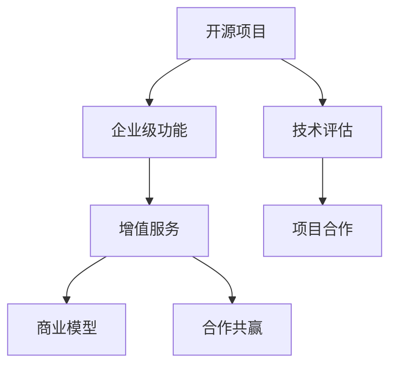

                 

# 开源项目的企业级功能：增值服务的机会

> 关键词：开源项目,企业级功能,增值服务,软件开发,技术评估,项目合作,商业模型

## 1. 背景介绍

在当今软件技术日新月异的时代，开源项目凭借其灵活性、社区力量和快速迭代的特点，已经成为企业级应用的重要组成部分。然而，开源项目通常以代码贡献和社区互动为主，对于企业级应用，如何高效利用开源技术，实现商业价值的最大化，成为摆在企业面前的一大挑战。本文旨在探讨开源项目的企业级功能，以及如何通过增值服务拓展其商业价值。

### 1.1 问题由来

随着云计算和微服务架构的普及，企业级软件系统越来越依赖于开源组件的集成。这些开源组件不仅提供了基础的开发工具和库函数，更是推动了分布式系统、大数据、人工智能等新兴技术的应用。然而，大多数企业在使用开源项目时，往往停留在基本功能的集成和使用，未能充分挖掘其潜在价值，未能将开源技术与自身业务需求有机结合。

### 1.2 问题核心关键点

如何通过增值服务拓展开源项目的企业级功能，是当前开源项目应用中的重要议题。主要包含以下核心关键点：

1. **选择合适的开源项目**：根据企业业务需求，选择适合的开源项目进行集成和定制开发。
2. **提供定制化解决方案**：根据企业需求，对开源项目进行二次开发，实现特定的企业级功能。
3. **构建商业模型**：设计合理的商业模型，将开源项目的增值服务转化为商业收益。
4. **合作共赢模式**：探索与开源社区的合作模式，共同推动开源项目的发展和应用。

### 1.3 问题研究意义

深入挖掘开源项目的企业级功能，对企业的技术战略和商业价值具有重要意义：

1. **提升技术实力**：借助开源项目的最新技术，加速企业的技术创新和业务转型。
2. **降低成本**：利用开源项目的灵活性和可定制性，降低开发和维护成本。
3. **增强竞争力**：通过提供创新的企业级功能，提升企业在市场中的竞争力。
4. **拓展市场**：通过增值服务，为企业开拓新的市场空间和客户群体。
5. **技术共享**：通过开源社区的合作，推动技术共享和创新，实现共赢。

## 2. 核心概念与联系

### 2.1 核心概念概述

为更好地理解开源项目的企业级功能，本节将介绍几个密切相关的核心概念：

- **开源项目**：指由开发者社区贡献和维护的代码库，提供可自由使用、修改和分发的软件组件。
- **企业级功能**：指针对企业特定业务需求，对开源项目进行定制化开发，实现可用的企业级应用。
- **增值服务**：指在开源项目基本功能基础上，提供增强、定制或专有的服务，增加项目价值。
- **商业模型**：指通过增值服务实现收入的模式，如订阅服务、授权使用、技术咨询等。
- **合作共赢**：指企业与开源社区或供应商建立合作关系，共同推动技术进步和市场发展。

这些概念之间的逻辑关系可以通过以下Mermaid流程图来展示：



这个流程图展示的开源项目的企业级功能及其相关概念：

1. 开源项目通过技术评估，选择合适的项目进行集成。
2. 集成后的项目根据企业需求，定制企业级功能。
3. 通过增值服务提升项目价值。
4. 设计合理的商业模型实现收入。
5. 通过合作共赢，推动技术进步和市场扩展。

## 3. 核心算法原理 & 具体操作步骤
### 3.1 算法原理概述

企业级功能的开发和增值服务的实现，本质上是一个需求分析和定制化的过程。其核心思想是：基于开源项目的已有功能，通过定制开发和增强，实现针对企业特定业务需求的解决方案。

形式化地，假设开源项目为 $S$，企业需求为 $D$，企业级功能为 $F(S, D)$。增值服务通过 $V(F(S, D))$ 来实现，商业模型为 $M(V(F(S, D)))$。

具体步骤包括：

1. 需求分析：通过调研和访谈，明确企业需求 $D$。
2. 技术评估：评估开源项目 $S$ 的功能和适用性，选择适合的项目进行集成。
3. 定制开发：基于 $S$，对企业级功能 $F(S, D)$ 进行定制开发。
4. 增值服务：对 $F(S, D)$ 进行增强和优化，实现增值服务 $V(F(S, D))$。
5. 商业模型：设计 $M(V(F(S, D)))$，将增值服务转化为收入。

### 3.2 算法步骤详解

企业级功能的开发和增值服务的实现，一般包括以下几个关键步骤：

**Step 1: 需求分析**

- 开展调研，了解企业业务需求和痛点。
- 访谈业务专家，获取详细需求描述。
- 分析需求，梳理出核心业务流程和功能模块。

**Step 2: 技术评估**

- 选择适合的开源项目 $S$，评估其功能和适用性。
- 分析项目文档和代码，了解其架构和核心能力。
- 与项目社区沟通，获取技术支持和资源。

**Step 3: 定制开发**

- 基于 $S$，对企业级功能 $F(S, D)$ 进行定制开发。
- 设计定制功能模块，并进行功能实现。
- 集成现有系统，确保新功能的稳定性。

**Step 4: 增值服务**

- 增强 $F(S, D)$，实现特定的增值服务 $V(F(S, D))$。
- 引入新的算法和模型，优化性能和用户体验。
- 引入安全性和可靠性措施，保障系统稳定运行。

**Step 5: 商业模型**

- 设计合理的商业模型 $M(V(F(S, D)))$，实现收入。
- 考虑订阅、授权、技术咨询等多种商业模型。
- 制定定价策略和销售计划，确保收益最大化。

### 3.3 算法优缺点

企业级功能的开发和增值服务的实现，具有以下优点：

1. **灵活性高**：开源项目具有良好的灵活性，可以快速响应企业需求，进行定制开发。
2. **成本低**：利用开源社区的力量，降低开发和维护成本。
3. **可扩展性强**：增值服务可以不断迭代和扩展，提升企业级功能的价值。
4. **技术前沿**：开源项目通常包含最新的技术和算法，有助于提升企业的技术实力。

同时，也存在一些缺点：

1. **依赖社区**：过度依赖开源社区的支持，可能影响项目进度和质量。
2. **定制难度大**：对企业需求的深度理解和实现，可能带来较高的技术难度。
3. **复杂度高**：集成和定制开发的过程可能复杂，需要专业团队支持。
4. **安全性问题**：开源项目的安全性可能不如闭源系统，需要额外关注。

### 3.4 算法应用领域

企业级功能的开发和增值服务的实现，已在多个领域得到了广泛应用，例如：

- 金融行业：通过定制化开发，提升风险管理、客户服务、运营效率等功能。
- 医疗健康：基于开源项目，实现病历管理、诊疗辅助、数据分析等功能。
- 制造行业：引入开源物联网和自动化技术，提升生产效率和产品质量。
- 零售电商：使用开源项目，优化库存管理、营销策略、客户体验等。
- 公共服务：提供开源平台，支持政府数字化转型，提升公共服务水平。

此外，开源项目在教育、能源、物流等众多领域也有广泛应用，为企业级功能开发提供了丰富的场景和机会。

## 4. 数学模型和公式 & 详细讲解
### 4.1 数学模型构建

本节将使用数学语言对企业级功能的开发和增值服务的实现进行更加严格的刻画。

记企业需求为 $D$，开源项目为 $S$，企业级功能为 $F(S, D)$，增值服务为 $V(F(S, D))$，商业模型为 $M(V(F(S, D)))$。

定义企业级功能 $F(S, D)$ 的评估指标 $K$，如功能完整性、性能指标、用户体验等。

定义增值服务 $V(F(S, D))$ 的增值量 $V(K)$，即 $V(K)$。

定义商业模型 $M(V(F(S, D)))$ 的收入 $R$，即 $R(V(K))$。

### 4.2 公式推导过程

以下我们以金融风险管理为例，推导企业级功能的开发和增值服务的实现过程的数学模型。

假设企业需求 $D$ 为风险管理系统的构建，开源项目 $S$ 为Apache Spark。企业级功能 $F(S, D)$ 为基于Spark构建的风险评估模型，增值服务 $V(F(S, D))$ 为加入实时数据处理和异常检测功能，商业模型 $M(V(F(S, D)))$ 为基于订阅的增值服务。

1. 需求分析：调研和访谈，确定需求 $D$，如风险指标计算、模型预测、实时监控等。
2. 技术评估：评估Apache Spark的功能，选择其进行集成。
3. 定制开发：基于Spark，实现风险评估模型 $F(S, D)$，设定关键指标 $K$，如准确率、召回率、处理时间等。
4. 增值服务：对 $F(S, D)$ 加入实时数据处理和异常检测功能 $V(F(S, D))$，提升系统响应速度和安全性。
5. 商业模型：设计订阅模式 $M(V(F(S, D)))$，实现收入 $R$。

### 4.3 案例分析与讲解

假设某金融公司需要构建风险管理系统，初步需求包括风险评估、模型预测、实时监控等。通过调研和访谈，明确需求如下：

- 风险指标计算：计算信用风险、市场风险、操作风险等。
- 模型预测：使用机器学习模型预测风险概率。
- 实时监控：实时监控风险数据，及时发现异常情况。

技术评估发现，Apache Spark具备强大的数据处理能力和灵活性，适合构建风险管理系统。因此选择Apache Spark进行集成。

定制开发阶段，实现基于Spark的风险评估模型 $F(S, D)$。设计系统架构，设定关键指标 $K$，如准确率 $A$、召回率 $R$、处理时间 $T$ 等。通过多轮测试和优化，确保系统的稳定性和准确性。

在增值服务阶段，加入实时数据处理和异常检测功能 $V(F(S, D))$。使用Spark Streaming进行实时数据处理，引入Flink进行异常检测，提升系统响应速度和安全性。对 $F(S, D)$ 的准确率和召回率进行优化，确保系统的可靠性。

最后，设计订阅模式 $M(V(F(S, D)))$，实现收入 $R$。通过分级定价，根据企业规模和需求，提供不同层次的增值服务订阅方案，确保收入最大化。

## 5. 项目实践：代码实例和详细解释说明
### 5.1 开发环境搭建

在进行企业级功能的开发和增值服务实践前，我们需要准备好开发环境。以下是使用Python进行Apache Spark开发的环境配置流程：

1. 安装Anaconda：从官网下载并安装Anaconda，用于创建独立的Python环境。

2. 创建并激活虚拟环境：
```bash
conda create -n pytorch-env python=3.8 
conda activate pytorch-env
```

3. 安装PySpark：根据CUDA版本，从官网获取对应的安装命令。例如：
```bash
conda install pyspark torchvision torchaudio cudatoolkit=11.1 -c pytorch -c conda-forge
```

4. 安装各类工具包：
```bash
pip install numpy pandas scikit-learn matplotlib tqdm jupyter notebook ipython
```

完成上述步骤后，即可在`pytorch-env`环境中开始企业级功能的开发和增值服务实践。

### 5.2 源代码详细实现

下面我们以金融风险管理系统为例，给出使用PySpark进行企业级功能开发和增值服务的PySpark代码实现。

首先，定义数据处理函数：

```python
from pyspark.sql import SparkSession
from pyspark.sql.functions import col, lit, expr, udf
from pyspark.ml.feature import VectorAssembler
from pyspark.ml.classification import RandomForestClassifier
from pyspark.ml.evaluation import MulticlassClassificationEvaluator
from pyspark.ml import Pipeline
from pyspark.ml import PipelineModel

spark = SparkSession.builder.appName("RiskManagement").getOrCreate()

# 定义数据读取函数
def read_data(file_path):
    return spark.read.json(file_path)

# 定义数据预处理函数
def preprocess_data(df):
    # 添加时间戳列
    df = df.withColumn('timestamp', lit(spark.sql.functions.current_timestamp()))
    # 选择必要列
    df = df.select('id', 'amount', 'category', 'timestamp')
    return df

# 定义特征工程函数
def feature_engineering(df):
    # 构造特征向量
    vector_assembler = VectorAssembler(inputCols=['amount', 'category'], outputCol='features')
    df = vector_assembler.transform(df)
    # 添加时间戳列
    df = df.withColumn('timestamp', lit(spark.sql.functions.current_timestamp()))
    return df

# 定义模型训练函数
def train_model(df, train_percent=0.8):
    # 分割数据集
    train_df, test_df = df.randomSplit([train_percent, 1-train_percent])
    # 选择训练集特征和标签
    features_col = 'features'
    label_col = 'category'
    # 训练模型
    rf = RandomForestClassifier(labelCol=label_col)
    p = Pipeline(stages=[rf])
    model = p.fit(train_df)
    # 评估模型
    evaluator = MulticlassClassificationEvaluator(predictionCol='prediction', labelCol=label_col, metricName='f1')
    accuracy = evaluator.evaluate(model.transform(test_df), {'dataset': 'Test'})
    return model

# 定义模型预测函数
def predict(df, model):
    # 预测结果
    prediction = model.transform(df)
    return prediction
```

然后，定义数据集和模型训练流程：

```python
# 定义数据集路径
train_file = 'train.json'
test_file = 'test.json'

# 读取训练数据集
train_df = read_data(train_file)
# 读取测试数据集
test_df = read_data(test_file)

# 预处理训练数据集
train_df = preprocess_data(train_df)
# 预处理测试数据集
test_df = preprocess_data(test_df)

# 特征工程
train_df = feature_engineering(train_df)
test_df = feature_engineering(test_df)

# 训练模型
model = train_model(train_df)

# 预测测试数据集
predict_df = predict(test_df, model)

# 输出预测结果
print(predict_df.show())
```

以上就是使用PySpark进行金融风险管理系统企业级功能开发和增值服务的完整代码实现。可以看到，得益于PySpark的强大数据处理能力和便捷的API设计，我们能够快速实现复杂的风险管理系统。

### 5.3 代码解读与分析

让我们再详细解读一下关键代码的实现细节：

**read_data和preprocess_data函数**：
- `read_data`函数使用Spark读取JSON格式的数据文件，并将其转换为DataFrame对象。
- `preprocess_data`函数对DataFrame对象进行预处理，添加时间戳列，选择必要列，返回预处理后的DataFrame对象。

**feature_engineering函数**：
- 使用`VectorAssembler`构建特征向量，将`amount`和`category`列合并为向量，并添加到新的`features`列中。
- 添加时间戳列，返回特征工程后的DataFrame对象。

**train_model函数**：
- 使用`RandomForestClassifier`训练随机森林分类器。
- 将分类器加入到`Pipeline`中，进行模型训练。
- 使用`MulticlassClassificationEvaluator`评估模型在测试集上的性能。

**predict函数**：
- 使用训练好的模型对测试集进行预测，并返回预测结果。

**训练流程**：
- 读取训练数据集和测试数据集。
- 对数据集进行预处理和特征工程。
- 训练模型并评估性能。
- 对测试集进行预测并输出结果。

可以看到，PySpark提供了强大的数据处理和机器学习工具，极大地简化了企业级功能的开发和增值服务的实现过程。开发者可以通过简单的API调用，实现复杂的业务逻辑和数据分析。

当然，实际的系统开发还需要考虑更多因素，如数据质量、模型调优、系统架构等。但核心的开发流程与上述基本一致。

## 6. 实际应用场景
### 6.1 智能客服系统

基于开源项目的企业级功能的开发和增值服务，可以广泛应用于智能客服系统的构建。传统客服往往需要配备大量人力，高峰期响应缓慢，且一致性和专业性难以保证。通过企业级功能的开发和增值服务，可以实现7x24小时不间断服务，快速响应客户咨询，用自然流畅的语言解答各类常见问题。

在技术实现上，可以收集企业内部的历史客服对话记录，将问题和最佳答复构建成监督数据，在此基础上对Apache Spark等开源项目进行企业级功能开发。开发基于Spark的机器学习模型，实现客户意图识别、智能问答、情感分析等企业级功能。对于客户提出的新问题，还可以接入检索系统实时搜索相关内容，动态组织生成回答。如此构建的智能客服系统，能大幅提升客户咨询体验和问题解决效率。

### 6.2 金融舆情监测

金融机构需要实时监测市场舆论动向，以便及时应对负面信息传播，规避金融风险。传统的人工监测方式成本高、效率低，难以应对网络时代海量信息爆发的挑战。通过企业级功能的开发和增值服务，可以构建基于Spark的文本分析和情感分析系统，实时抓取和分析网络文本数据，自动识别负面舆情，及时预警，帮助金融机构快速应对潜在风险。

在具体实现上，可以使用Spark Streaming进行实时数据处理，利用Spark NLP进行文本分析和情感分析，通过机器学习模型自动识别负面舆情。将Spark的输出结果集成到实时告警系统，及时通知相关部门，采取应对措施。

### 6.3 个性化推荐系统

当前的推荐系统往往只依赖用户的历史行为数据进行物品推荐，无法深入理解用户的真实兴趣偏好。通过企业级功能的开发和增值服务，可以基于开源项目如Spark和TensorFlow等，构建个性化的推荐系统，挖掘用户行为背后的语义信息，从而提供更精准、多样的推荐内容。

在具体实现上，可以收集用户浏览、点击、评论、分享等行为数据，提取和用户交互的物品标题、描述、标签等文本内容。将文本内容作为模型输入，用户的后续行为（如是否点击、购买等）作为监督信号，在此基础上对Spark等开源项目进行企业级功能开发。开发基于Spark的机器学习模型，提取用户兴趣特征，进行推荐算法优化，生成个性化推荐列表。

### 6.4 未来应用展望

随着企业级功能的开发和增值服务技术的发展，开源项目将在更多领域得到应用，为传统行业带来变革性影响。

在智慧医疗领域，基于开源项目的企业级功能开发和增值服务，可以实现病历管理、诊疗辅助、数据分析等应用，提升医疗服务的智能化水平，辅助医生诊疗，加速新药开发进程。

在智能教育领域，通过企业级功能的开发和增值服务，可以实现作业批改、学情分析、知识推荐等应用，因材施教，促进教育公平，提高教学质量。

在智慧城市治理中，通过企业级功能的开发和增值服务，可以实现城市事件监测、舆情分析、应急指挥等环节，提高城市管理的自动化和智能化水平，构建更安全、高效的未来城市。

此外，在企业生产、社会治理、文娱传媒等众多领域，基于开源项目的企业级功能开发和增值服务也将不断涌现，为NLP技术带来新的突破。相信随着预训练语言模型和微调方法的持续演进，开源项目的企业级功能开发和增值服务必将在构建人机协同的智能时代中扮演越来越重要的角色。

## 7. 工具和资源推荐
### 7.1 学习资源推荐

为了帮助开发者系统掌握开源项目的企业级功能开发和增值服务技术，这里推荐一些优质的学习资源：

1. Apache Spark官方文档：详细介绍了Spark的功能、API设计、使用示例等，是学习Spark的最佳入门资料。
2. Kubernetes官方文档：介绍开源容器编排平台Kubernetes的基础概念和部署方法，适合学习大规模分布式系统的管理。
3. Spark MLlib官方文档：详细介绍Spark的机器学习库MLlib的使用，包括数据预处理、模型训练、评估等。
4. TensorFlow官方文档：介绍TensorFlow的基础知识和高级特性，包括分布式训练、模型优化等。
5. PySpark实战教程：通过实际案例，深入讲解如何使用PySpark进行数据处理和机器学习。

通过对这些资源的学习实践，相信你一定能够快速掌握企业级功能的开发和增值服务的精髓，并用于解决实际的NLP问题。

### 7.2 开发工具推荐

高效的开发离不开优秀的工具支持。以下是几款用于企业级功能开发和增值服务开发的常用工具：

1. PySpark：基于Python的Spark开发框架，支持数据处理、机器学习等，适合构建复杂的大数据系统。
2. TensorFlow：由Google主导开发的开源深度学习框架，生产部署方便，适合大规模工程应用。
3. Apache Spark Streaming：Spark的实时数据处理组件，适合处理流式数据，构建实时分析系统。
4. Kafka：开源的消息队列系统，支持高吞吐量、高可靠性的数据流传输，适合构建分布式数据管道。
5. Hadoop：Apache的分布式计算框架，支持大规模数据存储和处理，适合构建大数据基础设施。
6. Jupyter Notebook：Python开发中的交互式环境，支持代码编写、数据可视化等，适合快速原型开发和数据分析。

合理利用这些工具，可以显著提升企业级功能的开发效率，加快创新迭代的步伐。

### 7.3 相关论文推荐

开源项目的企业级功能开发和增值服务技术的发展源于学界的持续研究。以下是几篇奠基性的相关论文，推荐阅读：

1. "Data-Parallel Machine Learning with Scalable Distributed Data Management"：介绍Spark的数据分布和管理机制，适合学习Spark的基本原理。
2. "TensorFlow: A System for Large-Scale Machine Learning"：介绍TensorFlow的架构和设计理念，适合学习TensorFlow的基本特性。
3. "Spark Streaming: Rapidly Processing Live Data"：详细介绍Spark Streaming的实时数据处理机制，适合学习Spark Streaming的使用方法。
4. "An Introduction to the TensorFlow Ecosystem"：详细介绍TensorFlow的生态系统和组件，适合学习TensorFlow的高级特性。
5. "Apache Hadoop: A Distributed File System"：介绍Hadoop的基本概念和架构，适合学习Hadoop的基础知识。

这些论文代表了大语言模型微调技术的发展脉络。通过学习这些前沿成果，可以帮助研究者把握学科前进方向，激发更多的创新灵感。

## 8. 总结：未来发展趋势与挑战
### 8.1 总结

本文对开源项目的企业级功能开发和增值服务技术进行了全面系统的介绍。首先阐述了企业级功能开发和增值服务在开源项目中的应用背景和意义，明确了企业级功能开发和增值服务在开源项目中的重要价值。其次，从原理到实践，详细讲解了企业级功能开发和增值服务的数学模型和关键步骤，给出了企业级功能的开发和增值服务的完整代码实例。同时，本文还广泛探讨了企业级功能开发和增值服务在智能客服、金融舆情、个性化推荐等多个行业领域的应用前景，展示了企业级功能开发和增值服务的广阔前景。此外，本文精选了企业级功能开发和增值服务的各类学习资源，力求为开发者提供全方位的技术指引。

通过本文的系统梳理，可以看到，基于开源项目的企业级功能开发和增值服务技术正在成为企业级应用的重要范式，极大地拓展了开源项目的价值边界，催生了更多的落地场景。借助开源社区的力量，企业可以更高效、低成本地构建企业级系统，提升技术实力，降低开发和维护成本，实现灵活的商业模式。未来，随着开源社区的持续发展和技术的不断进步，企业级功能的开发和增值服务必将在构建人机协同的智能时代中扮演越来越重要的角色。

### 8.2 未来发展趋势

开源项目的企业级功能开发和增值服务技术将呈现以下几个发展趋势：

1. **多模态融合**：未来的企业级功能开发将更多地融合视觉、语音、文本等多模态数据，实现全面的智能分析。
2. **实时处理能力提升**：随着大数据和云计算技术的进步，企业级功能的开发将越来越多地依赖实时数据处理技术，如Spark Streaming、Flink等，提升系统的响应速度。
3. **智能算法引入**：企业级功能的开发将更多地引入机器学习、深度学习等智能算法，提升系统的智能化水平。
4. **可解释性增强**：未来的企业级功能开发将更多地关注系统的可解释性，通过可视化、日志记录等方式，增强系统的透明度。
5. **自动化部署和运维**：企业级功能的开发将更多地采用容器化、微服务等技术，实现自动化的部署和运维。
6. **安全性和隐私保护**：未来的企业级功能开发将更多地关注数据安全和隐私保护，引入加密、匿名化等技术，保障系统的安全性和合规性。

### 8.3 面临的挑战

尽管开源项目的企业级功能开发和增值服务技术已经取得了显著进展，但在迈向更加智能化、普适化应用的过程中，仍面临以下挑战：

1. **数据质量和规模**：企业级功能的开发依赖大量的高质量数据，数据的质量和规模直接影响系统的性能和效果。
2. **算法复杂性**：企业级功能的开发需要引入复杂的算法和模型，算法的选择和调优对开发者技术水平要求较高。
3. **系统集成复杂度**：企业级功能的开发需要与多个开源项目和系统集成，系统的复杂度和集成难度较大。
4. **部署和运维成本**：企业级功能的开发和部署需要投入大量的资源，包括硬件、软件、人力等，部署和运维成本较高。
5. **安全和隐私问题**：企业级功能的开发需要处理大量敏感数据，数据安全和隐私保护问题需要特别注意。

### 8.4 研究展望

面对开源项目的企业级功能开发和增值服务所面临的挑战，未来的研究需要在以下几个方面寻求新的突破：

1. **数据获取和清洗**：开发更多高效的数据获取和清洗工具，提升数据质量和可用性。
2. **自动化算法选择**：引入自动化算法选择和调优工具，降低开发者的技术难度。
3. **可解释性增强**：引入可解释性技术，增强系统的透明度和可理解性。
4. **集成化部署**：开发集成化部署和运维工具，提升系统的可扩展性和管理效率。
5. **安全性和隐私保护**：引入数据安全和隐私保护技术，确保系统的安全性和合规性。

这些研究方向将推动开源项目的企业级功能开发和增值服务技术的进一步发展，为构建智能、高效、安全的系统提供更多选择和可能性。

## 9. 附录：常见问题与解答

**Q1：企业级功能的开发和增值服务是否适用于所有企业？**

A: 企业级功能的开发和增值服务并非适用于所有企业，需根据企业实际情况进行选择。一般而言，对于数据驱动、复杂业务场景、需要高效处理大量数据的企业，该技术更加适用。而对于数据量较小、业务场景简单、无需大量计算资源的企业，则相对较少适用。

**Q2：企业级功能的开发和增值服务需要多长时间？**

A: 企业级功能的开发和增值服务的时间取决于项目规模和复杂度，一般而言，从小规模项目到中规模项目可能需要1-3个月，从大规模项目到更复杂的系统可能需要6-12个月或更长时间。

**Q3：企业级功能的开发和增值服务涉及哪些技术？**

A: 企业级功能的开发和增值服务涉及多个技术领域，包括但不限于：
1. 数据处理技术：如Apache Spark、Hadoop、Flink等。
2. 机器学习和深度学习技术：如TensorFlow、PyTorch、Scikit-learn等。
3. 数据可视化技术：如D3.js、Tableau、Power BI等。
4. 容器化和微服务技术：如Kubernetes、Docker、Spring Cloud等。
5. 自动化运维技术：如Jenkins、Ansible、Terraform等。

**Q4：企业级功能的开发和增值服务是否需要昂贵的硬件设施？**

A: 企业级功能的开发和增值服务初期可能需要一定的硬件设施支持，如高性能服务器、大容量存储等，但随着云计算和容器化技术的普及，可以在云端进行部署和运维，降低了硬件设施的投入成本。

**Q5：企业级功能的开发和增值服务需要多少人力投入？**

A: 企业级功能的开发和增值服务需要根据项目规模和复杂度进行人力投入，一般而言，从小规模项目到中规模项目可能需要1-5人的开发团队，从大规模项目到更复杂的系统可能需要10-20人的开发团队或更多。

通过以上问题和解答，我们可以看到，企业级功能的开发和增值服务技术在企业中的应用需要综合考虑技术选型、数据处理、系统集成、人力投入等多个因素，同时需关注数据安全和隐私保护等重要问题。企业级功能的开发和增值服务技术的发展，将为企业带来更多的机遇和挑战，值得各行业企业重视和深入研究。

