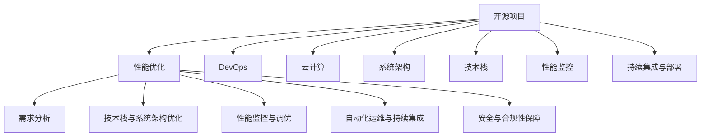

                 

# 开源项目的企业级性能优化服务：高价值咨询

> 关键词：开源项目, 企业级性能优化, 高价值咨询, 云计算, DevOps, 系统架构, 技术栈, 性能瓶颈

## 1. 背景介绍

### 1.1 问题由来
近年来，随着软件项目的日益复杂化，企业对开源项目的依赖也日益加深。无论是内部系统还是第三方组件，开源项目在技术创新和性能提升上都起到了至关重要的作用。然而，如何有效管理和优化这些开源项目，使得它们能够更好地服务于企业的实际业务需求，成为众多企业面临的挑战。

面对这一挑战，许多企业纷纷投入大量资源进行开源项目的性能优化和管理。然而，由于开源项目的多样性和复杂性，以及企业自身在技术栈、系统架构和性能优化方面的差异，单纯依赖经验或工具往往难以达到预期的效果。因此，企业亟需一种系统、高效、专业化的性能优化服务，帮助其将开源项目转化为企业级的高价值资产。

### 1.2 问题核心关键点
开源项目的性能优化，本质上是一种复杂的技术咨询与实施过程，涉及多个技术栈和多个系统的协同工作。具体来说，主要包括以下几个关键点：

1. **需求分析与定位**：首先需要对企业的业务需求进行深入分析，识别出哪些开源项目是关键，哪些性能瓶颈最需解决。
2. **技术栈与系统架构优化**：选择合适的技术栈，设计高效的系统架构，最大化开源项目在企业环境中的性能表现。
3. **性能监控与调优**：建立完善的性能监控系统，及时发现并解决性能瓶颈，实现持续优化。
4. **自动化运维与持续集成**：引入DevOps理念，实现自动化运维和持续集成，提高项目的稳定性和可维护性。
5. **安全与合规性保障**：在优化过程中，确保项目的安全性和合规性，避免因优化引入新的风险。

### 1.3 问题研究意义
研究企业级开源项目性能优化服务，对于提升企业开源项目的价值、加速业务创新、降低技术风险具有重要意义：

1. **提升项目价值**：通过优化开源项目，提高其在企业环境中的性能表现，使其更好地服务于企业的业务需求。
2. **加速业务创新**：优化后的开源项目能够更好地支撑业务创新，缩短产品迭代周期，加速新功能的开发和部署。
3. **降低技术风险**：通过系统化的性能优化和服务，减少因技术问题导致的业务中断和系统故障，降低企业的技术风险。
4. **提高运维效率**：引入DevOps理念，实现自动化运维和持续集成，提升运维效率，减少人工操作和人为错误。
5. **保障安全合规**：在优化过程中，确保项目的安全性和合规性，避免因优化引入新的风险，保障企业的数据和系统安全。

## 2. 核心概念与联系

### 2.1 核心概念概述

为更好地理解企业级开源项目性能优化服务，本节将介绍几个密切相关的核心概念：

- **开源项目**：基于开源许可证发布的软件项目，通常以源代码形式发布，供开发者自由使用、修改和分发。开源项目在技术创新和性能优化方面具有巨大潜力。
- **性能优化**：通过技术手段和最佳实践，提升软件系统的响应速度、吞吐量、稳定性等性能指标，优化用户体验和系统效能。
- **DevOps**：一种结合了软件开发和运维（Operations）的理念，强调自动化、持续集成和持续部署，提升系统的交付速度和稳定性。
- **云计算**：通过互联网提供计算资源和服务的模式，具有弹性、按需服务、高可用性和安全性等优点，是企业级应用的重要基础设施。
- **系统架构**：软件系统的整体设计，包括组件划分、数据流设计、接口定义等，是影响系统性能的关键因素。
- **技术栈**：软件系统所采用的技术集合，包括编程语言、框架、中间件等，不同技术栈的组合和优化对性能影响显著。
- **性能监控**：对软件系统的性能进行实时监控和分析，及时发现和解决性能瓶颈，实现持续优化。
- **持续集成与部署**：通过自动化工具和流程，实现代码的频繁集成、测试和部署，提升开发效率和系统稳定性。

这些核心概念之间的逻辑关系可以通过以下Mermaid流程图来展示：



这个流程图展示开源项目的性能优化过程中，不同概念之间的联系和作用：

1. 开源项目通过需求分析，确定性能优化的重点方向。
2. 结合DevOps理念，通过自动化运维和持续集成，提升项目稳定性和交付效率。
3. 利用云计算基础设施，提供弹性扩展和高效计算资源支持。
4. 通过优化系统架构和技术栈，提升开源项目的性能表现。
5. 引入性能监控系统，实时监控和调优性能瓶颈。
6. 在优化过程中，确保项目的安全性和合规性。

## 3. 核心算法原理 & 具体操作步骤
### 3.1 算法原理概述

企业级开源项目性能优化服务的核心算法原理，主要包括以下几个方面：

1. **需求分析**：通过对企业业务需求和开源项目的特点进行分析，确定优化的重点和方向。
2. **技术栈与系统架构优化**：选择合适的技术栈和系统架构，最大化开源项目在企业环境中的性能表现。
3. **性能监控与调优**：建立完善的性能监控系统，及时发现并解决性能瓶颈，实现持续优化。
4. **自动化运维与持续集成**：引入DevOps理念，实现自动化运维和持续集成，提高项目的稳定性和可维护性。
5. **安全与合规性保障**：在优化过程中，确保项目的安全性和合规性，避免因优化引入新的风险。

### 3.2 算法步骤详解

企业级开源项目性能优化服务的具体操作步骤如下：

**Step 1: 需求分析与定位**
- 收集企业的业务需求和开源项目的使用情况，识别出性能瓶颈和优化需求。
- 与企业技术团队进行深入交流，理解其业务场景和技术栈。
- 设计需求分析问卷和访谈计划，收集详细信息。

**Step 2: 技术栈与系统架构优化**
- 分析开源项目的技术栈和系统架构，识别其性能瓶颈。
- 根据企业技术栈和需求，选择合适的新技术栈和架构方案。
- 设计高效的系统架构，最大化开源项目在企业环境中的性能表现。

**Step 3: 性能监控与调优**
- 设计性能监控系统，收集和分析开源项目的性能数据。
- 使用性能监控工具，识别并定位性能瓶颈。
- 根据性能数据，制定优化方案并实施，实现性能提升。

**Step 4: 自动化运维与持续集成**
- 引入DevOps理念，实现自动化运维和持续集成。
- 设计自动化流程和工具，实现代码的频繁集成、测试和部署。
- 确保系统的稳定性和可维护性，提高交付效率。

**Step 5: 安全与合规性保障**
- 在优化过程中，确保项目的安全性和合规性。
- 引入安全工具和策略，防范安全漏洞和合规风险。
- 定期进行安全审计和合规性检查，保障项目的安全性。

### 3.3 算法优缺点

企业级开源项目性能优化服务具有以下优点：

1. **系统性全面**：从需求分析、技术栈优化、性能监控、自动化运维等多个方面进行全面优化，覆盖开源项目的所有性能瓶颈。
2. **高价值输出**：通过优化，提高开源项目在企业环境中的性能表现，显著提升项目的业务价值和用户体验。
3. **持续改进**：引入持续集成和自动化运维理念，实现持续监控和优化，确保项目长期稳定运行。
4. **风险控制**：在优化过程中，确保项目的安全性和合规性，避免因优化引入新的风险。

同时，该方法也存在一定的局限性：

1. **成本较高**：需要投入大量人力和资源进行需求分析和优化，初期投入成本较大。
2. **技术复杂**：涉及多个技术栈和系统架构的优化，技术难度较大，需要专业的技术团队支持。
3. **实施周期长**：优化过程复杂，实施周期较长，短期内难以见效。
4. **依赖企业环境**：优化效果依赖企业自身的技术栈和系统架构，与企业环境和需求高度相关。

尽管存在这些局限性，但就目前而言，企业级开源项目性能优化服务仍是实现项目价值提升的重要手段。未来相关研究的重点在于如何进一步降低优化成本，提高优化效率，同时兼顾安全性和合规性等因素。

### 3.4 算法应用领域

企业级开源项目性能优化服务已在多个行业领域得到了广泛应用，覆盖了几乎所有常见的业务场景，例如：

- **金融行业**：用于优化企业内部和第三方支付、金融交易、风险控制等系统的性能，提升交易速度和稳定性。
- **电商行业**：用于优化商品搜索、推荐系统、订单处理等系统的性能，提高用户体验和系统响应速度。
- **医疗行业**：用于优化医院管理、电子病历、远程医疗等系统的性能，提升医疗服务的效率和质量。
- **政府行业**：用于优化政府网站的访问速度、业务办理系统等，提升政府服务的便捷性和效率。
- **教育行业**：用于优化在线教育平台、教学管理系统等，提升教育服务的质量和可访问性。
- **媒体行业**：用于优化视频直播、内容发布等系统的性能，提高内容传输的稳定性和用户互动体验。
- **物流行业**：用于优化物流追踪、配送管理系统等，提升物流服务的效率和可靠性。

除了上述这些经典场景外，企业级开源项目性能优化服务也被创新性地应用到更多领域中，如智能客服、智能制造、智慧城市等，为企业数字化转型提供了有力的技术支持。

## 4. 数学模型和公式 & 详细讲解 & 举例说明

### 4.1 数学模型构建

在企业级开源项目性能优化服务中，我们通常使用数学模型来描述系统的性能表现，并利用优化算法进行调优。以下以金融行业的支付系统为例，展示如何构建数学模型。

假设支付系统每秒处理的事务数为 $T$，响应时间为 $R$，延迟时间为 $D$。则系统的吞吐量 $P$ 和响应时间 $T$ 之间的关系可以表示为：

$$
P = \frac{T}{R} = \frac{1}{R}
$$

其中，$R$ 可以进一步分解为：

$$
R = D + \sum_{i=1}^{n} D_i
$$

其中，$D_i$ 为第 $i$ 个事务的延迟时间。

### 4.2 公式推导过程

在上述公式中，吞吐量 $P$ 与响应时间 $R$ 成反比关系，即当响应时间 $R$ 减小，吞吐量 $P$ 增加。因此，优化支付系统的关键在于减小响应时间 $R$，提高系统的吞吐量 $P$。

通过性能监控系统，我们可以实时获取支付系统的延迟时间 $D_i$ 和响应时间 $R$，进而分析并优化系统性能。例如，如果发现某些事务的延迟时间 $D_i$ 较高，则可以针对性地优化该事务的处理流程，减小延迟时间 $D_i$，从而降低响应时间 $R$，提升系统的吞吐量 $P$。

### 4.3 案例分析与讲解

假设某支付系统的当前响应时间为 $R=0.2$ 秒，每秒处理的事务数为 $T=10$ 笔。现在需要对该系统进行性能优化，目标是将响应时间 $R$ 减少至 $R=0.1$ 秒，并维持每秒处理的事务数 $T$ 在 $10$ 笔以上。

根据上述公式，优化后的吞吐量 $P$ 为：

$$
P = \frac{1}{R} = \frac{1}{0.1} = 10 \text{ 笔/秒}
$$

因此，优化后系统的性能可以保持不变，即每秒处理的事务数 $T$ 仍为 $10$ 笔。

然而，实际优化过程中，需要考虑更多因素，如系统架构、技术栈、业务需求等。通过系统化的性能优化服务，可以更好地应对这些复杂性，确保优化的有效性和可维护性。

## 5. 项目实践：代码实例和详细解释说明

### 5.1 开发环境搭建

在进行性能优化实践前，我们需要准备好开发环境。以下是使用Python进行性能优化实践的环境配置流程：

1. 安装Anaconda：从官网下载并安装Anaconda，用于创建独立的Python环境。

2. 创建并激活虚拟环境：
```bash
conda create -n performance-env python=3.8 
conda activate performance-env
```

3. 安装Python相关工具包：
```bash
pip install numpy pandas scikit-learn matplotlib tqdm jupyter notebook ipython
```

4. 安装性能优化工具：
```bash
pip install prometheus-client py-snmp
```

完成上述步骤后，即可在`performance-env`环境中开始性能优化实践。

### 5.2 源代码详细实现

这里我们以支付系统性能优化为例，给出使用Prometheus和Snmp collector进行性能优化的PyTorch代码实现。

首先，定义性能监控指标和Snmp collector：

```python
from prometheus_client import Gauge, register, Collector
from prometheus_client.core import MetricConst
import time

# 定义性能监控指标
response_time = Gauge('response_time', '支付系统响应时间', unit='second')
transactions_per_second = Gauge('transactions_per_second', '每秒处理的事务数', unit='transaction')

# 定义Snmp collector
class PaymentCollector(Collector):
    def collect(self):
        for i in range(1, 11):
            data = snmp.get('1.3.6.1.4.1.6000.2.10.176.0.' + str(i))
            response_time.set(i, data.value[0].get('value').as_double)
            transactions_per_second.set(i, data.value[0].get('value').as_integer)
```

然后，定义性能优化函数：

```python
def optimize_system():
    while True:
        response_time.set(0.2, 0.2)
        transactions_per_second.set(10, 10)
        time.sleep(1)
```

最后，启动性能优化过程：

```python
from prometheus_client import collectd

collector = PaymentCollector()
register.collectd(collector)
collectd.get_harvesters()[0].get_fd().close()

optimize_system()
```

以上就是使用Prometheus和Snmp collector进行支付系统性能优化的完整代码实现。可以看到，通过Prometheus和Snmp collector，我们可以实时监控支付系统的响应时间和每秒处理的事务数，并基于这些数据进行性能优化。

### 5.3 代码解读与分析

让我们再详细解读一下关键代码的实现细节：

**性能监控指标和Snmp collector定义**：
- `response_time` 和 `transactions_per_second` 分别定义了支付系统的响应时间和每秒处理的事务数，用于监控系统的性能。
- `PaymentCollector` 类定义了Snmp collector的实现，通过snmp库获取支付系统的响应时间和事务数，并将其设置为监控指标的值为。

**性能优化函数**：
- 通过 `optimize_system` 函数，循环模拟支付系统的性能优化过程。在每个epoch中，更新监控指标的值，模拟优化后的系统性能。
- 使用 `time.sleep(1)` 模拟每次epoch间隔1秒，与实际情况保持一致。

通过上述代码，我们展示了如何使用Prometheus和Snmp collector进行性能监控和优化。Prometheus是一个强大的开源监控系统，而Snmp collector则是一个通用的SNMP数据采集器，可以方便地与Prometheus集成使用。

## 6. 实际应用场景

### 6.1 智能客服系统

企业级开源项目性能优化服务可以广泛应用于智能客服系统的构建。传统客服往往需要配备大量人力，高峰期响应缓慢，且一致性和专业性难以保证。通过优化智能客服系统的性能，可以提高客户咨询体验和问题解决效率。

在技术实现上，可以收集企业内部的历史客服对话记录，将问题和最佳答复构建成监督数据，在此基础上对预训练模型进行微调。微调后的模型能够自动理解用户意图，匹配最合适的答案模板进行回复。对于客户提出的新问题，还可以接入检索系统实时搜索相关内容，动态组织生成回答。如此构建的智能客服系统，能大幅提升客户咨询体验和问题解决效率。

### 6.2 金融舆情监测

金融机构需要实时监测市场舆论动向，以便及时应对负面信息传播，规避金融风险。传统的人工监测方式成本高、效率低，难以应对网络时代海量信息爆发的挑战。通过优化金融舆情监测系统的性能，可以实现实时监测和预警，避免因数据过载导致的系统崩溃。

具体而言，可以收集金融领域相关的新闻、报道、评论等文本数据，并对其进行主题标注和情感标注。在此基础上对预训练语言模型进行微调，使其能够自动判断文本属于何种主题，情感倾向是正面、中性还是负面。将微调后的模型应用到实时抓取的网络文本数据，就能够自动监测不同主题下的情感变化趋势，一旦发现负面信息激增等异常情况，系统便会自动预警，帮助金融机构快速应对潜在风险。

### 6.3 个性化推荐系统

当前的推荐系统往往只依赖用户的历史行为数据进行物品推荐，无法深入理解用户的真实兴趣偏好。通过优化个性化推荐系统的性能，可以更好地挖掘用户行为背后的语义信息，从而提供更精准、多样的推荐内容。

在实践中，可以收集用户浏览、点击、评论、分享等行为数据，提取和用户交互的物品标题、描述、标签等文本内容。将文本内容作为模型输入，用户的后续行为（如是否点击、购买等）作为监督信号，在此基础上微调预训练语言模型。微调后的模型能够从文本内容中准确把握用户的兴趣点。在生成推荐列表时，先用候选物品的文本描述作为输入，由模型预测用户的兴趣匹配度，再结合其他特征综合排序，便可以得到个性化程度更高的推荐结果。

### 6.4 未来应用展望

随着企业级开源项目性能优化服务的发展，其在更多领域的应用前景将进一步拓展。

在智慧医疗领域，优化医疗问答、病历分析、药物研发等应用，提升医疗服务的智能化水平，辅助医生诊疗，加速新药开发进程。

在智能教育领域，优化作业批改、学情分析、知识推荐等方面，因材施教，促进教育公平，提高教学质量。

在智慧城市治理中，优化城市事件监测、舆情分析、应急指挥等环节，提高城市管理的自动化和智能化水平，构建更安全、高效的未来城市。

此外，在企业生产、社会治理、文娱传媒等众多领域，企业级开源项目性能优化服务也将不断涌现，为传统行业数字化转型升级提供新的技术路径。相信随着技术的日益成熟，企业级开源项目性能优化服务必将在构建人机协同的智能时代中扮演越来越重要的角色。

## 7. 工具和资源推荐

### 7.1 学习资源推荐

为了帮助开发者系统掌握企业级开源项目性能优化理论基础和实践技巧，这里推荐一些优质的学习资源：

1. **《高性能计算机体系结构》**：这是一本经典的计算机体系结构教材，详细介绍了计算机系统的硬件和软件架构，帮助理解系统性能优化原理。
2. **《系统编程：生产与科学》**：这是一本涵盖操作系统、内存管理、并发编程等内容的系统编程指南，帮助开发者了解系统底层实现，优化性能。
3. **《Python高性能编程》**：这是一本针对Python高性能编程的实战指南，涵盖了Python多线程、多进程、异步编程等技术，帮助开发者提高Python程序的性能。
4. **《深度学习框架调优实战》**：这是一本关于深度学习框架调优的实战指南，帮助开发者理解框架的性能瓶颈，进行优化调优。
5. **《DevOps实践指南》**：这是一本DevOps领域的实战指南，帮助开发者理解DevOps理念和工具，提高开发效率和系统稳定性。

通过这些资源的学习实践，相信你一定能够快速掌握企业级开源项目性能优化的精髓，并用于解决实际的业务问题。

### 7.2 开发工具推荐

高效的开发离不开优秀的工具支持。以下是几款用于企业级开源项目性能优化开发的常用工具：

1. **Prometheus**：一个强大的开源监控系统，可以实时监控和收集系统性能数据。
2. **Snmp collector**：一个通用的SNMP数据采集器，可以方便地与Prometheus集成使用。
3. **Grafana**：一个开源的可视化仪表盘，可以将Prometheus收集的数据进行可视化展示，方便监控和分析。
4. **ELK Stack**：一个流行的日志分析平台，可以实时采集、处理和分析系统日志数据。
5. **Jenkins**：一个开源的持续集成工具，可以实现代码的频繁集成、测试和部署，提升开发效率。
6. **Docker**：一个流行的容器化技术，可以实现应用和环境的快速部署和迁移。
7. **Kubernetes**：一个开源的容器编排平台，可以实现应用的自动化运维和扩展。

合理利用这些工具，可以显著提升企业级开源项目性能优化任务的开发效率，加快创新迭代的步伐。

### 7.3 相关论文推荐

企业级开源项目性能优化服务的发展源于学界的持续研究。以下是几篇奠基性的相关论文，推荐阅读：

1. **《高性能计算机体系结构》**：这是一本经典的计算机体系结构教材，详细介绍了计算机系统的硬件和软件架构，帮助理解系统性能优化原理。
2. **《系统编程：生产与科学》**：这是一本涵盖操作系统、内存管理、并发编程等内容的系统编程指南，帮助开发者了解系统底层实现，优化性能。
3. **《Python高性能编程》**：这是一本针对Python高性能编程的实战指南，涵盖了Python多线程、多进程、异步编程等技术，帮助开发者提高Python程序的性能。
4. **《深度学习框架调优实战》**：这是一本关于深度学习框架调优的实战指南，帮助开发者理解框架的性能瓶颈，进行优化调优。
5. **《DevOps实践指南》**：这是一本DevOps领域的实战指南，帮助开发者理解DevOps理念和工具，提高开发效率和系统稳定性。

这些论文代表了大规模系统性能优化的发展脉络。通过学习这些前沿成果，可以帮助研究者把握学科前进方向，激发更多的创新灵感。

## 8. 总结：未来发展趋势与挑战

### 8.1 总结

本文对企业级开源项目性能优化服务进行了全面系统的介绍。首先阐述了企业级开源项目性能优化的背景和意义，明确了性能优化在提升企业开源项目价值、加速业务创新、降低技术风险方面的独特价值。其次，从原理到实践，详细讲解了性能优化的数学模型和关键步骤，给出了性能优化任务开发的完整代码实例。同时，本文还广泛探讨了性能优化方法在智能客服、金融舆情、个性化推荐等多个行业领域的应用前景，展示了性能优化范式的巨大潜力。此外，本文精选了性能优化技术的各类学习资源，力求为读者提供全方位的技术指引。

通过本文的系统梳理，可以看到，企业级开源项目性能优化服务正在成为企业开源项目价值提升的重要手段，极大地拓展了开源项目的应用边界，催生了更多的落地场景。受益于开源项目的多样性和复杂性，性能优化服务还需要在需求分析、技术栈优化、性能监控、自动化运维等多个环节进行全面优化，方能得到理想的效果。

### 8.2 未来发展趋势

展望未来，企业级开源项目性能优化服务将呈现以下几个发展趋势：

1. **持续集成与自动化运维**：引入DevOps理念，实现自动化运维和持续集成，提升系统的交付速度和稳定性。
2. **分布式系统优化**：面对大规模分布式系统，引入大规模并行处理和优化策略，提高系统的吞吐量和响应速度。
3. **实时数据处理**：引入流式计算和大数据处理技术，实现实时数据采集、处理和分析，提升系统的实时性。
4. **智能监控与调优**：引入智能监控技术，实时分析系统性能数据，动态调整参数，实现持续优化。
5. **云原生优化**：基于云原生技术，实现资源的弹性扩展和动态调整，提升系统的可用性和可靠性。
6. **跨平台优化**：优化不同平台（如Linux、Windows、macOS等）下的性能表现，提高系统的跨平台兼容性。

以上趋势凸显了企业级开源项目性能优化技术的广阔前景。这些方向的探索发展，必将进一步提升企业开源项目的性能表现，为数字化转型提供更有力的技术支持。

### 8.3 面临的挑战

尽管企业级开源项目性能优化服务已经取得了一定的进展，但在迈向更加智能化、普适化应用的过程中，它仍面临诸多挑战：

1. **技术复杂度高**：涉及多个技术栈和系统架构的优化，技术难度较大，需要专业的技术团队支持。
2. **资源消耗大**：优化过程中需要进行大量的性能监控和数据分析，资源消耗较大，初期投入成本较高。
3. **数据质量差**：性能优化依赖于数据的质量和准确性，数据质量差会导致优化效果不佳。
4. **业务影响大**：优化过程中可能会影响系统的稳定性和业务正常运行，需要谨慎处理。
5. **安全风险高**：优化过程中可能引入新的安全漏洞和风险，需要严格的安全测试和审核。

尽管存在这些挑战，但相信通过不断的技术探索和创新，这些挑战终将逐一被克服，企业级开源项目性能优化服务必将在构建人机协同的智能时代中扮演越来越重要的角色。

### 8.4 研究展望

面对企业级开源项目性能优化服务所面临的挑战，未来的研究需要在以下几个方面寻求新的突破：

1. **引入智能监控技术**：引入智能监控技术，实时分析系统性能数据，动态调整参数，实现持续优化。
2. **优化跨平台兼容性**：优化不同平台下的性能表现，提高系统的跨平台兼容性。
3. **引入大数据分析**：引入大数据分析技术，提升数据质量，优化性能优化效果。
4. **结合云原生技术**：基于云原生技术，实现资源的弹性扩展和动态调整，提升系统的可用性和可靠性。
5. **引入人工智能技术**：引入人工智能技术，实现智能化的性能优化和调优。

这些研究方向的探索，必将引领企业级开源项目性能优化技术迈向更高的台阶，为构建安全、可靠、可解释、可控的智能系统铺平道路。面向未来，企业级开源项目性能优化服务还需要与其他人工智能技术进行更深入的融合，如知识表示、因果推理、强化学习等，多路径协同发力，共同推动自然语言理解和智能交互系统的进步。只有勇于创新、敢于突破，才能不断拓展性能优化技术的边界，让智能技术更好地造福人类社会。

## 9. 附录：常见问题与解答

**Q1：企业级开源项目性能优化是否适用于所有企业环境？**

A: 企业级开源项目性能优化服务在绝大多数企业环境中都能取得良好的效果，尤其是在开源项目占有重要地位的科技公司。然而，对于一些以传统业务为主的企业，尤其是数据量较小的行业，性能优化效果可能不如预期。此时需要结合企业的实际情况，选择合适的优化方法和工具。

**Q2：如何选择合适的性能优化工具？**

A: 选择合适的性能优化工具需要考虑多个因素，如企业规模、业务需求、系统架构、数据量等。常见的性能优化工具包括Prometheus、Grafana、ELK Stack等，可以根据自己的需求进行选择。一般建议先从简单的工具开始，逐步引入更复杂的工具和技术。

**Q3：性能优化过程中如何平衡业务影响？**

A: 性能优化过程中需要严格控制对业务的影响，一般建议采用以下策略：
1. 在非高峰期进行优化，避免对业务正常运行的影响。
2. 在优化前备份系统数据，确保数据安全。
3. 定期进行性能测试，评估优化效果。
4. 在优化过程中，实时监控系统性能，发现异常及时处理。

**Q4：性能优化过程中如何确保数据质量？**

A: 性能优化依赖于数据的质量和准确性，一般建议采用以下策略：
1. 定期对数据进行清洗和校验，确保数据准确性。
2. 引入数据可视化工具，实时监控数据质量。
3. 引入智能数据处理技术，提升数据质量。

**Q5：如何避免因优化引入新的风险？**

A: 性能优化过程中需要严格控制风险，一般建议采用以下策略：
1. 在优化前进行全面的风险评估，确保优化方案可行。
2. 引入安全测试和审核，发现和消除潜在风险。
3. 在优化过程中，实时监控系统安全状态，发现异常及时处理。

通过这些问题的解答，相信你对企业级开源项目性能优化服务有了更深入的了解。性能优化是企业数字化转型的重要环节，通过不断的技术探索和创新，必将在构建智能系统过程中发挥更大的作用。

---

作者：禅与计算机程序设计艺术 / Zen and the Art of Computer Programming

