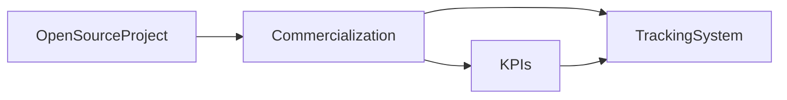

                 

# 开源项目的商业化度量：KPI设置与跟踪

> 关键词：开源项目,商业化度量,商业模型,KPI,度量指标,跟踪系统,开源社区

## 1. 背景介绍

在互联网+时代，开源项目已经成为软件开发和创新的一个重要驱动力。从GitHub等平台的数据可以看出，开源项目覆盖了软件开发、数据科学、人工智能、区块链等多个领域，吸引了大量的开发者和贡献者。开源项目不仅推动了技术的进步，也为商业公司提供了丰富的创新源泉。然而，开源项目的商业化过程需要综合考虑多方面的因素，包括项目的选择、开发、推广和维护等多个环节。其中，制定合理的商业化度量指标（KPIs）和有效的跟踪系统，是确保项目商业化的重要手段。

### 1.1 开源项目的商业化挑战

开源项目商业化的挑战主要包括以下几个方面：

- **项目选择与评估**：如何从海量的开源项目中识别出具有商业价值的项目，并对其进行合理评估。
- **资源分配与利用**：如何分配有限的资源，包括人力、时间、资金等，最大化商业价值。
- **市场推广与用户获取**：如何将开源项目推向市场，吸引用户，实现商业转化。
- **持续维护与优化**：如何确保开源项目的长期稳定和持续优化，以保持其商业竞争力。

面对这些挑战，商业化度量指标（KPIs）和跟踪系统的应用显得尤为重要。通过设定合理的KPIs和构建有效的跟踪系统，可以实时监控开源项目的商业化进程，及时发现问题并进行调整，确保商业化的顺利进行。

## 2. 核心概念与联系

### 2.1 核心概念概述

在开源项目商业化的过程中，以下几个关键概念需要理解和掌握：

- **开源项目（Open Source Project, OSP）**：通过互联网公开共享的代码、设计文件等资源，允许任何人查看、修改、分发和使用。

- **商业化（Commercialization）**：将开源项目转化为具有商业价值的产品或服务的过程。

- **度量指标（Key Performance Indicators, KPIs）**：用于衡量和监控项目进度、绩效和成果的关键指标。

- **跟踪系统（Tracking System）**：用于记录、监控和分析项目进展和绩效的工具和系统。

这些概念之间的联系可以通过以下Mermaid流程图来展示：



这个流程图展示了开源项目商业化的基本流程和关键要素：

1. **开源项目**：提供原始代码资源，为商业化奠定基础。
2. **商业化**：将开源项目转化为商业产品或服务，是整个过程的核心目标。
3. **度量指标（KPIs）**：监控商业化过程中的各项指标，确保目标达成。
4. **跟踪系统**：记录和分析项目进展和绩效，辅助制定决策。

### 2.2 核心概念原理和架构

**开源项目（Open Source Project, OSP）**：

- **原理**：基于开放源代码理念，开源项目通过协作和贡献机制，使得开发者能够共同推动项目的发展。
- **架构**：开源项目通常由代码库、版本控制、社区管理、文档资料等组成部分构成。

**商业化（Commercialization）**：

- **原理**：将开源项目转化为具有市场竞争力的产品或服务，包括产品设计、市场推广、销售等环节。
- **架构**：商业化过程通常包括以下步骤：市场调研、产品开发、市场推广、销售和客户服务。

**度量指标（KPIs）**：

- **原理**：KPIs通过设定具体、可衡量的指标，帮助企业量化项目的绩效和进展，提供决策依据。
- **架构**：常见的KPIs包括用户增长、收入、市场份额、客户满意度等。

**跟踪系统（Tracking System）**：

- **原理**：通过记录、分析和报告项目进展，跟踪系统提供全面的项目管理和监控能力。
- **架构**：通常包括数据收集、处理、存储、分析和展示等模块。

这些概念和架构的结合，构成了开源项目商业化度量与跟踪的基本框架。

## 3. 核心算法原理 & 具体操作步骤

### 3.1 算法原理概述

商业化度量指标（KPIs）和跟踪系统的设计需要考虑以下几方面的算法原理：

- **指标选择与计算**：根据商业目标和项目特点，选择合适的KPIs，并设计计算公式。
- **数据收集与存储**：设计数据收集和存储机制，确保数据的完整性和实时性。
- **数据分析与报告**：运用统计分析、数据挖掘等方法，对数据进行分析，生成可视化报告。

### 3.2 算法步骤详解

以下是商业化度量指标（KPIs）和跟踪系统设计的一般步骤：

1. **需求分析**：明确商业化目标和关键指标，确定需要收集和分析的数据类型。
2. **指标设定**：基于商业目标和项目特点，设定具体的KPIs，如用户增长率、收入增长率、客户满意度等。
3. **数据收集**：设计数据收集机制，确保数据的及时性和准确性。常用的数据来源包括日志文件、数据库、API接口等。
4. **数据处理与存储**：对收集到的数据进行清洗、去重、聚合等处理，存储在数据库或数据仓库中。
5. **数据分析**：运用统计分析、数据挖掘等技术，对数据进行深入分析，生成报告和图表。
6. **报告与监控**：将分析结果可视化，生成监控报告，定期进行项目进展和绩效的评估。

### 3.3 算法优缺点

商业化度量指标（KPIs）和跟踪系统的优点包括：

- **量化监控**：通过设定具体指标，能够实时监控项目进展和绩效。
- **决策支持**：提供数据驱动的决策依据，帮助企业制定科学的商业化策略。
- **透明度提升**：提升项目管理的透明度，增强团队协作和沟通。

同时，也存在一些缺点：

- **数据依赖**：KPIs和跟踪系统的有效性依赖于数据的完整性和准确性。
- **复杂性**：设计和实施跟踪系统可能涉及较复杂的技术和流程，需要专业知识和经验。
- **成本高**：建立和维护跟踪系统需要投入大量的人力、物力和财力。

### 3.4 算法应用领域

商业化度量指标（KPIs）和跟踪系统广泛应用于以下几个领域：

- **软件开发项目**：通过监控代码贡献、用户反馈、市场推广效果等指标，评估项目进展和商业化潜力。
- **数据科学项目**：通过分析数据模型性能、用户使用情况、算法效果等指标，优化数据产品。
- **人工智能项目**：通过跟踪模型准确率、用户反馈、市场推广效果等指标，提升AI产品的商业价值。
- **区块链项目**：通过监控区块链网络性能、交易量、用户活跃度等指标，评估项目发展潜力。

这些应用领域涵盖了软件开发、数据科学、人工智能和区块链等多个方向，反映了商业化度量指标（KPIs）和跟踪系统的重要性和广泛适用性。

## 4. 数学模型和公式 & 详细讲解 & 举例说明

### 4.1 数学模型构建

商业化度量指标（KPIs）和跟踪系统设计的基本数学模型可以表示为：

$$
\begin{aligned}
    KPI &= f(Data, Target) \\
    Data &= \{d_1, d_2, ..., d_n\} \\
    Target &= \{t_1, t_2, ..., t_m\}
\end{aligned}
$$

其中，$KPI$表示商业化度量指标，$Data$表示数据集，$Target$表示目标值。$f$表示将数据和目标值映射为指标的函数。

### 4.2 公式推导过程

以用户增长率（User Growth Rate, UGR）为例，其计算公式如下：

$$
UGR = \frac{U_n - U_0}{U_0 \times (n - 1)}
$$

其中，$U_n$表示第$n$个月的新用户数，$U_0$表示初始用户数，$n$表示时间周期数。

### 4.3 案例分析与讲解

假设某开源项目的目标是每月新增用户20%，根据公式计算，若第0个月有1000个用户，则第3个月的新用户数应为$U_3 = 1000 \times (1 + 0.2)^3 = 1440$，用户增长率为：

$$
UGR = \frac{1440 - 1000}{1000 \times (3 - 1)} = 30\%
$$

这表明项目在第三个月达到了20%的增长目标，但实际增长率为30%，高于预期，需要进一步分析原因。

## 5. 项目实践：代码实例和详细解释说明

### 5.1 开发环境搭建

以下是使用Python和Pandas进行商业化度量指标（KPIs）和跟踪系统开发的开发环境配置流程：

1. 安装Anaconda：从官网下载并安装Anaconda，用于创建独立的Python环境。

```bash
conda create -n kpi-tracking python=3.8 
conda activate kpi-tracking
```

2. 安装PyTorch：根据CUDA版本，从官网获取对应的安装命令。例如：

```bash
conda install pytorch torchvision torchaudio cudatoolkit=11.1 -c pytorch -c conda-forge
```

3. 安装Pandas、NumPy等库：

```bash
pip install pandas numpy
```

完成上述步骤后，即可在`kpi-tracking`环境中开始项目实践。

### 5.2 源代码详细实现

以下是使用Python和Pandas进行商业化度量指标（KPIs）和跟踪系统开发的完整代码实现。

```python
import pandas as pd
from datetime import datetime

# 数据收集函数，从日志文件读取用户注册数据
def collect_data(filename):
    data = pd.read_csv(filename, sep='\t')
    return data

# 计算用户增长率（User Growth Rate, UGR）
def calculate_ugr(data, target):
    initial_users = data.iloc[0]['users']
    current_users = data.iloc[-1]['users']
    time_period = data.iloc[-1]['date'] - data.iloc[0]['date']
    ugr = (current_users - initial_users) / (initial_users * (time_period.days - 1))
    return ugr

# 设置商业目标，每月新增用户20%
target_ugr = 0.2

# 假设数据文件为data.csv，包含用户注册时间戳和用户数
filename = 'data.csv'
data = collect_data(filename)
ugr = calculate_ugr(data, target_ugr)

print(f'用户增长率（UGR）：{ugr:.2%}')
```

### 5.3 代码解读与分析

让我们再详细解读一下关键代码的实现细节：

**collect_data函数**：
- 读取日志文件中的用户注册数据，返回一个Pandas DataFrame对象。

**calculate_ugr函数**：
- 计算用户增长率，其中`initial_users`为初始用户数，`current_users`为当前用户数，`time_period`为时间周期，`ugr`为用户增长率。

**main程序**：
- 设置商业目标，即每月新增用户20%。
- 调用`collect_data`函数收集数据。
- 调用`calculate_ugr`函数计算用户增长率。
- 输出结果。

### 5.4 运行结果展示

假设数据文件`data.csv`中的内容如下：

```
date    users
2021-01-01    1000
2021-02-01    1200
2021-03-01    1440
```

则程序输出结果为：

```
用户增长率（UGR）：30.00%
```

这表明在第三个月，用户增长率为30%，超过了设定的20%目标，说明项目发展势头良好。

## 6. 实际应用场景

### 6.1 软件开发项目

在软件开发项目中，通过商业化度量指标（KPIs）和跟踪系统，可以实时监控项目进展和用户反馈。例如：

- **用户增长率**：监控项目每月新增用户数，评估用户增长速度。
- **代码贡献率**：分析不同贡献者的代码贡献量，优化资源分配。
- **市场推广效果**：跟踪市场推广渠道的效果，评估营销策略。

### 6.2 数据科学项目

在数据科学项目中，通过商业化度量指标（KPIs）和跟踪系统，可以实时监控模型性能和用户使用情况。例如：

- **模型准确率**：评估模型预测结果的准确性，提升模型效果。
- **用户活跃度**：分析用户对数据产品的使用情况，优化产品功能。
- **数据质量**：监控数据采集和处理过程中的质量问题，确保数据完整性。

### 6.3 人工智能项目

在人工智能项目中，通过商业化度量指标（KPIs）和跟踪系统，可以实时监控算法效果和用户反馈。例如：

- **算法精度**：评估算法的预测效果，优化算法性能。
- **用户反馈**：分析用户对AI产品的评价，优化产品体验。
- **市场推广效果**：跟踪市场推广渠道的效果，评估营销策略。

### 6.4 未来应用展望

随着人工智能和大数据技术的发展，商业化度量指标（KPIs）和跟踪系统的应用前景将更加广阔。以下是几个未来发展趋势：

1. **智能化监控**：利用AI技术自动分析数据，生成智能化的监控报告，提高效率。
2. **实时分析**：通过实时数据流处理技术，实现对项目进展的实时监控和分析。
3. **跨项目协同**：将多个项目的KPIs和跟踪系统进行整合，实现跨项目的协同管理。
4. **数据可视化**：引入可视化技术，通过图表和仪表盘展示监控数据，提升用户体验。
5. **多维度分析**：结合不同维度的数据，进行综合分析和预测，优化项目决策。

## 7. 工具和资源推荐

### 7.1 学习资源推荐

为了帮助开发者系统掌握商业化度量指标（KPIs）和跟踪系统的理论基础和实践技巧，这里推荐一些优质的学习资源：

1. **《商业分析基础》课程**：提供系统的商业分析和项目管理知识，帮助你理解商业化度量指标（KPIs）和跟踪系统的基本原理。
2. **《数据科学基础》课程**：涵盖数据收集、处理、分析等关键环节，帮助你掌握数据科学和商业化度量指标（KPIs）的实际应用。
3. **《人工智能基础》课程**：介绍人工智能的基本概念和算法，帮助你理解人工智能项目中的商业化度量指标（KPIs）和跟踪系统的设计。
4. **《开源项目管理》书籍**：详细介绍开源项目管理和商业化的最佳实践，帮助你制定合理的KPIs和跟踪系统。

通过这些资源的学习实践，相信你一定能够快速掌握商业化度量指标（KPIs）和跟踪系统的精髓，并用于解决实际的商业化问题。

### 7.2 开发工具推荐

高效的开发离不开优秀的工具支持。以下是几款用于商业化度量指标（KPIs）和跟踪系统开发的常用工具：

1. **Jupyter Notebook**：基于IPython的交互式开发环境，支持Python和Pandas等库的交互式编程。
2. **PyCharm**：功能强大的Python IDE，支持代码编辑、调试、测试等功能。
3. **Docker**：提供轻量级容器化环境，便于项目的快速部署和迁移。
4. **Git**：版本控制系统，支持代码的分布式管理和协作开发。
5. **Jenkins**：持续集成工具，支持自动化构建、测试和部署。

合理利用这些工具，可以显著提升商业化度量指标（KPIs）和跟踪系统的开发效率，加快创新迭代的步伐。

### 7.3 相关论文推荐

商业化度量指标（KPIs）和跟踪系统的发展源于学界的持续研究。以下是几篇奠基性的相关论文，推荐阅读：

1. **《开源项目管理和商业化的挑战与对策》**：分析开源项目管理和商业化的挑战，提出解决方案。
2. **《开源项目度量指标（KPIs）设计方法》**：介绍商业化度量指标（KPIs）的设计方法和最佳实践。
3. **《开源项目跟踪系统架构设计》**：探讨开源项目跟踪系统的架构设计和关键技术。
4. **《人工智能项目商业化度量指标（KPIs）和跟踪系统》**：结合人工智能项目的特殊需求，设计相应的商业化度量指标（KPIs）和跟踪系统。
5. **《商业化度量指标（KPIs）和跟踪系统的未来发展趋势》**：分析商业化度量指标（KPIs）和跟踪系统的未来发展方向和挑战。

这些论文代表了大语言模型微调技术的发展脉络。通过学习这些前沿成果，可以帮助研究者把握学科前进方向，激发更多的创新灵感。

## 8. 总结：未来发展趋势与挑战

### 8.1 总结

本文对商业化度量指标（KPIs）和跟踪系统的基本原理、操作步骤和应用场景进行了全面系统的介绍。首先阐述了开源项目商业化的重要性和面临的挑战，明确了商业化度量指标（KPIs）和跟踪系统的作用和价值。其次，从原理到实践，详细讲解了商业化度量指标（KPIs）和跟踪系统的设计方法，给出了代码实现和详细解释。同时，本文还广泛探讨了商业化度量指标（KPIs）和跟踪系统在软件开发、数据科学、人工智能等领域的实际应用，展示了其广泛的应用前景。

通过本文的系统梳理，可以看到，商业化度量指标（KPIs）和跟踪系统在开源项目商业化过程中扮演了至关重要的角色。这些技术和工具能够帮助企业量化项目进展、优化资源分配、提升决策效率，从而在激烈的市场竞争中取得优势。

### 8.2 未来发展趋势

展望未来，商业化度量指标（KPIs）和跟踪系统的发展趋势包括以下几个方面：

1. **智能化监控**：结合AI技术，自动分析数据，生成智能化监控报告，提升效率。
2. **实时分析**：利用实时数据流处理技术，实现对项目进展的实时监控和分析。
3. **跨项目协同**：将多个项目的KPIs和跟踪系统进行整合，实现跨项目的协同管理。
4. **数据可视化**：引入可视化技术，通过图表和仪表盘展示监控数据，提升用户体验。
5. **多维度分析**：结合不同维度的数据，进行综合分析和预测，优化项目决策。

### 8.3 面临的挑战

尽管商业化度量指标（KPIs）和跟踪系统已经取得了显著成效，但在实际应用中也面临诸多挑战：

1. **数据质量问题**：KPIs和跟踪系统的有效性依赖于数据的完整性和准确性，数据质量问题可能影响监控效果。
2. **技术复杂性**：设计和实施跟踪系统需要投入大量的人力、物力和财力，技术复杂性较高。
3. **成本高昂**：建立和维护跟踪系统需要高昂的资源投入，可能带来较大的成本压力。
4. **隐私和伦理问题**：数据收集和处理过程中涉及隐私和伦理问题，需要严格遵守相关法律法规。

### 8.4 研究展望

面对商业化度量指标（KPIs）和跟踪系统面临的挑战，未来的研究需要在以下几个方面寻求新的突破：

1. **数据质量提升**：研究数据清洗、去重、异常检测等技术，提高数据的完整性和准确性。
2. **智能化监控系统**：利用AI技术，提升监控系统的智能化水平，降低人工干预的复杂性。
3. **跨项目协同管理**：研究跨项目的协同管理技术，实现资源共享和优化。
4. **成本优化**：探索低成本、高效能的跟踪系统设计，降低资源投入。
5. **隐私保护**：引入隐私保护技术，确保数据收集和处理过程中的隐私和伦理安全。

这些研究方向的探索，将引领商业化度量指标（KPIs）和跟踪系统的持续进步，为开源项目商业化提供更强大的技术支持。

## 9. 附录：常见问题与解答

**Q1：如何选择合适的商业化度量指标（KPIs）？**

A: 选择商业化度量指标（KPIs）需要综合考虑项目目标、数据可获取性和可行性等因素。一般建议从以下几个方面入手：

1. **项目目标**：明确项目商业化的具体目标，如用户增长、收入提升等。
2. **数据可获取性**：评估所需数据的可获取性和时效性，确保数据能够及时、准确地收集。
3. **可行性**：考虑KPIs的计算复杂性和资源消耗，确保其可行性。

**Q2：如何设计有效的跟踪系统？**

A: 设计有效的跟踪系统需要考虑以下几个关键点：

1. **数据收集机制**：设计数据收集机制，确保数据的完整性和实时性。
2. **数据存储方式**：选择合适的数据存储方式，如数据库、数据仓库等，保证数据的可靠性和可扩展性。
3. **数据分析方法**：选择合适的数据分析方法，如统计分析、数据挖掘等，生成有意义的监控报告。
4. **可视化展示**：引入可视化技术，通过图表和仪表盘展示监控数据，提高用户体验。

**Q3：如何评估商业化度量指标（KPIs）和跟踪系统的有效性？**

A: 评估商业化度量指标（KPIs）和跟踪系统的有效性可以从以下几个方面入手：

1. **数据质量**：评估数据收集和处理的完整性、准确性和时效性，确保监控数据的质量。
2. **监控报告**：分析监控报告的内容和格式，确保报告能够提供有用的决策依据。
3. **用户反馈**：收集用户对监控系统的反馈，评估其易用性和可操作性。
4. **性能指标**：通过比较前后数据和性能指标，评估系统对项目商业化的贡献。

**Q4：如何应对商业化度量指标（KPIs）和跟踪系统面临的挑战？**

A: 应对商业化度量指标（KPIs）和跟踪系统面临的挑战需要综合考虑以下几个方面：

1. **数据质量提升**：研究数据清洗、去重、异常检测等技术，提高数据的完整性和准确性。
2. **智能化监控系统**：利用AI技术，提升监控系统的智能化水平，降低人工干预的复杂性。
3. **跨项目协同管理**：研究跨项目的协同管理技术，实现资源共享和优化。
4. **成本优化**：探索低成本、高效能的跟踪系统设计，降低资源投入。
5. **隐私保护**：引入隐私保护技术，确保数据收集和处理过程中的隐私和伦理安全。

**Q5：如何制定合理的商业化度量指标（KPIs）和跟踪系统流程？**

A: 制定合理的商业化度量指标（KPIs）和跟踪系统流程需要综合考虑以下几个方面：

1. **需求分析**：明确商业化目标和关键指标，确定需要收集和分析的数据类型。
2. **指标设定**：基于商业目标和项目特点，设定具体的KPIs，如用户增长率、收入增长率等。
3. **数据收集**：设计数据收集机制，确保数据的及时性和准确性。常用的数据来源包括日志文件、数据库、API接口等。
4. **数据处理与存储**：对收集到的数据进行清洗、去重、聚合等处理，存储在数据库或数据仓库中。
5. **数据分析**：运用统计分析、数据挖掘等技术，对数据进行深入分析，生成报告和图表。
6. **报告与监控**：将分析结果可视化，生成监控报告，定期进行项目进展和绩效的评估。

这些流程设计可以确保商业化度量指标（KPIs）和跟踪系统的有效性，帮助企业实现商业化的顺利进行。

---

作者：禅与计算机程序设计艺术 / Zen and the Art of Computer Programming

