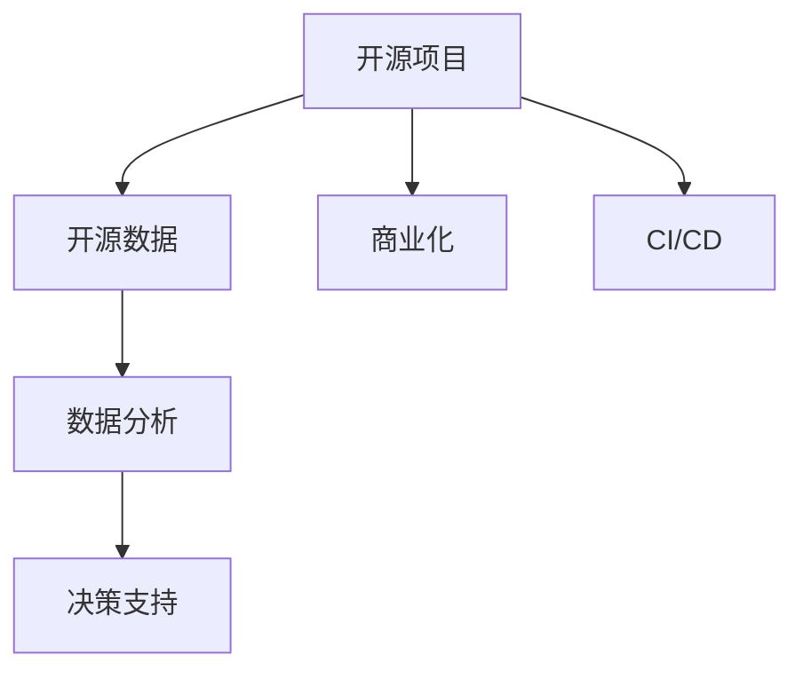

                 

# 开源项目的商业化数据分析：洞察和决策支持

> 关键词：开源项目, 商业化, 数据分析, 洞察, 决策支持

## 1. 背景介绍

### 1.1 问题由来

随着开源运动的兴起，越来越多的公司利用开源软件作为技术基础，加速产品迭代，提升竞争力。然而，开源项目的商业化转型仍然面临诸多挑战，尤其是如何高效利用开源社区的数据，进行深入分析和商业决策支持。开源项目的商业化数据分析已成为企业技术创新的关键环节。

### 1.2 问题核心关键点

- **开源数据采集与整合**：如何从开源社区的代码库、文档、邮件列表等异构数据源中高效采集、整合数据。
- **数据洞察与挖掘**：如何从采集的数据中提取有价值的洞察，如技术趋势、社区活跃度、需求热点等。
- **决策支持**：如何基于数据洞察，提供决策建议，辅助开源项目的商业化方向和产品迭代策略。

### 1.3 问题研究意义

开源项目的商业化数据分析对于公司来说具有重要意义：

- **降低成本**：利用开源数据减少研发投入，快速迭代产品。
- **提升效率**：通过数据分析优化研发流程，提升技术创新速度。
- **增强竞争力**：洞察开源社区动态，预判技术趋势，优化产品策略。
- **构建生态**：通过数据分析加强与开源社区的互动，构建健康生态。

## 2. 核心概念与联系

### 2.1 核心概念概述

为更好地理解开源项目的商业化数据分析，本节将介绍几个密切相关的核心概念：

- **开源项目(Open Source Project)**：指遵循开源协议、公开源代码的项目，通常以GitHub等代码托管平台为依托。
- **开源数据(Open Source Data)**：指开源项目产生的各类数据，如代码、文档、邮件、社区讨论等。
- **商业化(Commercialization)**：指将开源项目转化为可商业化产品的过程，涉及技术融合、市场推广等环节。
- **数据分析(Data Analysis)**：通过统计、挖掘、可视化等方法，从数据中提取有用信息的过程。
- **决策支持(Decision Support)**：利用数据分析结果，辅助管理层进行商业决策，优化产品和服务策略。
- **持续集成/持续部署(CI/CD)**：自动化技术流程，确保代码质量，加速产品迭代。

这些核心概念之间的逻辑关系可以通过以下Mermaid流程图来展示：



这个流程图展示开源项目的核心概念及其之间的关系：

1. 开源项目通过CI/CD流程生产数据。
2. 数据通过数据分析过程提取洞察。
3. 洞察辅助商业化决策。
4. 持续集成和持续部署确保代码质量。

## 3. 核心算法原理 & 具体操作步骤
### 3.1 算法原理概述

开源项目的商业化数据分析，本质上是一个将开源数据转化为商业决策支持的跨学科过程。其核心思想是：从开源项目的数据中，通过统计、机器学习等方法，提取有价值的信息，进而辅助商业化决策。

形式化地，假设开源项目 $P$ 的数据集为 $D=\{(x_i,y_i)\}_{i=1}^N$，其中 $x_i$ 为输入数据，如代码提交时间、社区讨论内容等，$y_i$ 为输出标签，如技术趋势、需求热点等。数据分析的目标是找到函数 $f: x \rightarrow y$，使得 $f(x)$ 能够最佳地预测 $y$。

通过梯度下降等优化算法，数据分析过程不断更新函数 $f$，最小化预测误差，直到收敛到理想的函数。最终得到的函数 $f$ 即为开源数据转化为商业决策支持的模型。

### 3.2 算法步骤详解

开源项目的商业化数据分析一般包括以下几个关键步骤：

**Step 1: 数据采集与预处理**

- **数据源识别**：从GitHub、Bitbucket、GitLab等代码托管平台，识别开源项目，并记录相关数据源。
- **数据采集**：使用API或Web爬虫等技术手段，自动从数据源中采集开源数据，如代码变更日志、社区讨论内容等。
- **数据清洗**：对采集的数据进行清洗、去重、格式化，确保数据质量。

**Step 2: 数据存储与结构化**

- **数据库设计**：根据采集的数据特性，设计合理的数据库结构，如关系型数据库、NoSQL数据库等。
- **数据加载**：将清洗后的数据加载到数据库中，并设计高效的数据存储方案，如分片、索引等。

**Step 3: 数据分析与建模**

- **特征工程**：从数据中提取、选择、构建有用的特征，如代码提交频率、社区参与度、技术趋势等。
- **模型选择**：选择适合的统计模型或机器学习模型，如回归模型、分类模型、聚类模型等。
- **模型训练**：使用训练集对模型进行训练，调整模型参数，使其适应数据特性。
- **模型评估**：在验证集上评估模型性能，选择最优模型。

**Step 4: 决策支持与可视化**

- **数据洞察**：从训练好的模型中提取关键洞察，如技术热点、需求趋势等。
- **可视化**：使用数据可视化工具，将洞察结果直观展示，辅助决策。
- **决策推荐**：基于洞察结果，提供决策建议，如技术选型、市场需求分析等。

**Step 5: 应用与迭代**

- **系统集成**：将分析工具和模型集成到现有产品或流程中，提供实时决策支持。
- **持续优化**：根据新数据和反馈，不断调整模型和算法，优化决策支持效果。

### 3.3 算法优缺点

开源项目的商业化数据分析方法具有以下优点：

- **成本低廉**：利用开源数据，降低数据获取和处理的成本。
- **灵活高效**：快速响应数据变化，及时调整决策策略。
- **技术前沿**：结合最新数据分析和机器学习技术，提供领先的分析方案。
- **支持持续集成**：与CI/CD流程无缝集成，确保数据分析的实时性。

同时，该方法也存在一定的局限性：

- **数据质量不稳定**：开源社区数据多样，质量参差不齐，对数据分析的准确性有较大影响。
- **模型泛化性不足**：开源项目数据多样，模型难以泛化到特定企业内部。
- **需要技术积累**：数据分析和机器学习技术要求较高，需一定技术积累。
- **隐私和合规问题**：开源数据可能涉及隐私和合规问题，需注意数据保护。

尽管存在这些局限性，但就目前而言，基于开源数据的商业化数据分析方法仍是大规模技术创新和决策支持的重要手段。未来相关研究的重点在于如何进一步提高数据分析的准确性和泛化性，同时兼顾隐私保护和合规性。

### 3.4 算法应用领域

开源项目的商业化数据分析方法，已经在软件开发、产品迭代、技术选型等多个领域得到了广泛应用：

- **软件开发**：利用开源代码数据，进行代码质量评估、技术趋势分析、需求热点挖掘等。
- **产品迭代**：基于开源社区反馈，优化产品功能，提升用户体验。
- **技术选型**：通过开源数据分析，评估技术栈，选择最佳的技术方案。
- **市场调研**：分析开源项目的流行度和发展趋势，为市场定位和产品推广提供依据。
- **风险管理**：识别开源项目的技术风险和市场风险，辅助风险决策。

除了上述这些经典应用外，开源数据分析还被创新性地应用于开源贡献者管理、开源项目评估、技术文档自动化生成等场景，为技术创新和产品优化提供了新的视角。

## 4. 数学模型和公式 & 详细讲解 & 举例说明
### 4.1 数学模型构建

本节将使用数学语言对开源项目的商业化数据分析过程进行更加严格的刻画。

记开源项目 $P$ 的数据集为 $D=\{(x_i,y_i)\}_{i=1}^N$，其中 $x_i \in \mathcal{X}, y_i \in \mathcal{Y}$，$\mathcal{X}$ 为输入空间，$\mathcal{Y}$ 为输出空间。定义模型 $f: \mathcal{X} \rightarrow \mathcal{Y}$ 为从输入数据 $x$ 到输出标签 $y$ 的映射函数。

定义模型 $f$ 在数据样本 $(x,y)$ 上的损失函数为 $\ell(f(x),y)$，则在数据集 $D$ 上的经验风险为：

$$
\mathcal{L}(f) = \frac{1}{N} \sum_{i=1}^N \ell(f(x_i),y_i)
$$

数据分析的目标是最小化经验风险，即找到最优函数 $f$：

$$
f^* = \mathop{\arg\min}_{f} \mathcal{L}(f)
$$

在实践中，我们通常使用基于梯度的优化算法（如SGD、Adam等）来近似求解上述最优化问题。设 $\eta$ 为学习率，则参数的更新公式为：

$$
f \leftarrow f - \eta \nabla_{f}\mathcal{L}(f)
$$

其中 $\nabla_{f}\mathcal{L}(f)$ 为损失函数对函数 $f$ 的梯度，可通过反向传播算法高效计算。

### 4.2 公式推导过程

以下我们以回归任务为例，推导损失函数及其梯度的计算公式。

假设模型 $f$ 在输入 $x$ 上的输出为 $\hat{y}=f(x)$，真实标签 $y$ 为连续值。则回归损失函数定义为：

$$
\ell(f(x),y) = \frac{1}{2}(y-\hat{y})^2
$$

将其代入经验风险公式，得：

$$
\mathcal{L}(f) = \frac{1}{N} \sum_{i=1}^N (y_i - f(x_i))^2
$$

根据链式法则，损失函数对函数 $f$ 的梯度为：

$$
\frac{\partial \mathcal{L}(f)}{\partial f(x)} = \sum_{i=1}^N (y_i - f(x_i)) \frac{\partial f(x_i)}{\partial f(x)}
$$

在得到损失函数的梯度后，即可带入参数更新公式，完成函数的迭代优化。重复上述过程直至收敛，最终得到适应开源数据的最优函数 $f^*$。

### 4.3 案例分析与讲解

**案例：开源项目的技术趋势分析**

假设我们收集了一个开源项目 $P$ 的代码提交历史数据，包括提交时间 $t_i$、提交者 $a_i$、代码变更类型 $c_i$ 等特征。我们希望通过这些数据，分析出该项目的当前技术趋势。

定义 $x_i=(t_i, a_i, c_i)$，$y_i$ 为技术热点标签，如 "人工智能"、"大数据"、"云计算" 等。选择回归模型进行建模，目标是最小化预测误差：

$$
\mathcal{L}(f) = \frac{1}{N} \sum_{i=1}^N (y_i - f(x_i))^2
$$

其中 $f(x_i)=\theta^T \varphi(x_i)$，$\varphi(x_i)$ 为特征映射函数，$\theta$ 为模型参数。通过反向传播算法更新 $\theta$，直至模型收敛。

训练好的模型可以用于预测新的代码提交数据 $(t_{new}, a_{new}, c_{new})$ 的技术热点。通过不断调整模型参数，并使用新数据进行训练，可以持续更新技术趋势分析结果，辅助开源项目的商业化决策。

## 5. 项目实践：代码实例和详细解释说明
### 5.1 开发环境搭建

在进行开源项目数据分析实践前，我们需要准备好开发环境。以下是使用Python进行Apache Spark开发的环境配置流程：

1. 安装Anaconda：从官网下载并安装Anaconda，用于创建独立的Python环境。

2. 创建并激活虚拟环境：
```bash
conda create -n pyspark-env python=3.8 
conda activate pyspark-env
```

3. 安装Apache Spark：根据CUDA版本，从官网获取对应的安装命令。例如：
```bash
pip install apache-spark==3.2.0
```

4. 安装PySpark：
```bash
pip install pyspark
```

5. 安装各类工具包：
```bash
pip install numpy pandas scikit-learn matplotlib tqdm jupyter notebook ipython
```

完成上述步骤后，即可在`pyspark-env`环境中开始数据分析实践。

### 5.2 源代码详细实现

下面我们以开源项目的技术趋势分析为例，给出使用PySpark进行数据分析的Python代码实现。

首先，定义数据处理函数：

```python
from pyspark.sql import SparkSession

spark = SparkSession.builder.appName('OpenSourceAnalysis').getOrCreate()

# 读取数据
df = spark.read.format('json').option('header', 'true').load('path/to/data.json')

# 数据清洗
df = df.dropDuplicates() # 去重
df = df.drop('timestamp', 'author') # 删除无用列
df = df.dropna() # 删除缺失值
```

然后，定义模型训练和预测函数：

```python
from pyspark.ml.feature import VectorAssembler
from pyspark.ml.regression import LinearRegression

# 特征工程
assembler = VectorAssembler(inputCols=['code_type', 'lang', 'licenses'], outputCol='features')
df = assembler.transform(df)

# 模型训练
regressor = LinearRegression(maxIter=10, regParam=0.3, elasticNetParam=0.8)
model = regressor.fit(df.select('features', 'tech_trend'))
```

最后，进行技术趋势预测：

```python
# 新数据预测
new_data = spark.createDataFrame([('python', 'Python', 'MIT'), ('tensorflow', 'TensorFlow', 'Apache 2.0')], ['code_type', 'lang', 'licenses'])
new_data = assembler.transform(new_data)
prediction = model.transform(new_data)
print(prediction.select('prediction').first())
```

以上就是使用PySpark进行开源项目技术趋势分析的完整代码实现。可以看到，借助Spark的大数据处理能力，我们可以对大规模开源数据进行高效分析，并快速得到有价值的商业洞察。

### 5.3 代码解读与分析

让我们再详细解读一下关键代码的实现细节：

**df = spark.read.format('json').option('header', 'true').load('path/to/data.json')**：
- 使用Spark的DataFrame API读取JSON格式的开源数据，并指定列名。

**df = df.dropDuplicates()**：
- 去除数据中的重复记录，确保数据唯一性。

**df = df.drop('timestamp', 'author')**：
- 删除无用列，减少后续计算的复杂度。

**df = df.dropna()**：
- 删除缺失值，确保数据的完整性。

**assembler = VectorAssembler(inputCols=['code_type', 'lang', 'licenses'], outputCol='features')**：
- 构建特征工程，将多列数据合并为向量特征。

**regressor = LinearRegression(maxIter=10, regParam=0.3, elasticNetParam=0.8)**：
- 定义线性回归模型，设置最大迭代次数、正则化参数和弹性网参数。

**model = regressor.fit(df.select('features', 'tech_trend'))**：
- 在特征数据上训练线性回归模型，得到预测模型。

**new_data = spark.createDataFrame([('python', 'Python', 'MIT'), ('tensorflow', 'TensorFlow', 'Apache 2.0')], ['code_type', 'lang', 'licenses'])**：
- 创建新数据的DataFrame，模拟输入。

**new_data = assembler.transform(new_data)**：
- 对新数据进行特征工程，确保格式与训练数据一致。

**prediction = model.transform(new_data)**：
- 使用训练好的模型进行预测，得到技术热点标签。

可以看到，使用Spark进行开源数据分析，可以大幅提升处理速度和计算效率，适合处理大规模数据集。同时，Spark提供了丰富的机器学习算法库，如LinearRegression、LogisticRegression等，可以满足多种数据分析需求。

## 6. 实际应用场景
### 6.1 开源项目贡献者管理

开源项目的商业化成功很大程度上依赖于贡献者的积极参与和持续贡献。利用数据分析，可以更科学地管理贡献者，提升项目的活跃度和质量。

**应用场景**：
- **贡献者分析**：通过分析贡献者的提交频率、代码质量、技术贡献等，识别核心贡献者和潜在贡献者。
- **社区参与度**：统计社区成员的活跃度，评估项目参与度，制定激励措施。
- **贡献者流失预警**：通过历史数据分析，预测贡献者流失风险，及时采取挽留措施。

**实现方法**：
- **贡献者贡献度分析**：统计每个贡献者的代码提交次数、代码行数、问题解决数量等指标，计算贡献度评分。
- **社区活跃度监控**：统计社区成员的发帖次数、评论次数、代码提交次数等指标，生成可视化图表。
- **流失风险预警**：通过分析历史数据，建立贡献者流失预测模型，提前预警流失风险。

### 6.2 开源项目技术选型评估

开源项目的商业化过程中，选择合适的技术栈至关重要。利用数据分析，可以科学评估各种技术方案的优劣，辅助技术选型决策。

**应用场景**：
- **技术栈分析**：分析开源项目中使用的技术栈分布，识别最受欢迎的技术方案。
- **技术趋势预测**：通过历史数据预测技术趋势，辅助选择未来技术方向。
- **技术风险评估**：分析技术方案的稳定性、安全性、性能等指标，评估技术风险。

**实现方法**：
- **技术栈分布统计**：统计开源项目中使用的各种语言、框架、库等技术栈，生成分布图。
- **技术趋势预测**：通过时间序列分析、回归分析等方法，预测未来技术趋势。
- **技术风险评估**：使用聚类分析、决策树等方法，评估技术方案的风险因素。

### 6.3 开源项目性能优化

开源项目的商业化过程中，持续优化代码性能是提升用户体验的关键。利用数据分析，可以定位性能瓶颈，制定优化策略。

**应用场景**：
- **性能监控**：统计代码提交的性能指标，如执行时间、内存占用等。
- **瓶颈分析**：分析性能瓶颈，定位代码效率低下的原因。
- **优化建议**：提出针对性的优化建议，如代码重构、算法优化等。

**实现方法**：
- **性能指标统计**：统计代码提交的性能指标，生成性能曲线。
- **瓶颈热图生成**：使用Apache Spark的分布式计算能力，生成性能瓶颈热图。
- **优化建议制定**：根据性能瓶颈分析结果，制定优化建议。

### 6.4 未来应用展望

随着开源数据分析技术的不断进步，基于开源数据的商业化应用将越来越广泛，涉及更多的场景和应用：

- **开源项目生态构建**：通过数据分析，构建开源项目的生态系统，促进社区合作，提升项目影响力。
- **开源项目健康度评估**：通过综合分析技术趋势、贡献者活跃度、技术风险等指标，评估开源项目的健康度，优化项目管理策略。
- **开源项目评估与优化**：通过历史数据和实时数据，评估开源项目的研发效率、质量、市场影响力等指标，提出优化建议。
- **开源项目自动化部署**：通过数据分析，优化开源项目的CI/CD流程，提升部署效率和质量。

这些应用场景的探索，将进一步拓展开源数据分析的边界，推动开源社区的繁荣和开源项目的商业化进程。

## 7. 工具和资源推荐
### 7.1 学习资源推荐

为了帮助开发者系统掌握开源数据分析的理论基础和实践技巧，这里推荐一些优质的学习资源：

1. 《Python数据分析》系列书籍：深入浅出地介绍了Python在数据分析中的应用，适合初学者。
2. 《Apache Spark高级编程》书籍：详细讲解了Apache Spark在数据分析中的使用方法，适合中级开发者。
3. 《Apache Spark实战》课程：结合实际案例，深入讲解Spark的使用技巧，适合中高级开发者。
4. Kaggle开源数据竞赛：提供大量开源数据集和竞赛题目，通过实战练习提升数据分析技能。
5. Coursera《数据科学导论》课程：系统讲解数据科学的基础知识和方法，涵盖统计、机器学习等重要内容。

通过对这些资源的学习实践，相信你一定能够快速掌握开源数据分析的精髓，并用于解决实际的开源项目问题。
###  7.2 开发工具推荐

高效的开发离不开优秀的工具支持。以下是几款用于开源数据分析开发的常用工具：

1. Apache Spark：基于内存和磁盘计算的分布式计算框架，适合大规模数据处理。
2. Python：开源数据分析的主流编程语言，拥有丰富的科学计算库和数据可视化工具。
3. Jupyter Notebook：开源的数据分析和开发环境，支持代码、数学公式、图表等多种格式展示。
4. Tableau：强大的数据可视化工具，支持多种数据源，适合生成复杂的数据报告和仪表盘。
5. R：专业的统计分析工具，拥有丰富的统计分析和机器学习库，适合学术研究和数据建模。

合理利用这些工具，可以显著提升开源数据分析的开发效率，加快创新迭代的步伐。

### 7.3 相关论文推荐

开源数据分析的技术研究一直在不断发展，以下是几篇奠基性的相关论文，推荐阅读：

1. "Mining the Reddit Corpus for Well-Formed (Technical) Questions"：通过分析Reddit社区的数据，提出了一种新的问题生成方法。
2. "Understanding Software Architecture Through Mining Source Code Comments"：通过分析开源代码中的注释，了解软件架构。
3. "Open Source Software Ownership: Who Owns the Data?"：分析开源项目的代码所有权，评估开源数据共享的公平性。
4. "A Survey on Open Source Software Social Network Analysis"：总结了开源项目的社交网络分析方法，探讨开源社区的合作和影响力。
5. "Improving Project Portability and Adaptability in Open Source Software"：提出了一种新的开源项目迁移和适配方法，提升开源项目的灵活性。

这些论文代表了大规模数据分析和开源项目研究的发展脉络。通过学习这些前沿成果，可以帮助研究者把握学科前进方向，激发更多的创新灵感。

## 8. 总结：未来发展趋势与挑战

### 8.1 总结

本文对开源项目的商业化数据分析方法进行了全面系统的介绍。首先阐述了开源数据分析的背景和意义，明确了数据采集、模型训练、决策支持等关键环节。其次，从原理到实践，详细讲解了开源数据转化为商业决策支持的数学过程，给出了数据处理和模型训练的完整代码实例。同时，本文还广泛探讨了开源数据分析在开源项目管理、技术选型、性能优化等多个领域的应用前景，展示了开源数据分析的广阔前景。

通过本文的系统梳理，可以看到，开源数据分析方法在开源项目的商业化过程中具有重要意义。利用开源数据，可以帮助公司降低成本、提升效率、增强竞争力，同时也为技术创新和产品优化提供了新视角。未来，伴随开源数据分析技术的不断发展，开源项目的商业化应用将更加广泛，进一步推动开源社区的繁荣和开源项目的商业化进程。

### 8.2 未来发展趋势

展望未来，开源数据分析技术将呈现以下几个发展趋势：

1. **数据融合与协同分析**：融合多源数据，提升数据分析的全面性和准确性。利用开源数据、社交网络数据、市场数据等，进行协同分析，提供更全面的商业洞察。
2. **智能决策支持**：结合人工智能技术，如自然语言处理、深度学习等，提升数据分析的智能化水平，提供更精准的决策支持。
3. **实时数据分析**：利用大数据技术，如Apache Flink、Apache Kafka等，实现实时数据分析，支持动态决策。
4. **模型自动化与优化**：利用自动化工具，如AutoML、Hyperparameter Tuning等，自动选择最佳模型和参数，优化数据分析流程。
5. **可视化与交互**：利用可视化工具，如Tableau、Power BI等，生成复杂的数据报告和仪表盘，支持人机交互式分析。
6. **隐私保护与安全**：加强开源数据的隐私保护和安全防护，确保数据分析过程中数据安全和合规性。

以上趋势凸显了开源数据分析技术的广阔前景。这些方向的探索发展，必将进一步提升开源数据分析的精确性和智能化水平，为开源项目的商业化提供更强大的技术支持。

### 8.3 面临的挑战

尽管开源数据分析技术已经取得了显著成果，但在实际应用过程中，仍面临诸多挑战：

1. **数据质量不稳定**：开源社区数据多样，数据质量参差不齐，对数据分析的准确性有较大影响。
2. **数据获取难度大**：开源项目的数据获取和处理成本较高，对数据分析的实施带来了一定的障碍。
3. **算法复杂性高**：开源数据分析涉及多领域、多学科知识，对数据分析师的技术水平要求较高。
4. **隐私和合规问题**：开源数据的隐私和合规问题需要高度关注，以确保数据分析的合法性和合规性。

尽管存在这些挑战，但通过不断技术创新和优化，开源数据分析技术将逐步克服这些障碍，提供更高效、更准确、更安全的商业化数据分析方案。

### 8.4 研究展望

面向未来，开源数据分析技术需要在以下几个方面寻求新的突破：

1. **数据采集与整合优化**：优化数据采集和整合流程，提高数据质量和处理效率。
2. **算法模型自动化**：利用自动化工具，降低数据分析的技术门槛，提升数据分析的普及度。
3. **跨领域数据分析**：结合不同领域的数据，进行跨领域数据分析，提升数据分析的全面性和准确性。
4. **隐私保护与安全**：加强开源数据的隐私保护和安全防护，确保数据分析过程中的数据安全和合规性。
5. **智能决策支持**：结合人工智能技术，提升数据分析的智能化水平，提供更精准的决策支持。

这些研究方向将引领开源数据分析技术迈向更高的台阶，为开源项目的商业化提供更强大的技术支持。面向未来，开源数据分析技术还需要与其他人工智能技术进行更深入的融合，如知识表示、因果推理、强化学习等，多路径协同发力，共同推动开源数据分析技术的进步。

## 9. 附录：常见问题与解答

**Q1：开源数据分析是否适用于所有开源项目？**

A: 开源数据分析方法在大多数开源项目上都能取得不错的效果，特别是对于数据量较大的项目。但对于一些特定领域的项目，如医学、法律等，数据采集和处理可能会更加复杂。此时需要根据具体情况进行定制化开发。

**Q2：如何选择合适的分析模型？**

A: 选择合适的分析模型需要根据具体问题进行判断。通常可以采用以下几个步骤：
1. 收集数据并初步分析，了解数据特性。
2. 确定问题类型（回归、分类、聚类等）。
3. 选择适合的模型（如线性回归、决策树、K-means等）。
4. 在训练集上训练模型，调整参数。
5. 在验证集上评估模型，选择最优模型。

**Q3：数据分析过程中如何避免过拟合？**

A: 避免过拟合的方法包括：
1. 数据增强：通过扩充数据集，减少过拟合风险。
2. 正则化：使用L2正则、Dropout等技术，限制模型复杂度。
3. 交叉验证：使用交叉验证方法，评估模型泛化性能。
4. 参数优化：通过网格搜索、随机搜索等方法，优化模型参数。

**Q4：开源数据分析在实际应用中需要注意哪些问题？**

A: 开源数据分析在实际应用中需要注意以下几个问题：
1. 数据隐私：确保数据分析过程中的数据隐私和安全，避免数据泄露。
2. 数据质量：保证数据的质量和完整性，避免因数据质量问题影响分析结果。
3. 数据标准化：确保数据格式一致，便于后续处理和分析。
4. 数据可视化：使用合适的可视化工具，清晰展示分析结果，辅助决策。
5. 模型评估：选择合适的评估指标，评估模型效果，优化模型性能。

这些问题的妥善处理，可以确保开源数据分析的顺利进行，提供准确的商业洞察和决策支持。

---

作者：禅与计算机程序设计艺术 / Zen and the Art of Computer Programming

