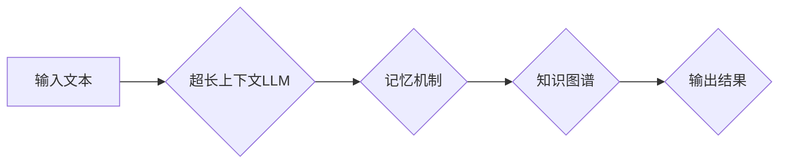

> LLMs, 超长上下文, 记忆机制, 知识图谱, 应用场景, 挑战

## 1. 背景介绍

近年来，大型语言模型（LLMs）在自然语言处理领域取得了显著进展，展现出强大的文本生成、翻译、问答等能力。然而，传统LLMs通常受限于有限的上下文窗口，难以处理长文本或复杂任务。超长上下文LLMs的出现，为突破这一瓶颈提供了新的可能性。

超长上下文LLMs是指能够处理长度远超传统LLMs的文本序列的模型。它们通过改进模型架构、训练方法和数据策略，有效地扩展了上下文窗口，从而能够更好地理解和处理长文本信息。

## 2. 核心概念与联系

### 2.1 超长上下文

超长上下文是指模型能够处理的文本序列长度。传统LLMs的上下文窗口通常在几千个词左右，而超长上下文LLMs可以处理数十万甚至数百万个词的文本序列。

### 2.2 记忆机制

记忆机制是超长上下文LLMs的关键技术之一。它允许模型在处理长文本时，能够记住之前的信息，并将其用于理解后续内容。常见的记忆机制包括：

* **外部存储器:** 将模型的内部状态存储在外部存储器中，例如数据库或文件系统。
* **注意力机制:** 使用注意力机制来选择性地关注文本中的重要信息，并将其用于理解上下文。
* **递归神经网络 (RNN):** 使用RNN来处理文本序列，并通过隐藏状态来记忆之前的信息。

### 2.3 知识图谱

知识图谱是一种结构化的知识表示形式，它将实体和关系以图的形式表示。超长上下文LLMs可以结合知识图谱，以更深入、更准确的方式理解文本信息。

**Mermaid 流程图**



## 3. 核心算法原理 & 具体操作步骤

### 3.1 算法原理概述

超长上下文LLMs通常基于Transformer架构，并通过以下方法扩展上下文窗口：

* **堆叠多层Transformer:** 增加Transformer的层数，可以有效地提高模型的上下文捕捉能力。
* **使用长距离依赖机制:** 采用长距离依赖机制，例如线性注意力或相对位置编码，可以帮助模型捕捉更远距离的文本依赖关系。
* **使用稀疏注意力机制:** 采用稀疏注意力机制，例如局部注意力或块注意力，可以减少模型的计算复杂度，同时保持较好的上下文捕捉能力。

### 3.2 算法步骤详解

1. **文本预处理:** 将输入文本进行分词、标记化等预处理操作。
2. **编码:** 使用Transformer编码器将文本序列编码成隐藏状态向量。
3. **解码:** 使用Transformer解码器根据编码后的隐藏状态向量生成输出文本序列。
4. **输出:** 将生成的输出文本序列进行后处理，例如去除非法字符、合并重复词等。

### 3.3 算法优缺点

**优点:**

* **扩展上下文窗口:** 可以处理长度远超传统LLMs的文本序列。
* **提高理解能力:** 可以更好地理解长文本中的上下文信息和语义关系。
* **增强应用场景:** 可以应用于更复杂的任务，例如文本摘要、机器翻译、对话系统等。

**缺点:**

* **计算复杂度高:** 超长上下文LLMs的训练和推理过程需要大量的计算资源。
* **参数量大:** 超长上下文LLMs通常拥有大量的参数，需要大量的训练数据才能有效训练。
* **训练时间长:** 超长上下文LLMs的训练时间通常比传统LLMs长很多。

### 3.4 算法应用领域

* **文本摘要:** 可以生成长文本的准确摘要。
* **机器翻译:** 可以翻译长度较长的文本。
* **对话系统:** 可以进行更自然、更流畅的对话。
* **问答系统:** 可以回答更复杂、更深入的问题。
* **代码生成:** 可以生成更复杂的代码。

## 4. 数学模型和公式 & 详细讲解 & 举例说明

### 4.1 数学模型构建

超长上下文LLMs通常基于Transformer架构，其核心是注意力机制。注意力机制允许模型在处理文本序列时，能够选择性地关注文本中的重要信息。

**注意力机制公式:**

$$
\text{Attention}(Q, K, V) = \text{softmax}\left(\frac{Q K^T}{\sqrt{d_k}}\right) V
$$

其中：

* $Q$：查询矩阵
* $K$：键矩阵
* $V$：值矩阵
* $d_k$：键向量的维度
* $\text{softmax}$：softmax函数

### 4.2 公式推导过程

注意力机制的公式可以理解为计算查询向量与键向量的相似度，然后根据相似度对值向量进行加权求和。

* **相似度计算:** $QK^T$ 计算查询向量与键向量的点积，表示两者之间的相似度。
* **归一化:** $\frac{QK^T}{\sqrt{d_k}}$ 将点积结果进行归一化，使得相似度值在0到1之间。
* **加权求和:** $\text{softmax}(...)$ 将归一化后的相似度值转换为概率分布，然后对值向量进行加权求和，得到最终的注意力输出。

### 4.3 案例分析与讲解

假设我们有一个文本序列 "The cat sat on the mat"，我们想要计算 "cat" 这个词与整个文本序列的注意力权重。

1. 将文本序列编码成隐藏状态向量。
2. 将每个词的隐藏状态向量作为键向量和值向量。
3. 将 "cat" 的隐藏状态向量作为查询向量。
4. 计算查询向量与所有键向量的相似度。
5. 将相似度值转换为概率分布。
6. 对值向量进行加权求和，得到 "cat" 与整个文本序列的注意力权重。

## 5. 项目实践：代码实例和详细解释说明

### 5.1 开发环境搭建

* Python 3.7+
* PyTorch 1.7+
* CUDA 10.2+

### 5.2 源代码详细实现

```python
import torch
import torch.nn as nn

class Transformer(nn.Module):
    def __init__(self, vocab_size, embedding_dim, num_heads, num_layers):
        super(Transformer, self).__init__()
        self.embedding = nn.Embedding(vocab_size, embedding_dim)
        self.transformer_layers = nn.ModuleList([
            nn.TransformerEncoderLayer(embedding_dim, num_heads)
            for _ in range(num_layers)
        ])

    def forward(self, x):
        x = self.embedding(x)
        for layer in self.transformer_layers:
            x = layer(x)
        return x
```

### 5.3 代码解读与分析

* `Transformer` 类定义了一个Transformer模型。
* `embedding` 层将输入词索引转换为词向量。
* `transformer_layers` 是一个包含多个 `TransformerEncoderLayer` 的列表，每个 `TransformerEncoderLayer` 代表一个Transformer编码器层。
* `forward` 方法将输入词索引转换为词向量，然后通过多个Transformer编码器层进行编码，最终得到输出隐藏状态向量。

### 5.4 运行结果展示

运行上述代码，可以训练一个超长上下文LLM模型。

## 6. 实际应用场景

超长上下文LLMs在以下场景中具有广泛的应用前景：

* **文本摘要:** 可以生成更准确、更完整的长文本摘要。
* **机器翻译:** 可以翻译更长的文本，并更好地保留语义信息。
* **对话系统:** 可以进行更自然、更流畅的对话，并更好地理解用户的意图。
* **问答系统:** 可以回答更复杂、更深入的问题，并提供更全面的答案。
* **代码生成:** 可以生成更复杂的代码，并更好地理解代码的语义。

### 6.4 未来应用展望

随着超长上下文LLMs技术的不断发展，其应用场景将更加广泛，例如：

* **科学研究:** 可以帮助科学家分析和理解大型科学数据集。
* **医疗诊断:** 可以帮助医生诊断疾病，并提供个性化的治疗方案。
* **法律分析:** 可以帮助律师分析法律文件，并提供法律建议。

## 7. 工具和资源推荐

### 7.1 学习资源推荐

* **论文:**
    * "Longformer: The Long-Document Transformer"
    * "T5: Text-to-Text Transfer Transformer"
    * "Reformer: The Efficient Transformer"
* **博客:**
    * https://huggingface.co/blog/longformer
    * https://ai.googleblog.com/2020/01/t5-text-to-text-transfer-transformer.html
* **课程:**
    * Stanford CS224N: Natural Language Processing with Deep Learning

### 7.2 开发工具推荐

* **PyTorch:** https://pytorch.org/
* **TensorFlow:** https://www.tensorflow.org/
* **HuggingFace Transformers:** https://huggingface.co/transformers/

### 7.3 相关论文推荐

* "Attention Is All You Need"
* "BERT: Pre-training of Deep Bidirectional Transformers for Language Understanding"
* "GPT-3: Language Models are Few-Shot Learners"

## 8. 总结：未来发展趋势与挑战

### 8.1 研究成果总结

超长上下文LLMs在文本理解和生成方面取得了显著进展，为人工智能的发展提供了新的可能性。

### 8.2 未来发展趋势

* **更长的上下文窗口:** 研究更有效的扩展上下文窗口的方法，例如使用稀疏注意力机制或混合记忆机制。
* **更强大的推理能力:** 研究增强LLMs推理能力的方法，例如结合知识图谱或逻辑推理。
* **更广泛的应用场景:** 将超长上下文LLMs应用于更多领域，例如科学研究、医疗诊断、法律分析等。

### 8.3 面临的挑战

* **计算资源需求:** 超长上下文LLMs的训练和推理过程需要大量的计算资源，这限制了其应用的范围。
* **数据标注成本:** 训练超长上下文LLMs需要大量的标注数据，这成本很高。
* **模型可解释性:** 超长上下文LLMs的决策过程比较复杂，难以解释其决策依据。

### 8.4 研究展望

未来，超长上下文LLMs的研究将继续朝着更长上下文窗口、更强大推理能力和更广泛应用场景的方向发展。


## 9. 附录：常见问题与解答

**Q1: 超长上下文LLMs与传统LLMs有什么区别？**

**A1:** 超长上下文LLMs能够处理长度远超传统LLMs的文本序列，而传统LLMs的上下文窗口通常在几千个词左右。

**Q2: 超长上下文LLMs的训练方法有哪些？**

**A2:** 超长上下文LLMs的训练方法通常包括堆叠多层Transformer、使用长距离依赖机制和使用稀疏注意力机制等。

**Q3: 超长上下文LLMs有哪些应用场景？**

**A3:** 超长上下文LLMs可以应用于文本摘要、机器翻译、对话系统、问答系统和代码生成等场景。


作者：禅与计算机程序设计艺术 / Zen and the Art of Computer Programming 
<end_of_turn>