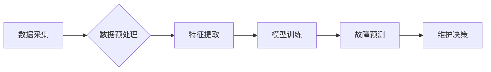

> Predictive Maintenance, 机器学习, 时间序列分析, 故障预测, 异常检测, 数据挖掘, Python, TensorFlow

## 1. 背景介绍

随着工业互联网和物联网技术的快速发展，设备的连接性和数据采集能力不断增强。然而，设备故障仍然是企业面临的重大挑战，会导致生产停滞、经济损失和安全隐患。传统的维护模式主要依靠定期检查和维修，存在着维护成本高、效率低、无法提前预警故障等问题。

预测性维护（Predictive Maintenance）作为一种基于数据分析和机器学习的先进维护模式，能够通过分析设备运行数据，预测设备故障的发生时间和类型，从而实现提前预防和维护，有效降低维护成本，提高设备利用率和生产效率。

## 2. 核心概念与联系

预测性维护的核心是利用数据分析和机器学习技术，从设备运行数据中挖掘潜在的故障模式和趋势，从而预测设备故障的发生时间和类型。

**预测性维护的流程:**



**核心概念:**

* **数据采集:** 从设备传感器收集运行数据，例如温度、压力、振动等。
* **数据预处理:** 对采集到的数据进行清洗、转换、归一化等处理，以提高数据质量和模型训练效果。
* **特征提取:** 从原始数据中提取具有预测意义的特征，例如时间序列特征、统计特征、频谱特征等。
* **模型训练:** 利用机器学习算法，对提取的特征进行训练，建立故障预测模型。
* **故障预测:** 将新采集到的数据输入到训练好的模型中，预测设备故障的发生时间和类型。
* **维护决策:** 根据预测结果，制定相应的维护策略，例如提前更换部件、调整运行参数等。

## 3. 核心算法原理 & 具体操作步骤

### 3.1  算法原理概述

预测性维护中常用的算法包括：

* **时间序列分析:** 利用历史数据分析设备运行趋势，预测未来故障发生时间。
* **异常检测:** 识别设备运行数据中的异常值，判断设备是否出现故障。
* **机器学习:** 利用机器学习算法，从设备运行数据中学习故障模式，预测故障发生时间和类型。

### 3.2  算法步骤详解

**时间序列分析:**

1. **数据采集:** 收集设备运行数据，例如温度、压力、振动等。
2. **数据预处理:** 对数据进行清洗、转换、归一化等处理。
3. **特征提取:** 从时间序列数据中提取特征，例如均值、标准差、自相关系数等。
4. **模型训练:** 利用ARIMA、SARIMA等时间序列模型对特征进行训练。
5. **故障预测:** 将新采集到的数据输入到训练好的模型中，预测未来故障发生时间。

**异常检测:**

1. **数据采集:** 收集设备运行数据。
2. **数据预处理:** 对数据进行清洗、转换、归一化等处理。
3. **模型训练:** 利用K-Means、Isolation Forest等异常检测算法对数据进行训练。
4. **异常识别:** 将新采集到的数据输入到训练好的模型中，识别异常值。
5. **故障判断:** 根据异常值判断设备是否出现故障。

**机器学习:**

1. **数据采集:** 收集设备运行数据，包括正常运行数据和故障数据。
2. **数据预处理:** 对数据进行清洗、转换、归一化等处理。
3. **特征提取:** 从数据中提取具有预测意义的特征。
4. **模型训练:** 利用SVM、决策树、神经网络等机器学习算法对数据进行训练。
5. **故障预测:** 将新采集到的数据输入到训练好的模型中，预测设备故障的发生时间和类型。

### 3.3  算法优缺点

| 算法 | 优点 | 缺点 |
|---|---|---|
| 时间序列分析 | 适用于预测周期性故障 | 对非周期性故障预测效果较差 |
| 异常检测 | 能够识别突发性故障 | 对轻微故障的识别效果较差 |
| 机器学习 | 能够学习复杂故障模式 | 需要大量训练数据 |

### 3.4  算法应用领域

预测性维护算法广泛应用于各个行业，例如：

* **制造业:** 预防设备故障，提高生产效率。
* **能源行业:** 优化设备运行，降低能源消耗。
* **交通运输业:** 预防车辆故障，保障安全运输。
* **医疗保健业:** 预防医疗设备故障，保障患者安全。

## 4. 数学模型和公式 & 详细讲解 & 举例说明

### 4.1  数学模型构建

预测性维护中常用的数学模型包括：

* **线性回归模型:** 用于预测连续性变量，例如设备运行温度。
* **逻辑回归模型:** 用于预测分类变量，例如设备故障类型。
* **支持向量机模型:** 用于分类和回归问题，能够处理高维数据。
* **神经网络模型:** 用于学习复杂非线性关系，能够处理大规模数据。

### 4.2  公式推导过程

**线性回归模型:**

目标是找到一条直线，使得预测值与实际值之间的误差最小。

$$
y = \beta_0 + \beta_1 x + \epsilon
$$

其中：

* $y$ 是预测值
* $x$ 是输入特征
* $\beta_0$ 是截距
* $\beta_1$ 是斜率
* $\epsilon$ 是误差项

**损失函数:**

$$
Loss = \frac{1}{n} \sum_{i=1}^{n} (y_i - \hat{y}_i)^2
$$

其中：

* $n$ 是样本数量
* $y_i$ 是实际值
* $\hat{y}_i$ 是预测值

**梯度下降算法:**

用于最小化损失函数，更新模型参数。

$$
\beta_1 = \beta_1 - \alpha \frac{\partial Loss}{\partial \beta_1}
$$

$$
\beta_0 = \beta_0 - \alpha \frac{\partial Loss}{\partial \beta_0}
$$

其中：

* $\alpha$ 是学习率

### 4.3  案例分析与讲解

**案例:**

预测风力发电机组的故障发生时间。

**数据:**

* 风速
* 温度
* 湿度
* 转速
* 振动

**模型:**

* 时间序列分析模型

**结果:**

模型能够预测风力发电机组的故障发生时间，并给出故障的类型和严重程度。

## 5. 项目实践：代码实例和详细解释说明

### 5.1  开发环境搭建

* Python 3.x
* TensorFlow 2.x
* Pandas
* NumPy
* Matplotlib

### 5.2  源代码详细实现

```python
import pandas as pd
from sklearn.model_selection import train_test_split
from tensorflow.keras.models import Sequential
from tensorflow.keras.layers import Dense

# 数据加载
data = pd.read_csv('sensor_data.csv')

# 数据预处理
# ...

# 特征提取
# ...

# 数据分割
X_train, X_test, y_train, y_test = train_test_split(X, y, test_size=0.2)

# 模型构建
model = Sequential()
model.add(Dense(64, activation='relu', input_shape=(X_train.shape[1],)))
model.add(Dense(32, activation='relu'))
model.add(Dense(1, activation='sigmoid'))

# 模型编译
model.compile(loss='binary_crossentropy', optimizer='adam', metrics=['accuracy'])

# 模型训练
model.fit(X_train, y_train, epochs=100, batch_size=32)

# 模型评估
loss, accuracy = model.evaluate(X_test, y_test)
print('Loss:', loss)
print('Accuracy:', accuracy)
```

### 5.3  代码解读与分析

* 数据加载：使用Pandas库加载传感器数据。
* 数据预处理：对数据进行清洗、转换、归一化等处理。
* 特征提取：从数据中提取具有预测意义的特征。
* 数据分割：将数据分为训练集和测试集。
* 模型构建：使用TensorFlow库构建一个多层感知机模型。
* 模型编译：设置模型的损失函数、优化器和评价指标。
* 模型训练：使用训练集训练模型。
* 模型评估：使用测试集评估模型的性能。

### 5.4  运行结果展示

运行代码后，会输出模型的损失值和准确率。

## 6. 实际应用场景

### 6.1  风力发电机组维护

预测风力发电机组的故障发生时间，提前更换部件，避免停机损失。

### 6.2  工业机器人维护

预测工业机器人的故障发生时间，及时进行维护，提高生产效率。

### 6.3  航空航天设备维护

预测航空航天设备的故障发生时间，确保飞行安全。

### 6.4  未来应用展望

预测性维护技术将应用于更多领域，例如：

* 智能家居
* 自动驾驶汽车
* 医疗设备

## 7. 工具和资源推荐

### 7.1  学习资源推荐

* **书籍:**
    * "Predictive Maintenance: A Practical Guide" by Michael J. Pecht
    * "Machine Learning for Predictive Maintenance" by David J. C. MacKay
* **在线课程:**
    * Coursera: "Predictive Maintenance with Machine Learning"
    * edX: "Machine Learning for Predictive Maintenance"

### 7.2  开发工具推荐

* **Python:** 
    * TensorFlow
    * PyTorch
    * Scikit-learn
* **数据可视化工具:**
    * Matplotlib
    * Seaborn

### 7.3  相关论文推荐

* "A Survey on Predictive Maintenance Using Machine Learning"
* "Predictive Maintenance Using Deep Learning: A Review"

## 8. 总结：未来发展趋势与挑战

### 8.1  研究成果总结

预测性维护技术取得了显著进展，能够有效降低维护成本，提高设备利用率和生产效率。

### 8.2  未来发展趋势

* **更精准的预测:** 利用更先进的机器学习算法和数据分析技术，提高预测精度。
* **更全面的数据融合:** 将来自不同传感器和数据源的数据融合在一起，获得更全面的设备状态信息。
* **更智能的维护决策:** 利用人工智能技术，自动制定最优的维护策略。

### 8.3  面临的挑战

* **数据质量问题:** 预测性维护依赖于高质量的数据，而实际应用中数据往往存在噪声、缺失和不一致等问题。
* **模型复杂度问题:** 预测性维护模型往往非常复杂，难以理解和解释。
* **安全性和隐私问题:** 预测性维护涉及到大量敏感数据，需要保障数据的安全性和隐私。

### 8.4  研究展望

未来研究将重点关注以下几个方面:

* **数据质量提升:** 开发更有效的算法和方法，提高数据质量。
* **模型解释性增强:** 研究更易于理解和解释的模型，提高模型的可信度。
* **安全性和隐私保护:** 研究更有效的安全性和隐私保护机制，保障数据安全。

## 9. 附录：常见问题与解答

**常见问题:**

* 预测性维护的成本效益如何？
* 预测性维护的适用范围有哪些？
* 预测性维护的技术难点有哪些？

**解答:**

* 预测性维护的成本效益取决于具体的应用场景，但一般来说，预测性维护能够有效降低维护成本，提高设备利用率和生产效率。
* 预测性维护适用于各种类型的设备，例如制造设备、能源设备、交通