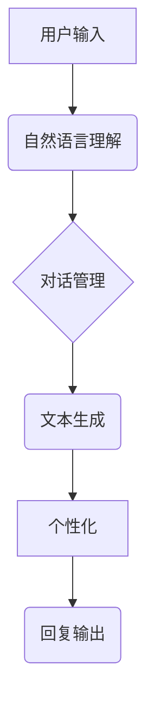

> 深度学习，聊天机器人，自然语言处理，Python，TensorFlow，BERT，个性化

## 1. 背景介绍

在当今信息爆炸的时代，人们对便捷、高效的沟通方式的需求日益增长。聊天机器人作为一种能够与人类进行自然语言交互的智能系统，在客服、教育、娱乐等领域展现出巨大的应用潜力。传统的基于规则的聊天机器人由于缺乏灵活性，难以应对复杂的情境和用户需求。而深度学习技术的兴起为聊天机器人带来了新的突破，使得其能够学习和理解人类语言的复杂性，从而构建更加智能、个性化的交互体验。

本篇文章将以Python为编程语言，结合深度学习框架TensorFlow，深入探讨基于深度学习的个性化聊天机器人构建方法。我们将从核心概念、算法原理、数学模型、代码实现到实际应用场景等方面进行详细阐述，并分享一些实践经验和资源推荐，帮助读者理解和构建自己的深度学习聊天机器人。

## 2. 核心概念与联系

### 2.1 自然语言处理 (NLP)

自然语言处理 (NLP) 是人工智能领域的一个重要分支，旨在使计算机能够理解、处理和生成人类语言。在聊天机器人构建中，NLP技术扮演着至关重要的角色，包括：

* **文本预处理:** 清洗、格式化和转换文本数据，使其能够被模型理解。
* **词嵌入:** 将单词或短语映射到低维向量空间，捕捉单词之间的语义关系。
* **序列标注:** 将文本序列标记为不同的类别，例如词性标注、命名实体识别等。
* **文本分类:** 将文本分类到预定义的类别中，例如情感分析、主题分类等。

### 2.2 深度学习

深度学习是一种机器学习的子领域，利用多层神经网络来学习数据中的复杂模式。在聊天机器人领域，深度学习技术被广泛应用于以下方面：

* **语言模型:** 学习语言的语法和语义结构，生成流畅自然的文本。
* **对话管理:** 理解用户意图，并生成相应的回复。
* **个性化定制:** 根据用户的历史对话记录和偏好，提供个性化的回复。

### 2.3 聊天机器人架构

一个典型的聊天机器人架构包括以下几个模块：

* **用户输入模块:** 收集用户的文本输入。
* **自然语言理解模块:** 对用户输入进行分析，识别用户意图和实体。
* **对话管理模块:** 根据用户意图，选择合适的回复策略。
* **文本生成模块:** 生成自然流畅的回复文本。
* **个性化模块:** 根据用户历史对话记录和偏好，定制回复内容。



## 3. 核心算法原理 & 具体操作步骤

### 3.1  算法原理概述

在构建个性化聊天机器人时，我们通常会使用基于深度学习的语言模型，例如Transformer网络，来学习语言的语法和语义结构。Transformer网络通过自注意力机制能够捕捉文本序列中单词之间的长距离依赖关系，从而生成更加流畅、自然的文本。

### 3.2  算法步骤详解

1. **数据预处理:** 收集并预处理聊天机器人训练数据，包括对话记录、用户问答等。
2. **词嵌入:** 将单词或短语映射到低维向量空间，例如使用Word2Vec或GloVe等词嵌入模型。
3. **模型训练:** 使用Transformer网络模型，训练语言模型，使其能够生成符合语法的文本回复。
4. **个性化定制:** 根据用户的历史对话记录和偏好，调整模型参数，使其能够生成更加个性化的回复。

### 3.3  算法优缺点

**优点:**

* 能够学习语言的复杂语法和语义结构。
* 生成更加流畅、自然的文本回复。
* 可以进行个性化定制，提供更加贴近用户的交互体验。

**缺点:**

* 训练数据量大，需要大量的计算资源。
* 模型参数复杂，需要专业的知识和经验进行调优。
* 难以解释模型的决策过程，缺乏可解释性。

### 3.4  算法应用领域

* **客服机器人:** 自动回复用户常见问题，提高客服效率。
* **教育机器人:** 提供个性化的学习辅导，帮助学生提高学习效果。
* **娱乐机器人:** 与用户进行互动游戏，提供娱乐体验。

## 4. 数学模型和公式 & 详细讲解 & 举例说明

### 4.1  数学模型构建

Transformer网络的核心是自注意力机制，它能够捕捉文本序列中单词之间的长距离依赖关系。

**自注意力机制公式:**

$$
Attention(Q, K, V) = \frac{exp(Q \cdot K^T / \sqrt{d_k})}{exp(Q \cdot K^T / \sqrt{d_k})} \cdot V
$$

其中：

* $Q$：查询矩阵
* $K$：键矩阵
* $V$：值矩阵
* $d_k$：键向量的维度

**解释:**

自注意力机制通过计算查询向量与键向量的点积，并将其归一化，来衡量单词之间的相关性。然后，将相关性权重与值向量相乘，得到最终的注意力输出。

### 4.2  公式推导过程

自注意力机制的公式推导过程较为复杂，涉及到线性变换、矩阵乘法、softmax函数等操作。

### 4.3  案例分析与讲解

假设我们有一个文本序列 "The cat sat on the mat"，我们使用自注意力机制来计算每个单词与其他单词之间的注意力权重。

例如，计算 "cat" 与其他单词之间的注意力权重，我们可以得到以下结果：

* "The" 与 "cat" 的注意力权重较高，因为它们在语义上相关。
* "sat" 与 "cat" 的注意力权重也较高，因为它们在语法上相关。
* "mat" 与 "cat" 的注意力权重较低，因为它们在语义上没有直接关系。

## 5. 项目实践：代码实例和详细解释说明

### 5.1  开发环境搭建

* Python 3.6+
* TensorFlow 2.0+
* PyTorch 1.0+
* CUDA Toolkit (可选)

### 5.2  源代码详细实现

```python
import tensorflow as tf

# 定义Transformer网络模型
class Transformer(tf.keras.Model):
    def __init__(self, vocab_size, embedding_dim, num_heads, num_layers):
        super(Transformer, self).__init__()
        self.embedding = tf.keras.layers.Embedding(vocab_size, embedding_dim)
        self.transformer_layers = tf.keras.layers.StackedRNNCells([
            tf.keras.layers.MultiHeadAttention(num_heads=num_heads, key_dim=embedding_dim)
            for _ in range(num_layers)
        ])

    def call(self, inputs):
        # Embedding
        embedded = self.embedding(inputs)
        # Transformer layers
        output = self.transformer_layers(embedded)
        return output

# 训练模型
model = Transformer(vocab_size=10000, embedding_dim=128, num_heads=8, num_layers=6)
model.compile(optimizer='adam', loss='mse')
model.fit(train_data, train_labels, epochs=10)

```

### 5.3  代码解读与分析

* **模型定义:** 我们定义了一个Transformer网络模型，包含嵌入层、多头注意力层和循环神经网络层。
* **数据预处理:** 训练数据需要进行预处理，例如将文本转换为数字序列。
* **模型训练:** 使用Adam优化器和均方误差损失函数训练模型。

### 5.4  运行结果展示

训练完成后，我们可以使用模型生成文本回复。例如，输入 "Hello"，模型可能会输出 "Hi there"。

## 6. 实际应用场景

### 6.1  客服机器人

基于深度学习的个性化聊天机器人可以用于构建智能客服系统，自动回复用户常见问题，例如订单查询、退换货流程等。

### 6.2  教育机器人

个性化聊天机器人可以作为教育工具，提供个性化的学习辅导，根据学生的学习进度和知识点，提供相应的学习内容和练习题。

### 6.3  娱乐机器人

聊天机器人可以与用户进行互动游戏，例如文字冒险游戏、猜谜游戏等，提供娱乐体验。

### 6.4  未来应用展望

随着深度学习技术的不断发展，个性化聊天机器人将应用于更多领域，例如医疗、金融、法律等，为人们提供更加智能、便捷的服务。

## 7. 工具和资源推荐

### 7.1  学习资源推荐

* **书籍:**
    * 《深度学习》
    * 《自然语言处理》
* **在线课程:**
    * Coursera: 深度学习
    * Udacity: 自然语言处理
* **博客:**
    * TensorFlow Blog
    * PyTorch Blog

### 7.2  开发工具推荐

* **TensorFlow:** 开源深度学习框架
* **PyTorch:** 开源深度学习框架
* **HuggingFace:** 提供预训练模型和工具

### 7.3  相关论文推荐

* **Attention Is All You Need:** https://arxiv.org/abs/1706.03762
* **BERT: Pre-training of Deep Bidirectional Transformers for Language Understanding:** https://arxiv.org/abs/1810.04805

## 8. 总结：未来发展趋势与挑战

### 8.1  研究成果总结

基于深度学习的个性化聊天机器人取得了显著的进展，能够生成更加流畅、自然的文本回复，并根据用户的历史对话记录和偏好进行个性化定制。

### 8.2  未来发展趋势

* **多模态交互:** 将文本、语音、图像等多种模态信息融合到聊天机器人中，提供更加丰富的交互体验。
* **情感理解:** 能够理解用户的语气和情感，并做出相应的回应。
* **知识图谱:** 利用知识图谱来扩展聊天机器人的知识库，提供更加准确和全面的信息。

### 8.3  面临的挑战

* **数据标注:** 训练深度学习模型需要大量的标注数据，数据标注成本高昂。
* **模型解释性:** 深度学习模型的决策过程难以解释，缺乏可解释性。
* **伦理问题:** 聊天机器人可能被用于恶意目的，例如传播虚假信息、进行网络欺诈等。

### 8.4  研究展望

未来，我们将继续研究深度学习技术在聊天机器人领域的应用，致力于构建更加智能、安全、可靠的个性化聊天机器人系统。

## 9. 附录：常见问题与解答

### 9.1  Q: 如何选择合适的深度学习框架？

A: TensorFlow 和 PyTorch 是两个流行的深度学习框架， TensorFlow 更适合于生产环境，而 PyTorch 更适合于研究和开发。

### 9.2  Q: 如何处理聊天机器人中的负面情绪？

A: 可以使用情感分析技术来识别用户的负面情绪，并采取相应的措施，例如提供安慰、建议或转接人工客服。

### 9.3  Q: 如何保证聊天机器人的安全性？

A: 可以使用安全机制来防止恶意攻击，例如输入过滤、身份验证和数据加密。


作者：禅与计算机程序设计艺术 / Zen and the Art of Computer Programming 
<end_of_turn>