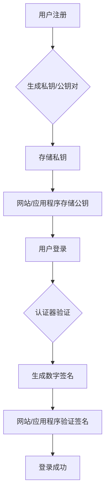

> WebAuthn，密码管理，身份验证，FIDO，生物识别，安全

## 1. 背景介绍

在当今数字时代，密码已成为我们在线身份验证的基石。然而，传统的密码体系也面临着诸多挑战：

* **易被破解：** 密码泄露、暴力破解、钓鱼攻击等威胁日益猖獗，用户密码安全面临巨大风险。
* **用户体验差：** 复杂的密码规则、频繁的密码重置、多账户密码管理等问题，给用户带来极大的不便。
* **缺乏可信度：** 密码的真实性难以验证，容易被伪造或盗用。

为了解决这些问题，Web Authentication（WebAuthn）标准应运而生。WebAuthn 是一种基于 FIDO（Fast IDentity Online）协议的开放标准，旨在提供一种更安全、更便捷的在线身份验证方式。

## 2. 核心概念与联系

WebAuthn 核心概念包括：

* **公共密钥加密：** 用户拥有私钥和公钥对，私钥用于数字签名，公钥用于验证签名。
* **认证器：** 认证器是用于存储和生成用户私钥的硬件设备，例如手机、安全钥匙等。
* **注册流程：** 用户在网站或应用程序上注册时，会与认证器进行交互，生成用户私钥和公钥对，并将其存储在认证器中。
* **验证流程：** 用户在登录时，会使用认证器进行身份验证，例如指纹识别、面部识别等生物特征验证，并生成数字签名。网站或应用程序会使用用户的公钥验证签名，确认用户身份。

**Mermaid 流程图：**



## 3. 核心算法原理 & 具体操作步骤

### 3.1  算法原理概述

WebAuthn 采用基于椭圆曲线密码学的算法，例如 ECDSA（椭圆曲线数字签名算法）来实现身份验证。ECDSA 是一种高效的数字签名算法，能够在保证安全性前提下，实现较小的签名大小和计算开销。

### 3.2  算法步骤详解

1. **密钥生成：** 用户在注册时，使用随机数生成一对私钥和公钥。私钥保存在认证器中，公钥则被网站或应用程序存储。
2. **注册流程：** 用户在网站或应用程序上注册时，会使用认证器生成一个注册请求，包含用户的公钥和随机数。网站或应用程序会验证用户的公钥，并生成一个挑战值。
3. **签名生成：** 用户使用认证器中的私钥对挑战值进行签名，生成一个数字签名。
4. **验证流程：** 用户在登录时，会使用认证器进行身份验证，例如指纹识别、面部识别等生物特征验证。认证器会根据用户的身份验证结果，生成一个新的数字签名。
5. **签名验证：** 网站或应用程序会使用用户的公钥验证数字签名，确认用户身份。

### 3.3  算法优缺点

**优点：**

* **安全性高：** 基于椭圆曲线密码学的算法，能够抵抗常见的密码攻击。
* **用户体验好：** 不需要记忆复杂的密码，使用生物特征验证更加便捷。
* **可信度高：** 认证器存储私钥，防止私钥泄露。

**缺点：**

* **成本较高：** 认证器需要额外成本。
* **兼容性问题：** 部分老旧设备可能不支持 WebAuthn。

### 3.4  算法应用领域

WebAuthn 广泛应用于各种在线身份验证场景，例如：

* **网站登录：** 用户可以使用 WebAuthn 替代密码登录网站。
* **应用程序登录：** 用户可以使用 WebAuthn 登录移动应用程序。
* **支付平台：** 用户可以使用 WebAuthn 进行安全支付。
* **云服务：** 用户可以使用 WebAuthn 访问云服务。

## 4. 数学模型和公式 & 详细讲解 & 举例说明

### 4.1  数学模型构建

WebAuthn 采用椭圆曲线密码学，其核心数学模型是椭圆曲线加法群。椭圆曲线加法群是一个满足特定数学性质的集合，其元素是椭圆曲线上的点。

### 4.2  公式推导过程

ECDSA 算法的核心公式包括：

* **私钥生成：**  $d \in Z_q$，其中 $d$ 是私钥，$Z_q$ 是模 $q$ 的整数环。
* **公钥生成：** $Q = [d]G$，其中 $G$ 是椭圆曲线上的生成点，$Q$ 是公钥。
* **签名生成：** $r = g(kG) \mod q$，$s = k^{-1}(H(M) + dr) \mod q$，其中 $k$ 是随机数，$H(M)$ 是消息 $M$ 的哈希值。
* **签名验证：** $v = H(M) + dr \mod q$，$u_1 = H(M) \mod q$，$u_2 = r \mod q$，$w = u_1G + u_2Q$，$v' = g(w) \mod q$，如果 $v = v'$，则签名有效。

### 4.3  案例分析与讲解

假设用户 Alice 想要使用 WebAuthn 访问网站 Bob。

1. Alice 在注册时，使用认证器生成私钥 $d$ 和公钥 $Q$。
2. Alice 在登录时，使用认证器进行身份验证，并生成随机数 $k$。
3. Alice 使用私钥 $d$ 和随机数 $k$ 生成签名 $(r, s)$。
4. Alice 将签名 $(r, s)$ 发送给网站 Bob。
5. 网站 Bob 使用 Alice 的公钥 $Q$ 和消息 $M$ 的哈希值 $H(M)$ 验证签名 $(r, s)$。
6. 如果签名验证成功，则 Alice 的身份被确认，可以访问网站 Bob。

## 5. 项目实践：代码实例和详细解释说明

### 5.1  开发环境搭建

* 操作系统：Windows/macOS/Linux
* 编程语言：JavaScript
* Web 浏览器：Chrome/Firefox/Edge
* WebAuthn 库：webauthn-polyfill

### 5.2  源代码详细实现

```javascript
// 注册流程
async function registerUser() {
  const publicKeyCredential = await navigator.credentials.create({
    publicKey: {
      challenge: challenge, // 网站生成的挑战值
      name: 'My Website', // 网站名称
      displayName: 'My Website', // 网站显示名称
      user: {
        id: 'user123', // 用户 ID
      },
    },
  });
  // 保存用户公钥
  localStorage.setItem('publicKey', publicKeyCredential.publicKey);
}

// 登录流程
async function loginUser() {
  const publicKeyCredential = await navigator.credentials.get({
    publicKey: {
      challenge: challenge, // 网站生成的挑战值
      allowCredentials: [
        {
          id: localStorage.getItem('publicKey'), // 用户公钥 ID
        },
      ],
    },
  });
  // 验证用户签名
  // ...
}
```

### 5.3  代码解读与分析

* `navigator.credentials.create()`：用于注册用户，生成私钥和公钥对。
* `navigator.credentials.get()`：用于登录用户，验证用户的身份。
* `challenge`：网站生成的随机挑战值，用于确保安全性。
* `publicKeyCredential`：包含用户私钥和公钥信息的 Credential 对象。

### 5.4  运行结果展示

当用户成功注册后，可以利用 WebAuthn 轻松登录网站或应用程序，无需输入密码。

## 6. 实际应用场景

WebAuthn 已经广泛应用于各种场景，例如：

* **Google Chrome：** Chrome 浏览器支持 WebAuthn，用户可以使用安全钥匙或手机进行登录。
* **Microsoft Azure Active Directory：** Azure AD 支持 WebAuthn，用户可以使用安全钥匙或手机进行身份验证。
* **FIDO Alliance：** FIDO Alliance 是 WebAuthn 的推动者，致力于推广 WebAuthn 的应用。

### 6.4  未来应用展望

WebAuthn 将在未来发挥更重要的作用，例如：

* **支持更多设备：** WebAuthn 将支持更多类型的设备，例如智能手表、智能眼镜等。
* **增强安全性：** WebAuthn 将支持更强大的安全功能，例如生物识别验证、多因素身份验证等。
* **简化用户体验：** WebAuthn 将进一步简化用户体验，例如支持一次性密码、自动登录等功能。

## 7. 工具和资源推荐

### 7.1  学习资源推荐

* **WebAuthn 规范：** https://www.w3.org/TR/webauthn/
* **FIDO Alliance：** https://fidoalliance.org/
* **WebAuthn 教程：** https://developer.mozilla.org/en-US/docs/Web/API/Web_Authentication_API

### 7.2  开发工具推荐

* **webauthn-polyfill：** https://github.com/webauthn/webauthn-polyfill
* **Yubico Authenticator：** https://www.yubico.com/products/yubikey/

### 7.3  相关论文推荐

* **Web Authentication：** https://www.w3.org/TR/webauthn/
* **FIDO2：** https://fidoalliance.org/specs/fido-v2.1/fido-v2.1-authentication-protocol-spec-v1.0.pdf

## 8. 总结：未来发展趋势与挑战

### 8.1  研究成果总结

WebAuthn 作为一种安全、便捷的在线身份验证方式，已经取得了显著的成果。它为用户提供了更安全的在线体验，并为网站和应用程序提供了更可靠的身份验证机制。

### 8.2  未来发展趋势

WebAuthn 将继续朝着更安全、更便捷的方向发展，例如：

* **支持更多设备和平台：** WebAuthn 将支持更多类型的设备和平台，例如移动设备、物联网设备等。
* **增强安全性：** WebAuthn 将支持更强大的安全功能，例如生物识别验证、多因素身份验证等。
* **简化用户体验：** WebAuthn 将进一步简化用户体验，例如支持一次性密码、自动登录等功能。

### 8.3  面临的挑战

WebAuthn 的普及也面临一些挑战，例如：

* **兼容性问题：** 部分老旧设备可能不支持 WebAuthn。
* **用户认知度：** 用户对 WebAuthn 的认知度仍然较低。
* **生态系统建设：** WebAuthn 的生态系统还需要进一步完善。

### 8.4  研究展望

未来，WebAuthn 将继续成为在线身份验证领域的重要发展方向。研究者将继续致力于解决 WebAuthn 的挑战，并推动 WebAuthn 的普及和应用。

## 9. 附录：常见问题与解答

**Q1：WebAuthn 和密码有什么区别？**

**A1：** 密码依赖用户记忆复杂的密码，容易被破解或遗忘。WebAuthn 则使用硬件设备存储私钥，并通过生物特征验证进行身份验证，安全性更高。

**Q2：WebAuthn 是否支持多因素身份验证？**

**A2：** 是的，WebAuthn 支持多因素身份验证，例如结合短信验证码或邮件验证码进行验证。

**Q3：WebAuthn 是否安全？**

**A3：** WebAuthn 基于椭圆曲线密码学，安全性很高。它能够抵抗常见的密码攻击，并提供更强的身份验证机制。

**Q4：如何使用 WebAuthn？**

**A4