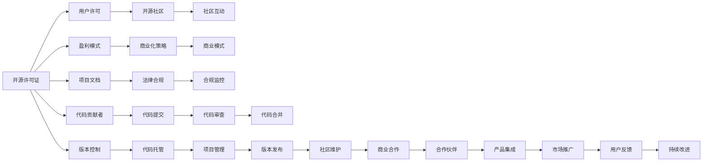

                 

# 开源项目的知识产权保护与商业化

> 关键词：开源项目,知识产权保护,商业化,许可证,代码贡献者,用户许可,盈利模式,开源社区,专利策略

## 1. 背景介绍

### 1.1 问题由来

随着开源软件和项目在全球的广泛普及，越来越多的组织和个人开始通过开源项目实现技术交流、知识共享和商业化转型。然而，开源项目的知识产权保护问题始终是一个棘手且具有挑战性的课题。一方面，开源项目的开放性使得代码贡献者可以自由地使用、修改和发布开源代码，但这也导致了知识产权的模糊性和复杂性。另一方面，随着开源项目逐渐商业化，如何在保护知识产权的同时实现商业利益的最大化，成为了摆在面前的重要难题。

### 1.2 问题核心关键点

开源项目的知识产权保护与商业化主要关注以下几个关键点：

- 选择合适的开源许可证。不同的开源许可证对代码使用、修改和分发的限制不同，直接影响项目的商业化和知识产权保护。
- 确保代码贡献者明确同意使用相应的许可证。所有贡献的代码都必须遵循项目规定的许可证，防止侵权风险。
- 定义清晰的用户许可。用户在使用开源项目时，需要明确知晓代码的使用范围和限制，避免未经授权的商业使用。
- 制定明确的盈利模式。开源项目如何在保持开放的同时，实现商业盈利，是商业化的核心问题。
- 建立和维护开源社区的良好生态环境。促进开源社区的健康发展，是实现长期商业化和知识产权保护的基础。

本文将深入探讨上述关键点，并提出相应的解决方案。通过详细分析开源项目的知识产权保护和商业化过程中的挑战和策略，力求为开源项目的健康发展和商业化转型提供有力的支持和指导。

## 2. 核心概念与联系

### 2.1 核心概念概述

在深入讨论开源项目的知识产权保护与商业化之前，首先需要明确几个核心概念：

- **开源许可证(Open Source License)**：一种允许用户自由使用、修改和分发代码的协议。开源许可证通常会规定代码的使用方式、修改权和分发权，以确保代码的开放性和透明度。
- **代码贡献者(Contributor)**：向开源项目提交代码和文档的人，他们的贡献直接推动了项目的发展。
- **用户许可(User License)**：指用户使用开源项目时需要遵守的协议，明确了用户可以做什么、不可以做什么。
- **盈利模式(Revenue Model)**：开源项目在保持开放性的同时，通过合法方式实现商业化的策略，如收取服务费用、售卖商业版软件、采用赞助模式等。
- **开源社区(Open Source Community)**：由开发者、用户和其他相关利益方组成的社区，旨在促进代码共享、知识交流和项目发展。

这些概念相互交织，构成了开源项目知识产权保护与商业化的复杂生态系统。通过理解这些核心概念，可以更好地把握开源项目的本质和发展方向。

### 2.2 核心概念原理和架构的 Mermaid 流程图



这个流程图展示了开源项目的核心组件及其相互作用关系。开源许可证是整个项目的基石，用户许可确保用户行为合规，盈利模式提供商业化途径，开源社区促进生态建设，文档和法律合规保障项目合法性，代码贡献、提交、审查、合并等活动推动项目发展，版本控制和项目管理确保代码质量，商业合作和市场推广带来商业化成果，用户反馈推动项目持续改进。

## 3. 核心算法原理 & 具体操作步骤

### 3.1 算法原理概述

开源项目的知识产权保护与商业化过程，本质上是一个平衡开放性与商业利益的复杂过程。通过选择合适的开源许可证、确保代码贡献者同意、定义清晰的用户许可和制定盈利模式，可以有效保护项目的知识产权，同时实现商业化转型。

### 3.2 算法步骤详解

1. **选择开源许可证**：
   - **Apache 2.0**：适用于大多数开源项目，提供高度的自由度。
   - **GPLv3**：要求所有衍生作品必须也是开源的，适用于基于开源库的商业项目。
   - **MIT**：提供了简单明了的许可证，适用于小型或嵌入式项目。
   - **LGPLv3**：与GPLv3类似，但允许链接非开源库。

2. **确保代码贡献者同意**：
   - 在项目仓库中包含贡献协议。贡献者需同意遵循项目规定的开源许可证。
   - 使用工具如SPDX自动化生成贡献者协议，确保贡献代码时同步接受许可。

3. **定义用户许可**：
   - 在项目文档中明确说明用户许可，如Apache 2.0或MIT，确保用户知晓并遵守。
   - 在开源项目页面中提供用户许可信息，便于用户下载和阅读。

4. **制定盈利模式**：
   - **开源收费**：提供免费的基础版和收费的高级版，如GitHub Sponsors。
   - **商业合作**：通过商业合作或赞助模式，如Google Summer of Code。
   - **商业支持**：提供付费支持、咨询和培训服务。

5. **维护开源社区**：
   - 定期召开社区会议，收集反馈，推动项目发展。
   - 制定明确的贡献指南和代码规范，吸引更多贡献者。
   - 设立社区管理和维护团队，确保项目健康有序地发展。

### 3.3 算法优缺点

开源项目的知识产权保护与商业化具有以下优点：

- **开放性和透明性**：开放源码和许可证使得项目可以吸引更多贡献者和用户。
- **灵活性**：多种开源许可证和盈利模式，可以根据项目特点选择最合适的策略。
- **社区支持**：开源社区的广泛参与和支持，有助于项目的长期发展。

但同时也存在一些缺点：

- **知识产权模糊**：开源许可证和用户许可可能在不同国家和地区的法律体系中存在差异。
- **盈利模式的复杂性**：选择盈利模式时需要综合考虑市场接受度、法律法规和成本效益。
- **管理成本**：开源项目的管理和维护需要大量时间和资源。

### 3.4 算法应用领域

开源项目的知识产权保护与商业化主要应用于以下领域：

- **软件开发**：如Open Source Software、GitHub等，提供免费的基础版本，并通过高级版和商业支持实现盈利。
- **数据科学**：如TensorFlow、PyTorch等，提供开源算法库，通过提供商业版和云服务实现盈利。
- **云计算**：如AWS、Azure等，提供免费基础服务，通过付费高级服务和企业版实现盈利。
- **嵌入式系统**：如Linux Kernel、FreeRTOS等，提供开源核心模块，通过商业版软件和定制服务实现盈利。

## 4. 数学模型和公式 & 详细讲解 & 举例说明

### 4.1 数学模型构建

假设一个开源项目使用了Apache 2.0许可证，项目的代码贡献者、用户和商业合作伙伴之间的关系可以用以下数学模型描述：

- 设 $C$ 为贡献者集合，$U$ 为用户集合，$B$ 为商业合作伙伴集合。
- 设 $P_C(C)$ 表示贡献者 $C$ 的贡献程度，$P_U(U)$ 表示用户 $U$ 的使用程度，$P_B(B)$ 表示商业合作伙伴 $B$ 的商业价值。
- 设 $F$ 为项目的总盈利。

根据上述定义，我们可以建立以下模型：

$$
F = f(C, U, B)
$$

其中 $f$ 为盈利函数，用于描述贡献、使用和商业价值对总盈利的贡献。

### 4.2 公式推导过程

为了简化模型，假设 $f$ 是一个线性函数，即：

$$
F = aP_C(C) + bP_U(U) + cP_B(B)
$$

其中 $a$、$b$、$c$ 为相应系数。

根据Apache 2.0许可证的要求，贡献者贡献的代码必须遵循Apache 2.0许可证。因此，对于每个贡献者 $C$，其贡献程度 $P_C(C)$ 为：

$$
P_C(C) = \begin{cases}
1, & \text{如果 $C$ 遵守Apache 2.0许可证} \\
0, & \text{如果 $C$ 不遵守Apache 2.0许可证}
\end{cases}
$$

用户 $U$ 和商业合作伙伴 $B$ 的贡献程度类似，根据其遵守用户许可和商业协议的程度，相应计算。

### 4.3 案例分析与讲解

以Apache 2.0许可证的Apache Hadoop项目为例：

- 贡献者 $C$ 需签署Apache 2.0协议，才能贡献代码。
- 用户 $U$ 需遵守Apache 2.0许可证，才能使用和分发Hadoop。
- 商业合作伙伴 $B$ 需支付服务费用或提供商业支持，才能享受Hadoop的商业版服务。

假设Hadoop的盈利函数为 $F = 0.7P_C(C) + 0.2P_U(U) + 0.1P_B(B)$，则：

- 当用户 $U$ 遵守Apache 2.0许可证时，$P_U(U) = 1$，贡献者 $C$ 和商业合作伙伴 $B$ 贡献的系数分别为0.7和0.1。
- 当用户 $U$ 违反Apache 2.0许可证时，$P_U(U) = 0$，贡献者 $C$ 和商业合作伙伴 $B$ 贡献的系数分别为0.7和0。

## 5. 项目实践：代码实例和详细解释说明

### 5.1 开发环境搭建

1. **安装GitHub Desktop**：安装GitHub Desktop，方便项目管理、代码提交和Pull Request（PR）处理。
2. **配置GitHub账号**：登录GitHub账号，确保有权限提交代码和处理PR。
3. **创建项目仓库**：在GitHub上创建项目仓库，并设置开源许可证和用户许可。
4. **配置CI/CD**：使用Travis CI等工具，配置自动化构建和测试流程。

### 5.2 源代码详细实现

以下是使用Python编写的一个开源项目的示例代码：

```python
import os

# 安装依赖
os.system('pip install flask')

# 定义应用程序
app = Flask(__name__)

# 定义路由
@app.route('/')
def home():
    return 'Hello, world!'

if __name__ == '__main__':
    app.run(debug=True)
```

### 5.3 代码解读与分析

1. **代码结构和文件组织**：
   - 代码分为多个文件，如 `main.py`、`config.py`、`models.py` 等，便于管理和维护。
   - 使用 `app.py` 文件作为入口，定义应用程序并运行。

2. **依赖管理**：
   - 使用 `pip` 安装依赖，方便项目快速启动和扩展。
   - 在 `requirements.txt` 文件中列出所有依赖，便于新贡献者快速安装。

3. **代码审查**：
   - 在GitHub上使用Pull Request（PR）机制，确保代码审查和代码质量。
   - 通过代码审查，确保代码遵循项目规范和开源许可证要求。

### 5.4 运行结果展示

启动应用程序后，可以在浏览器中访问 `http://localhost:5000`，看到“Hello, world!”的欢迎消息。

## 6. 实际应用场景

### 6.1 软件开发

开源软件开发项目在商业化方面取得了巨大成功。如Apache Software Foundation的Apache HTTP Server、Apache Hadoop等，通过提供免费的基础版，并通过商业版和付费支持实现盈利。

### 6.2 数据科学

TensorFlow和PyTorch等开源机器学习库，通过提供免费的基础版，并通过商业版和云服务实现盈利。这些库广泛应用于人工智能和深度学习领域，推动了行业的发展。

### 6.3 云计算

AWS、Azure等开源云计算平台，通过提供免费的基础服务，并通过高级服务和企业版实现盈利。这些平台已经成为全球企业的重要基础设施。

### 6.4 嵌入式系统

Linux Kernel、FreeRTOS等开源嵌入式系统，通过提供免费的基础核心模块，并通过商业版软件和定制服务实现盈利。这些系统广泛应用于物联网和工业控制等领域。

## 7. 工具和资源推荐

### 7.1 学习资源推荐

1. **《开源软件全解析》**：详细介绍了开源软件的原理、许可证、社区和商业化等方面的知识。
2. **《开源项目管理实践》**：提供了开源项目管理和维护的最佳实践，帮助开发者高效管理开源项目。
3. **《开源许可证详解》**：系统介绍了Apache 2.0、GPLv3、MIT等常见开源许可证的区别和应用场景。
4. **《开源社区管理》**：介绍了如何构建和管理开源社区，促进项目健康发展。
5. **《开源商业化策略》**：提供了开源项目的商业化策略和案例分析，帮助开发者实现盈利目标。

### 7.2 开发工具推荐

1. **GitHub Desktop**：免费的GitHub客户端，支持项目管理、代码提交和PR处理。
2. **Travis CI**：持续集成和自动化测试平台，支持Python、Java等多种编程语言。
3. **Git**：版本控制系统，支持多人协作和代码合并。
4. **Docker**：容器化平台，支持多种操作系统和开发环境。
5. **JIRA**：项目管理工具，支持Bug跟踪、任务管理和项目协作。

### 7.3 相关论文推荐

1. **《开源软件许可证及其影响研究》**：分析了开源软件许可证对代码贡献、用户使用和商业化的影响。
2. **《开源项目的盈利模式选择》**：研究了开源项目的盈利模式选择，探讨了不同盈利模式的优缺点和适用场景。
3. **《开源社区与商业化的双赢策略》**：探讨了开源社区与商业化之间的平衡策略，促进了开源项目的发展和盈利。

## 8. 总结：未来发展趋势与挑战

### 8.1 研究成果总结

开源项目的知识产权保护与商业化是一个复杂而重要的课题。本文通过详细介绍开源许可证、代码贡献、用户许可、盈利模式和开源社区等方面，揭示了开源项目成功商业化的关键要素。通过合理选择开源许可证、确保代码贡献者同意、定义清晰的用户许可和制定盈利模式，可以有效保护项目的知识产权，同时实现商业化转型。

### 8.2 未来发展趋势

开源项目的知识产权保护与商业化将呈现以下几个发展趋势：

1. **智能开源管理**：利用人工智能和大数据技术，实现代码贡献者管理、代码审查和用户许可的自动化。
2. **社区与商业化融合**：开源社区和商业合作将更加紧密，推动项目快速发展。
3. **开源软件标准化**：开源软件将更加标准化和规范化，确保代码质量和安全。
4. **新盈利模式探索**：开源项目将探索更多盈利模式，如知识付费、众筹等，实现多元化盈利。
5. **开源项目国际化**：开源项目将进一步全球化，吸引更多国际贡献者和用户。

### 8.3 面临的挑战

开源项目的知识产权保护与商业化仍面临以下挑战：

1. **法律合规**：不同国家和地区的法律体系对开源许可证的解释和应用存在差异。
2. **版权纠纷**：开源项目可能面临版权侵权和纠纷的风险。
3. **社区维护**：开源项目的社区管理和维护需要大量时间和资源。
4. **市场接受度**：开源项目的盈利模式需要市场接受和认可。
5. **安全风险**：开源项目的代码安全性和稳定性需要持续保障。

### 8.4 研究展望

未来，开源项目的知识产权保护与商业化需要更加综合和全面的解决方案。主要研究展望如下：

1. **跨地域合规机制**：建立跨地域合规机制，确保项目在不同国家和地区的法律体系下都能正常运行。
2. **自动化工具开发**：开发更多自动化工具，提高代码贡献者管理和用户许可的效率。
3. **社区生态建设**：促进开源社区和商业化的深度融合，构建更健康的开源生态系统。
4. **盈利模式创新**：探索更多盈利模式，如知识付费、众筹等，促进开源项目的可持续发展。
5. **安全性和稳定性**：提高开源项目的代码安全性和稳定性，确保项目长期健康发展。

## 9. 附录：常见问题与解答

**Q1：如何确保代码贡献者遵守开源许可证？**

A: 在项目仓库中包含贡献协议，贡献者需签署协议才能贡献代码。使用自动化工具如SPDX生成贡献协议，确保贡献代码时同步接受许可。

**Q2：如何选择最适合的开源许可证？**

A: 根据项目特点和目标用户选择合适的许可证。如Apache 2.0适用于大多数开源项目，GPLv3适用于基于开源库的商业项目。

**Q3：用户许可和商业许可有何区别？**

A: 用户许可定义用户使用开源项目的规则，如Apache 2.0。商业许可定义商业合作伙伴使用开源项目的规则，如Apache 2.0商业版。

**Q4：开源项目的盈利模式有哪些？**

A: 开源项目的盈利模式包括开源收费、商业合作、商业支持等。如GitHub Sponsors提供开源收费，AWS提供商业支持。

**Q5：如何构建健康的开源社区？**

A: 定期召开社区会议，收集反馈，推动项目发展。制定明确的贡献指南和代码规范，吸引更多贡献者。设立社区管理和维护团队，确保项目健康有序地发展。

---

作者：禅与计算机程序设计艺术 / Zen and the Art of Computer Programming

