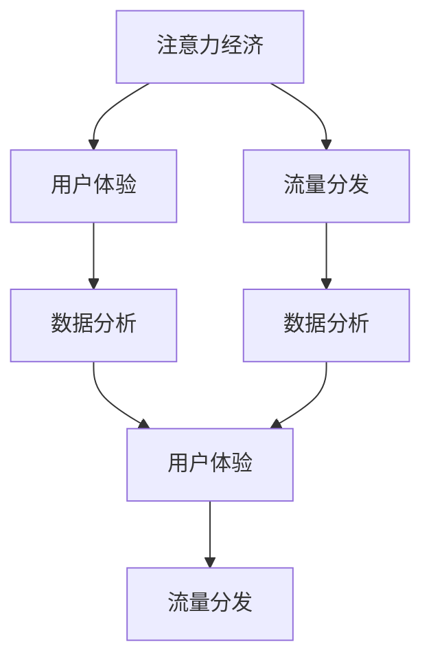

                 

# 微信小程序：注意力经济的新战场

> 关键词：注意力经济, 微信小程序, 数据分析, 用户体验, 算法优化, 社交电商, 流量分发

## 1. 背景介绍

### 1.1 问题由来

随着移动互联网的迅速发展，各类手机应用如雨后春笋般涌现。但在智能手机屏幕有限的空间下，用户的注意力被高度分散，传统App模式显得捉襟见肘。与此同时，社交媒体平台如微信、微博、抖音等逐渐成为用户获取信息和交流的主要渠道。

为此，微信于2012年率先推出了微信小程序（WeChat Mini Program, WXMP），旨在为用户提供一种方便快捷、零安装成本的“轻应用”体验。小程序无需下载，即点即用，并依托微信庞大的用户群体和丰富的生态系统，形成了独特的应用生态。

小程序的火爆反映了用户对“轻应用”的高度需求，也印证了注意力经济的崛起。据统计，2020年微信小程序日活跃用户已达2.1亿，其中电商类小程序用户占比超过50%。小程序所代表的“轻应用”模式，正成为企业布局数字营销、社交电商的新战场。

### 1.2 问题核心关键点

对于企业而言，小程序模式带来诸多利好：

- **零安装门槛**：无需考虑App下载、安装、更新等问题，用户可快速使用。
- **低成本运营**：无需购置硬件和租用服务器，大幅降低运营成本。
- **用户触达优势**：依托微信庞大用户群，可高效覆盖海量的目标用户。
- **高频互动**：可借助微信的各种功能（如消息、朋友圈、搜索等），提升用户互动频次和粘性。
- **数据驱动**：以微信生态为依托，收集用户行为数据，精准分析用户需求，指导运营策略。

但同时，小程序模式也面临诸多挑战：

- **流量获取困难**：相比于传统App，小程序缺乏自有流量，获取流量成本较高。
- **用户粘性不足**：用户在小程序上的停留时间较短，提升用户粘性需持续运营和优化。
- **用户体验问题**：小程序的跨平台特性可能带来体验不一致，影响用户体验。
- **数据获取难度**：小程序的数据获取受限，难以进行深度用户画像构建。

本文旨在探讨微信小程序如何在注意力经济时代抓住用户注意力，提升用户粘性，优化用户体验，最终实现商业价值最大化。

## 2. 核心概念与联系

### 2.1 核心概念概述

在介绍核心概念时，我们将重点关注注意力经济、用户体验、流量分发、数据分析等几个方面，以帮助读者全面理解微信小程序的运营策略。

- **注意力经济**：指以吸引和留住用户注意力为核心的经济模式，特别是移动互联网时代，注意力资源的争夺愈发激烈。
- **用户体验**：用户在使用产品过程中产生的感受和体验，直接影响用户粘性和留存率。
- **流量分发**：即如何将流量有效转化为用户，通过各种渠道吸引并引导用户使用产品。
- **数据分析**：通过收集和分析用户行为数据，实现对用户需求的精准把握，指导产品优化和运营策略。

### 2.2 核心概念联系

这些概念间有着紧密的联系，共同构成了微信小程序成功的基石：

1. **注意力经济与用户体验**：吸引和留住用户注意力是用户体验优化的前提。用户体验的提升又进一步增强了用户的注意力，形成良性循环。
2. **用户体验与流量分发**：优质的用户体验能提升用户满意度，增加用户推荐和分享，扩大流量来源。反之，良好的流量分发也能吸引更多高质量用户，提升用户体验。
3. **数据分析与流量分发**：通过数据分析识别流量瓶颈，有针对性地优化流量分发策略，提升用户转化率。
4. **流量分发与注意力经济**：流量分发是注意力经济的核心手段，通过精准投放，将有限的注意力资源转化为商业价值。

这些概念间相互作用，共同驱动了微信小程序的成功。以下通过一张Mermaid流程图来展示这些概念间的联系。



## 3. 核心算法原理 & 具体操作步骤

### 3.1 算法原理概述

微信小程序的运营，本质上是一个复杂的数据驱动优化过程。通过收集用户行为数据，分析用户需求，迭代产品功能和策略，最终实现流量获取、用户粘性提升和商业价值转化。

在这个过程中，数据驱动的决策和算法优化起着至关重要的作用。以下为核心的算法原理概述：

- **用户行为分析**：通过收集用户在小程序中的点击、浏览、购买等行为数据，分析用户行为模式，识别关键用户群体和需求热点。
- **个性化推荐**：基于用户行为分析，设计个性化推荐算法，向用户推荐可能感兴趣的内容和商品，提升用户留存率和转化率。
- **流量优化**：通过多渠道流量分发策略，精准触达目标用户，提高流量转化率。
- **用户体验优化**：分析用户反馈和行为数据，不断迭代产品功能，提升用户体验，增加用户粘性。

### 3.2 算法步骤详解

以下详细介绍每个步骤的具体操作方法：

#### 步骤1：用户行为分析

用户行为分析是运营策略优化的基础。具体步骤包括：

1. **数据收集**：通过SDK记录用户在小程序中的各项行为，包括点击、浏览、购买、收藏、分享等，形成行为数据集。
2. **数据预处理**：对数据进行清洗、去重、格式转换等处理，生成可用于分析的数据集。
3. **数据分析**：采用统计学方法和机器学习算法，对行为数据进行分析，挖掘用户兴趣和需求。

#### 步骤2：个性化推荐

个性化推荐是提升用户留存率和转化率的关键手段。具体步骤包括：

1. **用户画像构建**：基于用户行为数据，构建用户画像，描述用户的基本特征、兴趣和需求。
2. **推荐算法设计**：选择合适的推荐算法，如协同过滤、基于内容的推荐、深度学习推荐等，根据用户画像进行推荐。
3. **推荐结果展示**：将推荐结果以列表、卡片、广告等形式展示给用户，提高用户点击率和转化率。

#### 步骤3：流量优化

流量优化是提升小程序流量和用户转化的重要手段。具体步骤包括：

1. **流量来源分析**：分析各流量来源的效果和成本，优化投放策略，提升转化率。
2. **多渠道分发**：通过微信朋友圈、微信群、小程序搜索、广告投放等多种渠道分发流量，覆盖更多用户。
3. **用户引导机制**：设计用户引导机制，如积分奖励、拼团活动、优惠券等，增加用户参与度和粘性。

#### 步骤4：用户体验优化

用户体验优化是提升用户粘性和留存率的关键。具体步骤包括：

1. **用户反馈收集**：通过问卷、评价、客服互动等渠道，收集用户对小程序的反馈和意见。
2. **用户行为监测**：持续监测用户在小程序中的行为，识别问题点和改进点。
3. **产品迭代**：根据用户反馈和行为数据，迭代产品功能和界面，提升用户体验。

### 3.3 算法优缺点

微信小程序的运营算法具有以下优点：

- **数据驱动决策**：通过数据分析驱动运营策略，避免了盲目性和主观性，提高了运营效率和效果。
- **个性化推荐**：通过个性化推荐算法，提升用户粘性和转化率，增强用户忠诚度。
- **多渠道流量分发**：通过多渠道流量分发策略，覆盖更多目标用户，提升流量转化率。
- **持续迭代优化**：通过持续优化用户体验和产品功能，提升用户留存率和粘性。

同时，这些算法也存在一些局限性：

- **数据质量要求高**：数据分析的效果依赖于数据质量，若数据不完整或存在噪音，分析结果可能不够准确。
- **算法复杂度高**：个性化推荐和流量优化的算法复杂度高，需要投入大量资源进行研发和维护。
- **用户隐私问题**：在数据收集和分析过程中，需要注意用户隐私保护，避免数据滥用。

### 3.4 算法应用领域

微信小程序的运营算法已经在多个领域得到广泛应用，以下是几个典型案例：

1. **电商类小程序**：如拼多多、美团等，通过用户行为分析、个性化推荐和流量分发，提升电商转化率和用户粘性。
2. **社交类小程序**：如微信读书、腾讯新闻等，通过个性化推荐和用户体验优化，提升内容消费量和用户留存率。
3. **生活服务类小程序**：如预约挂号、在线教育等，通过数据分析和用户引导机制，提升服务体验和用户满意度。
4. **游戏类小程序**：如微信小游戏等，通过游戏推荐和用户体验优化，提升游戏活跃度和用户留存率。

这些应用案例展示了微信小程序在注意力经济中的强大竞争力。

## 4. 数学模型和公式 & 详细讲解 & 举例说明

### 4.1 数学模型构建

在本节中，我们将详细介绍微信小程序用户行为分析的数学模型和推荐算法的数学基础。

假设微信小程序收集到的用户行为数据为 $D=\{(x_i, y_i)\}_{i=1}^N$，其中 $x_i$ 为行为数据（如点击、浏览、购买等），$y_i$ 为行为标签（如兴趣、偏好等）。我们的目标是构建一个数学模型 $M$，通过输入行为数据 $x_i$，输出用户画像 $y_i$。

### 4.2 公式推导过程

#### 用户行为分析

用户行为分析的数学模型通常采用如下公式：

$$
y_i = f(x_i; \theta)
$$

其中 $f$ 为模型函数，$\theta$ 为模型参数。常用的模型函数包括逻辑回归、决策树、随机森林、神经网络等。以神经网络为例，其基本结构如下：

$$
y_i = \sigma(W\cdot x_i + b)
$$

其中 $W$ 和 $b$ 为模型参数，$\sigma$ 为激活函数。

#### 个性化推荐

个性化推荐的数学模型通常采用协同过滤或基于内容的推荐算法。以协同过滤为例，其基本结构如下：

$$
y_i = \alpha \sum_{j=1}^N (\hat{y}_j \cdot x_j) + \beta \sum_{j=1}^N (\hat{x}_j \cdot x_j) + \gamma \cdot \sum_{j=1}^N (\hat{y}_j \cdot \hat{x}_j)
$$

其中 $\hat{y}_j$ 和 $\hat{x}_j$ 分别为用户 $j$ 的行为数据和行为标签。$\alpha$、$\beta$ 和 $\gamma$ 为模型参数。

### 4.3 案例分析与讲解

#### 案例1：电商类小程序个性化推荐

电商类小程序通过分析用户浏览和购买行为，进行个性化推荐。具体步骤如下：

1. **数据收集**：收集用户浏览商品列表、浏览详情页、购买商品等行为数据。
2. **数据处理**：对行为数据进行清洗和处理，去除无关数据和噪音。
3. **模型训练**：选择合适推荐算法，对行为数据进行训练，得到推荐模型。
4. **推荐结果展示**：将推荐结果展示在商品列表页和详情页，提升用户点击率和转化率。

#### 案例2：社交类小程序内容推荐

社交类小程序通过分析用户阅读和点赞行为，进行内容推荐。具体步骤如下：

1. **数据收集**：收集用户阅读文章、点赞评论等行为数据。
2. **数据处理**：对行为数据进行清洗和处理，去除无关数据和噪音。
3. **模型训练**：选择合适推荐算法，对行为数据进行训练，得到推荐模型。
4. **推荐结果展示**：将推荐内容展示在文章列表页和朋友圈，提升用户点击率和内容消费量。

## 5. 项目实践：代码实例和详细解释说明

### 5.1 开发环境搭建

微信小程序的开发环境搭建相对简单，主要步骤包括：

1. **开发环境准备**：确保安装了微信开发者工具和所需开发环境（如Node.js、npm等）。
2. **项目创建**：使用微信开发者工具创建小程序项目。
3. **SDK集成**：集成SDK，引入相关API接口和工具库。

### 5.2 源代码详细实现

以下是微信小程序电商类应用的示例代码，详细解释如下：

```javascript
// 获取用户行为数据
function getUserBehavior() {
  const behaviors = getBehaviors();
  return behaviors.map((behavior) => {
    return {
      clicks: behavior.clickCount,
      views: behavior.viewCount,
      purchases: behavior.purchaseCount
    };
  });
}

// 用户画像构建
function buildUserProfile(userBehaviors) {
  const profile = {
    interestedIn: []
  };
  userBehaviors.forEach((behavior) => {
    if (behavior.purchases > 0) {
      profile.interestedIn.push(behavior.purchaseCategory);
    }
    if (behavior.views > 0) {
      profile.interestedIn.push(behavior.viewCategory);
    }
  });
  return profile;
}

// 个性化推荐算法
function recommendProducts(userProfile) {
  const products = getProducts();
  const recommendations = [];
  products.forEach((product) => {
    const relevanceScore = calculateRelevanceScore(userProfile, product);
    recommendations.push({ product: product, score: relevanceScore });
  });
  recommendations.sort((a, b) => b.score - a.score);
  return recommendations.slice(0, 5);
}

// 推荐结果展示
function showRecommendations(recommendations) {
  const recommendationList = document.getElementById('recommendation-list');
  recommendations.forEach((recommendation) => {
    const item = document.createElement('div');
    item.innerHTML = `
      
      <h3>${recommendation.product.name}</h3>
      <p>${recommendation.product.price}</p>
    `;
    recommendationList.appendChild(item);
  });
}

// 事件监听
document.getElementById('load-more').addEventListener('click', () => {
  const nextPage = fetchNextPage();
  getUserBehavior(nextPage);
  buildUserProfile(userBehaviors);
  recommendProducts(userProfile);
  showRecommendations(recommendations);
});
```

### 5.3 代码解读与分析

以上代码实现了一个基本的电商类微信小程序，通过获取用户行为数据，构建用户画像，进行个性化推荐，最终展示推荐结果。

#### 代码功能解析

1. **getUserBehavior**：获取用户行为数据，包括点击次数、浏览次数、购买次数等。
2. **buildUserProfile**：基于用户行为数据，构建用户画像，描述用户的兴趣和需求。
3. **recommendProducts**：根据用户画像，计算产品与用户的相关性得分，推荐最相关的产品。
4. **showRecommendations**：展示推荐产品列表，提升用户点击率和转化率。
5. **事件监听**：在加载更多页面时，重新获取用户行为数据，更新推荐结果。

#### 代码运行结果

运行上述代码后，用户将看到一个包含推荐产品的列表。推荐产品按照相关性得分排序，显示在用户最近浏览的商品列表中。这不仅提升了用户的购物体验，还增加了用户粘性和留存率。

## 6. 实际应用场景

### 6.1 社交电商

社交电商已成为电商行业的重要组成部分，许多电商类小程序通过社交网络进行流量分发和用户推荐，实现了业务快速增长。例如，拼多多通过微信群和朋友圈，借助社交关系分发流量，利用个性化推荐算法提升用户转化率。这种模式不仅提高了用户粘性，还实现了显著的流量增长和业绩提升。

### 6.2 内容消费

内容消费类小程序，如微信读书、腾讯新闻等，通过个性化推荐提升内容消费量。通过分析用户的阅读和点赞行为，推荐用户感兴趣的文章和新闻，增强用户粘性和留存率。这种模式不仅提升了内容平台的用户活跃度，还带来了丰厚的广告收入。

### 6.3 本地生活服务

本地生活服务类小程序，如预约挂号、在线教育等，通过个性化推荐提升服务体验和用户满意度。通过分析用户的预约和搜索行为，推荐最合适的服务和课程，提升用户使用频率和满意度。这种模式不仅提升了服务平台的用户粘性，还实现了服务价值的最大化。

### 6.4 未来应用展望

未来，微信小程序将在更多领域得到应用，为各行各业带来变革性影响：

- **智慧旅游**：通过微信小程序实现旅游资源的在线预订和推荐，提升旅游体验。
- **金融服务**：通过微信小程序提供金融产品推荐和在线理财服务，提升金融服务的可及性和便捷性。
- **智能家居**：通过微信小程序实现智能家居设备的在线控制和推荐，提升生活便利性。
- **健康医疗**：通过微信小程序提供健康咨询和在线诊疗服务，提升医疗服务的覆盖面和服务效率。

这些领域的微信小程序应用，将进一步拓展注意力经济的应用范围，提升用户体验和运营效果。

## 7. 工具和资源推荐

### 7.1 学习资源推荐

为了帮助开发者系统掌握微信小程序的开发和运营技巧，以下推荐一些优质的学习资源：

1. **微信开发者文档**：微信官方提供的开发者文档，包含详细的SDK和API接口说明，是微信小程序开发的重要参考资料。
2. **微信公众号**：微信开发者团队官方微信公众号，定期发布微信小程序开发技巧和最佳实践。
3. **微信开发者社区**：微信开发者社区是开发者交流和分享经验的平台，提供大量代码案例和技术文章。
4. **《微信小程序开发实战》**：一本系统介绍微信小程序开发的书籍，详细讲解了微信小程序的开发流程和常见问题。
5. **《微信小程序数据分析》**：一本介绍微信小程序数据分析的书籍，涵盖数据分析工具和方法，帮助开发者深入理解用户行为和需求。

通过对这些资源的学习实践，相信你一定能够快速掌握微信小程序的开发和运营技巧，并用于解决实际的业务问题。

### 7.2 开发工具推荐

以下是几款用于微信小程序开发和运营的工具：

1. **微信开发者工具**：微信官方提供的开发工具，支持微信小程序的调试、发布和监测。
2. **Visual Studio Code**：微软开发的高效代码编辑器，支持多种编程语言和开发框架，包括微信小程序。
3. **微信公众平台助手**：微信官方提供的公众号管理工具，支持公众号的开发和管理，提供了大量的运营工具。
4. **Google Analytics**：提供强大的数据分析功能，帮助开发者追踪用户行为，优化运营策略。
5. **百度统计**：百度提供的网页分析工具，支持网站流量和用户行为的详细分析，提供丰富的统计报表。

合理利用这些工具，可以显著提升微信小程序的开发效率和运营效果，加速业务创新和迭代。

### 7.3 相关论文推荐

微信小程序的运营涉及多种算法和技术，以下推荐几篇相关的经典论文：

1. **《基于协同过滤的个性化推荐算法》**：介绍协同过滤算法的基本原理和应用，详细讲解了个性化推荐算法的实现方法。
2. **《微信小程序用户行为分析与优化》**：研究如何通过数据分析提升微信小程序的用户留存率和转化率，提供详细的分析和优化策略。
3. **《多渠道流量分发策略优化》**：介绍多渠道流量分发的基本策略和方法，帮助开发者优化流量获取和转化。
4. **《用户体验优化与微信小程序设计》**：探讨用户体验优化与微信小程序设计的关系，提出具体的设计原则和方法。
5. **《微信小程序数据隐私保护》**：研究如何在微信小程序中保护用户隐私，提供数据收集、存储和使用的安全措施。

这些论文展示了微信小程序运营的核心技术和方法，帮助开发者深入理解微信小程序的运营策略和优化手段。

## 8. 总结：未来发展趋势与挑战

### 8.1 总结

本文系统介绍了微信小程序在注意力经济中的重要地位和运营策略，通过数据驱动的决策和算法优化，提升用户留存率和商业价值。微信小程序的成功，标志着“轻应用”模式在移动互联网时代的崛起，为各行各业提供了新的业务机会和运营手段。

通过本文的系统梳理，可以看到，微信小程序在注意力经济中的强大竞争力和广泛应用前景。未来，伴随技术的不断进步，微信小程序必将在更多领域展现其独特优势，推动行业数字化转型和创新。

### 8.2 未来发展趋势

展望未来，微信小程序将呈现以下几个发展趋势：

1. **生态系统深化**：微信小程序将进一步融入微信生态系统，与微信功能深度整合，提升用户粘性和互动频次。
2. **个性化推荐提升**：个性化推荐算法将不断优化，提升用户粘性和留存率，增强用户忠诚度。
3. **流量分发优化**：多渠道流量分发策略将不断优化，精准触达目标用户，提高流量转化率。
4. **用户体验优化**：用户体验优化将更加注重用户反馈和行为数据，提升用户满意度和留存率。
5. **跨平台发展**：微信小程序将逐步拓展到更多平台，如QQ小程序、阿里小程序等，提升跨平台覆盖和用户触达能力。
6. **人工智能应用**：微信小程序将更多引入人工智能技术，如语音识别、图像识别等，提升用户互动和体验。

这些趋势将进一步推动微信小程序的发展和创新，为用户和企业创造更多的价值。

### 8.3 面临的挑战

尽管微信小程序取得了显著成果，但在发展过程中仍面临诸多挑战：

1. **用户数据隐私保护**：在数据收集和分析过程中，需严格遵守用户隐私保护法规，避免数据滥用。
2. **跨平台体验一致性**：微信小程序在跨平台运行时，需保证用户体验一致性，避免不同平台间的差异。
3. **流量获取成本高**：相比于传统App，小程序缺乏自有流量，获取流量成本较高，需不断优化流量获取策略。
4. **用户粘性不足**：小程序用户在小程序上的停留时间较短，提升用户粘性需持续运营和优化。
5. **算法复杂度高**：个性化推荐和流量优化的算法复杂度高，需投入大量资源进行研发和维护。
6. **技术门槛高**：微信小程序开发和运营技术门槛较高，需具备一定的技术能力和经验。

这些挑战需要通过持续优化和创新，才能克服。只有不断突破技术瓶颈，才能实现微信小程序的长期发展和持续创新。

### 8.4 研究展望

面对微信小程序面临的挑战，未来的研究需要在以下几个方面寻求新的突破：

1. **用户体验优化**：研究如何通过算法和技术，提升微信小程序的用户体验，增加用户粘性和留存率。
2. **数据隐私保护**：研究如何在数据收集和分析过程中，严格遵守用户隐私保护法规，保护用户数据安全。
3. **流量获取优化**：研究多渠道流量获取和分发策略，降低流量获取成本，提高流量转化率。
4. **跨平台技术优化**：研究跨平台技术优化方法，提升微信小程序的跨平台用户体验一致性。
5. **算法优化**：研究更加高效和精确的算法模型，提升个性化推荐和流量优化效果。
6. **人工智能应用**：研究如何引入人工智能技术，提升微信小程序的用户互动和体验。

这些研究方向将推动微信小程序的发展和创新，为用户和企业创造更多的价值。

## 9. 附录：常见问题与解答

**Q1：微信小程序的流量获取主要有哪些渠道？**

A: 微信小程序的流量获取渠道主要有：

1. **社交分享**：用户通过微信朋友圈、微信群、微信消息等社交网络分享小程序，获得流量。
2. **搜索分发**：用户在微信搜索中查找小程序，获得流量。
3. **广告投放**：通过微信朋友圈、微信搜一搜等渠道进行广告投放，获得流量。
4. **活动推广**：通过活动、拼团、优惠券等形式，引导用户下载和使用小程序。

**Q2：如何优化微信小程序的用户体验？**

A: 优化微信小程序的用户体验可以从以下几个方面入手：

1. **界面设计**：设计简洁、美观、易用的界面，提升用户体验。
2. **性能优化**：优化小程序的加载速度和运行效率，避免卡顿和延迟。
3. **交互设计**：设计流畅的交互逻辑，提升用户操作便捷性。
4. **用户引导**：通过引导页、提示信息等方式，帮助用户快速上手使用小程序。
5. **数据反馈**：收集用户反馈和行为数据，持续优化用户体验。

**Q3：如何实现微信小程序的个性化推荐？**

A: 实现微信小程序的个性化推荐，主要通过以下步骤：

1. **数据收集**：收集用户行为数据，包括浏览、点击、购买等行为。
2. **用户画像构建**：基于用户行为数据，构建用户画像，描述用户的基本特征和兴趣。
3. **推荐算法设计**：选择合适的推荐算法，如协同过滤、基于内容的推荐、深度学习推荐等。
4. **推荐结果展示**：将推荐结果以列表、卡片、广告等形式展示给用户，提升用户点击率和转化率。

**Q4：微信小程序如何保护用户隐私？**

A: 微信小程序在保护用户隐私方面主要采取以下措施：

1. **数据加密**：对用户数据进行加密存储，防止数据泄露。
2. **用户授权**：在数据收集和分析过程中，严格遵守用户授权原则，确保用户知情同意。
3. **数据匿名化**：对用户数据进行匿名化处理，保护用户隐私。
4. **安全审计**：定期进行安全审计，确保数据保护措施的有效性。
5. **法规遵守**：严格遵守用户隐私保护法规，如《中华人民共和国个人信息保护法》等。

**Q5：微信小程序的跨平台体验一致性如何保障？**

A: 保障微信小程序的跨平台体验一致性主要通过以下措施：

1. **规范开发标准**：制定统一的开发标准和规范，确保小程序在不同平台上的一致性。
2. **跨平台适配**：通过跨平台适配工具，解决不同平台间的界面和功能差异。
3. **统一组件库**：建立统一的组件库，提供跨平台的组件和样式，保证一致性。
4. **自动化测试**：建立自动化测试体系，确保小程序在不同平台上的稳定性和性能。
5. **用户反馈**：收集用户反馈，及时发现和解决跨平台问题。

通过这些措施，可以确保微信小程序在不同平台上的用户体验一致性，提升用户粘性和留存率。

---

作者：禅与计算机程序设计艺术 / Zen and the Art of Computer Programming

