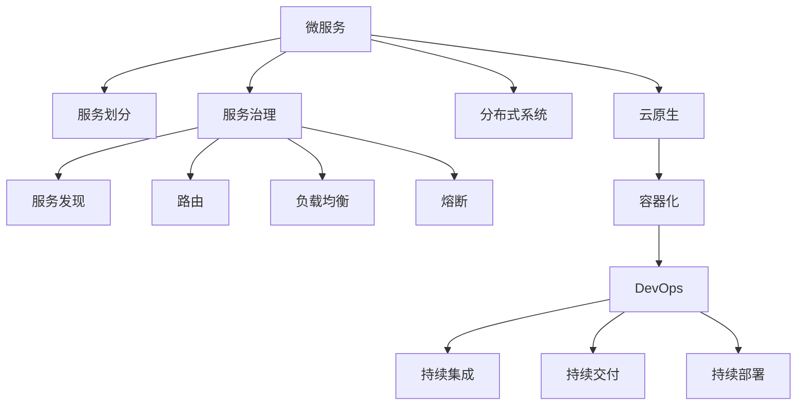

                 

# 微服务架构：设计模式与最佳实践

> 关键词：微服务,微服务架构,设计模式,最佳实践,分布式系统,云原生,容器化,DevOps

## 1. 背景介绍

### 1.1 问题由来
随着互联网应用规模的不断扩大和业务需求的快速变化，传统单体应用架构（Monolithic Application）变得越来越难以维护和扩展。单体应用由于体积庞大、复杂度高、不同模块之间的耦合性强，导致代码重构难度大，系统难以快速响应需求变更。

近年来，微服务架构（Microservice Architecture）作为一种新兴的软件架构风格，被越来越多的企业和开发者接受和使用。微服务架构将复杂的应用拆分为多个小型、自治的服务，每个服务围绕业务能力构建，独立部署、运行和管理。这样的设计理念极大地提高了系统的可扩展性、弹性和可靠性。

然而，微服务架构并非银弹，在实际应用中也需要遵循一些基本的设计原则和最佳实践。本文将深入探讨微服务架构的设计模式和最佳实践，帮助读者在设计和管理微服务架构时更加得心应手。

### 1.2 问题核心关键点
微服务架构的设计模式和最佳实践主要包括以下几个方面：
1. 服务划分：如何确定服务的边界，避免过细或过粗的划分。
2. 服务通信：如何选择服务间通信协议和方式，确保数据的安全传输和高效处理。
3. 服务治理：如何管理微服务的服务发现、路由、负载均衡、熔断等，保持系统的健壮性和高可用性。
4. 数据管理：如何设计服务的数据访问和存储策略，保证数据的一致性和可靠性。
5. 部署和运维：如何实现服务的自动化部署、弹性伸缩、监控和日志等，提升运维效率和系统稳定性。
6. 持续交付：如何通过DevOps实践，实现微服务的持续集成、持续交付和持续部署，提升开发和交付效率。

## 2. 核心概念与联系

### 2.1 核心概念概述

为更好地理解微服务架构的设计模式和最佳实践，本节将介绍几个密切相关的核心概念：

- 微服务（Microservice）：将复杂的应用拆分为多个小型、自治的服务，每个服务围绕业务能力构建，独立部署、运行和管理。

- 服务治理（Service Governance）：用于管理微服务的服务发现、路由、负载均衡、熔断等，保持系统的健壮性和高可用性。

- 分布式系统（Distributed System）：由多个独立的计算节点通过网络互连构成，以协同完成特定任务的系统。

- 云原生（Cloud Native）：一组构建基于云计算的分布式系统应用程序的实践和概念，包括容器化、DevOps、微服务等。

- 容器化（Containerization）：将应用程序及其依赖打包到容器中，以隔离运行环境、简化部署和运维。

- DevOps：将软件开发（Development）和运维（Operations）紧密结合，实现持续集成、持续交付和持续部署，提升开发和交付效率。

这些核心概念之间的逻辑关系可以通过以下Mermaid流程图来展示：



这个流程图展示了几组关键概念及其之间的关系：

1. 微服务通过服务划分被细分为多个小型自治服务。
2. 服务治理通过服务发现、路由、负载均衡和熔断等技术，维护系统的健壮性和高可用性。
3. 分布式系统由多个独立的计算节点构成，以协同完成特定任务。
4. 云原生和容器化技术通过将应用程序打包到容器中，隔离运行环境、简化部署和运维。
5. DevOps通过持续集成、持续交付和持续部署，提升开发和交付效率。

这些概念共同构成了微服务架构的设计基础，帮助开发者和运维人员构建可靠、高效、可扩展的分布式系统。

## 3. 核心算法原理 & 具体操作步骤
### 3.1 算法原理概述

微服务架构的核心思想是将复杂的应用拆分为多个小型、自治的服务，每个服务围绕业务能力构建，独立部署、运行和管理。微服务架构的设计模式和最佳实践主要包括以下几个方面：

- 服务划分：根据业务逻辑和服务边界将应用拆分为多个小型服务。
- 服务通信：通过RESTful API、gRPC、消息队列等技术，实现服务间通信。
- 服务治理：通过服务注册中心、配置中心、负载均衡器等技术，实现服务发现、配置管理和路由。
- 数据管理：通过分布式数据库、缓存、事务管理等技术，实现数据访问和存储。
- 部署和运维：通过容器化、DevOps等技术，实现服务的自动化部署、弹性伸缩、监控和日志等。
- 持续交付：通过持续集成、持续交付和持续部署等技术，实现微服务的快速迭代和发布。

### 3.2 算法步骤详解

微服务架构的设计和实施一般包括以下几个关键步骤：

**Step 1: 确定业务服务划分**
- 对应用进行业务拆分，确定每个服务的功能和边界。
- 遵循单一职责原则，将功能相同或相关的模块划分到同一个服务中。
- 避免过度拆分或过细拆分，以减少服务间通信和调用复杂度。

**Step 2: 设计服务通信协议**
- 选择适合的服务间通信协议，如RESTful API、gRPC、消息队列等。
- 根据应用场景和性能要求，设计合适的接口规范和服务协议。
- 考虑数据的安全传输和高效处理，选择合适的编码格式和传输方式。

**Step 3: 实现服务治理机制**
- 使用服务注册中心（如Consul、Eureka）管理服务的发现和注册。
- 设计灵活的路由策略，如基于负载均衡的轮询、随机、加权等。
- 实现服务熔断、降级和限流，防止单点故障和资源耗尽。

**Step 4: 设计数据管理方案**
- 选择合适的分布式数据库（如MySQL、PostgreSQL、MongoDB）或NoSQL数据库。
- 设计合理的数据模型和表结构，保证数据的一致性和可靠性。
- 实现数据同步和复制，确保数据的实时性和可用性。

**Step 5: 实现部署和运维策略**
- 使用容器化技术（如Docker、Kubernetes）封装和部署服务。
- 设计弹性伸缩策略，根据请求流量动态调整资源配置。
- 实现持续集成、持续交付和持续部署，提高开发和交付效率。

**Step 6: 监控和日志管理**
- 使用监控工具（如Prometheus、Grafana）实时采集系统指标。
- 使用日志管理工具（如ELK Stack、Splunk）收集和分析系统日志。
- 设置异常告警和故障恢复机制，保障系统稳定运行。

### 3.3 算法优缺点

微服务架构的设计模式和最佳实践具有以下优点：
1. 可扩展性：微服务架构具有良好的扩展性，能够方便地添加、修改和扩展服务。
2. 弹性：微服务架构能够快速响应用户需求，通过弹性伸缩保障系统性能。
3. 灵活性：微服务架构能够灵活地满足不同业务的需求，实现业务解耦和独立演进。
4. 独立部署：微服务架构能够独立部署和运行服务，简化运维和管理。

同时，该架构也存在一些局限性：
1. 复杂性：微服务架构设计和管理较为复杂，需要较高的技术水平和经验。
2. 通信开销：微服务架构中服务间通信开销较大，影响系统性能。
3. 数据一致性：微服务架构中数据一致性难以保证，需要进行合理的设计和优化。
4. 安全风险：微服务架构中服务间通信和数据传输的安全性需要特别关注。

尽管存在这些局限性，但微服务架构仍然是目前最为流行和有效的分布式系统架构之一。未来相关研究的重点在于如何进一步提升微服务架构的可靠性和可扩展性，同时兼顾系统的性能和安全性。

### 3.4 算法应用领域

微服务架构的设计模式和最佳实践已经在众多领域得到广泛应用，例如：

- 电商应用：电商平台通常需要处理大量的用户请求，通过微服务架构可以实现高并发和高可用的业务场景。
- 金融服务：金融领域对系统可靠性和数据安全性要求较高，微服务架构能够保障业务的高可靠性和高可用性。
- 物流系统：物流系统需要处理大量实时数据，通过微服务架构可以实现弹性伸缩和高可用性。
- 在线教育：在线教育平台需要支持大量的并发用户，通过微服务架构可以提供稳定的教学体验。
- 医疗健康：医疗健康领域需要处理大量敏感数据，通过微服务架构可以实现数据隔离和隐私保护。

除了这些经典领域外，微服务架构还被广泛应用于互联网、物联网、人工智能、区块链等众多新兴技术领域，为不同行业带来了新的突破。

## 4. 数学模型和公式 & 详细讲解 & 举例说明
### 4.1 数学模型构建

微服务架构的设计模式和最佳实践主要涉及服务划分、服务通信、服务治理、数据管理、部署和运维等方面的数学模型和公式。

**服务划分模型**：
- 假设将应用划分为 $N$ 个服务，每个服务处理一个子功能。
- 定义 $f_i$ 为第 $i$ 个服务的请求处理时间，$g_i$ 为第 $i$ 个服务的响应时间。
- 服务划分模型为：
$$
f_i = a_i \cdot g_i
$$
其中 $a_i$ 为服务 $i$ 的处理效率。

**服务通信模型**：
- 假设使用RESTful API作为服务间通信协议。
- 定义 $t_{req}$ 为服务间通信的请求时间，$t_{res}$ 为服务间通信的响应时间。
- 服务通信模型为：
$$
t_{req} = b \cdot c_i
$$
$$
t_{res} = d_i \cdot e_i
$$
其中 $c_i$ 为第 $i$ 个服务的请求流量，$d_i$ 为第 $i$ 个服务的响应延迟。

**服务治理模型**：
- 假设使用Consul作为服务注册中心。
- 定义 $r$ 为服务的注册频率，$s$ 为服务的注册周期。
- 服务治理模型为：
$$
r = \frac{n}{t}
$$
$$
s = \frac{t}{n}
$$
其中 $n$ 为服务的注册节点数，$t$ 为服务的注册间隔时间。

**数据管理模型**：
- 假设使用MySQL作为分布式数据库。
- 定义 $d_{req}$ 为数据查询请求时间，$d_{res}$ 为数据查询响应时间。
- 数据管理模型为：
$$
d_{req} = f(x)
$$
$$
d_{res} = g(y)
$$
其中 $x$ 为查询请求的复杂度，$y$ 为查询的资源消耗。

**部署和运维模型**：
- 假设使用Kubernetes实现服务的弹性伸缩。
- 定义 $e$ 为服务的弹性伸缩因子，$w$ 为服务的资源消耗。
- 部署和运维模型为：
$$
e = k \cdot w
$$
$$
w = \frac{p}{q}
$$
其中 $k$ 为服务伸缩的资源比例，$p$ 为请求流量，$q$ 为资源配额。

### 4.2 公式推导过程

下面以服务通信模型为例，详细推导服务间通信的延迟时间：

假设使用RESTful API作为服务间通信协议，每次请求需要发送 $n$ 个数据包，每个数据包大小为 $m$ 字节，通信带宽为 $b$ 字节/秒，网络延迟为 $t$ 秒，每次请求需要发送的数据包数量为 $p$。

根据公式 $t_{req} = b \cdot c_i$，可得：
$$
t_{req} = \frac{m \cdot p}{b}
$$

根据公式 $t_{res} = d_i \cdot e_i$，可得：
$$
t_{res} = \frac{c_i}{f_i}
$$

将 $t_{req}$ 和 $t_{res}$ 代入上述公式，可得：
$$
t_{req} = \frac{m \cdot p}{b} + \frac{c_i}{f_i}
$$

综上所述，服务间通信的延迟时间主要取决于通信带宽、请求数据包大小、请求流量和服务的处理效率。在实际应用中，需要根据具体场景进行优化。

### 4.3 案例分析与讲解

下面我们以电商平台的微服务架构为例，详细讲解微服务架构的设计和实施过程。

**业务拆分和功能划分**：
- 电商平台需要处理商品展示、购物车、订单管理、物流配送等多个功能。
- 将应用划分为商品服务、购物车服务、订单服务、物流服务等多个小型服务。
- 每个服务独立部署、运行和管理，降低服务间的耦合性。

**服务通信协议**：
- 使用RESTful API作为服务间通信协议，设计合理的接口规范和服务协议。
- 接口规范包括请求和响应的数据格式、参数名称和类型、错误码和消息等。
- 服务协议包括请求的路由、负载均衡和错误处理等。

**服务治理机制**：
- 使用Consul作为服务注册中心，管理服务的发现和注册。
- 设计灵活的路由策略，如基于负载均衡的轮询、随机、加权等。
- 实现服务熔断、降级和限流，防止单点故障和资源耗尽。

**数据管理方案**：
- 使用MySQL作为分布式数据库，设计合理的数据模型和表结构。
- 实现数据同步和复制，确保数据的实时性和可用性。

**部署和运维策略**：
- 使用Docker容器化技术封装和部署服务。
- 设计弹性伸缩策略，根据请求流量动态调整资源配置。
- 实现持续集成、持续交付和持续部署，提高开发和交付效率。

**监控和日志管理**：
- 使用Prometheus实时采集系统指标，监控服务性能和资源使用情况。
- 使用ELK Stack收集和分析系统日志，及时发现和解决问题。

综上所述，电商平台的微服务架构设计采用了业务拆分、服务通信、服务治理、数据管理、部署和运维、监控和日志管理等多个设计模式和最佳实践，实现了高并发、高可用、灵活和可靠的系统架构。

## 5. 项目实践：代码实例和详细解释说明
### 5.1 开发环境搭建

在进行微服务架构的开发和实施前，我们需要准备好开发环境。以下是使用Docker和Kubernetes进行微服务架构开发的流程：

1. 安装Docker和Kubernetes：
```bash
sudo apt-get update && sudo apt-get install docker.io -y
sudo apt-get install kubelet kubeadm kubectl -y
```

2. 启动Docker和Kubernetes集群：
```bash
sudo kubeadm init --pod-network-cidr=10.244.0.0/16
kubectl apply -f https://raw.githubusercontent.com/coreos/calico/master/kubernetes/manifests/calico.yaml
kubectl get pods -n kube-system
```

3. 编写和构建Docker镜像：
```bash
docker build -t your_image_name .
```

4. 部署和运行微服务：
```bash
kubectl apply -f your_deployment.yaml
kubectl get pods
```

5. 监控和维护微服务：
```bash
kubectl get pods
kubectl logs your_pod_name
```

完成上述步骤后，即可在Docker和Kubernetes环境中开始微服务架构的开发和实施。

### 5.2 源代码详细实现

下面我们以电商平台的商品服务为例，给出使用Docker和Kubernetes对微服务架构进行开发和部署的代码实现。

**商品服务代码**：
```python
from flask import Flask, jsonify, request

app = Flask(__name__)

@app.route('/get_product', methods=['GET'])
def get_product():
    product_id = request.args.get('product_id')
    # 从数据库中获取商品信息
    product = db.get(product_id)
    # 生成响应数据
    response = {
        'id': product['id'],
        'name': product['name'],
        'price': product['price']
    }
    return jsonify(response)

if __name__ == '__main__':
    app.run(host='0.0.0.0', port=5000)
```

**Docker镜像构建文件**：
```Dockerfile
# 使用Python 3.7作为基础镜像
FROM python:3.7

# 安装必要的依赖
COPY requirements.txt /
RUN pip install -r requirements.txt

# 将项目代码复制到Docker镜像中
COPY . /app

# 定义应用程序入口
CMD ["python", "app.py"]
```

**Kubernetes部署文件**：
```yaml
apiVersion: apps/v1
kind: Deployment
metadata:
  name: product-service
spec:
  replicas: 3
  selector:
    matchLabels:
      app: product-service
  template:
    metadata:
      labels:
        app: product-service
    spec:
      containers:
      - name: product-service
        image: your_docker_image_name:latest
        ports:
        - containerPort: 5000
        env:
        - name: DB_HOST
          value: db-host
        - name: DB_PORT
          value: 3306
        - name: DB_USER
          value: db-user
        - name: DB_PASSWORD
          value: db-password
```

**Kubernetes服务文件**：
```yaml
apiVersion: v1
kind: Service
metadata:
  name: product-service
spec:
  selector:
    app: product-service
  ports:
  - protocol: TCP
    port: 80
    targetPort: 5000
  type: LoadBalancer
```

将上述代码保存到对应的文件中，并在Kubernetes集群中创建Deployment和Service资源，即可运行商品服务。

### 5.3 代码解读与分析

让我们再详细解读一下关键代码的实现细节：

**商品服务代码**：
- `get_product`函数：从请求参数中获取商品ID，从数据库中获取商品信息，并生成响应数据。
- 使用Flask框架搭建RESTful API，方便实现服务间通信和调用。

**Docker镜像构建文件**：
- 使用Python 3.7作为基础镜像，安装项目依赖。
- 将项目代码复制到镜像中，并定义应用入口。

**Kubernetes部署文件**：
- 定义Deployment资源，指定服务副本数、选择器和容器配置。
- 指定容器镜像、端口和环境变量，用于连接数据库。

**Kubernetes服务文件**：
- 定义Service资源，指定服务选择器、端口和类型，实现负载均衡和流量分配。

综上所述，使用Docker和Kubernetes进行微服务架构的开发和部署，能够实现服务的自动化部署、弹性伸缩和负载均衡，保障系统的稳定性和高可用性。

当然，实际的微服务架构开发还需要考虑更多因素，如服务间的通信协议、数据管理、服务治理、监控和日志管理等，但核心的微服务架构设计原理和实践流程基本与此类似。

## 6. 实际应用场景
### 6.1 智能客服系统

基于微服务架构的智能客服系统，可以广泛应用于企业内部和客户服务场景。传统客服系统需要配备大量人力，高峰期响应缓慢，且一致性和专业性难以保证。通过微服务架构，智能客服系统可以实现7x24小时不间断服务，快速响应客户咨询，用自然流畅的语言解答各类常见问题。

在技术实现上，可以收集企业内部的历史客服对话记录，将问题和最佳答复构建成监督数据，在此基础上对预训练语言模型进行微调。微调后的语言模型能够自动理解用户意图，匹配最合适的答案模板进行回复。对于客户提出的新问题，还可以接入检索系统实时搜索相关内容，动态组织生成回答。如此构建的智能客服系统，能大幅提升客户咨询体验和问题解决效率。

### 6.2 金融舆情监测

金融机构需要实时监测市场舆论动向，以便及时应对负面信息传播，规避金融风险。传统的人工监测方式成本高、效率低，难以应对网络时代海量信息爆发的挑战。基于微服务架构的文本分类和情感分析技术，为金融舆情监测提供了新的解决方案。

具体而言，可以收集金融领域相关的新闻、报道、评论等文本数据，并对其进行主题标注和情感标注。在此基础上对预训练语言模型进行微调，使其能够自动判断文本属于何种主题，情感倾向是正面、中性还是负面。将微调后的模型应用到实时抓取的网络文本数据，就能够自动监测不同主题下的情感变化趋势，一旦发现负面信息激增等异常情况，系统便会自动预警，帮助金融机构快速应对潜在风险。

### 6.3 个性化推荐系统

当前的推荐系统往往只依赖用户的历史行为数据进行物品推荐，无法深入理解用户的真实兴趣偏好。基于微服务架构的个性化推荐系统，可以更好地挖掘用户行为背后的语义信息，从而提供更精准、多样的推荐内容。

在实践中，可以收集用户浏览、点击、评论、分享等行为数据，提取和用户交互的物品标题、描述、标签等文本内容。将文本内容作为模型输入，用户的后续行为（如是否点击、购买等）作为监督信号，在此基础上微调预训练语言模型。微调后的模型能够从文本内容中准确把握用户的兴趣点。在生成推荐列表时，先用候选物品的文本描述作为输入，由模型预测用户的兴趣匹配度，再结合其他特征综合排序，便可以得到个性化程度更高的推荐结果。

### 6.4 未来应用展望

随着微服务架构的不断发展，未来的微服务系统将呈现出更加多样化和智能化的趋势。

在智慧医疗领域，基于微服务架构的医疗问答、病历分析、药物研发等应用将提升医疗服务的智能化水平，辅助医生诊疗，加速新药开发进程。

在智能教育领域，微服务架构可应用于作业批改、学情分析、知识推荐等方面，因材施教，促进教育公平，提高教学质量。

在智慧城市治理中，微服务架构可应用于城市事件监测、舆情分析、应急指挥等环节，提高城市管理的自动化和智能化水平，构建更安全、高效的未来城市。

此外，在企业生产、社会治理、文娱传媒等众多领域，基于微服务架构的人工智能应用也将不断涌现，为经济社会发展注入新的动力。相信随着技术的日益成熟，微服务架构必将在构建人机协同的智能时代中扮演越来越重要的角色。

## 7. 工具和资源推荐
### 7.1 学习资源推荐

为了帮助开发者系统掌握微服务架构的设计模式和最佳实践，这里推荐一些优质的学习资源：

1. 《微服务架构设计模式》系列博文：由大模型技术专家撰写，深入浅出地介绍了微服务架构的设计模式和最佳实践。

2. 《Spring Cloud微服务架构》书籍：详细介绍微服务架构的核心组件和技术栈，如Spring Cloud、Docker、Kubernetes等。

3. 《微服务架构实战》课程：Udemy平台的微服务架构实战课程，涵盖微服务设计、开发、部署、运维等全流程。

4. HuggingFace官方文档：Transformers库的官方文档，提供了海量预训练模型和微服务架构的集成样例代码。

5. Spring Cloud官网：Spring Cloud的官方文档，包含微服务架构的全面介绍和最佳实践。

通过对这些资源的学习实践，相信你一定能够快速掌握微服务架构的设计模式和最佳实践，并用于解决实际的微服务问题。
###  7.2 开发工具推荐

高效的开发离不开优秀的工具支持。以下是几款用于微服务架构开发的常用工具：

1. Spring Cloud：基于Spring Boot的微服务架构开发框架，提供了一系列的工具和组件，如服务注册、配置管理、负载均衡等。

2. Kubernetes：谷歌开源的容器编排工具，支持自动化部署、弹性伸缩和滚动更新等特性，是微服务架构的标配。

3. Docker：基于Linux容器的开源工具，支持应用的打包、部署和运维，是微服务架构的基础。

4. Jenkins：开源的持续集成/持续交付工具，支持自动化构建、测试和部署。

5. GitLab CI/CD：GitLab提供的持续集成/持续交付服务，支持微服务的自动化部署和持续交付。

6. ELK Stack：由ElasticSearch、Logstash和Kibana组成的全栈日志管理解决方案，支持实时采集、处理和分析系统日志。

合理利用这些工具，可以显著提升微服务架构的开发效率，加快创新迭代的步伐。

### 7.3 相关论文推荐

微服务架构的研究源于学界的持续研究。以下是几篇奠基性的相关论文，推荐阅读：

1. "Designing Distributed Systems" （《设计分布式系统》）：作者Joyce Wang和Gertrude Epstein，深入探讨了分布式系统的设计原理和最佳实践。

2. "Microservices in Practice"（《微服务实践》）：作者Sam Newman，详细介绍了微服务架构的设计模式和最佳实践。

3. "The Rise of Microservices"（《微服务的崛起》）：作者Laird Barr和Dean Suen，探讨了微服务架构的兴起背景和关键挑战。

4. "Cloud-Native Microservices Architecture"（《云原生微服务架构》）：作者Jay Kim和J.D. Beal，讨论了云原生环境下的微服务架构设计。

5. "Beyond Microservices"（《超越微服务》）：作者Yan Cui，提出了微服务架构未来的演进方向和趋势。

这些论文代表了大模型微调技术的发展脉络。通过学习这些前沿成果，可以帮助研究者把握学科前进方向，激发更多的创新灵感。

## 8. 总结：未来发展趋势与挑战

### 8.1 总结

本文对微服务架构的设计模式和最佳实践进行了全面系统的介绍。首先阐述了微服务架构的研究背景和意义，明确了微服务架构在提高系统可扩展性、弹性和可靠性方面的独特价值。其次，从原理到实践，详细讲解了微服务架构的数学模型和关键步骤，给出了微服务架构开发和实施的完整代码实例。同时，本文还广泛探讨了微服务架构在智能客服、金融舆情、个性化推荐等多个行业领域的应用前景，展示了微服务架构的巨大潜力。此外，本文精选了微服务架构的各种学习资源，力求为读者提供全方位的技术指引。

通过本文的系统梳理，可以看到，微服务架构设计模式和最佳实践已经在大规模分布式系统中得到广泛应用，极大地提高了系统的可扩展性、弹性和可靠性。未来，伴随微服务架构技术的持续演进，微服务系统必将在更多领域得到应用，为传统行业带来变革性影响。

### 8.2 未来发展趋势

展望未来，微服务架构的设计模式和最佳实践将呈现以下几个发展趋势：

1. 服务治理和监控：微服务架构中服务治理和监控的重要性将日益凸显，未来的系统将更加注重服务发现、负载均衡、熔断和监控等关键技术。

2. 云原生和容器化：云原生和容器化技术将成为微服务架构的主流技术，带来更高的灵活性和可扩展性。

3. 自动化部署和运维：微服务架构的自动化部署和运维将成为趋势，DevOps实践将成为必然选择。

4. 多云和混合云：多云和混合云环境将成为主流，微服务架构需要具备更强的跨云迁移和互操作能力。

5. 微服务集成：微服务架构将更加注重与其他技术和平台的集成，如Kubernetes、Docker、Prometheus等，实现功能扩展和性能优化。

6. 智能运维：微服务架构的运维将越来越智能化，使用机器学习和大数据技术进行异常检测和预测分析。

以上趋势凸显了微服务架构设计的广阔前景。这些方向的探索发展，必将进一步提升微服务架构的可靠性和可扩展性，为分布式系统构建更安全、高效、可扩展的技术体系。

### 8.3 面临的挑战

尽管微服务架构已经取得了不少成就，但在迈向更加智能化、普适化应用的过程中，它仍面临着诸多挑战：

1. 服务间通信开销：微服务架构中服务间通信开销较大，影响系统性能。

2. 数据一致性：微服务架构中数据一致性难以保证，需要进行合理的设计和优化。

3. 安全风险：微服务架构中服务间通信和数据传输的安全性需要特别关注。

4. 自动化部署和运维：微服务架构的自动化部署和运维需要更高的技术水平和经验。

5. 服务拆分粒度：微服务架构中服务的拆分粒度需要合理设计，避免过细或过粗的划分。

6. 成本控制：微服务架构的开发和运维成本较高，需要合理的资源管理和成本控制。

尽管存在这些挑战，但微服务架构仍然是目前最为流行和有效的分布式系统架构之一。未来相关研究的重点在于如何进一步提升微服务架构的可靠性和可扩展性，同时兼顾系统的性能和安全性。

### 8.4 研究展望

面对微服务架构所面临的种种挑战，未来的研究需要在以下几个方面寻求新的突破：

1. 服务治理优化：优化服务注册、负载均衡、熔断等技术，提高系统的健壮性和可用性。

2. 数据一致性保证：通过分布式事务、一致性哈希等技术，保证数据的一致性和可靠性。

3. 安全性和隐私保护：设计安全通信协议、数据加密和访问控制等措施，保障数据和系统的安全性。

4. 自动化运维优化：优化自动化部署、监控和日志管理等技术，提高运维效率和系统稳定性。

5. 微服务集成优化：优化微服务集成和协同设计，实现跨平台和跨云的互操作。

6. 多云和混合云管理：设计多云和混合云环境下的微服务架构，实现跨云迁移和资源优化。

这些研究方向和突破点，将为微服务架构的设计和应用带来新的突破，进一步提升分布式系统的可靠性和可扩展性。

## 9. 附录：常见问题与解答

**Q1：什么是微服务架构？**

A: 微服务架构是一种将应用拆分为多个小型、自治服务的分布式系统架构。每个服务围绕业务能力构建，独立部署、运行和管理。

**Q2：微服务架构的优点和缺点有哪些？**

A: 微服务架构的优点包括：
1. 可扩展性：服务独立部署、运行和管理，能够方便地添加、修改和扩展服务。
2. 弹性：能够快速响应用户需求，通过弹性伸缩保障系统性能。
3. 灵活性：能够灵活地满足不同业务的需求，实现业务解耦和独立演进。

微服务架构的缺点包括：
1. 复杂性：设计和管理较为复杂，需要较高的技术水平和经验。
2. 通信开销：服务间通信开销较大，影响系统性能。
3. 数据一致性：数据一致性难以保证，需要进行合理的设计和优化。

**Q3：微服务架构的部署和运维策略有哪些？**

A: 微服务架构的部署和运维策略包括：
1. 容器化技术：使用Docker容器封装和部署服务。
2. 弹性伸缩：根据请求流量动态调整资源配置。
3. 自动化部署：使用持续集成、持续交付和持续部署工具，提升开发和交付效率。
4. 监控和日志管理：使用Prometheus、ELK Stack等工具，实时采集和分析系统指标和日志。

**Q4：如何优化微服务架构中的服务治理？**

A: 优化微服务架构中的服务治理可以采取以下措施：
1. 优化服务注册中心：选择合适的服务注册中心，如Consul、Eureka等，设计合理的注册频率和周期。
2. 优化路由策略：设计灵活的路由策略，如基于负载均衡的轮询、随机、加权等。
3. 优化服务熔断和降级：实现服务熔断、降级和限流，防止单点故障和资源耗尽。

**Q5：如何提高微服务架构中的数据一致性？**

A: 提高微服务架构中的数据一致性可以采取以下措施：
1. 设计合理的数据模型和表结构，保证数据的一致性和可靠性。
2. 实现数据同步和复制，确保数据的实时性和可用性。
3. 使用分布式事务、一致性哈希等技术，保障数据的一致性。

综上所述，微服务架构的设计模式和最佳实践已经在大规模分布式系统中得到广泛应用，极大地提高了系统的可扩展性、弹性和可靠性。未来，伴随微服务架构技术的持续演进，微服务系统必将在更多领域得到应用，为传统行业带来变革性影响。

---

作者：禅与计算机程序设计艺术 / Zen and the Art of Computer Programming

