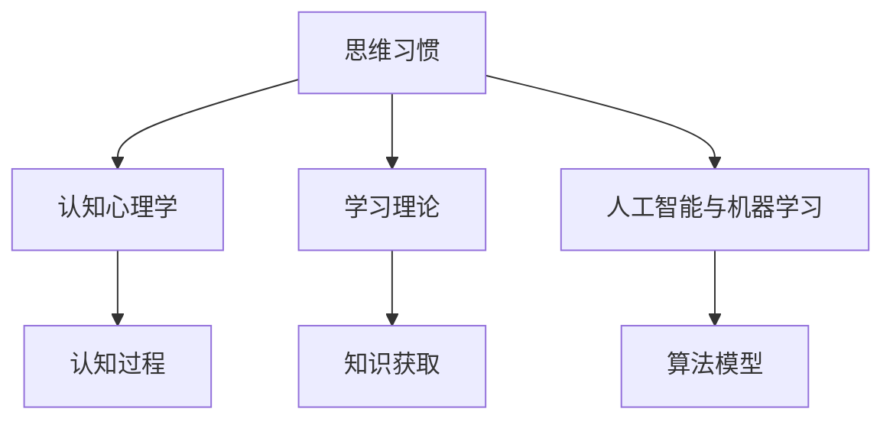

                 

# 思维习惯：塑造知识理解模式的因素

> 关键词：思维习惯,知识理解模式,认知心理学,学习理论,人工智能与机器学习

## 1. 背景介绍

### 1.1 问题由来
在人类历史的长河中，思维习惯作为一种深植内心的认知模式，影响着我们理解世界的方式。在现代社会，随着科技的飞速发展，特别是人工智能(AI)和机器学习技术的兴起，理解并利用思维习惯成为了一个重要的研究领域。AI的算法和模型往往借鉴了人类认知和思考的习惯，而思维习惯的研究反过来也指导着AI的发展。

### 1.2 问题核心关键点
思维习惯的构建和影响是一个多层次、跨学科的问题，其核心关键点包括：

- **思维习惯的本质**：即思维习惯如何形成，以及在个体和集体中如何表现。
- **影响因素**：包括遗传、教育、文化、环境等，这些因素如何共同作用于思维习惯的形成。
- **作用机制**：思维习惯如何影响决策、学习、问题解决等心理过程。
- **应用场景**：如何在实际问题中利用思维习惯，比如在AI算法设计中如何借鉴思维习惯，以及如何帮助人们形成更好的思维习惯。

## 2. 核心概念与联系

### 2.1 核心概念概述

为更好地理解思维习惯在认知和AI中的作用，本节将介绍几个密切相关的核心概念：

- **思维习惯(Thinking Habits)**：指人们在思考、解决问题和做出决策时所遵循的固定的、重复的认知模式。
- **认知心理学(Cognitive Psychology)**：研究人的认知过程，包括知觉、学习、记忆、思维和决策等。
- **学习理论(Learning Theories)**：探索如何通过各种方式（如行为主义、认知主义、建构主义等）促进知识的获取和理解。
- **人工智能与机器学习(AI & Machine Learning)**：利用算法和模型，使机器能够模拟人类的认知和决策过程，实现自主学习和问题解决。

这些核心概念之间的逻辑关系可以通过以下Mermaid流程图来展示：



这个流程图展示了一些核心概念之间的联系：

1. 思维习惯通过认知过程影响学习和问题解决。
2. 学习理论指导认知过程的认知和知识获取。
3. 人工智能与机器学习借鉴认知过程和思维习惯，实现自主学习和问题解决。

## 3. 核心算法原理 & 具体操作步骤

### 3.1 算法原理概述

思维习惯在人工智能中的体现，很大程度上取决于学习算法的设计。基于监督学习的算法通过标记数据集进行模型训练，而基于无监督学习的算法则通过数据集的内在模式进行学习。在无监督学习中，算法尝试发现数据集中的模式和结构，这与认知心理学中关于思维习惯的研究有相似之处。

思维习惯的形成是一个复杂的动态过程，涉及感知、学习、记忆、推理等多个阶段。因此，从算法角度看，思维习惯的形成可以类比为以下几个步骤：

1. **感知阶段**：数据输入，即输入的信息如何被感知和处理。
2. **学习阶段**：模型通过数据学习规律，即如何从数据中提取有意义的特征。
3. **记忆阶段**：学习到的特征被存储在模型中，即如何将信息存储和检索。
4. **推理阶段**：模型利用存储的信息进行推理，即如何应用所学知识解决新问题。

### 3.2 算法步骤详解

1. **数据准备**：收集和标注相关的数据，确保数据集足够多样化，覆盖各种可能的思维习惯。

2. **模型选择**：选择合适的算法和模型架构，如决策树、神经网络、支持向量机等，这些模型都具备模拟复杂思维习惯的能力。

3. **特征工程**：设计合适的特征提取方法，将原始数据转化为模型可以理解的特征。这包括文本处理、图像识别、时间序列分析等。

4. **模型训练**：使用标记数据集训练模型，优化参数以提升模型性能。可以通过交叉验证等技术避免过拟合。

5. **模型评估**：在测试集上评估模型性能，确定其准确性和泛化能力。可以使用准确率、召回率、F1值等指标。

6. **迭代优化**：根据评估结果调整模型和算法参数，进行多轮迭代优化，直至模型表现满足需求。

### 3.3 算法优缺点

基于思维习惯的算法具有以下优点：

- **通用性强**：适用于多种数据类型和问题类型。
- **鲁棒性好**：对噪声和数据不完整性具有较强的适应性。
- **可解释性强**：可以通过特征工程和模型调试更好地理解模型的决策过程。

但同时，这些算法也存在一定的局限性：

- **复杂度高**：构建和优化模型需要较复杂的算法设计和调试过程。
- **计算量大**：特别是在处理大规模数据集时，计算资源需求较大。
- **数据依赖性强**：模型性能高度依赖于训练数据的质量和数量。

### 3.4 算法应用领域

基于思维习惯的算法广泛应用于以下几个领域：

- **自然语言处理(NLP)**：如情感分析、文本分类、机器翻译等。通过理解语言中的隐含思维习惯，提升处理效率和准确性。
- **计算机视觉(CV)**：如图像分类、目标检测、物体识别等。通过学习图像中潜在的思维模式，实现高效的图像处理和分析。
- **推荐系统**：如协同过滤、内容推荐等。通过分析用户的行为和偏好，发现其隐含的思维习惯，提供个性化推荐。
- **金融风控**：如信用评估、欺诈检测等。通过理解用户和交易数据中的思维习惯，提升风险管理能力。

## 4. 数学模型和公式 & 详细讲解 & 举例说明

### 4.1 数学模型构建

基于思维习惯的算法设计通常依赖于以下数学模型：

1. **感知模型(Perceptual Model)**：处理输入数据的模型，如感知器、神经网络等。
2. **学习模型(Learning Model)**：从感知模型提取的特征中学习模式，如逻辑回归、决策树等。
3. **推理模型(Inferential Model)**：使用学习到的模式进行推理和决策，如贝叶斯网络、图模型等。

这些模型的构建过程如下：

- **感知模型**：将输入数据转化为特征表示，即$\mathbf{x} \rightarrow \mathbf{z}$。
- **学习模型**：利用特征$\mathbf{z}$进行模型训练，即$\mathbf{z} \rightarrow \mathbf{w}$。
- **推理模型**：使用模型参数$\mathbf{w}$进行推理，即$\mathbf{w} \rightarrow \hat{y}$。

### 4.2 公式推导过程

以简单的线性回归模型为例，其推导过程如下：

1. **感知模型**：输入数据$\mathbf{x}=[x_1, x_2, ..., x_n]$，通过感知模型转化为特征表示$\mathbf{z}=[z_1, z_2, ..., z_n]$。
2. **学习模型**：特征表示$\mathbf{z}$与标签$\mathbf{y}$之间的关系为$\mathbf{y}=w_0 + w_1z_1 + w_2z_2 + ... + w_nz_n + \epsilon$，其中$w_i$为权重，$\epsilon$为噪声。
3. **推理模型**：将新输入数据$\mathbf{x'}$转化为特征表示$\mathbf{z'}$，通过学习到的模型参数进行推理：$\hat{y'}=w_0 + w_1z'_1 + w_2z'_2 + ... + w_nz'_n$。

### 4.3 案例分析与讲解

**案例：情感分析**

在情感分析任务中，模型需要理解文本中的情感倾向。基于思维习惯的算法步骤如下：

1. **感知模型**：使用词袋模型(Bag of Words)或词嵌入模型(Word Embedding)将文本转化为特征向量。
2. **学习模型**：利用情感标注数据进行监督学习，训练逻辑回归或支持向量机等模型，学习情感与特征之间的关系。
3. **推理模型**：对新的文本数据进行特征提取和推理，输出情感倾向。

## 5. 项目实践：代码实例和详细解释说明

### 5.1 开发环境搭建

在进行项目实践前，需要先配置好开发环境。以下是基于Python的开发环境搭建流程：

1. **安装Python**：从官网下载并安装Python，建议使用3.6或以上版本。
2. **安装依赖库**：使用pip安装必要的库，如NumPy、Pandas、Scikit-learn、Matplotlib等。
3. **配置环境变量**：将Python路径添加到系统环境变量中。
4. **安装Jupyter Notebook**：使用pip安装Jupyter Notebook，用于交互式数据分析和模型调试。

### 5.2 源代码详细实现

以下是一个简单的基于感知器和线性回归的情感分析代码实现：

```python
import numpy as np
from sklearn.datasets import fetch_20newsgroups
from sklearn.feature_extraction.text import CountVectorizer
from sklearn.linear_model import LogisticRegression
from sklearn.metrics import accuracy_score

# 加载数据集
newsgroups_train = fetch_20newsgroups(subset='train', categories=['alt.atheism', 'soc.religion.christian'], shuffle=True, random_state=42)
newsgroups_test = fetch_20newsgroups(subset='test', categories=['alt.atheism', 'soc.religion.christian'], shuffle=True, random_state=42)

# 构建词汇表
vectorizer = CountVectorizer(stop_words='english')
X_train = vectorizer.fit_transform(newsgroups_train.data)
X_test = vectorizer.transform(newsgroups_test.data)

# 构建逻辑回归模型
model = LogisticRegression(solver='lbfgs')
model.fit(X_train, newsgroups_train.target)

# 预测和评估
y_pred = model.predict(X_test)
accuracy = accuracy_score(newsgroups_test.target, y_pred)
print(f"Accuracy: {accuracy:.2f}")
```

### 5.3 代码解读与分析

**代码解读**：

1. **数据加载**：使用sklearn的fetch_20newsgroups加载数据集，分为训练集和测试集，并指定类别为'alt.atheism'和'soc.religion.christian'。
2. **特征提取**：使用CountVectorizer将文本转化为词袋模型特征向量。
3. **模型训练**：使用sklearn的LogisticRegression训练逻辑回归模型。
4. **预测和评估**：使用训练好的模型对测试集进行预测，并计算准确率。

**代码分析**：

- **特征提取**：使用词袋模型对文本进行特征提取，简单易行但忽略了词序和语法结构。
- **模型训练**：使用逻辑回归模型进行训练，参数较少，易于解释。
- **评估方法**：使用准确率作为评估指标，适用于二分类任务。

## 6. 实际应用场景

### 6.1 智能客服系统

基于思维习惯的智能客服系统可以通过用户对话中的语言模式，理解用户意图，提供个性化服务。具体流程如下：

1. **感知模型**：将用户输入的对话转化为特征向量。
2. **学习模型**：利用历史对话数据进行监督学习，训练语言模型，识别不同意图和情感。
3. **推理模型**：对新的对话数据进行推理，生成最合适的回复。

### 6.2 金融风控系统

在金融风控系统中，模型需要分析交易数据，识别异常行为。基于思维习惯的算法步骤如下：

1. **感知模型**：提取交易特征，如交易金额、时间、地点等。
2. **学习模型**：利用标记数据进行监督学习，训练异常检测模型，识别潜在欺诈行为。
3. **推理模型**：对新的交易数据进行推理，标记异常交易。

### 6.3 推荐系统

推荐系统需要分析用户行为数据，发现用户的兴趣模式。基于思维习惯的推荐步骤如下：

1. **感知模型**：提取用户行为数据，如浏览、点击、购买等。
2. **学习模型**：利用用户行为数据进行无监督学习，发现用户的兴趣模式。
3. **推理模型**：根据用户的行为模式推荐商品或内容。

## 7. 工具和资源推荐

### 7.1 学习资源推荐

为了帮助开发者深入理解思维习惯，以下是一些推荐的学习资源：

1. **《思考，快与慢》**：丹尼尔·卡尼曼著，深入探讨了人类思维的两种系统：快速直觉的"系统1"和慢速理性的"系统2"。
2. **《认知心理学》**：菲利普·津巴多著，介绍了人类认知的各个方面，包括知觉、记忆、思维等。
3. **《机器学习》**：Tom Mitchell著，详细介绍了机器学习的基本概念和算法。
4. **Coursera的《机器学习》课程**：斯坦福大学Andrew Ng教授主讲的课程，系统讲解了机器学习算法和应用。
5. **Kaggle数据科学竞赛**：参与实际数据集分析，应用所学知识解决实际问题。

### 7.2 开发工具推荐

以下是一些常用的开发工具，可以加速思维习惯的算法实现和优化：

1. **PyTorch**：强大的深度学习框架，支持动态计算图，灵活高效。
2. **TensorFlow**：Google开发的深度学习框架，生产环境使用广泛。
3. **Scikit-learn**：Python的机器学习库，提供了众多经典的机器学习算法。
4. **Pandas**：数据处理和分析库，支持大规模数据集处理。
5. **Jupyter Notebook**：交互式数据分析和模型调试工具，适合开发和实验。

### 7.3 相关论文推荐

以下是一些重要的相关论文，推荐阅读：

1. **《人类计算的认知科学》**：关于认知科学在人类计算中的应用。
2. **《深度学习》**：Ian Goodfellow、Yoshua Bengio和Aaron Courville合著，详细介绍了深度学习的基本概念和算法。
3. **《人工智能的哲学》**：John Searle著，探讨了人工智能的哲学问题，如意识、推理等。
4. **《神经网络与深度学习》**：Michael Nielsen著，介绍了神经网络和深度学习的基础知识。
5. **《认知计算》**：关于认知计算的理论和实践，应用于人工智能和机器学习。

## 8. 总结：未来发展趋势与挑战

### 8.1 总结

本文系统介绍了基于思维习惯的算法原理和具体操作步骤，结合实际应用场景，深入探讨了思维习惯在认知心理学、人工智能和机器学习中的作用。通过理解思维习惯的形成和影响机制，可以更好地设计和使用AI算法，提升模型性能和用户体验。

### 8.2 未来发展趋势

未来，基于思维习惯的算法将呈现以下几个发展趋势：

1. **多模态融合**：将视觉、语音、文本等多种数据类型融合，实现更为全面的认知模型。
2. **自适应学习**：模型能够根据环境变化和用户反馈实时调整，提高适应性和鲁棒性。
3. **个性化推荐**：结合用户的行为和兴趣模式，实现更精准的个性化推荐。
4. **情感计算**：通过分析情感模式，提升人机交互的自然性和情感共鸣。
5. **智能辅助**：应用于医疗、教育、金融等领域的智能辅助系统，提升决策质量和效率。

### 8.3 面临的挑战

尽管基于思维习惯的算法具有广阔的应用前景，但仍然面临以下挑战：

1. **数据依赖性**：高质量标注数据的需求较高，难以获取。
2. **计算资源消耗**：大规模数据集和复杂模型对计算资源消耗较大。
3. **模型可解释性**：复杂模型难以解释其决策过程，缺乏可解释性。
4. **用户隐私保护**：大规模数据收集和分析可能导致用户隐私泄露。
5. **公平性和伦理问题**：算法偏见和歧视可能导致不公平的结果。

### 8.4 研究展望

未来的研究应着重于以下几个方面：

1. **数据增强**：通过数据增强技术提高模型的泛化能力，降低对标注数据的依赖。
2. **模型压缩**：通过模型压缩技术提高计算效率，降低资源消耗。
3. **可解释性**：开发可解释性强的模型，提高算法透明度和可信度。
4. **隐私保护**：采用隐私保护技术，确保用户数据的安全和隐私。
5. **公平性**：通过公平性约束，避免算法偏见和歧视。

## 9. 附录：常见问题与解答

**Q1：如何理解思维习惯的形成？**

A: 思维习惯的形成是一个复杂的动态过程，涉及感知、学习、记忆、推理等多个阶段。这些阶段相互作用，共同形成了一个认知模型。例如，通过不断接触某一领域的知识和技能，学习者逐渐形成了该领域的专业思维习惯。

**Q2：如何在实际问题中应用基于思维习惯的算法？**

A: 在实际问题中应用基于思维习惯的算法，首先需要明确问题的结构，选择适当的感知、学习、推理模型。然后，收集和标注相关的数据，训练模型，最后使用模型进行推理和决策。

**Q3：如何评估基于思维习惯的算法的性能？**

A: 评估基于思维习惯的算法的性能，可以使用准确率、召回率、F1值、ROC曲线等指标。同时，通过实际应用中的效果评估，可以更好地理解算法的实际表现。

---

作者：禅与计算机程序设计艺术 / Zen and the Art of Computer Programming

