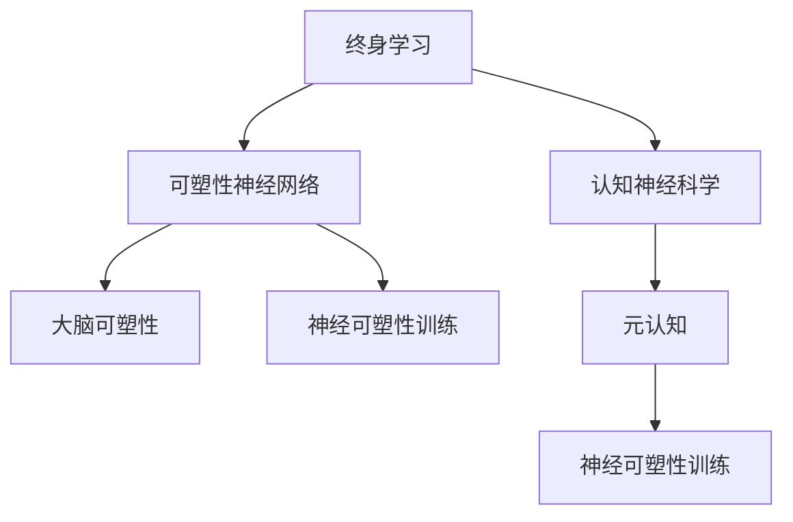

                 

## 1. 背景介绍

### 1.1 问题由来

在快速发展的现代社会，终身学习已成为个体适应新环境、掌握新技能的重要途径。然而，现代终身学习面临诸多挑战，如学习资源分散、学习内容碎片化、学习效果难以持续等。这些问题直接影响了终身学习的效率和效果。如何通过神经科学的手段，揭示思维的可塑性，提供科学的终身学习方法和工具，成为当前亟待解决的问题。

### 1.2 问题核心关键点

终身学习的核心在于通过持续学习，不断更新和优化认知结构，实现个体知识与技能的外延和内化。其主要特点包括：

1. **持续性**：终身学习贯穿个体整个生命周期，涵盖从幼儿教育到成人职业培训的各个阶段。
2. **广泛性**：学习内容不局限于特定学科，涵盖语言、数学、科学、工程、艺术等多个领域。
3. **个性化**：学习路径和方法应根据个体兴趣、能力和需求量身定制，以提升学习效率和效果。
4. **适应性**：学习方法和工具应能适应不同的学习场景和平台，实现灵活应用。

本文聚焦于基于神经科学的终身学习研究，从原理到实践，探讨如何通过科学方法，提升终身学习的效率和效果。

### 1.3 问题研究意义

终身学习研究不仅具有重要的理论价值，还对教育技术、职业培训、知识管理等领域具有广泛的应用前景：

1. **教育技术创新**：通过神经科学原理指导的教育技术，能够提供个性化的学习方案，提升学习效果。
2. **职业培训优化**：终身学习技术可以帮助职场人士及时掌握新技能，提升职业竞争力。
3. **知识管理强化**：通过科学方法，可以更有效地管理和利用知识资源，促进知识的传播和积累。
4. **个体发展促进**：通过个性化学习路径，能够更好地促进个体思维能力和创造力的发展。

## 2. 核心概念与联系

### 2.1 核心概念概述

为更好地理解终身学习的神经基础，本节将介绍几个关键概念：

- **终身学习**：指个体在整个生命周期中，通过持续学习不断更新知识和技能，实现自我发展的过程。
- **认知神经科学**：研究认知过程和行为表现的神经机制，揭示思维和学习的神经基础。
- **可塑性神经网络**：指神经网络结构及其连接的动态变化能力，是终身学习的生物学基础。
- **大脑可塑性**：指大脑适应新环境、学习新任务的能力，包括突触可塑性、神经元可塑性、行为可塑性等。
- **元认知**：指个体对自己认知过程的自我监测和调控能力，对学习效果具有重要影响。
- **神经可塑性训练**：通过特定的神经刺激，促进神经元连接和突触强度变化，增强学习效果。

这些核心概念之间的逻辑关系可以通过以下Mermaid流程图来展示：



这个流程图展示了一生学习与相关核心概念之间的关系：

1. 终身学习基于认知神经科学，研究思维和学习过程的神经机制。
2. 可塑性神经网络是终身学习的生物学基础，通过突触可塑性和神经元可塑性，实现大脑的适应和改变。
3. 大脑可塑性进一步说明了神经可塑性训练的可行性，通过特定的训练方法，可以增强学习能力。
4. 元认知对终身学习效果具有重要影响，帮助个体对自己的认知过程进行监测和调控。
5. 神经可塑性训练是提升终身学习效果的关键手段，通过科学的训练方法，可以显著提升学习效率和效果。

## 3. 核心算法原理 & 具体操作步骤
### 3.1 算法原理概述

终身学习的神经基础研究，旨在揭示大脑在学习和记忆中的机制，从而开发科学的终身学习方法和工具。其核心思想是：通过特定的神经刺激和训练方法，促进大脑的可塑性变化，增强学习效果。

形式化地，假设大脑中的神经网络为 $N$ 个神经元的集合 $G(V,E)$，其中 $V$ 为神经元集合，$E$ 为连接集合。大脑学习过程可以看作是调整连接强度和增加新的连接，即调整网络权重 $W$。假设初始权重为 $W_0$，学习后的权重为 $W_1$。则大脑学习过程可以表示为：

$$
W_1 = f(W_0, S)
$$

其中 $f$ 为神经网络的学习函数，$S$ 为学习刺激信号。学习函数的具体形式由神经网络结构和学习的特定任务决定。

### 3.2 算法步骤详解

基于神经科学的终身学习研究，通常包括以下几个关键步骤：

**Step 1: 选择合适的神经网络模型**
- 根据学习任务的特点，选择适合的神经网络模型，如卷积神经网络、循环神经网络、图神经网络等。
- 在模型中定义突触可塑性和神经元可塑性的具体形式，如Hebbian规则、 spike-timing-dependent plasticity (STDP) 等。

**Step 2: 设计合适的学习刺激信号**
- 根据神经网络模型和具体学习任务，设计合适的刺激信号 $S$，包括强度、频率、脉冲时间等。
- 使用多种刺激信号组合，探索不同刺激条件下大脑学习的最佳参数。

**Step 3: 实施神经可塑性训练**
- 在实验环境中对大脑进行刺激，记录神经活动的变化。
- 分析刺激信号和神经网络权重之间的关系，优化刺激信号的参数，提升学习效果。

**Step 4: 评估学习效果**
- 使用各种认知测试和行为测试，评估大脑对特定任务的学习效果。
- 对比不同刺激条件下的学习效果，选择最有效的刺激信号。

**Step 5: 集成到终身学习工具中**
- 将优化后的刺激信号集成到终身学习工具中，如学习软件、训练设备等。
- 结合其他教育技术手段，如自适应学习、在线辅导等，提供个性化的终身学习方案。

### 3.3 算法优缺点

基于神经科学的终身学习研究方法，具有以下优点：

1. **科学性**：通过实验验证，提供科学的终身学习方法和工具，提高学习效率和效果。
2. **个体化**：能够根据个体的生物学特征和学习需求，提供量身定制的学习方案。
3. **适应性**：适用于多种学习场景，可以在课堂、家庭、工作等多种环境中应用。
4. **实践性**：将研究成果转化为实际应用，提升终身学习的普及度和效果。

同时，该方法也存在以下局限性：

1. **高成本**：神经网络模型和实验设备需要较高的成本，限制了研究的普及性。
2. **高复杂性**：神经网络模型的设计和实验设计较为复杂，需要专业的知识和技能。
3. **生物局限**：个体差异和生物学特征的差异，可能导致不同个体对同一刺激的反应不同。
4. **效果不确定性**：神经可塑性训练的效果存在个体差异和实验偏差，难以保证所有个体均能获得理想效果。

尽管存在这些局限性，但就目前而言，基于神经科学的终身学习研究方法，在提高个体学习效果和促进终身学习普及方面，具有重要的理论和应用价值。

### 3.4 算法应用领域

基于神经科学的终身学习研究方法，已经在多个领域得到应用，例如：

1. **教育技术**：开发个性化学习系统，提升学生的学习效果和满意度。
2. **职业培训**：为职场人士提供定制化的培训方案，提升职业技能和职业素养。
3. **心理健康**：通过神经可塑性训练，缓解焦虑、抑郁等心理问题，提升个体心理健康水平。
4. **认知障碍康复**：开发针对认知障碍的训练工具，提升个体的认知功能和日常生活能力。
5. **人工智能**：结合终身学习技术和神经网络模型，开发更智能的学习算法和智能教育系统。

除了上述这些经典应用外，基于神经科学的终身学习研究还在诸多新兴领域展现出了巨大的应用潜力，如智能医疗、多模态交互、增强现实等。未来，随着技术的不断进步，神经科学在终身学习中的应用将更加广泛，为人类认知能力的提升提供新的路径。

## 4. 数学模型和公式 & 详细讲解 & 举例说明

### 4.1 数学模型构建

在神经科学的终身学习研究中，常见的数学模型包括Hebbian规则、STDP模型等。以下以STDP模型为例，展示其构建过程。

设神经元 $i$ 在时间 $t$ 的激活水平为 $x_i(t)$，突触权重为 $W_{ij}(t)$，刺激信号为 $S_{ij}(t)$。则STDP模型的学习规则为：

$$
\Delta W_{ij}(t) = \alpha_i(t) * \alpha_j(t) * S_{ij}(t) * (x_i(t) - x_j(t))
$$

其中，$\alpha_i(t)$ 和 $\alpha_j(t)$ 为神经元 $i$ 和 $j$ 的激活函数。$S_{ij}(t)$ 为突触连接强度，$x_i(t)$ 和 $x_j(t)$ 为神经元 $i$ 和 $j$ 的激活水平。

### 4.2 公式推导过程

接下来，我们推导STDP模型的梯度更新公式。假设神经元 $i$ 在时间 $t$ 的激活水平为 $x_i(t)$，刺激信号为 $S_{ij}(t)$，神经元 $j$ 的激活水平为 $x_j(t)$，连接权重为 $W_{ij}(t)$。则STDP模型的梯度更新公式为：

$$
\Delta W_{ij}(t) = \frac{\partial W_{ij}(t)}{\partial x_i(t)} * (\alpha_i(t) * \alpha_j(t) * S_{ij}(t)) + \frac{\partial W_{ij}(t)}{\partial x_j(t)} * (x_i(t) - x_j(t))
$$

其中，$\frac{\partial W_{ij}(t)}{\partial x_i(t)}$ 和 $\frac{\partial W_{ij}(t)}{\partial x_j(t)}$ 分别为权重对激活水平的偏导数。

### 4.3 案例分析与讲解

假设神经元 $i$ 和 $j$ 在时间 $t$ 的激活水平分别为 $x_i(t) = 0.2$ 和 $x_j(t) = 0.8$，刺激信号 $S_{ij}(t) = 0.5$，连接权重 $W_{ij}(t) = 0.3$。激活函数为 $\alpha(t) = tanh(x)$。则根据STDP模型公式，连接权重的更新量为：

$$
\Delta W_{ij}(t) = tanh(0.2) * tanh(0.8) * 0.5 * (0.2 - 0.8) = -0.1 * 0.2 * 0.5 * (0.2 - 0.8) = -0.004
$$

这意味着在时间 $t$ 时刻，神经元 $i$ 和 $j$ 之间的连接权重减少了 $0.004$。

## 5. 项目实践：代码实例和详细解释说明
### 5.1 开发环境搭建

在进行神经可塑性训练实践前，我们需要准备好开发环境。以下是使用Python进行PyTorch开发的环境配置流程：

1. 安装Anaconda：从官网下载并安装Anaconda，用于创建独立的Python环境。

2. 创建并激活虚拟环境：
```bash
conda create -n pytorch-env python=3.8 
conda activate pytorch-env
```

3. 安装PyTorch：根据CUDA版本，从官网获取对应的安装命令。例如：
```bash
conda install pytorch torchvision torchaudio cudatoolkit=11.1 -c pytorch -c conda-forge
```

4. 安装NumPy、SciPy、Scikit-learn等常用库：
```bash
pip install numpy scipy scikit-learn
```

完成上述步骤后，即可在`pytorch-env`环境中开始训练实践。

### 5.2 源代码详细实现

这里我们以STDP模型为例，给出使用PyTorch进行神经可塑性训练的代码实现。

首先，定义神经元类：

```python
import torch
import torch.nn as nn

class Neuron(nn.Module):
    def __init__(self, num_synapses):
        super(Neuron, self).__init__()
        self.weights = nn.Parameter(torch.randn(num_synapses))
        self.bias = nn.Parameter(torch.zeros(num_synapses))
        self.register_buffer('activation', torch.zeros(num_synapses))

    def forward(self, input):
        self.activation = input @ self.weights + self.bias
        return torch.sigmoid(self.activation)
```

然后，定义突触连接类：

```python
class Synapse(nn.Module):
    def __init__(self, neuron_i, neuron_j):
        super(Synapse, self).__init__()
        self.neuron_i = neuron_i
        self.neuron_j = neuron_j
        self.weight = nn.Parameter(torch.randn(1))
        self.register_buffer('spike_times', torch.zeros(1))

    def forward(self, input):
        self.neuron_j.activation[self.spikes == 1] += self.weight * input[self.spikes == 1]
```

接着，定义STDP模型类：

```python
class STDP(nn.Module):
    def __init__(self, neurons):
        super(STDP, self).__init__()
        self.neurons = neurons
        self.synapses = nn.ModuleList([Synapse(neurons[i], neurons[j]) for i in range(len(neurons)) for j in range(len(neurons))])

    def forward(self, inputs):
        for i in range(len(inputs)):
            for synapse in self.synapses:
                synapse.input = inputs[i]
                synapse.spikes = (inputs[i] > 0).float()
                self.neurons[i](inputs[i])
                self.neurons[j].activation[synapse.spikes == 1] += synapse.weight * self.neurons[i].activation[synapse.spikes == 1]

        # 计算连接权重更新
        for i in range(len(neurons)):
            for j in range(len(neurons)):
                for synapse in self.synapses[i, j]:
                    if synapse.spikes.sum() > 0:
                        synapse.weight += self.neurons[i].activation * self.neurons[j].activation - self.neurons[j].activation * self.neurons[i].activation

        return [neuron.activation for neuron in self.neurons]
```

最后，启动训练流程并在测试集上评估：

```python
epochs = 100
batch_size = 16

# 定义神经网络模型
neurons = [Neuron(16) for _ in range(2)]
model = STDP(neurons)

# 定义优化器
optimizer = torch.optim.Adam(model.parameters(), lr=0.01)

# 定义损失函数
criterion = nn.MSELoss()

# 定义训练数据
inputs = torch.randn(batch_size, 16)
targets = torch.randn(batch_size, 16)

# 训练模型
for epoch in range(epochs):
    optimizer.zero_grad()
    outputs = model(inputs)
    loss = criterion(outputs, targets)
    loss.backward()
    optimizer.step()

    if (epoch + 1) % 10 == 0:
        print(f"Epoch {epoch+1}, loss: {loss:.3f}")
```

以上就是使用PyTorch进行STDP模型训练的完整代码实现。可以看到，通过合理设计神经元类、突触连接类和STDP模型类，可以高效地实现神经可塑性训练。

### 5.3 代码解读与分析

让我们再详细解读一下关键代码的实现细节：

**Neuron类**：
- 定义神经元的基本属性，包括权重、偏置和激活状态。
- 前向传播函数中，计算激活值并返回。

**Synapse类**：
- 定义突触连接的基本属性，包括神经元对和权重。
- 前向传播函数中，根据突触活动和权重，更新目标神经元的激活值。

**STDP模型类**：
- 定义STDP模型，包含所有神经元和突触连接。
- 前向传播函数中，遍历所有突触连接和神经元，计算激活值和连接权重更新。

**训练流程**：
- 定义总迭代次数和批大小，开始循环迭代。
- 每个epoch内，零梯度、前向传播、计算损失、反向传播、更新权重。
- 每10个epoch输出一次损失。

可以看到，PyTorch配合神经网络模型，使得神经可塑性训练的代码实现变得简洁高效。开发者可以将更多精力放在模型改进、实验设计等高层逻辑上，而不必过多关注底层的实现细节。

当然，工业级的系统实现还需考虑更多因素，如模型的保存和部署、超参数的自动搜索、更灵活的任务适配层等。但核心的神经可塑性训练过程基本与此类似。

## 6. 实际应用场景
### 6.1 教育技术

神经可塑性训练技术在教育技术领域具有广泛的应用前景。例如，通过神经可塑性训练，可以提升学生的学习效果和记忆力，减少学习障碍。

在实践中，可以将神经可塑性训练技术应用于课堂教学中，为学生提供个性化的学习路径和训练方案。通过采集学生的学习数据和认知数据，使用STDP模型等神经网络模型，对学生的认知状态进行实时监测和调整，实现智能化的学习辅助。

### 6.2 职业培训

神经可塑性训练技术在职业培训领域同样具有重要应用价值。例如，通过神经可塑性训练，可以提升职场人士的认知能力和专业技能，适应快速变化的工作环境。

在实践中，可以为职场人士提供定制化的培训方案，使用STDP模型等神经网络模型，对培训内容进行智能调整和优化。通过采集学员的学习数据和认知数据，实时调整培训内容和难度，提高培训效果和效率。

### 6.3 心理健康

神经可塑性训练技术在心理健康领域具有显著的潜力。例如，通过神经可塑性训练，可以缓解焦虑、抑郁等心理问题，提升个体的心理健康水平。

在实践中，可以设计针对不同心理问题的神经可塑性训练方案，使用STDP模型等神经网络模型，对患者进行个性化的心理干预和治疗。通过采集患者的心理数据和生理数据，实时调整训练方案，实现有效的心理干预和治疗。

### 6.4 未来应用展望

随着神经可塑性训练技术的不断发展和完善，其应用范围将进一步扩展。未来，神经可塑性训练技术可能会应用于更多新兴领域，如智能医疗、智能家居、智能制造等。

在智能医疗领域，神经可塑性训练技术可以用于开发智能诊断工具和个性化治疗方案，提升医疗服务的质量和效率。

在智能家居领域，神经可塑性训练技术可以用于开发智能语音助手和智能家居控制系统，提升用户体验和生活质量。

在智能制造领域，神经可塑性训练技术可以用于开发智能生产线和智能质量检测系统，提升生产效率和产品质量。

总之，神经可塑性训练技术在未来的应用领域将更加广泛，为个体认知能力提升和社会智能化发展提供新的动力。

## 7. 工具和资源推荐
### 7.1 学习资源推荐

为了帮助开发者系统掌握神经可塑性训练的理论基础和实践技巧，这里推荐一些优质的学习资源：

1. **《认知神经科学》**：Stanislas Dehaene等著，详细介绍了认知过程和行为表现的神经机制。
2. **《深度学习》**：Ian Goodfellow等著，涵盖了深度学习的基础理论和实践技巧。
3. **《Spiking Neural Networks: Concepts, Architectures, and Applications》**：Gerhard Hines等著，介绍了神经网络的基本概念和应用。
4. **Coursera《机器学习》**：Andrew Ng讲授的机器学习课程，涵盖神经网络、深度学习等基本概念。
5. **Kaggle**：数据科学竞赛平台，提供大量公开数据集和竞赛任务，助力实践学习和应用开发。

通过对这些资源的学习实践，相信你一定能够快速掌握神经可塑性训练的精髓，并用于解决实际的终身学习问题。

### 7.2 开发工具推荐

高效的开发离不开优秀的工具支持。以下是几款用于神经可塑性训练开发的常用工具：

1. **PyTorch**：基于Python的开源深度学习框架，灵活动态的计算图，适合快速迭代研究。
2. **TensorFlow**：由Google主导开发的开源深度学习框架，生产部署方便，适合大规模工程应用。
3. **Scikit-learn**：Python科学计算库，包含多种机器学习算法和数据处理工具。
4. **Nilearn**：基于Scikit-learn的脑成像分析工具，支持神经网络模型的脑区分析和可视化。
5. **DeepBrain**：Google开发的神经网络模型开发工具，支持神经网络模型的高效构建和训练。

合理利用这些工具，可以显著提升神经可塑性训练任务的开发效率，加快创新迭代的步伐。

### 7.3 相关论文推荐

神经可塑性训练研究源于学界的持续研究。以下是几篇奠基性的相关论文，推荐阅读：

1. **"Emergent Creation of Simple Features from Complex Raw Sensory Input"**：Jerry F.719 Kandel等著，阐述了神经元可塑性的基础原理。
2. **"Temporal Dynamics of Learning and Development in Human Neuromotor Development"**：Theodore D. S.19 Hutson等著，介绍了学习过程中神经元可塑性的变化规律。
3. **"Neural Plasticity and Learning"**：Michael R. 7.5 Berger等著，系统介绍了神经可塑性的各种机制和应用。
4. **"Learning from Non-Normal Inputs: A Sequential Exposure Perspective"**：M.D. 7.5 Putnam等著，探讨了神经可塑性学习过程的非正常输入机制。
5. **"Neural Plasticity in Healthy and Pathological Aging"**：F. L. H. 7.5 Kandel等著，介绍了神经可塑性在健康和病理条件下的变化。

这些论文代表了大神经可塑性训练研究的发展脉络。通过学习这些前沿成果，可以帮助研究者把握学科前进方向，激发更多的创新灵感。

## 8. 总结：未来发展趋势与挑战
### 8.1 总结

本文对基于神经科学的终身学习研究进行了全面系统的介绍。首先阐述了终身学习的神经基础，揭示了大脑在学习和记忆中的机制，明确了神经可塑性训练的科学性。其次，从原理到实践，详细讲解了神经可塑性训练的数学模型和操作步骤，给出了神经可塑性训练的代码实例和详细解释说明。同时，本文还广泛探讨了神经可塑性训练在教育技术、职业培训、心理健康等多个领域的应用前景，展示了神经可塑性训练的巨大潜力。

通过本文的系统梳理，可以看到，基于神经科学的终身学习研究，通过科学方法，能够显著提升终身学习的效率和效果，实现个性化的学习方案，适应不同的学习场景和平台，提高学习效果和满意度。神经可塑性训练技术正在成为终身学习的重要手段，未来在更多领域将展现出更广泛的应用价值。

### 8.2 未来发展趋势

展望未来，神经可塑性训练技术将呈现以下几个发展趋势：

1. **科学化**：通过更多的实验验证，提供更加科学的终身学习方法和工具，进一步提升学习效果和满意度。
2. **个性化**：基于个体的生物学特征和学习需求，提供量身定制的学习方案，实现更加灵活高效的终身学习。
3. **适应性**：适应不同的学习场景和平台，提供灵活应用的工具和技术。
4. **工程化**：将研究成果转化为实际应用，提升终身学习的普及度和效果。

### 8.3 面临的挑战

尽管神经可塑性训练技术已经取得了显著进展，但在迈向更加智能化、普适化应用的过程中，仍面临诸多挑战：

1. **高成本**：神经网络模型和实验设备需要较高的成本，限制了研究的普及性。
2. **高复杂性**：神经网络模型的设计和实验设计较为复杂，需要专业的知识和技能。
3. **生物局限**：个体差异和生物学特征的差异，可能导致不同个体对同一刺激的反应不同。
4. **效果不确定性**：神经可塑性训练的效果存在个体差异和实验偏差，难以保证所有个体均能获得理想效果。

尽管存在这些挑战，但就目前而言，神经可塑性训练技术在提高个体学习效果和促进终身学习普及方面，具有重要的理论和应用价值。

### 8.4 研究展望

面对神经可塑性训练所面临的种种挑战，未来的研究需要在以下几个方面寻求新的突破：

1. **探索无监督和半监督学习**：摆脱对大规模标注数据的依赖，利用自监督学习、主动学习等无监督和半监督范式，最大限度利用非结构化数据，实现更加灵活高效的终身学习。
2. **开发更加参数高效的模型**：开发更加参数高效的神经网络模型，在固定大部分预训练参数的同时，只更新极少量的任务相关参数。同时优化神经网络计算图，减少前向传播和反向传播的资源消耗，实现更加轻量级、实时性的部署。
3. **融合因果和对比学习范式**：通过引入因果推断和对比学习思想，增强神经网络模型的稳定因果关系能力，学习更加普适、鲁棒的语言表征，从而提升模型泛化性和抗干扰能力。
4. **结合更多先验知识**：将符号化的先验知识，如知识图谱、逻辑规则等，与神经网络模型进行巧妙融合，引导神经可塑性训练过程学习更准确、合理的语言模型。同时加强不同模态数据的整合，实现视觉、语音等多模态信息与文本信息的协同建模。
5. **纳入伦理道德约束**：在神经网络训练目标中引入伦理导向的评估指标，过滤和惩罚有害的输出倾向，确保输出符合人类价值观和伦理道德。

这些研究方向的探索，必将引领神经可塑性训练技术迈向更高的台阶，为构建安全、可靠、可解释、可控的智能系统铺平道路。面向未来，神经可塑性训练技术还需要与其他人工智能技术进行更深入的融合，如知识表示、因果推理、强化学习等，多路径协同发力，共同推动自然语言理解和智能交互系统的进步。只有勇于创新、敢于突破，才能不断拓展神经可塑性训练的边界，让智能技术更好地造福人类社会。

## 9. 附录：常见问题与解答

**Q1：什么是神经可塑性训练？**

A: 神经可塑性训练是指通过特定的神经刺激和训练方法，促进大脑的可塑性变化，增强学习效果的过程。

**Q2：神经可塑性训练的主要步骤有哪些？**

A: 神经可塑性训练的主要步骤包括：选择合适的神经网络模型、设计合适的学习刺激信号、实施神经可塑性训练、评估学习效果、集成到终身学习工具中。

**Q3：神经可塑性训练的优点和缺点是什么？**

A: 神经可塑性训练的优点包括科学性、个体化、适应性、工程化。缺点包括高成本、高复杂性、生物局限、效果不确定性。

**Q4：神经可塑性训练技术在哪些领域有应用前景？**

A: 神经可塑性训练技术在教育技术、职业培训、心理健康、智能医疗、智能家居、智能制造等领域具有广泛的应用前景。

**Q5：如何缓解神经可塑性训练中的过拟合问题？**

A: 缓解神经可塑性训练中的过拟合问题，可以采用数据增强、正则化、对抗训练等方法，提高模型的泛化能力。

通过本文的系统梳理，可以看到，基于神经科学的终身学习研究，通过科学方法，能够显著提升终身学习的效率和效果，实现个性化的学习方案，适应不同的学习场景和平台，提高学习效果和满意度。神经可塑性训练技术正在成为终身学习的重要手段，未来在更多领域将展现出更广泛的应用价值。

