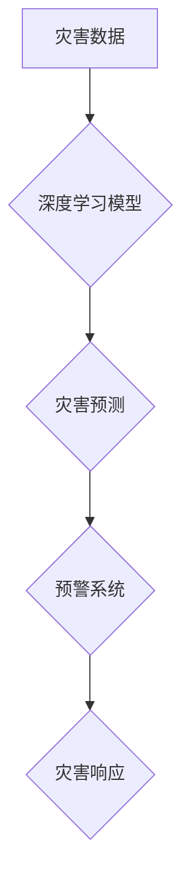

> 深度学习、灾害预防、灾害响应、机器学习、计算机视觉、自然语言处理、预警系统

## 1. 背景介绍

自然灾害是人类社会面临的重大挑战之一，其带来的破坏力和损失令人心痛。从地震、洪水、火灾到疫情，这些灾害无情地侵袭着我们的生活，威胁着人类的安全和福祉。传统的灾害预警和响应系统往往依赖于人类经验和有限的观测数据，难以及时准确地预测和应对灾害的发生。

近年来，深度学习作为机器学习领域的一项突破性技术，凭借其强大的数据处理能力和模式识别能力，为灾害预防与响应领域带来了新的希望。深度学习算法能够从海量数据中提取隐藏的模式和特征，从而实现更精准的灾害预测、更有效的灾害预警和更快速、更精准的灾害响应。

## 2. 核心概念与联系

**2.1 灾害预防与响应**

灾害预防是指通过采取措施减少灾害发生的可能性和影响，而灾害响应是指在灾害发生后采取措施减轻灾害的影响和恢复社会秩序。

**2.2 深度学习**

深度学习是一种机器学习的子领域，它利用多层神经网络来模拟人类大脑的学习过程。深度学习算法能够从海量数据中自动学习特征，从而实现更精准的预测和识别。

**2.3 核心概念联系**

深度学习技术可以应用于灾害预防和响应的各个环节，例如：

* **灾害风险评估:** 利用深度学习算法分析历史灾害数据、地理环境数据和社会经济数据，评估不同地区和人群的灾害风险。
* **灾害预警:** 利用深度学习算法分析实时监测数据，例如气象数据、地震数据和水文数据，预测灾害发生的可能性和时间，及时发出预警。
* **灾害响应:** 利用深度学习算法分析灾害现场图像和视频数据，识别受灾情况、评估灾情程度，指导救援人员进行救援和灾后重建。

**2.4 Mermaid 流程图**



## 3. 核心算法原理 & 具体操作步骤

**3.1 算法原理概述**

深度学习算法的核心是多层神经网络，它由多个神经元组成的层级结构组成。每个神经元接收来自上一层的输入信号，并对其进行处理，然后将处理后的信号传递到下一层。通过多层神经网络的叠加，深度学习算法能够学习到数据中的复杂模式和特征。

**3.2 算法步骤详解**

1. **数据收集和预处理:** 收集相关灾害数据，例如气象数据、地震数据、水文数据、遥感图像等，并进行清洗、格式化和特征提取等预处理操作。
2. **模型构建:** 选择合适的深度学习模型，例如卷积神经网络（CNN）、循环神经网络（RNN）或其变体，并根据具体任务进行模型结构设计和参数设置。
3. **模型训练:** 利用训练数据训练深度学习模型，通过调整模型参数，使模型能够准确地预测或识别灾害相关信息。
4. **模型评估:** 利用测试数据评估模型的性能，例如准确率、召回率、F1-score等指标，并根据评估结果进行模型调优。
5. **模型部署:** 将训练好的模型部署到实际应用场景中，例如灾害预警系统、灾害响应系统等。

**3.3 算法优缺点**

**优点:**

* **高精度:** 深度学习算法能够从海量数据中学习到复杂模式，从而实现更精准的预测和识别。
* **自动化:** 深度学习算法能够自动学习特征，无需人工特征工程，降低了开发成本和时间。
* **可扩展性:** 深度学习算法能够处理海量数据，并可根据需要进行模型扩展。

**缺点:**

* **数据依赖:** 深度学习算法需要大量的数据进行训练，否则模型性能会下降。
* **计算资源:** 深度学习算法训练需要大量的计算资源，例如GPU等。
* **可解释性:** 深度学习模型的决策过程较为复杂，难以解释模型的决策结果。

**3.4 算法应用领域**

深度学习算法在灾害预防与响应领域有着广泛的应用，例如：

* **地震预警:** 利用深度学习算法分析地震波数据，预测地震发生的时间和强度。
* **洪水预警:** 利用深度学习算法分析气象数据、水文数据和地形数据，预测洪水发生的时间和范围。
* **火灾预警:** 利用深度学习算法分析遥感图像和气象数据，预测火灾发生的可能性和范围。
* **疫情预警:** 利用深度学习算法分析疫情数据、人口流动数据和社会行为数据，预测疫情的传播趋势。

## 4. 数学模型和公式 & 详细讲解 & 举例说明

**4.1 数学模型构建**

深度学习模型通常采用多层神经网络结构，每个神经元接收来自上一层的输入信号，并对其进行线性变换和非线性激活函数处理。

**4.2 公式推导过程**

* **线性变换:**

$$
y = Wx + b
$$

其中，$y$ 是神经元的输出，$x$ 是输入信号，$W$ 是权重矩阵，$b$ 是偏置项。

* **非线性激活函数:**

$$
a = f(y)
$$

其中，$a$ 是激活后的输出，$f$ 是非线性激活函数，例如ReLU、Sigmoid、Tanh等。

**4.3 案例分析与讲解**

以卷积神经网络（CNN）为例，其核心操作是卷积和池化。

* **卷积操作:**

$$
C(i,j) = \sum_{m=0}^{M-1} \sum_{n=0}^{N-1} I(i+m,j+n) * K(m,n)
$$

其中，$C(i,j)$ 是卷积核输出的像素值，$I(i+m,j+n)$ 是输入图像的像素值，$K(m,n)$ 是卷积核的权重值。

* **池化操作:**

$$
P(i,j) = \max_{m=0}^{M-1} \max_{n=0}^{N-1} I(i*s+m,j*s+n)
$$

其中，$P(i,j)$ 是池化层的输出像素值，$I(i*s+m,j*s+n)$ 是输入层的像素值，$s$ 是池化窗口的大小。

## 5. 项目实践：代码实例和详细解释说明

**5.1 开发环境搭建**

* 操作系统：Ubuntu 20.04
* Python 版本：3.8
* 深度学习框架：TensorFlow 2.0

**5.2 源代码详细实现**

```python
import tensorflow as tf

# 定义模型结构
model = tf.keras.models.Sequential([
    tf.keras.layers.Conv2D(32, (3, 3), activation='relu', input_shape=(224, 224, 3)),
    tf.keras.layers.MaxPooling2D((2, 2)),
    tf.keras.layers.Conv2D(64, (3, 3), activation='relu'),
    tf.keras.layers.MaxPooling2D((2, 2)),
    tf.keras.layers.Flatten(),
    tf.keras.layers.Dense(10, activation='softmax')
])

# 编译模型
model.compile(optimizer='adam',
              loss='sparse_categorical_crossentropy',
              metrics=['accuracy'])

# 训练模型
model.fit(x_train, y_train, epochs=10)

# 评估模型
loss, accuracy = model.evaluate(x_test, y_test)
print('Test loss:', loss)
print('Test accuracy:', accuracy)
```

**5.3 代码解读与分析**

* 代码首先定义了一个卷积神经网络模型，包含两个卷积层、两个池化层、一个全连接层和一个输出层。
* 然后，模型被编译，指定了优化器、损失函数和评估指标。
* 接着，模型被训练，使用训练数据进行训练。
* 最后，模型被评估，使用测试数据评估模型的性能。

**5.4 运行结果展示**

训练完成后，可以查看模型的训练损失和准确率曲线，以及测试集上的损失和准确率。

## 6. 实际应用场景

**6.1 地震预警系统**

利用深度学习算法分析地震波数据，预测地震发生的时间和强度，及时发出预警，减少地震灾害的损失。

**6.2 洪水预警系统**

利用深度学习算法分析气象数据、水文数据和地形数据，预测洪水发生的时间和范围，及时发出预警，疏散人员，减少洪水灾害的损失。

**6.3 火灾预警系统**

利用深度学习算法分析遥感图像和气象数据，预测火灾发生的可能性和范围，及时发出预警，组织灭火救援，减少火灾灾害的损失。

**6.4 疫情预警系统**

利用深度学习算法分析疫情数据、人口流动数据和社会行为数据，预测疫情的传播趋势，及时采取防控措施，减少疫情的传播和影响。

**6.5 未来应用展望**

随着深度学习技术的不断发展，其在灾害预防与响应领域的应用将更加广泛和深入。例如：

* **多灾种预警:** 利用深度学习算法融合不同灾害类型的数据，实现多灾种联合预警。
* **精准灾害评估:** 利用深度学习算法分析灾害现场图像和视频数据，精准评估灾情程度，指导救援人员进行救援和灾后重建。
* **智能灾害响应:** 利用深度学习算法控制无人机、机器人等智能设备，实现智能灾害响应。

## 7. 工具和资源推荐

**7.1 学习资源推荐**

* **书籍:**
    * 深度学习
    * 深度学习实战
    * 深度学习与自然语言处理
* **在线课程:**
    * Coursera 深度学习课程
    * Udacity 深度学习工程师 Nanodegree
    * fast.ai 深度学习课程

**7.2 开发工具推荐**

* **深度学习框架:** TensorFlow, PyTorch, Keras
* **数据处理工具:** Pandas, NumPy
* **可视化工具:** Matplotlib, Seaborn

**7.3 相关论文推荐**

* **灾害预警:**
    * Deep Learning for Disaster Risk Reduction
    * A Deep Learning Approach to Earthquake Early Warning
* **灾害响应:**
    * Deep Learning for Disaster Response: A Survey
    * Using Deep Learning for Damage Assessment after Natural Disasters

## 8. 总结：未来发展趋势与挑战

**8.1 研究成果总结**

深度学习技术在灾害预防与响应领域取得了显著的成果，例如提高了灾害预警的准确率、加速了灾害响应的速度、增强了灾害评估的精准度。

**8.2 未来发展趋势**

* **多灾种预警:** 将深度学习应用于多灾种联合预警，实现更全面的灾害风险管理。
* **精准灾害评估:** 利用深度学习技术分析灾害现场图像和视频数据，更精准地评估灾情程度，指导救援人员进行救援和灾后重建。
* **智能灾害响应:** 利用深度学习控制无人机、机器人等智能设备，实现智能灾害响应，提高灾害应对效率。

**8.3 面临的挑战**

* **数据获取和标注:** 深度学习算法需要大量的数据进行训练，而灾害数据往往稀缺和难以标注。
* **模型解释性和可信度:** 深度学习模型的决策过程较为复杂，难以解释模型的决策结果，这可能会影响