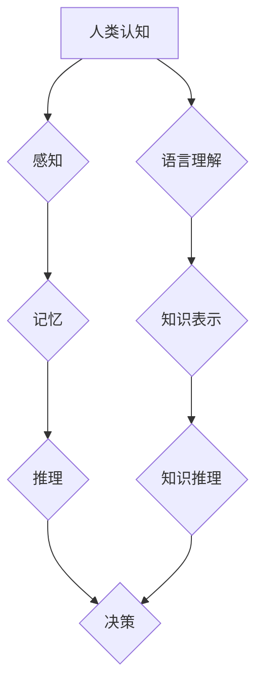

> 人工智能，认知科学，深度学习，神经网络，自然语言处理，计算机视觉，知识图谱，机器学习，认知计算

## 1. 背景介绍

人工智能（AI）正以惊人的速度发展，从自动驾驶到医疗诊断，从个性化教育到艺术创作，AI正在深刻地改变着我们的生活。然而，AI的本质是什么？它如何模拟人类的认知能力？这些问题一直是人工智能领域的核心议题。

人类的认知能力是极其复杂的，它涉及感知、记忆、推理、语言理解和决策等多个方面。长期以来，科学家们试图用计算机科学的方法来理解和模拟人类的认知过程。从早期的符号人工智能到如今的深度学习，人工智能的发展历程就是对人类认知的不断探索和尝试。

## 2. 核心概念与联系

**2.1 人工智能与认知科学**

人工智能的目标是构建能够像人类一样思考和学习的机器。而认知科学则致力于理解人类的思维过程，包括感知、记忆、语言、推理和决策等。人工智能和认知科学是相互补充的两个学科，人工智能的发展离不开对认知科学的借鉴，而认知科学的研究也能够从人工智能的成果中获得启发。

**2.2 深度学习与神经网络**

深度学习是人工智能领域近年来取得突破性进展的技术之一。它利用多层神经网络来模拟大脑的结构和功能，能够从海量数据中学习复杂的模式和关系。神经网络的结构和学习机制与人类大脑的神经元网络具有相似之处，因此深度学习被认为是模拟人类认知能力的一种有效途径。

**2.3 知识图谱与语义理解**

知识图谱是一种结构化的知识表示形式，它将实体和关系以图的形式表示出来。语义理解是指机器能够理解和解释人类语言的含义。知识图谱和语义理解是人工智能领域的重要研究方向，它们能够帮助机器更好地理解和处理人类语言信息，从而更接近人类的认知能力。

**Mermaid 流程图**



## 3. 核心算法原理 & 具体操作步骤

### 3.1 算法原理概述

深度学习算法的核心是神经网络，它由多个层级的神经元组成。每个神经元接收来自上一层的输入信号，并对其进行处理，然后将处理后的信号传递到下一层。通过调整神经网络的权重和偏置，可以使神经网络学习到数据的特征和模式。

### 3.2 算法步骤详解

1. **数据预处理:** 将原始数据转换为深度学习算法可以处理的形式，例如归一化、编码等。
2. **网络结构设计:** 根据任务需求设计神经网络的结构，包括层数、神经元数量、激活函数等。
3. **参数初始化:** 为神经网络的权重和偏置赋予初始值。
4. **前向传播:** 将输入数据通过神经网络进行前向传播，得到输出结果。
5. **损失函数计算:** 计算输出结果与真实值的差异，即损失函数的值。
6. **反向传播:** 根据损失函数的梯度，反向传播误差信号，更新神经网络的权重和偏置。
7. **迭代训练:** 重复步骤4-6，直到损失函数达到预设的阈值。

### 3.3 算法优缺点

**优点:**

* 能够学习复杂的非线性关系。
* 具有强大的泛化能力。
* 在图像识别、自然语言处理等领域取得了突破性进展。

**缺点:**

* 需要大量的训练数据。
* 训练过程耗时且资源消耗大。
* 模型解释性较差。

### 3.4 算法应用领域

深度学习算法广泛应用于各个领域，例如：

* **计算机视觉:** 图像识别、物体检测、图像分割、人脸识别等。
* **自然语言处理:** 文本分类、情感分析、机器翻译、对话系统等。
* **语音识别:** 语音转文本、语音搜索等。
* **医疗诊断:** 疾病预测、图像分析、药物研发等。
* **金融分析:** 风险评估、欺诈检测、投资预测等。

## 4. 数学模型和公式 & 详细讲解 & 举例说明

### 4.1 数学模型构建

深度学习算法的核心是神经网络，它可以看作是一个多层感知机。每个神经元接收来自上一层的输入信号，并对其进行线性变换和非线性激活函数处理，然后将处理后的信号传递到下一层。

**神经元模型:**

$$
y = f(w^T x + b)
$$

其中：

* $x$ 是输入信号向量。
* $w$ 是权重向量。
* $b$ 是偏置项。
* $f$ 是激活函数。
* $y$ 是输出信号。

### 4.2 公式推导过程

深度学习算法的训练过程是通过反向传播算法来实现的。反向传播算法的核心是计算损失函数对神经网络参数的梯度，然后根据梯度更新参数值。

**损失函数:**

$$
L = \frac{1}{N} \sum_{i=1}^{N} (y_i - \hat{y}_i)^2
$$

其中：

* $N$ 是样本数量。
* $y_i$ 是真实值。
* $\hat{y}_i$ 是预测值。

**梯度下降算法:**

$$
\theta = \theta - \alpha \nabla L(\theta)
$$

其中：

* $\theta$ 是参数向量。
* $\alpha$ 是学习率。
* $\nabla L(\theta)$ 是损失函数对参数的梯度。

### 4.3 案例分析与讲解

**图像分类:**

假设我们有一个图像分类任务，目标是将图像分类为不同的类别，例如猫、狗、鸟等。我们可以使用深度学习算法来训练一个图像分类模型。

训练过程如下：

1. 收集大量的图像数据，并将其标记为不同的类别。
2. 设计一个深度神经网络，例如卷积神经网络（CNN）。
3. 使用反向传播算法训练神经网络，使模型能够将图像分类为不同的类别。
4. 使用测试数据评估模型的性能。

## 5. 项目实践：代码实例和详细解释说明

### 5.1 开发环境搭建

* 操作系统：Ubuntu 20.04
* Python 版本：3.8
* 深度学习框架：TensorFlow 2.0

### 5.2 源代码详细实现

```python
import tensorflow as tf

# 定义模型结构
model = tf.keras.models.Sequential([
    tf.keras.layers.Conv2D(32, (3, 3), activation='relu', input_shape=(28, 28, 1)),
    tf.keras.layers.MaxPooling2D((2, 2)),
    tf.keras.layers.Conv2D(64, (3, 3), activation='relu'),
    tf.keras.layers.MaxPooling2D((2, 2)),
    tf.keras.layers.Flatten(),
    tf.keras.layers.Dense(10, activation='softmax')
])

# 编译模型
model.compile(optimizer='adam',
              loss='sparse_categorical_crossentropy',
              metrics=['accuracy'])

# 训练模型
model.fit(x_train, y_train, epochs=5)

# 评估模型
loss, accuracy = model.evaluate(x_test, y_test)
print('Test loss:', loss)
print('Test accuracy:', accuracy)
```

### 5.3 代码解读与分析

这段代码定义了一个简单的卷积神经网络模型，用于手写数字识别任务。

* `tf.keras.models.Sequential` 创建了一个顺序模型，即层级结构。
* `tf.keras.layers.Conv2D` 定义了一个卷积层，用于提取图像特征。
* `tf.keras.layers.MaxPooling2D` 定义了一个最大池化层，用于降维和提高模型鲁棒性。
* `tf.keras.layers.Flatten` 将多维特征转换为一维向量。
* `tf.keras.layers.Dense` 定义了一个全连接层，用于分类。
* `model.compile` 编译模型，指定优化器、损失函数和评价指标。
* `model.fit` 训练模型，使用训练数据进行训练。
* `model.evaluate` 评估模型，使用测试数据计算损失和准确率。

### 5.4 运行结果展示

训练完成后，模型的准确率通常会达到较高的水平，例如98%以上。

## 6. 实际应用场景

### 6.1 医疗诊断

深度学习算法可以用于辅助医生进行疾病诊断，例如识别肺结核、乳腺癌等。

### 6.2 自动驾驶

深度学习算法可以用于训练自动驾驶汽车的感知系统，例如识别道路标志、车辆和行人。

### 6.3 个性化教育

深度学习算法可以用于个性化教育，例如根据学生的学习进度和能力提供定制化的学习内容。

### 6.4 未来应用展望

随着人工智能技术的不断发展，深度学习算法将在更多领域得到应用，例如：

* **药物研发:** 预测药物的有效性和安全性。
* **金融风险管理:** 识别和预测金融风险。
* **科学发现:** 探索新的科学规律和知识。

## 7. 工具和资源推荐

### 7.1 学习资源推荐

* **书籍:**
    * 深度学习 (Deep Learning) - Ian Goodfellow, Yoshua Bengio, Aaron Courville
    * 人工神经网络 (Artificial Neural Networks) - Simon Haykin
* **在线课程:**
    * 深度学习 Specialization - Andrew Ng (Coursera)
    * fast.ai - Practical Deep Learning for Coders
* **博客和网站:**
    * TensorFlow Blog
    * PyTorch Blog
    * Towards Data Science

### 7.2 开发工具推荐

* **深度学习框架:** TensorFlow, PyTorch, Keras
* **编程语言:** Python
* **数据处理工具:** Pandas, NumPy

### 7.3 相关论文推荐

* **ImageNet Classification with Deep Convolutional Neural Networks** - Alex Krizhevsky, Ilya Sutskever, Geoffrey E. Hinton
* **Attention Is All You Need** - Ashish Vaswani, Noam Shazeer, Niki Parmar, Jakob Uszkoreit, Llion Jones, Aidan N. Gomez, Łukasz Kaiser, Illia Polosukhin
* **BERT: Pre-training of Deep Bidirectional Transformers for Language Understanding** - Jacob Devlin, Ming-Wei Chang, Kenton Lee, Kristina Toutanova

## 8. 总结：未来发展趋势与挑战

### 8.1 研究成果总结

近年来，深度学习算法取得了令人瞩目的成果，在图像识别、自然语言处理、语音识别等领域取得了突破性进展。这些成果表明，深度学习算法已经成为人工智能领域的核心技术之一。

### 8.2 未来发展趋势

* **模型规模和复杂度提升:** 未来深度学习模型的规模和复杂度将继续提升，例如使用更大的数据集、更深的网络结构和更强大的计算资源。
* **模型解释性和可解释性增强:** 如何更好地理解和解释深度学习模型的决策过程是未来研究的重要方向。
* **跨模态学习:** 融合不同模态的数据，例如文本、图像、音频等，进行学习和推理。
* **边缘计算和部署:** 将深度学习模型部署到边缘设备上，实现更快速的响应和更低的延迟。

### 8.3 面临的挑战

* **数据获取和标注:** 深度学习算法需要大量的训练数据，而获取和标注高质量数据仍然是一个挑战。
* **计算资源需求:** 训练大型深度学习模型需要大量的计算资源，这对于资源有限的机构和个人来说是一个障碍。
* **模型安全性与可靠性:** 深度学习模型容易受到攻击和操纵，因此需要提高模型的安全性与可靠性。
* **伦理问题:** 深度学习技术的应用可能会带来一些