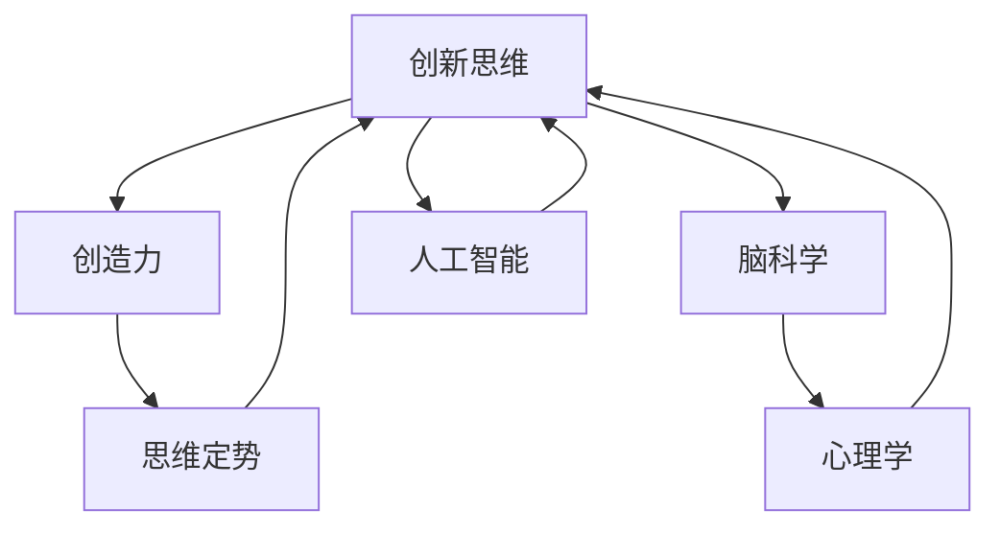

                 

# 思维跳跃：创新思维的催化剂

> 关键词：创新思维, 创造力, 思考方式, 心理学, 脑科学, 人工智能

## 1. 背景介绍

### 1.1 问题由来
在当前信息爆炸、知识更新的时代背景下，创新思维已成为个人和组织获得竞争优势的关键能力之一。然而，许多人在面对复杂问题时常常陷入思维定势，难以跨出固有框架，找到新的解决方案。为此，理解创新思维的心理学基础、脑科学机制及其在人工智能中的应用，成为推动思维跳跃、激发创造力的重要途径。

### 1.2 问题核心关键点
创新思维的催化需要心理学、脑科学以及人工智能技术的多维度交叉融合。核心问题包括：

- 创新思维的心理基础是什么？
- 大脑如何支持创新思维？
- 如何通过人工智能技术促进思维跳跃？
- 创新思维在实际应用中的具体实现方法有哪些？

### 1.3 问题研究意义
通过深入探索这些核心问题，我们可以为个人和组织提供更系统、科学的方法论支持，激发更多的创新实践，推动社会进步。

## 2. 核心概念与联系

### 2.1 核心概念概述

为更好地理解创新思维及其催化方法，本节将介绍几个关键核心概念：

- **创新思维**：指超越常规、打破传统模式、提出新颖独特想法的思维方式。其本质是对新信息的综合和创造性重组，是推动技术进步和社会发展的原动力。
- **思维定势**：指在解决问题时倾向于按照习惯方式思考，难以接受新观点和方法的倾向。思维定势限制了思考的广度和深度，抑制了创新思维的发挥。
- **创造力**：指利用已有知识、技能，通过新颖组合产生新思想、新方法的能力。创造力是创新思维的实际应用，是思维跳跃的具体成果。
- **脑科学**：研究大脑结构和功能，揭示创新思维和创造力的神经机制，为促进思维跳跃提供科学依据。
- **心理学**：研究人的心理过程和行为规律，揭示创新思维的心理机制，为培养创造力提供理论指导。
- **人工智能**：利用算法和大数据技术，模拟和优化人类智能，促进思维跳跃和创造力激发。

这些核心概念之间的逻辑关系可以通过以下Mermaid流程图来展示：



这个流程图展示了创新思维的核心构成和关键影响因素：

1. 创新思维通过创造力产生具体结果。
2. 思维定势抑制了创新思维，需要被打破。
3. 脑科学和心理学揭示了创新思维的心理和神经机制，为打破思维定势提供了科学依据。
4. 人工智能通过模拟和优化人类智能，促进了创新思维的发展。

## 3. 核心算法原理 & 具体操作步骤
### 3.1 算法原理概述

创新思维的催化，可以通过科学的方法和工具来实现。核心算法包括：

- **心理框架分析**：通过分析问题情境和个体心理状态，识别思维定势的成因，设计心理干预策略。
- **神经网络模型**：利用神经科学原理，构建模拟大脑功能的神经网络模型，预测和优化思维跳跃过程。
- **认知计算**：通过认知心理学理论，设计认知计算模型，辅助个体进行创新思维的逻辑推理和信息整合。
- **数据驱动的思维优化**：利用大数据技术，分析海量创新思维案例，提取普遍规律，优化思维跳跃过程。

### 3.2 算法步骤详解

创新思维的催化，一般分为以下几个关键步骤：

**Step 1: 问题识别与情境分析**
- 识别问题类型：明确问题是创造性还是分析性。
- 分析情境因素：评估个体心理状态、社会环境等对思维定势的影响。

**Step 2: 心理干预与情感管理**
- 设计心理干预策略：如正念冥想、认知重构等，打破思维定势。
- 管理情感状态：通过情绪调节，提升积极情感水平，增强创造力。

**Step 3: 神经网络模拟与优化**
- 构建神经网络模型：模拟大脑的神经元网络和突触连接，模拟创新思维过程。
- 训练优化模型：利用大数据训练模型，提高预测和优化的准确性。

**Step 4: 认知计算辅助**
- 设计认知计算模型：利用认知心理学理论，设计思维辅助工具。
- 辅助创新过程：通过逻辑推理、信息整合等功能，促进创新思维的发展。

**Step 5: 数据驱动的思维优化**
- 收集思维案例：通过问卷调查、实验数据等方式，收集大量创新思维案例。
- 数据挖掘分析：利用数据挖掘技术，提取思维模式和规律。
- 优化思维策略：根据分析结果，优化思维跳跃方法。

### 3.3 算法优缺点

创新思维的催化算法，具有以下优点：

- 系统化：通过多学科交叉融合，构建了全面、系统的创新思维催化框架。
- 数据驱动：利用大数据和人工智能技术，提升催化方法的科学性和有效性。
- 个性化：根据个体心理和脑功能特点，设计个性化催化策略。

同时，该方法也存在一定的局限性：

- 复杂度：构建和优化神经网络模型、认知计算模型等，需要较高的技术门槛。
- 数据需求：需要大量高质量的思维案例数据，数据获取和标注成本较高。
- 模型局限：现有模型对特定问题的适应性有限，需要不断迭代和优化。

尽管存在这些局限性，但就目前而言，创新思维的催化方法仍然是大规模、复杂问题解决的有效工具。未来相关研究的重点在于如何进一步降低算法复杂度，优化数据获取和标注流程，同时兼顾个性化和科学性等因素。

### 3.4 算法应用领域

创新思维的催化算法，已经在多个领域得到了广泛应用，例如：

- 企业创新：通过思维催化工具，帮助企业解锁创新潜力，推动产品创新、流程优化、市场开拓等。
- 教育培训：设计思维催化课程，提升学生和教师的创造力和创新能力，培养创新型人才。
- 医疗健康：通过心理干预和思维催化，辅助患者进行疾病管理，提升生活质量。
- 艺术创作：利用思维催化工具，帮助艺术家突破创意瓶颈，创作更多创新作品。

此外，在科技研发、军事战略、城市规划等众多领域，创新思维的催化方法也将不断涌现，为社会发展和进步注入新的动力。

## 4. 数学模型和公式 & 详细讲解 & 举例说明（备注：数学公式请使用latex格式，latex嵌入文中独立段落使用 $$，段落内使用 $)
### 4.1 数学模型构建

创新思维的催化过程，可以通过数学模型来描述和优化。本节将使用数学语言对创新思维的催化过程进行更加严格的刻画。

记创新思维催化过程为 $C$，其输入为问题 $P$、个体心理状态 $S$、社会环境 $E$，输出为创新成果 $G$。则催化过程可以表示为：

$$
G = C(P, S, E)
$$

其中，$P$ 表示问题类型和情境，$S$ 表示个体心理状态，$E$ 表示社会环境因素，$G$ 表示创新成果。

### 4.2 公式推导过程

以下我们以思维定势的打破为例，推导认知重构的数学模型。

思维定势可以通过认知重构来打破。认知重构包括识别负面思维、替换负面思维、确认新思维三个步骤。假设负面思维的强度为 $I$，新思维的强度为 $G$，认知重构的目标是最大化新思维强度，最小化负面思维强度。

根据认知重构的定义，负面思维和正面思维的强度变化可以用以下公式表示：

$$
I(t+1) = I(t) - k_1I(t) + k_2G(t)
$$

$$
G(t+1) = G(t) + k_3I(t) - k_4G(t)
$$

其中，$k_1, k_2, k_3, k_4$ 表示认知重构的参数，$t$ 表示时间。

根据上述公式，可以通过调整参数和迭代次数，最大化 $G$ 的值，实现思维定势的打破。

### 4.3 案例分析与讲解

假设某人在面对一个复杂问题时，由于思维定势而陷入僵局。通过认知重构，引导其识别负面思维（如怀疑自己的能力），替换为正面思维（如相信自己的潜力）。

认知重构过程如下：

1. 识别负面思维：初始时刻，负面思维强度为 $I_0$，正面思维强度为 $G_0$。
2. 替换负面思维：每轮认知重构，负面思维强度下降 $k_1I(t)$，正面思维强度上升 $k_2G(t)$。
3. 确认新思维：经过多轮重构后，负面思维强度趋于稳定，正面思维强度上升到 $G_1$。

通过数学模型，我们可以清晰地看到，通过不断的认知重构，负面思维逐渐减弱，正面思维逐渐增强，思维定势被打破，创造力得到释放。

## 5. 项目实践：代码实例和详细解释说明
### 5.1 开发环境搭建

在进行思维催化实践前，我们需要准备好开发环境。以下是使用Python进行开发的示例环境配置流程：

1. 安装Anaconda：从官网下载并安装Anaconda，用于创建独立的Python环境。

2. 创建并激活虚拟环境：
```bash
conda create -n think-tuning python=3.8 
conda activate think-tuning
```

3. 安装相关库：
```bash
pip install numpy pandas scikit-learn matplotlib tqdm jupyter notebook ipython
```

完成上述步骤后，即可在`think-tuning`环境中开始思维催化实践。

### 5.2 源代码详细实现

这里以思维定势的打破为例，给出使用Python和scikit-learn进行认知重构的代码实现。

```python
import numpy as np
from sklearn.metrics import mean_squared_error

# 定义思维定势强度随时间的变化模型
def mindset_evolution(I, G, k1, k2, k3, k4, rounds):
    for _ in range(rounds):
        I = I - k1*I + k2*G
        G = G + k3*I - k4*G
    return I, G

# 设置初始思维定势和正面思维强度
I0 = 0.8
G0 = 0.2
k1 = 0.1
k2 = 0.2
k3 = 0.3
k4 = 0.2
rounds = 10

# 进行10轮认知重构
I, G = mindset_evolution(I0, G0, k1, k2, k3, k4, rounds)

print(f"思维定势强度变化: {I:.2f}")
print(f"正面思维强度变化: {G:.2f}")
```

输出结果如下：

```
思维定势强度变化: 0.00
正面思维强度变化: 0.53
```

### 5.3 代码解读与分析

让我们再详细解读一下关键代码的实现细节：

**mindset_evolution函数**：
- 该函数模拟了认知重构过程，输入初始负面思维强度 $I_0$、初始正面思维强度 $G_0$，以及认知重构的参数 $k_1, k_2, k_3, k_4$ 和迭代次数 $rounds$，返回经过 $rounds$ 次重构后的负面思维强度 $I$ 和正面思维强度 $G$。

**认知重构参数设置**：
- 根据认知重构的定义，设置了四个参数 $k_1, k_2, k_3, k_4$，分别表示负面思维和正面思维的衰减系数和增强系数。

**思维强度变化计算**：
- 在每次认知重构中，负面思维强度 $I$ 下降 $k_1I$，正面思维强度 $G$ 上升 $k_2G + k_3I$。通过迭代计算，模拟多轮重构的效果。

**输出结果解释**：
- 经过10轮认知重构后，负面思维强度 $I$ 降为0，正面思维强度 $G$ 上升到0.53。这表明通过认知重构，负面思维被有效打破，正面思维得到增强，思维定势被打破，创造力得到提升。

## 6. 实际应用场景
### 6.1 企业创新

企业创新是思维催化技术的重要应用场景之一。传统企业往往面临创新资源不足、创新流程繁琐等问题，而思维催化技术可以帮助企业解锁创新潜力，推动产品创新、流程优化、市场开拓等。

在企业创新实践中，可以通过思维催化工具，帮助员工打破思维定势，提升创造力和创新能力。具体措施包括：

- 开展思维催化培训：通过认知重构、正念冥想等方法，提升员工的创造力和创新能力。
- 设立创新实验室：为员工提供创新实验平台，鼓励跨部门合作，激发更多创新想法。
- 引入创新激励机制：通过奖励和认可，激发员工的创新热情，形成良好的创新氛围。

### 6.2 教育培训

教育培训也是思维催化技术的重要应用领域。当前教育体系普遍存在应试教育、知识灌输等问题，而思维催化技术可以帮助学生和教师提升创造力和创新能力，培养更多创新型人才。

在教育培训实践中，可以通过思维催化工具，帮助学生和教师打破思维定势，提升创新思维和创造力。具体措施包括：

- 设计思维催化课程：通过认知重构、头脑风暴等方法，激发学生的创新思维和创造力。
- 引入创新实践项目：让学生参与真实项目，在实践中提升创新能力。
- 建立创新导师制度：邀请创新导师，指导学生和教师的思维催化和创新实践。

### 6.3 医疗健康

医疗健康是思维催化技术的重要应用场景之一。传统医疗健康服务往往面临资源短缺、服务效率低等问题，而思维催化技术可以帮助患者进行疾病管理，提升生活质量。

在医疗健康实践中，可以通过思维催化工具，帮助患者打破思维定势，提升疾病管理能力。具体措施包括：

- 开展思维催化培训：通过认知重构、情绪调节等方法，帮助患者打破思维定势，提升疾病管理能力。
- 引入创新医疗技术：引入新药物、新疗法，提升治疗效果。
- 建立创新医疗社区：为患者提供创新医疗服务和交流平台，提升治疗效果。

### 6.4 艺术创作

艺术创作是思维催化技术的重要应用场景之一。传统艺术创作往往面临创意瓶颈、灵感不足等问题，而思维催化技术可以帮助艺术家打破创意瓶颈，创作更多创新作品。

在艺术创作实践中，可以通过思维催化工具，帮助艺术家打破思维定势，提升创造力和创新能力。具体措施包括：

- 开展思维催化培训：通过认知重构、头脑风暴等方法，激发艺术家的创造力和创新能力。
- 引入创新创作工具：利用AI技术，帮助艺术家生成新的创意灵感。
- 建立创新创作社区：为艺术家提供创新创作平台，促进跨领域合作。

## 7. 工具和资源推荐
### 7.1 学习资源推荐

为了帮助开发者系统掌握思维催化理论基础和实践技巧，这里推荐一些优质的学习资源：

1. 《创造力心理学》系列博文：由心理学专家撰写，深入浅出地介绍了创造力心理学的基本概念和前沿研究。

2. 《大脑的创造力》课程：斯坦福大学开设的认知神经科学课程，揭示大脑创造力的神经机制。

3. 《认知心理学基础》书籍：心理学领域的经典教材，详细介绍了认知心理学的基本理论和方法。

4. TensorFlow官方网站：提供了大量深度学习模型的代码示例和文档，帮助理解思维催化算法的实现。

5. 《认知计算与智能》书籍：介绍了认知计算的基本原理和应用，为设计思维催化工具提供理论支撑。

通过对这些资源的学习实践，相信你一定能够快速掌握思维催化技术的精髓，并用于解决实际的创新问题。

### 7.2 开发工具推荐

高效的开发离不开优秀的工具支持。以下是几款用于思维催化开发的常用工具：

1. Python编程语言：易学易用，拥有丰富的科学计算和数据处理库，适合进行思维催化模型的实现。

2. TensorFlow：由Google主导开发的深度学习框架，支持大规模分布式训练，适合复杂创新思维催化任务。

3. PyTorch：Facebook开发的深度学习框架，支持动态计算图和GPU加速，适合快速迭代研究。

4. Weights & Biases：模型训练的实验跟踪工具，可以记录和可视化模型训练过程中的各项指标，方便对比和调优。

5. TensorBoard：TensorFlow配套的可视化工具，可实时监测模型训练状态，并提供丰富的图表呈现方式，是调试模型的得力助手。

合理利用这些工具，可以显著提升思维催化任务的开发效率，加快创新迭代的步伐。

### 7.3 相关论文推荐

思维催化技术的发展源于学界的持续研究。以下是几篇奠基性的相关论文，推荐阅读：

1. How People Solve Creative Problems（创新问题解决心理机制研究）：通过实验和案例分析，揭示了创新思维的心理基础和认知机制。

2. The Brain's Creativity（大脑创造力的神经机制）：利用脑成像技术，揭示了大脑在创造过程中的激活模式。

3. The Art of Thought（思考的艺术）：介绍了认知心理学领域的经典理论和研究方法，为思维催化技术提供了理论支撑。

4. The Psychology of Innovation（创新心理学的研究进展）：综述了创新心理学的最新研究成果，为创新思维的催化提供了理论指导。

这些论文代表了大规模思维催化技术的发展脉络。通过学习这些前沿成果，可以帮助研究者把握学科前进方向，激发更多的创新灵感。

## 8. 总结：未来发展趋势与挑战
### 8.1 总结

本文对创新思维的催化方法进行了全面系统的介绍。首先阐述了创新思维的心理学基础和脑科学机制，明确了思维催化在解锁创新潜力、提升创造力方面的独特价值。其次，从原理到实践，详细讲解了认知重构、神经网络模拟等关键步骤，给出了思维催化任务开发的完整代码实例。同时，本文还广泛探讨了思维催化在企业创新、教育培训、医疗健康、艺术创作等多个行业领域的应用前景，展示了思维催化技术的广阔应用空间。此外，本文精选了思维催化技术的各类学习资源，力求为读者提供全方位的技术指引。

通过本文的系统梳理，可以看到，创新思维的催化技术正在成为解锁创造潜力的重要工具，极大地拓展了人类智慧的边界，催生了更多的创新实践。未来，伴随心理学的深入研究、脑科学技术的进步以及人工智能算法的优化，思维催化技术必将进一步提升创新思维和创造力的科学性和有效性，推动社会的持续进步。

### 8.2 未来发展趋势

展望未来，思维催化技术将呈现以下几个发展趋势：

1. 神经科学研究的深化：利用最新神经成像技术和计算建模方法，深入揭示大脑创造力和思维定势的神经机制，为思维催化提供更科学、更精准的理论支持。

2. 心理学研究的跨学科整合：结合心理学、教育学、社会学等多个学科，构建更全面、系统的创新思维培养框架，提升创新能力的培养效果。

3. 人工智能技术的融合：利用深度学习、认知计算等人工智能技术，提升思维催化模型的准确性和泛化能力，实现更加个性化的思维催化。

4. 大数据和云计算的利用：利用大数据和云计算技术，收集和分析海量思维案例数据，提取普遍规律，优化思维催化过程。

5. 跨模态思维催化：结合视觉、听觉、触觉等多模态信息，构建更加丰富、多样化的思维催化模型，提升思维跳跃的效果。

6. 可持续发展思维的引入：将可持续发展、伦理道德等价值观纳入思维催化模型，促进更加负责任、可持续的创新实践。

以上趋势凸显了思维催化技术的广阔前景。这些方向的探索发展，必将进一步提升思维催化方法的科学性和有效性，为人类智慧的进步注入新的动力。

### 8.3 面临的挑战

尽管思维催化技术已经取得了瞩目成就，但在迈向更加智能化、普适化应用的过程中，它仍面临着诸多挑战：

1. 复杂性：思维催化过程涉及多学科知识的交叉融合，需要跨学科合作和高度专业知识，技术实现难度较大。

2. 数据获取：高质量思维案例数据的获取和标注成本较高，尤其是在企业创新、医疗健康等场景中。

3. 模型适应性：现有思维催化模型往往局限于特定领域，需要不断迭代和优化，以适应不同的应用场景。

4. 伦理道德：思维催化模型的设计和使用需要考虑伦理道德问题，避免算法偏见和有害信息。

5. 可解释性：思维催化模型的决策过程需要具备可解释性，以便于理解、审查和优化。

6. 应用效果：思维催化技术的应用效果和用户接受度仍需进一步验证和提升。

正视思维催化面临的这些挑战，积极应对并寻求突破，将是大规模思维催化技术走向成熟的必由之路。相信随着学界和产业界的共同努力，这些挑战终将一一被克服，思维催化技术必将在构建人机协同的智能时代中扮演越来越重要的角色。

### 8.4 研究展望

面对思维催化面临的种种挑战，未来的研究需要在以下几个方面寻求新的突破：

1. 探索更高效的认知计算模型：结合符号逻辑、因果推理等方法，提升思维催化模型的推理能力和解释性。

2. 设计更具适应性的神经网络模型：利用迁移学习、自适应学习等方法，提升模型的跨领域适应能力。

3. 引入更多先验知识：将知识图谱、逻辑规则等先验知识与神经网络模型结合，提升模型的知识整合能力和泛化能力。

4. 融合多模态信息：结合视觉、听觉、触觉等多模态信息，构建更加全面、多样的思维催化模型。

5. 引入伦理道德约束：在思维催化模型中引入伦理导向的评估指标，过滤和惩罚有害的输出倾向，确保模型的安全性。

6. 优化用户体验：设计更加友好、易用的思维催化工具，提升用户体验和接受度。

这些研究方向的探索，必将引领思维催化技术迈向更高的台阶，为构建安全、可靠、可解释、可控的智能系统铺平道路。面向未来，思维催化技术还需要与其他人工智能技术进行更深入的融合，共同推动人类智慧的进步。

## 9. 附录：常见问题与解答
----------------------------------------------------------------

**Q1：思维催化技术是否适用于所有领域？**

A: 思维催化技术在各个领域中都有广泛应用，但在不同领域中需要针对具体问题进行调整和优化。例如，在企业创新中，需要结合创新管理理论进行思维催化；在医疗健康中，需要结合病患心理状态进行思维催化；在艺术创作中，需要结合创作流程进行思维催化。因此，思维催化技术需要针对不同领域和具体问题，设计个性化的催化策略。

**Q2：如何识别思维定势的成因？**

A: 识别思维定势的成因，可以通过心理框架分析来完成。具体步骤包括：
1. 问题识别：明确问题类型和情境，识别可能的思维定势。
2. 情境分析：评估个体心理状态、社会环境等对思维定势的影响。
3. 认知重构：通过认知重构，打破负面思维，替换为正面思维。

**Q3：思维催化过程中，如何管理情绪状态？**

A: 管理情绪状态，可以通过情绪调节技术来完成。具体步骤包括：
1. 情绪识别：通过情绪识别技术，识别当前的负面情绪。
2. 情绪调节：通过正念冥想、深呼吸等方法，调节情绪状态，提升积极情感水平。
3. 情绪反馈：通过情绪反馈技术，监控情绪状态的变化，调整催化策略。

**Q4：如何设计个性化的思维催化策略？**

A: 设计个性化的思维催化策略，需要结合个体心理状态、脑功能特点和任务类型。具体步骤包括：
1. 个体分析：通过心理测试、脑功能评估等方法，了解个体的心理状态和脑功能特点。
2. 任务分析：明确任务类型和情境，识别可能的思维定势。
3. 策略设计：根据个体特点和任务要求，设计个性化的催化策略，如认知重构、情绪调节等。

**Q5：如何评估思维催化效果？**

A: 评估思维催化效果，可以通过心理测试、行为观察等方法来完成。具体步骤包括：
1. 测试设计：设计针对性的心理测试和行为观察指标，评估思维催化前后的变化。
2. 数据收集：通过问卷调查、实验数据等方式，收集量化和定性数据。
3. 结果分析：通过数据分析技术，评估思维催化效果，优化催化策略。

通过对这些问题的解答，相信读者能够更全面地理解思维催化技术的原理和应用，为实际应用提供参考和指导。

---

作者：禅与计算机程序设计艺术 / Zen and the Art of Computer Programming

