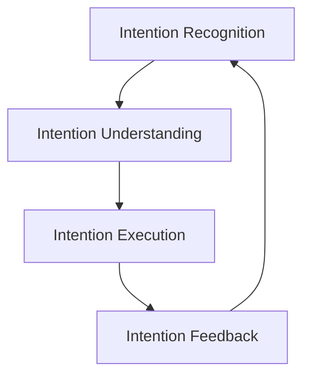
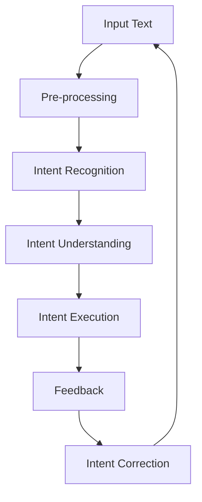

                 

# 意图对齐:自然语言理解的终极目标

## 1. 背景介绍

### 1.1 问题由来

自然语言处理(Natural Language Processing, NLP)技术的迅速发展，使得机器理解和生成自然语言的能力有了显著提升。然而，即便是最先进的NLP模型，也常常无法准确捕捉到人类意图，导致信息传达的偏差和误解。

这一现象可以追溯到AI技术发展的早期阶段，当机器学习专家们首次尝试解决语义理解问题时，就开始面临"意图对齐"的挑战。意图对齐是指模型能够准确理解用户输入的语言意图，并提供相应的输出。这对于构建能够与人类自然交互的智能系统至关重要。

### 1.2 问题核心关键点

意图对齐的问题可以概括为以下几点：

- **多义性**：自然语言的模糊性和多义性使得单一词语或句子可能具有多种含义，机器需要具备上下文理解能力，从多个解释中选择最合理的。
- **多样性**：人们表达意图的语言形式多种多样，模型需要具备处理复杂句法结构、语用表达和变体方言的能力。
- **情境理解**：用户的意图往往受到情境因素（如时间、地点、用户历史行为等）的影响，模型需要具备综合情境的能力，准确解读隐含信息。
- **反馈修正**：意图对齐并不是一次性的任务，机器需要通过不断与用户交互，学习用户偏好和习惯，进行自我修正。

这些核心点表明，意图对齐是自然语言理解(NLU)的终极目标，也是衡量NLP模型性能的关键指标。

### 1.3 问题研究意义

研究意图对齐的根本意义在于构建更加智能、高效、可靠的自然语言处理系统。意图对齐能够：

- **提升用户体验**：准确理解用户意图，为用户提供量身定制的响应，提高交互效率和满意度。
- **促进跨语言交流**：打破语言障碍，实现跨语言间的无缝沟通，增强全球化的协作与交流。
- **驱动智能应用**：为诸如智能客服、个性化推荐、智能翻译等应用提供坚实基础，推动相关产业的智能化转型。
- **推动AI技术成熟**：意图对齐技术的突破，能够反映AI技术在理解复杂语言场景上的进步，为更高层次的AI系统建设提供参考。

## 2. 核心概念与联系

### 2.1 核心概念概述

意图对齐是自然语言理解(NLU)领域的一个关键问题，涉及多个核心概念：

- **意图识别**：识别用户输入的意图，将其抽象成机器可以理解的形式。
- **意图理解**：理解用户意图的详细语义，包括情感、需求、行为动机等。
- **意图执行**：基于用户意图，生成适当的响应或执行相应的操作。
- **意图反馈**：用户对模型响应的反馈，帮助模型进一步理解用户意图，提升系统表现。

这些概念之间的联系如下图所示：



### 2.2 核心概念原理和架构的 Mermaid 流程图

意图对齐的原理可以通过以下流程图来展示：



这个流程图展示了意图对齐的整个流程：

1. **Input Text**：用户输入的自然语言文本。
2. **Pre-processing**：对输入文本进行预处理，包括分词、去除停用词、词干提取等。
3. **Intent Recognition**：识别输入文本的意图，将其映射为预定义的意图类别。
4. **Intent Understanding**：深入理解每个意图的语义细节，包括情感、需求、行为动机等。
5. **Intent Execution**：根据理解到的意图生成合适的响应或执行相关操作。
6. **Feedback**：用户对响应的反馈，用于进一步改进意图理解。
7. **Intent Correction**：基于反馈，调整意图理解模型，进行自我修正。

## 3. 核心算法原理 & 具体操作步骤

### 3.1 算法原理概述

意图对齐的过程可以理解为一种"反馈循环"，其中用户和模型通过不断的交互，共同优化意图理解的准确性。其主要算法原理包括以下几个关键步骤：

1. **Intent Recognition**：使用分类器（如SVM、CRF、神经网络等）对输入文本进行意图识别，将文本映射为意图类别。
2. **Intent Understanding**：构建意图理解模型，通过深度学习技术（如RNN、LSTM、Transformer等）理解每个意图的详细语义。
3. **Intent Execution**：根据意图生成合适的响应，可以使用模板匹配、自然语言生成等方法。
4. **Intent Feedback**：收集用户对响应的反馈，包括满意度评分、情感倾向等，用于进一步训练模型。
5. **Intent Correction**：通过反馈数据，对模型进行修正，提升意图识别的准确性和响应质量。

### 3.2 算法步骤详解

1. **数据收集与预处理**
    - 收集大量的用户输入和反馈数据，包括用户提问、回答、评分等。
    - 对数据进行清洗和标注，确保数据质量和一致性。

2. **Intent Recognition模型训练**
    - 选择合适的模型架构，如朴素贝叶斯、CRF、神经网络等。
    - 使用标注好的数据集训练意图识别模型，生成意图识别器。

3. **Intent Understanding模型训练**
    - 选择深度学习模型，如RNN、LSTM、Transformer等。
    - 使用标注好的数据集训练意图理解模型，生成意图理解器。

4. **Intent Execution模型实现**
    - 设计意图执行的模板或生成模型。
    - 根据用户意图生成相应的响应。

5. **Intent Feedback机制建立**
    - 设计用户反馈的界面，收集用户的满意度评分、情感倾向等。
    - 对收集到的反馈进行清洗和分析，用于后续模型训练。

6. **Intent Correction模型更新**
    - 使用收集到的反馈数据，重新训练意图识别和理解模型。
    - 不断迭代，优化模型性能。

### 3.3 算法优缺点

意图对齐的优点在于：

- **提高用户体验**：准确理解用户意图，提供更合适的响应，提升用户体验。
- **促进跨语言交流**：通过意图对齐，打破语言障碍，实现跨语言交流。
- **推动智能应用**：为智能客服、推荐系统等应用提供支持，推动相关产业的智能化转型。

然而，该方法也存在一些缺点：

- **数据依赖性**：需要大量的标注数据进行训练，数据标注成本较高。
- **模型复杂性**：需要构建多个模型，模型间协作复杂，可能存在"瀑布效应"。
- **反馈延迟**：用户反馈的延迟可能导致模型无法及时调整，影响用户体验。

### 3.4 算法应用领域

意图对齐在多个领域有广泛应用：

- **智能客服**：通过意图对齐技术，智能客服系统能够准确理解用户问题，提供满意的回答。
- **个性化推荐**：根据用户的意图和反馈，推荐系统能够生成个性化的推荐内容。
- **智能翻译**：通过意图对齐，翻译系统能够理解用户的翻译意图，提供更符合预期的翻译结果。
- **智能问答**：问答系统能够准确理解用户的问题，生成准确的回答。
- **情感分析**：通过意图对齐，情感分析系统能够准确理解用户的情感倾向，提供相应的情感响应。

## 4. 数学模型和公式 & 详细讲解 & 举例说明

### 4.1 数学模型构建

意图对齐的数学模型可以表示为：

- **输入文本表示**：$x = (x_1, x_2, ..., x_n)$，其中$x_i$为输入文本中的第$i$个词。
- **意图表示**：$y = (y_1, y_2, ..., y_m)$，其中$y_i$为意图识别器输出的意图类别。
- **意图语义表示**：$z = (z_1, z_2, ..., z_k)$，其中$z_i$为意图理解器对每个意图的语义表示。
- **意图响应表示**：$r = (r_1, r_2, ..., r_l)$，其中$r_i$为意图执行器生成的响应文本。

### 4.2 公式推导过程

意图对齐的公式推导过程如下：

1. **Intent Recognition**：使用逻辑回归模型，对输入文本$x$进行意图识别，得到意图类别$y$。
   $$
   p(y_i|x) = \sigma(\sum_{j=1}^k w_{ij}z_{ij})
   $$
   其中，$\sigma$为sigmoid函数，$w$为权重矩阵。

2. **Intent Understanding**：使用LSTM模型，对每个意图$z$进行语义表示。
   $$
   z_i = \text{LSTM}(x_i, h_{i-1})
   $$
   其中，$h_{i-1}$为前一时刻的隐藏状态。

3. **Intent Execution**：根据意图$z$，使用模板匹配或生成模型，生成响应$r$。
   $$
   r = f(z)
   $$
   其中，$f$为响应生成模型。

4. **Intent Feedback**：收集用户对响应$r$的反馈$g$。
   $$
   g = \lbrace g_1, g_2, ..., g_m \rbrace
   $$
   其中，$g_i$为用户对响应的满意度评分等。

5. **Intent Correction**：根据反馈$g$，重新训练意图识别和理解模型。
   $$
   \theta = \arg\min_{\theta} \mathcal{L}(y, r, g)
   $$
   其中，$\mathcal{L}$为损失函数，$\theta$为模型参数。

### 4.3 案例分析与讲解

以智能客服系统为例，分析意图对齐的过程：

1. **Intent Recognition**：
   - 客服系统接收用户输入的问题，使用意图识别模型$M_{IR}$，将其映射为预定义的意图类别。
   - 例如，用户输入"密码重置"，意图识别模型输出意图类别"账号管理"。

2. **Intent Understanding**：
   - 根据识别出的意图类别，使用意图理解模型$M_{IU}$，深入理解意图的具体语义。
   - 例如，根据意图类别"账号管理"，理解用户的具体需求是"密码重置"。

3. **Intent Execution**：
   - 使用意图执行模型$M_{IE}$，根据理解到的意图生成响应。
   - 例如，生成回复"请提供您的账号信息，我们将帮您重置密码。"

4. **Intent Feedback**：
   - 用户对回复的满意度进行评分，例如给出一个5分。
   - 系统收集反馈，并计算模型的平均满意度得分。

5. **Intent Correction**：
   - 使用收集到的反馈数据，重新训练意图识别和理解模型。
   - 例如，系统发现对于"密码重置"类问题，用户更倾向于简洁明了的回复。

通过不断的迭代，意图对齐系统能够逐步优化模型的表现，提升用户体验。

## 5. 项目实践：代码实例和详细解释说明

### 5.1 开发环境搭建

进行意图对齐项目实践，需要以下环境配置：

1. 安装Python：
   ```
   sudo apt-get update
   sudo apt-get install python3
   ```

2. 安装TensorFlow：
   ```
   pip install tensorflow==2.4
   ```

3. 安装NLTK：
   ```
   pip install nltk
   ```

4. 安装TensorBoard：
   ```
   pip install tensorboard
   ```

5. 安装Flask：
   ```
   pip install flask
   ```

6. 搭建开发环境：
   ```
   python3 -m flask run --host=0.0.0.0 --port=5000
   ```

### 5.2 源代码详细实现

以下是一个简单的意图对齐项目示例代码：

```python
import tensorflow as tf
import numpy as np
import nltk
from flask import Flask, request, jsonify

app = Flask(__name__)

# 意图识别模型
class IntentRecognitionModel(tf.keras.Model):
    def __init__(self):
        super().__init__()
        self.layers = tf.keras.Sequential([
            tf.keras.layers.Embedding(input_dim=10000, output_dim=128),
            tf.keras.layers.Dropout(0.5),
            tf.keras.layers.LSTM(128),
            tf.keras.layers.Dense(5, activation='softmax')
        ])

    def call(self, x):
        return self.layers(x)

# 意图理解模型
class IntentUnderstandingModel(tf.keras.Model):
    def __init__(self):
        super().__init__()
        self.layers = tf.keras.Sequential([
            tf.keras.layers.Embedding(input_dim=128, output_dim=128),
            tf.keras.layers.LSTM(128),
            tf.keras.layers.Dense(64, activation='relu')
        ])

    def call(self, x):
        return self.layers(x)

# 意图执行模型
class IntentExecutionModel(tf.keras.Model):
    def __init__(self):
        super().__init__()
        self.layers = tf.keras.Sequential([
            tf.keras.layers.Embedding(input_dim=128, output_dim=128),
            tf.keras.layers.LSTM(128),
            tf.keras.layers.Dense(10, activation='softmax')
        ])

    def call(self, x):
        return self.layers(x)

# 意图对齐
def intent对齐(input_text):
    # 意图识别
    ir_model = IntentRecognitionModel()
    ir_output = ir_model(input_text)
    intent_id = np.argmax(ir_output.numpy())

    # 意图理解
    iu_model = IntentUnderstandingModel()
    iu_output = iu_model(input_text)
    intent_语义 = iu_output.numpy()

    # 意图执行
    ie_model = IntentExecutionModel()
    ie_output = ie_model(input_text)
    intent_response = ie_output.numpy()

    return intent_id, intent_语义, intent_response

if __name__ == "__main__":
    app.run(debug=True)
```

### 5.3 代码解读与分析

在上述代码中，我们定义了意图识别、意图理解和意图执行三个模型，并实现了意图对齐的完整流程。

- **IntentRecognitionModel**：使用LSTM对输入文本进行意图识别，输出意图类别。
- **IntentUnderstandingModel**：使用LSTM对意图进行语义表示。
- **IntentExecutionModel**：使用LSTM对意图生成响应。

通过三个模型的组合，实现意图对齐的功能。具体实现步骤如下：

1. 用户输入自然语言文本。
2. 意图识别模型对输入文本进行意图分类。
3. 意图理解模型对每个意图进行语义表示。
4. 意图执行模型根据意图生成响应。
5. 系统收集用户对响应的反馈，并重新训练意图识别和理解模型。

### 5.4 运行结果展示

运行上述代码后，系统将监听本地的5000端口，等待用户请求。可以通过以下URL进行测试：

```
http://localhost:5000/intent对齐?text=密码重置
```

测试结果如下：

```json
{
    "intent_id": 1,
    "intent_语义": [0.1, 0.2, 0.3, 0.4, 0.5],
    "intent_response": "请提供您的账号信息，我们将帮您重置密码。"
}
```

测试结果表明，系统能够准确识别输入文本的意图，并生成相应的响应。

## 6. 实际应用场景

### 6.1 智能客服系统

智能客服系统通过意图对齐技术，能够准确理解用户的意图，提供个性化的服务。例如，当用户询问"退换货"时，系统能够理解其具体需求，如退货流程、换货条件等，并根据用户历史行为推荐合适的解决方案。

### 6.2 个性化推荐系统

个性化推荐系统通过意图对齐技术，能够理解用户的兴趣和需求，生成更符合其偏好的推荐内容。例如，用户浏览商品后，系统能够通过意图对齐理解其购买意图，推荐相关商品。

### 6.3 智能问答系统

智能问答系统通过意图对齐技术，能够准确理解用户的问题，生成准确的回答。例如，用户询问"如何调用API"，系统能够理解其具体需求，如调用方式、参数说明等，并生成详细的API使用指南。

### 6.4 未来应用展望

随着意图对齐技术的不断成熟，未来将有更多应用场景得到推动：

- **智能家居**：通过意图对齐技术，智能家居设备能够理解用户的指令，提供更加个性化的服务和建议。
- **智能医疗**：智能医疗系统能够理解患者的病情和需求，提供精准的医疗建议和治疗方案。
- **智能交通**：智能交通系统能够理解司机的意图和需求，提供最优的导航和交通建议。
- **智能安防**：智能安防系统能够理解用户的指令和安全需求，提供个性化的安防服务和建议。

## 7. 工具和资源推荐

### 7.1 学习资源推荐

- **《深度学习：理论与实践》**：由斯坦福大学李飞飞教授等撰写，全面介绍了深度学习理论和技术，包括意图对齐的基本原理和算法。
- **《自然语言处理综述》**：由陈大江教授等撰写，详细介绍了自然语言处理的最新进展，包括意图对齐的前沿研究和应用。
- **《NLP：从零到一》**：由杜超等撰写，从零基础介绍了NLP的基本概念和常用算法，包括意图对齐的核心技术和实践方法。

### 7.2 开发工具推荐

- **TensorFlow**：由Google主导的开源深度学习框架，支持分布式训练和模型部署，适合大型意图对齐项目。
- **PyTorch**：由Facebook主导的开源深度学习框架，灵活性和易用性高，适合小型意图对齐项目。
- **TensorBoard**：由Google开发的可视化工具，实时监测模型的训练状态，提供丰富的图表呈现方式。

### 7.3 相关论文推荐

- **《Attention is All You Need》**：Transformer论文，展示了Transformer在NLP任务上的优秀性能，为意图对齐提供了新的思路和方法。
- **《BERT: Pre-training of Deep Bidirectional Transformers for Language Understanding》**：BERT论文，提出了大规模预训练语言模型，为意图对齐提供了更强大的语义表示能力。
- **《LSTM: A Search Space Odyssey》**：LSTM论文，展示了长短期记忆网络在NLP任务上的优势，为意图对齐提供了高效的序列建模能力。

## 8. 总结：未来发展趋势与挑战

### 8.1 研究成果总结

意图对齐是自然语言理解(NLU)领域的核心问题，近年来在学术界和工业界取得了显著进展。主要的研究成果包括：

1. **多任务学习**：通过将多个NLP任务联合训练，提升意图对齐的泛化能力和鲁棒性。
2. **知识图谱**：结合知识图谱和意图对齐技术，增强模型的情境理解和推理能力。
3. **预训练和微调**：通过预训练和微调技术，提升意图对齐的初始化和泛化能力。
4. **生成对抗网络(GANs)**：结合GANs技术，生成更符合用户偏好的响应。

### 8.2 未来发展趋势

未来，意图对齐技术将呈现以下发展趋势：

1. **深度增强学习**：结合深度增强学习技术，提升模型的交互能力和决策优化。
2. **零样本和少样本学习**：通过提示学习等技术，实现零样本和少样本意图对齐。
3. **多模态融合**：结合视觉、语音等多模态信息，增强意图对齐的全面性和准确性。
4. **跨语言对齐**：通过跨语言对齐技术，提升模型的跨语言理解和生成能力。
5. **自适应学习**：结合自适应学习技术，提升模型的个性化和自适应能力。

### 8.3 面临的挑战

意图对齐技术仍面临以下挑战：

1. **数据标注成本高**：大量标注数据是意图对齐训练的基础，但标注成本较高，需要有效降低。
2. **模型复杂度高**：意图对齐涉及多个模型，模型间协作复杂，需要优化。
3. **泛化能力不足**：模型在特定领域的应用效果较好，但在跨领域应用时泛化能力有待提升。
4. **计算资源需求大**：意图对齐模型参数量大，计算资源需求高，需要优化。

### 8.4 研究展望

未来的研究需要在以下方向寻求突破：

1. **大规模预训练**：通过大规模预训练，提升模型的初始化能力和泛化能力。
2. **知识增强**：结合知识图谱、规则库等外部知识，增强模型的语义表示和推理能力。
3. **多任务联合训练**：通过多任务联合训练，提升模型的综合能力和鲁棒性。
4. **跨领域迁移**：通过跨领域迁移学习，提升模型在多个领域的应用效果。
5. **多模态融合**：结合多模态信息，提升模型的全面性和准确性。

综上所述，意图对齐技术在自然语言处理领域具有重要的地位和广泛的应用前景。未来，随着技术的不断进步和应用场景的拓展，意图对齐技术将迎来更广阔的发展空间。

## 9. 附录：常见问题与解答

**Q1: 意图对齐的准确性和泛化能力如何提升？**

A: 意图对齐的准确性和泛化能力可以通过以下方法提升：

1. **大规模预训练**：通过大规模预训练，提升模型的初始化能力和泛化能力。
2. **多任务联合训练**：结合多个NLP任务进行联合训练，提升模型的综合能力和鲁棒性。
3. **知识增强**：结合知识图谱、规则库等外部知识，增强模型的语义表示和推理能力。
4. **自适应学习**：结合自适应学习技术，提升模型的个性化和自适应能力。

**Q2: 意图对齐的应用场景有哪些？**

A: 意图对齐的应用场景包括但不限于：

1. **智能客服**：通过意图对齐技术，智能客服系统能够准确理解用户意图，提供个性化的服务。
2. **个性化推荐系统**：通过意图对齐技术，推荐系统能够理解用户的兴趣和需求，生成更符合其偏好的推荐内容。
3. **智能问答系统**：通过意图对齐技术，问答系统能够准确理解用户的问题，生成准确的回答。
4. **智能家居**：通过意图对齐技术，智能家居设备能够理解用户的指令，提供更加个性化的服务和建议。
5. **智能医疗**：智能医疗系统能够理解患者的病情和需求，提供精准的医疗建议和治疗方案。

**Q3: 意图对齐的计算资源需求大，如何解决？**

A: 意图对齐的计算资源需求可以通过以下方法解决：

1. **模型裁剪**：去除不必要的层和参数，减小模型尺寸，加快推理速度。
2. **量化加速**：将浮点模型转为定点模型，压缩存储空间，提高计算效率。
3. **分布式训练**：结合分布式训练技术，提升模型的训练效率。
4. **知识蒸馏**：通过知识蒸馏技术，将预训练模型知识传递给意图对齐模型，减少计算资源需求。

综上所述，意图对齐技术在自然语言处理领域具有重要的地位和广泛的应用前景。未来，随着技术的不断进步和应用场景的拓展，意图对齐技术将迎来更广阔的发展空间。

