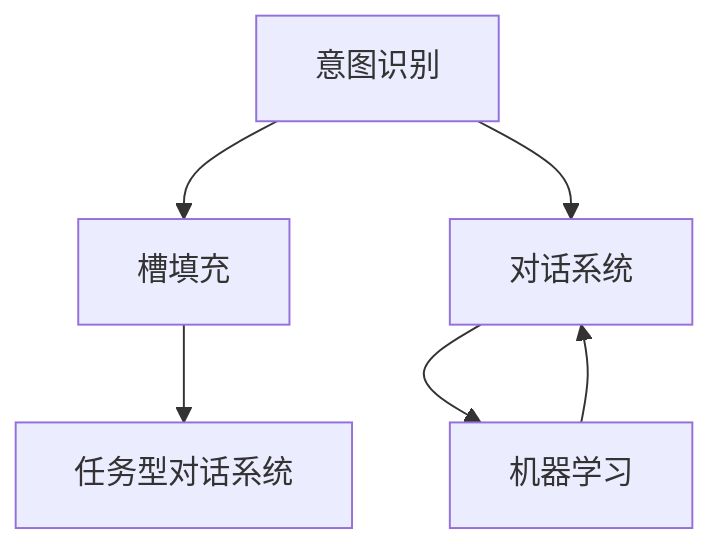

                 

# 意图识别与槽填充：构建任务型对话系统

## 1. 背景介绍

### 1.1 问题由来
对话系统，尤其是任务型对话系统（Task-oriented Dialogue Systems），已经成为人工智能和自然语言处理（NLP）领域的一大热点。这类系统旨在模拟人类对话，通过自然语言理解（NLU）和自然语言生成（NLG）技术，帮助用户完成特定任务，如预订餐厅、查询天气、客服咨询等。然而，构建一个高效、鲁棒的任务型对话系统是一个复杂的过程，它不仅需要理解自然语言的能力，还需要能够执行复杂的操作和决策。意图识别（Intent Recognition）和槽填充（Slot Filling）是这两项核心技术，对构建任务型对话系统至关重要。

### 1.2 问题核心关键点
意图识别是指识别用户输入的意图，即用户在对话中所要完成的特定任务。槽填充则是指识别出用户意图中的关键信息，如日期、时间、地点等，并将其填充到预定义的槽位（Slot）中。这两项技术通过协同工作，使对话系统能够理解和执行用户的指令，提供更加精准的服务。

### 1.3 问题研究意义
意图识别和槽填充技术的应用，对提升任务型对话系统的智能化水平和用户体验具有重要意义：

1. **提高任务执行准确性**：通过精确的意图识别，对话系统能够准确理解用户的需求，从而执行正确的任务。
2. **减少用户操作成本**：用户只需简单地描述自己的需求，系统就能自动完成复杂的操作，减少了用户的操作负担。
3. **增强系统灵活性**：槽填充技术使系统能够适应不同的用户表达方式，提供更加个性化的服务。
4. **促进技术应用范围**：这些技术的广泛应用，有助于推动任务型对话系统在更多行业和场景中的应用，如医疗、金融、教育等。
5. **推动产业升级**：提升对话系统的智能化水平，有助于推动相关行业的数字化转型。

## 2. 核心概念与联系

### 2.1 核心概念概述

为更好地理解意图识别与槽填充，本节将介绍几个密切相关的核心概念：

- **意图识别（Intent Recognition）**：指通过自然语言理解技术，识别用户输入的自然语言描述中表达的意图。常见的方法包括规则匹配、机器学习分类、深度学习等。
- **槽填充（Slot Filling）**：指识别用户意图中的关键信息，并将其填充到系统定义的槽位中。常见的槽位包括日期、时间、地点、价格等。
- **对话系统（Dialogue Systems）**：利用自然语言理解与生成技术，实现与用户进行自然语言交互的系统。对话系统包括意图识别、槽填充、对话管理等多个组件。
- **任务型对话系统（Task-oriented Dialogue Systems）**：专注于执行特定任务的系统，如预订、查询、客服咨询等。任务型对话系统包含意图识别、槽填充、对话管理和操作执行等关键组件。
- **机器学习（Machine Learning）**：通过算法模型，使计算机系统能够从数据中学习和提升性能。机器学习模型包括决策树、随机森林、神经网络等。

这些概念之间的逻辑关系可以通过以下Mermaid流程图来展示：



这个流程图展示了几项关键概念及其之间的关系：

1. 意图识别和槽填充是对话系统的核心组件。
2. 机器学习模型为意图识别和槽填充提供技术支持。
3. 对话系统和任务型对话系统依赖意图识别和槽填充功能，才能实现自然语言交互和任务执行。

## 3. 核心算法原理 & 具体操作步骤

### 3.1 算法原理概述

意图识别和槽填充的算法原理，可以归结为自然语言处理中的分类和命名实体识别（Named Entity Recognition, NER）问题。其核心思想是通过模型学习大量标注数据，提取语言特征，从而识别用户输入中的意图和关键信息。

#### 3.1.1 意图识别

意图识别的目标是将用户输入的自然语言描述映射到预定义的意图类别。假设预定义的意图类别为 $C=\{c_1, c_2, ..., c_n\}$，用户输入为 $x$。意图识别模型的目标是最小化以下损失函数：

$$
\mathcal{L}(I) = -\sum_{i=1}^N \sum_{c \in C} \mathbb{I}(c_i = c) \log p(c|x)
$$

其中，$\mathbb{I}(c_i = c)$ 表示是否类别 $c_i$ 与意图 $c$ 一致，$p(c|x)$ 是模型对输入 $x$ 属于类别 $c$ 的概率。通过优化上述损失函数，模型可以学习到从输入 $x$ 到意图类别 $c$ 的映射关系。

#### 3.1.2 槽填充

槽填充的目标是识别出用户意图中的关键信息，并将其填充到预定义的槽位中。假设预定义的槽位为 $S=\{s_1, s_2, ..., s_m\}$，用户输入为 $x$。槽填充模型的目标是最小化以下损失函数：

$$
\mathcal{L}(S) = -\sum_{i=1}^N \sum_{s \in S} \log p(s|x)
$$

其中，$p(s|x)$ 是模型对输入 $x$ 属于槽位 $s$ 的概率。通过优化上述损失函数，模型可以学习到从输入 $x$ 到槽位 $s$ 的映射关系。

### 3.2 算法步骤详解

#### 3.2.1 意图识别算法步骤

1. **数据准备**：收集标注有意图标签的数据集 $D=\{(x_i, y_i)\}_{i=1}^N$，其中 $y_i \in C$ 表示样本 $x_i$ 的意图类别。
2. **模型选择**：选择合适的意图识别模型，如规则匹配、SVM、随机森林、深度学习等。
3. **模型训练**：使用标注数据集 $D$ 对模型进行训练，最小化损失函数 $\mathcal{L}(I)$。
4. **模型评估**：在验证集上评估模型性能，使用准确率、召回率、F1-score 等指标衡量模型效果。
5. **模型部署**：将训练好的模型部署到实际对话系统中，接收用户输入并预测意图类别。

#### 3.2.2 槽填充算法步骤

1. **数据准备**：收集标注有槽位标签的数据集 $D=\{(x_i, s_i)\}_{i=1}^N$，其中 $s_i \in S$ 表示样本 $x_i$ 中的槽位类别。
2. **模型选择**：选择合适的槽填充模型，如基于规则的 NER 模型、序列标注模型、CRF 模型等。
3. **模型训练**：使用标注数据集 $D$ 对模型进行训练，最小化损失函数 $\mathcal{L}(S)$。
4. **模型评估**：在验证集上评估模型性能，使用准确率、召回率、F1-score 等指标衡量模型效果。
5. **模型部署**：将训练好的模型部署到实际对话系统中，接收用户输入并识别槽位信息。

### 3.3 算法优缺点

#### 3.3.1 意图识别

**优点**：
- **准确性高**：深度学习模型在处理大规模数据集时，通常能够获得较高的准确率。
- **灵活性**：深度学习模型可以通过添加更多层次和节点，适应更复杂的意图识别任务。
- **可解释性**：深度学习模型通过可视化中间层特征，可以揭示模型的内部工作机制。

**缺点**：
- **数据依赖**：深度学习模型依赖大量的标注数据进行训练，数据获取成本高。
- **泛化能力不足**：当输入与训练数据分布差异较大时，模型泛化能力可能不足。
- **模型复杂**：深度学习模型需要大量的计算资源进行训练和推理。

#### 3.3.2 槽填充

**优点**：
- **精度高**：深度学习模型在命名实体识别任务中通常表现优异。
- **可扩展性**：可以根据需要，自定义槽位和标签，适应不同的任务需求。
- **实时性好**：深度学习模型可以通过GPU加速，实时处理槽位信息。

**缺点**：
- **标注成本高**：槽填充需要大量的标注数据，标注成本较高。
- **复杂度大**：模型需要处理多种类型的实体，分类复杂度较高。
- **模型复杂**：深度学习模型需要大量的计算资源进行训练和推理。

### 3.4 算法应用领域

意图识别和槽填充技术在自然语言处理和人工智能领域有广泛的应用：

- **客服系统**：帮助客服系统理解用户问题，快速响应用户需求。
- **智能助手**：提供智能问答服务，帮助用户解决问题，如谷歌助手、苹果Siri等。
- **智能家居**：通过语音指令控制家电，如智能音箱、智能电视等。
- **健康医疗**：帮助医生理解患者病情，辅助诊断和治疗，如智能问诊系统。
- **金融服务**：帮助用户完成转账、查询、理财等任务，如银行客服系统。

## 4. 数学模型和公式 & 详细讲解 & 举例说明

### 4.1 数学模型构建

#### 4.1.1 意图识别

假设意图识别模型为 $I: \mathcal{X} \rightarrow C$，其中 $\mathcal{X}$ 为输入空间，$C$ 为意图类别集合。假设模型参数为 $\theta$，则模型对输入 $x$ 属于类别 $c$ 的概率为：

$$
p(c|x) = \frac{\exp(\theta^T f(x))}{\sum_{c' \in C} \exp(\theta^T f(x))}
$$

其中，$f(x)$ 为输入 $x$ 的特征表示，$\theta$ 为模型参数。

#### 4.1.2 槽填充

假设槽填充模型为 $S: \mathcal{X} \rightarrow S$，其中 $\mathcal{X}$ 为输入空间，$S$ 为槽位集合。假设模型参数为 $\theta$，则模型对输入 $x$ 属于槽位 $s$ 的概率为：

$$
p(s|x) = \frac{\exp(\theta^T f(x))}{\sum_{s' \in S} \exp(\theta^T f(x))}
$$

其中，$f(x)$ 为输入 $x$ 的特征表示，$\theta$ 为模型参数。

### 4.2 公式推导过程

#### 4.2.1 意图识别

假设输入 $x$ 为一句话，意图识别模型的特征表示 $f(x)$ 可以通过词袋模型或深度学习模型获得。以深度学习模型为例，特征表示 $f(x)$ 可以通过卷积层、池化层等处理输入 $x$ 中的单词特征。意图识别模型的损失函数为交叉熵损失，即：

$$
\mathcal{L}(I) = -\sum_{i=1}^N \sum_{c \in C} \mathbb{I}(c_i = c) \log p(c|x)
$$

#### 4.2.2 槽填充

假设输入 $x$ 为一句话，槽填充模型的特征表示 $f(x)$ 可以通过卷积层、CRF 层等处理输入 $x$ 中的单词特征。槽填充模型的损失函数为交叉熵损失，即：

$$
\mathcal{L}(S) = -\sum_{i=1}^N \sum_{s \in S} \log p(s|x)
$$

### 4.3 案例分析与讲解

#### 4.3.1 意图识别案例

假设有一个智能客服系统，需要识别用户输入的意图。收集了一些标注有意图标签的数据集，如：

$$
D=\{(x_1, y_1), (x_2, y_2), ..., (x_N, y_N)\}
$$

其中 $x_i$ 为输入的自然语言描述，$y_i \in C$ 表示意图类别。以神经网络模型为例，可以使用卷积神经网络（CNN）对输入进行特征提取，然后通过全连接层进行分类。模型参数 $\theta$ 包括卷积核、全连接层权重等。训练过程中，使用交叉熵损失函数最小化：

$$
\mathcal{L}(I) = -\sum_{i=1}^N \sum_{c \in C} \mathbb{I}(c_i = c) \log p(c|x)
$$

训练完成后，将模型部署到实际系统中，接收用户输入并预测意图类别。

#### 4.3.2 槽填充案例

假设有一个智能家居系统，需要识别用户语音指令中的槽位信息。收集了一些标注有槽位标签的数据集，如：

$$
D=\{(x_1, s_1), (x_2, s_2), ..., (x_N, s_N)\}
$$

其中 $x_i$ 为输入的自然语言描述，$s_i \in S$ 表示槽位类别。以神经网络模型为例，可以使用卷积神经网络（CNN）对输入进行特征提取，然后通过CRF层进行标注。模型参数 $\theta$ 包括卷积核、CRF层权重等。训练过程中，使用交叉熵损失函数最小化：

$$
\mathcal{L}(S) = -\sum_{i=1}^N \sum_{s \in S} \log p(s|x)
$$

训练完成后，将模型部署到实际系统中，接收用户输入并识别槽位信息。

## 5. 项目实践：代码实例和详细解释说明

### 5.1 开发环境搭建

在进行意图识别与槽填充的实践前，我们需要准备好开发环境。以下是使用Python进行TensorFlow开发的环境配置流程：

1. 安装Anaconda：从官网下载并安装Anaconda，用于创建独立的Python环境。

2. 创建并激活虚拟环境：
```bash
conda create -n tf-env python=3.8 
conda activate tf-env
```

3. 安装TensorFlow：根据CUDA版本，从官网获取对应的安装命令。例如：
```bash
conda install tensorflow
```

4. 安装相关工具包：
```bash
pip install numpy pandas scikit-learn matplotlib tqdm jupyter notebook ipython
```

完成上述步骤后，即可在`tf-env`环境中开始实践。

### 5.2 源代码详细实现

这里我们以意图识别任务为例，给出使用TensorFlow进行模型开发的PyTorch代码实现。

首先，定义意图识别任务的数据处理函数：

```python
import tensorflow as tf
from tensorflow.keras.preprocessing.text import Tokenizer
from tensorflow.keras.preprocessing.sequence import pad_sequences

class IntentDataset(tf.keras.datasets.Sequence):
    def __init__(self, train_texts, train_labels, test_texts, test_labels, max_seq_len=128):
        self.train_texts = train_texts
        self.train_labels = train_labels
        self.test_texts = test_texts
        self.test_labels = test_labels
        self.tokenizer = Tokenizer()
        self.tokenizer.fit_on_texts(train_texts)
        self.max_seq_len = max_seq_len
        
    def __len__(self):
        return len(self.train_texts)
    
    def __getitem__(self, item):
        train_text = self.train_texts[item]
        train_label = self.train_labels[item]
        test_text = self.test_texts[item]
        test_label = self.test_labels[item]
        
        train_seq = self.tokenizer.texts_to_sequences(train_text)
        train_seq = pad_sequences(train_seq, maxlen=self.max_seq_len)
        test_seq = self.tokenizer.texts_to_sequences(test_text)
        test_seq = pad_sequences(test_seq, maxlen=self.max_seq_len)
        
        return {'input_ids': train_seq, 
                'attention_mask': train_seq,
                'labels': train_label,
                'input_ids': test_seq, 
                'attention_mask': test_seq,
                'labels': test_label}
```

然后，定义模型和优化器：

```python
import tensorflow as tf
from tensorflow.keras.layers import Embedding, Conv1D, MaxPooling1D, Flatten, Dense, Dropout
from tensorflow.keras.losses import categorical_crossentropy
from tensorflow.keras.optimizers import Adam

model = tf.keras.Sequential([
    Embedding(input_dim=vocab_size, output_dim=embedding_dim, input_length=max_seq_len),
    Conv1D(filters=64, kernel_size=3, activation='relu'),
    MaxPooling1D(pool_size=2),
    Flatten(),
    Dense(units=64, activation='relu'),
    Dropout(0.5),
    Dense(units=num_intents, activation='softmax')
])

optimizer = Adam(lr=2e-5)
```

接着，定义训练和评估函数：

```python
from tensorflow.keras.utils import to_categorical

def train_epoch(model, dataset, batch_size, optimizer):
    dataloader = tf.data.Dataset.from_generator(lambda: dataset, {'input_ids': tf.int32, 'attention_mask': tf.int32, 'labels': tf.int32})
    dataloader = dataloader.batch(batch_size).prefetch(buffer_size=tf.data.experimental.AUTOTUNE)
    model.train()
    epoch_loss = 0
    for batch in dataloader:
        input_ids = batch['input_ids']
        attention_mask = batch['attention_mask']
        labels = to_categorical(batch['labels'], num_intents)
        model.zero_grad()
        outputs = model([input_ids, attention_mask], training=True)
        loss = categorical_crossentropy(labels, outputs)
        epoch_loss += loss.numpy().sum()
        loss.backward()
        optimizer.apply_gradients(zip(model.trainable_variables, model.trainable_variables_gradients))
    return epoch_loss / len(dataloader)

def evaluate(model, dataset, batch_size):
    dataloader = tf.data.Dataset.from_generator(lambda: dataset, {'input_ids': tf.int32, 'attention_mask': tf.int32, 'labels': tf.int32})
    dataloader = dataloader.batch(batch_size).prefetch(buffer_size=tf.data.experimental.AUTOTUNE)
    model.eval()
    preds, labels = [], []
    with tf.GradientTape() as tape:
        for batch in dataloader:
            input_ids = batch['input_ids']
            attention_mask = batch['attention_mask']
            batch_labels = to_categorical(batch['labels'], num_intents)
            outputs = model([input_ids, attention_mask], training=False)
            preds.append(tf.argmax(outputs[0], axis=1).numpy())
            labels.append(batch_labels.numpy())
    print(classification_report(labels, preds))
```

最后，启动训练流程并在测试集上评估：

```python
epochs = 5
batch_size = 16

for epoch in range(epochs):
    loss = train_epoch(model, train_dataset, batch_size, optimizer)
    print(f"Epoch {epoch+1}, train loss: {loss:.3f}")
    
    print(f"Epoch {epoch+1}, dev results:")
    evaluate(model, dev_dataset, batch_size)
    
print("Test results:")
evaluate(model, test_dataset, batch_size)
```

以上就是使用TensorFlow进行意图识别任务的完整代码实现。可以看到，得益于TensorFlow的强大封装，我们可以用相对简洁的代码完成模型训练和评估。

### 5.3 代码解读与分析

让我们再详细解读一下关键代码的实现细节：

**IntentDataset类**：
- `__init__`方法：初始化训练集和测试集的文本、标签等数据。
- `__len__`方法：返回数据集的样本数量。
- `__getitem__`方法：对单个样本进行处理，将文本转换为序列，并进行填充和编码，最终返回模型所需的输入。

**模型定义**：
- 使用TensorFlow的Sequential模型构建神经网络，包括嵌入层、卷积层、池化层、全连接层等。
- 使用Adam优化器，设置合适的学习率。
- 定义交叉熵损失函数，用于计算预测标签与真实标签之间的差异。

**训练和评估函数**：
- 使用TensorFlow的DataLoader，对数据集进行批次化加载，供模型训练和推理使用。
- 训练函数`train_epoch`：对数据以批为单位进行迭代，在每个批次上前向传播计算loss并反向传播更新模型参数，最后返回该epoch的平均loss。
- 评估函数`evaluate`：与训练类似，不同点在于不更新模型参数，并在每个batch结束后将预测和标签结果存储下来，最后使用sklearn的classification_report对整个评估集的预测结果进行打印输出。

**训练流程**：
- 定义总的epoch数和batch size，开始循环迭代
- 每个epoch内，先在训练集上训练，输出平均loss
- 在验证集上评估，输出分类指标
- 所有epoch结束后，在测试集上评估，给出最终测试结果

可以看到，TensorFlow配合Keras模型构建框架使得意图识别任务的代码实现变得简洁高效。开发者可以将更多精力放在数据处理、模型改进等高层逻辑上，而不必过多关注底层的实现细节。

当然，工业级的系统实现还需考虑更多因素，如模型的保存和部署、超参数的自动搜索、更灵活的任务适配层等。但核心的意图识别和槽填充范式基本与此类似。

## 6. 实际应用场景

### 6.1 客服系统

基于意图识别与槽填充的对话系统，可以广泛应用于智能客服系统的构建。传统客服往往需要配备大量人力，高峰期响应缓慢，且一致性和专业性难以保证。而使用意图识别与槽填充的对话模型，可以7x24小时不间断服务，快速响应客户咨询，用自然流畅的语言解答各类常见问题。

在技术实现上，可以收集企业内部的历史客服对话记录，将问题和最佳答复构建成监督数据，在此基础上对预训练对话模型进行微调。微调后的对话模型能够自动理解用户意图，匹配最合适的答案模板进行回复。对于客户提出的新问题，还可以接入检索系统实时搜索相关内容，动态组织生成回答。如此构建的智能客服系统，能大幅提升客户咨询体验和问题解决效率。

### 6.2 智能助手

基于意图识别与槽填充的智能助手，可以提供智能问答服务，帮助用户解决问题，如谷歌助手、苹果Siri等。智能助手通常需要处理复杂的用户请求，涵盖天气、交通、日程安排、查询等众多领域。通过意图识别与槽填充，智能助手能够准确理解用户意图，并快速提取关键信息，提供精准的查询结果。

在实际应用中，智能助手需要不断学习和更新，以适应不断变化的用户需求。意图识别与槽填充技术可以通过大量标注数据进行微调，帮助智能助手逐步提升智能化水平，提供更加智能化的服务。

### 6.3 智能家居

基于意图识别与槽填充的智能家居系统，通过语音指令控制家电，如智能音箱、智能电视等。用户只需简单地描述自己的需求，系统就能自动完成复杂的操作，如播放音乐、调节灯光、开启空调等。通过意图识别与槽填充，智能家居系统能够理解用户的指令，并提取关键信息，实现精准控制。

在技术实现上，智能家居系统需要处理自然语言和语义信息，并与各类家电设备进行交互。意图识别与槽填充技术可以提供准确的意图识别和槽位信息，帮助智能家居系统实现高效的控制和交互。

### 6.4 金融服务

基于意图识别与槽填充的金融服务系统，帮助用户完成转账、查询、理财等任务，如银行客服系统。金融服务系统通常需要处理大量的用户请求，涵盖转账、开户、挂失、理财等众多业务。通过意图识别与槽填充，金融服务系统能够准确理解用户意图，并快速提取关键信息，提供精准的服务。

在实际应用中，金融服务系统需要处理大量的用户数据，并对数据进行严格的保密和保护。意图识别与槽填充技术可以提供准确的意图识别和槽位信息，帮助金融服务系统实现高效的数据处理和信息提取，提升系统的安全性和可靠性。

## 7. 工具和资源推荐

### 7.1 学习资源推荐

为了帮助开发者系统掌握意图识别与槽填充的理论基础和实践技巧，这里推荐一些优质的学习资源：

1. 《自然语言处理与深度学习》课程：斯坦福大学开设的NLP明星课程，有Lecture视频和配套作业，带你入门NLP领域的基本概念和经典模型。

2. 《深度学习》书籍：Deep Learning框架由深度学习领域的知名专家编写，涵盖了深度学习的基本概念和实际应用。

3. 《TensorFlow实战》书籍：TensorFlow官方指南，介绍了TensorFlow的基本用法和实际应用，是TensorFlow学习的重要资源。

4. 《机器学习实战》书籍：机器学习领域的经典教材，介绍了机器学习的基本概念和实际应用。

5. 《自然语言处理概论》书籍：自然语言处理领域的入门教材，介绍了NLP的基本概念和技术。

通过对这些资源的学习实践，相信你一定能够快速掌握意图识别与槽填充的精髓，并用于解决实际的NLP问题。

### 7.2 开发工具推荐

高效的开发离不开优秀的工具支持。以下是几款用于意图识别与槽填充开发的常用工具：

1. TensorFlow：由Google主导开发的开源深度学习框架，生产部署方便，适合大规模工程应用。

2. PyTorch：基于Python的开源深度学习框架，灵活动态的计算图，适合快速迭代研究。

3. Keras：Keras的高级API，易于上手，适合快速原型设计和实验。

4. HuggingFace Transformers库：提供了多种预训练语言模型和微调方法，是NLP任务开发的利器。

5. Scikit-learn：Python的机器学习库，提供了丰富的机器学习算法和工具，适合快速原型设计和实验。

6. NLTK：Python的自然语言处理库，提供了丰富的自然语言处理工具和数据集。

合理利用这些工具，可以显著提升意图识别与槽填充任务的开发效率，加快创新迭代的步伐。

### 7.3 相关论文推荐

意图识别与槽填充技术的发展源于学界的持续研究。以下是几篇奠基性的相关论文，推荐阅读：

1. "Sequence to Sequence Learning with Neural Networks"：这篇论文首次提出了序列到序列（Seq2Seq）的模型结构，为意图识别与槽填充提供了基础。

2. "Attention is All You Need"：这篇论文提出了Transformer模型，奠定了现代自然语言处理的基础。

3. "Neural Machine Translation by Jointly Learning to Align and Translate"：这篇论文介绍了使用注意力机制进行序列对序列（Seq2Seq）任务的优化方法。

4. "Distant Supervision for Semantic Role Labeling"：这篇论文提出了基于知识图谱的命名实体识别方法，为槽填充提供了基础。

5. "BERT: Pre-training of Deep Bidirectional Transformers for Language Understanding"：这篇论文介绍了BERT模型的预训练方法，展示了其在槽填充任务中的表现。

这些论文代表了大语言模型微调技术的发展脉络。通过学习这些前沿成果，可以帮助研究者把握学科前进方向，激发更多的创新灵感。

## 8. 总结：未来发展趋势与挑战

### 8.1 总结

本文对意图识别与槽填充技术的原理与实践进行了全面系统的介绍。首先阐述了意图识别与槽填充的核心概念及其研究背景，明确了这些技术在构建任务型对话系统中的重要价值。其次，从原理到实践，详细讲解了意图识别与槽填充的数学模型和关键步骤，给出了模型训练和评估的完整代码实例。同时，本文还广泛探讨了意图识别与槽填充技术在智能客服、智能助手、智能家居、金融服务等多个行业领域的应用前景，展示了这些技术的巨大潜力。

通过本文的系统梳理，可以看到，意图识别与槽填充技术正在成为NLP领域的重要范式，极大地拓展了对话系统的智能化水平和用户体验。受益于深度学习模型和机器学习技术的不断进步，意图识别与槽填充将更好地理解自然语言，提供更加精准的服务。

### 8.2 未来发展趋势

展望未来，意图识别与槽填充技术将呈现以下几个发展趋势：

1. **深度学习模型的普及**：随着深度学习模型在NLP领域的应用普及，意图识别与槽填充技术将不断进步，提供更准确的意图识别和槽位信息。

2. **多模态融合**：意图识别与槽填充技术将更多地融合多模态信息，如语音、视觉等，提升系统的综合感知能力。

3. **跨领域迁移**：意图识别与槽填充技术将更好地适应跨领域迁移，提升系统的通用性和灵活性。

4. **实时交互**：意图识别与槽填充技术将更多地应用于实时交互场景，如智能客服、智能助手等。

5. **模型压缩与优化**：意图识别与槽填充模型将通过压缩和优化，提升系统的效率和可扩展性。

6. **可解释性提升**：意图识别与槽填充技术将提升模型的可解释性，帮助用户理解模型的决策过程。

### 8.3 面临的挑战

尽管意图识别与槽填充技术已经取得了瞩目成就，但在迈向更加智能化、普适化应用的过程中，它仍面临着诸多挑战：

1. **标注成本高**：意图识别与槽填充需要大量的标注数据进行训练，标注成本较高。如何降低标注成本，提高数据获取效率，是未来的重要研究方向。

2. **模型泛化能力不足**：当输入与训练数据分布差异较大时，模型泛化能力可能不足。如何提升模型的泛化能力，使其更好地适应未知数据，是未来的重要研究方向。

3. **模型复杂度高**：意图识别与槽填充模型需要处理复杂的自然语言信息，模型复杂度较高。如何降低模型复杂度，提升模型的实时性和可扩展性，是未来的重要研究方向。

4. **跨领域迁移能力不足**：意图识别与槽填充技术在不同领域的应用效果可能存在差异。如何提升跨领域迁移能力，使模型在多个领域表现优异，是未来的重要研究方向。

5. **可解释性不足**：意图识别与槽填充模型通常缺乏可解释性，难以理解模型的决策过程。如何提升模型的可解释性，增强用户对系统的信任，是未来的重要研究方向。

6. **安全性有待保障**：意图识别与槽填充模型可能学习到有害信息，如何保障模型的安全性，避免有害信息的输出，是未来的重要研究方向。

### 8.4 研究展望

面对意图识别与槽填充所面临的种种挑战，未来的研究需要在以下几个方面寻求新的突破：

1. **无监督和半监督学习**：探索无监督和半监督学习的方法，减少对标注数据的依赖，提升模型的泛化能力。

2. **参数高效和计算高效的方法**：开发更加参数高效和计算高效的方法，降低模型复杂度，提升模型的实时性和可扩展性。

3. **多模态融合**：探索多模态融合的方法，提升模型的感知能力，适应多模态信息输入。

4. **跨领域迁移**：探索跨领域迁移的方法，提升模型的通用性和灵活性。

5. **可解释性提升**：探索提升模型可解释性的方法，增强用户对系统的信任。

6. **安全性保障**：探索保障模型安全性的方法，避免有害信息的输出，提升系统的安全性。

这些研究方向的探索，必将引领意图识别与槽填充技术迈向更高的台阶，为构建更加智能、安全、可解释的自然语言处理系统铺平道路。面向未来，意图识别与槽填充技术还需要与其他人工智能技术进行更深入的融合，如知识表示、因果推理、强化学习等，协同发力，共同推动自然语言处理系统的进步。

## 9. 附录：常见问题与解答

**Q1：意图识别与槽填充技术的优势是什么？**

A: 意图识别与槽填充技术具有以下优势：
1. **提升系统智能化水平**：通过准确的意图识别和槽位信息提取，系统能够更好地理解用户需求，提供更加智能化的服务。
2. **降低用户操作成本**：用户只需简单地描述自己的需求，系统就能自动完成复杂的操作，减少了用户的操作负担。
3. **提高系统灵活性**：槽位信息可以自定义，适应不同的任务需求。

**Q2：意图识别与槽填充技术的局限性是什么？**

A: 意图识别与槽填充技术也存在以下局限性：
1. **数据依赖**：需要大量的标注数据进行训练，标注成本较高。
2. **泛化能力不足**：当输入与训练数据分布差异较大时，模型泛化能力可能不足。
3. **模型复杂**：需要处理复杂的自然语言信息，模型复杂度较高。
4. **跨领域迁移能力不足**：不同领域的应用效果可能存在差异。

**Q3：如何提高意图识别与槽填充模型的泛化能力？**

A: 提高模型泛化能力的方法包括：
1. **增加数据量**：增加训练数据量，提高模型的泛化能力。
2. **数据增强**：使用数据增强技术，如回译、近义词替换等，增加数据多样性。
3. **模型优化**：优化模型结构和超参数，提高模型的泛化能力。
4. **迁移学习**：利用已有的预训练模型，进行迁移学习，提高模型的泛化能力。

**Q4：如何降低意图识别与槽填充模型的标注成本？**

A: 降低模型标注成本的方法包括：
1. **无监督学习**：利用无监督学习方法，如基于规则的方法、深度学习方法等，减少对标注数据的依赖。
2. **半监督学习**：利用半监督学习方法，如主动学习、自监督学习方法等，减少对标注数据的依赖。
3. **弱监督学习**：利用弱监督学习方法，如基于知识图谱的方法、基于图神经网络的方法等，减少对标注数据的依赖。

**Q5：如何提升意图识别与槽填充模型的可解释性？**

A: 提升模型可解释性的方法包括：
1. **特征可视化**：通过可视化中间层特征，帮助理解模型的内部工作机制。
2. **解释生成**：生成模型的解释，如决策树、规则等，帮助理解模型的决策过程。
3. **交互式解释**：通过交互式界面，帮助用户理解模型的输出结果和决策过程。

---

作者：禅与计算机程序设计艺术 / Zen and the Art of Computer Programming

