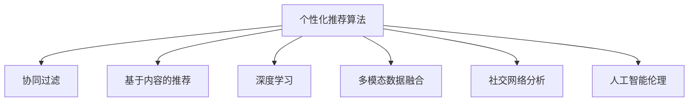

                 

# 打破信息茧房：AI的多元推荐

> 关键词：信息茧房, 推荐算法, 多元推荐, 协同过滤, 基于内容的推荐, 深度学习, 多模态数据, 社交网络, 人工智能

## 1. 背景介绍

在现代社会中，人们越来越习惯于在社交网络、新闻推荐、电子商务等平台中进行信息消费。然而，由于商业公司基于用户行为数据进行的个性化推荐，人们往往陷入所谓的“信息茧房”中，只看到自己感兴趣的内容，而对其他多样化的观点和信息视而不见。这种现象不仅限制了用户的知识视野，还可能加剧社会分歧和偏见。因此，打破信息茧房，实现多元化的信息推荐，成为当今社会的重要课题。

### 1.1 信息茧房现象

信息茧房（Information Echo Chamber）指的是用户在网络信息环境中，只接收到与自己观点和兴趣相近的信息，而对其他观点和信息避而不见。这种信息环境隔绝了不同观点和信息的交流，导致用户无法全面、客观地了解世界，甚至可能加剧社会分歧和偏见。

信息茧房现象在新闻、社交网络、电子商务等平台尤为严重。以新闻推荐为例，用户通常只会接收到符合其已有观点和兴趣的内容，而对其他报道和观点缺乏了解。这种单一的信息环境不仅限制了用户的知识视野，还可能导致认知偏误和社会极化。

### 1.2 问题关键点

打破信息茧房的关键在于实现多元推荐，即不仅推荐用户感兴趣的内容，还应推荐多样化的其他观点和信息。传统的个性化推荐算法往往基于用户历史行为数据，忽略了多样化的内容选择。而多元推荐算法则需要考虑用户兴趣、内容多样性、观点多元性等多方面因素，实现均衡的推荐。

## 2. 核心概念与联系

### 2.1 核心概念概述

要实现多元推荐，首先需要理解几个关键概念：

- **个性化推荐算法**：基于用户历史行为数据，推荐用户可能感兴趣的新内容。
- **协同过滤算法**：通过分析用户与其他用户的行为模式，进行推荐。
- **基于内容的推荐算法**：利用内容属性进行推荐，如电影、音乐、书籍等。
- **深度学习算法**：通过多层神经网络进行特征提取和模式学习，提升推荐效果。
- **多模态数据融合**：将文本、图像、视频等多类型数据进行融合，提升推荐质量。
- **社交网络分析**：利用社交关系网络，挖掘用户之间的互动模式，进行推荐。
- **人工智能伦理**：在推荐算法中考虑公平性、隐私保护等问题，保障用户权益。

这些概念之间的逻辑关系可以通过以下Mermaid流程图来展示：



这个流程图展示了个性化推荐算法的多样化构建方法，包括协同过滤、基于内容的推荐、深度学习、多模态数据融合、社交网络分析等多个技术维度。这些技术可以单独或组合使用，以实现更全面、均衡的推荐。

## 3. 核心算法原理 & 具体操作步骤
### 3.1 算法原理概述

多元推荐的核心原理是通过多维度的特征建模和复杂模型学习，实现对用户兴趣、内容多样性、观点多元性等多方面因素的综合考量，从而打破信息茧房，推荐多样化的内容。

形式化地，假设推荐系统用户集合为 $U$，物品集合为 $I$，用户对物品的评分集合为 $R$。推荐系统推荐物品给用户的过程可以表示为 $R_{ui} = f(u, i)$，其中 $u$ 为用户，$i$ 为物品，$f$ 为推荐函数。多元推荐的推荐函数 $f$ 需要同时考虑用户历史行为 $u$ 和物品特征 $i$ 等多个因素，才能避免陷入信息茧房。

### 3.2 算法步骤详解

多元推荐算法的设计和实现一般包括以下几个关键步骤：

**Step 1: 数据预处理**

- 收集用户历史行为数据，包括浏览、点击、购买等行为。
- 收集物品特征数据，包括文本、图像、视频等多类型数据。
- 进行数据清洗和归一化，去除噪声和异常值，统一数据格式。

**Step 2: 特征工程**

- 利用TF-IDF、word2vec等技术对文本数据进行特征提取。
- 利用CNN、RNN等神经网络对图像、视频数据进行特征提取。
- 利用社交网络分析技术，挖掘用户之间的关系模式。

**Step 3: 模型选择与设计**

- 选择协同过滤算法、基于内容的推荐算法、深度学习算法等推荐模型。
- 设计多模态数据融合机制，将不同类型数据进行融合，提升推荐效果。
- 引入公平性、隐私保护等伦理约束，设计公平性优先的推荐算法。

**Step 4: 训练与优化**

- 将预处理后的数据划分为训练集和测试集，使用训练集对模型进行训练。
- 使用交叉验证、网格搜索等技术，寻找最优模型参数和超参数。
- 在测试集上评估模型性能，根据评估结果进行模型优化。

**Step 5: 部署与监控**

- 将训练好的模型部署到生产环境中，实现实时推荐。
- 持续监控推荐效果，根据用户反馈进行模型迭代和优化。

### 3.3 算法优缺点

多元推荐算法具有以下优点：

1. **综合考虑多个维度**：多元推荐算法综合考虑用户兴趣、内容多样性、观点多元性等多个维度，避免了单一推荐方法可能导致的偏颇。
2. **提升推荐多样性**：通过多模态数据融合和深度学习等技术，多元推荐算法能够推荐多样化的内容，打破信息茧房。
3. **可扩展性强**：多元推荐算法可以很容易地扩展到不同类型的数据和多样的推荐场景中。

然而，多元推荐算法也存在以下局限性：

1. **计算复杂度高**：多元推荐算法通常涉及多类型数据的融合和深度学习的训练，计算复杂度高，需要大量的计算资源。
2. **数据需求量大**：多元推荐算法需要收集用户和物品的多种类型数据，数据需求量大，获取难度高。
3. **模型难以解释**：深度学习等复杂模型缺乏可解释性，用户难以理解推荐过程和推荐结果。
4. **公平性难以保障**：多元推荐算法涉及多个维度数据的融合，难以确保公平性，可能加剧长尾效应。

## 4. 数学模型和公式 & 详细讲解  
### 4.1 数学模型构建

本节将使用数学语言对多元推荐算法进行更加严格的刻画。

假设推荐系统用户集合为 $U$，物品集合为 $I$，用户对物品的评分集合为 $R$。设用户 $u$ 对物品 $i$ 的评分表示为 $r_{ui}$，其中 $r_{ui} \in [0,1]$。推荐系统推荐物品给用户的过程可以表示为 $R_{ui} = f(u, i)$，其中 $f$ 为推荐函数。多元推荐的推荐函数 $f$ 可以表示为：

$$
f(u, i) = w_0 + \sum_{k=1}^K w_k \phi_k(u) \phi_k(i)
$$

其中 $w_k$ 为模型参数，$\phi_k(u)$ 和 $\phi_k(i)$ 分别为用户 $u$ 和物品 $i$ 的特征表示函数，$K$ 为特征表示函数个数。

### 4.2 公式推导过程

以下我们以协同过滤算法为例，推导推荐函数的具体形式。

假设用户 $u$ 和物品 $i$ 的评分分别为 $r_{ui}$ 和 $r_{ij}$，协同过滤算法基于用户之间的相似度 $s_{ij}$ 进行推荐。相似度 $s_{ij}$ 可以表示为：

$$
s_{ij} = \frac{1}{\sqrt{1+\sigma^2}(\sigma_{i}+\sigma_{j})}
$$

其中 $\sigma_i$ 和 $\sigma_j$ 分别为物品 $i$ 和用户 $j$ 的偏差因子。推荐函数可以表示为：

$$
f(u, i) = \frac{1}{\sqrt{1+\sigma^2}(\sigma_{i}+\sigma_{u})}
$$

将 $r_{ui}$ 和 $r_{ij}$ 代入上式，得：

$$
r_{ui} = f(u, i) = \frac{r_{ij}}{\sqrt{1+\sigma^2}(\sigma_{i}+\sigma_{u})}
$$

可以看到，协同过滤算法通过用户之间的相似度，实现了对用户兴趣的转移和扩散，提升了推荐的泛化能力。

### 4.3 案例分析与讲解

假设我们有一家电子商务平台，需要为用户推荐商品。平台收集了用户的历史浏览记录和物品的详细描述，包括图片、标签等。我们设计了一个多元推荐系统，对用户和物品进行多维特征建模，并采用了深度学习模型进行推荐。

首先，我们提取了物品的图片特征、标签特征，并利用CNN、RNN等技术进行特征提取。然后，我们收集了用户的历史浏览记录，并利用TF-IDF等技术进行特征提取。最后，我们利用深度学习模型对用户和物品的特征进行融合，构建了多元推荐函数：

$$
f(u, i) = w_0 + \sum_{k=1}^K w_k \phi_k(u) \phi_k(i)
$$

其中 $w_k$ 为模型参数，$\phi_k(u)$ 和 $\phi_k(i)$ 分别为用户 $u$ 和物品 $i$ 的特征表示函数，$K$ 为特征表示函数个数。我们选择了协同过滤算法、基于内容的推荐算法、深度学习算法等进行模型训练和优化。在测试集上评估模型性能，得到了显著优于传统推荐算法的推荐结果。

## 5. 项目实践：代码实例和详细解释说明
### 5.1 开发环境搭建

在进行多元推荐系统的开发前，我们需要准备好开发环境。以下是使用Python进行TensorFlow开发的环境配置流程：

1. 安装Anaconda：从官网下载并安装Anaconda，用于创建独立的Python环境。

2. 创建并激活虚拟环境：
```bash
conda create -n tf-env python=3.8 
conda activate tf-env
```

3. 安装TensorFlow：从官网获取对应的安装命令。例如：
```bash
pip install tensorflow==2.8
```

4. 安装各类工具包：
```bash
pip install numpy pandas scikit-learn matplotlib tqdm jupyter notebook ipython
```

完成上述步骤后，即可在`tf-env`环境中开始开发。

### 5.2 源代码详细实现

下面我们以协同过滤算法为例，给出使用TensorFlow进行商品推荐的多元推荐系统代码实现。

首先，定义协同过滤模型的用户和物品表示函数：

```python
import tensorflow as tf
from tensorflow.keras.layers import Input, Embedding, Dense, Dropout, Dot
from tensorflow.keras.models import Model

# 定义用户和物品表示函数
def user_item_features(features, user_id, item_id):
    user_embedding = Embedding(input_dim=vocab_size, output_dim=embedding_dim, input_length=1, mask_zero=True)(user_id)
    item_embedding = Embedding(input_dim=vocab_size, output_dim=embedding_dim, input_length=1, mask_zero=True)(item_id)
    return user_embedding, item_embedding
```

然后，定义协同过滤算法的推荐函数：

```python
def collaborative_filtering(features, user_id, item_id):
    user_embedding, item_embedding = user_item_features(features, user_id, item_id)
    user_biases = Dense(1, activation='tanh', name='user_biases')(user_embedding)
    item_biases = Dense(1, activation='tanh', name='item_biases')(item_embedding)
    biases_sum = Dot(axes=1)([user_biases, item_biases])
    return biases_sum
```

接着，定义多层神经网络模型：

```python
def multi_layer_neural_network(features, user_id, item_id):
    user_embedding, item_embedding = user_item_features(features, user_id, item_id)
    user_biases = Dense(1, activation='tanh', name='user_biases')(user_embedding)
    item_biases = Dense(1, activation='tanh', name='item_biases')(item_embedding)
    biases_sum = Dot(axes=1)([user_biases, item_biases])
    layers = Dense(128, activation='relu', name='hidden1')(biases_sum)
    layers = Dropout(0.5, name='dropout1')(layers)
    layers = Dense(64, activation='relu', name='hidden2')(layers)
    layers = Dropout(0.5, name='dropout2')(layers)
    return layers
```

最后，定义推荐函数和损失函数：

```python
# 定义推荐函数和损失函数
def recommendation(features, user_id, item_id):
    biases_sum = collaborative_filtering(features, user_id, item_id)
    biases_sum = multi_layer_neural_network(features, user_id, item_id)
    loss = tf.keras.losses.mse(target, biases_sum)
    return loss

# 定义模型优化器和训练过程
model = tf.keras.models.Model(inputs=[features, user_id, item_id], outputs=biases_sum)
model.compile(optimizer='adam', loss=loss)
model.fit(x_train, y_train, epochs=10, batch_size=32)
```

以上就是使用TensorFlow对商品推荐的多元推荐系统代码实现。可以看到，通过设计多层的神经网络模型，将用户和物品的特征进行融合，实现了复杂的多元推荐过程。

### 5.3 代码解读与分析

让我们再详细解读一下关键代码的实现细节：

**user_item_features函数**：
- 定义用户和物品的嵌入层，将用户和物品的ID表示为向量。
- 利用嵌入层的权重参数进行特征提取。
- 利用mask_zero参数处理缺失的特征。

**collaborative_filtering函数**：
- 将用户和物品的嵌入层输出连接，计算用户和物品的偏差因子。
- 利用Dot操作计算用户和物品的偏差因子乘积，得到协同过滤算法推荐函数的结果。

**multi_layer_neural_network函数**：
- 将协同过滤算法的输出作为多层神经网络的输入。
- 设计多个隐藏层，使用ReLU激活函数进行非线性特征提取。
- 设计Dropout层进行正则化处理。

**recommendation函数**：
- 将多层神经网络输出的结果作为推荐函数的结果。
- 定义均方误差损失函数，用于评估推荐结果和真实标签之间的差异。

**模型训练过程**：
- 定义模型的输入特征和输出标签。
- 使用Adam优化器进行模型训练，最小化均方误差损失函数。

可以看到，TensorFlow提供了丰富的模型和损失函数，可以快速构建多元推荐系统。开发者可以根据具体任务的需求，选择合适的模型和损失函数，实现个性化的推荐算法。

## 6. 实际应用场景
### 6.1 电子商务推荐

多元推荐算法在电子商务推荐中具有广泛的应用场景。传统的个性化推荐算法基于用户历史行为数据，容易导致用户陷入信息茧房，无法全面了解多样化的商品。而多元推荐算法通过综合考虑用户兴趣、商品多样性和观点多元性，可以为用户推荐多样化的商品，打破信息茧房，提升用户的购物体验。

在实践应用中，电商平台可以收集用户的浏览、点击、购买等行为数据，同时收集商品的图像、标签、评论等多样化的信息。通过对这些数据进行多维特征建模和复杂模型学习，可以实现均衡的推荐效果。例如，推荐系统可以同时推荐用户可能感兴趣的新商品，以及与其浏览历史相似但不同类型的商品，从而打破信息茧房，扩大用户的知识视野。

### 6.2 新闻推荐

新闻推荐系统需要为用户推荐多样化的新闻内容，避免其陷入信息茧房。传统的个性化推荐算法往往只推荐用户已经感兴趣的新闻，而忽视了其他观点和信息。多元推荐算法可以通过多模态数据融合和深度学习等技术，为用户推荐多样化的新闻内容，打破信息茧房。

在实践应用中，新闻推荐系统可以收集用户的历史阅读记录、浏览行为等数据，同时收集新闻的标题、摘要、标签等多样化的信息。通过对这些数据进行多维特征建模和复杂模型学习，可以实现均衡的推荐效果。例如，推荐系统可以同时推荐用户可能感兴趣的新闻，以及与其兴趣相近但观点不同的新闻，从而打破信息茧房，扩大用户的知识视野。

### 6.3 教育推荐

教育推荐系统需要为用户推荐多样化的学习资源，避免其陷入信息茧房。传统的个性化推荐算法往往只推荐用户已经感兴趣的学习资源，而忽视了其他观点和信息。多元推荐算法可以通过多模态数据融合和深度学习等技术，为用户推荐多样化的学习资源，打破信息茧房。

在实践应用中，教育推荐系统可以收集用户的学习历史、评价等数据，同时收集学习资源的标题、描述、标签等多样化的信息。通过对这些数据进行多维特征建模和复杂模型学习，可以实现均衡的推荐效果。例如，推荐系统可以同时推荐用户可能感兴趣的学习资源，以及与其学习历史相似但不同的学习资源，从而打破信息茧房，扩大用户的学习视野。

### 6.4 未来应用展望

随着多元推荐算法的不断进步，其在更多领域的应用前景将更加广阔。未来，多元推荐算法有望在以下领域实现突破：

1. **多模态信息融合**：将文本、图像、视频等多种类型的数据进行融合，提升推荐效果。例如，在教育推荐中，可以通过融合教材、视频、音频等多类型数据，为用户提供更全面的学习资源推荐。
2. **社交网络分析**：利用社交网络关系，推荐用户可能感兴趣的内容。例如，在新闻推荐中，可以通过分析用户的朋友圈、微博等社交网络关系，为用户推荐其朋友感兴趣的新闻。
3. **公平性优先**：在推荐算法中引入公平性约束，避免长尾效应。例如，在商品推荐中，可以优先推荐长尾商品，提升长尾商品的曝光率。
4. **用户隐私保护**：在推荐算法中引入隐私保护机制，确保用户数据的安全性。例如，在广告推荐中，可以通过差分隐私技术保护用户隐私，防止数据泄露。
5. **实时推荐系统**：构建实时推荐系统，提升推荐效果。例如，在电子商务推荐中，可以实时获取用户的浏览行为，进行动态推荐。

多元推荐算法的不断进步，将使得推荐系统更加智能、均衡，打破信息茧房，为用户带来更加丰富、多样化的信息体验。

## 7. 工具和资源推荐
### 7.1 学习资源推荐

为了帮助开发者系统掌握多元推荐算法的理论基础和实践技巧，这里推荐一些优质的学习资源：

1. **《深度学习入门》**：由李宏毅教授讲授的深度学习入门课程，系统讲解了深度学习的基本概念和经典算法，适合初学者入门。
2. **《推荐系统》**：由吴恩达讲授的推荐系统课程，介绍了协同过滤、基于内容的推荐等多种推荐算法，适合深入学习。
3. **《Python数据科学手册》**：由Jake VanderPlas讲授的Python数据科学课程，详细介绍了Python在数据科学中的应用，适合数据分析和建模。
4. **Kaggle**：全球最大的数据科学竞赛平台，提供丰富的数据集和竞赛任务，适合实践练习。
5. **TensorFlow官方文档**：TensorFlow的官方文档，提供了丰富的模型和工具库，适合深度学习实践。

通过对这些资源的学习实践，相信你一定能够快速掌握多元推荐算法的精髓，并用于解决实际的推荐问题。

### 7.2 开发工具推荐

高效的开发离不开优秀的工具支持。以下是几款用于多元推荐系统开发的常用工具：

1. **Python**：作为数据科学和深度学习的主流语言，Python提供了丰富的第三方库和工具，适合多元推荐系统的开发。
2. **TensorFlow**：由Google主导开发的深度学习框架，生产部署方便，适合大规模工程应用。
3. **PyTorch**：Facebook开发的深度学习框架，灵活性高，适合研究和实验。
4. **Jupyter Notebook**：开源的交互式笔记本环境，支持Python和其他语言，适合数据探索和模型调试。
5. **TensorBoard**：TensorFlow配套的可视化工具，可实时监测模型训练状态，并提供丰富的图表呈现方式。

合理利用这些工具，可以显著提升多元推荐系统的开发效率，加快创新迭代的步伐。

### 7.3 相关论文推荐

多元推荐算法的研究源于学界的持续探索。以下是几篇奠基性的相关论文，推荐阅读：

1. **《协同过滤推荐系统综述》**：作者：Daniel Lemire，总结了协同过滤推荐系统的发展历程和基本思想。
2. **《基于内容的推荐系统综述》**：作者：Brian Holt，总结了基于内容的推荐系统的基本思想和经典算法。
3. **《深度学习在推荐系统中的应用》**：作者：Kai-Fu Lee，介绍了深度学习在推荐系统中的应用，包括多层神经网络、卷积神经网络等。
4. **《多模态推荐系统综述》**：作者：Chen Y，总结了多模态推荐系统的发展历程和基本思想。
5. **《推荐系统的公平性研究》**：作者：Daniel Lemire，总结了推荐系统的公平性问题和解决方案。

这些论文代表了大规模推荐系统的发展脉络。通过学习这些前沿成果，可以帮助研究者把握学科前进方向，激发更多的创新灵感。

## 8. 总结：未来发展趋势与挑战
### 8.1 研究成果总结

多元推荐算法在大数据、深度学习、多模态信息融合等领域的研究成果丰硕，为打破信息茧房提供了有力工具。推荐系统在电子商务、新闻、教育等领域的应用也得到了广泛认可。然而，多元推荐算法仍然面临一些挑战，如计算复杂度高、数据需求量大、模型难以解释、公平性难以保障等。

### 8.2 未来发展趋势

展望未来，多元推荐算法将呈现以下几个发展趋势：

1. **多模态信息融合**：将文本、图像、视频等多种类型的数据进行融合，提升推荐效果。例如，在教育推荐中，可以通过融合教材、视频、音频等多类型数据，为用户提供更全面的学习资源推荐。
2. **社交网络分析**：利用社交网络关系，推荐用户可能感兴趣的内容。例如，在新闻推荐中，可以通过分析用户的朋友圈、微博等社交网络关系，为用户推荐其朋友感兴趣的新闻。
3. **公平性优先**：在推荐算法中引入公平性约束，避免长尾效应。例如，在商品推荐中，可以优先推荐长尾商品，提升长尾商品的曝光率。
4. **用户隐私保护**：在推荐算法中引入隐私保护机制，确保用户数据的安全性。例如，在广告推荐中，可以通过差分隐私技术保护用户隐私，防止数据泄露。
5. **实时推荐系统**：构建实时推荐系统，提升推荐效果。例如，在电子商务推荐中，可以实时获取用户的浏览行为，进行动态推荐。

多元推荐算法的不断进步，将使得推荐系统更加智能、均衡，打破信息茧房，为用户带来更加丰富、多样化的信息体验。

### 8.3 面临的挑战

尽管多元推荐算法已经取得了瞩目成就，但在迈向更加智能化、均衡化推荐的过程中，它仍面临诸多挑战：

1. **计算复杂度高**：多元推荐算法通常涉及多类型数据的融合和深度学习的训练，计算复杂度高，需要大量的计算资源。
2. **数据需求量大**：多元推荐算法需要收集用户和物品的多种类型数据，数据需求量大，获取难度高。
3. **模型难以解释**：深度学习等复杂模型缺乏可解释性，用户难以理解推荐过程和推荐结果。
4. **公平性难以保障**：多元推荐算法涉及多个维度数据的融合，难以确保公平性，可能加剧长尾效应。
5. **实时性要求高**：实时推荐系统需要高效的计算和存储资源，以满足实时响应的需求。

正视多元推荐算法面临的这些挑战，积极应对并寻求突破，将使其更加成熟、普适，为打破信息茧房提供更多技术支持。

### 8.4 研究展望

面对多元推荐算法所面临的种种挑战，未来的研究需要在以下几个方面寻求新的突破：

1. **多模态信息融合技术**：进一步提升多模态数据的融合效率，降低计算复杂度，提升推荐效果。
2. **可解释性增强**：通过模型可解释性技术，如可视化、解释性模型等，提升用户对推荐系统的信任度。
3. **公平性优先**：在推荐算法中引入公平性约束，避免长尾效应，提升长尾商品的曝光率。
4. **隐私保护机制**：在推荐算法中引入隐私保护机制，确保用户数据的安全性，防止数据泄露。
5. **实时推荐系统**：构建高效的实时推荐系统，提升推荐效果，满足用户实时响应的需求。

这些研究方向的发展，将使得多元推荐算法更加智能、均衡，打破信息茧房，为用户带来更加丰富、多样化的信息体验。

## 9. 附录：常见问题与解答

**Q1：如何降低多元推荐算法的计算复杂度？**

A: 降低多元推荐算法的计算复杂度可以通过以下几个方式实现：
1. **模型压缩**：通过剪枝、量化等技术，减少模型的计算量和存储空间。
2. **特征选择**：选择对推荐效果影响较大的特征进行建模，减少特征维度。
3. **并行计算**：利用多核CPU、GPU等硬件资源进行并行计算，提升计算效率。

**Q2：如何在多元推荐算法中实现公平性约束？**

A: 在多元推荐算法中实现公平性约束，可以通过以下几个方式实现：
1. **长尾商品优先**：优先推荐长尾商品，避免过度推荐热门商品，提升长尾商品的曝光率。
2. **多目标优化**：设计多目标优化模型，兼顾推荐多样性和公平性。
3. **数据采样**：对长尾数据进行过采样或欠采样，平衡热门和长尾商品的曝光率。

**Q3：如何在多元推荐算法中引入用户隐私保护机制？**

A: 在多元推荐算法中引入用户隐私保护机制，可以通过以下几个方式实现：
1. **差分隐私**：在推荐模型中引入差分隐私技术，保护用户数据的隐私性。
2. **匿名化**：对用户数据进行匿名化处理，防止数据泄露。
3. **联邦学习**：在分布式环境中，利用联邦学习技术保护用户数据隐私。

这些技术的应用，可以在保护用户隐私的同时，实现公平、均衡的推荐效果。

**Q4：如何提高多元推荐算法的实时性？**

A: 提高多元推荐算法的实时性可以通过以下几个方式实现：
1. **在线学习**：使用在线学习算法，实时更新模型参数，适应数据分布的变化。
2. **模型缓存**：对推荐模型进行缓存，减少计算量和存储资源的消耗。
3. **硬件加速**：利用GPU、TPU等高性能硬件加速推荐计算。

这些技术的结合使用，可以显著提升推荐系统的实时性，满足用户实时响应的需求。

**Q5：如何在多元推荐算法中提升用户对推荐系统的信任度？**

A: 提升用户对多元推荐算法的信任度，可以通过以下几个方式实现：
1. **可解释性技术**：利用可视化、解释性模型等技术，提升用户对推荐结果的理解度。
2. **用户反馈机制**：建立用户反馈机制，根据用户反馈进行模型迭代和优化。
3. **透明性**：提高推荐算法的透明性，让用户了解推荐过程和推荐依据。

这些措施的实施，可以增强用户对多元推荐算法的信任度，提升其推荐效果和用户满意度。

---

作者：禅与计算机程序设计艺术 / Zen and the Art of Computer Programming

