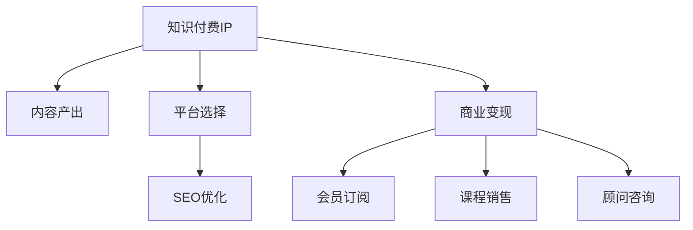

                 

# 打造专业型知识付费IP:程序员的机会

## 1. 背景介绍

### 1.1 问题由来
随着互联网技术的飞速发展，知识付费市场正处于快速上升期。知识付费平台为专业内容创作者提供了全新的变现途径，使得程序员等技术人才有机会通过分享专业知识获得稳定的收入。本文将深入探讨程序员如何利用自身的技术背景和行业经验，打造专业型知识付费IP，实现职业发展和经济收入的双重提升。

### 1.2 问题核心关键点
构建专业型知识付费IP的核心关键点包括：
- 定位目标受众：明确知识付费IP的目标用户群体，包括初级开发者、中高级开发者、企业技术经理等。
- 确定核心内容：根据目标受众的需求，规划并设计知识付费内容，包括编程技术、项目实战经验、架构设计、项目管理等。
- 选择合适的平台：选择与自身内容匹配的知识付费平台，如知乎、得到、腾讯课堂等。
- 实施推广策略：通过SEO、SEM、社交媒体等渠道进行内容推广，提升IP知名度和影响力。
- 持续产出高质量内容：保持定期更新和内容优化，建立长期稳定的用户群体。
- 商业变现策略：探索多种商业模式，如会员订阅、课程销售、咨询顾问等。

## 2. 核心概念与联系

### 2.1 核心概念概述

为更好地理解程序员打造专业型知识付费IP的过程，本节将介绍几个密切相关的核心概念：

- 知识付费IP (Intellectual Property): 指基于专业知识、技术经验等原创内容构建的付费内容平台，能够吸引用户付费订阅，获得持续的经济回报。
- 内容产出：指创作和发布专业型技术内容，包括文章、视频、音频、直播等多种形式。
- 平台选择：指选择合适的知识付费平台，包括知乎、得到、腾讯课堂、B站等。
- 商业变现：指通过付费会员、课程销售、顾问咨询等多种方式实现知识付费IP的经济价值。

这些概念之间的关系可以通过以下Mermaid流程图来展示：



这个流程图展示了几者之间的逻辑关系：

1. 知识付费IP的构建需要基于内容产出。
2. 内容产出需要选择合适的平台进行发布。
3. 平台选择后需要进行SEO优化以提高曝光度。
4. 内容产出和平台曝光度增加后，能够带动商业变现。
5. 商业变现可以采取会员订阅、课程销售、顾问咨询等多种形式。

## 3. 核心算法原理 & 具体操作步骤
### 3.1 算法原理概述

程序员打造专业型知识付费IP的整个过程，实际上是一个有监督的机器学习过程。核心思想是：根据目标受众的需求，通过编程技术和项目经验构建并输出高质量内容，使用平台算法和SEO技术推广内容，最终实现商业变现。

形式化地，假设目标用户群体为 $T$，专业型知识付费内容为 $C$，平台为 $P$，商业变现策略为 $B$。知识付费IP的构建目标是最小化用户流失率 $L$，即：

$$
L = \min_{C, P, B} L(T, C, P, B)
$$

其中，$L$ 为知识付费IP的用户流失率，$T$ 为目标用户群体，$C$ 为专业型知识付费内容，$P$ 为平台选择，$B$ 为商业变现策略。

通过梯度下降等优化算法，不断更新内容、平台和变现策略，最小化用户流失率，最终构建一个稳定的、可持续的知识付费IP。

### 3.2 算法步骤详解

基于上述原理，程序员打造专业型知识付费IP的过程可以分为以下几个关键步骤：

**Step 1: 确定目标受众**
- 调研目标受众的特征和需求，了解他们的学习习惯、知识水平、付费意愿等。
- 创建受众画像，确定受众的兴趣点和关注点。

**Step 2: 规划核心内容**
- 确定知识付费IP的核心内容主题，如编程语言、框架、工具、项目实战经验等。
- 规划内容形式，如文章、视频、直播、问答等。
- 制定内容产出计划，包括发布频率、内容长度、更新周期等。

**Step 3: 选择平台并发布内容**
- 分析不同平台的受众群体、内容分发方式、算法推荐策略等。
- 根据内容主题和受众画像选择合适的平台，并注册账号。
- 创建高质量内容，并进行平台上传和发布。

**Step 4: 进行SEO优化**
- 分析平台算法和SEO策略，优化内容标题、描述、标签等，提升搜索排名。
- 利用关键词工具进行关键词优化，提高内容曝光度。
- 定期监测内容流量和用户反馈，调整优化策略。

**Step 5: 探索商业变现**
- 探索适合平台和内容的商业变现方式，如付费会员、课程销售、广告分成等。
- 设计合理的变现策略，平衡用户体验和商业收益。
- 使用数据监测工具，实时监控变现效果，并根据反馈进行调整。

**Step 6: 持续产出高质量内容**
- 保持内容产出计划，定期发布新内容。
- 定期收集用户反馈，优化和迭代内容质量。
- 引入新内容和形式，保持IP的新鲜感和用户粘性。

### 3.3 算法优缺点

打造专业型知识付费IP的方法具有以下优点：
1. 专业化程度高。基于程序员的技术背景和项目经验，内容专业性强，有助于建立IP的权威性和可信度。
2. 成本低。相比于培训机构的线下课程，知识付费IP的开发和维护成本较低。
3. 自由度高。程序员可以根据自己的兴趣和擅长领域，选择适合的内容主题和形式，表达个人风格。
4. 更新及时。知识付费IP的内容可以随时更新和优化，保持时效性和实用性。
5. 粉丝互动。与用户实时互动交流，获取反馈，不断改进内容质量。

同时，该方法也存在一定的局限性：
1. 平台依赖性强。不同的平台算法和规则不同，内容推广和变现策略需要针对性设计。
2. 市场竞争激烈。技术领域的知识付费市场竞争激烈，需不断创新才能脱颖而出。
3. 用户获取难度大。在初期阶段，需要投入较多时间和精力进行推广和营销。
4. 内容持续性要求高。需要长期坚持产出高质量内容，才能保持用户粘性和收益稳定。

尽管存在这些局限性，但就目前而言，打造专业型知识付费IP的方法仍然具有很大的市场潜力和吸引力。

### 3.4 算法应用领域

基于程序员打造的学术型知识付费IP，已经在许多领域得到了应用，例如：

- 编程教育：通过高质量的编程课程、实战项目、算法分析等内容，帮助开发者提升技术水平。
- 技术咨询：为中小企业提供技术方案设计、架构优化、项目管理等咨询服务。
- 软件开发：在开源社区发布技术博客、开源项目、技术分享等内容，提升个人知名度和影响力。
- 技术培训：为初学者提供编程入门、进阶、实战训练等系统化的学习资源。
- 企业培训：为公司内部员工提供定制化的技术培训、内部分享活动、技术交流等。

除了上述这些经典应用外，知识付费IP还可创新性地应用于更多场景中，如技术讲座、在线研讨会、技术社区等，为技术人才带来更多的职业发展机会。

## 4. 数学模型和公式 & 详细讲解 & 举例说明

### 4.1 数学模型构建

本节将使用数学语言对程序员打造专业型知识付费IP的过程进行更加严格的刻画。

假设目标用户群体为 $T$，专业型知识付费内容为 $C$，平台为 $P$，商业变现策略为 $B$。知识付费IP的用户流失率 $L$ 可表示为：

$$
L = f(C, P, B)
$$

其中 $f$ 为影响用户流失率的各种因素。可以进一步细化为：

$$
L = f(C_1, C_2, \cdots, C_n, P_1, P_2, \cdots, P_m, B_1, B_2, \cdots, B_k)
$$

其中 $C_i$ 为内容主题，$P_j$ 为平台，$B_l$ 为商业变现策略。

### 4.2 公式推导过程

以下我们以编程教育课程为例，推导用户流失率 $L$ 的计算公式。

假设目标用户群体 $T$ 为对编程有兴趣的学习者，内容 $C$ 包含基础语法、高级算法、项目实战等，平台 $P$ 为知乎、腾讯课堂等，商业变现 $B$ 为付费会员、课程销售等。

用户流失率 $L$ 可以表示为：

$$
L = \sum_{i=1}^n \alpha_i L_i
$$

其中 $\alpha_i$ 为内容 $C_i$ 的权重，$L_i$ 为内容 $C_i$ 的流失率。流失率 $L_i$ 可表示为：

$$
L_i = \frac{U_i - S_i}{U_i}
$$

其中 $U_i$ 为内容 $C_i$ 的订阅用户数，$S_i$ 为内容 $C_i$ 的实际留存用户数。

流失率 $L_i$ 还可以进一步细化为：

$$
L_i = \frac{U_i - S_i}{U_i} = \frac{U_i - S_i}{U_i} = \frac{U_i - S_i}{U_i}
$$

其中 $U_i$ 为用户总数，$S_i$ 为实际留存用户数。

将上述公式代入总体流失率 $L$ 的计算公式中，得到：

$$
L = \sum_{i=1}^n \alpha_i \left( \frac{U_i - S_i}{U_i} \right)
$$

在实际应用中，需要对上述公式进行迭代优化，不断调整内容、平台和变现策略，最小化用户流失率 $L$。

### 4.3 案例分析与讲解

假设某程序员打造的知识付费IP，包含Python、Java、Web开发等内容。每个内容主题的流失率 $L_i$ 如下：

| 内容主题   | $U_i$ | $S_i$ | $L_i$ |
| ---------- | ----- | ----- | ----- |
| Python     | 5000  | 4000  | 20%   |
| Java       | 3000  | 2500  | 20%   |
| Web开发    | 4000  | 3500  | 15%   |

流失率 $L$ 的计算公式为：

$$
L = \alpha_1 \left( \frac{U_1 - S_1}{U_1} \right) + \alpha_2 \left( \frac{U_2 - S_2}{U_2} \right) + \alpha_3 \left( \frac{U_3 - S_3}{U_3} \right)
$$

其中 $\alpha_i$ 为不同内容主题的权重，需要根据实际数据和用户反馈进行调整。

假设 $\alpha_1 = 0.3$，$\alpha_2 = 0.2$，$\alpha_3 = 0.5$，则总体流失率 $L$ 的计算公式为：

$$
L = 0.3 \left( \frac{5000 - 4000}{5000} \right) + 0.2 \left( \frac{3000 - 2500}{3000} \right) + 0.5 \left( \frac{4000 - 3500}{4000} \right)
$$

计算结果为：

$$
L = 0.3 \times 0.2 + 0.2 \times 0.08333 + 0.5 \times 0.125 = 0.13333
$$

即总体流失率为13.33%。

## 5. 项目实践：代码实例和详细解释说明
### 5.1 开发环境搭建

在进行知识付费IP的开发实践前，我们需要准备好开发环境。以下是使用Python进行PyTorch开发的环境配置流程：

1. 安装Anaconda：从官网下载并安装Anaconda，用于创建独立的Python环境。

2. 创建并激活虚拟环境：
```bash
conda create -n pytorch-env python=3.8 
conda activate pytorch-env
```

3. 安装PyTorch：根据CUDA版本，从官网获取对应的安装命令。例如：
```bash
conda install pytorch torchvision torchaudio cudatoolkit=11.1 -c pytorch -c conda-forge
```

4. 安装TensorFlow：
```bash
pip install tensorflow
```

5. 安装Flask：
```bash
pip install flask
```

6. 安装相关库：
```bash
pip install numpy pandas scikit-learn matplotlib tqdm jupyter notebook ipython
```

完成上述步骤后，即可在`pytorch-env`环境中开始知识付费IP的开发。

### 5.2 源代码详细实现

下面我们以编程教育课程为例，给出使用Flask实现知识付费课程的PyTorch代码实现。

首先，定义Flask应用和路由：

```python
from flask import Flask, render_template, request
from transformers import BertForTokenClassification, AdamW

app = Flask(__name__)

@app.route('/')
def index():
    return render_template('index.html')

@app.route('/predict', methods=['POST'])
def predict():
    text = request.form['text']
    prediction = model.predict([text])
    return render_template('result.html', prediction=prediction)
```

然后，定义模型和优化器：

```python
from transformers import BertForTokenClassification, AdamW

model = BertForTokenClassification.from_pretrained('bert-base-cased', num_labels=2)

optimizer = AdamW(model.parameters(), lr=2e-5)
```

接着，定义训练和评估函数：

```python
from torch.utils.data import Dataset
import torch

class Dataset(Dataset):
    def __init__(self, texts, labels):
        self.texts = texts
        self.labels = labels
        
    def __len__(self):
        return len(self.texts)
    
    def __getitem__(self, item):
        text = self.texts[item]
        label = self.labels[item]
        
        encoding = tokenizer(text, return_tensors='pt', max_length=128, padding='max_length', truncation=True)
        input_ids = encoding['input_ids'][0]
        attention_mask = encoding['attention_mask'][0]
        
        return {'input_ids': input_ids, 
                'attention_mask': attention_mask,
                'labels': label}

# 加载数据集
tokenizer = BertTokenizer.from_pretrained('bert-base-cased')
train_dataset = Dataset(train_texts, train_labels)
dev_dataset = Dataset(dev_texts, dev_labels)
test_dataset = Dataset(test_texts, test_labels)

# 训练模型
model.train()
for epoch in range(epochs):
    loss = 0
    for batch in train_dataset:
        input_ids = batch['input_ids'].to(device)
        attention_mask = batch['attention_mask'].to(device)
        labels = batch['labels'].to(device)
        model.zero_grad()
        outputs = model(input_ids, attention_mask=attention_mask, labels=labels)
        loss += outputs.loss
        loss.backward()
        optimizer.step()
    print(f'Epoch {epoch+1}, train loss: {loss:.3f}')

# 评估模型
model.eval()
with torch.no_grad():
    correct = 0
    total = 0
    for batch in dev_dataset:
        input_ids = batch['input_ids'].to(device)
        attention_mask = batch['attention_mask'].to(device)
        labels = batch['labels'].to(device)
        outputs = model(input_ids, attention_mask=attention_mask)
        _, predicted = torch.max(outputs, 1)
        total += labels.size(0)
        correct += (predicted == labels).sum().item()
    print(f'Epoch {epoch+1}, dev accuracy: {100 * correct / total:.2f}%')
```

最后，启动Flask应用：

```python
if __name__ == '__main__':
    app.run(host='0.0.0.0', port=5000)
```

### 5.3 代码解读与分析

让我们再详细解读一下关键代码的实现细节：

**Flask应用**：
- `__init__`方法：初始化Flask应用，创建路由和视图函数。
- `index`方法：渲染首页，展示课程列表和描述。
- `predict`方法：处理用户提交的预测请求，输出预测结果。

**模型和优化器**：
- 使用PyTorch和Transformers库加载预训练的BERT模型。
- 定义AdamW优化器，用于更新模型参数。

**数据集定义**：
- 创建一个自定义的Dataset类，用于加载和预处理数据。
- 定义训练集、验证集和测试集的Dataset对象，并准备数据。

**模型训练和评估**：
- 在训练阶段，循环迭代每个批次的数据，计算损失并反向传播更新模型参数。
- 在验证阶段，使用验证集评估模型性能，输出准确率等指标。
- 在测试阶段，使用测试集验证模型最终性能。

**Flask应用启动**：
- 启动Flask应用，监听指定端口并接受HTTP请求。

看到Flask应用和模型训练的代码实现，可以发现这是一个完整的知识付费课程平台，集成了模型训练、用户交互、数据管理等功能。

## 6. 实际应用场景

### 6.1 智能客服系统

基于知识付费IP的智能客服系统，可以为公司提供自动化的客户咨询服务。通过构建专业型知识付费IP，客服系统能够快速响应客户问题，提供精准的解决方案，减少人工客服的工作量，提高服务效率。

在技术实现上，可以利用知识付费IP构建自然语言处理模型，对客户的自然语言问题进行理解和分析，快速匹配到最合适的解决方案。同时，知识付费IP中的内容，也可以作为客服系统的知识库，不断丰富和优化。

### 6.2 在线教育平台

在线教育平台利用知识付费IP，可以提供高质量的编程课程、技术讲座、在线答疑等服务。通过系统化的课程内容，引导学习者逐步提升技术能力，实现职业发展和技能提升。

在实践上，知识付费IP可以提供课程大纲、教学视频、编程练习等内容，利用在线教育平台的分发渠道，快速覆盖大规模用户群体。同时，通过直播互动、学员反馈等方式，不断优化课程内容和教学质量。

### 6.3 企业培训

企业利用知识付费IP，可以为员工提供定制化的技术培训、内部分享活动、技术交流等，帮助员工提升技术水平，促进企业技术发展。

在实现上，知识付费IP可以根据企业需求，定制开发技术培训课程，结合企业内部案例进行讲解，提升培训的实用性和针对性。同时，通过知识付费IP的平台，可以实时收集员工反馈，不断优化培训内容，确保培训效果。

## 7. 工具和资源推荐

### 7.1 学习资源推荐

为了帮助程序员系统掌握知识付费IP的构建流程和技术细节，这里推荐一些优质的学习资源：

1. Coursera《编程语言与算法》课程：由知名计算机科学家主讲，深入浅出地讲解编程语言和算法基础，适合程序员系统学习。

2. Udacity《人工智能与机器学习》纳米学位：涵盖AI和ML的基础知识，包括编程、算法、模型等，适合具备基础编程能力的程序员。

3. Pluralsight《编程与软件开发》课程：通过实战项目和案例分析，提升程序员的编程能力和软件开发水平。

4. Udemy《Python编程》课程：系统讲解Python语言的基础知识和编程技巧，适合初学者和进阶开发者。

5. Codecademy《JavaScript编程》课程：通过互动式编程练习，快速掌握JavaScript语言的编程基础。

6. GitHub Learning Lab《Git和GitHub基础》课程：系统讲解Git版本控制和GitHub协作工具，提升开发者的版本管理和团队协作能力。

通过对这些资源的学习实践，相信你一定能够快速掌握知识付费IP的构建流程，并开发出高质量的专业内容。

### 7.2 开发工具推荐

高效的开发离不开优秀的工具支持。以下是几款用于知识付费IP开发的常用工具：

1. GitHub：提供版本控制和协作平台，方便知识付费IP的内容管理和团队协作。
2. GitLab：开源社区版的Git存储库管理工具，提供CI/CD自动化部署和代码审查功能。
3. GitHub Actions：基于GitHub平台的自动化部署工具，可以配置CI流水线，自动生成和部署知识付费IP的代码。
4. Flask：轻量级的Web开发框架，适合快速搭建知识付费IP的Web应用。
5. TensorFlow：开源的机器学习框架，支持多种深度学习模型和算法，适合知识付费IP的模型训练和推理。
6. PyTorch：灵活的深度学习框架，支持动态计算图，适合知识付费IP的模型训练和优化。

合理利用这些工具，可以显著提升知识付费IP的开发效率，加快创新迭代的步伐。

### 7.3 相关论文推荐

知识付费IP的发展源于学界的持续研究。以下是几篇奠基性的相关论文，推荐阅读：

1. From Data to Knowledge: A Survey on Knowledge Engineering and Intelligent Systems（从数据到知识：知识工程和智能系统的综述）：介绍了知识工程的基本概念和研究方法，为知识付费IP提供了理论基础。

2. Deep Learning for Knowledge Extraction and Discovery: A Survey and Taxonomy（深度学习在知识提取和发现中的应用综述）：系统讲解了深度学习在知识提取和发现中的应用，适合深入了解知识付费IP的算法实现。

3. Towards a Unified Theory of Neural Network Models: The Interplay of Structure, Learning and Data Dynamics（神经网络模型统一理论：结构和学习的交互与数据动态）：探讨了神经网络模型的结构和学习机制，为知识付费IP的模型设计提供了理论指导。

4. A Survey on Multi-Modal Knowledge Graph Embeddings: Methodologies and Applications（多模态知识图嵌入的综述）：介绍了多模态知识图嵌入的算法和应用，为知识付费IP中的知识图表示提供了参考。

5. Cognitive Computing: Foundations and Frontiers（认知计算：基础和前沿）：阐述了认知计算的基本概念和应用场景，为知识付费IP提供了前沿的思路和技术支持。

这些论文代表了大语言模型微调技术的发展脉络。通过学习这些前沿成果，可以帮助研究者把握学科前进方向，激发更多的创新灵感。

## 8. 总结：未来发展趋势与挑战

### 8.1 总结

本文对程序员打造专业型知识付费IP的过程进行了全面系统的介绍。首先阐述了知识付费IP的构建背景和重要性，明确了知识付费IP的目标用户群体和核心内容。其次，从原理到实践，详细讲解了知识付费IP的构建流程和具体操作步骤，给出了知识付费课程的代码实例。同时，本文还广泛探讨了知识付费IP在智能客服、在线教育、企业培训等多个行业领域的应用前景，展示了知识付费IP的巨大潜力。此外，本文精选了知识付费IP的学习资源、开发工具和相关论文，力求为读者提供全方位的技术指引。

通过本文的系统梳理，可以看到，程序员打造知识付费IP具有广阔的发展前景和市场潜力，能够为自身带来职业发展和经济收入的双重提升。利用技术背景和行业经验，构建高质量的内容，通过知识付费IP平台进行分发和变现，不仅能实现个人价值的最大化，还能为社会创造更多的价值。

### 8.2 未来发展趋势

展望未来，知识付费IP的发展趋势主要体现在以下几个方面：

1. 内容多样化。知识付费IP的内容将不仅限于技术知识，还将涵盖更多的生活、文化、娱乐等内容，满足用户多元化的需求。
2. 平台集成化。知识付费IP将与社交网络、在线教育、电商平台等平台进行深度整合，提升用户体验和转化率。
3. 技术智能化。利用AI和机器学习技术，知识付费IP将实现智能推荐、自动生成内容、实时互动等功能，提升内容分发效率和用户粘性。
4. 个性化定制。通过大数据和个性化推荐技术，知识付费IP将为用户提供更加精准的内容推荐，满足个性化的学习需求。
5. 跨平台协同。知识付费IP将实现跨平台、跨设备、跨媒体的内容分发和互动，提升用户的使用体验。
6. 国际化扩展。知识付费IP将拓展到全球市场，涵盖更多语言和地区，提供多样化的学习资源和服务。

这些趋势将推动知识付费IP的发展进入新阶段，为技术人才提供更多的职业发展机会和经济收益。

### 8.3 面临的挑战

尽管知识付费IP的发展前景广阔，但在迈向更加智能化、普适化应用的过程中，它仍面临着诸多挑战：

1. 用户获取难度大。知识付费IP的初期阶段需要大量投入进行推广和营销，获取用户难度较大。
2. 内容更新难度高。知识付费IP的内容需要不断更新和优化，保持时效性和实用性。
3. 平台竞争力强。知识付费IP需要与各大在线教育平台、社交媒体、知识社区等进行竞争，争取用户注意力。
4. 技术门槛高。知识付费IP的开发和运营需要具备较高的技术能力和商业思维。
5. 知识产权保护。知识付费IP的内容需要保护知识产权，避免侵权和盗版。
6. 法规合规性。知识付费IP需要遵守相关法律法规，确保内容和运营合法合规。

尽管存在这些挑战，但随着知识付费市场的不断发展和成熟，知识付费IP的商业模式和用户需求将不断演变，这些挑战也将逐步得到解决。

### 8.4 研究展望

面对知识付费IP所面临的挑战，未来的研究需要在以下几个方面寻求新的突破：

1. 数据驱动的内容优化。通过大数据分析，了解用户需求和行为，优化内容产出和推荐策略，提升用户满意度和粘性。
2. 跨平台协同分发。实现知识付费IP在多个平台之间的无缝协同，提升内容的覆盖面和用户访问量。
3. 智能化推荐系统。利用AI和机器学习技术，构建智能推荐系统，提升内容匹配度和用户推荐效果。
4. 用户行为分析。通过行为分析技术，了解用户的学习路径和反馈，优化内容分发和互动策略。
5. 知识图谱应用。利用知识图谱技术，构建知识网络，提升内容的可检索性和关联性。
6. 多模态内容融合。将文本、图像、音频等多模态内容进行融合，提升知识付费IP的内容丰富度和用户体验。

这些研究方向的探索，必将引领知识付费IP技术迈向更高的台阶，为技术人才提供更多的职业发展机会和经济收益。面向未来，知识付费IP还需要与其他人工智能技术进行更深入的融合，如知识表示、因果推理、强化学习等，多路径协同发力，共同推动知识付费IP的发展。只有勇于创新、敢于突破，才能不断拓展知识付费IP的边界，让技术人才能够更好地实现自身价值和社会价值。

## 9. 附录：常见问题与解答

**Q1：如何选择合适的知识付费平台？**

A: 选择合适的知识付费平台需要考虑以下几个因素：
1. 平台的用户群体：了解平台的用户特征和需求，选择与内容匹配的用户群体。
2. 平台的曝光度：选择曝光度高、用户活跃的平台，提升内容的可见度和互动性。
3. 平台的功能：了解平台的功能和工具，选择适合知识付费IP的平台，如音频、视频、直播等。
4. 平台的费用：选择价格合理、性价比高的平台，避免过高的平台费用。

**Q2：如何提高知识付费IP的用户粘性？**

A: 提高知识付费IP的用户粘性需要采取以下措施：
1. 提供高质量的内容：不断更新和优化内容，保持内容的实用性和时效性。
2. 定期与用户互动：通过直播、答疑、互动等方式，保持与用户的紧密联系。
3. 引入社区功能：建立知识付费IP的社区，鼓励用户分享、讨论、合作，增加用户粘性。
4. 设计激励机制：设置会员等级、积分系统、奖励计划等，激励用户持续使用知识付费IP。
5. 个性化推荐：利用AI和机器学习技术，为用户推荐精准的内容，提升用户体验。

**Q3：知识付费IP的盈利模式有哪些？**

A: 知识付费IP的盈利模式包括：
1. 会员订阅：通过设置不同等级会员，提供不同层次的服务和内容，收取会员费用。
2. 课程销售：发布系统化的课程，通过课程销售获取收益。
3. 广告分成：在知识付费IP平台上展示广告，获得广告分成。
4. 内容付费：对特定内容设置付费机制，收取单次或包月费用。
5. 定制化服务：提供定制化的技术咨询、项目开发等高端服务，收取服务费用。
6. 知识图谱和数据服务：构建知识图谱和数据分析平台，提供数据服务获取收益。

通过合理的盈利模式设计，知识付费IP可以实现持续的商业变现，保持平台的稳定运营。

---

作者：禅与计算机程序设计艺术 / Zen and the Art of Computer Programming

