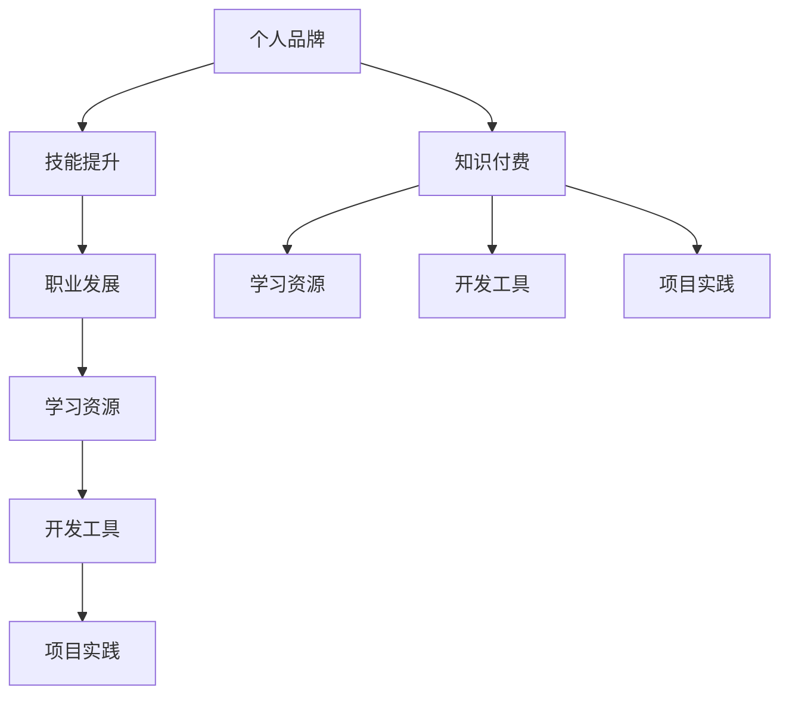

                 

# 打造个人品牌:程序员的知识付费之路

> 关键词：个人品牌，程序员，知识付费，技能提升，职业发展，学习资源，开发工具，项目实践

## 1. 背景介绍

### 1.1 问题由来

在数字化时代，个人品牌的塑造不仅对于程序员的职业发展具有重要意义，更是其获取更高价值回报的关键途径。随着知识付费市场的兴起，程序员群体日益成为知识付费的重要消费群体。如何在这个趋势中脱颖而出，打造个人品牌，提升自身的市场竞争力，成为了每位程序员不可回避的重要课题。

## 2. 核心概念与联系

### 2.1 核心概念概述

为了更全面理解如何通过知识付费打造个人品牌，本节将详细阐述以下核心概念：

- **个人品牌**：指通过一系列有目的的自我营销和内容创作，在特定领域内建立的专业形象和声誉，能够提升个人在职场和市场中的认可度。
- **知识付费**：指通过付费方式获取知识、技能、经验等智力劳动成果的行为，常见的形式包括在线课程、技术博客、代码开源、线上咨询等。
- **技能提升**：指通过持续学习、实践和迭代，不断提升自身编程能力和技术水平的动态过程。
- **职业发展**：指通过积累专业知识、扩大人脉关系、提升个人品牌，逐步实现职业目标，包括升职加薪、转行等。
- **学习资源**：指各种有助于程序员提升技能和知识的学习资料，包括在线课程、技术博客、书籍、视频、论坛等。
- **开发工具**：指程序员用于开发和编程的各类工具和软件，涵盖IDE、版本控制、项目管理、自动化测试等工具。
- **项目实践**：指通过实际项目锻炼和提升编程技能，积累开发经验，增加项目作品集，提升实战能力。

这些核心概念之间存在紧密的联系：个人品牌是职业发展的基石，而技能提升、职业发展则是个人品牌形成和维护的关键路径。学习资源和开发工具是技能提升的必要条件，项目实践则是技能提升和品牌塑造的实践途径。以下是一个概念联系的Mermaid流程图：



### 2.2 核心概念原理和架构

个人品牌的建立是一个多维度、多渠道的长期过程，涉及自我定位、内容创作、市场营销、互动反馈等多个环节。

**自我定位**：明确个人擅长的领域和目标受众，制定清晰的职业规划和发展路径。

**内容创作**：持续创作与专业领域相关的技术文章、项目案例、技术讲解等，展示专业实力和实践经验。

**市场营销**：通过社交媒体、博客、视频平台等渠道推广内容，建立个人在特定领域的影响力。

**互动反馈**：积极与读者、同行、客户互动，收集反馈，不断改进和完善内容创作和营销策略。

知识付费平台为个人品牌提供了重要的发展舞台，通过提供有价值的内容，能够获得良好的市场认可和经济回报，进一步巩固个人品牌的市场地位。

## 3. 核心算法原理 & 具体操作步骤

### 3.1 算法原理概述

打造个人品牌的过程，可以通过一系列有步骤的算法和策略实现。这些算法和策略主要包括以下几个环节：

1. **定位分析算法**：通过分析个人技能、经验、兴趣等，确定最适合的职业方向和目标受众。
2. **内容生成算法**：根据定位结果，生成有价值、有深度、有体系的内容。
3. **营销推广算法**：利用社交媒体、搜索引擎优化（SEO）、内容聚合等手段，推广内容，吸引关注。
4. **互动反馈算法**：通过分析互动数据，优化内容创作和营销策略，提升个人品牌影响力。

### 3.2 算法步骤详解

#### 3.2.1 定位分析算法

1. **技能评估**：
   - 自我评估：列出自己的技能、经验、项目等，进行自我分析和评价。
   - 行业评估：调研所在行业的技术需求、市场趋势、发展方向，确定技术差距。
   - 目标受众分析：识别潜在的目标受众群体，包括同行、企业客户、技术爱好者等。

2. **职业规划**：
   - 设定短期和长期职业目标，如掌握新技能、转行、升职加薪等。
   - 制定具体的学习路径和技能提升计划。

3. **领域定位**：
   - 选择最擅长的技术领域或专业方向。
   - 根据目标受众需求，确定核心技术点和差异化优势。

#### 3.2.2 内容生成算法

1. **内容规划**：
   - 根据定位结果，规划内容的类型和主题。
   - 制定内容创作计划，包括博客文章、技术文章、视频讲解、开源项目等。

2. **内容创作**：
   - 撰写有深度、有逻辑、有实际应用价值的技术文章。
   - 制作技术视频、在线课程等视觉内容，提升传播效果。
   - 参与开源项目，积累实际开发经验，增加作品集。

3. **内容优化**：
   - 通过SEO、关键字优化等手段，提升内容在搜索引擎中的排名。
   - 定期更新内容，保持内容的及时性和实用性。

#### 3.2.3 营销推广算法

1. **社交媒体推广**：
   - 注册并运营LinkedIn、GitHub、Medium等专业社交平台，定期发布内容。
   - 参与技术讨论和社区互动，建立良好的人脉关系。

2. **SEO优化**：
   - 优化博客和文章标题、关键词、元标签，提升搜索引擎排名。
   - 通过内部链接和外部链接，增加内容的传播范围。

3. **邮件营销**：
   - 收集邮件订阅者，定期发送有价值的技术文章和资讯。
   - 使用邮件营销工具，分析邮件打开率、点击率等指标，优化营销效果。

#### 3.2.4 互动反馈算法

1. **反馈收集**：
   - 通过评论、点赞、分享等形式，收集受众的反馈。
   - 使用调查问卷、在线访谈等方式，直接向受众获取意见和建议。

2. **数据分析**：
   - 分析受众反馈和互动数据，识别受众需求和痛点。
   - 利用数据挖掘工具，进行行为分析，优化内容创作和营销策略。

3. **内容迭代**：
   - 根据反馈和分析结果，调整和改进内容创作方向。
   - 定期更新博客和视频，保持内容的时效性和相关性。

### 3.3 算法优缺点

个人品牌打造的知识付费方法具有以下优点：

1. **系统性**：通过有计划、有步骤的算法实现，保证了个人品牌塑造的系统性和科学性。
2. **针对性**：根据个人定位和受众需求，精准制定内容创作和营销策略，提升效果。
3. **可持续性**：通过互动反馈和数据分析，不断优化和改进，持续提升个人品牌影响力。

同时，该方法也存在以下局限：

1. **时间投入高**：内容创作和互动反馈需要持续的时间投入，对于工作繁忙的程序员来说，可能面临时间管理问题。
2. **内容质量要求高**：高质量内容的制作需要专业知识和技能，内容质量的高低直接影响个人品牌的效果。
3. **市场竞争激烈**：知识付费市场竞争激烈，如何突出个人特色，吸引目标受众，是一个重要挑战。
4. **技术与工具要求**：需要具备一定的技术知识和工具使用能力，如SEO、社交媒体管理等。

### 3.4 算法应用领域

个人品牌打造的知识付费方法，广泛应用于以下几个领域：

1. **职业发展**：
   - 通过技术博客、开源项目、技术讲座等，提升技术能力和市场认可度，实现职业晋升和转行。

2. **技术分享**：
   - 通过技术博客、技术视频、开源项目等方式，分享技术经验和实践成果，帮助他人提升技能。

3. **商业咨询**：
   - 利用自身在特定技术领域的深厚积累，为企业提供技术咨询和解决方案，获取商业回报。

4. **教育培训**：
   - 开设技术课程、在线讲座，教授编程技能和经验，赚取培训费用。

5. **产品营销**：
   - 通过技术博客、社交媒体等渠道，推广个人开发的产品或工具，获取推广费用。

## 4. 数学模型和公式 & 详细讲解 & 举例说明

### 4.1 数学模型构建

为了更好地理解和应用个人品牌打造的知识付费方法，本节将使用数学语言对核心算法进行详细描述。

记个人品牌塑造的策略向量为 $\mathbf{x}$，其各项元素分别代表技能评估、内容创作、营销推广、互动反馈等策略的强度。设目标受众的反应向量为 $\mathbf{y}$，其中 $y_i$ 表示受众对第 $i$ 个策略的反应强度，$i=1,2,...,n$。则个人品牌的影响力 $I$ 可以表示为：

$$
I = \mathbf{x}^T\mathbf{y}
$$

其中 $\mathbf{x}^T$ 为策略向量 $\mathbf{x}$ 的转置，$n$ 为策略数量。

### 4.2 公式推导过程

1. **定位分析算法**：
   $$
   \mathbf{x} = \alpha_1 \mathbf{S} + \alpha_2 \mathbf{I} + \alpha_3 \mathbf{T}
   $$
   其中 $\mathbf{S}$ 为技能评估矩阵，$\alpha_1$ 为技能评估策略的权重；$\mathbf{I}$ 为目标受众需求矩阵，$\alpha_2$ 为目标受众分析策略的权重；$\mathbf{T}$ 为技术趋势矩阵，$\alpha_3$ 为技术趋势分析策略的权重。

2. **内容生成算法**：
   $$
   \mathbf{y} = \beta_1 \mathbf{C} + \beta_2 \mathbf{V} + \beta_3 \mathbf{O}
   $$
   其中 $\mathbf{C}$ 为内容创作矩阵，$\beta_1$ 为内容创作策略的权重；$\mathbf{V}$ 为视觉内容矩阵，$\beta_2$ 为视觉内容策略的权重；$\mathbf{O}$ 为开源项目矩阵，$\beta_3$ 为开源项目策略的权重。

3. **营销推广算法**：
   $$
   \mathbf{y} = \gamma_1 \mathbf{S} + \gamma_2 \mathbf{L} + \gamma_3 \mathbf{E}
   $$
   其中 $\mathbf{S}$ 为社交媒体矩阵，$\gamma_1$ 为社交媒体推广策略的权重；$\mathbf{L}$ 为SEO矩阵，$\gamma_2$ 为SEO优化策略的权重；$\mathbf{E}$ 为邮件营销矩阵，$\gamma_3$ 为邮件营销策略的权重。

4. **互动反馈算法**：
   $$
   \mathbf{y} = \delta_1 \mathbf{F} + \delta_2 \mathbf{A} + \delta_3 \mathbf{I}
   $$
   其中 $\mathbf{F}$ 为反馈收集矩阵，$\delta_1$ 为反馈收集策略的权重；$\mathbf{A}$ 为数据分析矩阵，$\delta_2$ 为数据分析策略的权重；$\mathbf{I}$ 为内容迭代矩阵，$\delta_3$ 为内容迭代策略的权重。

### 4.3 案例分析与讲解

以下是一个个人品牌打造的案例分析：

**案例背景**：
小明是一名中级前端开发者，希望通过打造个人品牌，提升自己的市场竞争力。

**定位分析**：
- 技能评估：擅长JavaScript和React，了解Node.js，掌握一些基础的前端框架。
- 行业评估：前端技术日新月异，需要持续学习和提升。
- 目标受众分析：主要面向企业客户和前端开发者社区。

**内容生成**：
- 技术博客：每月发布3-4篇关于JavaScript、React、Node.js等前端技术的内容。
- 技术视频：录制并上传YouTube视频，讲解JavaScript高级特性、React技术栈搭建等。
- 开源项目：参与开源社区项目，如Vue、React等，贡献代码并完善文档。

**营销推广**：
- 社交媒体：在LinkedIn、GitHub上定期更新博客和视频，参与社区讨论。
- SEO优化：优化博客和视频的标题、关键词、元标签，提升搜索引擎排名。
- 邮件营销：通过邮件订阅服务，定期发送最新技术文章和视频，与订阅者保持联系。

**互动反馈**：
- 反馈收集：通过博客评论、视频留言、邮件订阅反馈等方式，了解受众需求和反馈。
- 数据分析：使用Google Analytics等工具，分析博客和视频的浏览量、用户停留时间等指标。
- 内容迭代：根据反馈和数据分析结果，调整博客和视频的内容方向，优化SEO策略。

通过上述算法和策略，小明逐步提升了自身品牌影响力，获得了更多开发项目机会和职业晋升机会。

## 5. 项目实践：代码实例和详细解释说明

### 5.1 开发环境搭建

为了实践个人品牌打造的知识付费方法，首先需要搭建开发环境。

1. **安装开发环境**：
   - 安装Python：
   ```bash
   sudo apt-get update
   sudo apt-get install python3-pip
   sudo apt-get install python3-venv
   ```
   - 创建虚拟环境：
   ```bash
   python3 -m venv myenv
   source myenv/bin/activate
   ```
   - 安装相关包：
   ```bash
   pip install Flask Jinja2
   ```

2. **搭建博客平台**：
   - 下载并解压WordPress到本地，安装MySQL数据库。
   - 配置数据库：
   ```bash
   sudo cp /usr/src/wp-config.php.example /var/www/html/wp-config.php
   sudo nano /var/www/html/wp-config.php
   ```
   - 启动WordPress：
   ```bash
   sudo systemctl start apache2
   ```

3. **安装插件和主题**：
   - 安装技术文章插件：
   ```bash
   sudo apt-get install wordpress-plugin-disqus
   ```
   - 安装技术主题：
   ```bash
   sudo apt-get install wordpress-theme-alfa-technote
   ```

### 5.2 源代码详细实现

以下是一个使用Flask和Jinja2搭建个人博客平台的Python代码实现：

```python
from flask import Flask, render_template, request
from werkzeug.utils import secure_filename

app = Flask(__name__)

@app.route('/')
def index():
    return render_template('index.html')

@app.route('/upload', methods=['POST'])
def upload():
    file = request.files['file']
    filename = secure_filename(file.filename)
    file.save(os.path.join(app.config['UPLOAD_FOLDER'], filename))
    return render_template('upload.html')

if __name__ == '__main__':
    app.run(debug=True)
```

### 5.3 代码解读与分析

**Flask框架**：
- Flask是Python的一个轻量级Web框架，易于上手。
- 通过装饰器定义路由，实现对URL的映射和处理。
- 使用模板引擎Jinja2，动态生成HTML页面。

**路由和视图函数**：
- `@app.route('/')` 定义主页路由，调用 `index` 函数。
- `@app.route('/upload', methods=['POST'])` 定义上传路由，调用 `upload` 函数。
- 在 `index` 函数中，通过 `render_template` 渲染 `index.html` 模板。
- 在 `upload` 函数中，使用 `werkzeug.utils.secure_filename` 函数处理文件上传，保存至指定目录。

**运行展示**：
- 启动Flask应用：
  ```bash
  python app.py
  ```
- 访问浏览器：
  ```bash
  open http://localhost:5000
  ```
- 上传博客文章：
  ```bash
  curl -F "file=@blog.md" http://localhost:5000/upload
  ```
- 查看上传文章：
  ```bash
  open http://localhost:5000
  ```

## 6. 实际应用场景

### 6.1 智能咨询

智能咨询是通过个人品牌打造，为企业客户和项目提供专业、高效的咨询服务。

**案例背景**：
某企业需要在项目中引入新技术，但又缺乏相关经验，希望找到合适的技术顾问。

**解决方案**：
- 技术博客：撰写技术文章，详细介绍新技术的原理、优势、应用场景等。
- 技术视频：制作视频教程，演示新技术的使用方法和案例。
- 开源项目：参与开源社区，推动技术项目的发展，增加项目的透明度和可信度。
- 在线咨询：提供在线咨询服务，解答企业客户的技术问题。

通过以上步骤，企业客户可以迅速获得全面、专业的技术支持，解决技术难题，提高项目成功率。

### 6.2 培训课程

培训课程是通过个人品牌打造，为企业和学校提供系统化的技术培训服务。

**案例背景**：
某教育机构希望开设前端开发培训课程，但缺乏优秀的讲师资源。

**解决方案**：
- 技术博客：撰写培训课程的详细内容，包括课程大纲、学习路径、课程资源等。
- 技术视频：录制课程讲解视频，演示实际开发流程和技术难点。
- 在线讲座：举办技术讲座，与学员互动，解答课程相关问题。
- 教材编写：编写培训教材，系统总结课程内容和技术要点。

通过以上步骤，教育机构可以吸引更多的学员报名，提升培训效果和市场竞争力。

## 7. 工具和资源推荐

### 7.1 学习资源推荐

为了深入理解个人品牌打造的知识付费方法，以下是一些推荐的学习资源：

1. **《打造个人品牌》书籍**：详细介绍了个人品牌打造的过程和方法，涵盖定位分析、内容创作、市场营销等环节。
2. **《知识付费时代》课程**：介绍知识付费市场的现状和发展趋势，解析成功案例。
3. **《知识营销实战》书籍**：深入探讨知识营销的策略和技巧，帮助打造个人品牌。
4. **《SEO优化》课程**：系统讲解搜索引擎优化的技巧和工具，提升内容在搜索引擎中的排名。
5. **《社交媒体营销》课程**：介绍社交媒体平台的运营技巧和营销策略，提升个人品牌的传播效果。

### 7.2 开发工具推荐

为了高效实践个人品牌打造的知识付费方法，以下是一些推荐的开发工具：

1. **Flask**：轻量级的Python Web框架，适合快速搭建个人博客平台。
2. **Jinja2**：Flask的模板引擎，支持动态生成HTML页面。
3. **MySQL**：关系型数据库，适合存储博客文章、用户评论等数据。
4. **WordPress**：开源的博客平台，易于安装和使用。
5. **GitHub**：代码托管平台，适合发布开源项目和代码。
6. **Git**：版本控制系统，适合管理代码版本和项目协作。

### 7.3 相关论文推荐

为了进一步深入理解个人品牌打造的知识付费方法，以下是一些推荐的论文：

1. **《个人品牌打造：理论与实践》**：详细介绍个人品牌打造的过程和方法，涵盖定位分析、内容创作、市场营销等环节。
2. **《知识付费市场分析》**：系统分析知识付费市场的现状和发展趋势，解析成功案例。
3. **《社交媒体营销策略》**：深入探讨社交媒体平台的运营技巧和营销策略，提升个人品牌的传播效果。
4. **《SEO优化策略》**：系统讲解搜索引擎优化的技巧和工具，提升内容在搜索引擎中的排名。
5. **《知识营销的心理学》**：深入探讨知识营销的心理学原理和行为模式，帮助提升营销效果。

## 8. 总结：未来发展趋势与挑战

### 8.1 研究成果总结

本文详细介绍了个人品牌打造的知识付费方法，涵盖了定位分析、内容创作、市场营销、互动反馈等多个环节。通过系统性的策略和算法，提升了个人品牌的影响力和市场竞争力。具体包括以下几点：

1. **定位分析算法**：通过技能评估、目标受众分析、技术趋势分析，确定个人品牌的方向和受众。
2. **内容生成算法**：通过技术博客、技术视频、开源项目等形式，展示个人技术和实践经验。
3. **营销推广算法**：通过社交媒体、SEO、邮件营销等手段，推广个人品牌和内容。
4. **互动反馈算法**：通过反馈收集、数据分析、内容迭代等，不断优化和改进个人品牌策略。

### 8.2 未来发展趋势

未来，个人品牌打造的知识付费方法将呈现以下几个发展趋势：

1. **内容多样化**：从单一的技术博客、视频教程扩展到电子书、在线课程、技术讲座等更多样化的内容形式。
2. **平台多元化**：从传统的博客、视频平台，拓展到社交媒体、知识付费平台、在线教育平台等更多元化的传播渠道。
3. **社交化互动**：加强与受众的互动交流，利用社区、论坛等平台，建立紧密的人脉关系。
4. **数据驱动决策**：通过数据分析和机器学习，优化内容创作和营销策略，提升品牌效果。
5. **国际化拓展**：将个人品牌扩展到国际市场，提升全球影响力。

### 8.3 面临的挑战

尽管个人品牌打造的知识付费方法具有广阔的发展前景，但在实践中仍面临诸多挑战：

1. **时间管理**：内容创作和互动反馈需要持续的时间投入，如何平衡工作与个人品牌打造是一个重要问题。
2. **内容质量**：高质量内容的制作需要专业知识和技能，内容质量的高低直接影响个人品牌的效果。
3. **市场竞争**：知识付费市场竞争激烈，如何突出个人特色，吸引目标受众，是一个重要挑战。
4. **技术与工具**：需要具备一定的技术知识和工具使用能力，如SEO、社交媒体管理等。
5. **变现模式**：如何实现个人品牌的商业变现，是一个需要深入探索的问题。

### 8.4 研究展望

未来，个人品牌打造的知识付费方法需要不断创新和改进，以适应市场和技术的不断变化。以下是一些研究展望：

1. **个性化推荐**：通过数据分析和推荐算法，个性化推送内容给目标受众，提升用户粘性和互动效果。
2. **内容自动化生成**：利用自然语言生成技术，自动生成技术文章、视频讲解等内容，提升内容创作效率。
3. **交互式内容**：开发交互式技术文章、虚拟课堂等，提升用户参与度和互动效果。
4. **跨平台整合**：整合博客、视频、社交媒体等多平台内容，形成统一的品牌形象和传播效果。
5. **内容付费模式**：探索更多元化的内容付费模式，如按需订阅、按内容付费、按互动付费等。

总之，个人品牌打造的知识付费方法需要在内容创作、市场营销、互动反馈等多个环节不断优化和创新，才能适应市场的快速变化，持续提升个人品牌的竞争力和市场影响力。

## 9. 附录：常见问题与解答

### 常见问题

**Q1: 如何选择合适的技术博客平台？**

A: 根据个人需求和受众群体选择合适的技术博客平台。常用的博客平台包括WordPress、Medium、GitHub等，可以根据平台的使用便捷性、社区活跃度、SEO效果等因素进行选择。

**Q2: 如何提升SEO效果？**

A: 通过以下方法提升SEO效果：
1. 优化博客和文章的标题、关键词、元标签等，确保关键词密度合理。
2. 使用内部链接和外部链接，增加内容的传播范围。
3. 定期更新博客和文章，保持内容的时效性和相关性。

**Q3: 如何建立社交媒体互动？**

A: 通过以下方法建立社交媒体互动：
1. 在社交媒体平台上定期发布内容，与受众互动。
2. 参与技术讨论和社区活动，建立良好的人脉关系。
3. 通过社交媒体平台收集反馈，了解受众需求和痛点。

**Q4: 如何优化内容创作流程？**

A: 通过以下方法优化内容创作流程：
1. 使用项目管理工具，如Trello、JIRA等，制定内容创作计划和时间节点。
2. 利用内容生成工具，如Grammarly、Hemingway等，提升内容质量和可读性。
3. 引入协同编辑和版本控制，提升团队协作效率。

**Q5: 如何实现个人品牌的商业变现？**

A: 通过以下方法实现个人品牌的商业变现：
1. 开设技术课程、在线讲座，收取培训费用。
2. 发布技术书籍、电子书，通过销售渠道获得收益。
3. 开发和推广自己的开发工具和产品，获取商业回报。

### 解答

通过上述系统性的个人品牌打造知识付费方法，程序员可以逐步提升个人品牌的影响力和市场竞争力，为职业发展、技术分享、商业变现等目标奠定坚实基础。

---

作者：禅与计算机程序设计艺术 / Zen and the Art of Computer Programming

