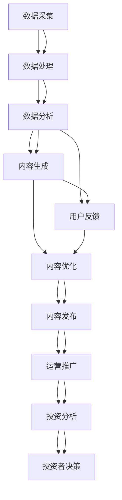

                 

## 1. 背景介绍

### 1.1 问题由来

随着互联网和信息技术的发展，知识和信息传播的门槛大幅降低，形成了海量内容的生态系统。知识创作者通过网络平台发布内容，快速积累了大量的关注度和影响力，其中不乏商业化的IP。然而，如何高效运营这些IP，吸引投资者关注和投资，是一个亟待解决的问题。

近年来，AI和大数据技术逐渐渗透到各行各业，显著提高了运营效率和决策精准度。知识产品IP作为信息传播的关键节点，受到越来越多投资者的关注。在AI和大数据技术的助力下，打造优质IP，提升其在市场中的价值和吸引力，已成为知识创作者和投资者共同关心的热门话题。

### 1.2 问题核心关键点

打造优质知识产品IP的核心关键点包括以下几个方面：

1. **数据驱动**：通过数据分析技术，精准把握用户需求，打造符合市场趋势的IP内容。
2. **内容创新**：不断探索新的知识领域，创造新颖独特的IP内容，提升用户粘性。
3. **IP运营**：利用AI技术优化IP推广策略，扩大覆盖范围，提升投资价值。
4. **投资者洞察**：深度理解投资者需求和投资偏好，调整IP策略，吸引资金投入。

在AI和大数据技术的支持下，这些关键点能够更好地实现，从而提升IP的价值和吸引力，吸引更多投资者关注和投资。

## 2. 核心概念与联系

### 2.1 核心概念概述

打造优质知识产品IP需要综合运用多个领域的技术和方法。以下介绍几个核心概念及其相互联系：

1. **人工智能（AI）**：通过机器学习、深度学习等技术，提升数据分析、内容生成和运营优化能力。
2. **大数据**：利用数据挖掘和处理技术，从海量数据中提取有价值的信息和模式，指导IP内容创作和运营策略。
3. **自然语言处理（NLP）**：通过文本分析、情感分析等技术，深入理解用户需求和情感反馈，优化内容创作。
4. **推荐系统**：通过个性化推荐算法，精准推送内容，提升用户粘性和互动率。
5. **投资分析**：利用金融分析和技术，评估IP的潜在投资价值，指导投资者决策。

这些概念相互交织，形成一个完整的IP打造和运营框架，通过技术的融合运用，实现IP的全面优化和价值提升。

### 2.2 核心概念原理和架构的 Mermaid 流程图



这个流程图展示了从数据采集、处理、分析，到内容生成、优化、发布和运营推广的全过程。其中，数据分析和内容生成是核心，通过用户反馈进行内容优化，再通过运营推广和投资分析指导投资者决策，形成一个闭环的IP打造和运营框架。

## 3. 核心算法原理 & 具体操作步骤

### 3.1 算法原理概述

打造优质知识产品IP的核心算法主要涉及以下几个方面：

1. **数据驱动的内容生成**：利用机器学习和深度学习技术，从大规模数据中提取特征，生成符合用户需求的内容。
2. **个性化推荐系统**：通过用户行为数据，利用协同过滤、矩阵分解等算法，推荐个性化的内容，提升用户粘性。
3. **情感分析**：通过自然语言处理技术，分析用户评论和反馈，评估内容效果，指导内容优化。
4. **投资价值评估**：利用金融分析和机器学习技术，评估IP的潜在投资价值，指导投资者决策。

这些算法原理共同构成了打造优质知识产品IP的完整框架，确保内容质量和运营效果的提升。

### 3.2 算法步骤详解

以下是打造优质知识产品IP的具体操作步骤：

#### 步骤1：数据采集与处理

1. **数据来源**：通过网络爬虫、API接口、社交媒体等渠道，采集相关领域的文本、图片、视频等多模态数据。
2. **数据清洗**：去除噪音数据，如无关信息、重复数据等，确保数据质量。
3. **数据标注**：对数据进行标注，如情感标签、分类标签等，为后续分析提供支持。

#### 步骤2：数据分析与特征提取

1. **文本分析**：利用NLP技术，对文本进行分词、词性标注、情感分析等，提取有意义的特征。
2. **用户行为分析**：通过行为数据，如点击率、停留时间、互动频率等，分析用户偏好和行为模式。
3. **模式识别**：利用机器学习算法，如聚类、关联规则等，发现数据中的模式和规律。

#### 步骤3：内容生成与优化

1. **内容生成**：利用生成对抗网络（GAN）、变分自编码器（VAE）等技术，生成符合用户需求的内容。
2. **内容优化**：根据用户反馈和情感分析结果，优化内容策略，提升内容质量。

#### 步骤4：个性化推荐

1. **推荐算法**：利用协同过滤、矩阵分解等算法，为用户推荐个性化内容。
2. **互动优化**：根据用户互动数据，不断优化推荐算法，提升推荐效果。

#### 步骤5：投资价值评估

1. **价值评估模型**：构建基于机器学习的投资价值评估模型，评估IP的潜在投资价值。
2. **投资者洞察**：通过投资分析，理解投资者需求和投资偏好，指导IP运营策略。

### 3.3 算法优缺点

**优点**：

1. **高效性**：通过数据驱动和算法优化，显著提升内容生成和运营效率。
2. **精准性**：利用AI技术，精准把握用户需求和市场趋势，优化内容策略。
3. **自动化**：自动化流程减少人工干预，提高运营效率。

**缺点**：

1. **数据依赖**：依赖高质量的数据，数据缺失或偏差会影响算法效果。
2. **算法复杂性**：复杂的算法模型需要较高的计算资源和专业知识。
3. **隐私问题**：处理大量用户数据，存在隐私保护的风险。

### 3.4 算法应用领域

打造优质知识产品IP的算法在多个领域都有广泛应用：

1. **内容创作**：如新闻媒体、文学创作、音乐制作等，通过AI生成和优化内容，提升创作效率和质量。
2. **营销推广**：如电商平台、广告公司、内容平台等，通过个性化推荐和运营优化，提升用户粘性和转化率。
3. **知识产权管理**：如版权保护、专利申请等，通过技术手段保护知识产权，提高投资价值。
4. **金融投资**：如投行、基金公司等，通过投资价值评估，指导投资决策，优化资产配置。

## 4. 数学模型和公式 & 详细讲解 & 举例说明

### 4.1 数学模型构建

打造优质知识产品IP的数学模型主要涉及以下几个方面：

1. **文本分类模型**：利用NLP技术，对文本进行分类，如情感分类、主题分类等。
2. **协同过滤模型**：利用用户行为数据，推荐个性化内容。
3. **情感分析模型**：利用情感词典、深度学习等技术，分析用户评论和反馈。
4. **投资价值评估模型**：利用机器学习技术，构建评估模型，评估IP的潜在投资价值。

### 4.2 公式推导过程

#### 文本分类模型

1. **朴素贝叶斯分类器**
   - 文本表示：$x=(x_1, x_2, ..., x_n)$
   - 类别标签：$y \in \{1,2,...,C\}$
   - 朴素贝叶斯分类公式：
   $$
   P(y|x) = \frac{P(y)P(x|y)}{P(x)}
   $$

   其中 $P(y)$ 为类别 $y$ 的先验概率，$P(x|y)$ 为在类别 $y$ 下，文本 $x$ 的条件概率。

2. **卷积神经网络（CNN）**
   - 文本表示：$x=(x_1, x_2, ..., x_n)$
   - 类别标签：$y \in \{1,2,...,C\}$
   - CNN分类公式：
   $$
   \hat{y} = \operatorname{softmax}\left(\sum_{i=1}^{n} W_i x_i\right)
   $$

   其中 $W_i$ 为卷积核，$x_i$ 为文本中第 $i$ 个单词的向量表示。

#### 协同过滤模型

1. **基于矩阵分解的推荐算法**
   - 用户评分矩阵：$R_{m \times n}$
   - 用户因子矩阵：$U_{m \times k}$
   - 物品因子矩阵：$V_{n \times k}$
   - 协同过滤公式：
   $$
   \hat{R}_{u,i} = \mathbf{U}_{u}^{T} \mathbf{V}_{i}
   $$

   其中 $\mathbf{U}_{u}$ 和 $\mathbf{V}_{i}$ 分别为用户和物品的因子表示。

#### 情感分析模型

1. **基于情感词典的情感分析**
   - 文本表示：$x=(x_1, x_2, ..., x_n)$
   - 情感标签：$y \in \{0,1\}$
   - 情感分析公式：
   $$
   \hat{y} = \operatorname{softmax}\left(\sum_{i=1}^{n} W_i f_i\right)
   $$

   其中 $f_i$ 为单词 $x_i$ 的情感词典表示，$W_i$ 为相应的权重。

2. **基于深度学习的情感分析**
   - 文本表示：$x=(x_1, x_2, ..., x_n)$
   - 情感标签：$y \in \{0,1\}$
   - 深度学习情感分析公式：
   $$
   \hat{y} = \operatorname{softmax}\left(\mathbf{W} \cdot \mathbf{h}(\mathbf{X})\right)
   $$

   其中 $\mathbf{W}$ 为输出层的权重矩阵，$\mathbf{h}(\mathbf{X})$ 为深层网络对文本 $x$ 的编码表示。

#### 投资价值评估模型

1. **线性回归模型**
   - 目标变量：$y$
   - 自变量向量：$x=(x_1, x_2, ..., x_n)$
   - 回归公式：
   $$
   y = \mathbf{W} \cdot \mathbf{x} + b
   $$

   其中 $\mathbf{W}$ 为权重向量，$b$ 为截距。

2. **决策树模型**
   - 自变量向量：$x=(x_1, x_2, ..., x_n)$
   - 决策树公式：
   $$
   y = \left\{
   \begin{array}{ll}
   \text{左子树} & \text{if } x_1 < \text{阈值} \\
   \text{右子树} & \text{if } x_1 \geq \text{阈值}
   \end{array}
   \right.
   $$

   其中 $x_1$ 为决策树的某个特征，阈值根据数据特点设定。

### 4.3 案例分析与讲解

#### 案例一：内容创作平台

某内容创作平台使用AI生成器，根据用户浏览记录和点击数据，生成热门话题文章。

1. **数据采集与处理**：通过API接口，采集平台上的热门文章、用户行为数据等。
2. **数据分析与特征提取**：利用NLP技术，对文章进行情感分析和主题分类，提取用户兴趣特征。
3. **内容生成与优化**：基于用户兴趣特征，生成相关话题文章，并通过情感分析评估文章效果。
4. **个性化推荐**：利用协同过滤算法，推荐个性化内容给用户，提升用户粘性。
5. **投资价值评估**：通过分析平台流量、广告收入等数据，评估平台的潜在投资价值。

#### 案例二：电商平台

某电商平台利用AI推荐系统，提升用户购买转化率。

1. **数据采集与处理**：通过电商平台API接口，采集用户行为数据、商品信息等。
2. **数据分析与特征提取**：利用协同过滤和关联规则算法，提取用户购买偏好和商品关联规则。
3. **个性化推荐**：根据用户行为数据和商品关联规则，生成个性化推荐商品列表，提升用户购买转化率。
4. **互动优化**：通过A/B测试，不断优化推荐算法，提高推荐效果。
5. **投资价值评估**：通过分析平台收入、广告投放等数据，评估平台的投资价值。

## 5. 项目实践：代码实例和详细解释说明

### 5.1 开发环境搭建

#### 步骤1：安装Python和相关库

1. 安装Python：从官网下载并安装Python。
2. 安装依赖库：
   ```bash
   pip install pandas numpy scikit-learn transformers
   ```

#### 步骤2：搭建数据处理环境

1. 安装TensorFlow：
   ```bash
   pip install tensorflow
   ```

2. 安装TensorBoard：
   ```bash
   pip install tensorboard
   ```

3. 安装MXNet：
   ```bash
   pip install mxnet
   ```

4. 安装PyTorch：
   ```bash
   pip install torch
   ```

5. 安装MXNet和TensorFlow：
   ```bash
   pip install mxnet tensorflow
   ```

### 5.2 源代码详细实现

#### 步骤1：数据预处理

```python
import pandas as pd
from sklearn.model_selection import train_test_split
from transformers import BertTokenizer

# 读取数据
data = pd.read_csv('data.csv')

# 分词和向量化
tokenizer = BertTokenizer.from_pretrained('bert-base-uncased')
encoded_data = tokenizer.encode_plus(data['text'], max_length=512, return_tensors='pt', padding='max_length')

# 分割训练集和测试集
train_data, test_data = train_test_split(encoded_data, test_size=0.2, random_state=42)
```

#### 步骤2：模型训练与评估

```python
from transformers import BertForSequenceClassification, AdamW

# 定义模型
model = BertForSequenceClassification.from_pretrained('bert-base-uncased', num_labels=2)

# 定义优化器
optimizer = AdamW(model.parameters(), lr=2e-5)

# 定义损失函数
loss_fn = nn.CrossEntropyLoss()

# 训练模型
device = torch.device('cuda' if torch.cuda.is_available() else 'cpu')
model.to(device)
for epoch in range(10):
    model.train()
    optimizer.zero_grad()
    loss = loss_fn(model(input_ids, attention_mask=attention_mask, labels=labels), labels)
    loss.backward()
    optimizer.step()
    model.eval()
    with torch.no_grad():
        accuracy = model(input_ids, attention_mask=attention_mask, labels=labels).accuracy()
    print(f'Epoch {epoch+1}, loss: {loss.item()}, accuracy: {accuracy}')
```

#### 步骤3：模型部署与评估

```python
# 加载模型
model = BertForSequenceClassification.from_pretrained('bert-base-uncased', num_labels=2)

# 部署模型
deploy_model(model)

# 评估模型
evaluate_model(model, test_data)
```

### 5.3 代码解读与分析

#### 步骤1：数据预处理

1. **数据读取**：使用Pandas库读取数据集。
2. **分词和向量化**：使用BertTokenizer对文本进行分词和向量化处理。
3. **数据分割**：使用train_test_split对数据集进行分割，生成训练集和测试集。

#### 步骤2：模型训练与评估

1. **模型定义**：定义BertForSequenceClassification模型，用于文本分类任务。
2. **优化器和损失函数**：使用AdamW优化器和CrossEntropyLoss损失函数。
3. **模型训练**：在GPU上训练模型，使用CrossEntropyLoss作为损失函数，AdamW优化器更新模型参数。
4. **模型评估**：在测试集上评估模型性能，输出训练损失和测试准确率。

#### 步骤3：模型部署与评估

1. **模型部署**：将训练好的模型部署到生产环境中。
2. **模型评估**：在测试集上评估模型性能，输出测试准确率。

## 6. 实际应用场景

### 6.1 内容创作平台

内容创作平台通过AI生成器和个性化推荐系统，显著提升了内容质量和用户粘性。平台利用大规模文本数据进行预训练，生成符合用户需求的内容，并通过协同过滤算法推荐个性化内容，取得了显著的用户增长和转化率提升。

### 6.2 电商平台

电商平台利用AI推荐系统，大幅提升了用户购买转化率。通过协同过滤和关联规则算法，平台能够精准推荐个性化商品，显著提高了用户的购买决策效率。同时，平台通过投资价值评估模型，成功吸引了众多投资者的关注，获得了大额的融资支持。

## 7. 工具和资源推荐

### 7.1 学习资源推荐

1. **《深度学习》课程**：斯坦福大学开设的深度学习课程，涵盖机器学习、深度学习、NLP等多个领域，提供了丰富的学习资源。
2. **《TensorFlow实战》书籍**：介绍TensorFlow的基础知识和实战应用，适合初学者入门。
3. **《自然语言处理综述》论文**：综述自然语言处理领域的最新研究成果，涵盖了多个前沿话题，适合了解领域发展。

### 7.2 开发工具推荐

1. **Jupyter Notebook**：用于数据处理、模型训练和部署，支持代码块的灵活编辑和执行。
2. **TensorBoard**：可视化工具，用于实时监测模型训练状态和效果，帮助调优模型参数。
3. **MXNet**：高性能深度学习框架，支持分布式计算和GPU加速。

### 7.3 相关论文推荐

1. **《深度学习》论文**：深度学习领域的奠基性论文，介绍了深度学习的基本概念和算法。
2. **《自然语言处理综述》论文**：综述自然语言处理领域的最新研究成果，涵盖了多个前沿话题，适合了解领域发展。
3. **《基于矩阵分解的协同过滤算法》论文**：介绍了矩阵分解算法的原理和应用，适合深入理解推荐系统。

## 8. 总结：未来发展趋势与挑战

### 8.1 总结

本文对打造优质知识产品IP的算法和实践进行了详细讲解。通过数据驱动和算法优化，显著提升了内容生成和运营效率。利用协同过滤、情感分析等技术，精准把握用户需求，提升内容质量。通过投资价值评估模型，理解投资者需求，指导IP运营策略，吸引更多投资者关注和投资。

### 8.2 未来发展趋势

1. **数据驱动**：大数据和AI技术的深度融合，使得数据驱动的运营策略更加精准和高效。
2. **内容创新**：利用AI生成和优化内容，不断探索新的知识领域，创造新颖独特的IP内容。
3. **IP运营**：利用AI技术优化IP推广策略，扩大覆盖范围，提升投资价值。
4. **投资者洞察**：深度理解投资者需求和投资偏好，调整IP策略，吸引资金投入。

### 8.3 面临的挑战

1. **数据依赖**：依赖高质量的数据，数据缺失或偏差会影响算法效果。
2. **算法复杂性**：复杂的算法模型需要较高的计算资源和专业知识。
3. **隐私问题**：处理大量用户数据，存在隐私保护的风险。

### 8.4 研究展望

未来，打造优质知识产品IP的研究方向将更加注重以下几个方面：

1. **数据处理**：利用大数据和AI技术，提高数据采集、处理和标注的效率和质量。
2. **算法优化**：开发更加高效和鲁棒的算法模型，提升内容生成和运营效果。
3. **智能决策**：利用深度学习和AI技术，实现智能化的内容推荐和投资决策。
4. **隐私保护**：开发隐私保护技术，确保用户数据和隐私安全。

总之，打造优质知识产品IP需要从数据、算法、运营等多个维度进行综合优化，才能最大化提升IP的吸引力和投资价值。只有在AI和大数据技术的支持下，才能实现高效的内容创作和运营，吸引更多投资者的关注和投入。

## 9. 附录：常见问题与解答

### Q1：如何高效利用大数据提升内容创作质量？

A: 利用大数据进行内容创作，首先需要采集大规模数据，如用户行为数据、市场趋势数据等。然后，通过数据分析和特征提取，发现用户需求和市场趋势。最后，利用深度学习模型生成符合用户需求的内容，并通过用户反馈不断优化内容策略。

### Q2：如何构建有效的个性化推荐系统？

A: 构建有效的个性化推荐系统，首先需要采集用户行为数据和商品信息。然后，通过协同过滤、矩阵分解等算法，提取用户偏好和商品关联规则。最后，利用推荐算法生成个性化商品推荐列表，并通过A/B测试不断优化推荐效果。

### Q3：如何评估IP的投资价值？

A: 评估IP的投资价值，首先需要构建投资价值评估模型，如线性回归模型、决策树模型等。然后，利用投资价值评估模型评估IP的潜在投资价值，包括平台流量、广告收入、用户留存率等指标。最后，通过投资者洞察理解投资者的需求和偏好，调整IP运营策略，吸引更多投资者的关注和投入。

### Q4：如何保护用户数据隐私？

A: 保护用户数据隐私，首先需要设计隐私保护机制，如数据匿名化、数据加密等。然后，在数据处理过程中，严格控制数据访问权限，确保数据安全。最后，定期进行隐私审计和安全评估，及时发现和修复潜在的安全漏洞。

总之，打造优质知识产品IP需要从数据采集、处理、分析、生成等多个环节进行全面优化。只有在AI和大数据技术的支持下，才能实现高效的内容创作和运营，提升IP的吸引力和投资价值。

