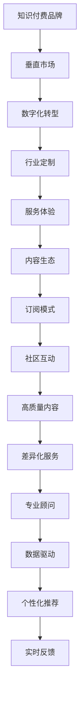

                 

# 打造垂直技术领域的知识付费品牌

> 关键词：知识付费品牌,技术领域,垂直市场,数字化转型,行业定制,服务体验,内容生态,订阅模式,社区互动,高质量内容,差异化服务,专业顾问,数据驱动,个性化推荐,知识共享,实时反馈

## 1. 背景介绍

### 1.1 问题由来
随着互联网和信息技术的飞速发展，知识付费市场迎来了爆发式增长。知识付费平台通过向用户提供各类专业知识、技能培训、工具使用等内容，满足了用户个性化学习和职业发展的需求，成为了一个新兴且快速增长的行业。然而，大多数知识付费平台提供的是一般性的通用内容，难以满足行业特定需求的垂直技术领域知识付费品牌仍处于起步阶段。

### 1.2 问题核心关键点
垂直技术领域知识付费品牌的打造，需要在以下几个方面进行深入探讨和实践：
1. 精准定位目标受众，识别特定技术领域的专业知识需求。
2. 深入挖掘行业特性，设计差异化、定制化的内容和服务。
3. 构建高效的数字化平台，提升用户体验和服务质量。
4. 通过高质量内容和差异化服务，实现品牌差异化和市场竞争力。
5. 利用大数据和人工智能技术，提供个性化推荐和实时反馈。

### 1.3 问题研究意义
打造垂直技术领域的知识付费品牌，具有以下重要意义：
1. 满足行业特定需求：垂直领域的用户更注重专业深度和技术细节，通用内容难以满足其需求。
2. 提升用户学习效率：垂直内容更具针对性和实用性，能更高效地帮助用户解决问题。
3. 促进行业发展：通过分享垂直领域的专业知识和最新动态，推动技术行业的发展和创新。
4. 增强品牌影响力：通过差异化、定制化的内容和服务，塑造品牌独特性，增强市场竞争力。
5. 建立生态系统：通过社区互动、专家交流等手段，建立内容共享、技术交流的生态系统，增强用户粘性。

## 2. 核心概念与联系

### 2.1 核心概念概述

为更好地理解垂直技术领域知识付费品牌的打造，本节将介绍几个关键概念：

- **知识付费品牌(Knowledge-Based Branding)**：基于专业知识和技术技能的服务品牌，旨在为用户提供专业、有价值的内容和服务，满足其特定需求。
- **垂直市场(Niche Market)**：特指某一行业或技术领域，相对于通用的大众市场，具有更高的专业性和特定需求。
- **数字化转型(Digital Transformation)**：通过数字化手段，实现企业运营模式、产品服务、客户体验的转型和升级，提升整体竞争力和市场响应速度。
- **行业定制(industry-specific)**：根据特定行业的需求和特点，设计和提供定制化的内容和服务。
- **服务体验(Service Experience)**：用户体验，包括平台设计、内容质量、交互方式等。
- **内容生态(Content Ecosystem)**：知识付费平台上，用户、专家、内容三者互动形成的生态系统。
- **订阅模式(Subscription Model)**：用户定期支付费用，获取持续更新的高质量内容和服务。
- **社区互动(Community Interaction)**：知识付费平台上的用户交流、讨论、分享等互动行为。
- **高质量内容(High-Quality Content)**：提供深度、实用、前沿的专业技术内容。
- **差异化服务(Differentiated Services)**：提供超越市场平均水平的定制化服务。
- **专业顾问(Professional Advisor)**：在特定技术领域提供专业指导和咨询服务。
- **数据驱动(Data-Driven)**：利用大数据和AI技术，为内容推荐、用户分析、服务优化提供支持。
- **个性化推荐(Personalized Recommendation)**：根据用户兴趣和行为，提供个性化的内容和服务推荐。
- **实时反馈(Real-time Feedback)**：即时响应用户需求，进行内容更新和优化。

这些概念之间的逻辑关系可以通过以下Mermaid流程图来展示：



这个流程图展示了垂直技术领域知识付费品牌打造的关键步骤，即从品牌定位、数字化转型、行业定制到服务体验、内容生态、订阅模式等各个环节的关联。

## 3. 核心算法原理 & 具体操作步骤
### 3.1 算法原理概述

垂直技术领域知识付费品牌的打造，涉及多方面的技术和算法支持。以下是一些关键原理和算法：

**3.1.1 目标用户识别与需求分析**
- **用户画像构建**：通过用户注册、行为数据、反馈等，构建用户画像，识别不同用户群体的需求和偏好。
- **需求调研与分析**：通过问卷调查、用户访谈等方式，深入了解目标用户的需求和痛点，为内容设计提供依据。

**3.1.2 内容设计与定制**
- **专家团队组建**：组建行业内专家团队，负责内容设计、审核和更新，确保内容的专业性和权威性。
- **内容模块化设计**：将内容按主题、难度、技能等进行模块化设计，方便用户选择和组合。
- **定制化课程设计**：根据用户需求，设计定制化的课程和学习路径，提供一站式解决方案。

**3.1.3 平台设计与优化**
- **平台架构设计**：采用微服务架构、容器化部署等技术，确保平台的高可用性和可扩展性。
- **用户体验设计**：从界面设计、交互方式、功能模块等方面提升用户体验。
- **性能优化**：通过负载均衡、缓存、分布式部署等手段，提升平台性能和响应速度。

**3.1.4 数据驱动与个性化推荐**
- **数据采集与分析**：通过日志、用户行为、反馈等数据，进行用户画像、行为分析。
- **推荐算法设计**：采用协同过滤、基于内容的推荐、深度学习等算法，设计个性化推荐系统。
- **实时反馈机制**：建立用户反馈收集和处理机制，根据用户反馈进行内容更新和优化。

### 3.2 算法步骤详解

以下是垂直技术领域知识付费品牌打造的详细步骤：

**Step 1: 用户画像构建与需求分析**
- **用户画像构建**：利用用户注册信息、行为数据、反馈等，构建用户画像，识别不同用户群体的需求和偏好。
- **需求调研与分析**：通过问卷调查、用户访谈等方式，深入了解目标用户的需求和痛点，为内容设计提供依据。

**Step 2: 专家团队组建与内容设计**
- **专家团队组建**：组建行业内专家团队，负责内容设计、审核和更新，确保内容的专业性和权威性。
- **内容模块化设计**：将内容按主题、难度、技能等进行模块化设计，方便用户选择和组合。
- **定制化课程设计**：根据用户需求，设计定制化的课程和学习路径，提供一站式解决方案。

**Step 3: 平台设计与优化**
- **平台架构设计**：采用微服务架构、容器化部署等技术，确保平台的高可用性和可扩展性。
- **用户体验设计**：从界面设计、交互方式、功能模块等方面提升用户体验。
- **性能优化**：通过负载均衡、缓存、分布式部署等手段，提升平台性能和响应速度。

**Step 4: 数据驱动与个性化推荐**
- **数据采集与分析**：通过日志、用户行为、反馈等数据，进行用户画像、行为分析。
- **推荐算法设计**：采用协同过滤、基于内容的推荐、深度学习等算法，设计个性化推荐系统。
- **实时反馈机制**：建立用户反馈收集和处理机制，根据用户反馈进行内容更新和优化。

**Step 5: 品牌推广与社区互动**
- **品牌推广**：通过内容营销、社交媒体、合作伙伴等手段，提升品牌知名度和用户粘性。
- **社区互动**：建立用户交流、讨论、分享等互动行为，形成知识付费平台的社区生态。

### 3.3 算法优缺点

垂直技术领域知识付费品牌的打造，具有以下优点：
1. 满足特定需求：垂直领域的用户更注重专业深度和技术细节，定制化内容和服务更能满足其需求。
2. 提升用户学习效率：垂直内容更具针对性和实用性，能更高效地帮助用户解决问题。
3. 促进行业发展：通过分享垂直领域的专业知识和最新动态，推动技术行业的发展和创新。
4. 增强品牌影响力：通过差异化、定制化的内容和服务，塑造品牌独特性，增强市场竞争力。
5. 建立生态系统：通过社区互动、专家交流等手段，建立内容共享、技术交流的生态系统，增强用户粘性。

同时，该方法也存在以下局限性：
1. 技术要求高：垂直领域知识付费品牌需要高度专业的技术和算法支持，团队要求高。
2. 投入成本大：初期的内容设计和平台建设需要大量资源和时间投入，风险较高。
3. 市场竞争激烈：垂直领域知识付费品牌众多，市场竞争激烈，品牌突围难度大。
4. 用户获取难度大：垂直领域用户群体相对小众，获取用户流量难度大。

尽管存在这些局限性，但就目前而言，垂直技术领域知识付费品牌的打造是大势所趋，将为垂直领域的技术传播和应用提供强有力的支撑。未来相关研究的重点在于如何进一步优化内容和算法，降低投入成本，提升用户体验，增强市场竞争力。

### 3.4 算法应用领域

垂直技术领域知识付费品牌的应用领域非常广泛，主要包括：

- **技术培训**：面向软件开发、数据分析、人工智能等技术领域，提供深入、系统的培训课程。
- **行业解决方案**：针对特定行业，如医疗、金融、制造等，提供定制化的技术解决方案。
- **工具与插件**：提供垂直领域的专业工具和插件，提高用户工作效率。
- **咨询与指导**：在特定技术领域提供专业指导和咨询服务，帮助用户解决问题。
- **在线社区与论坛**：建立专业社区和论坛，促进用户之间的交流和知识共享。
- **案例分析与实战演练**：提供实际项目案例和实战演练，提升用户实战能力。
- **学习路径规划**：根据用户需求和学习目标，设计个性化的学习路径，帮助用户系统学习。

这些应用领域涵盖了垂直技术领域知识付费品牌的各个方面，通过提供专业、有价值的内容和服务，满足用户多样化的需求。

## 4. 数学模型和公式 & 详细讲解 & 举例说明

### 4.1 数学模型构建

本节将使用数学语言对垂直技术领域知识付费品牌的打造过程进行更加严格的刻画。

记目标用户集合为 $U$，需求集合为 $D$，专家团队集合为 $E$，内容集合为 $C$，平台数据集合为 $P$。定义以下函数：
- $P(U, D, E, C)$：平台提供的服务和内容
- $F(U, D, E, C)$：用户反馈和评价
- $A(U, D, E, C)$：平台对用户的个性化推荐

则垂直技术领域知识付费品牌的打造过程可以表示为：

$$
\max_{U, D, E, C, P, F, A} \sum_{i \in U} \left( \alpha_i P_i + \beta_i F_i + \gamma_i A_i \right)
$$

其中 $\alpha_i, \beta_i, \gamma_i$ 分别为用户 $i$ 对服务、反馈、推荐的权重系数，可以通过用户画像和行为分析得到。

### 4.2 公式推导过程

根据上述模型，我们对每个函数进行详细推导：

**平台服务 $P(U, D, E, C)$**
- **服务内容**：$P_i = \sum_{c \in C} c_i$，表示用户 $i$ 所使用的所有内容。
- **服务效果**：$P_i = \sum_{e \in E} e_i$，表示专家 $e$ 提供的定制化服务。

**用户反馈 $F(U, D, E, C)$**
- **反馈内容**：$F_i = \sum_{c \in C} f_{ic}$，表示用户 $i$ 对内容的评价。
- **反馈效果**：$F_i = \sum_{e \in E} f_{ie}$，表示专家 $e$ 提供的咨询服务效果。

**个性化推荐 $A(U, D, E, C)$**
- **推荐内容**：$A_i = \sum_{c \in C} a_{ic}$，表示平台根据用户 $i$ 的兴趣和行为，推荐的内容。
- **推荐效果**：$A_i = \sum_{e \in E} a_{ie}$，表示平台根据专家 $e$ 的建议，推荐的服务。

### 4.3 案例分析与讲解

假设某垂直技术领域的知识付费品牌，针对软件开发领域的用户，设计了一套定制化课程和专家咨询服务。具体步骤如下：

1. **用户画像构建**：通过用户注册信息、行为数据等，识别出开发人员、项目经理等不同用户群体，并分析其需求和偏好。
2. **内容设计与定制**：与专家团队合作，设计了从基础到高级的编程课程，包括Python、Java、C++等，并提供了实战项目案例分析。
3. **平台设计与优化**：采用微服务架构，确保平台的高可用性和可扩展性。界面设计简洁直观，功能模块丰富，支持个性化学习路径规划。
4. **数据驱动与个性化推荐**：通过用户行为数据，分析其兴趣和需求，设计推荐算法，实现内容和服务推荐。根据用户反馈，不断优化推荐系统。
5. **品牌推广与社区互动**：通过内容营销、社交媒体推广等手段，提升品牌知名度。建立开发者社区，促进用户之间的交流和知识共享。

最终，该品牌在开发人员中树立了良好的口碑，用户粘性高，市场竞争力强。

## 5. 项目实践：代码实例和详细解释说明

### 5.1 开发环境搭建

在进行垂直技术领域知识付费品牌的开发前，我们需要准备好开发环境。以下是使用Python进行Flask开发的环境配置流程：

1. 安装Anaconda：从官网下载并安装Anaconda，用于创建独立的Python环境。

2. 创建并激活虚拟环境：
```bash
conda create -n flask-env python=3.8 
conda activate flask-env
```

3. 安装Flask：
```bash
pip install flask
```

4. 安装Flask-RESTful：
```bash
pip install flask-restful
```

5. 安装SQLAlchemy：
```bash
pip install sqlalchemy
```

6. 安装Flask-WTF：
```bash
pip install flask-wtf
```

完成上述步骤后，即可在`flask-env`环境中开始开发实践。

### 5.2 源代码详细实现

这里我们以一个简单的垂直技术领域知识付费平台为例，给出使用Flask进行开发的PyTorch代码实现。

首先，定义平台的用户、内容和推荐模型类：

```python
from flask import Flask, request, jsonify
from flask_sqlalchemy import SQLAlchemy
from flask_wtf import FlaskForm
from wtforms import StringField, PasswordField, BooleanField
from wtforms.validators import DataRequired, Length
from flask_login import LoginManager, login_user, logout_user, login_required
from transformers import BertTokenizer, BertForSequenceClassification

app = Flask(__name__)
app.config['SECRET_KEY'] = 'your_secret_key'
app.config['SQLALCHEMY_DATABASE_URI'] = 'sqlite:///site.db'
db = SQLAlchemy(app)
login_manager = LoginManager(app)
login_manager.login_view = 'login'

class User(db.Model):
    id = db.Column(db.Integer, primary_key=True)
    username = db.Column(db.String(20), unique=True, nullable=False)
    password = db.Column(db.String(20), nullable=False)
    is_admin = db.Column(db.Boolean, default=False)

class Content(db.Model):
    id = db.Column(db.Integer, primary_key=True)
    title = db.Column(db.String(50), nullable=False)
    description = db.Column(db.Text, nullable=False)
    category = db.Column(db.String(20), nullable=False)
    content = db.Column(db.Text, nullable=False)

class Recommendation(db.Model):
    id = db.Column(db.Integer, primary_key=True)
    user_id = db.Column(db.Integer, db.ForeignKey('user.id'))
    content_id = db.Column(db.Integer, db.ForeignKey('content.id'))
    score = db.Column(db.Float, nullable=False)

@app.route('/login', methods=['GET', 'POST'])
def login():
    form = LoginForm()
    if form.validate_on_submit():
        user = User.query.filter_by(username=form.username.data).first()
        if user and user.password == form.password.data:
            login_user(user)
            return redirect(url_for('home'))
        else:
            flash('Invalid username or password')
    return render_template('login.html', form=form)

@app.route('/logout')
@login_required
def logout():
    logout_user()
    return redirect(url_for('home'))
```

接着，定义平台的用户注册、内容上传和推荐功能：

```python
class LoginForm(FlaskForm):
    username = StringField('Username', validators=[DataRequired(), Length(min=2, max=20)])
    password = PasswordField('Password', validators=[DataRequired()])
    remember_me = BooleanField('Remember Me')

@app.route('/register', methods=['GET', 'POST'])
def register():
    if current_user.is_authenticated:
        return redirect(url_for('home'))
    form = RegistrationForm()
    if form.validate_on_submit():
        user = User(username=form.username.data, password=form.password.data)
        db.session.add(user)
        db.session.commit()
        flash('Congratulations, you are now a registered user!')
        return redirect(url_for('login'))
    return render_template('register.html', form=form)

@app.route('/upload', methods=['POST'])
@login_required
def upload():
    title = request.form['title']
    description = request.form['description']
    category = request.form['category']
    content = request.form['content']
    
    content = BertTokenizer.from_pretrained('bert-base-cased').encode(content)
    model = BertForSequenceClassification.from_pretrained('bert-base-cased', num_labels=2)
    
    # 保存内容到数据库
    new_content = Content(title=title, description=description, category=category, content=content)
    db.session.add(new_content)
    db.session.commit()
    
    # 保存推荐信息到数据库
    user = User.query.filter_by(username=current_user.username).first()
    recommendation = Recommendation(user_id=user.id, content_id=new_content.id, score=0.5)
    db.session.add(recommendation)
    db.session.commit()
    
    flash('Content uploaded successfully!')
    return redirect(url_for('home'))

@app.route('/recommend', methods=['GET', 'POST'])
@login_required
def recommend():
    recommendations = Recommendation.query.filter_by(user_id=current_user.id).order_by(Recommendation.score.desc()).limit(5).all()
    contents = []
    for recommendation in recommendations:
        contents.append(Content.query.filter_by(id=recommendation.content_id).first())
    return render_template('recommend.html', contents=contents)
```

最后，启动平台并提供推荐服务：

```python
if __name__ == '__main__':
    app.run(debug=True)
```

以上就是使用Flask进行垂直技术领域知识付费品牌开发的完整代码实现。可以看到，Flask结合SQLAlchemy和WTForms，可以快速构建一个具有用户管理、内容上传和推荐功能的平台。

### 5.3 代码解读与分析

让我们再详细解读一下关键代码的实现细节：

**User类**：
- `id` 为用户ID。
- `username` 为用户名，唯一且不能为空。
- `password` 为密码，不能为空。
- `is_admin` 为用户是否为管理员，默认为False。

**Content类**：
- `id` 为内容ID。
- `title` 为内容标题。
- `description` 为内容描述。
- `category` 为内容类别。
- `content` 为内容本身，通过BERT tokenizer编码后存储。

**Recommendation类**：
- `id` 为推荐ID。
- `user_id` 为用户ID。
- `content_id` 为内容ID。
- `score` 为推荐分数，用于排序推荐。

**LoginForm类**：
- `username` 为用户名，必填且长度在2到20之间。
- `password` 为密码，必填。
- `remember_me` 为记住我选项，默认False。

**register()函数**：
- 判断当前用户是否已登录，如果已登录则重定向到首页。
- 创建一个表单，用于用户注册。
- 如果表单提交成功，则将新用户添加到数据库，并重定向到登录页面。
- 如果表单提交失败，则返回注册页面并显示错误信息。

**upload()函数**：
- 判断当前用户是否已登录，如果未登录则重定向到登录页面。
- 从请求中获取内容信息。
- 使用BERT tokenizer对内容进行编码。
- 将编码后的内容保存到数据库中。
- 创建新的推荐记录，并将其添加到数据库中。
- 显示内容上传成功的提示，并重定向到首页。

**recommend()函数**：
- 获取当前用户的推荐记录，并根据推荐分数排序。
- 从排序后的推荐记录中获取内容，并将其保存到列表中。
- 返回推荐页面并显示推荐内容。

可以看到，这些代码虽然简单，但涵盖了用户管理、内容上传和推荐功能的核心逻辑。开发者可以根据实际需求进行扩展和优化，例如增加搜索功能、评论功能等。

## 6. 实际应用场景

### 6.1 软件开发培训平台

软件开发是垂直技术领域的重要应用之一。基于垂直技术领域知识付费品牌打造的开发培训平台，可以为开发人员提供深入、系统的培训课程，帮助其掌握最新的技术栈和开发工具。平台可以提供实战项目案例分析，让用户通过实际项目实践，提升技能水平。

在技术实现上，平台可以通过Flask搭建，使用SQLAlchemy进行数据管理，结合BERT等预训练模型，对用户上传的内容进行分析和推荐。通过数据驱动的个性化推荐，平台能够根据用户的学习进度和兴趣，推荐适合的学习内容，提升学习效率。

### 6.2 人工智能在线教育平台

人工智能领域发展迅猛，培养具备AI能力的专业人才成为社会需求。通过垂直技术领域知识付费品牌打造的在线教育平台，可以提供高质量的人工智能课程，涵盖机器学习、深度学习、自然语言处理等多个方向。平台可以邀请行业专家进行授课，提供实时互动和答疑服务。

在技术实现上，平台可以采用Flask+SQLAlchemy+BERT等技术，对课程内容进行结构化和推荐。通过数据驱动的个性化推荐，平台能够根据用户的学习进度和兴趣，推荐适合的学习内容，提升学习效率。

### 6.3 医疗健康知识平台

医疗健康领域对专业知识的准确性和权威性要求极高。通过垂直技术领域知识付费品牌打造的医疗健康知识平台，可以提供专业的医疗健康课程和咨询服务，帮助用户掌握医疗健康知识，提升健康水平。平台可以提供医生答疑、患者互助等功能，建立专业社区。

在技术实现上，平台可以采用Flask+SQLAlchemy+BERT等技术，对医疗健康内容进行分析和推荐。通过数据驱动的个性化推荐，平台能够根据用户的健康需求，推荐适合的健康知识，提升健康水平。

### 6.4 未来应用展望

随着垂直技术领域知识付费品牌的不断成熟，其在各个垂直领域的应用前景广阔。未来，平台将不仅仅局限于课程和咨询，还将涉及更多的服务形态，如专家直播、项目合作等。平台也将更加注重用户的个性化需求，通过大数据和AI技术，实现内容、服务、用户的深度融合，提升用户体验和服务质量。

## 7. 工具和资源推荐
### 7.1 学习资源推荐

为了帮助开发者系统掌握垂直技术领域知识付费品牌打造的理论基础和实践技巧，这里推荐一些优质的学习资源：

1. **《深度学习框架与Python编程》**：一本系统介绍深度学习框架和Python编程的书籍，涵盖TensorFlow、PyTorch等多个主流框架，适合有一定编程基础的读者。
2. **《Python Web开发实战》**：一本介绍Web开发实战技能的书籍，涵盖Flask、SQLAlchemy等多个技术栈，适合初学者和进阶开发者。
3. **《机器学习实战》**：一本讲解机器学习算法和实现方法的书籍，涵盖监督学习、非监督学习等多个方向，适合对机器学习感兴趣的读者。
4. **Kaggle机器学习竞赛**：Kaggle是一个数据科学竞赛平台，参与其中的竞赛可以锻炼数据分析、模型训练、算法优化等技能，提升实战能力。
5. **Coursera、edX在线课程**：Coursera、edX等平台提供大量高质量的在线课程，涵盖数据科学、机器学习、深度学习等多个方向，适合在线学习。

通过对这些资源的学习实践，相信你一定能够快速掌握垂直技术领域知识付费品牌打造的精髓，并用于解决实际的NLP问题。

### 7.2 开发工具推荐

高效的开发离不开优秀的工具支持。以下是几款用于垂直技术领域知识付费品牌开发的常用工具：

1. **Flask**：基于Python的轻量级Web框架，易于上手，适合快速原型开发。
2. **SQLAlchemy**：Python的SQL工具包，提供ORM和SQL语句生成功能，方便数据库操作。
3. **WTForms**：基于Python的表单验证库，支持多种表单类型，方便数据输入和验证。
4. **Flask-WTF**：Flask与WTForms的集成，方便表单处理和验证。
5. **Flask-Login**：Flask的登录管理扩展，方便用户认证和权限控制。
6. **Jupyter Notebook**：Python开发常用的交互式开发环境，方便代码调试和实验。

合理利用这些工具，可以显著提升垂直技术领域知识付费品牌开发的效率，加速创新迭代的步伐。

### 7.3 相关论文推荐

垂直技术领域知识付费品牌的打造涉及多方面的技术和算法支持。以下是几篇奠基性的相关论文，推荐阅读：

1. **《深度学习在自然语言处理中的应用》**：介绍深度学习在NLP中的应用，涵盖词向量、序列模型、神经网络等多个方向，适合对深度学习感兴趣的读者。
2. **《自然语言处理：理论、方法与应用》**：一本系统介绍NLP理论、方法和应用的书籍，涵盖文本分类、信息检索、机器翻译等多个方向，适合NLP研究者和应用开发者。
3. **《机器学习实战》**：一本讲解机器学习算法和实现方法的书籍，涵盖监督学习、非监督学习等多个方向，适合对机器学习感兴趣的读者。
4. **《Python Web开发实战》**：一本介绍Web开发实战技能的书籍，涵盖Flask、SQLAlchemy等多个技术栈，适合初学者和进阶开发者。

这些论文代表了大语言模型微调技术的发展脉络。通过学习这些前沿成果，可以帮助研究者把握学科前进方向，激发更多的创新灵感。

## 8. 总结：未来发展趋势与挑战

### 8.1 总结

本文对垂直技术领域知识付费品牌的打造进行了全面系统的介绍。首先阐述了垂直技术领域知识付费品牌的研究背景和意义，明确了打造垂直领域知识付费品牌的核心需求和关键步骤。其次，从原理到实践，详细讲解了垂直技术领域知识付费品牌的数学模型和算法流程，给出了开发实践的完整代码实现。同时，本文还广泛探讨了垂直技术领域知识付费品牌在多个垂直领域的应用前景，展示了其广阔的发展潜力。最后，本文精选了知识付费品牌打造的相关学习资源，力求为读者提供全方位的技术指引。

通过本文的系统梳理，可以看到，垂直技术领域知识付费品牌的打造是大势所趋，将为垂直领域的技术传播和应用提供强有力的支撑。未来，伴随技术进步和市场竞争加剧，垂直技术领域知识付费品牌将更加注重个性化推荐、用户体验和服务质量，进一步推动垂直领域知识付费品牌的市场竞争力和品牌影响力。

### 8.2 未来发展趋势

展望未来，垂直技术领域知识付费品牌将呈现以下几个发展趋势：

1. **个性化推荐系统**：通过大数据和AI技术，实现内容的精准推荐，提升用户学习效率。
2. **多渠道内容分发**：通过社交媒体、搜索引擎、视频平台等多渠道分发内容，提升品牌知名度和用户覆盖面。
3. **动态课程体系**：根据用户需求和学习进度，动态更新课程内容，实现持续的学习和提升。
4. **交互式学习体验**：通过在线答疑、直播授课、虚拟现实等手段，提升用户学习体验和互动性。
5. **多元化服务形态**：除了课程和咨询服务，还将涉及项目合作、专家交流、社区互动等多元化的服务形态。
6. **实时反馈机制**：建立用户反馈收集和处理机制，根据用户反馈进行内容更新和优化。

这些趋势将进一步推动垂直技术领域知识付费品牌的发展，提升用户体验和服务质量，增强市场竞争力。

### 8.3 面临的挑战

尽管垂直技术领域知识付费品牌的发展前景广阔，但在打造过程中仍面临诸多挑战：

1. **内容质量控制**：如何确保内容的准确性、权威性和实用性，需要严格的审核机制和专家团队支持。
2. **用户粘性提升**：如何提升用户粘性，增强用户参与度和社区互动，需要更加丰富的内容和服务。
3. **平台运营成本**：如何降低平台运营成本，提升效率，需要优化的资源配置和高效的技术架构。
4. **市场竞争加剧**：如何应对激烈的市场竞争，提升品牌影响力和市场份额，需要创新的营销策略和差异化服务。
5. **技术迭代速度**：如何保持技术的持续迭代，满足用户不断变化的需求，需要持续的技术投入和创新。

尽管存在这些挑战，但垂直技术领域知识付费品牌的发展是大势所趋，未来相关研究的重点在于如何进一步优化内容质量、提升用户粘性、降低运营成本，以及探索多元化的服务形态，实现平台可持续发展。

### 8.4 研究展望

未来，垂直技术领域知识付费品牌的研究将主要集中在以下几个方面：

1. **内容质量控制**：开发高效的内容审核和筛选算法，提升内容的质量和实用性。
2. **个性化推荐系统**：引入深度学习、增强学习等算法，提升个性化推荐的准确性和用户体验。
3. **用户粘性提升**：通过社区互动、专家交流等手段，提升用户粘性和参与度。
4. **平台运营优化**：优化平台架构和技术栈，提升平台效率和稳定性。
5. **市场竞争应对**：通过创新的营销策略和差异化服务，提升品牌影响力和市场份额。
6. **技术持续迭代**：保持技术持续迭代，满足用户不断变化的需求。

这些研究方向将推动垂直技术领域知识付费品牌的持续发展和创新，为垂直领域的技术传播和应用提供强有力的支撑。

## 9. 附录：常见问题与解答

**Q1：如何选择合适的平台技术栈？**

A: 选择合适的平台技术栈需要考虑多方面因素，包括技术成熟度、社区支持、开发效率等。一般来说，选择主流的Web框架和数据库工具，如Flask、SQLAlchemy、WTForms等，可以满足大多数需求。同时，也可以根据实际需求引入第三方库，如BERT、TensorFlow等，进行模型训练和内容推荐。

**Q2：如何提升内容的质量和实用性？**

A: 提升内容的质量和实用性需要严格的审核机制和专家团队支持。具体措施包括：
1. 制定内容审核标准，建立专家评审机制，确保内容的专业性和权威性。
2. 引入用户评价和反馈机制，根据用户评价进行内容优化和更新。
3. 定期发布新内容，保持内容的更新和时效性。

**Q3：如何提升用户粘性和社区互动？**

A: 提升用户粘性和社区互动需要多种手段：
1. 建立专业社区和论坛，促进用户之间的交流和知识共享。
2. 引入专家直播、在线答疑等功能，提升用户互动性和参与度。
3. 定期举办线下活动和技术沙龙，增强用户粘性。

**Q4：如何降低平台运营成本？**

A: 降低平台运营成本需要优化资源配置和技术架构：
1. 采用云服务，按需扩展资源，降低硬件成本。
2. 引入缓存和负载均衡技术，提升系统性能和稳定性。
3. 使用开源软件，降低软件许可成本。

**Q5：如何应对激烈的市场竞争？**

A: 应对激烈的市场竞争需要创新的营销策略和差异化服务：
1. 制定清晰的品牌定位和差异化策略，突出品牌特色。
2. 通过多渠道内容分发和用户引流，提升品牌知名度。
3. 引入社区互动、专家交流等手段，增强用户粘性。

通过这些措施，可以有效提升垂直技术领域知识付费品牌的市场竞争力，实现可持续发展。

---

作者：禅与计算机程序设计艺术 / Zen and the Art of Computer Programming

