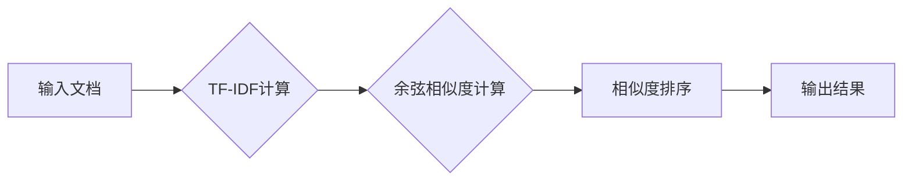

> 文档匹配，搜索推荐，TF-IDF，余弦相似度，BM25，信息检索，自然语言处理

## 1. 背景介绍

在信息爆炸的时代，海量文档的存储和检索已成为一个巨大的挑战。传统搜索引擎主要依靠关键词匹配来检索文档，但这种方法往往难以捕捉文档之间的语义关联，导致检索结果不准确。推荐系统则通过学习用户行为和偏好，为用户推荐相关内容，但传统的推荐系统往往依赖于用户历史数据，对于新用户或新内容的推荐效果有限。

文档匹配作为一种信息检索技术，旨在找到与给定文档最相似的其他文档。它可以应用于多种场景，例如：

* **搜索引擎结果排序:**  提高搜索结果的准确性和相关性。
* **文档聚类:** 将相似文档归类到一起，方便用户浏览和管理。
* **知识图谱构建:**  通过匹配文档内容，构建知识图谱，发现知识之间的关联。
* **文本相似度计算:**  用于 plagiarism 检测、文本摘要等任务。

## 2. 核心概念与联系

文档匹配的核心是衡量两个文档之间的相似度。常用的相似度度量方法包括：

* **TF-IDF:**  Term Frequency-Inverse Document Frequency，是一种统计方法，用于衡量一个词语在文档中的重要性。
* **余弦相似度:**  通过计算两个文档的向量在空间中的夹角来衡量相似度。
* **BM25:**  Best Matching 25，是一种改进的TF-IDF算法，考虑了文档长度和词语频率等因素。

**Mermaid 流程图:**



## 3. 核心算法原理 & 具体操作步骤

### 3.1  算法原理概述

文档匹配算法的基本原理是将文档转换为向量，然后使用相似度度量方法计算两个文档之间的距离。

* **TF-IDF:**  计算每个词语在文档中的词频 (Term Frequency, TF) 和在整个语料库中的逆文档频率 (Inverse Document Frequency, IDF)。然后将 TF 和 IDF 相乘得到每个词语在文档中的权重。最后，将所有词语的权重加权求和得到文档的向量表示。
* **余弦相似度:**  将两个文档的向量表示投影到同一个空间，计算两个向量之间的夹角。夹角越小，相似度越高。
* **BM25:**  基于 TF-IDF 的改进算法，考虑了文档长度和词语频率等因素，提高了算法的准确性。

### 3.2  算法步骤详解

**TF-IDF:**

1. 计算每个词语在文档中的词频 (TF)。
2. 计算每个词语在整个语料库中的逆文档频率 (IDF)。
3. 计算每个词语在文档中的权重 (TF-IDF)。
4. 将所有词语的权重加权求和得到文档的向量表示。

**余弦相似度:**

1. 将两个文档的向量表示投影到同一个空间。
2. 计算两个向量之间的夹角。
3. 使用余弦函数计算两个向量的余弦相似度。

**BM25:**

1. 计算每个词语在文档中的词频 (TF)。
2. 计算每个词语在整个语料库中的逆文档频率 (IDF)。
3. 计算每个词语在文档中的权重 (BM25)。
4. 将所有词语的权重加权求和得到文档的向量表示。

### 3.3  算法优缺点

**TF-IDF:**

* **优点:**  简单易实现，计算效率高。
* **缺点:**  无法捕捉词语之间的语义关系，对长文档的处理效果较差。

**余弦相似度:**

* **优点:**  能够捕捉词语之间的语义关系，对长文档的处理效果较好。
* **缺点:**  计算复杂度较高，对高维数据处理效果较差。

**BM25:**

* **优点:**  在 TF-IDF 的基础上进行了改进，能够更好地处理文档长度和词语频率等因素。
* **缺点:**  计算复杂度较高，参数设置较为复杂。

### 3.4  算法应用领域

* **搜索引擎结果排序:**  提高搜索结果的准确性和相关性。
* **文档聚类:**  将相似文档归类到一起，方便用户浏览和管理。
* **知识图谱构建:**  通过匹配文档内容，构建知识图谱，发现知识之间的关联。
* **文本相似度计算:**  用于 plagiarism 检测、文本摘要等任务。

## 4. 数学模型和公式 & 详细讲解 & 举例说明

### 4.1  数学模型构建

**TF-IDF 模型:**

$$TF(t,d) = \frac{f(t,d)}{\sum_{t' \in d} f(t',d)}$$

$$IDF(t) = \log \frac{N}{df(t)}$$

$$TF-IDF(t,d) = TF(t,d) \times IDF(t)$$

其中：

* $t$：词语
* $d$：文档
* $f(t,d)$：词语 $t$ 在文档 $d$ 中出现的次数
* $N$：语料库中文档总数
* $df(t)$：词语 $t$ 在语料库中出现的文档数

**余弦相似度模型:**

$$sim(d_1, d_2) = \frac{d_1 \cdot d_2}{||d_1|| ||d_2||}$$

其中：

* $d_1$ 和 $d_2$：两个文档的向量表示
* $d_1 \cdot d_2$：两个向量的点积
* $||d_1||$ 和 $||d_2||$：两个向量的模长

### 4.2  公式推导过程

**TF-IDF 公式推导:**

TF-IDF 公式的推导基于以下两个假设：

* 词语在文档中出现的次数越多，该词语对文档的主题描述越重要。
* 词语在语料库中出现的次数越少，该词语对文档的主题描述越独特。

**余弦相似度 公式推导:**

余弦相似度公式的推导基于以下几何原理：

* 两个向量的夹角越小，两个向量越相似。
* 余弦函数可以用来计算两个向量之间的夹角。

### 4.3  案例分析与讲解

**案例:**

假设有两个文档：

* 文档 1:  “机器学习是一种人工智能技术。”
* 文档 2:  “机器学习用于预测未来事件。”

**TF-IDF 计算:**

* 词语 “机器学习” 在文档 1 和文档 2 中的 TF 值分别为 1 和 1。
* 词语 “机器学习” 在语料库中出现的文档数为 10，因此 IDF 值为 log(10/10) = 0。
* 因此，词语 “机器学习” 在文档 1 和文档 2 中的 TF-IDF 值都为 0。

**余弦相似度计算:**

* 将文档 1 和文档 2 的词语向量化，然后计算两个向量的点积和模长。
* 使用余弦函数计算两个向量的余弦相似度。

**结果:**

* TF-IDF 值为 0，说明两个文档之间的语义关联较弱。
* 余弦相似度值可能大于 0，说明两个文档之间存在一定的语义关联。

## 5. 项目实践：代码实例和详细解释说明

### 5.1  开发环境搭建

* Python 3.x
* scikit-learn 库
* NLTK 库

### 5.2  源代码详细实现

```python
from sklearn.feature_extraction.text import TfidfVectorizer
from sklearn.metrics.pairwise import cosine_similarity

# 文档列表
documents = [
    "机器学习是一种人工智能技术。",
    "机器学习用于预测未来事件。",
    "深度学习是一种机器学习的子集。"
]

# 使用 TF-IDF 向量化文档
vectorizer = TfidfVectorizer()
tfidf_matrix = vectorizer.fit_transform(documents)

# 计算余弦相似度
similarity_matrix = cosine_similarity(tfidf_matrix)

# 打印相似度矩阵
print(similarity_matrix)
```

### 5.3  代码解读与分析

* `TfidfVectorizer()` 类用于将文本数据转换为 TF-IDF 向量。
* `fit_transform()` 方法用于训练 TF-IDF 模型并转换文档数据。
* `cosine_similarity()` 函数用于计算两个向量的余弦相似度。

### 5.4  运行结果展示

运行代码后，会输出一个相似度矩阵，其中每个元素表示两个文档之间的余弦相似度。

## 6. 实际应用场景

### 6.1  搜索引擎结果排序

文档匹配算法可以用于提高搜索引擎结果的准确性和相关性。例如，当用户搜索 “机器学习” 时，搜索引擎可以利用文档匹配算法找到与 “机器学习” 相关性最高的文档，并将其排在搜索结果的顶部。

### 6.2  文档聚类

文档匹配算法可以用于将相似文档聚类到一起。例如，可以将所有关于 “机器学习” 的文档聚类到一起，方便用户浏览和管理。

### 6.3  知识图谱构建

文档匹配算法可以用于构建知识图谱。例如，可以利用文档匹配算法发现不同文档之间的知识关联，并构建一个知识图谱，表示这些知识之间的关系。

### 6.4  未来应用展望

随着人工智能技术的不断发展，文档匹配算法将在更多领域得到应用，例如：

* **个性化推荐:**  根据用户的阅读历史和偏好，推荐相关的文档。
* **自动摘要:**  自动生成文档的摘要。
* **问答系统:**  根据用户的问题，自动找到相关的文档并提供答案。

## 7. 工具和资源推荐

### 7.1  学习资源推荐

* **书籍:**
    * “信息检索” by Manning, Raghavan, Schütze
    * “自然语言处理” by Jurafsky, Martin
* **在线课程:**
    * Coursera: “Natural Language Processing Specialization”
    * edX: “Introduction to Natural Language Processing”

### 7.2  开发工具推荐

* **Python:**  一个流行的编程语言，广泛用于自然语言处理任务。
* **scikit-learn:**  一个机器学习库，提供多种文档匹配算法的实现。
* **NLTK:**  一个自然语言处理库，提供文本预处理和分析工具。

### 7.3  相关论文推荐

* “BM25: Okapi Best Matching 25” by Robertson, Walker
* “TF-IDF: A Simple and Effective Method for Text Retrieval” by Salton, McGill

## 8. 总结：未来发展趋势与挑战

### 8.1  研究成果总结

文档匹配算法在信息检索、文本分析等领域取得了显著的成果。

### 8.2  未来发展趋势

* **深度学习:**  利用深度学习模型进行文档匹配，提高算法的准确性和效率。
* **跨语言匹配:**  实现不同语言之间文档的匹配。
* **语义理解:**  考虑文档之间的语义关联，提高匹配的准确性。

### 8.3  面临的挑战

* **数据稀疏性:**  文本数据往往是高维稀疏的，这使得文档匹配算法难以有效地学习语义信息。
* **噪声数据:**  文本数据中存在大量的噪声，这会影响文档匹配算法的性能。
* **计算复杂度:**  一些文档匹配算法的计算复杂度较高，难以在大型数据集上进行训练和推理。

### 8.4  研究展望

未来，文档匹配算法的研究将继续朝着更准确、更高效、更智能的方向发展。


## 9. 附录：常见问题与解答

**Q1: TF-IDF 和余弦相似度哪个算法更好？**

**A1:**  没有绝对