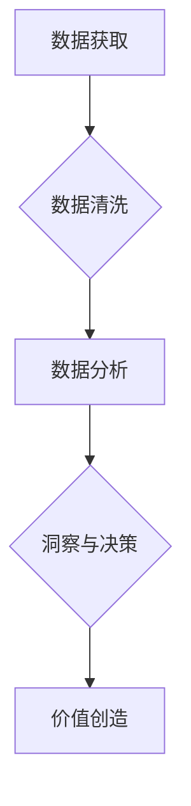

> 大数据，信息差，价值创造，企业竞争力，数据分析，机器学习，人工智能

## 1. 背景介绍

在当今数据爆炸的时代，企业面临着前所未有的机遇和挑战。海量数据蕴藏着丰富的价值，但如何有效地挖掘和利用这些数据，转化为企业竞争力，成为企业亟需解决的关键问题。信息差，即不同主体对信息的掌握程度差异，在数据时代显得尤为重要。掌握数据分析和挖掘技术，能够帮助企业洞察市场趋势、了解客户需求、优化运营流程，从而创造新的价值，获得竞争优势。

## 2. 核心概念与联系

**2.1 信息差的本质**

信息差是指不同主体对同一事物或事件的认知和理解存在差异。在数据时代，信息差主要体现在数据获取、数据分析和数据应用的各个环节。

* **数据获取**: 不同企业拥有不同的数据资源，数据来源、数据量、数据质量等方面存在差异。
* **数据分析**: 不同企业对数据的分析能力和技术水平存在差异，能够从数据中挖掘出有价值信息的企业更具优势。
* **数据应用**: 不同企业对数据的应用场景和应用策略存在差异，能够将数据转化为实际效益的企业更具竞争力。

**2.2 大数据与信息差的关联**

大数据是指海量、高速、多样化的数据。大数据时代，信息差更加显著，因为：

* **数据量庞大**: 大数据规模庞大，需要强大的技术和资源才能有效地处理和分析。
* **数据类型多样**: 大数据包含文本、图像、音频、视频等多种类型，需要多种分析方法和技术才能有效地挖掘价值。
* **数据更新速度快**: 大数据更新速度快，需要实时分析和处理，才能及时捕捉变化和趋势。

**2.3 信息差的价值创造**

信息差能够为企业创造价值，主要体现在以下几个方面：

* **市场洞察**: 通过分析市场数据，企业能够了解市场趋势、客户需求、竞争对手情况，从而制定更精准的市场策略。
* **产品创新**: 通过分析用户数据，企业能够了解用户需求和痛点，从而开发更符合用户需求的产品。
* **运营优化**: 通过分析运营数据，企业能够优化运营流程、提高效率、降低成本。
* **风险控制**: 通过分析风险数据，企业能够识别潜在风险，采取措施规避风险。

**2.4  Mermaid 流程图**



## 3. 核心算法原理 & 具体操作步骤

**3.1 算法原理概述**

在信息差的价值创造中，数据分析算法扮演着至关重要的角色。常见的算法包括：

* **聚类算法**: 将数据按照相似性进行分组，例如K-Means聚类算法。
* **分类算法**: 根据已知数据类别，预测新数据的类别，例如决策树算法、支持向量机算法。
* **回归算法**: 预测连续数值，例如线性回归算法、逻辑回归算法。

**3.2 算法步骤详解**

以K-Means聚类算法为例，其步骤如下：

1. **初始化**: 随机选择K个数据点作为初始聚类中心。
2. **分配**: 将每个数据点分配到距离其最近的聚类中心所属的类别。
3. **更新**: 计算每个聚类中心的新的位置，即所有属于该聚类中心的点的平均值。
4. **重复**: 重复步骤2和步骤3，直到聚类中心不再发生变化，或者达到预设的迭代次数。

**3.3 算法优缺点**

* **优点**: 简单易实现，计算效率高。
* **缺点**: 对初始聚类中心的选择敏感，容易陷入局部最优解。

**3.4 算法应用领域**

* **客户细分**: 将客户按照消费习惯、购买行为等特征进行分组，以便针对不同客户群体的需求进行个性化营销。
* **市场趋势分析**: 将市场数据按照时间、地域、产品等特征进行分组，以便识别市场趋势和潜在机会。
* **异常检测**: 将数据按照异常程度进行分组，以便识别异常数据点，例如欺诈交易、设备故障等。

## 4. 数学模型和公式 & 详细讲解 & 举例说明

**4.1 数学模型构建**

K-Means聚类算法的数学模型可以表示为：

* **目标函数**: 
$$
J = \sum_{i=1}^{K} \sum_{x \in C_i} ||x - \mu_i||^2
$$

其中：

* $J$ 为目标函数值，表示所有数据点到其所属聚类中心的距离平方和。
* $K$ 为聚类数。
* $C_i$ 为第 $i$ 个聚类。
* $x$ 为数据点。
* $\mu_i$ 为第 $i$ 个聚类中心。

* **优化目标**: 找到使目标函数值最小的聚类中心。

**4.2 公式推导过程**

目标函数的最小化可以通过迭代更新聚类中心来实现。

1. **初始化**: 随机选择K个数据点作为初始聚类中心。
2. **分配**: 将每个数据点分配到距离其最近的聚类中心所属的类别。
3. **更新**: 计算每个聚类中心的新的位置，即所有属于该聚类中心的点的平均值。
4. **重复**: 重复步骤2和步骤3，直到聚类中心不再发生变化，或者达到预设的迭代次数。

**4.3 案例分析与讲解**

假设我们有一组数据点，需要将其聚类成两个类别。我们可以使用K-Means算法进行聚类。

1. **初始化**: 随机选择两个数据点作为初始聚类中心。
2. **分配**: 将每个数据点分配到距离其最近的聚类中心所属的类别。
3. **更新**: 计算每个聚类中心的新的位置，即所有属于该聚类中心的点的平均值。
4. **重复**: 重复步骤2和步骤3，直到聚类中心不再发生变化。

最终，我们将得到两个聚类，每个聚类包含一组具有相似特征的数据点。

## 5. 项目实践：代码实例和详细解释说明

**5.1 开发环境搭建**

* 操作系统: Ubuntu 20.04 LTS
* Python 版本: 3.8.10
* 库依赖: scikit-learn, numpy, pandas

**5.2 源代码详细实现**

```python
from sklearn.cluster import KMeans
import numpy as np
import pandas as pd

# 加载数据
data = pd.read_csv('data.csv')

# 选择特征列
features = data[['feature1', 'feature2']]

# 创建KMeans模型
kmeans = KMeans(n_clusters=2, random_state=0)

# 训练模型
kmeans.fit(features)

# 获取聚类标签
labels = kmeans.labels_

# 将聚类标签添加到数据中
data['cluster'] = labels

# 保存结果
data.to_csv('result.csv', index=False)
```

**5.3 代码解读与分析**

* 首先，我们加载数据并选择需要进行聚类的特征列。
* 然后，我们创建KMeans模型，指定聚类数为2，并设置随机种子以确保结果可重复。
* 接着，我们训练模型，将数据点分配到不同的聚类中。
* 最后，我们获取聚类标签并将其添加到数据中，以便后续分析和使用。

**5.4 运行结果展示**

运行代码后，我们将得到一个新的CSV文件，其中包含了原始数据和聚类标签。我们可以使用可视化工具，例如matplotlib，将数据点按照聚类标签进行可视化，从而观察聚类结果。

## 6. 实际应用场景

**6.1 客户关系管理 (CRM)**

* 通过分析客户购买历史、浏览记录等数据，将客户进行细分，以便针对不同客户群体的需求进行个性化营销。
* 识别潜在的客户流失风险，及时采取措施挽留客户。

**6.2 市场营销**

* 分析市场趋势和竞争对手情况，制定更精准的市场策略。
* 识别潜在的市场机会，开发新的产品和服务。

**6.3 运营优化**

* 分析运营数据，识别瓶颈和效率低下环节，优化运营流程。
* 预估未来需求，优化库存管理和资源配置。

**6.4 风险控制**

* 分析风险数据，识别潜在的风险，采取措施规避风险。
* 监控风险变化趋势，及时调整风险控制策略。

**6.5 未来应用展望**

随着人工智能技术的不断发展，大数据在信息差的价值创造方面将发挥更加重要的作用。例如：

* **个性化推荐**: 通过分析用户的行为数据，提供更精准的个性化推荐，提升用户体验。
* **智能客服**: 利用自然语言处理技术，开发智能客服系统，提高客户服务效率。
* **预测分析**: 利用机器学习算法，预测未来趋势，帮助企业做出更明智的决策。

## 7. 工具和资源推荐

**7.1 学习资源推荐**

* **书籍**:
    * 《Python数据科学手册》
    * 《机器学习实战》
    * 《数据挖掘：概念与技术》
* **在线课程**:
    * Coursera: 数据科学与机器学习
    * edX: 数据分析与可视化
    * Udacity: 机器学习工程师

**7.2 开发工具推荐**

* **Python**: 广泛应用于数据分析和机器学习领域，拥有丰富的库和工具。
* **Jupyter Notebook**: 用于交互式编程和数据可视化，方便进行数据分析和实验。
* **Spark**: 用于大规模数据处理，可以处理海量数据。

**7.3 相关论文推荐**

* K-Means Clustering Algorithm
* Data Mining: Concepts and Techniques
* Machine Learning

## 8. 总结：未来发展趋势与挑战

**8.1 研究成果总结**

大数据分析技术在信息差的价值创造方面取得了显著的成果，为企业提供了新的竞争优势。

**8.2 未来发展趋势**

* **人工智能技术的融合**: 将人工智能技术与大数据分析技术融合，实现更智能、更精准的数据分析和决策支持。
* **边缘计算的应用**: 将数据分析能力部署到边缘设备，实现实时数据处理和分析，降低数据传输成本和延迟。
* **数据隐私保护**: 随着数据安全和隐私保护的日益重要，数据分析技术需要更加注重数据隐私保护，确保数据的安全和合法使用。

**8.3 面临的挑战**

* **数据质量问题**: 大数据往往存在数据不完整、数据不准确、数据格式不统一等问题，需要进行数据清洗和预处理。
* **算法复杂度**: 一些大数据分析算法的复杂度很高，需要强大的计算资源才能实现。
* **人才短缺**: 大数据分析领域人才短缺，需要加强人才培养和引进。

**8.4 研究展望**

未来，大数据分析技术将继续发展，为企业创造更大的价值。研究者需要关注以下几个方面：

* 开发更有效的算法和模型，提高数据分析的效率和准确性。
* 研究大数据分析在不同领域的应用，探索新的应用场景。
* 加强数据隐私保护技术的研究，确保数据安全和合法使用。


## 9. 附录：常见问题与解答

**9.1 如何选择合适的聚类算法？**

选择合适的聚类算法需要根据具体的数据特点和应用场景进行选择。

* **数据类型**: 对于数值型数据，可以使用K-Means算法、DBSCAN算法等。对于文本数据，可以使用K-Means算法、层次聚类算法等。
* **数据规模**: 对于小规模数据，可以使用K-Means算法、DBSCAN算法等。对于大规模数据，可以使用Spark进行分布式聚类。
* **聚类数**: 聚类数的选择需要根据实际情况进行确定。可以使用肘部法、Silhouette分析等方法进行