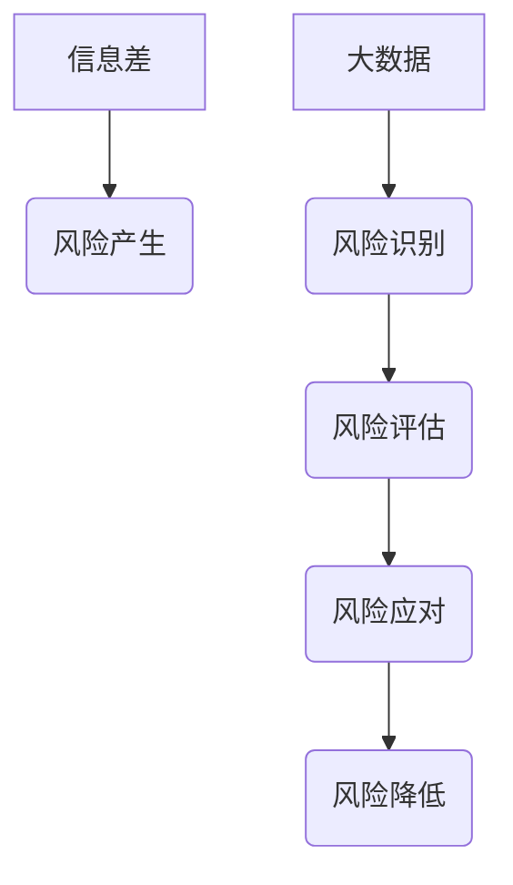

> 大数据，风险管理，信息差，机器学习，预测分析，数据可视化，风险识别，风险评估，风险应对

## 1. 背景介绍

在当今瞬息万变的商业环境中，风险无处不在。从市场波动到运营失误，从技术故障到合规问题，企业面临着各种各样的风险挑战。传统的风险管理方法往往依赖于经验和主观判断，难以有效应对复杂多变的风险环境。随着大数据的兴起，企业开始认识到大数据在风险管理中的巨大潜力。

大数据是指海量、高速度、高多样性的数据，它蕴含着丰富的风险信息。通过对大数据的分析和挖掘，企业可以更全面、更准确地识别风险、评估风险、应对风险，从而有效降低风险，提升企业竞争力。

## 2. 核心概念与联系

**2.1  信息差与风险**

信息差是指在风险相关信息获取、处理和利用方面存在差异的情况。信息差是风险产生的重要根源，它会导致决策失误、风险暴露和损失发生。

**2.2  大数据与风险管理**

大数据可以帮助企业缩小信息差，提升风险管理水平。通过收集、存储、分析和利用海量数据，企业可以获得更全面的风险信息，更准确地识别和评估风险，制定更有效的风险应对措施。

**2.3  核心概念架构**



## 3. 核心算法原理 & 具体操作步骤

**3.1  算法原理概述**

大数据风险管理的核心算法主要包括：

* **机器学习算法**: 用于识别和预测风险，例如分类算法、回归算法、聚类算法等。
* **统计分析算法**: 用于分析风险数据，例如描述性统计、假设检验、回归分析等。
* **数据挖掘算法**: 用于发现隐藏在数据中的风险模式，例如关联规则挖掘、序列模式挖掘等。

**3.2  算法步骤详解**

1. **数据收集**: 收集与风险相关的各种数据，例如财务数据、运营数据、市场数据、客户数据等。
2. **数据清洗**: 对收集到的数据进行清洗，去除无效数据、重复数据和错误数据，确保数据质量。
3. **数据特征提取**: 从原始数据中提取与风险相关的特征，例如财务指标、客户行为、市场趋势等。
4. **模型训练**: 使用机器学习算法或统计分析算法对提取的特征进行训练，建立风险预测模型。
5. **模型评估**: 对训练好的模型进行评估，验证模型的准确性和有效性。
6. **风险识别**: 使用训练好的模型对新的数据进行预测，识别潜在的风险。
7. **风险评估**: 对识别出的风险进行评估，确定风险的严重程度和可能性。
8. **风险应对**: 根据风险评估结果，制定相应的风险应对措施，例如风险规避、风险转移、风险控制等。

**3.3  算法优缺点**

* **优点**: 能够识别和预测复杂多变的风险，提高风险管理效率，降低风险损失。
* **缺点**: 需要大量的数据进行训练，算法模型的准确性依赖于数据质量，存在算法偏差和黑盒问题。

**3.4  算法应用领域**

* **金融风险管理**: 识别和预测信用风险、市场风险、操作风险等。
* **保险风险管理**: 评估保险风险，定价保险产品，防范欺诈行为。
* **供应链风险管理**: 识别和应对供应链中断、物流风险、质量风险等。
* **网络安全风险管理**: 识别和防御网络攻击、数据泄露、系统故障等。

## 4. 数学模型和公式 & 详细讲解 & 举例说明

**4.1  数学模型构建**

风险评估模型通常采用贝叶斯理论和概率统计方法构建。

**4.2  公式推导过程**

* **贝叶斯公式**:

$$P(A|B) = \frac{P(B|A)P(A)}{P(B)}$$

其中：

* $P(A|B)$: 事件A在事件B发生条件下的概率。
* $P(B|A)$: 事件B在事件A发生条件下的概率。
* $P(A)$: 事件A发生的概率。
* $P(B)$: 事件B发生的概率。

* **风险概率**:

$$P(Risk) = \sum_{i=1}^{n} P(Risk|F_i)P(F_i)$$

其中：

* $P(Risk)$: 风险发生的概率。
* $P(Risk|F_i)$: 在特征$F_i$条件下风险发生的概率。
* $P(F_i)$: 特征$F_i$发生的概率。

**4.3  案例分析与讲解**

假设一家银行想要评估客户贷款违约风险。

* **特征**: 收入、信用评分、贷款金额等。
* **贝叶斯公式**: 可以用于计算客户在特定特征条件下违约的概率。
* **风险概率**: 可以用于计算客户整体违约的概率。

通过分析历史数据，银行可以建立风险评估模型，并根据模型预测结果，制定不同的贷款策略。

## 5. 项目实践：代码实例和详细解释说明

**5.1  开发环境搭建**

* 操作系统: Ubuntu 20.04
* Python 版本: 3.8
* 必要的库: pandas, numpy, scikit-learn, matplotlib

**5.2  源代码详细实现**

```python
import pandas as pd
from sklearn.model_selection import train_test_split
from sklearn.linear_model import LogisticRegression
from sklearn.metrics import accuracy_score

# 加载数据
data = pd.read_csv('credit_risk_data.csv')

# 划分训练集和测试集
X = data.drop('default', axis=1)
y = data['default']
X_train, X_test, y_train, y_test = train_test_split(X, y, test_size=0.2, random_state=42)

# 训练模型
model = LogisticRegression()
model.fit(X_train, y_train)

# 预测结果
y_pred = model.predict(X_test)

# 评估模型
accuracy = accuracy_score(y_test, y_pred)
print(f'模型准确率: {accuracy}')
```

**5.3  代码解读与分析**

* 代码首先加载数据，然后将数据分为特征和标签。
* 使用 `train_test_split` 函数将数据划分为训练集和测试集。
* 使用 `LogisticRegression` 模型训练模型，并使用 `accuracy_score` 函数评估模型的准确率。

**5.4  运行结果展示**

运行代码后，会输出模型的准确率。

## 6. 实际应用场景

**6.1  金融风险管理**

* **信用风险管理**: 评估客户贷款违约风险，制定贷款策略。
* **市场风险管理**: 预测市场波动，控制投资组合风险。
* **操作风险管理**: 识别和防范内部操作失误带来的风险。

**6.2  保险风险管理**

* **风险评估**: 评估保险风险，定价保险产品。
* **欺诈检测**: 识别和防范保险欺诈行为。
* **理赔管理**: 优化理赔流程，降低理赔成本。

**6.3  供应链风险管理**

* **供应链中断风险**: 预测供应链中断风险，制定应急预案。
* **物流风险**: 优化物流路线，降低物流风险。
* **质量风险**: 识别和防范产品质量问题。

**6.4  未来应用展望**

随着大数据技术的不断发展，大数据在风险管理领域的应用将更加广泛和深入。未来，大数据风险管理将更加智能化、自动化和个性化。

## 7. 工具和资源推荐

**7.1  学习资源推荐**

* **书籍**:
    * 《大数据分析》
    * 《机器学习实战》
    * 《风险管理》
* **在线课程**:
    * Coursera: 数据科学
    * edX: 机器学习
    * Udemy: 风险管理

**7.2  开发工具推荐**

* **Python**: 数据分析和机器学习的常用语言。
* **R**: 数据分析和统计学的常用语言。
* **Hadoop**: 大数据处理框架。
* **Spark**: 大数据处理框架。

**7.3  相关论文推荐**

* **大数据在风险管理中的应用**: 
    * [https://www.researchgate.net/publication/330973794_Big_Data_Analytics_in_Risk_Management](https://www.researchgate.net/publication/330973794_Big_Data_Analytics_in_Risk_Management)
* **机器学习在金融风险管理中的应用**:
    * [https://www.sciencedirect.com/science/article/pii/S030440671930037X](https://www.sciencedirect.com/science/article/pii/S030440671930037X)

## 8. 总结：未来发展趋势与挑战

**8.1  研究成果总结**

大数据在风险管理领域取得了显著的成果，能够有效识别、评估和应对各种风险。

**8.2  未来发展趋势**

* **人工智能**: 将人工智能技术应用于风险管理，提高风险识别和预测的准确性。
* **云计算**: 利用云计算平台进行大数据处理和分析，降低成本和提高效率。
* **区块链**: 利用区块链技术提高数据安全性和透明度，增强风险管理的可靠性。

**8.3  面临的挑战**

* **数据质量**: 大数据中的数据质量参差不齐，需要进行有效的数据清洗和处理。
* **算法模型**: 算法模型的准确性依赖于数据质量和模型设计，需要不断改进和优化。
* **隐私保护**: 大数据分析可能会涉及到个人隐私信息，需要采取有效措施保护个人隐私。

**8.4  研究展望**

未来，大数据风险管理的研究将更加注重人工智能、云计算和区块链技术的应用，以及数据质量、算法模型和隐私保护等方面的研究。


## 9. 附录：常见问题与解答

**9.1  大数据风险管理需要哪些数据？**

大数据风险管理需要收集与风险相关的各种数据，例如财务数据、运营数据、市场数据、客户数据等。

**9.2  大数据风险管理的算法有哪些？**

大数据风险管理的核心算法主要包括机器学习算法、统计分析算法和数据挖掘算法。

**9.3  大数据风险管理的应用场景有哪些？**

大数据风险管理的应用场景非常广泛，例如金融风险管理、保险风险管理、供应链风险管理等。


作者：禅与计算机程序设计艺术 / Zen and the Art of Computer Programming 
<end_of_turn>