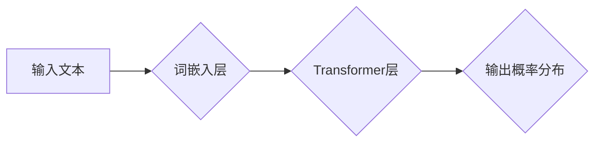

> 语言模型，神经网络，深度学习，自然语言处理，语言网络，词嵌入，Transformer

## 1. 背景介绍

人类语言是人类文明的基石，它赋予我们表达思想、传递信息和构建社会的能力。儿童学习语言的过程是一个惊人的旅程，他们从零开始，逐渐掌握复杂的语法规则、词汇表和语义理解。近年来，人工智能领域取得了长足的进步，特别是深度学习技术的突破，使得我们能够构建越来越强大的语言模型，模拟人类语言的生成和理解能力。

## 2. 核心概念与联系

**2.1 语言模型**

语言模型是机器学习领域的一个重要分支，旨在预测文本序列中下一个词的出现概率。它可以根据输入的上下文信息，生成流畅、语法正确的文本。

**2.2 神经网络**

神经网络是一种模仿人脑神经元结构的计算模型。它由多个层级的神经元组成，每个神经元接收来自前一层神经元的输入，并通过激活函数进行处理，输出到下一层神经元。

**2.3 深度学习**

深度学习是神经网络的一种特殊形式，它使用多层神经网络来学习复杂的特征表示。深度学习模型能够从海量数据中自动提取特征，从而实现更准确的预测和分类。

**2.4 自然语言处理**

自然语言处理（NLP）是人工智能领域的一个重要分支，旨在使计算机能够理解和处理人类语言。NLP的任务包括文本分类、情感分析、机器翻译、文本摘要等。

**2.5 语言网络**

语言网络是一种专门用于处理语言数据的深度学习模型。它通常由多个 Transformer 层组成，Transformer 层能够捕捉文本序列中的长距离依赖关系。

**2.6 词嵌入**

词嵌入是一种将单词映射到低维向量空间的技术。每个单词都对应一个唯一的向量，向量中的每个维度代表单词的某个特征。

**Mermaid 流程图**



## 3. 核心算法原理 & 具体操作步骤

**3.1 算法原理概述**

语言网络的核心算法是 Transformer，它是一种基于注意力机制的序列模型。注意力机制能够帮助模型关注文本序列中重要的信息，从而提高预测准确率。

**3.2 算法步骤详解**

1. **词嵌入:** 将输入文本中的每个单词映射到低维向量空间。
2. **位置编码:** 为每个单词添加位置信息，因为 Transformer 模型无法直接理解单词的顺序。
3. **多头注意力:** 使用多个注意力头来捕捉文本序列中的不同方面的信息。
4. **前馈神经网络:** 对每个单词的嵌入向量进行非线性变换。
5. **层归一化:** 对每个层的输出进行归一化，提高模型的稳定性。
6. **输出层:** 将模型的输出映射到每个单词的概率分布。

**3.3 算法优缺点**

**优点:**

* 能够捕捉长距离依赖关系。
* 训练速度快。
* 性能优异。

**缺点:**

* 计算量大。
* 参数量大。

**3.4 算法应用领域**

* 机器翻译
* 文本摘要
* 问答系统
* 情感分析
* 代码生成

## 4. 数学模型和公式 & 详细讲解 & 举例说明

**4.1 数学模型构建**

语言网络的数学模型可以表示为一个多层神经网络，其中每个层都包含注意力机制和前馈神经网络。

**4.2 公式推导过程**

注意力机制的公式如下：

$$
Attention(Q, K, V) = softmax(\frac{QK^T}{\sqrt{d_k}})V
$$

其中：

* $Q$：查询矩阵
* $K$：键矩阵
* $V$：值矩阵
* $d_k$：键向量的维度

**4.3 案例分析与讲解**

假设我们有一个句子 "The cat sat on the mat"，我们要预测下一个词。

1. 将每个单词嵌入到向量空间中。
2. 使用注意力机制计算每个单词对下一个词的注意力权重。
3. 根据注意力权重，计算下一个词的概率分布。

## 5. 项目实践：代码实例和详细解释说明

**5.1 开发环境搭建**

* Python 3.7+
* TensorFlow 2.0+
* PyTorch 1.0+

**5.2 源代码详细实现**

```python
import tensorflow as tf

# 定义词嵌入层
embedding_layer = tf.keras.layers.Embedding(vocab_size, embedding_dim)

# 定义Transformer层
transformer_layer = tf.keras.layers.Transformer(num_heads, dff)

# 定义模型
model = tf.keras.Sequential([
    embedding_layer,
    transformer_layer,
    tf.keras.layers.Dense(vocab_size, activation='softmax')
])

# 编译模型
model.compile(optimizer='adam', loss='sparse_categorical_crossentropy', metrics=['accuracy'])

# 训练模型
model.fit(train_data, train_labels, epochs=10)
```

**5.3 代码解读与分析**

* 词嵌入层将单词映射到低维向量空间。
* Transformer层捕捉文本序列中的长距离依赖关系。
* 输出层将模型的输出映射到每个单词的概率分布。

**5.4 运行结果展示**

训练完成后，我们可以使用模型预测新的文本序列。

## 6. 实际应用场景

语言网络在许多实际应用场景中发挥着重要作用，例如：

* **机器翻译:** 将一种语言翻译成另一种语言。
* **文本摘要:** 生成文本的简短摘要。
* **问答系统:** 回答用户提出的问题。
* **情感分析:** 分析文本的情感倾向。
* **代码生成:** 自动生成代码。

**6.4 未来应用展望**

随着人工智能技术的不断发展，语言网络的应用场景将会更加广泛。例如，未来可能会有：

* 更智能的聊天机器人。
* 更精准的机器翻译系统。
* 更强大的文本生成工具。

## 7. 工具和资源推荐

**7.1 学习资源推荐**

* **书籍:**
    * 《深度学习》
    * 《自然语言处理》
* **在线课程:**
    * Coursera: 自然语言处理
    * Udacity: 深度学习

**7.2 开发工具推荐**

* **TensorFlow:** 开源深度学习框架。
* **PyTorch:** 开源深度学习框架。
* **Hugging Face:** 提供预训练语言模型和工具。

**7.3 相关论文推荐**

* 《Attention Is All You Need》
* 《BERT: Pre-training of Deep Bidirectional Transformers for Language Understanding》

## 8. 总结：未来发展趋势与挑战

**8.1 研究成果总结**

近年来，语言网络取得了长足的进步，在许多自然语言处理任务中取得了优异的性能。

**8.2 未来发展趋势**

* 更强大的预训练语言模型。
* 更有效的训练方法。
* 更广泛的应用场景。

**8.3 面临的挑战**

* 数据稀缺性。
* 计算资源限制。
* 伦理问题。

**8.4 研究展望**

未来，语言网络的研究将继续朝着更强大、更智能、更安全的方向发展。


## 9. 附录：常见问题与解答

**9.1 如何选择合适的词嵌入方法？**

词嵌入方法的选择取决于具体的应用场景和数据特点。常见的词嵌入方法包括 Word2Vec、GloVe 和 FastText。

**9.2 如何训练语言网络？**

语言网络的训练需要大量的文本数据和强大的计算资源。常用的训练方法包括监督学习、自监督学习和无监督学习。

**9.3 如何评估语言网络的性能？**

语言网络的性能可以根据不同的任务进行评估。常见的评估指标包括准确率、召回率、F1-score 和 BLEU 分数。


作者：禅与计算机程序设计艺术 / Zen and the Art of Computer Programming 
<end_of_turn>