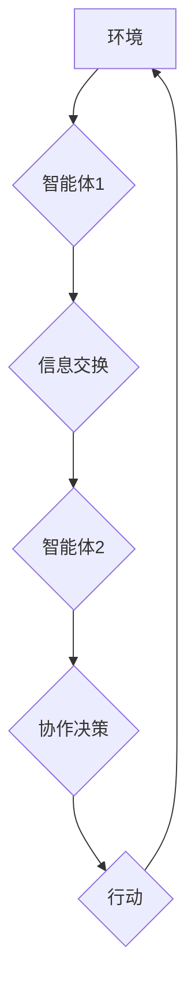

> 多智能体协同、人工智能、机器学习、深度学习、强化学习、分布式系统、算法设计、应用案例

## 1. 背景介绍

在当今科技飞速发展的时代，人工智能（AI）已成为引领未来发展的重要力量。其中，多智能体协同（Multi-Agent Collaboration，MAC）作为人工智能领域的重要研究方向，旨在通过构建多个智能体协同工作，解决复杂问题，实现更高效、更智能的系统行为。

多智能体协同系统由多个独立的智能体组成，每个智能体都具有感知环境、做出决策和执行行动的能力。这些智能体通过信息交换和协作，共同完成任务，并能够适应动态变化的环境。

MAC 拥有广泛的应用前景，例如：

* **自动驾驶:** 多辆无人驾驶汽车协同行驶，提高道路安全和交通效率。
* **机器人协作:** 多个机器人协同完成复杂任务，例如工业生产、搜索救援等。
* **智能医疗:** 多个智能体协同诊断疾病、制定治疗方案，提高医疗效率和准确性。
* **金融市场:** 多个智能体协同进行交易决策，优化投资组合，降低风险。

## 2. 核心概念与联系

**2.1 多智能体系统架构**

多智能体系统通常由以下几个关键组件组成：

* **智能体（Agent）：** 系统中的基本单元，具有感知、决策和行动的能力。
* **环境（Environment）：** 智能体所处的外部世界，包含状态信息和事件。
* **通信机制（Communication）：** 智能体之间进行信息交换的机制。
* **任务分配机制（Task Allocation）：** 分配任务给各个智能体，并协调其协作。

**2.2 协同策略**

协同策略是指智能体之间如何合作完成任务的规则和方法。常见的协同策略包括：

* **中心化控制:** 一个中央控制器分配任务并协调智能体行动。
* **分布式控制:** 智能体之间直接通信和协作，无需中央控制器。
* **混合控制:** 将中心化控制和分布式控制相结合，根据任务特点选择合适的策略。

**2.3 协同算法**

协同算法是指实现智能体协同的关键技术，例如：

* **强化学习:** 智能体通过与环境交互学习最优策略。
* **博弈论:** 研究智能体在竞争和合作环境下的决策行为。
* **群体智能:** 从自然界群体行为中获得启发，设计智能体协作算法。

**2.4 Mermaid 流程图**



## 3. 核心算法原理 & 具体操作步骤

### 3.1 算法原理概述

本文将重点介绍基于强化学习的多智能体协同算法，该算法通过训练智能体，使其能够在环境中学习最优的协作策略。

强化学习是一种机器学习方法，智能体通过与环境交互，获得奖励或惩罚，并根据这些反馈调整其行为策略，最终学习到最优策略。

在多智能体协同场景中，每个智能体都是一个独立的强化学习代理，它们共同学习一个协作策略，以最大化团队的总奖励。

### 3.2 算法步骤详解

1. **环境建模:** 建立多智能体协同系统的环境模型，包括状态空间、动作空间和奖励函数。
2. **智能体初始化:** 初始化每个智能体的策略参数，例如神经网络权重。
3. **交互循环:**
    * 智能体感知环境状态。
    * 根据当前策略，每个智能体选择一个动作。
    * 智能体执行动作，环境状态发生变化。
    * 环境反馈奖励给每个智能体。
4. **策略更新:** 根据获得的奖励，使用强化学习算法更新每个智能体的策略参数，例如使用深度Q网络（DQN）或策略梯度算法。
5. **重复步骤3和4:** 持续进行交互循环，直到智能体学习到最优的协作策略。

### 3.3 算法优缺点

**优点:**

* 可以学习复杂协作策略。
* 能够适应动态变化的环境。
* 每个智能体都具有自主性，可以灵活应对突发事件。

**缺点:**

* 训练过程可能需要大量时间和计算资源。
* 算法的收敛性难以保证。
* 需要设计合理的奖励函数，否则可能导致智能体学习到不期望的行为。

### 3.4 算法应用领域

* **自动驾驶:** 多辆无人驾驶汽车协同行驶，提高道路安全和交通效率。
* **机器人协作:** 多个机器人协同完成复杂任务，例如工业生产、搜索救援等。
* **智能医疗:** 多个智能体协同诊断疾病、制定治疗方案，提高医疗效率和准确性。
* **金融市场:** 多个智能体协同进行交易决策，优化投资组合，降低风险。

## 4. 数学模型和公式 & 详细讲解 & 举例说明

### 4.1 数学模型构建

多智能体协同系统的数学模型通常基于马尔可夫决策过程（MDP）。

**MDP 定义:**

* 状态空间 S: 环境可能的状态集合。
* 动作空间 A: 智能体可以执行的动作集合。
* 状态转移概率 P(s' | s, a): 从状态 s 执行动作 a 到状态 s' 的概率。
* 奖励函数 R(s, a): 智能体在状态 s 执行动作 a 得到的奖励。
* 策略 π(a | s): 智能体在状态 s 下选择动作 a 的策略。

**目标:**

找到最优策略 π*, 使得智能体在无限时间内获得最大的总奖励。

### 4.2 公式推导过程

最优策略 π* 可以通过贝尔曼方程求解:

$$
\pi^*(s) = \arg\max_a \sum_{s'} P(s' | s, a) [R(s, a) + \gamma \max_{\pi'} \pi'(s')]
$$

其中:

* γ: 折扣因子，控制未来奖励的权重。

### 4.3 案例分析与讲解

**举例:**

考虑一个简单的多智能体协同问题，有两个智能体需要协同完成一个任务。

* 状态空间 S: 智能体1和智能体2的位置。
* 动作空间 A: 智能体1和智能体2可以选择向左、向右、向上、向下移动。
* 奖励函数 R(s, a): 如果两个智能体同时到达目标位置，则获得最大奖励，否则获得较小的奖励。

通过使用贝尔曼方程，可以找到最优策略，使两个智能体能够协同完成任务。

## 5. 项目实践：代码实例和详细解释说明

### 5.1 开发环境搭建

* Python 3.x
* TensorFlow 或 PyTorch 深度学习框架
* OpenAI Gym 或其他强化学习环境

### 5.2 源代码详细实现

```python
import gym
import tensorflow as tf

# 定义智能体类
class Agent:
    def __init__(self, state_size, action_size):
        # 初始化神经网络模型
        self.model = tf.keras.models.Sequential([
            tf.keras.layers.Dense(64, activation='relu', input_shape=(state_size,)),
            tf.keras.layers.Dense(action_size)
        ])
        self.optimizer = tf.keras.optimizers.Adam()

    def act(self, state):
        # 根据当前状态选择动作
        return tf.argmax(self.model(state)).numpy()

    def train(self, state, action, reward, next_state, done):
        # 使用强化学习算法更新模型参数
        with tf.GradientTape() as tape:
            target = reward if done else reward + self.discount_factor * tf.reduce_max(self.model(next_state))
            prediction = self.model(state)
            loss = tf.keras.losses.categorical_crossentropy(tf.one_hot(action, num_classes=self.action_size), prediction)
        gradients = tape.gradient(loss, self.model.trainable_variables)
        self.optimizer.apply_gradients(zip(gradients, self.model.trainable_variables))

# 创建环境
env = gym.make('CartPole-v1')

# 创建智能体
agent = Agent(state_size=env.observation_space.shape[0], action_size=env.action_space.n)

# 训练智能体
for episode in range(1000):
    state = env.reset()
    done = False
    total_reward = 0
    while not done:
        action = agent.act(state)
        next_state, reward, done, _ = env.step(action)
        agent.train(state, action, reward, next_state, done)
        state = next_state
        total_reward += reward
    print(f'Episode {episode+1}: Total Reward = {total_reward}')

# 测试智能体
state = env.reset()
while True:
    env.render()
    action = agent.act(state)
    state, reward, done, _ = env.step(action)
    if done:
        break
env.close()
```

### 5.3 代码解读与分析

* **智能体类:** 定义了智能体的基本结构，包括神经网络模型、优化器和行为策略。
* **act() 方法:** 根据当前状态选择动作。
* **train() 方法:** 使用强化学习算法更新模型参数。
* **训练循环:** 训练智能体，并记录每个episode的总奖励。
* **测试循环:** 使用训练好的智能体进行测试，并展示其行为。

### 5.4 运行结果展示

运行代码后，可以观察到智能体在环境中学习并逐渐改进其行为，最终能够完成任务。

## 6. 实际应用场景

### 6.1 自动驾驶

多智能体协同可以应用于自动驾驶，例如：

* **车队协同:** 多辆无人驾驶汽车协同行驶，提高道路安全和交通效率。
* **自动泊车:** 多个无人驾驶汽车协同完成自动泊车任务。

### 6.2 机器人协作

多智能体协同可以应用于机器人协作，例如：

* **工业生产:** 多个机器人协同完成复杂生产任务，提高生产效率和精度。
* **搜索救援:** 多个机器人协同进行搜索救援任务，提高效率和安全性。

### 6.3 智能医疗

多智能体协同可以应用于智能医疗，例如：

* **疾病诊断:** 多个智能体协同分析患者数据，提高疾病诊断的准确性。
* **治疗方案制定:** 多个智能体协同制定个性化治疗方案，提高治疗效果。

### 6.4 未来应用展望

多智能体协同技术在未来将有更广泛的应用，例如：

* **智慧城市:** 多个智能体协同管理城市资源，提高城市效率和可持续性。
* **个性化教育:** 多个智能体协同提供个性化教育服务，提高学习效率和效果。
* **科学研究:** 多个智能体协同进行科学研究，加速科技进步。

## 7. 工具和资源推荐

### 7.1 学习资源推荐

* **书籍:**
    * Multi-Agent Systems: A Modern Approach
    * Reinforcement Learning: An Introduction
* **在线课程:**
    * Coursera: Reinforcement Learning Specialization
    * Udacity: Intro to Artificial Intelligence

### 7.2 开发工具推荐

* **Python:** 广泛使用的编程语言，适合机器学习和人工智能开发。
* **TensorFlow:** 开源深度学习框架，提供丰富的工具和资源。
* **PyTorch:** 开源深度学习框架，以其灵活性和易用性而闻名。
* **OpenAI Gym:** 强化学习环境，提供各种标准任务和工具。

### 7.3 相关论文推荐

* **Multi-Agent Reinforcement Learning: A