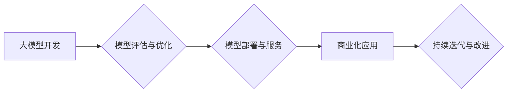

> 大模型、商业模式、创业路线、人工智能、深度学习、应用场景、技术落地

## 1. 背景介绍

近年来，人工智能（AI）技术取得了飞速发展，其中大模型（Large Language Model，LLM）作为AI领域的新兴热点，展现出强大的学习和推理能力，在自然语言处理、图像识别、代码生成等领域取得了突破性进展。大模型的出现为商业模式创新提供了新的机遇，也催生了一批以大模型为核心的创业公司。

然而，大模型创业并非易事。从技术研发到商业化落地，需要克服诸多挑战，包括模型训练成本高、数据获取困难、应用场景有限等。因此，对于想要在AI领域创业的企业家来说，制定合理的商业模式和创业路线至关重要。

## 2. 核心概念与联系

大模型创业的核心概念包括：

* **大模型：** 指参数量巨大、训练数据海量的人工智能模型，具备强大的泛化能力和学习能力。
* **商业模式：** 指企业为创造价值、获取利润而采取的经营策略和运作模式。
* **创业路线：** 指企业从零开始，逐步发展壮大的战略规划和行动路径。

大模型创业的商业模式通常围绕以下几个方面展开：

* **模型开发与销售：** 开发高性能的大模型，并将其作为产品或服务进行销售。
* **模型定制与服务：** 根据客户需求，对现有模型进行定制化开发，并提供相关的技术支持和服务。
* **应用场景开发：** 基于大模型，开发针对特定行业的应用软件或平台，为客户提供解决方案。

**Mermaid 流程图：大模型创业路线**



## 3. 核心算法原理 & 具体操作步骤

### 3.1  算法原理概述

大模型的训练主要基于深度学习算法，其中Transformer模型是目前最主流的架构。Transformer模型的核心思想是利用注意力机制，捕捉文本序列中不同词语之间的依赖关系，从而实现更精准的理解和生成。

### 3.2  算法步骤详解

大模型训练的具体步骤如下：

1. **数据预处理：** 收集和清洗训练数据，并将其转换为模型可识别的格式。
2. **模型构建：** 根据预设的架构，搭建Transformer模型。
3. **模型训练：** 使用训练数据，通过反向传播算法，调整模型参数，使其能够准确预测目标输出。
4. **模型评估：** 使用测试数据，评估模型的性能，并根据评估结果进行模型优化。
5. **模型部署：** 将训练好的模型部署到服务器或云平台，提供服务。

### 3.3  算法优缺点

**优点：**

* 强大的学习能力：能够学习复杂的语言模式和知识。
* 泛化能力强：能够应用于多种不同的任务和领域。
* 持续改进：可以通过不断训练和优化，提升模型性能。

**缺点：**

* 训练成本高：需要大量的计算资源和训练数据。
* 数据依赖性强：模型性能受训练数据质量的影响较大。
* 可解释性差：模型内部的决策过程难以理解。

### 3.4  算法应用领域

大模型在以下领域具有广泛的应用前景：

* **自然语言处理：** 文本生成、机器翻译、问答系统、情感分析等。
* **图像识别：** 图像分类、目标检测、图像生成等。
* **代码生成：** 代码自动完成、代码翻译、代码错误修复等。
* **语音识别：** 语音转文本、语音合成等。

## 4. 数学模型和公式 & 详细讲解 & 举例说明

### 4.1  数学模型构建

Transformer模型的核心是注意力机制，其数学模型可以表示为：

$$
Attention(Q, K, V) = softmax(\frac{QK^T}{\sqrt{d_k}})V
$$

其中：

* $Q$：查询矩阵
* $K$：键矩阵
* $V$：值矩阵
* $d_k$：键向量的维度
* $softmax$：softmax函数

### 4.2  公式推导过程

注意力机制的目的是计算每个词语与其他词语之间的相关性，并根据相关性权重来加权求和，从而得到最终的输出。

公式推导过程如下：

1. 计算查询矩阵 $Q$ 与键矩阵 $K$ 的点积，并进行归一化处理，得到注意力权重矩阵。
2. 将注意力权重矩阵与值矩阵 $V$ 进行矩阵乘法，得到最终的输出。

### 4.3  案例分析与讲解

例如，在机器翻译任务中，可以使用注意力机制来计算源语言句子中每个词语与目标语言句子中每个词语之间的相关性。

通过注意力机制，模型可以更好地理解句子之间的语义关系，从而提高翻译的准确性和流畅度。

## 5. 项目实践：代码实例和详细解释说明

### 5.1  开发环境搭建

大模型开发通常需要使用强大的计算资源和专业的开发工具。

常见的开发环境包括：

* **云平台：** AWS、Google Cloud、Azure等
* **深度学习框架：** TensorFlow、PyTorch等
* **编程语言：** Python

### 5.2  源代码详细实现

以下是一个简单的Transformer模型代码示例，使用PyTorch框架实现：

```python
import torch
import torch.nn as nn

class Transformer(nn.Module):
    def __init__(self, vocab_size, embedding_dim, num_heads, num_layers):
        super(Transformer, self).__init__()
        self.embedding = nn.Embedding(vocab_size, embedding_dim)
        self.transformer_layers = nn.ModuleList([
            nn.TransformerEncoderLayer(embedding_dim, num_heads)
            for _ in range(num_layers)
        ])
        self.linear = nn.Linear(embedding_dim, vocab_size)

    def forward(self, x):
        x = self.embedding(x)
        for layer in self.transformer_layers:
            x = layer(x)
        x = self.linear(x)
        return x
```

### 5.3  代码解读与分析

该代码定义了一个简单的Transformer模型，包含以下部分：

* **embedding层：** 将词语转换为向量表示。
* **transformer_layers层：** 多个Transformer编码器层，用于捕捉文本序列中的依赖关系。
* **linear层：** 将模型输出转换为词语概率分布。

### 5.4  运行结果展示

训练好的模型可以用于各种自然语言处理任务，例如文本生成、机器翻译等。

## 6. 实际应用场景

### 6.1  智能客服

大模型可以用于构建智能客服系统，自动回答用户常见问题，提高客户服务效率。

### 6.2  内容创作

大模型可以辅助内容创作，例如生成文章、文案、诗歌等，提高创作效率和灵感。

### 6.3  教育培训

大模型可以用于个性化教育，根据学生的学习情况提供定制化的学习内容和辅导。

### 6.4  未来应用展望

大模型的应用场景还在不断扩展，未来将应用于更多领域，例如医疗诊断、法律服务、金融分析等。

## 7. 工具和资源推荐

### 7.1  学习资源推荐

* **书籍：**
    * 《深度学习》
    * 《Transformer模型详解》
* **在线课程：**
    * Coursera
    * edX
* **开源项目：**
    * HuggingFace

### 7.2  开发工具推荐

* **深度学习框架：** TensorFlow、PyTorch
* **云平台：** AWS、Google Cloud、Azure
* **编程语言：** Python

### 7.3  相关论文推荐

* 《Attention Is All You Need》
* 《BERT: Pre-training of Deep Bidirectional Transformers for Language Understanding》

## 8. 总结：未来发展趋势与挑战

### 8.1  研究成果总结

近年来，大模型技术取得了显著进展，模型规模不断扩大，性能不断提升。

大模型在自然语言处理、图像识别等领域展现出强大的应用潜力。

### 8.2  未来发展趋势

未来，大模型的发展趋势包括：

* **模型规模进一步扩大：** 训练更大规模的模型，提升模型能力。
* **模型效率提升：** 降低模型训练和推理成本，提高模型效率。
* **模型可解释性增强：** 提高模型决策过程的可解释性，增强用户信任。
* **跨模态学习：** 融合文本、图像、音频等多模态数据，提升模型泛化能力。

### 8.3  面临的挑战

大模型创业也面临着诸多挑战：

* **高昂的训练成本：** 训练大模型需要大量的计算资源和数据，成本较高。
* **数据获取困难：** 高质量的训练数据是模型训练的关键，获取高质量数据难度较大。
* **模型安全性和隐私问题：** 大模型可能存在安全漏洞和隐私泄露风险，需要加强安全防护。

### 8.4  研究展望

未来，大模型研究将继续深入，探索更强大的模型架构、更有效的训练方法和更广泛的应用场景。

## 9. 附录：常见问题与解答

### 9.1  Q：大模型的训练需要多少数据？

### 9.2  A：

大模型的训练数据量通常在数十GB到数TB级别，具体数据量取决于模型规模和任务复杂度。

### 9.3  Q：大模型的训练成本高吗？

### 9.4  A：

是的，大模型的训练成本较高，需要大量的计算资源和电力消耗。

### 9.5  Q：大模型的应用场景有哪些？

### 9.6  A：

大模型的应用场景非常广泛，包括自然语言处理、图像识别、代码生成、语音识别等。

作者：禅与计算机程序设计艺术 / Zen and the Art of Computer Programming


<end_of_turn>