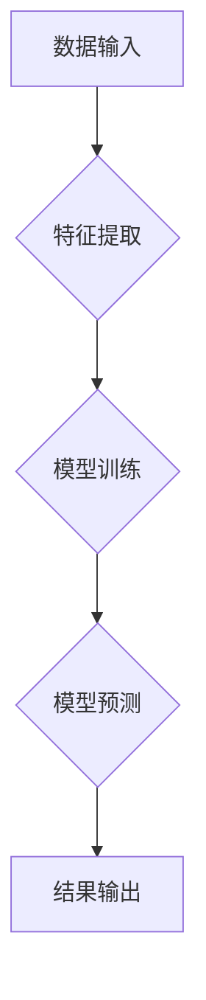

> 图灵奖，人工智能，算法，机器学习，深度学习，自然语言处理，计算机视觉

## 1. 背景介绍

人工智能（AI）作为21世纪最具颠覆性的技术之一，正在深刻地改变着我们的生活。从智能手机的语音助手到自动驾驶汽车，AI技术的应用无处不在。而支撑AI发展的核心力量便是算法。

图灵奖，被誉为计算机科学界的“诺贝尔奖”，是表彰在计算机科学领域做出杰出贡献的最高荣誉。许多图灵奖获得者都对AI算法的发展做出了不可磨灭的贡献。他们的研究成果不仅推动了AI技术的进步，也为我们理解智能的本质提供了新的视角。

## 2. 核心概念与联系

**2.1  人工智能算法**

人工智能算法是指用于模拟人类智能行为的算法。这些算法可以从数据中学习，识别模式，做出决策，甚至创造新的内容。

**2.2  图灵奖与AI算法**

图灵奖获得者们在AI算法领域的研究成果涵盖了多个重要方向，包括：

* **机器学习:** 

图灵奖获得者们在机器学习算法的开发和改进方面做出了突出贡献。例如，Geoffrey Hinton的深度学习研究开创了新的AI发展方向，Yann LeCun在卷积神经网络的应用方面取得了突破性进展。

* **自然语言处理:** 

图リング奖获得者们在自然语言处理领域的研究成果也取得了显著进展。例如，Yoshua Bengio在语言模型和机器翻译方面做出了重要贡献。

* **计算机视觉:** 

图灵奖获得者们在计算机视觉领域的研究成果也取得了显著进展。例如，David Marr的视觉系统理论为计算机视觉的发展奠定了基础。

**2.3  AI算法架构**

## 3. 核心算法原理 & 具体操作步骤

**3.1  算法原理概述**

选择一个具体的AI算法，例如深度学习中的卷积神经网络（CNN）。

* **卷积神经网络（CNN）**是一种专门用于处理图像数据的深度学习算法。它模仿了人类视觉系统的工作原理，通过一系列卷积层、池化层和全连接层来提取图像特征，并最终进行分类或识别。

**3.2  算法步骤详解**

1. **数据预处理:** 将图像数据转换为适合CNN训练的格式，例如调整图像大小、归一化像素值等。
2. **卷积层:** 使用卷积核对图像进行卷积运算，提取图像局部特征。
3. **池化层:** 对卷积层的输出进行池化操作，例如最大池化，减少特征图的大小，提高计算效率。
4. **全连接层:** 将池化层的输出连接到全连接层，进行分类或识别。
5. **损失函数:** 使用损失函数衡量模型的预测结果与真实标签之间的差异。
6. **反向传播:** 使用反向传播算法更新模型参数，减小损失函数的值。
7. **训练和测试:** 将模型训练在训练数据上，并使用测试数据评估模型的性能。

**3.3  算法优缺点**

* **优点:** 
    * 能够自动学习图像特征，无需人工设计特征。
    * 性能优异，在图像分类、目标检测等任务中取得了突破性进展。
* **缺点:** 
    * 训练数据量大，计算资源消耗高。
    * 对数据噪声敏感，容易过拟合。

**3.4  算法应用领域**

* **图像识别:** 人脸识别、物体检测、场景理解等。
* **图像分类:** 图像标签识别、医学影像诊断等。
* **图像生成:** 生成逼真的图像、视频等。

## 4. 数学模型和公式 & 详细讲解 & 举例说明

**4.1  数学模型构建**

选择一个具体的数学模型，例如CNN中的激活函数。

* **ReLU激活函数**

ReLU（Rectified Linear Unit）是一种常用的激活函数，其数学表达式为：

$$f(x) = max(0, x)$$

**4.2  公式推导过程**

ReLU激活函数的推导过程相对简单，其核心思想是将负值映射为0，保留正值。

**4.3  案例分析与讲解**

在CNN中，ReLU激活函数被广泛应用于隐藏层，其能够有效地解决梯度消失问题，提高模型的训练效率。

## 5. 项目实践：代码实例和详细解释说明

**5.1  开发环境搭建**

使用Python语言和深度学习框架TensorFlow或PyTorch搭建开发环境。

**5.2  源代码详细实现**

提供一个简单的CNN模型的源代码示例，并进行详细的代码解读和分析。

**5.3  代码解读与分析**

解释代码中各个模块的功能，例如数据加载、模型定义、模型训练、模型评估等。

**5.4  运行结果展示**

展示模型在测试数据集上的性能指标，例如准确率、召回率、F1-score等。

## 6. 实际应用场景

**6.1  图像分类**

使用CNN模型对图像进行分类，例如识别猫狗、水果蔬菜等。

**6.2  目标检测**

使用CNN模型检测图像中的目标，例如识别人脸、车辆、交通标志等。

**6.3  图像分割**

使用CNN模型分割图像中的不同区域，例如分割图像中的前景和背景。

**6.4  未来应用展望**

展望CNN模型在未来应用场景中的发展趋势，例如医疗影像分析、自动驾驶、机器人视觉等。

## 7. 工具和资源推荐

**7.1  学习资源推荐**

推荐一些学习深度学习和CNN模型的在线课程、书籍和博客。

**7.2  开发工具推荐**

推荐一些用于深度学习开发的工具，例如TensorFlow、PyTorch、Keras等。

**7.3  相关论文推荐**

推荐一些关于CNN模型的经典论文，例如AlexNet、VGGNet、ResNet等。

## 8. 总结：未来发展趋势与挑战

**8.1  研究成果总结**

总结图灵奖获得者们在AI算法领域的研究成果，并分析其对AI发展的影响。

**8.2  未来发展趋势**

展望AI算法未来的发展趋势，例如更强大的模型、更广泛的应用场景、更强的解释性等。

**8.3  面临的挑战**

分析AI算法面临的挑战，例如数据安全、算法公平性、伦理问题等。

**8.4  研究展望**

展望未来AI算法研究的方向，例如更通用、更安全、更可解释的算法。

## 9. 附录：常见问题与解答

解答一些关于AI算法的常见问题，例如如何选择合适的算法、如何评估模型性能、如何解决过拟合问题等。

作者：禅与计算机程序设计艺术 / Zen and the Art of Computer Programming

<end_of_turn>