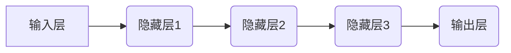

> 深度学习，卷积神经网络，反向传播，图灵奖，Hinton，LeCun，Bengio

## 1. 背景介绍

深度学习作为人工智能领域最具突破性的技术之一，近年来取得了令人瞩目的成就，在图像识别、自然语言处理、语音识别等领域展现出强大的应用潜力。而这背后离不开三位深度学习领域的先驱者：Geoffrey Hinton、Yann LeCun 和 Yoshua Bengio。他们不仅在理论研究上做出了卓越贡献，也推动了深度学习技术的实际应用，最终获得了2018年图灵奖的殊荣。

## 2. 核心概念与联系

深度学习的核心概念是利用多层神经网络来模拟人类大脑的学习过程。这些神经网络由多个相互连接的神经元组成，每个神经元接收来自前一层神经元的输入，并根据一定的权重进行计算，最终输出到下一层神经元。通过训练，神经网络可以学习到数据的特征和模式，从而实现对数据的预测和分类。

**深度学习架构**



**核心概念联系**

* **神经网络:** 深度学习的基础，由多个层级的神经元组成，模拟大脑神经元连接。
* **激活函数:**  决定神经元输出的非线性函数，引入非线性，使神经网络能够学习复杂的数据模式。
* **权重:** 连接神经元的参数，通过训练调整权重，使神经网络能够准确地学习数据。
* **反向传播:**  用于训练神经网络的算法，通过计算误差，反向调整权重，使神经网络的输出更接近真实值。

## 3. 核心算法原理 & 具体操作步骤

### 3.1  算法原理概述

深度学习的核心算法是反向传播算法，它通过迭代更新神经网络的权重，使网络的输出与真实值之间的误差最小化。

### 3.2  算法步骤详解

1. **前向传播:** 将输入数据通过神经网络传递，计算输出结果。
2. **误差计算:** 计算输出结果与真实值的误差。
3. **反向传播:** 将误差反向传播到神经网络的每一层，计算每个神经元的梯度。
4. **权重更新:** 根据梯度更新神经网络的权重，使误差最小化。
5. **重复步骤1-4:** 迭代执行上述步骤，直到误差达到预设阈值。

### 3.3  算法优缺点

**优点:**

* 能够学习复杂的数据模式。
* 性能优于传统机器学习算法。
* 可应用于多种领域。

**缺点:**

* 训练时间长，需要大量数据和计算资源。
* 容易过拟合，需要进行正则化处理。
* 难以解释模型的决策过程。

### 3.4  算法应用领域

深度学习算法广泛应用于以下领域:

* **图像识别:** 人脸识别、物体检测、图像分类。
* **自然语言处理:** 机器翻译、文本摘要、情感分析。
* **语音识别:** 语音转文本、语音助手。
* **推荐系统:** 商品推荐、内容推荐。
* **医疗诊断:** 病情预测、疾病诊断。

## 4. 数学模型和公式 & 详细讲解 & 举例说明

### 4.1  数学模型构建

深度学习模型通常采用多层感知机 (MLP) 或卷积神经网络 (CNN) 等结构。

**多层感知机 (MLP)**

MLP 由多个全连接层组成，每一层的神经元都与上一层的每个神经元连接。

**卷积神经网络 (CNN)**

CNN 利用卷积层和池化层来提取图像特征。卷积层通过卷积核对图像进行卷积运算，提取图像局部特征。池化层对卷积层的输出进行降维，减少计算量。

### 4.2  公式推导过程

**激活函数:**

常用的激活函数包括 sigmoid 函数、ReLU 函数等。

**sigmoid 函数:**

$$
f(x) = \frac{1}{1 + e^{-x}}
$$

**ReLU 函数:**

$$
f(x) = max(0, x)
$$

**损失函数:**

常用的损失函数包括均方误差 (MSE) 、交叉熵损失 (Cross-Entropy Loss) 等。

**均方误差 (MSE):**

$$
L = \frac{1}{n} \sum_{i=1}^{n} (y_i - \hat{y}_i)^2
$$

**交叉熵损失 (Cross-Entropy Loss):**

$$
L = -\sum_{i=1}^{n} y_i \log(\hat{y}_i)
$$

### 4.3  案例分析与讲解

**图像分类:**

使用 CNN 对图像进行分类。输入图像经过卷积层和池化层提取特征，然后经过全连接层进行分类。

**文本生成:**

使用 RNN 对文本进行生成。RNN 可以记忆之前的信息，生成更流畅的文本。

## 5. 项目实践：代码实例和详细解释说明

### 5.1  开发环境搭建

使用 Python 语言和深度学习框架 TensorFlow 或 PyTorch 进行开发。

### 5.2  源代码详细实现

```python
# 使用 TensorFlow 实现简单的图像分类模型

import tensorflow as tf

# 定义模型结构
model = tf.keras.models.Sequential([
    tf.keras.layers.Conv2D(32, (3, 3), activation='relu', input_shape=(28, 28, 1)),
    tf.keras.layers.MaxPooling2D((2, 2)),
    tf.keras.layers.Conv2D(64, (3, 3), activation='relu'),
    tf.keras.layers.MaxPooling2D((2, 2)),
    tf.keras.layers.Flatten(),
    tf.keras.layers.Dense(10, activation='softmax')
])

# 编译模型
model.compile(optimizer='adam',
              loss='sparse_categorical_crossentropy',
              metrics=['accuracy'])

# 训练模型
model.fit(x_train, y_train, epochs=10)

# 评估模型
loss, accuracy = model.evaluate(x_test, y_test)
print('Test loss:', loss)
print('Test accuracy:', accuracy)
```

### 5.3  代码解读与分析

* **模型结构:** 模型由卷积层、池化层和全连接层组成，用于提取图像特征和进行分类。
* **激活函数:** 使用 ReLU 函数作为激活函数，提高模型的学习能力。
* **损失函数:** 使用交叉熵损失函数，用于衡量模型的预测结果与真实值的差异。
* **优化器:** 使用 Adam 优化器，用于更新模型的权重。

### 5.4  运行结果展示

训练完成后，模型可以用于对新的图像进行分类。

## 6. 实际应用场景

### 6.1  图像识别

* **人脸识别:** 用于解锁手机、验证身份。
* **物体检测:** 用于自动驾驶、安防监控。
* **图像分类:** 用于医疗诊断、产品识别。

### 6.2  自然语言处理

* **机器翻译:** 将文本从一种语言翻译成另一种语言。
* **文本摘要:** 自动生成文本的简短摘要。
* **情感分析:** 分析文本的情感倾向，用于市场调研、客户服务。

### 6.3  语音识别

* **语音转文本:** 将语音转换为文本，用于语音助手、听写软件。
* **语音识别:** 用于语音控制、语音搜索。

### 6.4  未来应用展望

深度学习技术还在不断发展，未来将有更多新的应用场景出现，例如：

* **个性化推荐:** 根据用户的喜好推荐个性化的商品、内容。
* **自动写作:** 自动生成新闻报道、小说等文本。
* **医疗诊断辅助:** 辅助医生进行疾病诊断，提高诊断准确率。

## 7. 工具和资源推荐

### 7.1  学习资源推荐

* **书籍:**
    * Deep Learning by Ian Goodfellow, Yoshua Bengio, and Aaron Courville
    * Hands-On Machine Learning with Scikit-Learn, Keras & TensorFlow by Aurélien Géron
* **在线课程:**
    * Coursera: Deep Learning Specialization by Andrew Ng
    * Udacity: Deep Learning Nanodegree

### 7.2  开发工具推荐

* **TensorFlow:** 开源深度学习框架，支持多种硬件平台。
* **PyTorch:** 开源深度学习框架，以其灵活性和易用性而闻名。
* **Keras:** 高级深度学习API，可以运行在 TensorFlow、Theano 或 CNTK 后端。

### 7.3  相关论文推荐

* **AlexNet:** ImageNet Classification with Deep Convolutional Neural Networks
* **VGGNet:** Very Deep Convolutional Networks for Large-Scale Image Recognition
* **ResNet:** Deep Residual Learning for Image Recognition

## 8. 总结：未来发展趋势与挑战

### 8.1  研究成果总结

Hinton、LeCun 和 Bengio 的研究成果推动了深度学习技术的快速发展，为人工智能领域带来了革命性的变革。

### 8.2  未来发展趋势

* **模型规模和复杂度:** 继续发展更深、更复杂的深度学习模型。
* **数据效率:** 研究更有效利用数据训练深度学习模型的方法。
* **可解释性:** 提高深度学习模型的可解释性，使模型的决策过程更加透明。
* **安全性和鲁棒性:** 研究提高深度学习模型的安全性和鲁棒性，使其能够应对各种攻击和干扰。

### 8.3  面临的挑战

* **计算资源:** 训练大型深度学习模型需要大量的计算资源。
* **数据标注:** 深度学习模型需要大量的标注数据，数据标注成本高昂。
* **伦理问题:** 深度学习技术可能带来一些伦理问题，例如算法偏见、隐私泄露等。

### 8.4  研究展望

未来，深度学习技术将继续发展，在更多领域发挥重要作用。研究人员将继续探索新的算法、模型和应用场景，推动人工智能技术的进步。

## 9. 附录：常见问题与解答

**Q1: 深度学习和传统机器学习有什么区别？**

**A1:** 深度学习是一种更高级的机器学习方法，它利用多层神经网络来学习数据的复杂模式。传统机器学习方法通常需要人工特征工程，而深度学习可以自动学习特征。

**Q2: 如何选择合适的深度学习框架？**

**A2:** TensorFlow 和 PyTorch 是两个流行的深度学习框架。TensorFlow 更适合于生产环境，而 PyTorch 更灵活易用。

**Q3: 如何解决深度学习模型的过拟合问题？**

**A3:** 可以使用正则化技术、数据增强、Dropout 等方法来解决过拟合问题。

**Q4: 深度学习技术有哪些伦理问题？**

**A4:** 深度学习技术可能带来算法偏见、隐私泄露、就业替代等伦理问题。需要谨慎使用和监管。


作者：禅与计算机程序设计艺术 / Zen and the Art of Computer Programming 
<end_of_turn>