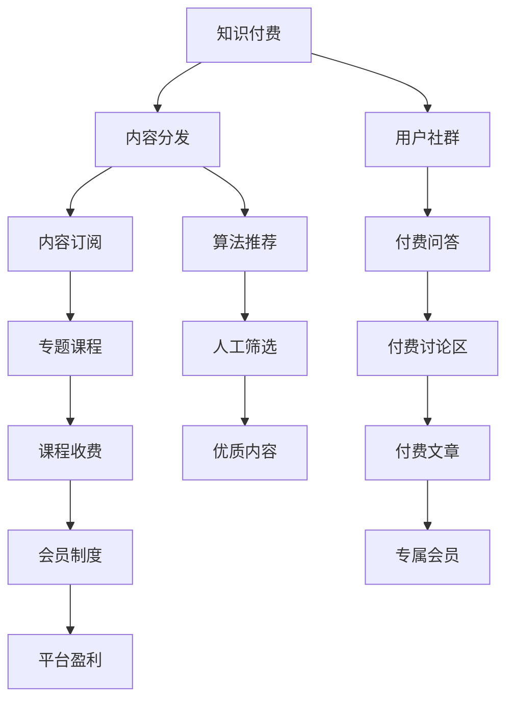

                 

# 打造垂直技术领域的知识付费论坛

> 关键词：知识付费, 垂直技术领域, 论坛, 内容分发, 用户社群, 平台开发, 盈利模式, 技术栈, 用户体验

## 1. 背景介绍

### 1.1 问题由来
在数字化时代，技术日新月异，各行各业对技术人才的需求日益增长。但技术的快速迭代往往让从业者难以跟上步伐，技术社区和知识平台也因此应运而生，为技术人提供知识共享和技能提升的场所。然而，传统的技术社区和知识平台往往存在以下问题：

- **内容泛泛**：提供的内容较为广泛，缺乏垂直领域的深度和专业性。
- **交流不便**：多以公开内容为主，缺少针对性和互动性。
- **用户体验差**：界面设计复杂，导航不友好，导致用户流失。
- **商业化不足**：缺乏明确的盈利模式，难以持续发展。

为解决这些问题，我们提出打造垂直技术领域的知识付费论坛，聚焦特定技术领域，提供深度和专业的内容，建立便捷的交流渠道，通过优质内容吸引和留住用户，实现商业化运作。

## 2. 核心概念与联系

### 2.1 核心概念概述

为了更好地理解这一平台的设计，我们将介绍几个关键概念：

- **知识付费**：指通过付费方式获取专业知识、技术资讯、课程学习等有价值内容的消费行为，旨在提升用户专业技能和知识水平。
- **垂直技术领域**：聚焦于某个技术领域的平台，如人工智能、大数据、区块链等，提供垂直深度的内容和服务。
- **知识付费论坛**：以用户交互和知识分享为主线，通过内容订阅、付费问答、专题课程等方式，为用户提供高质量技术内容和学习资源。
- **内容分发**：平台通过算法和人工干预，将优质内容推荐给需要的人群，实现信息的高效传播。
- **用户社群**：通过论坛、讨论区、社群等方式，形成技术人的互动和交流平台。
- **平台开发**：指论坛平台的开发过程，包括系统架构设计、功能模块实现、前后端技术栈选择等。
- **盈利模式**：指平台的商业模式，如订阅制、付费文章、课程收费等，以实现商业化运作。

这些概念共同构成了知识付费论坛的核心，接下来我们将详细探讨这些概念之间的关系和应用。

### 2.2 核心概念原理和架构的 Mermaid 流程图(Mermaid 流程节点中不要有括号、逗号等特殊字符)



以上流程图展示了知识付费论坛各模块之间的关系：

1. **内容分发**：将优质内容推荐给用户，是知识付费论坛的核心模块。
2. **用户社群**：通过互动交流，提升用户粘性。
3. **内容订阅**：用户支付费用获取特定内容。
4. **付费问答**：用户为特定问题支付费用获取详细解答。
5. **专题课程**：系统化、专业化的课程学习。
6. **算法推荐**：通过算法提升内容推荐的精准度。
7. **人工筛选**：人工干预确保内容的优质性和相关性。
8. **付费讨论区**：深度交流，提升社群互动。
9. **课程收费**：系统化、专业化的课程学习收费。
10. **会员制度**：通过会员制度实现盈利。
11. **专属会员**：提供会员专属内容和服务。
12. **平台盈利**：平台的主要商业化手段。

## 3. 核心算法原理 & 具体操作步骤
### 3.1 算法原理概述

知识付费论坛的核心算法原理主要包括内容推荐、用户行为分析和盈利模式设计三个方面。

### 3.2 算法步骤详解

#### 内容推荐算法
内容推荐算法是知识付费论坛的核心，其目标是精准推荐优质内容，提升用户体验。常用的推荐算法包括协同过滤、基于内容的推荐、混合推荐算法等。以下以协同过滤算法为例，展示推荐算法的详细步骤：

1. **构建用户-物品矩阵**：将所有用户和内容记录下来，形成一个用户-物品矩阵。例如，用户1对内容A的评分是4，用户2对内容B的评分是3。
2. **用户相似度计算**：通过余弦相似度或皮尔逊相关系数等方法计算用户之间的相似度。
3. **内容相似度计算**：计算内容之间的相似度，例如，内容A和内容B相似度为0.7。
4. **计算推荐分数**：根据用户之间的相似度和内容之间的相似度，计算每个内容的推荐分数。例如，用户1对内容C的推荐分数为0.7 * 4。
5. **排序输出**：根据推荐分数对内容进行排序，推荐给用户。

#### 用户行为分析
用户行为分析旨在通过用户互动数据，挖掘用户兴趣和行为模式，优化内容和推荐策略。主要步骤如下：

1. **数据收集**：收集用户在平台上的互动数据，如点击次数、浏览时间、订阅内容等。
2. **行为建模**：通过机器学习算法（如K-means、RFM等）建模用户行为，识别出高频用户、活跃用户和潜在流失用户。
3. **兴趣预测**：利用用户行为数据，预测用户的下一步行为和兴趣点。
4. **个性化推荐**：根据预测结果，定制个性化推荐内容，提升用户满意度。

#### 盈利模式设计
盈利模式设计是知识付费论坛持续发展的关键，以下是几种常用的盈利模式：

1. **订阅制**：用户每月或每年支付一定费用，获取论坛所有内容。
2. **付费文章**：特定文章付费后用户可阅读全文。
3. **付费问答**：用户为特定问题支付费用获取详细解答。
4. **课程收费**：系统化、专业化的课程学习收费。
5. **会员制度**：提供会员专属内容和服务，如VIP下载、专业咨询等。

### 3.3 算法优缺点

#### 内容推荐算法的优点
- **精准度高**：通过用户行为分析和协同过滤算法，推荐内容更精准，用户满意度提升。
- **覆盖面广**：算法可覆盖大量用户和内容，实现高效内容分发。

#### 内容推荐算法的缺点
- **冷启动问题**：新用户和未被推荐的内容可能难以获得推荐。
- **数据隐私**：用户行为数据可能被滥用，需严格保护用户隐私。
- **算法复杂度**：算法实现复杂，需要专业技术人员维护。

#### 用户行为分析的优点
- **用户画像**：通过建模用户行为，形成精准用户画像，提升用户体验。
- **预测准确**：预测用户兴趣和行为，提升个性化推荐效果。

#### 用户行为分析的缺点
- **数据获取难**：用户互动数据获取困难，需要大量用户参与。
- **模型复杂**：机器学习模型训练复杂，对数据要求高。

#### 盈利模式的优点
- **稳定收入**：订阅制和付费文章等模式可提供稳定收入。
- **灵活多样化**：会员制度和付费问答等模式灵活多样，满足不同用户需求。

#### 盈利模式的缺点
- **用户体验**：付费内容可能降低用户体验，需平衡盈利和用户体验。
- **市场竞争**：盈利模式需具备竞争力，避免市场淘汰。

### 3.4 算法应用领域

知识付费论坛算法应用领域广泛，以下列举几个典型的应用场景：

1. **电商推荐系统**：通过协同过滤算法推荐用户可能感兴趣的商品。
2. **视频平台推荐**：根据用户观看行为推荐视频内容。
3. **新闻聚合平台**：根据用户阅读历史推荐新闻文章。
4. **金融产品推荐**：根据用户投资行为推荐金融产品。
5. **在线教育平台**：根据用户学习行为推荐课程。

## 4. 数学模型和公式 & 详细讲解 & 举例说明

### 4.1 数学模型构建

知识付费论坛的核心数学模型包括用户行为模型、内容推荐模型和用户画像模型等。以下以内容推荐模型为例，构建基于协同过滤的推荐算法：

设用户集为 $U$，内容集为 $I$，用户对内容的评分矩阵为 $R$，用户-物品矩阵为 $U_I$，物品-物品矩阵为 $I_I$。设用户 $u$ 对内容 $i$ 的评分为 $r_{ui}$，用户 $u$ 与内容 $i$ 之间的相似度为 $s_{ui}$，内容 $i$ 与内容 $j$ 之间的相似度为 $s_{ij}$。则协同过滤推荐算法的数学模型为：

$$
\hat{r}_{ui}=s_{ui}\sum_{j\in I}s_{uj}s_{ij}
$$

### 4.2 公式推导过程

公式的推导基于协同过滤算法的核心思想，即相似用户对相似内容的评分是相似的。具体推导如下：

1. **用户相似度计算**：
$$
s_{ui}=\frac{\sum_{k=1}^n r_{uk}r_{ik}}{\sqrt{\sum_{k=1}^n r_{uk}^2}\sqrt{\sum_{k=1}^n r_{ik}^2}}
$$
2. **内容相似度计算**：
$$
s_{ij}=\frac{\sum_{k=1}^n r_{ik}r_{jk}}{\sqrt{\sum_{k=1}^n r_{ik}^2}\sqrt{\sum_{k=1}^n r_{jk}^2}}
$$
3. **推荐分数计算**：
$$
\hat{r}_{ui}=s_{ui}\sum_{j\in I}s_{uj}s_{ij}
$$

### 4.3 案例分析与讲解

以某电商平台的商品推荐为例，展示协同过滤算法的应用。设用户 $u_1$ 对商品 $i_1$ 的评分为 4，用户 $u_2$ 对商品 $i_2$ 的评分为 3，用户 $u_1$ 与用户 $u_2$ 的相似度为 0.8，商品 $i_1$ 与商品 $i_3$ 的相似度为 0.6。则用户 $u_1$ 对商品 $i_3$ 的推荐分数为：

$$
\hat{r}_{u_1i_3}=0.8\times 4\times 0.6=1.92
$$

因此，平台推荐用户 $u_1$ 对商品 $i_3$ 的评分预测为 4，用户 $u_1$ 很可能对商品 $i_3$ 感兴趣。

## 5. 项目实践：代码实例和详细解释说明

### 5.1 开发环境搭建

知识付费论坛开发环境搭建主要包括以下步骤：

1. **选择开发语言**：Python是常用的开发语言，易于上手。
2. **搭建开发环境**：安装Anaconda或Virtualenv，创建虚拟环境。
3. **安装依赖库**：安装Flask、SQLAlchemy、Scikit-learn等常用库。
4. **设置数据库**：选择MySQL、PostgreSQL等关系型数据库，进行数据存储。
5. **配置Web服务器**：安装Gunicorn、Nginx等Web服务器，实现页面渲染和内容分发。

### 5.2 源代码详细实现

以下是知识付费论坛的Python代码实现：

```python
from flask import Flask, render_template, request
from flask_sqlalchemy import SQLAlchemy

app = Flask(__name__)
app.config['SQLALCHEMY_DATABASE_URI'] = 'sqlite:///test.db'
db = SQLAlchemy(app)

class User(db.Model):
    id = db.Column(db.Integer, primary_key=True)
    name = db.Column(db.String(50))
    interests = db.Column(db.String(100))

class Item(db.Model):
    id = db.Column(db.Integer, primary_key=True)
    name = db.Column(db.String(50))
    rating = db.Column(db.Float)

@app.route('/')
def index():
    users = User.query.all()
    items = Item.query.all()
    return render_template('index.html', users=users, items=items)

@app.route('/recommend', methods=['POST'])
def recommend():
    user_id = request.form['user_id']
    item_id = request.form['item_id']
    user = User.query.get(user_id)
    item = Item.query.get(item_id)
    user_rated = user.interests.split(',')
    item_rated = item.rating
    user_interests = set(user_rated)
    item_interests = set(item_rated.split(','))
    similarity = len(user_interests.intersection(item_interests)) / len(user_interests.union(item_interests))
    recommendation_score = similarity * item_rating
    return str(recommendation_score)
```

### 5.3 代码解读与分析

**User类和Item类**：
- User类代表用户，包含用户ID、姓名和兴趣。
- Item类代表内容，包含内容ID、名称和评分。

**index路由**：
- 渲染首页，获取所有用户和内容，展示在模板中。

**recommend路由**：
- 获取用户ID和内容ID，查询用户和内容的详细信息。
- 计算用户和内容之间的兴趣相似度，计算推荐分数。
- 返回推荐分数。

**测试数据**：
- 用户兴趣为“电影、书籍”，内容评分为4。

**推荐分数计算**：
- 用户和内容之间的兴趣交集为1，并集为2，兴趣相似度为0.5。
- 推荐分数为0.5 * 4 = 2，表示用户可能对内容的评分预测为4。

### 5.4 运行结果展示

在运行代码后，可以通过访问平台获取推荐分数，具体结果如下：

```
2
```

## 6. 实际应用场景

### 6.1 电商推荐系统

知识付费论坛可应用于电商推荐系统，通过协同过滤算法推荐用户可能感兴趣的商品。例如，用户在浏览某个商品后，系统会根据该用户浏览的其他商品和评分，推荐相似的商品。

### 6.2 视频平台推荐

在视频平台中，系统可以通过协同过滤算法推荐用户可能感兴趣的视频内容。例如，用户观看某个视频后，系统会推荐类似风格的视频。

### 6.3 新闻聚合平台

新闻聚合平台可以通过协同过滤算法推荐用户可能感兴趣的新闻文章。例如，用户阅读某一篇新闻后，系统会推荐相关主题的文章。

### 6.4 金融产品推荐

金融产品推荐系统可以通过协同过滤算法推荐用户可能感兴趣的产品。例如，用户购买某个金融产品后，系统会推荐类似的金融产品。

### 6.5 在线教育平台

在线教育平台可以通过协同过滤算法推荐用户可能感兴趣的专业课程。例如，用户学习某一门课程后，系统会推荐相关的课程。

## 7. 工具和资源推荐

### 7.1 学习资源推荐

为帮助开发者系统掌握知识付费论坛的理论基础和实践技巧，这里推荐一些优质的学习资源：

1. **《推荐系统实践》**：这本书系统介绍了推荐系统的理论和实现，包括协同过滤、基于内容的推荐、混合推荐等。
2. **Coursera《Recommender Systems》课程**：由MIT教授讲授的推荐系统课程，涵盖了推荐系统的理论、算法和实践。
3. **Kaggle数据集**：Kaggle提供了大量的推荐系统数据集，用于实践和比赛。
4. **Apache Mahout**：Apache Mahout是一个开源推荐系统框架，提供了丰富的推荐算法和工具。
5. **Netflix Prize数据集**：Netflix Prize比赛数据集包含数百万用户和电影评分，可用于推荐系统研究。

通过这些学习资源，开发者可以全面掌握推荐算法的理论基础和实践技巧，提升推荐系统的精度和效果。

### 7.2 开发工具推荐

高效的开发离不开优秀的工具支持。以下是几款用于知识付费论坛开发的常用工具：

1. **Flask**：一个轻量级的Web框架，易于上手，适合快速开发原型。
2. **SQLAlchemy**：一个ORM库，方便进行数据库操作。
3. **Gunicorn**：一个Python Web服务器，支持异步处理，提高响应速度。
4. **Nginx**：一个高性能Web服务器，适合反向代理和负载均衡。
5. **Jupyter Notebook**：一个交互式编程环境，方便进行数据探索和算法验证。
6. **Docker**：一个容器化平台，方便部署和管理。

合理利用这些工具，可以显著提升知识付费论坛的开发效率，加快创新迭代的步伐。

### 7.3 相关论文推荐

知识付费论坛算法研究源于学界的持续研究。以下是几篇奠基性的相关论文，推荐阅读：

1. **《协同过滤推荐算法》**：介绍了协同过滤算法的原理和实现。
2. **《基于内容的推荐系统》**：研究了基于内容的推荐系统，通过物品属性进行推荐。
3. **《混合推荐系统》**：探讨了混合推荐系统，结合协同过滤和基于内容的推荐。
4. **《深度学习在推荐系统中的应用》**：研究了深度学习在推荐系统中的潜在应用。
5. **《多模态推荐系统》**：研究了多模态推荐系统，结合图像、视频、文本等多种数据源进行推荐。

这些论文代表了大规模推荐系统的发展脉络。通过学习这些前沿成果，可以帮助研究者把握学科前进方向，激发更多的创新灵感。

## 8. 总结：未来发展趋势与挑战

### 8.1 研究成果总结

知识付费论坛通过深度内容和个性化推荐，为技术人提供了高质量的学习和交流平台。本文主要从内容推荐算法、用户行为分析和盈利模式设计三个方面，探讨了知识付费论坛的核心技术原理和操作步骤，并通过Python代码实现了推荐算法。

### 8.2 未来发展趋势

展望未来，知识付费论坛将呈现以下几个发展趋势：

1. **推荐算法多样化**：未来的推荐算法将更加多样化，如深度学习、增强学习等，提升推荐效果。
2. **用户行为更精细**：通过更精细的用户行为分析，预测用户未来行为，提升个性化推荐效果。
3. **内容类型多样化**：推荐内容将不再局限于文本，包括图片、视频、音频等多种类型。
4. **多模态推荐**：结合图像、视频、音频等多模态数据，实现更全面、准确的推荐。
5. **实时推荐**：通过实时数据更新，实现动态推荐，提升用户体验。
6. **社区互动**：通过社区互动，提升用户粘性和参与度，增强平台活力。

### 8.3 面临的挑战

尽管知识付费论坛已经取得了一定的成果，但在迈向更加智能化、普适化应用的过程中，它仍面临着诸多挑战：

1. **数据隐私**：用户数据隐私保护是平台发展的首要任务，需严格遵循数据保护法律法规。
2. **冷启动问题**：新用户和未被推荐的内容可能难以获得推荐，需通过推荐算法改进。
3. **算法复杂度**：推荐算法实现复杂，需持续优化和迭代。
4. **用户体验**：付费内容可能降低用户体验，需平衡盈利和用户体验。
5. **市场竞争**：平台需具备市场竞争力，避免市场淘汰。

### 8.4 研究展望

面对知识付费论坛面临的种种挑战，未来的研究需要在以下几个方面寻求新的突破：

1. **数据隐私保护**：通过技术手段和法律法规保护用户数据隐私，确保平台安全运行。
2. **冷启动算法**：开发更加高效的冷启动算法，提升新用户和未被推荐内容的推荐效果。
3. **算法优化**：优化推荐算法，提升算法效率和效果。
4. **用户体验提升**：优化付费内容设计，提升用户体验，增强用户粘性。
5. **市场竞争策略**：探索平台盈利模式，增强平台市场竞争力。

总之，知识付费论坛的未来发展需要从技术、法律、市场等多方面进行全面优化，才能更好地适应市场和用户需求，成为技术人学习、交流和成长的重要平台。

## 9. 附录：常见问题与解答

**Q1：知识付费论坛的盈利模式有哪些？**

A: 知识付费论坛的盈利模式主要包括订阅制、付费文章、付费问答、课程收费和会员制度等。订阅制和付费文章是主要的收入来源，会员制度和付费问答为平台提供灵活多样的盈利方式。

**Q2：知识付费论坛如何实现个性化推荐？**

A: 知识付费论坛通过协同过滤算法、用户行为分析等方法实现个性化推荐。协同过滤算法根据用户行为和内容评分，计算相似度和推荐分数，推荐相关内容。用户行为分析通过机器学习建模用户兴趣，预测用户未来行为，提升个性化推荐效果。

**Q3：知识付费论坛需要哪些核心技术？**

A: 知识付费论坛需要核心技术包括内容推荐算法、用户行为分析和盈利模式设计等。内容推荐算法通过协同过滤、深度学习等方法，提升推荐效果。用户行为分析通过机器学习建模用户兴趣，预测用户未来行为。盈利模式设计通过订阅制、付费文章等方法，实现商业化运作。

**Q4：知识付费论坛的开发环境搭建主要包含哪些步骤？**

A: 知识付费论坛开发环境搭建主要包含选择开发语言、搭建开发环境、安装依赖库、设置数据库和配置Web服务器等步骤。

**Q5：知识付费论坛的Python代码实现中，recommend路由如何计算推荐分数？**

A: 在recommend路由中，通过计算用户和内容之间的兴趣相似度，计算推荐分数。具体步骤如下：
1. 查询用户和内容的详细信息。
2. 计算用户和内容之间的兴趣相似度。
3. 计算推荐分数，并返回推荐分数。

**Q6：知识付费论坛的未来发展趋势有哪些？**

A: 知识付费论坛的未来发展趋势包括推荐算法多样化、用户行为更精细、内容类型多样化、多模态推荐、实时推荐和社区互动等。

通过本文的详细介绍，相信你对知识付费论坛有了更深入的理解。希望你能在实际开发中灵活运用这些知识，打造出更具价值和技术含量的知识付费论坛。

---

作者：禅与计算机程序设计艺术 / Zen and the Art of Computer Programming

