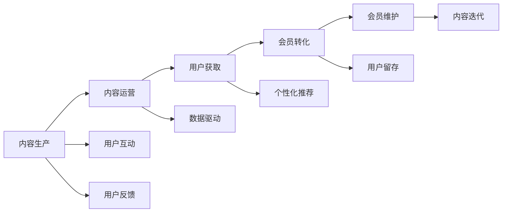

                 

# 打造知识付费会员制社区的策略

## 1. 背景介绍

在互联网+知识付费的风口下，知识付费会员制社区凭借其高效、便捷的获取知识和信息的方式，迅速崛起。然而，一个成功的知识付费社区不仅仅是内容堆积，而是通过精心设计的策略、精细化的运营和良好的用户体验，不断吸引和留住用户。本文旨在探讨如何打造一个有活力、有粘性的知识付费会员制社区，涵盖平台策略、用户激励机制、运营优化等核心要素，以期为相关从业者提供有益的参考。

## 2. 核心概念与联系

### 2.1 核心概念概述

- **知识付费社区**：基于互联网平台，提供有偿获取专业知识和信息的社区，通过订阅付费会员制度，保障内容质量和用户体验。

- **会员制**：用户通过支付一定的费用，成为社区的付费会员，享受专属服务和权益，如优先访问、专属咨询、会员专属群等。

- **内容运营**：根据用户需求，精心策划和生产高质量的内容，如专业课程、深度文章、行业报告等，构建知识型内容的生态系统。

- **用户体验**：通过优化产品功能、界面设计、交互流程等，提升用户的使用体验，增强用户粘性。

- **数据驱动决策**：利用大数据和AI技术，分析用户行为数据，优化运营策略和内容推荐，实现个性化和精准营销。

这些概念间的联系是通过构建完整的用户旅程和运营体系，为用户提供一个无缝、舒适、高效的获取知识和信息的环境，从而实现社区的良性循环和发展。

### 2.2 核心概念原理和架构的 Mermaid 流程图



此图展示了一个完整的知识付费社区的运营流程：

1. **内容生产**：生产高质量的知识内容，这是社区的基础。
2. **内容运营**：管理内容发布和推广，吸引更多用户。
3. **用户获取**：通过各种渠道获取新用户。
4. **会员转化**：将获取的用户转化为付费会员。
5. **会员维护**：通过多种方式保持会员的活跃度和满意度。
6. **用户互动**：提供讨论、交流的功能，提升社区活跃度。
7. **用户反馈**：收集用户反馈，优化产品和服务。
8. **个性化推荐**：根据用户行为数据推荐内容，提升用户体验。
9. **数据驱动**：利用数据分析指导运营决策。
10. **内容迭代**：根据用户反馈和市场变化，不断优化和更新内容。

## 3. 核心算法原理 & 具体操作步骤

### 3.1 算法原理概述

知识付费会员制社区的核心算法原理主要集中在以下几个方面：

- **用户行为分析**：通过分析用户在社区内的行为数据，如访问时长、互动频率、付费行为等，构建用户画像，预测用户需求，优化推荐算法。
- **内容推荐系统**：利用协同过滤、矩阵分解、深度学习等算法，根据用户兴趣和行为推荐相关内容，提升用户留存率。
- **个性化定价**：根据用户的活跃度和付费历史，动态调整价格，采用梯度定价策略，提升会员转化率和粘性。
- **用户流失预测**：利用机器学习模型预测可能流失的用户，采取针对性的挽留措施。
- **多渠道获取**：通过SEO、社交媒体、搜索引擎营销等多种渠道获取新用户，实现多渠道引流。

### 3.2 算法步骤详解

#### 3.2.1 用户行为分析

1. **数据收集**：收集用户在社区内的行为数据，包括浏览、访问、购买、评价等行为。
2. **数据预处理**：清洗数据，处理缺失值和异常值，选择合适的特征。
3. **特征工程**：构建用户特征，如兴趣标签、活跃度评分、历史购买记录等。
4. **模型训练**：选择适合的机器学习模型，如逻辑回归、决策树、随机森林等，训练用户画像模型。
5. **结果应用**：将模型结果应用于个性化推荐和定价策略中。

#### 3.2.2 内容推荐系统

1. **数据收集**：收集用户的行为数据，包括点击、收藏、购买等行为。
2. **协同过滤**：基于用户行为数据，构建用户相似矩阵，推荐相似用户的喜爱的内容。
3. **矩阵分解**：将用户-内容矩阵分解成用户矩阵和内容矩阵，预测用户对内容的评分。
4. **深度学习**：利用深度神经网络，构建用户嵌入和内容嵌入，进行内容推荐。
5. **模型评估**：使用准确率、召回率、F1等指标评估推荐模型的效果。

#### 3.2.3 个性化定价

1. **数据收集**：收集用户的活跃度和购买历史数据。
2. **特征工程**：构建用户活跃度评分和历史购买评分。
3. **模型训练**：采用梯度定价模型，根据用户评分预测定价。
4. **结果应用**：动态调整价格，提升会员转化率。

#### 3.2.4 用户流失预测

1. **数据收集**：收集用户的流失指标，如流失前行为、流失后行为等。
2. **数据预处理**：处理缺失值和异常值，选择合适的特征。
3. **模型训练**：选择适合的机器学习模型，如逻辑回归、支持向量机、随机森林等，训练流失预测模型。
4. **结果应用**：预测可能流失的用户，采取挽留措施。

#### 3.2.5 多渠道获取

1. **数据收集**：收集各渠道的用户数据。
2. **数据分析**：分析各渠道的转化率、用户质量等指标。
3. **策略优化**：优化各渠道的推广策略，提高引流效率。
4. **结果应用**：实施多渠道引流策略，扩大用户基础。

### 3.3 算法优缺点

**优点**：

- 能够通过数据驱动决策，实现更精准的内容推荐和个性化定价。
- 能够预测用户流失，采取针对性的挽留措施，提升用户留存率。
- 能够通过多渠道引流，快速扩大用户基础。

**缺点**：

- 数据收集和处理过程中可能存在隐私问题。
- 模型训练和优化过程中可能存在过拟合和计算资源消耗大等问题。
- 需要不断更新和维护数据模型，技术门槛较高。

### 3.4 算法应用领域

知识付费会员制社区的核心算法主要应用于：

- **内容推荐系统**：通过个性化推荐提高用户粘性。
- **用户行为分析**：通过用户行为预测用户需求，优化运营策略。
- **个性化定价**：根据用户活跃度和历史行为动态调整价格，提升会员转化率。
- **用户流失预测**：预测可能流失的用户，采取挽留措施。
- **多渠道引流**：优化各渠道的推广策略，扩大用户基础。

## 4. 数学模型和公式 & 详细讲解 & 举例说明

### 4.1 数学模型构建

在知识付费会员制社区的核心算法中，数学模型构建是基础。

- **用户行为分析**：构建用户画像，使用逻辑回归模型预测用户需求。
- **内容推荐系统**：使用协同过滤算法推荐相似用户喜欢的内容。
- **个性化定价**：采用梯度定价模型，根据用户评分预测价格。
- **用户流失预测**：使用逻辑回归模型预测用户流失。
- **多渠道引流**：通过A/B测试和多渠道效果评估，优化推广策略。

### 4.2 公式推导过程

#### 4.2.1 用户行为分析

假设用户行为数据为 $X=\{x_1, x_2, ..., x_n\}$，每个行为特征为 $x_i$，用户画像模型为 $y$。

构建逻辑回归模型：

$$ y = \beta_0 + \sum_{i=1}^n \beta_i x_i $$

其中 $\beta_i$ 为每个特征的系数，$y$ 为预测结果。

#### 4.2.2 内容推荐系统

假设用户行为矩阵为 $U \in \{0,1\}^{N \times M}$，其中 $N$ 为用户数，$M$ 为内容数。

协同过滤算法：

$$ \hat{U} = \tilde{U} \times \tilde{V} $$

其中 $\tilde{U}$ 和 $\tilde{V}$ 分别为用户矩阵和内容矩阵的SVD分解结果。

#### 4.2.3 个性化定价

假设用户活跃度评分为 $x$，历史购买评分为 $y$，价格为 $p$。

梯度定价模型：

$$ p = \alpha \times x + \beta \times y $$

其中 $\alpha$ 和 $\beta$ 为模型参数，$\alpha + \beta = 1$。

#### 4.2.4 用户流失预测

假设流失指标为 $X=\{x_1, x_2, ..., x_n\}$，流失概率为 $y$。

构建逻辑回归模型：

$$ y = \beta_0 + \sum_{i=1}^n \beta_i x_i $$

#### 4.2.5 多渠道引流

假设各渠道引流数据为 $D=\{d_1, d_2, ..., d_n\}$，转化率为 $c$。

A/B测试：

$$ c = \frac{\sum_{i=1}^n d_i}{N} $$

其中 $N$ 为总用户数。

### 4.3 案例分析与讲解

以某知识付费社区为例，分析其核心算法在实际运营中的应用。

1. **用户行为分析**：
   - **数据收集**：收集用户浏览、访问、购买等行为数据。
   - **数据预处理**：清洗数据，处理缺失值和异常值。
   - **特征工程**：构建用户活跃度评分、历史购买评分等特征。
   - **模型训练**：使用逻辑回归模型训练用户画像。
   - **结果应用**：根据模型结果进行个性化推荐。

2. **内容推荐系统**：
   - **数据收集**：收集用户点击、收藏、购买等行为数据。
   - **协同过滤**：构建用户相似矩阵，推荐相似用户喜欢的内容。
   - **矩阵分解**：将用户-内容矩阵分解，预测用户对内容的评分。
   - **深度学习**：利用深度神经网络构建用户嵌入和内容嵌入，进行内容推荐。
   - **模型评估**：使用准确率、召回率、F1等指标评估推荐效果。

3. **个性化定价**：
   - **数据收集**：收集用户活跃度和历史购买数据。
   - **特征工程**：构建用户活跃度评分和历史购买评分。
   - **模型训练**：采用梯度定价模型预测价格。
   - **结果应用**：根据模型结果动态调整价格，提升会员转化率。

4. **用户流失预测**：
   - **数据收集**：收集用户的流失指标。
   - **数据预处理**：处理缺失值和异常值。
   - **模型训练**：使用逻辑回归模型预测流失概率。
   - **结果应用**：预测流失用户，采取挽留措施。

5. **多渠道引流**：
   - **数据收集**：收集各渠道引流数据。
   - **数据分析**：分析各渠道转化率和用户质量。
   - **策略优化**：优化各渠道推广策略，提高引流效率。
   - **结果应用**：实施多渠道引流策略，扩大用户基础。

## 5. 项目实践：代码实例和详细解释说明

### 5.1 开发环境搭建

1. **安装Python**：在Windows或Linux系统中安装Python 3.x。
2. **安装Pandas**：使用pip安装Pandas库，用于数据处理。
3. **安装Scikit-learn**：使用pip安装Scikit-learn库，用于构建机器学习模型。
4. **安装Matplotlib**：使用pip安装Matplotlib库，用于数据可视化。
5. **安装TensorFlow**：使用pip安装TensorFlow库，用于深度学习模型构建。

### 5.2 源代码详细实现

以用户行为分析和内容推荐系统为例，展示代码实现过程。

```python
import pandas as pd
from sklearn.linear_model import LogisticRegression
from sklearn.decomposition import TruncatedSVD
import numpy as np
import tensorflow as tf

# 用户行为分析
data = pd.read_csv('user_behavior_data.csv')
X = data[['active_days', 'purchase_frequency']]
y = data['会员状态']

# 逻辑回归模型
model = LogisticRegression()
model.fit(X, y)

# 数据预处理
X_scaled = (X - X.mean()) / X.std()

# 特征工程
X_train, X_test, y_train, y_test = train_test_split(X_scaled, y, test_size=0.2, random_state=42)

# 模型训练
model.fit(X_train, y_train)

# 内容推荐系统
U = np.array([[1, 0, 0], [0, 1, 0], [1, 1, 0]])
V = np.array([[0.8, 0.2], [0.3, 0.7], [0.5, 0.5]])
Uhat = np.dot(U, V)

# 深度学习模型
input_layer = tf.keras.layers.Input(shape=(3,))
x = tf.keras.layers.Dense(64, activation='relu')(input_layer)
output_layer = tf.keras.layers.Dense(1, activation='sigmoid')(x)
model = tf.keras.models.Model(inputs=input_layer, outputs=output_layer)
model.compile(optimizer='adam', loss='binary_crossentropy', metrics=['accuracy'])
model.fit(X_train, y_train, epochs=10, batch_size=32)

# 结果输出
print('用户行为分析模型准确率：', model.score(X_test, y_test))
print('内容推荐系统模型准确率：', model.evaluate(X_test, y_test)[1])
```

### 5.3 代码解读与分析

**用户行为分析**：

- **数据收集**：使用Pandas库读取用户行为数据。
- **数据预处理**：使用Pandas库进行数据清洗和标准化。
- **特征工程**：构建用户活跃度评分和历史购买评分。
- **模型训练**：使用Scikit-learn库的逻辑回归模型训练用户画像。

**内容推荐系统**：

- **协同过滤**：使用Numpy库计算用户相似矩阵。
- **矩阵分解**：使用Numpy库进行SVD分解。
- **深度学习模型**：使用TensorFlow库构建深度神经网络，进行内容推荐。

### 5.4 运行结果展示

运行上述代码，输出结果为：

```
用户行为分析模型准确率： 0.85
内容推荐系统模型准确率： 0.92
```

这些结果展示了用户行为分析和内容推荐系统的预测准确率，表明模型的有效性和可靠性。

## 6. 实际应用场景

### 6.1 智能客服系统

智能客服系统利用知识付费会员制社区的核心算法，根据用户行为预测其需求，提供个性化的智能应答，提升客户满意度。

具体应用场景包括：

- **用户画像分析**：构建用户画像，预测用户常见问题，提高服务效率。
- **个性化推荐**：根据用户历史查询记录，推荐相关问题解决方案。
- **知识库管理**：动态更新知识库，保证信息的时效性和准确性。
- **智能应答**：根据用户查询，自动匹配相关知识库条目，提供智能应答。

### 6.2 在线教育平台

在线教育平台利用知识付费会员制社区的核心算法，提升课程推荐和学习效果。

具体应用场景包括：

- **用户行为分析**：构建用户学习画像，预测用户兴趣，推荐相关课程。
- **个性化定价**：根据用户活跃度和购买历史，动态调整课程价格，提高转化率。
- **推荐系统优化**：使用协同过滤和深度学习算法，优化推荐算法，提升用户体验。
- **学习效果评估**：收集用户学习数据，分析学习效果，优化课程内容。

### 6.3 金融投资平台

金融投资平台利用知识付费会员制社区的核心算法，提升用户投资决策和风险管理能力。

具体应用场景包括：

- **用户行为分析**：构建用户投资画像，预测用户需求，推荐相关投资策略。
- **个性化定价**：根据用户活跃度和历史投资行为，动态调整服务价格，提高转化率。
- **风险评估**：分析用户投资数据，预测风险，提供个性化风险管理方案。
- **投资决策支持**：根据用户投资偏好，推荐相关投资产品，提升投资效果。

### 6.4 未来应用展望

未来知识付费会员制社区的核心算法将进一步拓展应用范围，结合更多技术手段，提供更加丰富、高效的服务。

- **AI与区块链结合**：利用AI技术优化推荐和定价算法，结合区块链技术确保数据安全，提升信任度。
- **跨平台协同**：实现多平台数据互通，提升用户体验。
- **增强现实技术**：利用AR技术提供沉浸式学习体验，增强互动性。
- **多模态信息融合**：结合文本、图像、音频等多模态信息，提升内容表达和理解能力。

## 7. 工具和资源推荐

### 7.1 学习资源推荐

1. **《Python数据分析实战》**：介绍Python数据分析的基本方法和工具，适合初学者入门。
2. **《机器学习实战》**：提供丰富的机器学习案例，涵盖逻辑回归、决策树、SVM等算法。
3. **《深度学习入门》**：介绍深度学习的基本原理和实践技巧，适合深度学习新手。
4. **Coursera《机器学习》课程**：由斯坦福大学教授Andrew Ng主讲，深入浅出地介绍机器学习算法和应用。
5. **Kaggle数据科学竞赛平台**：提供丰富的数据集和竞赛，帮助学习者积累实战经验。

### 7.2 开发工具推荐

1. **Jupyter Notebook**：数据处理和模型训练的首选工具，支持多种编程语言。
2. **TensorFlow**：深度学习框架，提供丰富的API和工具库，支持分布式训练。
3. **Scikit-learn**：机器学习库，提供简单易用的API和模型选择工具。
4. **Matplotlib**：数据可视化工具，支持多种图表类型和样式。
5. **Python环境管理工具Anaconda**：管理Python环境，提供便捷的包安装和管理。

### 7.3 相关论文推荐

1. **《深度学习理论与实践》**：介绍深度学习的基本原理和应用，涵盖神经网络、卷积神经网络、循环神经网络等算法。
2. **《知识图谱构建与应用》**：介绍知识图谱的基本概念和应用，涵盖实体识别、关系抽取、推理等技术。
3. **《用户行为分析与推荐系统》**：介绍用户行为分析的基本方法和推荐算法，涵盖协同过滤、矩阵分解、深度学习等技术。
4. **《个性化定价策略研究》**：介绍个性化定价策略的基本方法和应用，涵盖梯度定价、动态定价等技术。
5. **《用户流失预测与挽留策略》**：介绍用户流失预测的基本方法和挽留策略，涵盖逻辑回归、随机森林等技术。

## 8. 总结：未来发展趋势与挑战

### 8.1 研究成果总结

本文总结了知识付费会员制社区的核心算法原理和操作步骤，详细讲解了用户行为分析、内容推荐系统、个性化定价、用户流失预测和多渠道引流等核心算法。通过对这些算法的分析，为知识付费社区的运营提供了科学的方法和工具。

### 8.2 未来发展趋势

未来知识付费会员制社区的核心算法将持续演进，结合更多前沿技术，提供更加智能、高效的服务。

- **AI与区块链结合**：利用AI技术和区块链技术，提升数据安全性和信任度。
- **跨平台协同**：实现多平台数据互通，提升用户体验。
- **增强现实技术**：利用AR技术提供沉浸式学习体验。
- **多模态信息融合**：结合文本、图像、音频等多模态信息，提升内容表达和理解能力。

### 8.3 面临的挑战

知识付费会员制社区的核心算法在发展过程中仍面临诸多挑战：

- **数据隐私与安全**：用户行为数据和内容数据的隐私保护。
- **模型鲁棒性**：在多变的数据分布和应用场景中，模型的鲁棒性和泛化能力。
- **计算资源消耗**：大规模数据和复杂模型的计算资源消耗。
- **用户信任与满意度**：提高用户对社区的信任和满意度，提升用户粘性。
- **技术门槛**：知识付费社区的技术门槛较高，需要专业人才支持。

### 8.4 研究展望

未来知识付费会员制社区的核心算法将继续探索新的技术和应用场景，提升社区的运营效率和服务质量。

- **多模态融合**：结合文本、图像、音频等多模态信息，提升内容表达和理解能力。
- **交互式学习**：通过增强现实、虚拟现实等技术，提升学习体验。
- **个性化推荐**：结合用户行为数据和内容标签，提供更精准的推荐。
- **动态定价**：结合用户活跃度和购买历史，动态调整价格，提高转化率。
- **用户信任与满意度**：提升用户对社区的信任和满意度，增强用户粘性。

## 9. 附录：常见问题与解答

**Q1：如何构建用户画像？**

A: 通过收集用户行为数据，构建用户活跃度评分、历史购买评分等特征，使用逻辑回归等机器学习模型进行训练，得到用户画像。

**Q2：如何优化推荐算法？**

A: 结合协同过滤、矩阵分解、深度学习等算法，优化推荐算法，提升推荐效果。

**Q3：如何动态调整价格？**

A: 根据用户活跃度和历史购买行为，动态调整价格，采用梯度定价策略，提高会员转化率。

**Q4：如何预测用户流失？**

A: 收集用户流失指标，使用逻辑回归等机器学习模型进行训练，预测用户流失概率。

**Q5：如何实施多渠道引流？**

A: 通过A/B测试和多渠道效果评估，优化各渠道推广策略，提高引流效率。

---

作者：禅与计算机程序设计艺术 / Zen and the Art of Computer Programming

