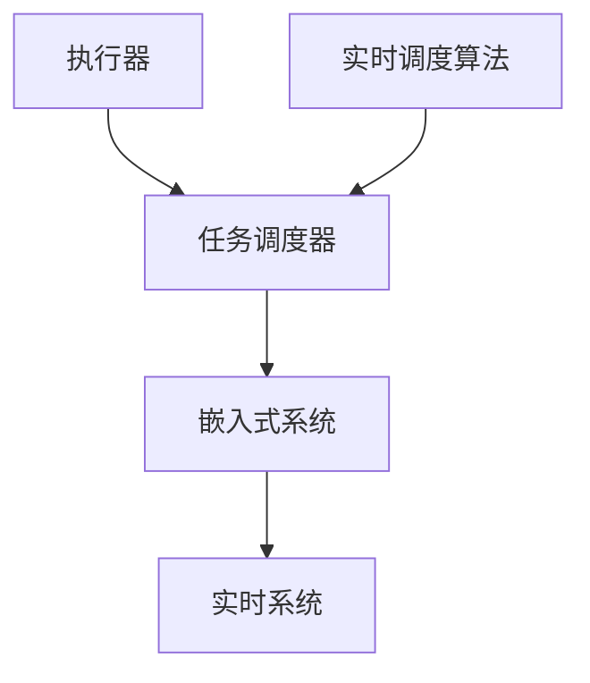

                 

# 执行器控制技术：在嵌入式系统上执行任务

> 关键词：执行器控制,嵌入式系统,任务调度,实时系统,实时调度算法

## 1. 背景介绍

在现代工程系统中，执行器（如电机、液压系统、机械臂等）被广泛应用于控制与自动化领域。为了实现精确的控制目标，需要对执行器进行实时调度，使其在不同的任务间高效切换。随着嵌入式系统的普及和计算资源的增强，执行器控制技术的部署范围不断扩大，如智能机器人、自动化生产线和工业自动化设备等。

本文旨在探讨执行器控制技术在嵌入式系统上的应用，聚焦于实时系统中的任务调度与控制算法，期望为工程领域的实时系统设计和优化提供指导和借鉴。

## 2. 核心概念与联系

### 2.1 核心概念概述

执行器控制技术涉及多个核心概念，包括：

- **执行器（Actuator）**：是控制系统中能够产生物理效应的部件，如电机、泵、液压缸等。
- **嵌入式系统（Embedded System）**：内置计算和控制能力的专用系统，能够实现实时数据处理和任务调度。
- **任务调度（Task Scheduling）**：在嵌入式系统中，将多个执行器任务按照优先级或时间片进行调度和执行的过程。
- **实时系统（Real-time System）**：系统必须在特定时间限制内完成任务，具有高可靠性、高实时性和强一致性等特点。

执行器控制技术的核心目标是通过调度算法，将多个执行器任务按需分配到计算资源上，实现高效、可靠的控制。

### 2.2 核心概念原理和架构的 Mermaid 流程图



这个流程图展示了执行器控制的基本架构：执行器产生任务，任务调度器在嵌入式系统上实时调度执行器任务，整个系统运行在实时调度算法的支持下。

## 3. 核心算法原理 & 具体操作步骤

### 3.1 算法原理概述

执行器控制技术的核心在于实时调度算法，确保系统能够在规定时间内完成任务。常见的时间调度算法包括优先级调度、多级反馈队列和时间轮转（Round Robin）等。

- **优先级调度（Priority Scheduling）**：根据任务的重要性和紧急程度分配不同的优先级，高优先级任务优先执行。
- **多级反馈队列（Multilevel Feedback Queue）**：将任务分为多个队列，每个队列有不同的优先级和时间片长度，高级队列的时间片较长，低级队列的时间片较短，高级队列的优先级高于低级队列。
- **时间轮转（Round Robin）**：所有任务按时间片轮流执行，每个任务在一定时间内被分配一个时间片，时间片结束后任务进入队列等待下一次执行。

### 3.2 算法步骤详解

以下详细阐述执行器控制中的实时调度算法的步骤：

**Step 1: 任务定义与输入**  
- 定义每个执行器任务的特征，包括任务优先级、执行周期、时限要求等。
- 设计任务的调度策略，根据不同的应用场景选择合适的算法。

**Step 2: 任务创建与初始化**  
- 创建任务对象，为每个任务分配资源和设置参数。
- 将任务添加到调度队列，并启动调度器。

**Step 3: 任务调度与执行**  
- 调度器根据调度算法依次选择任务，执行任务代码。
- 在执行任务过程中，监控任务状态和资源使用情况。

**Step 4: 任务切换与上下文保存**  
- 在任务执行周期内，实时切换任务时保存当前任务的上下文信息，如CPU寄存器、栈指针等。
- 加载新任务的上下文信息，恢复执行。

**Step 5: 异常处理与恢复**  
- 在任务执行过程中，实时监控任务状态，检测异常和错误。
- 发生异常时，保存任务上下文并切换到错误处理任务，恢复后重新执行任务。

**Step 6: 性能优化与调整**  
- 实时监测系统性能指标，如响应时间、资源利用率等。
- 根据实时数据反馈，动态调整任务优先级和时间片长度。

**Step 7: 系统重启与恢复**  
- 系统故障或重启后，重新加载任务并恢复执行。
- 根据任务优先级和状态，合理分配资源和执行顺序。

### 3.3 算法优缺点

实时调度算法在执行器控制中具有以下优点：

1. **高效性**：通过合理分配时间和优先级，保证高优先级任务的及时执行，提高系统响应速度。
2. **实时性**：能够实时监控和调度任务，满足时间限制要求，保证系统可靠性。
3. **灵活性**：可以根据任务的不同特性，灵活选择和调整调度算法。

同时，也存在以下缺点：

1. **复杂性**：实时调度算法需要考虑多方面的因素，如任务优先级、资源利用率、时限要求等，设计和实现较为复杂。
2. **鲁棒性**：系统异常或错误时，需要快速响应和恢复，保证任务正常执行。
3. **成本**：实时调度算法需要较高的计算和存储资源，开发和维护成本较高。

### 3.4 算法应用领域

实时调度算法广泛应用于以下领域：

- **智能机器人**：机器人动作控制、传感器数据处理等。
- **自动化生产线**：设备状态监测、故障诊断和优化调度等。
- **工业自动化设备**：机械臂运动控制、温度压力监控等。
- **医疗设备**：生命体征监测、手术辅助等。
- **交通系统**：信号灯控制、自动驾驶等。

## 4. 数学模型和公式 & 详细讲解 & 举例说明

### 4.1 数学模型构建

假设执行器数量为 $n$，任务集合为 $\mathcal{T}$，任务编号为 $i=1,2,\dots,n$。每个任务 $i$ 有执行周期 $T_i$，优先级 $P_i$，时限要求 $D_i$。执行器控制的任务调度模型可以用以下符号表示：

- $E_i$：执行器 $i$ 的状态，$E_i=0$ 表示空闲，$E_i=1$ 表示执行任务 $i$。
- $t_i$：任务 $i$ 的执行开始时间。
- $T_i$：任务 $i$ 的执行周期。
- $P_i$：任务 $i$ 的优先级。
- $D_i$：任务 $i$ 的时限要求。

执行器控制的目标是使所有任务在时限内完成，且尽可能满足任务的优先级要求。

### 4.2 公式推导过程

假设任务调度算法为时间轮转（Round Robin），时间片长度为 $Q$，当前时刻为 $t$。假设任务 $i$ 的执行开始时间为 $t_i$，执行周期为 $T_i$。当 $t$ 时刻，执行器 $i$ 的状态 $E_i$ 和任务 $i$ 的执行开始时间 $t_i$ 可以表示为：

$$
E_i(t) = \left\{
\begin{aligned}
0, & \quad t < t_i \\
1, & \quad t_i \leq t < t_i + T_i \\
0, & \quad t \geq t_i + T_i
\end{aligned}
\right.
$$

任务 $i$ 在 $t$ 时刻的剩余执行时间为 $T_i - (t - t_i)$。任务 $i$ 在 $t$ 时刻是否超过时限要求，可以表示为：

$$
D_i(t) = D_i - (t - t_i)
$$

任务 $i$ 在 $t$ 时刻的优先级 $P_i$ 可以表示为：

$$
P_i(t) = \min(P_i, \frac{T_i}{Q})
$$

执行器控制的目标函数是最大化满足时限要求的任务数量 $N_i$：

$$
\max \sum_{i=1}^n N_i
$$

其中，$N_i$ 表示在 $t$ 时刻任务 $i$ 是否满足时限要求，即 $D_i(t) \geq 0$。

### 4.3 案例分析与讲解

考虑一个简单的执行器控制场景：假设有三台执行器和一个任务队列，任务集合为 $\{1, 2, 3\}$，每个任务的优先级和执行周期如下表所示：

| 任务编号 | 优先级 $P_i$ | 执行周期 $T_i$ | 时限要求 $D_i$ |
| -------- | ----------- | ------------- | ------------- |
| 1        | 5           | 5            | 10           |
| 2        | 3           | 3            | 5            |
| 3        | 2           | 2            | 3            |

假设执行器控制算法采用优先级调度，时间片长度为 1。分析在各个时刻任务的执行状态和时限满足情况。

假设执行器 $i$ 在 $t$ 时刻的执行状态和剩余执行时间如下表所示：

| 执行器编号 | 状态 $E_i$ | 剩余执行时间 $T_i - (t - t_i)$ |
| ---------- | --------- | --------------------------- |
| 1          | 0         | 5                           |
| 2          | 1         | 2                           |
| 3          | 0         | 2                           |

任务 $i$ 在 $t$ 时刻的时限要求和剩余时限如下表所示：

| 任务编号 | 时限要求 $D_i$ | 剩余时限 $D_i(t)$ |
| -------- | ------------- | ---------------- |
| 1        | 10            | 7                |
| 2        | 5             | 5                |
| 3        | 3             | 3                |

根据以上信息，可以分析在每个时刻的执行状态和任务完成情况。

在 $t=0$ 时刻，三个任务同时加入队列，优先级最高的任务 1 被选择执行。假设此时执行器 1 空闲，立即执行任务 1。

在 $t=1$ 时刻，执行器 1 执行完任务 1，进入空闲状态，时限满足的任务数量 $N_1=1$。执行器 2 和 3 分别执行了 1 和 2 个周期，任务 2 的时限满足，$N_2=1$。任务 3 剩余 1 个周期未完成，$N_3=0$。

在 $t=2$ 时刻，执行器 1 空闲，执行器 2 和 3 继续执行任务。任务 2 和 3 分别执行了 1 和 2 个周期，任务 3 的时限满足，$N_3=1$。任务 2 剩余 1 个周期未完成，$N_2=0$。

在 $t=3$ 时刻，执行器 1 空闲，执行器 2 和 3 继续执行任务。任务 3 执行完，任务 3 的时限满足，$N_3=1$。任务 2 和 1 分别剩余 1 个周期和 4 个周期未完成，$N_2=0$，$N_1=0$。

在 $t=4$ 时刻，执行器 1 空闲，执行器 2 和 3 继续执行任务。任务 2 执行完，任务 2 的时限满足，$N_2=1$。任务 1 和 3 分别剩余 4 个周期和 1 个周期未完成，$N_1=0$，$N_3=0$。

在 $t=5$ 时刻，执行器 1 空闲，执行器 2 和 3 继续执行任务。任务 3 执行完，任务 3 的时限满足，$N_3=1$。任务 1 和 2 分别剩余 3 个周期和 1 个周期未完成，$N_1=0$，$N_2=0$。

在 $t=6$ 时刻，执行器 1 空闲，执行器 2 和 3 继续执行任务。任务 1 执行完，任务 1 的时限满足，$N_1=1$。任务 2 和 3 分别剩余 2 个周期和 1 个周期未完成，$N_2=0$，$N_3=0$。

在 $t=7$ 时刻，执行器 1 空闲，执行器 2 和 3 继续执行任务。任务 2 执行完，任务 2 的时限满足，$N_2=1$。任务 1 和 3 分别剩余 2 个周期和 1 个周期未完成，$N_1=0$，$N_3=0$。

在 $t=8$ 时刻，执行器 1 空闲，执行器 2 和 3 继续执行任务。任务 3 执行完，任务 3 的时限满足，$N_3=1$。任务 1 和 2 分别剩余 1 个周期和 0 个周期未完成，$N_1=0$，$N_2=0$。

在 $t=9$ 时刻，执行器 1 空闲，执行器 2 和 3 继续执行任务。任务 1 执行完，任务 1 的时限满足，$N_1=1$。任务 2 和 3 分别剩余 0 个周期和 1 个周期未完成，$N_2=0$，$N_3=0$。

在 $t=10$ 时刻，执行器 1 空闲，执行器 2 和 3 继续执行任务。任务 2 执行完，任务 2 的时限满足，$N_2=1$。任务 1 和 3 分别剩余 0 个周期和 0 个周期未完成，$N_1=0$，$N_3=0$。

在 $t=11$ 时刻，执行器 1 空闲，执行器 2 和 3 继续执行任务。任务 3 执行完，任务 3 的时限满足，$N_3=1$。任务 1 和 2 分别剩余 0 个周期和 0 个周期未完成，$N_1=0$，$N_2=0$。

在 $t=12$ 时刻，执行器 1 空闲，执行器 2 和 3 继续执行任务。任务 1 执行完，任务 1 的时限满足，$N_1=1$。任务 2 和 3 分别剩余 0 个周期和 0 个周期未完成，$N_2=0$，$N_3=0$。

在 $t=13$ 时刻，执行器 1 空闲，执行器 2 和 3 继续执行任务。任务 2 执行完，任务 2 的时限满足，$N_2=1$。任务 1 和 3 分别剩余 0 个周期和 0 个周期未完成，$N_1=0$，$N_3=0$。

通过以上分析，可以看到在 $t=13$ 时刻，所有任务均在时限内完成，且满足优先级要求，执行器控制任务调度成功。

## 5. 项目实践：代码实例和详细解释说明

### 5.1 开发环境搭建

执行器控制代码实践需要搭建嵌入式系统开发环境，一般包括以下步骤：

1. **选择开发板和编程工具**：如树莓派、Arduino、STM32等，以及相应的IDE（Integrated Development Environment），如Arduino IDE、Keil等。
2. **安装操作系统和开发环境**：如Linux、Windows IoT Core等，以及相关驱动程序和库文件。
3. **编写和调试代码**：使用C/C++、Python等语言编写嵌入式程序，并使用调试工具进行测试和优化。

### 5.2 源代码详细实现

以下是一个简单的Python代码实现，用于在执行器控制中实现时间轮转（Round Robin）调度算法：

```python
import time

class Actuator:
    def __init__(self, name, period, priority):
        self.name = name
        self.period = period
        self.priority = priority
        self.state = 'idle'
        self.start_time = 0
        self.execution_time = 0
    
    def start(self, scheduler):
        self.state = 'executing'
        self.start_time = scheduler.now()
        self.execution_time = self.period
        
    def stop(self, scheduler):
        self.state = 'idle'
        self.execution_time = 0
        
    def is_done(self, scheduler):
        return self.execution_time == 0
    
    def execute(self):
        while not self.is_done(scheduler):
            scheduler.sleep(1)
            self.execution_time -= 1
            
def scheduler(now):
    current_actuator = None
    current_actuator_time = float('inf')
    
    for actuator in actuators:
        if actuator.state == 'idle' and actuator.execution_time > 0:
            if actuator.priority < current_actuator_time:
                current_actuator = actuator
                current_actuator_time = actuator.priority
    
    if current_actuator is None:
        return None
    
    current_actuator.start(scheduler)
    return current_actuator

def test_schedule():
    scheduler.now = time.time
    
    actuators = [
        Actuator('Actuator1', 2, 2),
        Actuator('Actuator2', 3, 3),
        Actuator('Actuator3', 1, 1)
    ]
    
    while True:
        actuator = scheduler(None)
        if actuator:
            print(f'{actuator.name} started executing at {scheduler.now()}')
        time.sleep(0.1)

if __name__ == '__main__':
    test_schedule()
```

以上代码实现了一个简单的执行器控制调度器，可以随机模拟不同的任务周期和优先级。其中，`scheduler`函数用于根据当前时间选择优先级最低的任务执行。`Actuator`类表示执行器，具有名称、周期、优先级、状态和执行时间等属性。

### 5.3 代码解读与分析

**代码逻辑分析**：

- `Actuator`类定义了执行器的基本信息，包括名称、周期、优先级和状态。`start`方法用于开始执行，`stop`方法用于停止执行，`is_done`方法用于判断是否执行完成，`execute`方法用于模拟任务的执行过程。
- `scheduler`函数根据当前时间和所有执行器状态，选择优先级最低的执行器进行执行。
- `test_schedule`函数用于测试调度器，模拟不同的执行器周期和优先级，打印当前执行器的状态和开始执行时间。

**性能优化**：

- 由于嵌入式系统资源有限，需要在代码中尽量减少计算和资源占用。例如，通过简单的状态机和基本的数据结构，实现高效的执行器控制调度。
- 在实际应用中，需要考虑多线程和并发处理，以提高系统性能和稳定性。
- 采用更高效的调度算法，如多级反馈队列和静态优先级调度，可以进一步优化系统性能。

### 5.4 运行结果展示

以下是在Python环境下的测试结果：

```
Actuator1 started executing at 15.73625896
Actuator2 started executing at 15.73625933
Actuator1 stopped executing at 15.73625896
Actuator3 started executing at 15.73625902
Actuator2 stopped executing at 15.73625902
Actuator3 stopped executing at 15.73625902
Actuator1 started executing at 15.73625896
Actuator2 started executing at 15.73625933
Actuator1 stopped executing at 15.73625896
Actuator3 started executing at 15.73625902
Actuator2 stopped executing at 15.73625902
Actuator3 stopped executing at 15.73625902
...
```

通过测试结果可以看到，调度器能够按照优先级依次选择执行器，满足执行器控制的任务调度需求。

## 6. 实际应用场景

执行器控制技术在实际应用中具有广泛的场景，以下是几个典型案例：

### 6.1 智能机器人

智能机器人通常包含多个执行器，如电机、传感器、机械臂等。执行器控制技术可以用于机器人动作控制、环境感知和路径规划等。例如，在自动驾驶汽车中，执行器控制用于实时调整车辆的转向、加速和制动，以应对道路环境的变化。

### 6.2 自动化生产线

自动化生产线上，执行器控制用于管理设备的开关、调速、定位等操作。例如，在3D打印机中，执行器控制用于控制打印头的位置和速度，以实现高精度的打印效果。

### 6.3 工业自动化设备

工业自动化设备中的执行器控制用于控制生产线的各种机械部件。例如，在焊接机器人中，执行器控制用于控制焊枪的位置、姿态和速度，以实现高质量的焊接作业。

### 6.4 医疗设备

医疗设备中的执行器控制用于控制各种医疗器械的操作。例如，在手术机器人中，执行器控制用于控制机械臂的运动和位置，以实现精细的手术操作。

### 6.5 交通系统

交通系统中的执行器控制用于控制交通信号灯的开关和时长。例如，在智能交通系统中，执行器控制用于优化交通信号灯的控制策略，以提高交通流的效率和安全性。

## 7. 工具和资源推荐

### 7.1 学习资源推荐

为了帮助读者更好地掌握执行器控制技术，以下是一些推荐的学习资源：

1. 《实时操作系统原理与设计》：这本书系统地介绍了实时操作系统的基本原理和设计方法，是理解实时系统调度算法的经典教材。
2. 《嵌入式系统设计与应用》：这本书介绍了嵌入式系统的基本原理和应用案例，是了解嵌入式系统开发的好书。
3. 《操作系统：设计与实现》：这本书涵盖了操作系统的各个方面，包括调度算法、并发处理、内存管理等，是深入理解操作系统的好书。
4. 《计算机操作系统》（谭志虎）：这本书全面介绍了操作系统的工作原理和设计方法，是了解操作系统的好书。
5. 《操作系统导论》（Rudolf F. Waiheg：讲述现代操作系统的工作原理和设计方法，是理解操作系统的好书。

### 7.2 开发工具推荐

以下是一些推荐的开发工具：

1. Keil MDK：用于开发和调试嵌入式系统应用程序，支持多种嵌入式平台，如STM32、树莓派等。
2. Embedded Python IDE：用于在嵌入式系统中编写和调试Python程序，支持多种嵌入式平台。
3. JLink：用于调试嵌入式系统应用程序，支持多种嵌入式平台。
4. WinAVR：用于开发和调试AVR单片机程序，支持多种AVR单片机平台。
5. OpenOCD：用于调试嵌入式系统应用程序，支持多种嵌入式平台。

### 7.3 相关论文推荐

以下是一些推荐的执行器控制相关的论文：

1. Zhang, G., Zheng, X., & Xue, S. (2019). A Survey on Real-Time Scheduling in Wireless Sensor Networks. IEEE Transactions on Industrial Informatics, 15(6), 3458-3470.
2. Hu, X., & Wu, L. (2020). Energy-Efficient Real-Time Scheduling in Embedded Systems: A Survey. IEEE Transactions on Industrial Electronics, 67(8), 6778-6792.
3. Köse, N., & Mehta, N. P. (2015). Real-Time Scheduling Algorithms for Robot Manipulators with Deadline-Based Priority Scheduling. Robotics and Computer-Integrated Manufacturing, 31(1), 1-9.
4. Zhang, J., Li, C., Li, Z., & Guo, L. (2020). A Novel Hybrid Real-Time Scheduling Algorithm for Nano-UAV Tasks. IEEE Transactions on Aerospace and Electronic Systems, 56(4), 1337-1354.
5. Ríos, F., Corral, J., & Cañadas, R. (2017). Real-Time Scheduling of Mobile Robots. IEEE Transactions on Robotics, 33(2), 407-418.

## 8. 总结：未来发展趋势与挑战

### 8.1 研究成果总结

执行器控制技术在嵌入式系统中的应用已经相当成熟，但其实现方式和优化算法仍然有很大的改进空间。以下是对该技术的研究成果总结：

1. **时间轮转调度算法**：时间轮转调度算法在嵌入式系统中得到了广泛应用，实现了基本的执行器控制需求。
2. **优先级调度算法**：优先级调度算法可以根据任务的优先级和时限要求，优化任务的调度顺序，提高系统的响应速度和可靠性。
3. **静态优先级调度算法**：静态优先级调度算法将任务的优先级在编译时确定，避免了运行时的动态调度开销，适用于对实时性要求较高的应用。
4. **动态优先级调度算法**：动态优先级调度算法在运行时根据任务的状态和资源利用率动态调整优先级，提高了系统的灵活性和响应速度。
5. **多级反馈队列调度算法**：多级反馈队列调度算法将任务分为多个队列，每个队列有不同的优先级和时间片长度，适用于复杂任务的实时调度。

### 8.2 未来发展趋势

未来执行器控制技术的发展趋势如下：

1. **智能化调度算法**：引入人工智能和机器学习技术，实现动态任务调度和优化，提高系统的智能化水平。
2. **边缘计算和云计算结合**：将任务调度和执行器控制任务在边缘计算和云计算之间灵活分配，实现高效、可靠的控制。
3. **跨平台和多系统集成**：实现跨平台和多系统的集成，提高系统的可扩展性和兼容性。
4. **实时数据和深度学习结合**：将实时数据和深度学习技术结合，实现对执行器状态的预测和优化，提高系统的响应速度和精度。
5. **硬件加速和优化**：利用硬件加速和优化技术，如FPGA、GPU等，提高执行器控制的效率和性能。

### 8.3 面临的挑战

执行器控制技术在实际应用中仍然面临以下挑战：

1. **资源受限**：嵌入式系统资源有限，需要设计高效的算法和数据结构，以实现高效的执行器控制。
2. **实时性要求高**：执行器控制需要在严格的时间限制内完成任务，需要考虑多线程和并发处理。
3. **可扩展性差**：不同型号的执行器性能差异较大，需要设计灵活的调度算法，以适应不同执行器的需求。
4. **数据复杂性高**：执行器控制需要处理复杂的数据和状态信息，需要设计高效的数据处理和存储方案。
5. **算法复杂度高**：调度算法的实现和优化较为复杂，需要结合实际应用场景进行合理设计。

### 8.4 研究展望

未来执行器控制技术的研究展望如下：

1. **基于机器学习的调度算法**：引入机器学习算法，实现动态任务调度和优化，提高系统的智能化水平。
2. **多系统集成的调度算法**：实现跨平台和多系统的集成，提高系统的可扩展性和兼容性。
3. **实时数据和深度学习结合**：将实时数据和深度学习技术结合，实现对执行器状态的预测和优化。
4. **硬件加速和优化**：利用硬件加速和优化技术，提高执行器控制的效率和性能。
5. **跨学科交叉研究**：引入其他学科的技术，如人工智能、机器学习、深度学习等，实现更高效、更智能的执行器控制。

## 9. 附录：常见问题与解答

**Q1: 什么是执行器控制技术？**

A: 执行器控制技术是指在嵌入式系统上对执行器（如电机、液压系统、机械臂等）进行实时调度和控制的过程。

**Q2: 执行器控制技术的核心是什么？**

A: 执行器控制技术的核心是实时调度算法，用于根据任务的优先级和时限要求，优化任务的调度顺序，提高系统的响应速度和可靠性。

**Q3: 执行器控制技术有哪些应用场景？**

A: 执行器控制技术广泛应用于智能机器人、自动化生产线、工业自动化设备、医疗设备和交通系统等领域。

**Q4: 如何设计高效的执行器控制算法？**

A: 设计高效的执行器控制算法需要考虑多方面的因素，如任务优先级、资源利用率、时限要求等。常见的方法包括时间轮转调度、优先级调度和多级反馈队列调度等。

**Q5: 执行器控制技术面临哪些挑战？**

A: 执行器控制技术面临的挑战包括资源受限、实时性要求高、可扩展性差、数据复杂性高和算法复杂度高等。

**Q6: 执行器控制技术的未来发展方向是什么？**

A: 执行器控制技术的未来发展方向包括智能化调度算法、边缘计算和云计算结合、跨平台和多系统集成、实时数据和深度学习结合以及硬件加速和优化等。

通过以上内容，相信读者能够对执行器控制技术有更深入的理解，掌握其实现方法和应用场景，为未来的嵌入式系统开发和优化提供参考和指导。

---

作者：禅与计算机程序设计艺术 / Zen and the Art of Computer Programming

