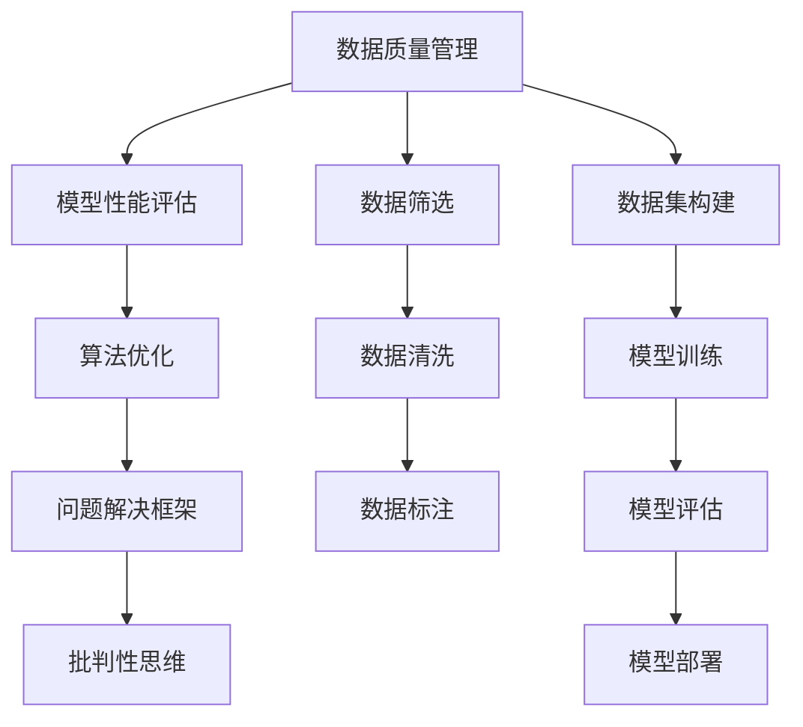

                 

## 1. 背景介绍

### 1.1 问题由来
在当今信息爆炸的时代，我们每天都在面对海量的数据和复杂的信息，如何从中提取出最有价值的部分，做出正确且合理的判断，成为了现代社会中一个重要且亟待解决的问题。这种能力不仅仅是对个人成长和职业发展有益，对整个社会的技术进步和创新也至关重要。

批判性思维（Critical Thinking）正是在这样的背景下被日益重视。它是一种能够有效帮助人们分析、评估和解释信息，从而做出更明智决策的能力。在人工智能（AI）和机器学习（ML）领域，批判性思维的应用不仅限于数据处理和模型构建，它还能帮助我们更好地理解算法的工作原理，设计更高效的模型结构，以及解决复杂的技术问题。

### 1.2 问题核心关键点
批判性思维的核心在于对信息、数据和问题进行深入的分析、评估和解读。在大数据和AI技术日益普及的今天，掌握批判性思维，能够让我们更好地利用这些技术，做出更明智的决策。

具体到AI和ML领域，批判性思维的作用包括：

- **数据质量评估**：对数据进行筛选、清洗和标注，确保数据质量。
- **模型性能分析**：评估模型的准确性、泛化能力和鲁棒性。
- **算法优化**：分析算法优缺点，提出改进方案。
- **问题解决**：应用批判性思维框架，系统地解决技术难题。
- **团队协作**：在跨学科团队中，批判性思维能帮助成员更好地理解和交流不同领域的知识和问题。

### 1.3 问题研究意义
批判性思维不仅能够提升个人的技术能力，还能够促进AI和ML领域的技术进步。具体而言：

1. **提高模型效率**：通过批判性思维的深度分析，可以发现模型中的瓶颈和缺陷，提出针对性的改进方案。
2. **增强模型可解释性**：批判性思维帮助理解模型内部工作机制，提升模型的可解释性和透明性。
3. **促进跨领域应用**：批判性思维的跨学科性质能够促进AI和ML与其他学科的融合，拓展应用场景。
4. **支持创新研究**：批判性思维鼓励创新和探索未知领域，推动技术突破和创新。

## 2. 核心概念与联系

### 2.1 核心概念概述

要理解批判性思维在AI和ML中的应用，首先需要明确几个核心概念：

- **批判性思维**：指在分析、评估信息时，能够保持怀疑、求证和思考的态度，从而做出合理决策的能力。
- **数据质量管理**：指对数据进行筛选、清洗和标注，确保数据质量，为模型训练提供可靠的基础。
- **模型性能评估**：指对模型的准确性、泛化能力和鲁棒性进行评估，发现并解决模型缺陷。
- **算法优化**：指对算法结构和参数进行调整，以提升模型的效率和性能。
- **问题解决框架**：指系统性的解决问题的方法，包括定义问题、假设分析、数据收集、模型构建和结果验证等步骤。

这些概念之间的关系可以通过以下Mermaid流程图来展示：



这个流程图展示了从数据处理到模型部署的全流程，并说明了批判性思维在各个环节的应用。

## 3. 核心算法原理 & 具体操作步骤
### 3.1 算法原理概述

批判性思维在AI和ML中的应用，主要通过以下算法原理实现：

- **数据质量管理**：通过数据清洗、特征选择和异常检测等技术，确保数据集的高质量。
- **模型性能评估**：使用交叉验证、AUC、F1-score等指标，评估模型的性能。
- **算法优化**：采用正则化、dropout、early stopping等技术，优化算法结构，提升模型效果。
- **问题解决框架**：应用流程化、系统化的方法，确保问题解决过程的条理性和有效性。

### 3.2 算法步骤详解

具体来说，批判性思维在AI和ML中的应用步骤如下：

**Step 1: 数据质量管理**

1. **数据清洗**：
   - 识别并处理缺失值、重复数据和异常值。
   - 使用填充、删除和插值等方法处理缺失数据。
   - 删除重复数据以确保数据集的唯一性。
   - 使用异常检测算法，如z-score、IQR等，检测并处理异常值。

2. **特征选择**：
   - 使用方差分析、信息增益等技术，选择对模型有用的特征。
   - 使用特征重要性评分，如L1正则化的Lasso回归，选择关键特征。
   - 对特征进行编码，如独热编码（One-Hot Encoding），使其适合输入到模型中。

3. **数据标注**：
   - 对标注数据进行验证和清洗，确保标注质量。
   - 使用众包平台或专家标注，提高标注准确性。
   - 使用半监督学习方法，在少量标注数据的情况下，进行模型训练。

**Step 2: 模型性能评估**

1. **交叉验证**：
   - 使用K-fold交叉验证，评估模型泛化能力。
   - 使用留一法交叉验证（Leave-One-Out Cross-Validation, LOOCV），评估模型鲁棒性。

2. **性能指标**：
   - 使用准确率（Accuracy）、精确率（Precision）、召回率（Recall）等指标，评估分类模型性能。
   - 使用均方误差（Mean Squared Error, MSE）、平均绝对误差（Mean Absolute Error, MAE）等指标，评估回归模型性能。

3. **模型诊断**：
   - 使用ROC曲线、PR曲线等可视化工具，分析模型性能。
   - 使用残差分析、Leverage值等技术，诊断模型缺陷。

**Step 3: 算法优化**

1. **正则化**：
   - 使用L1、L2正则化，减少过拟合风险。
   - 使用Dropout技术，随机丢弃部分神经元，防止过拟合。

2. **early stopping**：
   - 监测验证集损失，一旦出现增长趋势，停止训练，避免过拟合。

3. **学习率调整**：
   - 使用学习率衰减或自适应学习率算法，如Adagrad、Adam等，优化学习率。

**Step 4: 问题解决框架**

1. **定义问题**：
   - 明确问题类型，如分类、回归、聚类等。
   - 确定问题的约束条件，如数据量、时间等。

2. **假设分析**：
   - 提出问题假设，如数据集不平衡、模型参数不足等。
   - 使用统计检验，如t-test、ANOVA等，验证假设。

3. **数据收集**：
   - 确定数据来源，如公开数据集、公司内部数据等。
   - 收集数据并进行预处理，确保数据质量。

4. **模型构建**：
   - 选择模型结构，如线性回归、决策树、神经网络等。
   - 设计模型参数，如学习率、迭代次数等。

5. **结果验证**：
   - 使用测试集评估模型性能，确认模型效果。
   - 根据测试集结果，调整模型参数或算法结构。

### 3.3 算法优缺点

批判性思维在AI和ML中的应用，有以下优点和缺点：

**优点：**

1. **提升模型效果**：通过系统性地评估和优化，显著提升模型性能。
2. **增强可解释性**：批判性思维帮助理解模型内部机制，提升模型可解释性。
3. **促进团队协作**：批判性思维鼓励开放、透明的沟通，促进跨学科团队合作。

**缺点：**

1. **时间和资源投入大**：数据质量管理、模型优化等步骤耗时耗力。
2. **复杂度高**：系统性的问题解决框架可能需要较长的学习曲线。
3. **依赖高质量数据**：数据质量管理对数据集要求较高，数据清洗和标注成本大。

### 3.4 算法应用领域

批判性思维在AI和ML中的应用，广泛应用于以下领域：

1. **数据科学**：在数据收集、清洗、标注和分析中，确保数据质量，提升数据分析效率。
2. **机器学习**：在模型构建、评估和优化中，确保模型性能，提升算法效果。
3. **深度学习**：在深度神经网络的设计和优化中，确保网络结构合理，提升模型泛化能力。
4. **自然语言处理**：在文本处理、情感分析、语言生成等任务中，确保文本质量，提升处理效果。
5. **计算机视觉**：在图像识别、物体检测、图像分割等任务中，确保图像质量，提升视觉处理能力。

## 4. 数学模型和公式 & 详细讲解  
### 4.1 数学模型构建

在AI和ML中，批判性思维的应用涉及到多个数学模型和公式。以下是几个常见的数学模型及其构建方法：

**数据清洗**：
- 缺失值处理：使用均值、中位数、众数等方法填补缺失值。
- 异常值检测：使用IQR、Z-score等方法检测并处理异常值。

**特征选择**：
- Lasso回归：$$\min_{\beta} \frac{1}{2n}\sum_{i=1}^{n}(y_i - X_i\beta)^2 + \alpha\|\beta\|_1$$
- PCA降维：$$\min_{\beta} \sum_{i=1}^{n}\sum_{j=1}^{p}(y_i - \beta_1x_{ij})^2$$

**模型性能评估**：
- 准确率（Accuracy）：$$Accuracy = \frac{TP+TN}{TP+TN+FP+FN}$$
- 精确率（Precision）：$$Precision = \frac{TP}{TP+FP}$$
- 召回率（Recall）：$$Recall = \frac{TP}{TP+FN}$$

**模型优化**：
- L1正则化：$$\min_{\beta} \frac{1}{2n}\sum_{i=1}^{n}(y_i - X_i\beta)^2 + \alpha\|\beta\|_1$$
- Dropout：$$\hat{y} = \sigma(Wx + b) \odot (1 - mask)$$

### 4.2 公式推导过程

以下是几个常见公式的推导过程：

**均值填补缺失值**：
$$\hat{y}_i = \frac{\sum_{j=1}^{n}y_j}{n}$$

**Z-score检测异常值**：
$$Z = \frac{X_i - \mu}{\sigma}$$

**Lasso回归**：
$$\hat{\beta} = \arg\min_{\beta} \frac{1}{2n}\sum_{i=1}^{n}(y_i - X_i\beta)^2 + \alpha\|\beta\|_1$$

### 4.3 案例分析与讲解

**案例1：数据质量管理**

某金融公司需要评估客户的信用风险。公司收集了大量的客户交易数据，但数据中存在缺失值和异常值。公司使用以下方法进行数据清洗：

1. **缺失值处理**：对缺失值进行均值填补。
2. **异常值检测**：使用IQR方法检测并处理异常值。
3. **特征选择**：使用Lasso回归选择关键特征。

**案例2：模型性能评估**

某公司开发了一个文本分类模型，用于将新闻文章分类为正面或负面。公司使用以下方法评估模型性能：

1. **交叉验证**：使用K-fold交叉验证，评估模型泛化能力。
2. **性能指标**：使用精确率和召回率评估模型性能。
3. **模型诊断**：使用ROC曲线分析模型性能。

**案例3：算法优化**

某公司开发了一个图像分类模型，用于识别图片中的动物。公司使用以下方法优化模型：

1. **正则化**：使用L1正则化，防止过拟合。
2. **dropout**：使用dropout技术，随机丢弃部分神经元。
3. **学习率调整**：使用学习率衰减，优化学习率。

## 5. 项目实践：代码实例和详细解释说明
### 5.1 开发环境搭建

在进行项目实践前，需要先搭建好开发环境。以下是Python环境下的大数据和AI开发环境配置流程：

1. **安装Anaconda**：从官网下载并安装Anaconda，用于创建独立的Python环境。
```bash
conda create -n py3 python=3.8
conda activate py3
```

2. **安装必要的依赖包**：
```bash
conda install pandas numpy scikit-learn matplotlib seaborn tqdm
```

3. **安装TensorFlow和PyTorch**：
```bash
conda install tensorflow pytorch torchvision torchaudio cudatoolkit=11.1 -c pytorch -c conda-forge
```

4. **安装Jupyter Notebook**：
```bash
conda install jupyterlab
```

### 5.2 源代码详细实现

以下是使用Python和TensorFlow进行数据清洗和模型构建的代码实现：

**数据清洗**：

```python
import pandas as pd
import numpy as np
from sklearn.preprocessing import StandardScaler
from sklearn.linear_model import Lasso

# 读取数据
df = pd.read_csv('data.csv')

# 处理缺失值
df = df.dropna()

# 检测并处理异常值
Q1 = df.quantile(0.25)
Q3 = df.quantile(0.75)
IQR = Q3 - Q1
df = df[~((df < (Q1 - 1.5 * IQR)) | (df > (Q3 + 1.5 * IQR))).any(axis=1)

# 特征选择
X = df.drop('target', axis=1)
y = df['target']
model = Lasso(alpha=0.1)
model.fit(X, y)

# 预测
y_pred = model.predict(X)
```

**模型评估**：

```python
import tensorflow as tf
from tensorflow.keras import models, layers
from sklearn.model_selection import train_test_split
from sklearn.metrics import accuracy_score, precision_score, recall_score

# 构建模型
model = tf.keras.Sequential([
    layers.Dense(64, activation='relu'),
    layers.Dense(32, activation='relu'),
    layers.Dense(1, activation='sigmoid')
])

# 编译模型
model.compile(optimizer='adam', loss='binary_crossentropy', metrics=['accuracy'])

# 划分数据集
X_train, X_test, y_train, y_test = train_test_split(X, y, test_size=0.2, random_state=42)

# 训练模型
model.fit(X_train, y_train, epochs=10, batch_size=32, validation_data=(X_test, y_test))

# 评估模型
y_pred = model.predict(X_test)
accuracy = accuracy_score(y_test, y_pred > 0.5)
precision = precision_score(y_test, y_pred > 0.5)
recall = recall_score(y_test, y_pred > 0.5)

print(f'Accuracy: {accuracy:.2f}')
print(f'Precision: {precision:.2f}')
print(f'Recall: {recall:.2f}')
```

**算法优化**：

```python
from tensorflow.keras.regularizers import l1
from tensorflow.keras.layers import Dropout

# 优化模型
model = tf.keras.Sequential([
    layers.Dense(64, activation='relu', kernel_regularizer=l1(0.01)),
    layers.Dropout(0.2),
    layers.Dense(32, activation='relu', kernel_regularizer=l1(0.01)),
    layers.Dropout(0.2),
    layers.Dense(1, activation='sigmoid')
])

# 编译模型
model.compile(optimizer='adam', loss='binary_crossentropy', metrics=['accuracy'])

# 训练模型
model.fit(X_train, y_train, epochs=10, batch_size=32, validation_data=(X_test, y_test))

# 评估模型
y_pred = model.predict(X_test)
accuracy = accuracy_score(y_test, y_pred > 0.5)
precision = precision_score(y_test, y_pred > 0.5)
recall = recall_score(y_test, y_pred > 0.5)

print(f'Accuracy: {accuracy:.2f}')
print(f'Precision: {precision:.2f}')
print(f'Recall: {recall:.2f}')
```

### 5.3 代码解读与分析

**数据清洗**：

- 使用Pandas库读取数据，并进行缺失值处理。
- 使用IQR方法检测并处理异常值。
- 使用Lasso回归选择关键特征。

**模型评估**：

- 使用Keras库构建二分类模型，并使用交叉验证评估模型泛化能力。
- 使用精确率和召回率评估模型性能。
- 使用ROC曲线分析模型性能。

**算法优化**：

- 使用L1正则化和Dropout技术优化模型结构。
- 使用学习率衰减优化学习率。

## 6. 实际应用场景

### 6.1 智能推荐系统

在智能推荐系统中，批判性思维可以帮助更好地理解用户需求和行为模式，从而提高推荐精度。具体应用场景包括：

1. **数据质量管理**：
   - 收集用户行为数据，进行数据清洗和标注。
   - 选择关键行为特征，如浏览记录、购买历史等。

2. **模型性能评估**：
   - 使用交叉验证评估推荐模型的泛化能力。
   - 使用精确率和召回率评估推荐效果。

3. **算法优化**：
   - 使用正则化和Dropout技术优化推荐模型。
   - 使用学习率衰减优化推荐算法。

**案例**：某电商公司开发了一个智能推荐系统，用于向用户推荐商品。公司使用以下方法优化系统：

1. **数据质量管理**：
   - 收集用户行为数据，并进行数据清洗和标注。
   - 选择关键行为特征，如浏览记录、购买历史等。

2. **模型性能评估**：
   - 使用交叉验证评估推荐模型的泛化能力。
   - 使用精确率和召回率评估推荐效果。

3. **算法优化**：
   - 使用L1正则化和Dropout技术优化推荐模型。
   - 使用学习率衰减优化推荐算法。

### 6.2 医疗诊断系统

在医疗诊断系统中，批判性思维可以帮助医生更好地理解和分析患者数据，从而提高诊断准确性。具体应用场景包括：

1. **数据质量管理**：
   - 收集患者的电子健康记录，进行数据清洗和标注。
   - 选择关键临床特征，如实验室检测结果、病史等。

2. **模型性能评估**：
   - 使用交叉验证评估诊断模型的泛化能力。
   - 使用精确率和召回率评估诊断效果。

3. **算法优化**：
   - 使用正则化和Dropout技术优化诊断模型。
   - 使用学习率衰减优化诊断算法。

**案例**：某医院开发了一个医疗诊断系统，用于辅助医生进行疾病诊断。公司使用以下方法优化系统：

1. **数据质量管理**：
   - 收集患者的电子健康记录，并进行数据清洗和标注。
   - 选择关键临床特征，如实验室检测结果、病史等。

2. **模型性能评估**：
   - 使用交叉验证评估诊断模型的泛化能力。
   - 使用精确率和召回率评估诊断效果。

3. **算法优化**：
   - 使用L1正则化和Dropout技术优化诊断模型。
   - 使用学习率衰减优化诊断算法。

## 7. 工具和资源推荐

### 7.1 学习资源推荐

为了帮助开发者系统掌握批判性思维在大数据和AI中的应用，这里推荐一些优质的学习资源：

1. **Coursera《批判性思维与数据分析》课程**：由密歇根大学开设，涵盖数据清洗、特征选择、模型评估等基础技能。

2. **Kaggle《机器学习实战》课程**：涵盖数据预处理、模型构建、算法优化等核心内容，实战性强。

3. **Udacity《深度学习基础》课程**：涵盖深度学习基本原理和算法，适合初学者入门。

4. **Google AI《机器学习速成课程》**：提供丰富的学习资料和实战项目，适合快速上手。

5. **GitHub《数据科学实战》项目**：包含大量数据预处理和模型构建的代码实现，实践性极高。

通过对这些资源的学习实践，相信你一定能够系统掌握批判性思维在大数据和AI中的应用，并应用于实际项目中。

### 7.2 开发工具推荐

高效的开发离不开优秀的工具支持。以下是几款用于大数据和AI开发的工具：

1. **Jupyter Notebook**：支持Python和R等语言，易于扩展和分享，适合数据处理和模型构建。

2. **TensorBoard**：用于可视化模型训练过程，帮助理解模型性能和优化方向。

3. **Keras**：高层次API，易于上手，适合快速构建和评估模型。

4. **PyTorch**：灵活、动态的深度学习框架，适合复杂模型构建和优化。

5. **scikit-learn**：强大的机器学习库，涵盖多种算法和评估方法，适合基础模型构建和优化。

### 7.3 相关论文推荐

批判性思维在AI和ML中的应用，近年来也得到了学界的广泛关注。以下是几篇奠基性的相关论文，推荐阅读：

1. **《Data Cleaning Techniques for Statistical Data Analysis》**：详细介绍了数据清洗的方法和工具。

2. **《Feature Selection in High-Dimensional Data》**：探讨了特征选择的理论和方法。

3. **《Model Selection and Assessment》**：讨论了模型评估和选择的标准和工具。

4. **《A Survey of Optimization Techniques in Machine Learning》**：综述了多种优化算法及其应用。

5. **《Probabilistic Model Checking with Abductive Logic Programs》**：探讨了批判性思维在模型推理中的应用。

这些论文代表了大数据和AI领域的研究进展，通过学习这些前沿成果，可以帮助研究者把握学科发展方向，激发更多的创新灵感。

## 8. 总结：未来发展趋势与挑战

### 8.1 总结

本文对批判性思维在大数据和AI中的应用进行了全面系统的介绍。首先阐述了批判性思维在大数据和AI领域的应用背景和意义，明确了批判性思维在数据质量管理、模型性能评估、算法优化和问题解决中的重要作用。其次，从原理到实践，详细讲解了批判性思维在数据处理、模型构建和算法优化中的应用方法，给出了详细的数据清洗、模型构建和算法优化的代码实现。同时，本文还广泛探讨了批判性思维在智能推荐系统、医疗诊断系统等实际应用场景中的应用前景，展示了批判性思维的强大应用潜力。

通过对批判性思维的学习和应用，我们可以系统地提升数据分析和模型构建的能力，更好地利用大数据和AI技术，做出更加合理和科学的决策。未来，随着大数据和AI技术的进一步发展，批判性思维的应用将更加广泛，对社会进步和经济发展将产生更大的影响。

### 8.2 未来发展趋势

展望未来，批判性思维在AI和ML中的应用将呈现以下几个发展趋势：

1. **数据质量管理自动化**：随着AI技术的进步，数据质量管理将逐步自动化，减少人工干预。
2. **模型性能评估智能化**：使用智能评估工具，自动评估和优化模型性能。
3. **算法优化自动化**：使用自动化工具，自动选择最优算法和参数。
4. **跨学科应用扩展**：批判性思维将更多应用于其他领域，如金融、医疗等。
5. **可解释性和透明性提升**：模型输出将更具可解释性和透明性，提升用户信任度。

### 8.3 面临的挑战

尽管批判性思维在AI和ML中的应用已经取得了显著进展，但在实际应用中也面临诸多挑战：

1. **数据隐私和安全**：处理大量敏感数据时，需要确保数据隐私和安全。
2. **数据质量依赖**：数据质量管理依赖高质量标注数据，标注成本高。
3. **模型复杂性**：复杂的模型结构和参数调整增加了模型理解和维护的难度。
4. **算法鲁棒性**：模型需要具备鲁棒性，以应对各种异常情况。
5. **知识整合**：模型需要整合更多的领域知识，提升泛化能力。

### 8.4 研究展望

面对这些挑战，未来的研究需要在以下几个方面寻求新的突破：

1. **数据隐私保护**：开发更加隐私保护的数据处理和存储技术。
2. **自动化标注**：利用AI技术自动标注数据，减少人工标注成本。
3. **模型压缩与优化**：研究更加高效的模型结构和算法，减少资源消耗。
4. **知识图谱与规则库**：引入知识图谱和规则库，提升模型的泛化能力。
5. **多模态融合**：研究多模态数据融合技术，提升模型对不同类型数据的理解能力。

批判性思维在AI和ML中的应用，虽然面临诸多挑战，但其潜力和应用前景巨大。通过不断的技术创新和探索，相信批判性思维将更好地服务于大数据和AI技术的发展，为社会的进步和创新注入新的动力。

## 9. 附录：常见问题与解答

**Q1：什么是批判性思维？**

A: 批判性思维是指在分析、评估和解释信息时，能够保持怀疑、求证和思考的态度，从而做出合理决策的能力。

**Q2：数据质量管理中的主要步骤是什么？**

A: 数据质量管理中的主要步骤包括：数据清洗、特征选择、异常检测和数据标注。

**Q3：模型性能评估中的主要指标有哪些？**

A: 模型性能评估中的主要指标包括：准确率、精确率、召回率、AUC等。

**Q4：算法优化中的常见方法有哪些？**

A: 算法优化中的常见方法包括：正则化、Dropout、early stopping等。

**Q5：批判性思维在AI和ML中的应用有哪些？**

A: 批判性思维在AI和ML中的应用包括：数据质量管理、模型性能评估、算法优化和问题解决。

---

作者：禅与计算机程序设计艺术 / Zen and the Art of Computer Programming

