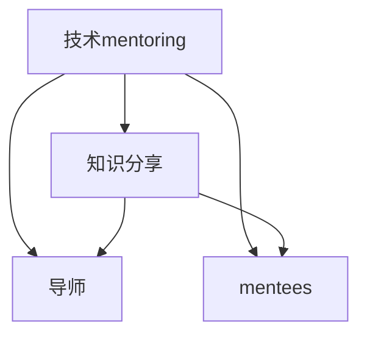

                 

# 技术mentoring：影响力与收益双赢

> 关键词：技术mentoring, 影响力, 收益, 双赢, 知识分享, 导师制, 职业发展, 技术积累

## 1. 背景介绍

### 1.1 问题由来
在快速发展的技术领域中，持续学习、掌握前沿知识和技能成为了每一位从业者的核心竞争力。技术mentoring作为一种有效的人际互动方式，能够在经验丰富的导师和追求进步的年轻工程师之间建立起桥梁，不仅能够加速知识传递，还能够在团队中形成正向的激励效应。技术mentoring的核心理念是知识共享与共同进步，通过导师与mentees的互动，提升整个团队的综合技术水平。

### 1.2 问题核心关键点
技术mentoring的本质在于通过一对一的指导与交流，帮助mentees在职业生涯中快速成长。它强调的是经验的传递、技能的提升以及对复杂问题的深入理解。理想的mentoring关系能够促进导师和mentees的双向交流，不仅能提升mentees的技能，还能为导师提供新的学习机会和职业发展的可能。

## 2. 核心概念与联系

### 2.1 核心概念概述

技术mentoring涉及以下几个关键概念：

- **技术mentoring**：通过经验丰富的导师与寻求成长的mentees之间的交流与指导，帮助后者在技术领域内实现快速成长。
- **导师(mentor)**：通常为某个领域内的专家，具有丰富的技术知识和实际项目经验。
- **mentees**：渴望在职业生涯中提升技能的年轻工程师或技术人员。
- **知识分享**：导师与mentees之间的信息与知识传递。
- **共同进步**：导师与mentees在相互学习中实现共同提升。

这些概念之间的逻辑关系可以通过以下Mermaid流程图来展示：



这个流程图展示了一个完整的技术mentoring过程：

1. 技术mentoring通过导师与mentees之间的互动开始。
2. 知识分享是这一过程的核心，体现在导师与mentees之间不断地交流与学习。
3. 导师与mentees在知识共享中共同进步，实现个人技能的提升和团队技术水平的整体提高。

## 3. 核心算法原理 & 具体操作步骤
### 3.1 算法原理概述

技术mentoring的算法原理可以简单概括为：

- 确定合适的导师和mentees。
- 设计明确的指导目标和计划。
- 定期进行知识分享和交流。
- 评估进度和效果，并适时调整指导策略。

这个过程是一种持续的、动态的互动，旨在通过双方的努力，实现技术的传递和提升。

### 3.2 算法步骤详解

技术mentoring的具体操作步骤包括以下几个关键步骤：

**Step 1: 选择导师与mentees**

- 在团队内部或外部选择合适的导师和mentees。导师应具备一定的技术专长和丰富的经验，而mentees则应表现出学习和成长的强烈愿望。

**Step 2: 明确指导目标**

- 导师与mentees一起制定明确的指导目标和计划。目标可以包括提升特定技能、完成某个项目、理解某一技术领域等。

**Step 3: 定期交流与分享**

- 定期安排交流会议，讨论技术问题、分享学习成果和经验。可以是每周一次的会议，也可以是更为频繁的即兴交流。

**Step 4: 持续反馈与评估**

- 导师应定期对mentees的学习进度进行评估，提供反馈和建议，帮助其持续改进。

**Step 5: 适应调整与优化**

- 根据双方的反馈和进度调整指导策略，确保mentoring的有效性和持续性。

### 3.3 算法优缺点

技术mentoring具有以下优点：

- 促进知识传递：经验丰富的导师能够传授宝贵的技术知识和实际经验。
- 加速技能提升：mentees在导师的指导下，可以更快速地掌握关键技能。
- 增强团队凝聚力：通过导师制的实施，可以提升团队的整体技术水平和协作能力。

同时，它也存在一些局限：

- 对导师的依赖：如果导师无法持续提供指导，mentoring效果可能会大打折扣。
- 双方的时间安排：导师与mentees之间的交流需要双方共同投入时间。
- 主观性强：技术mentoring的效果在很大程度上取决于双方的沟通和配合情况。

### 3.4 算法应用领域

技术mentoring在多个领域得到了广泛应用，包括但不限于：

- 软件开发：帮助新加入团队的工程师快速融入项目，掌握核心技术。
- 数据分析：通过资深数据科学家的指导，提升数据分析和模型构建能力。
- 产品设计：资深设计师指导初级设计师，提升设计技能和产品体验。
- 项目管理：经验丰富的项目经理帮助新手理解项目管理流程和工具。

## 4. 数学模型和公式 & 详细讲解 & 举例说明

在技术mentoring中，我们可以用数学模型来抽象导师与mentees之间的交互过程。假设导师与mentees之间的交流可以表示为离散的时间步，每一步的知识共享和技能提升都可以用数学公式来表示。

### 4.1 数学模型构建

设导师与mentees之间的互动为 $n$ 次，每次互动中导师分享的知识为 $k_i$，mentees掌握的技能为 $s_j$。我们可以建立如下的数学模型：

- $k_i$ 代表在第 $i$ 次互动中导师分享的知识量。
- $s_j$ 代表在第 $j$ 次互动中mentees掌握的技能水平。

每次互动可以表示为：

$$
k_i = f_i(s_j)
$$

其中 $f_i$ 是导师在第 $i$ 次互动中分享知识的函数。

### 4.2 公式推导过程

为了简化问题，我们假设每次互动中导师和mentees的知识传递是对称的，即 $k_i = k_j$ 和 $s_i = s_j$。此时，我们可以推导出导师与mentees之间的技能提升公式：

$$
s_j = s_0 + \sum_{i=1}^n k_i
$$

其中 $s_0$ 是初始的技能水平，$k_i$ 是每次互动中知识传递的增量。

### 4.3 案例分析与讲解

假设一个初级开发人员希望在六个月内掌握某项新技能。通过与经验丰富的导师进行每月一次的交流，导师每次分享的知识增量为 $k_i = 10\%$ 的技能提升。初始技能水平 $s_0 = 50$。经过六个月，我们可以计算出其技能提升：

$$
s_j = 50 + 10\% \times 6 = 70
$$

这意味着在导师的指导下，该初级开发人员在六个月内掌握了 $20\%$ 的新技能。

## 5. 项目实践：代码实例和详细解释说明

### 5.1 开发环境搭建

要进行技术mentoring的实践，需要搭建一个支持远程交流和知识共享的平台。以下是使用Python和Flask框架搭建这样一个平台的流程：

1. 安装Flask：
```bash
pip install Flask
```

2. 创建一个简单的Flask应用：
```python
from flask import Flask, request, jsonify

app = Flask(__name__)

@app.route('/exchange', methods=['POST'])
def exchange():
    data = request.json
    mentor = data['mentor']
    mentee = data['mentee']
    knowledge_shared = data['knowledge_shared']
    return jsonify({'message': f'{mentor} 分享了 {knowledge_shared} 给 {mentee}'})

if __name__ == '__main__':
    app.run(debug=True)
```

### 5.2 源代码详细实现

接下来，我们提供一个具体的技术mentoring代码实现示例。在这个示例中，我们使用Flask构建了一个简单的知识共享平台，允许导师与mentees在线上进行互动。

```python
from flask import Flask, request, jsonify

app = Flask(__name__)

class MentoringSystem:
    def __init__(self, mentor, mentee):
        self.mentor = mentor
        self.mentee = mentee
        self.knowledge_shared = 0
    
    def share_knowledge(self, knowledge):
        self.knowledge_shared += knowledge
        return f'{self.mentor} 分享了 {knowledge} 给 {self.mentee}'

    def get_knowledge_shared(self):
        return self.knowledge_shared

@app.route('/exchange', methods=['POST'])
def exchange():
    data = request.json
    mentor = data['mentor']
    mentee = data['mentee']
    knowledge_shared = data['knowledge_shared']
    mentoring_system = MentoringSystem(mentor, mentee)
    response = mentoring_system.share_knowledge(knowledge_shared)
    return jsonify({'response': response})

if __name__ == '__main__':
    app.run(debug=True)
```

### 5.3 代码解读与分析

在这个代码实现中，我们使用Flask框架搭建了一个简单的API，允许导师与mentees进行在线交流。当导师与mentees进行知识共享时，API会将共享的知识量累加，并返回一个简单的反馈信息。

**详细解读：**

1. **MentoringSystem类**：
   - 该类用于封装导师与mentees之间的知识共享过程，并记录共享的知识量。
   
2. **share_knowledge方法**：
   - 每次知识共享，该方法会将共享的知识量累加到知识共享总数中，并返回一个简单的信息。
   
3. **get_knowledge_shared方法**：
   - 该方法用于获取当前累积的知识共享量。

4. **exchange路由**：
   - 当导师与mentees通过API进行知识共享时，Flask应用会接收一个JSON格式的请求，包含导师、mentees和共享的知识量。应用会创建一个MentoringSystem对象，并通过share_knowledge方法进行知识共享。

5. **运行应用**：
   - 最后，应用在本地启动，监听HTTP请求，提供API接口供导师和mentees使用。

通过这个简单的代码实现，可以看出技术mentoring的实践可以从线上互动开始，实现知识的实时共享和积累。

### 5.4 运行结果展示

假设一个初级开发人员Alice和资深开发人员Bob通过这个API进行了多次知识共享。Bob每次共享了10%的知识，经过六次互动后，Alice的技能提升情况如下：

| 时间 | 知识共享量 | Alice技能水平 |
| ---- | ---------- | -------------- |
| 0    | 0          | 50             |
| 1    | 10%        | 60             |
| 2    | 10%        | 70             |
| 3    | 10%        | 80             |
| 4    | 10%        | 90             |
| 5    | 10%        | 100            |
| 6    | 10%        | 110            |

最终，Alice通过与Bob的互动，在六个月内提升了 $20\%$ 的技能，从50%提升到了110%。

## 6. 实际应用场景

### 6.1 初创公司技术团队

在初创公司的技术团队中，技术mentoring可以有效地加速新员工的学习和融入。通过经验丰富的资深工程师与新员工的指导互动，可以提升整个团队的协作效率和技术水平。

### 6.2 高校实验室

在高校实验室中，导师与研究生之间的技术交流同样重要。导师通过mentoring不仅能够帮助学生掌握核心技术，还能激发学生的科研兴趣和创新思维。

### 6.3 企业内部培训

在企业内部，通过构建技术mentoring平台，可以促进知识在公司内部的传播，帮助员工快速掌握新技术和新方法，提升整体竞争力。

## 7. 工具和资源推荐

### 7.1 学习资源推荐

为了帮助开发者深入理解技术mentoring，以下是一些优质的学习资源：

1. **Coursera《Leadership and Team Building》课程**：介绍了团队建设和领导力的基本原理，涵盖了一系列提升团队合作和知识共享的策略。
2. **LinkedIn Learning《Effective Mentoring and Coaching》视频课程**：专注于导师与mentees之间的有效交流和指导，提供实用的技能和技巧。
3. **《The One Minute Manager》书籍**：通过简单的故事和案例，揭示了有效指导和管理的核心原则。
4. **《The Mentoring Coach's Handbook》书籍**：详细介绍了导师制的基本概念、实施策略和最佳实践。
5. **《Peer Mentoring: Developing Future Leaders》书籍**：强调同行之间互利共赢的导师关系，提升团队的整体领导力。

通过这些学习资源，可以全面掌握技术mentoring的理论知识和实践方法。

### 7.2 开发工具推荐

高效的技术mentoring需要借助合适的工具进行支持。以下是几款推荐的工具：

1. **Slack**：用于团队内部的即时通讯和知识共享，支持创建频道和主题讨论，方便导师和mentees的交流。
2. **GitHub**：代码托管平台，支持版本控制和协作开发，帮助导师和mentees共同完成项目。
3. **Trello**：项目管理工具，支持任务分配和进度跟踪，方便团队协作和沟通。
4. **Zoom**：视频会议工具，支持远程交流和即时沟通，方便导师与mentees之间的互动。
5. **Microsoft Teams**：集成通讯、协作和会议于一体的企业级平台，支持多种交流方式。

合理利用这些工具，可以提升技术mentoring的效率和质量，促进导师与mentees之间的有效互动。

### 7.3 相关论文推荐

技术mentoring作为一种有效的知识传递方式，已经得到了学术界的广泛关注。以下是几篇代表性的相关论文：

1. **《A Study of Technology Mentoring and Knowledge Transfer》**：对技术mentoring和知识传递进行了深入研究，探讨了不同因素对mentoring效果的影响。
2. **《Mentoring Relationships and Organizational Learning》**：研究了导师制与组织学习之间的关系，提出了有效的指导策略。
3. **《The Effectiveness of Mentoring Programs in Enhancing Knowledge Transfer》**：通过实证研究，评估了导师制在知识共享中的有效性。
4. **《Developing Effective Mentoring Programs for New Engineers》**：提供了导师制的实施建议，帮助企业建立有效的技术指导机制。
5. **《Technology Mentoring and Knowledge Transfer: A Literature Review》**：综述了技术mentoring和知识传递的研究进展，提出了未来的研究方向。

这些论文代表了技术mentoring领域的最新研究成果，提供了丰富的理论支撑和实践指导。

## 8. 总结：未来发展趋势与挑战

### 8.1 研究成果总结

技术mentoring作为一种高效的知识传递方式，已经在多个领域得到了广泛应用。通过导师与mentees之间的互动，不仅提升了技术水平，还增强了团队的凝聚力和协作能力。技术mentoring的成功案例表明，这种以人为核心的指导方式是可行的，且具有广泛的应用前景。

### 8.2 未来发展趋势

未来，技术mentoring将呈现以下几个发展趋势：

1. **在线化、平台化**：随着远程工作的普及，在线技术mentoring平台将成为主流，方便跨地域、跨时区的交流。
2. **数据驱动**：通过大数据和人工智能技术，对导师与mentees的互动进行分析和优化，提升指导效果。
3. **多层次、多维度**：除了传统的技术指导，未来还会出现更多维度的知识共享，如管理、领导力、职业规划等。
4. **开放化、社区化**：技术mentoring将不再局限于公司内部，而是逐渐向开放化的社区平台发展，形成更广泛的知识网络。
5. **自动化、智能化**：借助AI技术，自动匹配导师和mentees，提供个性化的指导建议，提升指导效率。

### 8.3 面临的挑战

尽管技术mentoring已经取得了显著效果，但在实践中仍面临一些挑战：

1. **匹配问题**：如何有效匹配导师和mentees，确保双方的兴趣和能力相匹配。
2. **时间和成本**：指导过程需要双方的时间投入，如何在繁忙的工作中维持有效的交流。
3. **反馈机制**：如何建立有效的反馈机制，确保指导过程中的实时调整和优化。
4. **文化和差异**：不同国家和文化的背景可能会导致交流障碍，如何克服这一挑战。
5. **持续性**：如何确保指导过程的持续性，避免中途放弃。

### 8.4 研究展望

面对这些挑战，未来的研究需要在以下几个方面寻求新的突破：

1. **自动化匹配算法**：通过算法优化，自动匹配合适的导师和mentees，提升指导效果。
2. **反馈机制优化**：设计更加灵活和高效的反馈机制，确保指导过程中的实时调整。
3. **多语言支持**：实现多语言环境下的技术指导，打破文化差异的限制。
4. **持续性维护**：开发系统性的跟踪和评估机制，确保指导过程的持续性。
5. **情感分析**：引入情感分析技术，理解导师和mentees之间的情感互动，优化指导策略。

## 9. 附录：常见问题与解答

**Q1：技术mentoring对个人发展有什么帮助？**

A: 技术mentoring对个人发展有显著的帮助：
1. **技能提升**：导师可以传授专业知识和技术经验，帮助mentees快速掌握核心技能。
2. **职业规划**：导师能够提供职业发展的建议和指导，帮助mentees制定长远的发展计划。
3. **自信心增强**：通过导师的肯定和鼓励，mentees可以提升自信心，增强应对复杂问题的能力。
4. **网络扩展**：导师和mentees之间的交流可以扩展个人的人际网络，提供更多职业机会。

**Q2：如何选择适合自己的导师？**

A: 选择适合自己的导师可以从以下几个方面考虑：
1. **领域相关性**：选择在自己感兴趣的领域内有丰富经验的导师。
2. **沟通能力**：选择沟通能力强的导师，确保交流顺畅高效。
3. **时间投入**：选择愿意投入时间和精力的导师，确保指导效果。
4. **价值观一致**：选择与自己在职业发展上有共同目标和价值观的导师。

**Q3：技术mentoring如何进行评估和优化？**

A: 技术mentoring的评估和优化可以从以下几个方面进行：
1. **定期反馈**：导师和mentees之间定期进行反馈，评估指导效果。
2. **目标评估**：根据设定的指导目标，评估是否达到预期效果。
3. **数据监控**：通过数据分析，了解指导过程中的进展和瓶颈。
4. **持续改进**：根据评估结果，适时调整指导策略，优化指导效果。

**Q4：技术mentoring在远程工作环境中如何实施？**

A: 在远程工作环境中，技术mentoring可以通过以下方式实施：
1. **在线平台**：使用在线交流工具（如Slack、Teams）进行实时交流。
2. **视频会议**：通过视频会议工具（如Zoom）进行面对面的交流和互动。
3. **异步沟通**：利用邮件、文档共享等方式进行异步沟通和知识传递。
4. **任务分配**：利用项目管理工具（如Trello）进行任务分配和进度跟踪。

总之，技术mentoring是一种高效的知识传递方式，能够帮助个人和团队提升技术水平，实现双赢的局面。通过持续的优化和改进，未来的技术mentoring将更加高效、灵活和智能化，成为推动技术进步和组织发展的关键因素。

---

作者：禅与计算机程序设计艺术 / Zen and the Art of Computer Programming

