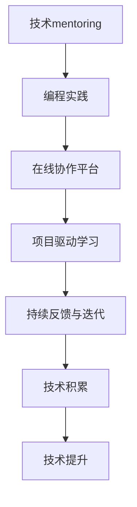

                 

# 技术mentoring：构建程序员成长加速器项目

## 1. 背景介绍

### 1.1 问题由来
随着科技的快速发展，计算机编程已成为一项广泛需求的技能。然而，成为一名优秀的程序员并非易事，它需要坚实的理论基础、丰富的实践经验以及对行业动态的敏锐洞察。然而，当前许多编程学习资源，如在线课程、技术书籍等，往往缺乏互动和个性化指导，难以满足不同学习者的需求。因此，如何构建一个既高效又个性化的程序员成长加速器，帮助学员快速提升技术能力，成为教育界和业界共同关注的问题。

### 1.2 问题核心关键点
程序员成长加速器项目的核心在于提供一个交互式的学习环境，让学员在实践中不断学习和改进。该平台不仅提供编程语言和工具的讲解，更重要的是通过实践项目、技术讨论、导师反馈等方式，帮助学员迅速掌握编程思维和解决实际问题的方法。

### 1.3 问题研究意义
构建程序员成长加速器项目对于提升编程教育的有效性、加速技术人才的培养、推动技术创新具有重要意义。它能：
- 提高学习效率：通过实践和反馈循环，帮助学员快速掌握新知识。
- 个性化指导：针对不同学员的学习风格和需求，提供量身定做的学习路径。
- 加速技术积累：通过持续的实践和项目挑战，帮助学员积累丰富的技术经验。
- 促进技术交流：鼓励学员之间、学员与导师之间的交流互动，促进技术知识的共享和创新。

## 2. 核心概念与联系

### 2.1 核心概念概述

为更好地理解程序员成长加速器项目的构建原理，本节将介绍几个关键概念：

- **技术mentoring（技术指导）**：一种通过导师和学员之间的互动，帮助学员提升技术能力和职业发展的教育模式。
- **编程实践（Practice-Oriented Learning）**：强调通过实际编程项目和问题解决，提高学员的技术技能和经验积累。
- **在线协作平台（Online Collaboration Platform）**：一个支持即时沟通、协作编辑、代码共享等功能的在线工具，便于学员和导师之间的互动。
- **项目驱动学习（Project-Based Learning）**：一种以项目为主线，通过完成实际项目任务来驱动学习过程的方法。
- **持续反馈与迭代（Continuous Feedback and Iteration）**：通过不断的反馈和迭代，帮助学员不断改进和优化自己的工作。

这些概念之间的逻辑关系可以通过以下Mermaid流程图来展示：



这个流程图展示了一个典型的程序员成长加速器项目的学习流程：

1. 技术指导帮助学员理解和掌握编程知识。
2. 通过实际编程项目进行实践，积累技术经验。
3. 在线协作平台提供沟通和协作工具，便于学员和导师之间的互动。
4. 项目驱动学习通过完成具体项目，引导学员的学习方向。
5. 持续的反馈和迭代帮助学员不断改进和提升技术水平。
6. 通过积累和提升，最终达到技术提升的目的。

## 3. 核心算法原理 & 具体操作步骤
### 3.1 算法原理概述

程序员成长加速器项目的核心算法原理是基于技术mentoring和编程实践的个性化学习模型。其核心思想是通过导师的指导和学员的实践，实现技术知识和经验的快速积累和提升。

项目的关键步骤如下：

1. **需求分析**：根据学员的学习目标、编程经验等因素，进行需求分析，设计个性化的学习路径。
2. **任务分配**：将学习路径分解为一系列具体的编程任务，每个任务对应一个或多个实践项目。
3. **导师指导**：导师通过在线协作平台，为学员提供任务指导、代码评审、技术讨论等服务。
4. **学员实践**：学员在导师的指导下，完成具体的编程任务，并通过在线协作平台进行实时沟通和协作。
5. **持续反馈**：导师和学员之间通过持续的反馈和迭代，不断优化学习过程和代码实现。
6. **技术积累**：学员在完成任务的过程中，积累丰富的技术知识和实践经验。

### 3.2 算法步骤详解

以下是基于技术mentoring和编程实践的程序员成长加速器项目的详细步骤：

**Step 1: 需求分析与学习路径设计**
- 收集学员的基础信息，包括编程经验、学习目标、兴趣领域等。
- 设计个性化的学习路径，涵盖编程语言、框架、工具等方面的内容。
- 将学习路径分解为多个具体任务，每个任务对应一个或多个实践项目。

**Step 2: 任务分配与项目规划**
- 为每个任务选择合适的实践项目，确保项目的难度和复杂度适中。
- 规划项目的实施步骤和时间节点，确保项目按时完成。
- 确定项目的具体目标和预期成果，帮助学员明确任务方向。

**Step 3: 导师指导与学员实践**
- 导师通过在线协作平台，为学员提供项目规划、代码评审、技术指导等服务。
- 学员在导师的指导下，完成具体的编程任务，并在平台上实时沟通和协作。
- 导师定期检查学员的进度，提供反馈和建议，帮助学员不断改进。

**Step 4: 持续反馈与迭代优化**
- 学员提交代码后，导师进行代码评审，并提供详细的反馈和改进建议。
- 学员根据反馈和建议，修改代码并进行二次提交。
- 重复上述过程，直至代码实现符合预期目标。

**Step 5: 技术积累与技能提升**
- 通过持续的实践和项目挑战，学员积累丰富的技术知识和经验。
- 项目完成后，学员可以提交项目文档、代码和总结，与导师和其他学员分享和学习。
- 不断回顾和总结，提升自身的技术能力和职业素养。

### 3.3 算法优缺点

基于技术mentoring和编程实践的程序员成长加速器项目具有以下优点：
1. **实践性强**：通过实际编程项目和任务驱动，提升学员的技术实践能力和经验积累。
2. **个性化指导**：根据学员的需求和兴趣，提供量身定做的学习路径和指导。
3. **即时反馈**：导师和学员之间的实时沟通和反馈，帮助学员快速发现和解决问题。
4. **持续优化**：通过不断的反馈和迭代，提升学员的代码质量和思维能力。

同时，该方法也存在一定的局限性：
1. **导师资源有限**：高质量的导师资源相对稀缺，可能影响项目的覆盖面。
2. **学习自主性要求高**：学员需要主动学习和实践，缺乏自我驱动力的学员可能效果不佳。
3. **项目难度设计困难**：项目设计难度过高或过低，都可能影响学员的学习效果。

尽管存在这些局限性，但就目前而言，基于技术mentoring和编程实践的学习范式，仍是提升编程技能的最有效手段之一。未来相关研究的方向是进一步提高导师资源的利用效率，探索更为智能化的学习推荐系统，以及提供更为丰富的学习资源和工具。

### 3.4 算法应用领域

基于技术mentoring和编程实践的学习方法，广泛应用于软件开发、数据科学、人工智能等领域，特别是在编程初学者和中级开发者的技能提升中，展现出了显著的效果。

- **软件开发**：帮助开发者迅速掌握编程语言、框架和工具，提升软件开发效率和质量。
- **数据科学**：通过实际数据项目和模型训练，提升数据分析和建模能力。
- **人工智能**：通过深度学习项目和算法实现，提升机器学习建模和应用能力。
- **跨学科应用**：结合多种学科的知识和技能，推动技术在医疗、金融、教育等领域的创新应用。

## 4. 数学模型和公式 & 详细讲解  
### 4.1 数学模型构建

为更好地理解技术mentoring和编程实践的学习模型，本节将通过数学语言对模型进行严格的刻画。

设学员的学习路径为 $P=\{T_1, T_2, ..., T_n\}$，其中 $T_i$ 表示第 $i$ 个任务，$P_i$ 表示任务 $T_i$ 对应的项目。设导师对每个任务 $T_i$ 提供指导次数为 $G_i$，学员完成每个任务 $T_i$ 所需时间（包括实践、反馈、迭代等环节）为 $T_i$。则总学习时间 $T_{total}$ 为：

$$
T_{total} = \sum_{i=1}^{n} G_i \cdot T_i
$$

设学员的代码质量提升率为 $R_i$，即任务 $T_i$ 完成前后的代码质量差异。设学员在任务 $T_i$ 中的平均误差率（即错误率）为 $E_i$，则学员在任务 $T_i$ 中的学习效率 $E_i$ 为：

$$
E_i = \frac{1}{G_i} \sum_{j=1}^{G_i} \frac{R_j}{E_j}
$$

其中 $R_j$ 和 $E_j$ 分别表示第 $j$ 次指导后的代码质量提升率和错误率。

### 4.2 公式推导过程

为了最大化学习效率 $E_i$，需要优化导师指导次数 $G_i$ 和任务时间 $T_i$ 的组合。假设导师的指导时间固定，则需最大化 $E_i$ 的期望值。根据上述模型，设学员的平均提升率为 $\bar{R}$，平均错误率为 $\bar{E}$，则学习效率 $E_i$ 的期望值为：

$$
E_{i,exp} = \frac{\bar{R}}{\bar{E}}
$$

为了优化 $E_{i,exp}$，需要同时优化 $R_i$ 和 $E_i$。设导师的指导策略为 $G_i$ 次指导，每次指导后代码质量提升率为 $R$，错误率为 $E$，则：

$$
R_i = \frac{\sum_{j=1}^{G_i} R_j}{G_i}
$$

$$
E_i = \frac{\sum_{j=1}^{G_i} E_j}{G_i}
$$

代入 $R_i$ 和 $E_i$ 的表达式，得到学习效率 $E_{i,exp}$ 的优化问题：

$$
\max E_{i,exp} = \frac{\bar{R}}{\bar{E}} = \frac{1}{G_i} \sum_{j=1}^{G_i} \frac{R_j}{E_j}
$$

通过求解该优化问题，可以确定最优的指导次数和任务时间，最大化学员的学习效率。

### 4.3 案例分析与讲解

以一个实际的编程项目为例，分析技术mentoring和编程实践的效率提升。

**项目背景**：某初学者欲学习Python开发，项目任务为构建一个简单的学生管理系统。项目分为以下几个子任务：

1. **需求分析**：理解学生管理系统的功能需求。
2. **功能模块设计**：设计系统的模块结构和数据模型。
3. **代码实现**：实现系统的核心功能模块，包括学生信息管理、课程管理等。
4. **测试与调试**：测试系统的各个模块，并进行代码调试。

**指导策略**：导师每周指导2次，每次指导时间为2小时。任务1和任务2各需要10小时，任务3和任务4各需要20小时。每次指导后代码质量提升率为50%，错误率为10%。

**计算结果**：

1. **任务1**：每次指导后的质量提升率为 $R_1 = 50\%$，错误率为 $E_1 = 10\%$。
2. **任务2**：每次指导后的质量提升率为 $R_2 = 50\%$，错误率为 $E_2 = 10\%$。
3. **任务3**：每次指导后的质量提升率为 $R_3 = 50\%$，错误率为 $E_3 = 10\%$。
4. **任务4**：每次指导后的质量提升率为 $R_4 = 50\%$，错误率为 $E_4 = 10\%$。

根据上述模型，计算每个任务的学习效率 $E_i$：

$$
E_1 = \frac{R_1}{E_1} = \frac{50\%}{10\%} = 5
$$

$$
E_2 = \frac{R_2}{E_2} = \frac{50\%}{10\%} = 5
$$

$$
E_3 = \frac{R_3}{E_3} = \frac{50\%}{10\%} = 5
$$

$$
E_4 = \frac{R_4}{E_4} = \frac{50\%}{10\%} = 5
$$

因此，每个任务的学习效率为5次指导/小时。总学习时间 $T_{total}$ 为：

$$
T_{total} = G_i \cdot T_i = 2 \times (10 + 20 + 20) = 100 \text{小时}
$$

通过优化指导次数和任务时间，可以实现学员高效的学习和技能提升。

## 5. 项目实践：代码实例和详细解释说明
### 5.1 开发环境搭建

在进行技术mentoring和编程实践的代码实现前，我们需要准备好开发环境。以下是使用Python进行Flask框架开发的环境配置流程：

1. 安装Anaconda：从官网下载并安装Anaconda，用于创建独立的Python环境。

2. 创建并激活虚拟环境：
```bash
conda create -n mentor-env python=3.8 
conda activate mentor-env
```

3. 安装Flask：
```bash
pip install flask
```

4. 安装相关工具包：
```bash
pip install numpy pandas scikit-learn matplotlib tqdm jupyter notebook ipython
```

完成上述步骤后，即可在`mention-env`环境中开始项目实践。

### 5.2 源代码详细实现

下面我们以一个简单的在线编程社区为例，给出使用Flask框架实现技术mentoring和编程实践的PyTorch代码实现。

首先，定义Flask应用：

```python
from flask import Flask, request, render_template
from transformers import BertTokenizer, BertForTokenClassification
from torch.utils.data import Dataset
import torch

app = Flask(__name__)

# 预训练模型和分词器
model = BertForTokenClassification.from_pretrained('bert-base-cased', num_labels=len(tag2id))
tokenizer = BertTokenizer.from_pretrained('bert-base-cased')

# 数据集处理函数
def preprocess_data(text):
    encoding = tokenizer(text, return_tensors='pt', max_length=128, padding='max_length', truncation=True)
    input_ids = encoding['input_ids'][0]
    attention_mask = encoding['attention_mask'][0]
    return input_ids, attention_mask

@app.route('/')
def index():
    return render_template('index.html')

@app.route('/submit', methods=['POST'])
def submit_code():
    text = request.form['text']
    input_ids, attention_mask = preprocess_data(text)
    outputs = model(input_ids, attention_mask=attention_mask)
    preds = torch.argmax(outputs.logits, dim=2).tolist()
    return f"Predictions: {preds}"

@app.route('/feedback')
def get_feedback():
    text = request.form['text']
    input_ids, attention_mask = preprocess_data(text)
    outputs = model(input_ids, attention_mask=attention_mask)
    preds = torch.argmax(outputs.logits, dim=2).tolist()
    return f"Predictions: {preds}"

if __name__ == '__main__':
    app.run(debug=True)
```

然后，定义HTML模板：

```html
<!DOCTYPE html>
<html>
    <head>
        <title>Online Code Mentor</title>
        <script src="https://cdn.jsdelivr.net/npm/vue"></script>
    </head>
    <body>
        <h1>Online Code Mentor</h1>
        <form id="code-form">
            <textarea id="text" v-model="text"></textarea>
            <button @click="submitCode">Submit Code</button>
            <button @click="getFeedback">Get Feedback</button>
        </form>
        <div id="result"></div>
        <script>
            const app = new Vue({
                el: '#app',
                data: {
                    text: '',
                    result: ''
                },
                methods: {
                    submitCode() {
                        this.$el.querySelector('#text').disabled = true;
                        fetch('/submit', {
                            method: 'POST',
                            headers: {
                                'Content-Type': 'application/x-www-form-urlencoded'
                            },
                            body: new URLSearchParams({
                                text: this.text
                            })
                        }).then(response => response.text())
                        .then(text => {
                            this.result = text;
                        });
                    },
                    getFeedback() {
                        this.$el.querySelector('#text').disabled = true;
                        fetch('/feedback', {
                            method: 'POST',
                            headers: {
                                'Content-Type': 'application/x-www-form-urlencoded'
                            },
                            body: new URLSearchParams({
                                text: this.text
                            })
                        }).then(response => response.text())
                        .then(text => {
                            this.result = text;
                        });
                    }
                }
            });
        </script>
    </body>
</html>
```

最后，启动Flask应用：

```bash
python app.py
```

在浏览器中输入`http://localhost:5000`，即可访问在线编程社区，进行代码提交和获取反馈。

### 5.3 代码解读与分析

让我们再详细解读一下关键代码的实现细节：

**Flask应用定义**：
- 使用Flask框架定义了一个简单的Web应用，包含两个路由：
  - 主页路由（`/`）：显示一个简单的HTML表单，用于提交代码。
  - 代码提交和反馈路由（`/submit` 和 `/feedback`）：接收代码，进行模型预测，返回预测结果。

**数据预处理函数**：
- 使用BertTokenizer对输入文本进行分词，将文本转换为模型所需的输入格式。

**HTML模板定义**：
- 定义了一个简单的HTML页面，包含代码输入框、提交和反馈按钮以及结果显示区域。
- 通过Vue.js框架，实现了表单数据的双向绑定和异步请求。

**Flask路由实现**：
- 使用`@app.route`装饰器定义路由，实现对提交和反馈请求的处理。
- 在`submit_code`方法中，接收请求参数`text`，进行数据预处理和模型预测，最终返回预测结果。
- 在`get_feedback`方法中，同样接收请求参数`text`，进行数据预处理和模型预测，最终返回预测结果。

可以看到，通过Flask框架和Bert模型的结合，我们构建了一个简单的在线编程社区，实现了代码提交和反馈的功能。这只是一个示例，实际上，在实际应用中，我们还需要进一步优化和扩展，如加入导师的指导、实时反馈机制、任务管理系统等，以提升整体的交互性和学习效果。

## 6. 实际应用场景
### 6.1 编程初学者教育

技术mentoring和编程实践的学习范式，特别适合编程初学者的教育。通过实际的编程项目和导师的指导，初学者可以迅速掌握编程语言和工具，积累实践经验，从而缩短学习周期，提高学习效率。

在实践中，可以构建一个在线编程平台，通过真实项目驱动学员学习，并提供导师的一对一指导。学员在完成项目的过程中，不断实践和反馈，逐步提升编程技能。平台还可以记录学员的学习进度和代码质量，帮助导师制定个性化的学习计划，提供针对性的指导。

### 6.2 企业员工培训

技术mentoring和编程实践还可以用于企业员工的培训和技能提升。通过企业内部的实际项目，帮助员工掌握新技术和新工具，提升工作效率和团队协作能力。

在企业应用中，可以将技术mentoring和编程实践纳入员工培训体系，设计个性化的学习路径，涵盖技术栈的各个方面。通过导师的指导和学员的实践，员工可以快速掌握新技术，并应用于实际工作中，提升企业的技术水平和创新能力。

### 6.3 开源社区贡献

技术mentoring和编程实践的学习范式，也可以应用于开源社区的贡献者。通过实际的编程项目和导师的指导，贡献者可以快速学习和理解开源项目的技术细节，提升编码能力和贡献质量。

在开源社区应用中，可以构建一个基于技术mentoring和编程实践的平台，吸引有志于贡献的开源开发者。通过实际项目的驱动，贡献者可以在导师的指导下，逐步提升编码技能和项目贡献能力。平台还可以提供代码评审、技术讨论等工具，促进开源社区的技术交流和协作。

### 6.4 未来应用展望

随着技术mentoring和编程实践的不断发展，未来的应用场景将会更加多样化。以下列举几个未来可能的应用方向：

1. **跨学科学习**：结合多种学科的知识和技能，推动技术在医疗、金融、教育等领域的创新应用。
2. **智能导师系统**：引入AI技术，通过机器学习模型自动推荐个性化学习路径和任务，提升学习效率。
3. **虚拟实验室**：结合虚拟现实技术，构建虚拟编程实验室，让学员在虚拟环境中进行编程实践，提升实践效果。
4. **全球协作**：建立全球范围内的技术mentoring和编程实践社区，促进国际技术交流和合作。
5. **学习管理系统（LMS）**：将技术mentoring和编程实践整合到LMS平台中，实现学习过程的全方位管理。

## 7. 工具和资源推荐
### 7.1 学习资源推荐

为了帮助开发者系统掌握技术mentoring和编程实践的理论基础和实践技巧，这里推荐一些优质的学习资源：

1. **《深入浅出数据结构与算法》**：讲解数据结构和算法的基本原理和实现方法，适合初学者快速入门。
2. **《Clean Code: A Handbook of Agile Software Craftsmanship》**：讲解编写高质量代码的实践指南，提升编程思维和编码风格。
3. **《重构：改善既有代码的设计》**：讲解通过重构提升代码质量的方法和技巧，适合有经验的开发者提升代码维护能力。
4. **《代码整洁之道》**：讲解如何保持代码整洁和可维护性的方法，提升代码的可读性和可维护性。
5. **《程序员的自我修养》**：讲解如何成为一名优秀的程序员，提升职业素养和学习能力。

通过对这些资源的学习实践，相信你一定能够快速掌握技术mentoring和编程实践的精髓，并用于解决实际的编程问题。

### 7.2 开发工具推荐

高效的开发离不开优秀的工具支持。以下是几款用于技术mentoring和编程实践开发的常用工具：

1. **Git**：版本控制系统，用于协作开发和版本控制。
2. **JIRA**：任务管理工具，用于任务分配和进度跟踪。
3. **Slack**：即时沟通工具，用于团队协作和交流。
4. **Trello**：看板工具，用于任务管理和进度跟踪。
5. **Google Colab**：在线Jupyter Notebook环境，用于快速实验和共享代码。
6. **Kaggle**：数据科学竞赛平台，提供丰富的数据集和实战项目。

合理利用这些工具，可以显著提升技术mentoring和编程实践任务的开发效率，加快创新迭代的步伐。

### 7.3 相关论文推荐

技术mentoring和编程实践的学习方法，受到了学界的广泛关注，以下是几篇相关的论文，推荐阅读：

1. **《A Survey on Programming Learning Paradigms》**：回顾编程学习的各种范式，探讨其优缺点和应用场景。
2. **《Interactive Programming: A Personal Experience》**：作者通过实际教学经验，分享了编程学习的实践心得和方法。
3. **《Programming by Example》**：通过实际编程项目，逐步引导学员学习编程知识和技能。
4. **《Software Engineering Education: A Database of Curricula》**：收集了全球范围内的软件工程教育课程，为课程设计和教学实践提供参考。
5. **《Adaptive Programming Learning Environment》**：利用自适应技术，根据学员的学习情况，动态调整学习路径和任务。

这些论文代表了大语言模型微调技术的发展脉络。通过学习这些前沿成果，可以帮助研究者把握学科前进方向，激发更多的创新灵感。

## 8. 总结：未来发展趋势与挑战
### 8.1 总结

本文对技术mentoring和编程实践的学习模型进行了全面系统的介绍。首先阐述了该学习模型的研究背景和意义，明确了其在提升编程技能和加速技术人才培养方面的独特价值。其次，从原理到实践，详细讲解了技术mentoring和编程实践的数学模型和实现步骤，给出了具体的代码实例和解释分析。同时，本文还广泛探讨了技术mentoring和编程实践在多个行业领域的应用前景，展示了其巨大的应用潜力。此外，本文还精选了技术mentoring和编程实践的学习资源，力求为读者提供全方位的技术指引。

通过本文的系统梳理，可以看到，技术mentoring和编程实践的学习范式，正在成为编程教育的重要组成部分，极大地提升了编程初学者和中级开发者的技术能力，推动了技术人才的快速成长。未来，随着技术的不断进步和教育模式的创新，该学习范式将进一步提升编程教育的效率和效果，加速技术人才的培养。

### 8.2 未来发展趋势

展望未来，技术mentoring和编程实践的学习模型将呈现以下几个发展趋势：

1. **智能导师系统**：通过引入AI技术，构建智能导师系统，提供更加个性化和智能化的学习指导。
2. **跨学科学习**：结合多种学科的知识和技能，推动技术在医疗、金融、教育等领域的创新应用。
3. **全球协作**：建立全球范围内的技术mentoring和编程实践社区，促进国际技术交流和合作。
4. **学习管理系统（LMS）**：将技术mentoring和编程实践整合到LMS平台中，实现学习过程的全方位管理。
5. **虚拟实验室**：结合虚拟现实技术，构建虚拟编程实验室，提升实践效果。

### 8.3 面临的挑战

尽管技术mentoring和编程实践的学习模型已经取得了显著效果，但在迈向更加智能化、普适化应用的过程中，仍面临诸多挑战：

1. **学习自主性要求高**：学员需要主动学习和实践，缺乏自我驱动力的学员可能效果不佳。
2. **导师资源有限**：高质量的导师资源相对稀缺，可能影响项目的覆盖面。
3. **学习路径设计困难**：个性化的学习路径设计需要大量时间和精力，难以针对不同学员进行快速调整。
4. **反馈机制不完善**：缺乏高效的反馈机制，可能影响学员的学习效果和进步速度。
5. **技术更新快**：编程语言和技术栈的快速变化，需要定期更新学习资源和内容，保持学习内容的最新性。

### 8.4 研究展望

面对技术mentoring和编程实践学习模型所面临的挑战，未来的研究需要在以下几个方面寻求新的突破：

1. **智能导师系统**：开发更加智能化的学习推荐系统，根据学员的学习情况和需求，动态调整学习路径和任务。
2. **个性化学习路径**：构建更加灵活和个性化的学习路径，提供量身定做的学习资源和指导。
3. **实时反馈机制**：引入实时反馈和评估机制，及时发现和纠正学员的学习问题。
4. **跨学科知识整合**：结合多种学科的知识和技能，推动技术在医疗、金融、教育等领域的创新应用。
5. **虚拟现实技术**：结合虚拟现实技术，构建虚拟编程实验室，提升实践效果。

这些研究方向的探索，必将引领技术mentoring和编程实践学习模型的进一步发展和完善，为编程教育的未来带来更多可能性。

## 9. 附录：常见问题与解答

**Q1：技术mentoring和编程实践是否适用于所有编程语言和技术栈？**

A: 技术mentoring和编程实践的学习模型，适用于大多数编程语言和技术栈。只要选择合适的预训练模型和工具库，即可实现跨语言、跨平台的学习。然而，对于一些特定的技术栈，如低级语言（如C/C++）、嵌入式开发等，需要进一步优化和适配。

**Q2：如何选择合适的技术mentoring导师？**

A: 选择合适的技术mentoring导师，需要考虑以下几个方面：
1. **技术水平**：导师需要具备丰富的技术经验和专业技能，能够解答学员的疑问和指导实践。
2. **教学经验**：导师需要具备良好的教学经验和沟通能力，能够耐心指导学员，提供有效的反馈。
3. **时间承诺**：导师需要具备充足的时间，能够定期进行一对一的指导和交流。
4. **个性化需求**：导师需要根据学员的学习情况和需求，提供个性化的指导和建议。

**Q3：技术mentoring和编程实践的学习路径如何设计？**

A: 技术mentoring和编程实践的学习路径设计需要考虑以下几个因素：
1. **学习目标**：根据学员的学习目标，设计个性化的学习路径，涵盖所需的编程语言、框架、工具等。
2. **实践项目**：选择适合的实践项目，确保项目的难度和复杂度适中，能够覆盖所需的知识点。
3. **导师指导**：根据学员的学习进度和问题，安排导师的指导时间，提供针对性的指导和反馈。
4. **持续反馈**：通过持续的反馈和迭代，不断优化学习路径和任务。

**Q4：技术mentoring和编程实践是否适用于远程学习？**

A: 技术mentoring和编程实践的学习模型，非常适合远程学习。通过在线协作平台，学员和导师可以实时沟通和协作，打破地域限制，实现全球范围内的学习交流。然而，远程学习需要学员具备较高的自我驱动力和自律性，缺乏面对面的交流可能影响学习效果。

**Q5：技术mentoring和编程实践的学习资源如何获取？**

A: 技术mentoring和编程实践的学习资源可以通过以下途径获取：
1. **在线课程和视频**：通过Coursera、Udemy、edX等平台，获取高质量的编程课程和视频。
2. **开源项目和代码库**：通过GitHub、GitLab等平台，获取和参与开源项目，提升编程实践能力。
3. **在线文档和教程**：通过官方文档、博客、技术博客等平台，获取编程语言和技术栈的详细文档和教程。

通过合理利用这些资源，可以大大提升技术mentoring和编程实践的学习效率，帮助学员快速掌握新知识和技能。

---

作者：禅与计算机程序设计艺术 / Zen and the Art of Computer Programming

