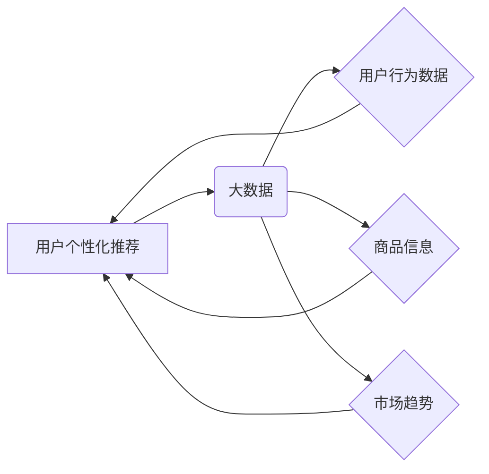

> 用户个性化推荐，大数据，电商平台，协同过滤，内容过滤，机器学习，推荐算法

## 1. 背景介绍

随着电商平台的蓬勃发展，用户数量的激增和商品种类繁多的特点，如何精准地推荐用户感兴趣的商品成为了电商平台的核心竞争力之一。传统的推荐方法往往依赖于商品的类别、标签等静态信息，难以满足用户个性化需求。而基于大数据的个性化推荐，通过挖掘用户行为、偏好等动态信息，能够提供更精准、更个性化的商品推荐，提升用户体验，促进交易转化。

## 2. 核心概念与联系

**2.1 用户个性化推荐**

用户个性化推荐是指根据用户的历史行为、偏好、兴趣等信息，为用户推荐个性化的商品或服务。其目标是提高用户满意度、提升用户粘性，最终促进平台的商业目标。

**2.2 大数据**

大数据是指海量、高速、多样化的数据，其特点是体量庞大、速度快、类型多样，需要借助强大的计算能力和分析技术进行处理和挖掘。电商平台积累了大量的用户行为数据、商品信息、市场趋势等数据，这些数据蕴含着丰富的价值，可以为用户个性化推荐提供重要的支撑。

**2.3 核心概念关系图**



## 3. 核心算法原理 & 具体操作步骤

**3.1 算法原理概述**

用户个性化推荐算法主要分为两大类：协同过滤和内容过滤。

* **协同过滤**：基于用户的相似度或商品的相似度进行推荐。例如，如果用户A和用户B都喜欢购买相同的商品，那么当用户A浏览商品C时，系统会推荐商品C给用户B。
* **内容过滤**：根据用户的兴趣偏好和商品的特征进行推荐。例如，如果用户A喜欢购买运动类商品，那么系统会推荐其他运动类商品给用户A。

**3.2 算法步骤详解**

**协同过滤算法步骤：**

1. 收集用户行为数据，例如用户对商品的评分、购买记录等。
2. 计算用户之间的相似度，可以使用余弦相似度、皮尔逊相关系数等方法。
3. 根据用户之间的相似度，找到与目标用户相似的用户。
4. 从相似用户的推荐列表中，选择评分较高或购买频率高的商品进行推荐。

**内容过滤算法步骤：**

1. 收集商品的特征信息，例如商品类别、品牌、价格等。
2. 建立用户兴趣模型，例如使用词袋模型、TF-IDF等方法。
3. 计算商品特征与用户兴趣模型之间的相似度。
4. 根据相似度排序，推荐与用户兴趣相符的商品。

**3.3 算法优缺点**

**协同过滤算法：**

* **优点：**能够发现用户之间的隐性关联，推荐更精准的商品。
* **缺点：**数据稀疏性问题，当用户行为数据不足时，算法效果会下降。

**内容过滤算法：**

* **优点：**不需要用户行为数据，可以根据商品特征进行推荐。
* **缺点：**推荐结果可能过于单一，缺乏个性化。

**3.4 算法应用领域**

用户个性化推荐算法广泛应用于电商平台、视频网站、音乐平台等领域，例如：

* **电商平台：**推荐商品、优惠券、促销活动等。
* **视频网站：**推荐视频、电视剧、电影等。
* **音乐平台：**推荐歌曲、专辑、音乐人等。

## 4. 数学模型和公式 & 详细讲解 & 举例说明

**4.1 数学模型构建**

协同过滤算法中，常用的相似度计算方法是余弦相似度。

**4.2 公式推导过程**

设用户i和用户j的评分向量分别为u_i和u_j，则用户i和用户j的余弦相似度为：

$$
sim(u_i, u_j) = \frac{u_i \cdot u_j}{||u_i|| ||u_j||}
$$

其中：

* $u_i \cdot u_j$ 是用户i和用户j评分向量的点积。
* $||u_i||$ 和 $||u_j||$ 分别是用户i和用户j评分向量的模长。

**4.3 案例分析与讲解**

假设有两个用户A和B，他们的评分向量分别为：

* $u_A = [5, 4, 3, 2, 1]$
* $u_B = [4, 3, 2, 1, 5]$

则用户A和用户B的余弦相似度为：

$$
sim(u_A, u_B) = \frac{5 \cdot 4 + 4 \cdot 3 + 3 \cdot 2 + 2 \cdot 1 + 1 \cdot 5}{\sqrt{5^2 + 4^2 + 3^2 + 2^2 + 1^2} \sqrt{4^2 + 3^2 + 2^2 + 1^2 + 5^2}} = 0.8
$$

结果表明，用户A和用户B的相似度为0.8，说明他们具有较高的相似性。

## 5. 项目实践：代码实例和详细解释说明

**5.1 开发环境搭建**

* 操作系统：Windows/Linux/macOS
* Python版本：3.6+
* 依赖库：pandas, numpy, scikit-learn

**5.2 源代码详细实现**

```python
import pandas as pd
from sklearn.metrics.pairwise import cosine_similarity

# 加载用户评分数据
ratings_data = pd.read_csv('ratings.csv')

# 计算用户之间的余弦相似度
user_similarity = cosine_similarity(ratings_data)

# 获取用户A的相似用户
user_A_id = 1
similar_users = pd.DataFrame(user_similarity[user_A_id - 1]).sort_values(ascending=False)
similar_users = similar_users[similar_users.index != user_A_id]

# 推荐商品给用户A
recommended_items = []
for user_id in similar_users.index:
    # 获取相似用户对商品的评分
    user_ratings = ratings_data[ratings_data['user_id'] == user_id]
    # 获取用户A未评分的商品
    unrated_items = ratings_data[~ratings_data['user_id'].isin([user_A_id])]
    # 找到相似用户对未评分商品的评分
    similar_user_ratings = user_ratings[user_ratings['item_id'].isin(unrated_items['item_id'])]
    # 根据相似用户评分，推荐商品给用户A
    recommended_items.extend(similar_user_ratings['item_id'].tolist())

# 去重并排序推荐商品
recommended_items = list(set(recommended_items))
recommended_items.sort()

# 打印推荐结果
print(f'推荐给用户{user_A_id}的商品：{recommended_items}')
```

**5.3 代码解读与分析**

* 代码首先加载用户评分数据，并使用scikit-learn库中的cosine_similarity函数计算用户之间的余弦相似度。
* 然后，根据目标用户ID，获取其相似用户列表。
* 接着，遍历相似用户，获取其对未评分商品的评分，并根据评分进行推荐。
* 最后，去重并排序推荐商品，并打印推荐结果。

**5.4 运行结果展示**

运行代码后，将输出用户A的推荐商品列表。

## 6. 实际应用场景

**6.1 电商平台商品推荐**

电商平台可以根据用户的浏览历史、购买记录、收藏列表等数据，使用协同过滤或内容过滤算法，推荐用户感兴趣的商品。

**6.2 视频网站视频推荐**

视频网站可以根据用户的观看历史、点赞记录、评论内容等数据，推荐用户感兴趣的视频、电视剧、电影等。

**6.3 音乐平台音乐推荐**

音乐平台可以根据用户的播放历史、收藏列表、创建的歌单等数据，推荐用户感兴趣的歌曲、专辑、音乐人等。

**6.4 未来应用展望**

随着人工智能技术的不断发展，用户个性化推荐将更加精准、智能化。未来，用户个性化推荐可能应用于更多领域，例如：

* **教育领域：**推荐个性化的学习资源和课程。
* **医疗领域：**推荐个性化的医疗方案和健康建议。
* **金融领域：**推荐个性化的理财产品和投资建议。

## 7. 工具和资源推荐

**7.1 学习资源推荐**

* **书籍：**
    * 《推荐系统实践》
    * 《机器学习》
* **在线课程：**
    * Coursera：推荐系统
    * edX：机器学习

**7.2 开发工具推荐**

* **Python：**
    * pandas
    * numpy
    * scikit-learn
* **Spark：**
    * Apache Spark

**7.3 相关论文推荐**

* 《Collaborative Filtering for Implicit Feedback Datasets》
* 《Matrix Factorization Techniques for Recommender Systems》

## 8. 总结：未来发展趋势与挑战

**8.1 研究成果总结**

基于大数据的电商平台用户个性化推荐研究取得了显著成果，例如：

* 算法精度不断提高，推荐结果更加精准。
* 推荐场景更加丰富，应用领域更加广泛。
* 推荐系统更加智能化，能够根据用户的实时反馈进行动态调整。

**8.2 未来发展趋势**

* **深度学习：**将深度学习技术应用于用户个性化推荐，提升推荐效果。
* **多模态推荐：**融合文本、图像、视频等多模态数据，构建更全面的用户画像，实现更精准的推荐。
* **个性化解释：**为用户提供推荐结果的解释，提升用户信任度。

**8.3 面临的挑战**

* **数据稀疏性：**用户行为数据往往存在稀疏性，需要采用有效的处理方法。
* **冷启动问题：**对于新用户和新商品，缺乏历史数据，难以进行推荐。
* **公平性问题：**推荐算法可能存在偏见，导致推荐结果不公平。

**8.4 研究展望**

未来，用户个性化推荐研究将继续深入，探索更精准、更智能、更公平的推荐算法，为用户提供更优质的体验。

## 9. 附录：常见问题与解答

**9.1 如何解决数据稀疏性问题？**

* 使用矩阵分解技术，将用户评分矩阵分解成低维矩阵，降低数据维度。
* 使用协同过滤算法中的基于内容的过滤方法，利用商品特征信息进行推荐。
* 使用混合推荐算法，结合协同过滤和内容过滤算法，提升推荐效果。

**9.2 如何解决冷启动问题？**

* 利用用户注册信息、商品描述信息等辅助信息进行推荐。
* 使用基于内容的过滤方法，推荐与用户兴趣相符的商品。
* 使用基于模型的推荐方法，例如基于用户的协同过滤模型，预测用户对新商品的评分。

**9.3 如何保证推荐结果的公平性？**

* 使用公平性度量指标，评估推荐算法的公平性。
* 使用公平性约束条件，在训练推荐算法时，限制算法的偏见。
* 提供用户反馈机制，允许用户对推荐结果进行评价，并根据用户反馈进行调整。


作者：禅与计算机程序设计艺术 / Zen and the Art of Computer Programming 
<end_of_turn>