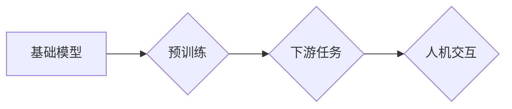

> 基础模型、人机交互、自然语言处理、多模态交互、生成式AI、Transformer模型、预训练模型、微调

## 1. 背景介绍

近年来，人工智能领域取得了令人瞩目的进展，其中基础模型扮演着越来越重要的角色。基础模型是指在海量数据上进行预训练的强大通用模型，具备强大的泛化能力和适应性，能够在各种下游任务中表现出色。

人机交互是人工智能发展的重要方向之一，旨在实现人与机器之间更加自然、流畅、智能的交互方式。传统的基于规则的人机交互方式受限于规则的复杂性和可扩展性，而基于深度学习的人机交互方式则能够更好地理解和响应用户的意图，提供更加个性化和智能化的交互体验。

基础模型的强大能力为更智能、更自然的**人机交互**提供了新的可能性。

## 2. 核心概念与联系

**2.1 基础模型**

基础模型是指在海量数据上进行预训练的强大通用模型，具备强大的泛化能力和适应性，能够在各种下游任务中表现出色。常见的基础模型包括：

* **语言模型:** 例如GPT-3、BERT、LaMDA等，能够理解和生成人类语言。
* **图像模型:** 例如DALL-E 2、Stable Diffusion、Imagen等，能够生成逼真的图像和视频。
* **多模态模型:** 例如FLAN-T5、CLIP等，能够理解和生成多种模态的数据，例如文本、图像、音频等。

**2.2 人机交互**

人机交互是指人与计算机之间进行信息交换和操作的交互过程。常见的交互方式包括：

* **文本交互:** 通过键盘或语音输入文本指令，并接收文本形式的回复。
* **图形交互:** 通过鼠标或触摸屏操作图形界面，例如点击、拖动、缩放等。
* **语音交互:** 通过语音输入指令，并接收语音或文本形式的回复。

**2.3 核心概念联系**

基础模型可以为各种人机交互方式提供强大的支持。例如：

* **文本交互:** 基于语言模型的聊天机器人能够进行更加自然、流畅的对话，并能够理解用户的复杂意图。
* **图形交互:** 基于图像模型的系统能够识别图像中的物体和场景，并根据用户的指令进行操作。
* **语音交互:** 基于语音模型的语音助手能够理解用户的语音指令，并执行相应的操作。

**2.4  Mermaid 流程图**



## 3. 核心算法原理 & 具体操作步骤

### 3.1  算法原理概述

基础模型的训练主要基于深度学习算法，特别是Transformer模型。Transformer模型通过自注意力机制能够捕捉文本序列中的长距离依赖关系，从而实现更准确的语言理解和生成。

### 3.2  算法步骤详解

1. **数据预处理:** 将原始数据进行清洗、格式化和编码，例如将文本数据转换为词向量。
2. **模型训练:** 使用深度学习框架（例如TensorFlow或PyTorch）训练Transformer模型，并使用海量数据进行预训练。
3. **模型微调:** 将预训练好的模型微调到特定的下游任务，例如文本分类、机器翻译或对话系统。

### 3.3  算法优缺点

**优点:**

* 强大的泛化能力：预训练模型能够在各种下游任务中表现出色。
* 适应性强：能够适应不同的数据分布和任务需求。
* 效率高：预训练模型可以节省训练时间和资源。

**缺点:**

* 计算资源需求高：训练大型基础模型需要大量的计算资源。
* 数据依赖性强：模型性能取决于训练数据的质量和数量。
* 潜在的偏见问题：模型可能继承训练数据中的偏见。

### 3.4  算法应用领域

基础模型在各个领域都有广泛的应用，例如：

* **自然语言处理:** 文本分类、机器翻译、问答系统、文本生成等。
* **计算机视觉:** 图像识别、物体检测、图像生成等。
* **语音识别:** 语音转文本、语音合成等。
* **多模态交互:** 图文对话、视频理解等。

## 4. 数学模型和公式 & 详细讲解 & 举例说明

### 4.1  数学模型构建

Transformer模型的核心是自注意力机制，其数学模型可以表示为：

$$
Attention(Q, K, V) = \frac{exp(Q \cdot K^T / \sqrt{d_k})}{exp(Q \cdot K^T / \sqrt{d_k})} \cdot V
$$

其中：

* $Q$：查询矩阵
* $K$：键矩阵
* $V$：值矩阵
* $d_k$：键向量的维度

### 4.2  公式推导过程

自注意力机制通过计算查询向量与键向量的点积，并使用softmax函数进行归一化，从而得到每个键向量对查询向量的注意力权重。然后，将注意力权重与值向量进行加权求和，得到最终的输出。

### 4.3  案例分析与讲解

例如，在机器翻译任务中，查询向量可以表示源语言的词语，键向量可以表示目标语言的词语，值向量可以表示目标语言的词语嵌入。通过自注意力机制，模型可以学习到源语言词语与目标语言词语之间的关系，从而实现更准确的翻译。

## 5. 项目实践：代码实例和详细解释说明

### 5.1  开发环境搭建

* Python 3.7+
* TensorFlow 或 PyTorch
* CUDA 和 cuDNN

### 5.2  源代码详细实现

```python
import tensorflow as tf

# 定义自注意力机制
def attention(query, key, value, mask=None):
    # 计算点积
    scores = tf.matmul(query, key, transpose_b=True)
    # 归一化
    if mask is not None:
        scores += (mask * -1e9)
    scores = tf.nn.softmax(scores, axis=-1)
    # 加权求和
    output = tf.matmul(scores, value)
    return output

# 定义Transformer模型
class Transformer(tf.keras.Model):
    def __init__(self, num_layers, d_model, num_heads):
        super(Transformer, self).__init__()
        self.num_layers = num_layers
        self.d_model = d_model
        self.num_heads = num_heads
        # ...

    def call(self, inputs):
        # ...
        return outputs

# 训练模型
model = Transformer(num_layers=6, d_model=512, num_heads=8)
model.compile(optimizer='adam', loss='mse')
model.fit(train_data, train_labels, epochs=10)
```

### 5.3  代码解读与分析

* `attention()` 函数实现自注意力机制，计算查询向量与键向量的点积，并使用softmax函数进行归一化，得到注意力权重。
* `Transformer()` 类定义Transformer模型，包含多个编码器和解码器层，每个层包含多头自注意力机制和前馈神经网络。
* `model.compile()` 函数配置模型的训练参数，例如优化器和损失函数。
* `model.fit()` 函数训练模型，使用训练数据和标签进行训练。

### 5.4  运行结果展示

训练完成后，可以使用测试数据评估模型的性能，例如计算准确率、F1值等指标。

## 6. 实际应用场景

### 6.1  聊天机器人

基础模型可以用于构建更加智能、自然、流畅的聊天机器人，能够理解用户的复杂意图，并提供更加个性化的回复。

### 6.2  虚拟助手

基础模型可以用于构建虚拟助手，能够理解用户的语音指令，并执行相应的操作，例如设置闹钟、发送邮件、查询天气等。

### 6.3  文本生成

基础模型可以用于生成各种类型的文本，例如文章、故事、诗歌等，能够满足用户的创作需求。

### 6.4  未来应用展望

基础模型在人机交互领域具有巨大的潜力，未来将应用于更多场景，例如：

* **沉浸式交互:** 基于基础模型的虚拟现实和增强现实系统能够提供更加逼真的交互体验。
* **个性化学习:** 基于基础模型的教育系统能够根据用户的学习进度和风格提供个性化的学习内容。
* **跨语言沟通:** 基于基础模型的机器翻译系统能够实现更加准确、流畅的跨语言沟通。

## 7. 工具和资源推荐

### 7.1  学习资源推荐

* **书籍:**
    * 《深度学习》
    * 《Transformer模型》
* **在线课程:**
    * Coursera: 深度学习
    * Udacity: 自然语言处理
* **博客:**
    * The Gradient
    * Towards Data Science

### 7.2  开发工具推荐

* **深度学习框架:** TensorFlow, PyTorch
* **自然语言处理库:** NLTK, spaCy
* **代码托管平台:** GitHub

### 7.3  相关论文推荐

* 《Attention Is All You Need》
* 《BERT: Pre-training of Deep Bidirectional Transformers for Language Understanding》
* 《GPT-3: Language Models are Few-Shot Learners》

## 8. 总结：未来发展趋势与挑战

### 8.1  研究成果总结

基础模型在人机交互领域取得了显著进展，能够实现更加智能、自然、流畅的交互体验。

### 8.2  未来发展趋势

* **模型规模和能力的提升:** 未来基础模型将更加庞大，拥有更强的泛化能力和适应性。
* **多模态交互的融合:** 基础模型将能够理解和生成多种模态的数据，实现更加丰富的交互体验。
* **个性化和定制化的发展:** 基础模型将能够根据用户的需求进行个性化定制，提供更加符合用户偏好的交互体验。

### 8.3  面临的挑战

* **计算资源需求:** 训练大型基础模型需要大量的计算资源，这对于资源有限的机构和个人来说是一个挑战。
* **数据安全和隐私:** 基础模型的训练需要大量数据，如何保证数据的安全和隐私是一个重要的挑战。
* **伦理和社会影响:** 基础模型的应用可能会带来一些伦理和社会问题，例如算法偏见、信息操纵等，需要引起足够的重视。

### 8.4  研究展望

未来，基础模型的人机交互能力将继续得到发展，为人类社会带来更多便利和福祉。


## 9. 附录：常见问题与解答

**Q1: 基础模型的训练需要多少数据？**

A1: 基础模型的训练需要海量数据，通常需要数十亿甚至数千亿个数据点。

**Q2: 如何评估基础模型的性能？**

A2: 基础模型的性能可以通过各种指标进行评估，例如准确率、F1值、BLEU分数等。

**Q3: 如何使用基础模型进行人机交互？**

A3: 可以使用现有的基础模型库或平台，例如Hugging Face，或者自己训练和部署基础模型。

**Q4: 基础模型的应用有哪些伦理和社会问题？**

A4: 基础模型的应用可能会带来一些伦理和社会问题，例如算法偏见、信息操纵等，需要引起足够的重视。

**Q5: 未来基础模型的人机交互能力会如何发展？**

A5: 未来基础模型的人机交互能力将更加智能、自然、流畅，能够实现更加丰富的交互体验。


作者：禅与计算机程序设计艺术 / Zen and the Art of Computer Programming 
<end_of_turn>